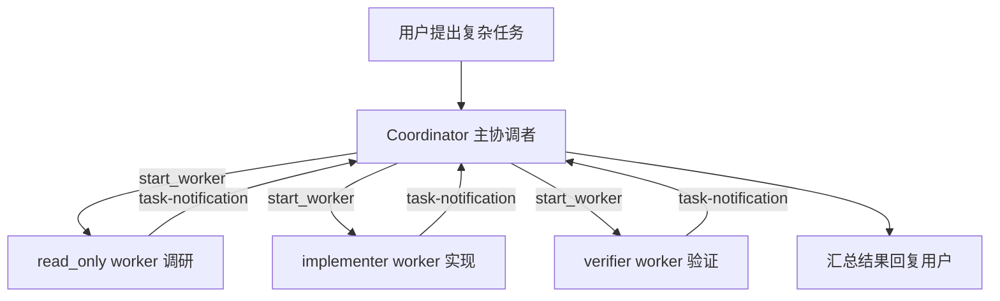

# Agent Team 使用指南

这份文档面向第一次使用 Agent Team 的同事。目标是让大家知道：Agent Team 是什么、内部怎么跑、什么时候该用、怎么发指令。

## 一句话说明

Agent Team 是“由一个主协调者管理多个 worker 的异步团队模式”。

普通聊天像一个助手从头做到尾；Agent Team 像一个小团队：主协调者负责拆任务和调度，worker 负责具体执行，完成后把结果通知回来。

## 它解决的核心问题

单个 AI 助手处理大任务时，容易出现几个问题：

- 上下文越来越长，容易混乱。
- 同时查前端、后端、测试会互相干扰。
- 实现者自己验证自己，容易漏问题。
- 用户很难看出每个分工现在进展到哪里。

Agent Team 的目标是把这些事情拆开：

- 调研交给只读 worker。
- 实现交给 implementer。
- 验证交给 verifier。
- 主协调者只负责安排和综合。

## 架构与运行机制

Agent Team 内部有两个层次：

- 主协调者：当前聊天里的主 agent，负责决策和调度。
- worker：独立运行的后台任务，有自己的上下文、角色和工具权限。

主协调者通过 worker 工具管理后台 worker：

- `start_worker`：启动新 worker。
- `continue_worker`：让已有 worker 继续处理。
- `cancel_worker`：取消 worker。

worker 完成后，不是直接把控制权抢回来，而是通过任务通知把结果发回主协调者。主协调者再决定下一步。



关键点：

- 主协调者不直接承担所有工具执行，避免上下文混乱。
- worker 有独立线程和独立报告。
- worker 的权限由 workload 决定。
- 对非平凡改动，推荐实现和验证分开。

## 和普通 Subagent 的区别

Subagent 更像“临时请一个专家回答一个问题”。

Agent Team 更像“主协调者持续管理一个团队”。

区别如下：

| 能力 | Subagent | Agent Team |
|---|---|---|
| 适合任务 | 单次调查、规划、验证 | 长任务、多角色协作 |
| 调度方式 | 主助手临时调用 | 主协调者持续调度 |
| 是否异步 | 较轻量 | 明确的后台 worker |
| 是否有 worker 状态 | 弱 | 强 |
| 是否适合实现 + 验证闭环 | 可以，但轻量 | 更适合 |

## 主要角色

### Coordinator 主协调者

主协调者负责：

- 理解用户目标。
- 判断是否需要 worker。
- 拆分任务。
- 选择 worker 角色和 workload。
- 接收 worker 通知。
- 决定继续、取消、验证或总结。

主协调者不是用来直接跑测试和改文件的。它更像团队负责人。

### implementer worker

实现型 worker。

适合：

- 修 bug。
- 改代码。
- 实现功能。
- 修改配置。
- 生成报告文件。

### verifier worker

验证型 worker。

适合：

- 跑测试。
- 跑构建。
- 做独立代码审查。
- 检查是否满足需求。
- 给出 PASS/FAIL/PARTIAL。

### read_only worker

只读 worker。

适合：

- 查代码。
- 找入口。
- 梳理链路。
- 评估风险。
- 对比方案。

## workload 是什么

workload 决定 worker 能做什么。

| workload | 能力 | 适合场景 |
|---|---|---|
| `read_only` | 只能读和运行安全只读命令 | 调研、审查、找代码 |
| `write` | 可以修改工作区文件 | 实现、修复、生成文件 |
| `verify` | 可以跑测试/构建/检查，但不直接改项目文件 | 验收、回归测试 |

这不是单纯的提示词约束，而是工具层面会收窄权限。

## 用户怎么开启 Agent Team

### 推荐方式：在页面里选择模式

在界面里选择 `Agent Team` 模式，然后输入任务。

示例：

```text
帮我修复 workflow 里偶发的 400 INVALID_TOOL_RESULTS。先调查，再修复，最后验证。
```

注意：普通聊天里只写“用 Agent Team 处理这个问题”，不会可靠地把当前线程切到 Agent Team。实际使用时，请先在页面执行模式里切到 `Agent Team`，再发送任务。

源码里还保留了一个明确前缀快捷入口：消息开头写 `#coordinator` 或 `[coordinator]` 时，会按 coordinator 模式提交。但这更像高级快捷方式，不建议作为新手文档的主入口。

### 在 Agent Team 模式下描述目标

```text
先让一个 worker 只读调研，再让 implementer 修复，最后让 verifier 验证。
```

### 明确指定分工

```text
请启动两个 read_only worker：
1. 一个查 workflow subagent 的 structured_output 链路；
2. 一个查普通聊天和 coordinator worker 的中断续跑链路。
等两个结果回来后再决定是否修改代码。
```

## 典型操作样例

### 样例 1：先调研再实现

```text
请按团队分工处理导出失败问题：
1. 先启动 read_only worker 调查导出链路；
2. 找到原因后再让 implementer 修复；
3. 修复后让 verifier 独立跑测试验证。
```

预期过程：

1. 主协调者启动 read_only worker。
2. worker 返回疑点和相关文件。
3. 主协调者启动 implementer。
4. implementer 修改代码并交接。
5. 主协调者启动 verifier。
6. verifier 验证后返回结论。

### 样例 2：多方向并行调研

```text
请并行调研这个性能问题：
- worker A 查前端渲染和 IPC；
- worker B 查主进程 workflow 执行；
- worker C 查模型请求和日志。
都只读，不要改代码。等结果回来后你再汇总根因。
```

适合问题来源不明确时使用。

### 样例 3：实现后独立验证

```text
请让 implementer 修复这个 bug。修复完成后，不要直接结束，请再启动 verifier 独立验证。
```

适合对质量要求较高的改动。

### 样例 4：继续已有 worker

```text
刚才那个 worker 已经找到了 runtime.ts 的关键路径。请让它继续沿着这个方向查，重点看 timeout 是在哪里设置的。
```

适合继续利用 worker 已经建立的上下文。

### 样例 5：取消 worker

```text
这个 worker 的方向不对，请先取消它。取消完成后，我会再让你启动一个新的只读 worker，改查 workflow run-manager。
```

适合发现方向偏了的时候。

注意：Agent Team 的调度规则要求 `cancel_worker` 和新的 `start_worker` 分成两轮，不要在同一轮里“取消后马上重启”。

### 样例 6：只做调研，不动代码

```text
只做只读调研。不要启动 write worker，不要修改文件。最后给我一个可执行方案。
```

适合评审、立项和风险分析。

### 样例 7：修复用户反馈

```text
用户反馈 Agent Team 偶尔不显示 worker 结果。请按团队分工：
1. read_only worker 查 UI 状态和 IPC；
2. read_only worker 查 main 侧 worker 通知；
3. 你综合判断后再决定是否让 implementer 修复。
```

适合跨前后端的问题。

### 样例 8：强制验证证据

```text
修复完成后，请让 verifier 给出验证证据：跑了什么命令、输出关键行是什么、有没有残余风险。
```

适合上线前审查。

## 主协调者什么时候会继续 worker

主协调者会在以下场景使用 `continue_worker`：

- worker 刚做完一半，需要补充调查。
- worker 已经掌握上下文，继续它比新开 worker 更高效。
- 用户修改了要求，需要让正在跑的 worker 调整方向。
- implementer 修复后仍有小问题，需要让同一个 implementer 继续修。

不适合继续 worker 的情况：

- 要做完全不同的任务。
- 需要独立验证。
- 需要避免同一个 worker 的先入为主。

这时应该启动新的 worker。

## 界面里能看到什么

Agent Team 运行时，通常可以看到：

- worker 列表。
- 每个 worker 的角色。
- worker 当前状态。
- 运行耗时。
- 工具调用流。
- worker 返回的报告或摘要。
- 主协调者最终总结。

这让用户能知道任务不是“卡住了”，而是具体哪个 worker 正在处理。

## 常见问题

### 为什么主协调者不直接改代码

因为 Agent Team 的价值就是拆分职责。主协调者直接改代码会让它同时承担调度、实现、验证，容易混乱。实现应该交给 implementer，验证应该交给 verifier。

### 为什么有时候只启动一个 worker

不是所有任务都需要多个 worker。主协调者会根据任务规模决定。简单调研可能一个 read_only worker 就够了。

### 为什么要 verifier

因为实现者容易忽略自己的问题。独立 verifier 能从另一个上下文检查改动，特别适合上线前验证。

### worker 失败怎么办

主协调者会看到 worker 的失败通知，然后可以：

- 启动新的 worker。
- 让原 worker 继续修正。
- 降级为主助手自己处理。
- 把失败原因告诉用户。

## 使用建议

- 大任务说清楚“调研、实现、验证”的顺序。
- 多方向调研可以并行开 read_only worker。
- 写代码通常一次只安排一个 write worker，避免互相覆盖。
- 非平凡改动尽量安排 verifier。
- 方向不对时及时取消 worker。
- 如果只是查一个小问题，不必使用 Agent Team。

## 和 Dynamic Workflow 的区别

Agent Team 更适合“开放式协作任务”，主协调者会根据 worker 通知动态判断下一步。

Dynamic Workflow 更适合“流程相对明确的复杂任务”，例如多阶段审计、批量扫描、验证波次、结构化汇总和报告生成。它不只是批量工具，核心是脚本化编排。

简单判断：

| 需求 | 推荐 |
|---|---|
| 需要一个小团队边做边判断 | Agent Team |
| 需要按固定流程拆阶段、批量处理或结构化汇总 | Dynamic Workflow |
| 只需要一个专家查一下 | Subagent |
