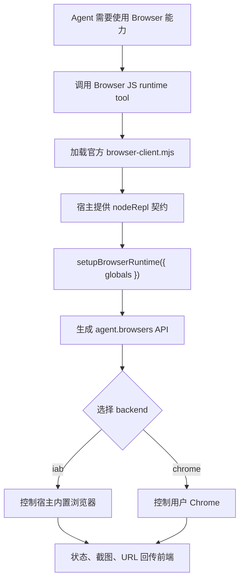

# Browser 官方 Runtime 支持方案

## 1. 主要目的

`plugins/broswer/` 的核心不是一个普通前端插件，而是一个官方 Browser JS runtime client：`scripts/browser-client.mjs`。这套方案只保留 **official runtime**，不再保留自研 shim。

本方案的目的只有一条主线：

1. 让宿主系统能够加载官方 `browser-client.mjs` 并完成 `setupBrowserRuntime({ globals })`。
2. 让官方 runtime 通过宿主提供的 `nodeRepl` 契约工作。
3. 让前端能看到 Browser 的运行状态、浏览器后端和页面状态，同时不影响现有功能。
4. 逐步把官方 runtime 的后端能力接到宿主的 `iab` 和 `chrome` 上，并保持可插拔和有上限。
5. 所有实现必须兼容 macOS、Windows 和 Linux，不能只按当前 macOS 开发环境设计。

## 2. 核心概念

### 2.1 runtime

这里的 runtime 只有一个：官方 Browser runtime。

```ts
type BrowserRuntime = "official";
```

宿主不再维护 shim 分支，也不再做官方/自研双路径切换。

### 2.2 backend

`backend` 表示官方 runtime 最终控制的是哪类浏览器。

```ts
type BrowserBackend = "iab" | "chrome";
```

| 后端 | 含义 |
| --- | --- |
| `iab` | in-app browser，宿主内置浏览器视图 |
| `chrome` | 用户本机 Chrome，复用真实登录态和扩展能力 |

### 2.3 nodeRepl

`nodeRepl` 是官方 Browser 插件依赖的宿主对象。它不是浏览器本身，而是 JS runtime 和宿主系统之间的桥。

核心字段：

| 字段 | 作用 |
| --- | --- |
| `cwd` | 当前工作目录 |
| `tmpDir` | 临时目录 |
| `requestMeta` | 当前 session、turn、thread 等元信息 |
| `write(value)` | 把 runtime 输出写回工具结果 |
| `setResponseMeta(meta)` | 把浏览器状态写回宿主，供前端显示 |
| `emitImage(bytes)` | 输出截图或图片 bytes |
| `nativePipe.createConnection(path)` | 连接官方 backend adapter 的底层通道 |
| `createElicitation(...)` | 请求用户确认 |
| `env` | 给官方 runtime 读取环境变量 |
| `config` | 给官方 runtime 读取或写入配置 |
| `fetch` | 给官方 runtime 执行受控网络请求 |

`write` 的作用可以直接理解为“工具输出口”。例如：

```js
nodeRepl.write(await browser.documentation())
```

它不是文件写入，也不是页面输入。

## 3. 架构约束

这部分是硬约束，不是建议。

### 3.1 解耦

- 官方 runtime、backend adapter、前端状态、权限确认、文件上传、截图处理必须拆开。
- `browser-client.mjs` 只能通过 `nodeRepl` 和 backend adapter 通信，不能直接依赖 renderer 或业务逻辑。
- 新能力只能通过明确接口接入，不能在主流程里堆 if/else。

### 3.2 可插拔

- backend 能按需启用和禁用。
- capability 能独立注册、独立关闭。
- 新增能力必须有明确的模块边界，不得修改无关模块的行为。

### 3.3 不影响现有功能

- Browser 功能只在明确调用时生效，不能在应用启动时全量初始化。
- Browser 失败不能拖垮其他工具、其他任务、其他页面。
- 非 Browser 流程必须保持原有性能和行为不变。

### 3.4 性能上限

- Browser runtime 必须懒加载，空闲时不占用明显 CPU。
- 后台监听、轮询、日志、截图、DOM 采样都必须有频率和大小上限。
- 必须限制并发浏览器实例、tab 数、连接数、消息大小、截图大小、响应 meta 大小和单次操作耗时。
- 任何超限都应直接拒绝或降级，不能无限增长。
- 新增 capability 前必须先给出资源预算和回归验证方式。

建议用统一配置表达性能预算，具体数值可以按压测调整，但字段和硬上限必须存在：

```ts
type BrowserPerformanceBudget = {
  maxRuntimeInstancesPerSession: number;
  maxActiveBackendsPerSession: number;
  maxOpenTabsPerSession: number;
  maxConcurrentOperations: number;
  maxMessageBytes: number;
  maxResponseMetaBytes: number;
  maxScreenshotBytes: number;
  maxScreenshotsPerMinute: number;
  maxDomSnapshotBytes: number;
  maxLogEntriesPerSession: number;
  bootstrapTimeoutMs: number;
  operationTimeoutMs: number;
  idleShutdownMs: number;
};
```

新增 capability 必须声明自己会消耗哪些预算。没有预算声明的能力不能默认启用。

### 3.5 跨平台兼容

- 必须支持 macOS、Windows 和 Linux。
- 路径处理必须使用 Node/Electron 的 `path`、`os`、`app.getPath(...)` 等跨平台 API，不能硬编码 `/tmp`、`~/Library`、反斜杠或盘符。
- native pipe 必须区分 Unix domain socket 和 Windows named pipe。
- Chrome 检测、扩展检测、native host manifest 检测必须按平台分别实现。
- 临时目录、缓存目录、下载目录、配置目录必须按平台取值。
- 所有平台差异要收敛在平台适配层里，不能散落在业务逻辑里。
- CI 或手动验收必须覆盖 Windows 和 Linux 的基础启动、路径、pipe、backend discovery。

## 4. 功能流转



前端可以只理解成：

1. Agent 调用 Browser Tool。
2. 官方 runtime 启动。
3. runtime 选择 `iab` 或 `chrome`。
4. 浏览器状态通过 `setResponseMeta` 推给前端。
5. 前端展示 URL、截图、tab、错误和 backend。

## 5. 前端状态模型

建议前端只消费一个稳定状态对象。

```ts
type BrowserToolState = {
  runtime: "official";
  bootstrapState: "idle" | "bootstrapping" | "ready" | "failed";
  backend?: "iab" | "chrome";
  browserId?: string;
  currentUrl?: string;
  title?: string;
  openTabIds?: string[];
  selectedTabId?: string;
  screenshotUrl?: string;
  error?: string;
};
```

## 6. Phase 交付与验证规则

每完成一个 Phase，必须同步补本文档，不能只在对话里口头说明。

### 6.1 完成标记

每个 Phase 完成后，在对应 Phase 小节补充：

- `开发状态`：`未开始` / `进行中` / `已完成` / `部分完成`
- `完成日期`：使用绝对日期
- `已完成内容`：列出落地文件和能力边界
- `不在本 Phase 的内容`：明确哪些失败是预期的
- `验证方式`：自动化命令、真实 runtime smoke、让大模型触发的人工验收话术
- `预期日志`：主进程终端中应出现的关键日志
- `失败排查`：没看到日志时先看哪里

### 6.2 人工验收规范

人工验收必须能从用户视角复现。每个 Phase 至少提供一条可以直接发给大模型的自然语言话术，任务输入框里不要要求用户粘贴 JS 代码、`nodeRepl.write(...)`、`npx tsx` 命令或内部函数调用。工程脚本只能放在“自动化验证”或“真实 runtime smoke”里。

可以直接发给大模型的话术示例：

```text
请打开内置浏览器访问 https://example.com/，页面加载后告诉我当前 URL 和标题。
```

验收说明必须包含：

1. 在哪里输入：Codex 桌面 app 的任务输入框，还是终端。
2. 看哪里：`npm run dev` 的主进程终端日志、工具输出、前端 Browser 面板。
3. 看到什么算成功：必须给出精确日志前缀或关键输出字段。
4. 没看到什么说明失败：例如插件未启用、模型未调用 Browser runtime tool、backend 尚未实现等。

### 6.3 日志约定

每个 Phase 的关键路径应有稳定日志。日志前缀统一使用：

```text
[BrowserRuntime]
```

Phase 1 的最小日志：

```text
[BrowserRuntime] official runtime bootstrapping for <threadId>.
[BrowserRuntime] official runtime ready for <threadId>.
[BrowserRuntime] official runtime failed for <threadId>: <error>.
```

后续 Phase 需要新增 backend、pipe、Chrome discovery、BrowserPanel attach/detach 等日志时，也要同步写入对应 Phase 的 `验证方式`。日志必须是一句话，不能打印大对象。

## 7. Phase 0：契约确认

### 目标

确认官方 Browser 插件的真实契约，避免按表面 API 误判。

### 功能

1. 读取 `plugins/broswer/.codex-plugin/plugin.json`。
2. 读取 `plugins/broswer/skills/control-in-app-browser/SKILL.md`。
3. 读取 `plugins/broswer/scripts/browser-client.mjs`。
4. 读取 `plugins/broswer/docs/api.json` 和 docs。
5. 对比当前系统的 BrowserService，确认哪些能力可以直接映射。

### 结论

- 官方插件是 JS runtime client，不是纯 UI 插件。
- 官方 runtime 依赖 `nodeRepl` 宿主契约。
- 没有 shim 分支，所有后续工作都围绕 official runtime 展开。
- 所有能力必须符合解耦、可插拔和性能上限约束。
- 所有涉及路径、pipe、Chrome、native host 的能力必须确认 Windows 和 Linux 差异。

## 8. Phase 1：官方 Runtime 启动桥

### 开发状态

已完成。

完成日期：2026-07-13。

### 已完成内容

- 补齐仓库内置 Browser 插件 manifest：`plugins/broswer/.codex-plugin/plugin.json`，使 `readPluginManifest(...)` 能发现 `plugins/broswer`，并通过 `keywords: ["browser", "browser-use"]` 识别为 Browser official runtime bundle。
- 新增 official runtime loader：`src/main/browser/official-browser-runtime-loader.ts`。
- 新增 `BrowserRuntimeNodeReplHost`：`src/main/agent/tools/browser/browser-runtime-host.ts`。
- 新增性能预算：`src/main/browser/browser-performance-budget.ts`。
- 新增跨平台临时目录和 native pipe path 判断：`src/main/browser/browser-platform.ts`。
- `mcp__node_repl__js` 改为懒加载官方 `plugins/broswer/scripts/browser-client.mjs`，不再默认走自研 shim。
- 接入 `nodeRepl.write`、`nodeRepl.setResponseMeta`、`nodeRepl.emitImage`。
- 接入 `BrowserToolState` 基础类型。
- 增加 Phase 1 生命周期日志：

  ```text
  [BrowserRuntime] official runtime bootstrapping for <threadId>.
  [BrowserRuntime] official runtime ready for <threadId>.
  [BrowserRuntime] official runtime failed for <threadId>: <error>.
  ```

- 增加官方 bundle 的 `process` shim 隔离，避免 `browser-client.mjs` top-level 改写宿主 `process` 后泄漏。
- 对官方 runtime 的 telemetry fetch 使用受控 204 响应，避免 Phase 1 smoke 产生外部网络依赖。
- 新增真实仓库插件发现测试：`browser plugin runtime discovery > discovers the checked-in plugins/broswer official runtime bundle`。

### 目标

让系统稳定加载 `browser-client.mjs`，并把启动状态、错误和图片回传给前端。

### 功能

1. **固定使用官方 runtime**

   只保留官方加载路径：

   ```ts
   await setupBrowserRuntime({ globals })
   ```

2. **新增 official runtime loader**

   负责加载：

   ```ts
   plugins/broswer/scripts/browser-client.mjs
   ```

3. **新增 BrowserRuntimeNodeReplHost**

   提供最小宿主契约：

   - `cwd`
   - `tmpDir`
   - `requestMeta`
   - `write`
   - `setResponseMeta`
   - `emitImage`
   - `nativePipe.createConnection`
   - `createElicitation`
   - `env`
   - `config`
   - `fetch`

4. **接入 response meta**

   官方 runtime 通过 `nodeRepl.setResponseMeta(...)` 回传状态，宿主需要把这些 meta 统一映射成 `BrowserToolState`。

5. **接入图片输出**

   官方 runtime 通过 `nodeRepl.emitImage(bytes)` 输出截图，宿主需要保存或转成 data URL 给前端。

6. **控制资源消耗**

   - runtime 只在 Browser 首次使用时启动。
   - 同一会话内避免重复创建 runtime。
   - 输出、截图、日志和 meta 都必须做大小限制。
   - 超出预算时必须明确失败或降级，而不是继续堆积。

7. **跨平台基础能力**

   - `cwd`、`tmpDir`、插件路径、图片输出路径必须跨平台。
   - `nodeRepl.nativePipe.createConnection(path)` 的 path 必须能支持 Windows named pipe 和 Unix socket。
   - Phase 1 至少要能在 Windows/Linux 上完成 official runtime 启动 smoke test。

### 不做

Phase 1 不实现真实 backend adapter。

也就是说，Phase 1 只保证 runtime 能启动，不能保证以下能力已经完整可用：

- `agent.browsers.get("iab")` 真正控制浏览器。
- `agent.browsers.get("extension")` 真正控制 Chrome。
- 官方 Playwright 子集完整可用。
- Chrome 扩展、native host、用户 Chrome 真实控制。

### 验收

1. `browser-client.mjs` 可以被加载。
2. `setupBrowserRuntime({ globals })` 只执行一次。
3. 执行后能看到：

   ```js
   typeof agent === "object"
   typeof agent.browsers === "object"
   typeof nodeRepl.write === "function"
   typeof nodeRepl.setResponseMeta === "function"
   ```

4. `nodeRepl.write(await agent.documentation())` 能输出文档。
5. `nodeRepl.setResponseMeta(...)` 能更新前端状态。
6. `nodeRepl.emitImage(...)` 能让前端展示图片。
7. 启动失败时明确报错，不做 shim 回退。
8. Windows 和 Linux 上 official runtime 启动路径不依赖 macOS 专有目录。

### 验证方式

#### 自动化验证

在仓库根目录执行：

```bash
npx vitest run src/main/agent/tools/browser/browser-plugin-runtime-tool.test.ts src/main/browser/browser-plugin.test.ts
npm run typecheck
```

成功标准：

- Vitest 全部通过。
- `browser plugin runtime discovery > discovers the checked-in plugins/broswer official runtime bundle` 通过，证明 `plugins/broswer/.codex-plugin/plugin.json`、`scripts/browser-client.mjs` 和 `skills/` 能被当前系统识别。
- `npm run typecheck` 无 TypeScript 错误。

如果要额外验证插件 manifest 形状，可运行 plugin-creator validator：

```bash
python3 /Users/qiyang/.codex/skills/.system/plugin-creator/scripts/validate_plugin.py plugins/broswer
```

成功标准：

```text
Plugin validation passed: <repo>/plugins/broswer
```

如果本机 Python 缺少 `yaml` 模块，validator 会在导入阶段失败；这不是 manifest 内容错误。需要先给 validator 所在 Python 环境提供 PyYAML，或使用等价的 YAML 解析环境复跑。

#### 真实 official runtime smoke

在仓库根目录执行：

```bash
npx tsx -e "import { createBrowserPluginRuntimeTool, clearBrowserPluginRuntimeToolSessionsForTests } from './src/main/agent/tools/browser/browser-plugin-runtime-tool.ts'; (async()=>{ const runtimeTool=createBrowserPluginRuntimeTool({ plugin:{pluginId:'plugin-browser',pluginName:'browser',pluginRoot:process.cwd() + '/plugins/broswer',clientPath:process.cwd() + '/plugins/broswer/scripts/browser-client.mjs'}, workspacePath:process.cwd(), threadId:'official-smoke' }); const out=await runtimeTool.invoke({code:'({ agentType: typeof agent, browsersType: typeof agent.browsers, writeType: typeof nodeRepl.write, metaType: typeof nodeRepl.setResponseMeta, emitImageType: typeof nodeRepl.emitImage })'}); console.log(out); clearBrowserPluginRuntimeToolSessionsForTests(); process.exit(0); })().catch((e)=>{ console.error(e); process.exit(1); });"
```

成功标准：终端输出至少包含：

```json
{
  "agentType": "object",
  "browsersType": "object",
  "writeType": "function",
  "metaType": "function",
  "emitImageType": "function"
}
```

#### 通过大模型触发的人工验收

1. 用 `npm run dev` 启动桌面 app。
2. 打开一个普通任务。
3. 在任务输入框发给大模型：

   ```text
   请检查 Browser 插件运行时是否已经接入。不要打开网页，也不要验证内置浏览器或 Chrome；只需要告诉我 Browser runtime 是否能启动、是否能看到浏览器能力入口、是否能把检查结果写回给我。
   ```

4. 看 `npm run dev` 所在终端的主进程日志。

成功标准：主进程终端出现：

```text
[Runtime] Browser plugin runtime injected: <pluginRoot>.
[BrowserRuntime] official runtime bootstrapping for <threadId>.
[BrowserRuntime] official runtime ready for <threadId>.
```

同时大模型返回的结果能明确说明：

- Browser runtime 已启动。
- 浏览器能力入口可用。
- 工具输出可以写回给用户。

#### 没看到日志时先排查

- 没看到 `[Runtime] Browser plugin runtime injected: <pluginRoot>.`：Agent runtime 创建工具列表时没有发现已启用 Browser 插件。检查插件系统的 `getPlugins()` 结果里是否存在 enabled 的 Browser 插件，且插件路径下存在 `scripts/browser-client.mjs` 和 `skills/`。
- `plugins/broswer` 在插件列表里但仍没注入：检查 `plugins/broswer/.codex-plugin/plugin.json` 是否存在且能被 `readPluginManifest(...)` 读取；manifest 需要能被识别为 Browser 插件，并且 `scripts/browser-client.mjs`、`skills/` 都必须存在。
- 看到 `[Runtime] Browser plugin runtime injected: <pluginRoot>.`，但没看到 `[BrowserRuntime] official runtime bootstrapping for`：大模型没有使用 Browser 插件运行时。重新发送上面的自然语言验收话术，明确要求它检查 Browser 插件运行时，不要改用终端或普通网页解释。
- 看到 `[BrowserRuntime] official runtime failed for`：说明 official `browser-client.mjs` 启动失败。查看同一条日志里的错误文本。
- 调用 `agent.browsers.get("iab")` 或打开网页失败：Phase 1 预期行为。真实 iab backend 在 Phase 2 才实现。

## 9. Phase 2：官方 iab Backend

### 开发状态

部分完成。

完成日期：未完成。当前部分完成日期：2026-07-15。

### 已完成内容

- 新增官方 native pipe JSON-RPC bridge：`src/main/browser/browser-native-pipe-server.ts`。
- 新增官方 iab backend adapter：`src/main/browser/browser-official-backend-adapter.ts`。
- `src/main/agent/tools/browser/browser-runtime-host.ts` 已在创建官方 runtime host 时注册 iab backend。
- `nodeRepl.nativePipe.createConnection(path)` 已接入真实 JSON-RPC framed transport，不再抛 Phase 1 的 backend 未实现错误。
- `agent.browsers.list()` 可以通过官方 `browser-client.mjs` 的 backend discovery 发现 `iab`。
- `agent.browsers.get("iab")` 可以返回官方 Browser 对象。
- Windows 上 iab backend discovery 已接入真实 named pipe listener：`BrowserNativePipeBridge` 会为 `\\.\pipe\codex-browser-use-...` 路径启动可枚举的 named pipe server，避免官方 runtime 在 `agent.browsers.getForUrl(...)` 时枚举不到任何 backend 并报 `No browser is available`。
- `browser.tabs.new()`、`browser.tabs.list()`、`tab.goto("about:blank")`、`tab.url()`、`tab.title()`、`tab.screenshot()` 的最小官方 smoke 已接通。
- 外部 `https://...` origin 访问已接入宿主 approval：官方 `nodeRepl.createElicitation(...)` 会转成 app 的 approval card，用户批准后返回官方需要的 `{ action: "accept" }`。
- `nodeRepl.config.readToml/writeToml` 已提供内存配置存储，支持官方 runtime 记录 Browser origin 允许策略。
- 基础坐标 CUA 已接入 iab backend：`moveMouse`、`Input.dispatchMouseEvent`、`Input.synthesizeScrollGesture` 分别映射到 `BrowserService.moveMouse(...)`、`mouseDown(...)`、`mouseUp(...)`、`scroll(...)`，覆盖 `tab.cua.move(...)`、`tab.cua.click(...)`、`tab.cua.double_click(...)`、`tab.cua.drag(...)`、`tab.cua.scroll(...)` 的底层事件通道。
- 基础文本和按键已接入 iab backend：`Input.insertText` 和 printable `Input.dispatchKeyEvent` 映射到 `BrowserService.typeText(...)`，Enter/Escape/Tab 等控制键映射到 `BrowserService.press(...)`。
- `tools` 层 Browser 相关文件已统一移动到 `src/main/agent/tools/browser/`。
- 新增 Phase 2 关键日志：

  ```text
  [BrowserRuntime] iab backend registered for <sessionId>.
  [BrowserRuntime] native pipe connected for <sessionId>.
  [BrowserRuntime] elicitation resolved for <origin> with <decision>.
  ```

### 不在当前部分完成范围的内容

- 外部 `https://...` URL 导航需要用户在 approval card 中批准；用户拒绝、取消或 approval 通道缺失时，官方 Browser security policy 仍会拦截。
- 登录、表单提交、文件上传、支付、删除、发布、CAPTCHA 等敏感操作还没有接入更细粒度的专用 approval 流程。
- 基础点击、输入、按键、移动、滚动、拖拽、双击已完成 adapter 级自动化验证；真实 Electron BrowserService 端仍需要按本文档的人工验收话术验证。
- DOM CUA、Playwright locator 子集、下载、上传不在当前部分完成范围内。
- Windows 和 Linux 的真实整机验收仍需要按本文档人工执行；自动化测试已覆盖 Windows named pipe 路径判断和 discovery server 启用条件。
- Chrome/extension backend 不属于 Phase 2，仍在 Phase 3。

### 验证方式

#### 自动化验证

在仓库根目录执行：

```bash
npx vitest run src/main/browser/browser-official-backend-adapter.test.ts src/main/agent/tools/browser/browser-plugin-runtime-tool.test.ts src/main/browser/browser-plugin.test.ts
npx vitest run src/main/browser/browser-platform.test.ts src/main/agent/tools/browser/browser-runtime-host.test.ts
npm run typecheck
```

成功标准：

- Vitest 全部通过。
- `browser official iab backend adapter > maps official mouse CDP events to BrowserService mouse events` 通过。
- `browser official iab backend adapter > maps official moveMouse RPC and scroll CDP events to BrowserService input` 通过。
- `browser official iab backend adapter > maps official text input CDP events to BrowserService text insertion` 通过。
- `browser official iab backend adapter > maps official control key CDP events to BrowserService key presses` 通过。
- `browser plugin official runtime tool > lets the official browser client discover the iab backend through native pipe` 通过。
- `browser plugin official runtime tool > supports the official iab tab smoke path without the legacy shim` 通过。
- `browser plugin official runtime tool > uses approval before the official iab backend navigates to an external origin` 通过。
- `browser platform native pipe paths > uses discoverable official named pipe paths for Windows iab backends` 通过。
- `browser runtime host native pipe > connects external Browser namespace pipes for Chrome extension backends` 通过。
- `npm run typecheck` 无 TypeScript 错误。

#### 真实 official iab smoke

在仓库根目录执行：

```bash
npx tsx -e "import { createBrowserPluginRuntimeTool, clearBrowserPluginRuntimeToolSessionsForTests } from './src/main/agent/tools/browser/browser-plugin-runtime-tool.ts'; (async()=>{ const root=process.cwd() + '/plugins/broswer'; const runtimeTool=createBrowserPluginRuntimeTool({ plugin:{pluginId:'plugin-browser',pluginName:'browser',pluginRoot:root,clientPath:root + '/scripts/browser-client.mjs'}, workspacePath:process.cwd(), threadId:'phase2-iab-smoke' }); const out=await runtimeTool.invoke({code:'const browser = await agent.browsers.get(\"iab\"); const tab = await browser.tabs.new(); await tab.goto(\"about:blank\"); const tabs = await browser.tabs.list(); const screenshot = await tab.screenshot(); nodeRepl.write(JSON.stringify({ browserId: browser.browserId, tabId: tab.id, tabIds: tabs.map((item) => item.id), url: await tab.url(), title: await tab.title(), screenshotBytes: screenshot.byteLength }, null, 2));'}); console.log(out); clearBrowserPluginRuntimeToolSessionsForTests(); process.exit(0); })().catch((e)=>{ console.error(e); process.exit(1); });"
```

成功标准：终端输出至少包含：

```json
{
  "tabId": "1",
  "tabIds": ["1"],
  "url": "about:blank",
  "screenshotBytes": 516
}
```

`screenshotBytes` 只要求是大于 0 的数字，不要求固定等于 516。

#### 真实 official CUA command smoke

在仓库根目录执行：

```bash
npx tsx -e "import { createBrowserPluginRuntimeTool, clearBrowserPluginRuntimeToolSessionsForTests } from './src/main/agent/tools/browser/browser-plugin-runtime-tool.ts'; (async()=>{ const root=process.cwd() + '/plugins/broswer'; const runtimeTool=createBrowserPluginRuntimeTool({ plugin:{pluginId:'plugin-browser',pluginName:'browser',pluginRoot:root,clientPath:root + '/scripts/browser-client.mjs'}, workspacePath:process.cwd(), threadId:'phase2-cua-smoke' }); const out=await runtimeTool.invoke({code:'const browser = await agent.browsers.get(\"iab\"); const tab = await browser.tabs.new(); await tab.goto(\"about:blank\"); await tab.cua.move({ x: 10, y: 10 }); await tab.cua.double_click({ x: 10, y: 10 }); await tab.cua.scroll({ x: 10, y: 10, scrollX: 0, scrollY: 100 }); await tab.cua.drag({ path: [{ x: 10, y: 10 }, { x: 20, y: 20 }] }); nodeRepl.write(JSON.stringify({ tabId: tab.id, url: await tab.url() }));'}); console.log(out); clearBrowserPluginRuntimeToolSessionsForTests(); process.exit(0); })().catch((e)=>{ console.error(e); process.exit(1); });"
```

成功标准：终端日志出现：

```text
[BrowserRuntime] native pipe connected for <sessionId>.
```

并且输出包含：

```json
{
  "tabId": "1",
  "url": "about:blank"
}
```

#### 通过大模型触发的人工验收

1. 用 `npm run dev` 启动桌面 app。
2. 打开一个普通任务。
3. 在任务输入框发给大模型：

   ```text
   请打开内置浏览器访问 about:blank，并告诉我：浏览器列表里是否有 In-app Browser、当前 tab id、当前 URL、标题，以及是否能成功截取一张页面截图。不要访问外部网站，也不要验证 Chrome。
   ```

4. 看 `npm run dev` 所在终端的主进程日志。

成功标准：主进程终端出现：

```text
[Runtime] Browser plugin runtime injected: <pluginRoot>.
[BrowserRuntime] official runtime bootstrapping for <threadId>.
[BrowserRuntime] iab backend registered for <sessionId>.
[BrowserRuntime] official runtime ready for <threadId>.
[BrowserRuntime] native pipe connected for <sessionId>.
```

同时大模型返回的结果包含：

- 浏览器列表包含 `In-app Browser`。
- `tabId` 是 `1`。
- 当前 URL 是 `about:blank`。
- 页面截图成功，且截图字节数大于 0。

#### Windows getForUrl 人工验收

1. 在 Windows 上用 `npm run dev` 启动桌面 app。
2. 打开一个普通任务。
3. 在任务输入框发给大模型：

   ```text
   请用内置浏览器访问 http://localhost:8888/register.html。如果出现访问权限确认卡片，我会手动点击允许。即使本机 8888 服务没有启动，也请告诉我是否已经选择到 In-app Browser、当前 tab id、URL 或导航错误。不要改用 Chrome，也不要验证上传、下载或外部网站。
   ```

4. 看 `npm run dev` 所在终端的主进程日志。

成功标准：主进程终端出现：

```text
[BrowserRuntime] iab backend registered for <sessionId>.
[BrowserRuntime] native pipe connected for <sessionId>.
```

同时大模型返回不应包含 `No browser is available`。如果本机没有启动 `localhost:8888`，页面连接失败可以接受；这条验收只确认 `getForUrl(...)` 能在 Windows 上发现并选择 iab backend。

#### 基础 CUA 人工验收

1. 用 `npm run dev` 启动桌面 app。
2. 打开一个普通任务。
3. 在任务输入框发给大模型：

   ```text
   请在内置浏览器里打开一个临时测试页，页面里要有输入框、可双击按钮、可拖动区域和足够滚动的内容。请依次输入 phase2-ok、按 Enter、双击按钮、拖动区域、滚动页面。完成后告诉我当前 tab id、URL 和页面标题；标题应能证明 type、scroll、double、drag 四个动作都发生了。不要访问外部网站，也不要验证 Chrome。
   ```

4. 看 `npm run dev` 所在终端的主进程日志和大模型返回的工具输出。

成功标准：主进程终端至少出现：

```text
[BrowserRuntime] native pipe connected for <sessionId>.
```

同时大模型返回的工具输出包含：

```json
{
  "tabId": "1",
  "title": "type+scroll+double+drag"
}
```

#### 外部站点 approval 验收

1. 用 `npm run dev` 启动桌面 app。
2. 打开一个普通任务。
3. 在任务输入框发给大模型：

   ```text
   请用内置浏览器访问 https://example.com/。如果出现访问权限确认卡片，我会手动点击“允许”或“本会话允许”。访问完成后告诉我当前 tab id、URL 和页面标题。不要验证 Chrome。
   ```

4. 在页面底部 approval card 中批准 `browser access https://example.com`。
5. 看 `npm run dev` 所在终端的主进程日志。

成功标准：主进程终端出现：

```text
[BrowserRuntime] elicitation resolved for https://example.com with <decision>.
```

并且大模型返回的工具输出包含：

```json
{
  "tabId": "1",
  "url": "https://example.com/"
}
```

### 失败排查

- 没看到 `[Runtime] Browser plugin runtime injected: <pluginRoot>.`：Browser 插件没有被启用，或 `plugins/broswer/scripts/browser-client.mjs` / `skills/` 不存在。
- 看到 `[Runtime] Browser plugin runtime injected: <pluginRoot>.`，但没看到 `[BrowserRuntime] official runtime bootstrapping for`：大模型没有调用 `mcp__node_repl__js` Browser runtime tool。
- 看到 `[BrowserRuntime] official runtime ready for`，但没看到 `[BrowserRuntime] iab backend registered for`：host 创建时没有注册 Phase 2 iab backend，检查 `src/main/agent/tools/browser/browser-runtime-host.ts`。
- 看到 `[BrowserRuntime] iab backend registered for`，但没看到 `[BrowserRuntime] native pipe connected for`：官方 runtime 没有触发 backend discovery。确认验收代码里调用了 `agent.browsers.list()` 或 `agent.browsers.get("iab")`。
- Windows 上 `agent.browsers.getForUrl(...)` 报 `No browser is available`：说明官方 runtime 枚举 `\\.\pipe\` 时没有发现当前 iab backend。检查 `src/main/browser/browser-native-pipe-server.ts` 是否为 Windows named pipe 启动了 discovery server，`src/main/browser/browser-platform.ts` 的 `getOfficialBrowserUseIabPipePath(..., "win32")` 是否生成 `\\.\pipe\codex-browser-use-cmb-iab-...`，以及调用是否发生在桌面 app 的 Browser runtime tool 中；脱离 `nodeRepl.requestMeta` 和 iab host 手动调用 `setupBrowserRuntime(...)` 不会注册内置浏览器。
- `Browser Use rejected this action ... The user has requested that https://example.com should not be used`：通常是当前会话或用户策略禁止了该域名，或 approval card 被拒绝/取消。不要绕过该策略；换用用户允许的测试域名，检查是否出现对应的 `browser access <origin>` approval card，并确认主进程日志里是否出现 `[BrowserRuntime] elicitation resolved for`。
- 没看到 approval card：确认 Browser tool 是从桌面 app 正常任务里调用的；直接在无 `requestApproval` 的测试脚本里访问外部 URL 会 fail closed。
- 基础 CUA 验收里 `title` 不是 `type+scroll+double+drag`：先确认 Browser 面板是否打开，页面是否显示本地输入框和测试区域；如果页面打开但 title 没变，检查 `src/main/browser/browser-official-backend-adapter.ts` 的 `moveMouse`、`Input.dispatchMouseEvent`、`Input.synthesizeScrollGesture`、`Input.insertText`、`Input.dispatchKeyEvent` 映射，以及 `src/main/browser/browser-service.ts` 的 `moveMouse(...)`、`mouseDown(...)`、`mouseUp(...)`、`scroll(...)`。

### 目标

让官方 `agent.browsers` 真正控制宿主内置浏览器 `iab`。

### 功能

1. **实现 nativePipe bridge**

   官方 runtime 通过：

   ```ts
   nodeRepl.nativePipe.createConnection(path)
   ```

   连接 backend。宿主需要提供兼容的 pipe 服务。

2. **实现 backend discovery**

   backend 需要返回 `getInfo`，让官方 runtime 识别可用浏览器。

3. **把官方 backend API 映射到 BrowserService**

   重点映射：

   | 官方方法 | 宿主映射 |
   | --- | --- |
   | `ping` | 健康检查 |
   | `getInfo` | 返回 backend 信息 |
   | `attach` | 绑定 Browser session |
   | `getTabs` | 返回当前 tab 列表 |
   | `createTab` | 创建或打开新 tab |
   | `attachTarget` | 绑定具体 tab |
   | `detachTarget` | 解绑具体 tab |
   | `detach` | 解绑 session |
   | `executeCdp` | 执行受控 CDP 或替代实现 |
   | `moveMouse` | 鼠标移动 |
   | `finalizeTabs` | 清理或确认 tab 生命周期 |
   | `markTab` | 标记 tab 状态 |

4. **统一浏览器状态回传**

   不管调用路径如何，前端看到的都应该是同一种 `BrowserToolState`。

5. **接入权限和安全确认**

   把登录、表单提交、文件上传、支付、删除、发布、CAPTCHA 等敏感操作接入现有 approval 系统。

6. **限制扩展成本**

   - 单会话 tab 数、并发操作数、消息大小、截图频率都必须有限制。
   - 新能力不能默认常驻后台。
   - backend adapter 需要支持按需启停。

7. **跨平台 pipe 和 BrowserService 适配**

   - Unix 使用 socket path，Windows 使用 named pipe path。
   - backend discovery 不能假设 `/tmp/codex-browser-use` 一定存在。
   - iab backend 对 Electron WebContents 的调用必须确认 Windows/Linux 行为一致。

### 验收

1. `agent.browsers.list()` 能看到 `iab`。
2. `agent.browsers.get("iab")` 可以返回 Browser 对象。
3. `browser.tabs.new("https://...")` 可以打开页面。
4. `tab.goto(...)` 可以导航。
5. `tab.screenshot()` 可以返回截图。
6. `tab.url()` 和 `tab.title()` 可以返回当前页面信息。
7. 基础点击、输入、按键能力可用。
8. 前端能看到 runtime、backend、URL、截图、tab 和错误信息。
9. Windows 和 Linux 上能完成 backend discovery、打开页面、截图基础流程。

## 10. Phase 3：Chrome Backend 支持

### 开发状态

部分完成。

完成日期：未完成。当前部分完成日期：2026-07-21。

### 已完成内容

- 新增 Chrome 环境检测模块：`src/main/browser/browser-chrome-discovery.ts`。
- `nodeRepl.nativePipe.createConnection(path)` 已支持受限外部 pipe passthrough：iab 自身 pipe 仍走宿主内存 bridge；其他位于官方 Browser Use pipe 命名空间的 pipe 会通过 `net.createConnection(...)` 连接，使官方 Chrome extension/native-host backend 在真实暴露 pipe 时不再被 host 拒绝。
- 新增官方 Browser Use pipe 命名空间判断：`src/main/browser/browser-platform.ts` 的 `isOfficialBrowserUsePipePath(...)`。
- 复用官方 Browser 插件脚本路径，不复制检测逻辑：
  - `plugins/broswer/scripts/installed-browsers.js`
  - `plugins/broswer/scripts/chrome-is-running.js`
  - `plugins/broswer/scripts/check-extension-installed.js`
  - `plugins/broswer/scripts/check-native-host-manifest.js`
  - `plugins/broswer/scripts/open-chrome-window.js`
- Chrome 检测按需执行，不在 app 启动时后台扫描，符合 Phase 3 的常驻开销约束。
- 检测结果会保留官方脚本的 stdout、stderr、exitCode 和 JSON payload；扩展未启用、native host manifest 不正确这类非零退出码不会被吞掉。
- 外部 pipe passthrough 受安全边界限制：只允许官方 `codex-browser-use` pipe 命名空间，拒绝任意本地 socket / named pipe。
- 已接通旧 Chrome extension 同源登录态导入 IPC 路径：在用户确认后，从已打开的同源 Chrome tab 导出 Cookie 和 localStorage，并导入当前内置浏览器；导入过程不输出 Cookie、Token、密码或 localStorage 明文值。当前 BrowserPanel 默认导入入口已切换为 Profile import，不再把该旧路径作为主入口。
- Chrome backend 恢复引导逻辑仍保留在旧同源登录态导入路径中：当 extension backend 未 ready 时，会给出诊断和受控恢复动作，支持打开 Chrome、打开 Codex Chrome Extension Web Store 页面、打开 Google Chrome Extension Manager；native host 仍不会被程序自动修复。
- Chrome Profile import 已开发完毕：`src/main/browser/browser-profile-importer.ts` 会直接读取 Chrome User Data 目录下的 profile 列表和 Cookies 数据库副本，将可解密、可导入的 Cookie 复制到内置浏览器自己的持久 profile；不调用 `agent.browsers.get("extension")`，不依赖 Chrome extension/native host backend，不直接挂载 Chrome profile，不做实时同步，不导入密码。
- BrowserPanel 入口已开发完毕：`src/renderer/src/components/browser/BrowserPanel.tsx` 的钥匙图标现在使用 `IconPopoverButton`。没有失败站点记录时，hover 提示 `导入浏览器数据`，点击后直接执行 Chrome Profile import；存在失败站点记录时，点击钥匙图标展示失败站点 popover，并在 popover 内提供 `导入浏览器数据` 按钮重新导入。
- 内置浏览器持久 profile 已接入：`src/main/browser/browser-service.ts` 使用固定 `persist:cmbdevclaw-browser-profile` partition，使 Profile import 的 Cookie 进入内置浏览器独立 profile，而不是一次性临时 session。
- 新增 Phase 3 关键日志：

  ```text
  [BrowserRuntime] chrome discovery completed with backendReady=<true|false>.
  [BrowserRuntime] external native pipe connected for <threadId>.
  [BrowserRuntime] Chrome session data exported for <origin> cookies=<n> localStorage=<n>.
  [BrowserService] Imported Chrome session data for <sessionId> cookies=<n> localStorage=<n> skipped=<n>.
  [BrowserRuntime] chrome setup opened <action>.
  [BrowserProfileImport] Chrome profile data read profile=<profileDirectory> cookies=<n> skipped=<n>.
  [BrowserService] Imported browser profile data cookies=<n> localStorage=0 skipped=<n>.
  ```

### 不在当前部分完成范围的内容

- Chrome extension/native-host backend 仍依赖官方扩展和 native host 在本机真实暴露 pipe；当前 Phase 3 只保证 host 不再拒绝官方命名空间内的外部 backend pipe。
- native host manifest 的自动修复仍不在当前范围；需要用户从插件 UI 重新安装/修复。
- browserAuth 安全输入流程仍未补齐。
- Windows/Linux/macOS 的真实 Chrome 环境检测结果需要按本文档手动验收；自动化测试只验证脚本调用、JSON 解析、非零退出码保留和汇总逻辑。
- Profile import 当前只导入 Cookie / 站点数据中的 Cookie 部分；localStorage、history、bookmarks、passwords、form autofill 不在当前范围。
- Profile import 是一次性复制，不是和 Chrome profile 的双向同步；导入后 Chrome 新登录或 Cookie 更新不会自动同步到内置浏览器。
- Chrome 新版 app-bound / OS 加密 Cookie 如果当前用户上下文无法解密，会被跳过并计入 `skipped`，不会输出 Cookie 明文。

### 验证方式

#### 自动化验证

在仓库根目录执行：

```bash
npx vitest run src/main/browser/browser-chrome-discovery.test.ts
npx vitest run src/main/browser/browser-profile-importer.test.ts
npx vitest run src/main/agent/tools/browser/browser-runtime-host.test.ts
npm run typecheck
```

成功标准：

- `browser chrome discovery > resolves the official Browser plugin Chrome diagnostic script paths` 通过。
- `browser chrome discovery > runs official-style JSON diagnostics and preserves meaningful non-zero status` 通过。
- `browser chrome discovery > reports missing diagnostic scripts without throwing` 通过。
- `browser profile importer > discovers Chrome profiles from an explicit user data directory` 通过。
- `browser profile importer > reads plaintext cookies and skips partitioned or undecryptable cookies` 通过。
- `browser runtime host native pipe > connects external Browser namespace pipes for Chrome extension backends` 通过。
- `browser runtime host native pipe > rejects native pipes outside the official Browser namespace` 通过。
- `npm run typecheck` 无 TypeScript 错误。

#### 真实 Chrome 检测 smoke

在仓库根目录执行：

```bash
npx tsx -e "import { checkBrowserChromeEnvironment } from './src/main/browser/browser-chrome-discovery.ts'; (async()=>{ const result = await checkBrowserChromeEnvironment({ pluginRoot: process.cwd() + '/plugins/broswer' }); console.log(JSON.stringify(result.summary, null, 2)); })().catch((error)=>{ console.error(error); process.exit(1); });"
```

成功标准：终端出现日志：

```text
[BrowserRuntime] chrome discovery completed with backendReady=<true|false>.
```

并输出类似下面的 summary，布尔值按本机 Chrome/扩展/native host 状态变化：

```json
{
  "chromeInstalled": true,
  "chromeRunning": false,
  "extensionBackendReady": false,
  "extensionEnabled": false,
  "extensionInstalled": false,
  "nativeHostManifestCorrect": false
}
```

#### 通过大模型触发的人工验收

1. 用 `npm run dev` 启动桌面 app 或直接在当前仓库任务里发给大模型。
2. 在任务输入框发给大模型：

   ```text
   请检查这台机器的 Chrome Browser 环境。不要访问网页，也不要操作 Chrome tab；只需要告诉我 Chrome 是否安装、Chrome 是否正在运行、扩展 backend 是否 ready、扩展是否启用、native host manifest 是否正确，并把检查 summary 简短列出来。
   ```

3. 看大模型返回的命令输出。

成功标准：看到 `[BrowserRuntime] chrome discovery completed with backendReady=`，并且 JSON summary 至少包含：

```json
{
  "chromeInstalled": true,
  "chromeRunning": false,
  "extensionBackendReady": false,
  "extensionEnabled": false,
  "extensionInstalled": false,
  "nativeHostManifestCorrect": false
}
```

这里的 `true/false` 不要求和示例完全一致；如果你的机器没安装 Chrome，`chromeInstalled: false` 也是有效检测结果。

#### 真实 Chrome backend pipe passthrough smoke

这个 smoke 只有在官方 Chrome extension/native host 已安装且正在暴露 Browser backend pipe 时才可能发现 `extension`。如果未安装或 manifest 不正确，失败是预期结果，应先看上一条 Chrome 检测 smoke 的 summary。

1. 用 `npm run dev` 启动桌面 app。
2. 确认 Chrome extension 和 native host manifest 已安装并启用。
3. 在任务输入框发给大模型：

   ```text
   请检查 Browser runtime 的浏览器列表里是否能发现 Chrome extension backend。不要访问网页，也不要操作 Chrome tab；只需要告诉我列表里有哪些浏览器，以及是否出现 extension/Chrome backend。
   ```

4. 看 `npm run dev` 所在终端的主进程日志和大模型返回的工具输出。

成功标准：如果本机官方 Chrome backend 已就绪，主进程终端出现：

```text
[BrowserRuntime] external native pipe connected for <threadId>.
```

并且工具输出里包含：

```json
{
  "type": "extension"
}
```

如果只看到 `iab` 或没有 `external native pipe connected for`，说明本机 Chrome extension/native host backend 尚未暴露可连接 pipe；先运行 Chrome 检测 smoke，检查 `extensionEnabled` 和 `nativeHostManifestCorrect`。

#### 真实 Chrome Profile import smoke

这个 smoke 不需要 Chrome extension/native host backend，也不需要 `agent.browsers.get("extension")`。它只从本机 Chrome profile 复制可导入 Cookie 到内置浏览器自己的持久 profile。

1. 用 `npm run dev` 启动桌面 app。
2. 打开一个普通任务，在任务输入框发给大模型：

   ```text
   请打开内置浏览器访问 https://example.com/，页面加载后告诉我当前 URL 和标题。
   ```

3. 等右侧 Browser 面板出现后，点击工具栏里的钥匙图标。按钮 tooltip / aria-label 应为 `导入浏览器数据`。
4. 看 `npm run dev` 所在终端的主进程日志，以及 Browser 面板 toast。
5. 如果要验证登录态效果，再在 Browser 面板地址栏访问一个你在 Chrome profile 中已经登录过的网站，观察是否进入已登录状态。不要在日志或对话里输出 Cookie、Token、密码或验证码。

成功标准：

- 主进程日志出现：

  ```text
  [BrowserProfileImport] Chrome profile data read profile=<profileDirectory> cookies=<n> skipped=<n>.
  [BrowserService] Imported browser profile data cookies=<n> localStorage=0 skipped=<n>.
  ```

- Browser 面板 toast 显示导入 Cookie 数量、profileDirectory 和跳过数量。
- 如果存在失败站点，toast 不展示站点列表；再次点击钥匙图标会在 popover 中展示失败站点 URL、失败原因和跳过 Cookie 数量，并提供 `复制列表` 和 `导入浏览器数据` 按钮。
- 如果不存在失败站点，hover 钥匙图标只提示 `导入浏览器数据`，点击后直接执行导入。
- 不应出现 `No browser is available`，也不需要出现 `[BrowserRuntime] Chrome session data exported ...`；如果出现这些，说明走到了旧 Chrome extension 同源登录态导入路径，不是 Profile import。
- 如果 `cookies=0` 或 toast 提示没有成功导入 Cookie，先确认本机 Chrome profile 存在 Cookie；Chrome 新版 app-bound / OS 加密 Cookie 在当前用户上下文无法解密时会被跳过，这是预期降级。

#### 旧 Chrome extension 登录态导入 smoke

这个 smoke 只用于验证保留的旧 IPC/API 路径。BrowserPanel 默认钥匙按钮已经切换为 Profile import，因此它不是当前默认用户入口。

前置条件：本机 Chrome extension/native host backend 已就绪，并且 Chrome 里已经打开了与当前内置浏览器同源的页面，页面内至少有 Cookie 或 localStorage 可导入。

成功标准：

```text
[BrowserRuntime] Chrome session data exported for <origin> cookies=<n> localStorage=<n>.
[BrowserService] Imported Chrome session data for <sessionId> cookies=<n> localStorage=<n> skipped=<n>.
```

如果当前页面不是 HTTP(S)、Chrome 没有同源 tab、或 backend 未就绪，返回可读错误是预期行为。

#### 旧 Chrome backend 恢复引导 smoke

这个 smoke 只适用于旧 Chrome extension 同源登录态导入路径。Profile import 不依赖 extension backend，因此不会给出 extension/native host 恢复动作。

成功标准：

- 主进程日志出现 `[BrowserRuntime] chrome discovery completed with backendReady=<true|false>.`
- 如果缺 Chrome，恢复逻辑提示先安装 Chrome。
- 如果缺扩展，恢复逻辑可以打开 Codex Chrome Extension Web Store 页面。
- 如果扩展已安装但被禁用，恢复逻辑可以打开 Google Chrome Extension Manager。
- 如果 Chrome 没启动，恢复逻辑可以打开 Chrome。
- 看到 `[BrowserRuntime] chrome setup opened <action>.` 说明恢复入口已经成功拉起。

### 失败排查

- 没看到 `[BrowserRuntime] chrome discovery completed with backendReady=`：检测函数没有被调用，或命令没有在仓库根目录执行。
- `installedBrowsers.error` 包含脚本缺失：确认 `plugins/broswer/scripts/installed-browsers.js` 是否存在。
- `extensionEnabled: false`：通常表示官方 Chrome extension 没装、没启用，或检测到的 Chrome profile 不是扩展所在 profile。
- `nativeHostManifestCorrect: false`：检查 `plugins/broswer/scripts/check-native-host-manifest.js --json` 的 `problem` 字段；Windows 还需要检查注册表 manifest path。
- `extensionBackendReady: false`：代表 Phase 3 Chrome backend 前置条件未满足，不影响 Phase 2 的 iab backend。
- `extensionBackendReady: true` 但 `agent.browsers.list()` 看不到 `extension`：检查主进程是否出现 `[BrowserRuntime] external native pipe connected for`；如果没有，说明官方 extension/native host 没有在 `codex-browser-use` 命名空间暴露 pipe，或 pipe 文件 stale/不可连接。
- 出现 `Browser native pipe path is outside the official Browser namespace`：host 正在拒绝非官方命名空间 pipe，这是预期安全边界；不要改成任意本地 socket passthrough。
- 点击 `导入浏览器数据` 后没有出现 `[BrowserProfileImport] Chrome profile data read`：确认你点击的是 BrowserPanel 工具栏的钥匙图标，而不是旧 extension 同源登录态导入入口；同时确认主进程已注册 `browser:importProfileData` IPC。
- Profile import 出现 `未找到 Chrome User Data 目录`：确认本机安装过 Chrome 并启动过至少一次；也可以临时设置 `CODEX_CHROME_USER_DATA_DIR=<Chrome User Data 路径>` 后重启 app 再验。
- Profile import 成功但 `Imported browser profile data cookies=0`：Chrome profile 可能没有 Cookie、Cookie 是分区 Cookie、Cookie 加密不可解，或 Electron 拒绝了不合法 domain/path；看 skipped 数量判断。
- 旧“从 Chrome 导入登录态”路径没有导入成功：先确认当前内置浏览器页面是 HTTP(S)，再确认 Chrome 里已经打开了同源页面并且 backend ready；如果返回 `Chrome tab 与当前内置浏览器页面不是同一个 origin`，说明打开的是不同站点或不同协议。
- 旧导入路径失败但有恢复动作：先按 toast 的动作把 Chrome、扩展管理页或 Web Store 打开，再重新导入；如果恢复动作打开失败，优先检查本机是否允许从桌面应用唤起 Chrome。

### 目标

让官方 Browser runtime 可以控制用户本机 Chrome。

### 功能

1. **识别 Chrome 环境**

   复用：

   - `scripts/chrome-is-running.js`
   - `scripts/installed-browsers.js`
   - `scripts/check-extension-installed.js`
   - `scripts/check-native-host-manifest.js`

2. **支持 Chrome extension backend**

   官方插件内部把 Chrome 后端称为 `extension`，前端可以展示成：

   ```ts
   backend: "chrome"
   ```

3. **支持用户 tab claim**

   支持列出用户 tabs、claim tab、标记 Agent 创建的 tab、任务结束后清理 Agent tab，不关闭用户原本的 tab。

4. **支持登录态场景**

   严格保护：

   - 密码
   - OTP
   - Cookie
   - Token
   - 账号隐私页面

5. **接入 browserAuth**

   把官方 `browserAuth` 能力接到用户确认和安全输入流程里。

6. **控制常驻开销**

   - Chrome 相关能力必须按需启用，不能后台持续扫描。
   - 扩展检查、native host 检查、tab 监听都要节流。
   - 不得因为支持 Chrome 而把主进程常驻成本抬高到不可控。

7. **跨平台 Chrome 支持**

   - Chrome 可执行路径、用户 profile 路径、扩展目录、native host manifest 路径必须按平台处理。
   - Windows 要处理注册表或标准目录，Linux 要处理 XDG 目录和常见发行版路径。
   - 不同平台检测失败时要给出明确错误，不得静默降级为“未安装”。

### 验收

1. 系统能检测 Chrome 是否运行。
2. 系统能检测扩展和 native host 是否安装。
3. official runtime 能发现 Chrome backend。
4. `agent.browsers.get("extension")` 可以连接 Chrome。
5. 前端展示为 `backend: "chrome"`。
6. 可以列出、claim、操作 Chrome tab。
7. 不泄露密码、OTP、Cookie、Token。
8. Windows 和 Linux 上能完成 Chrome 检测、扩展检测和基础 tab 操作验收。

## 11. Phase 4：能力补齐与体验完善

### 开发状态

部分完成。

完成日期：未完成。当前部分完成日期：2026-07-16。

### 已完成内容

- `tab.playwright.evaluate(...)` 的 iab CDP 路径已接通到 `BrowserService.evaluateInPage(...)`：真实 Electron BrowserService 存在时，官方 runtime 的 `Runtime.evaluate` 会在当前页面执行只读表达式。
- 无 BrowserService 的 runtime smoke 路径新增受限 fallback：只解析官方 `playwright.evaluate` 用户脚本中明确读取的 `document.title`、`location.href`、`document.readyState`、`document.body.innerText/textContent`、`innerHTML/outerHTML` 等只读页面信号，不执行任意页面脚本。
- `tab.playwright.evaluate(...)` 的 canvas 数据 URL 兼容已接入：真实页面脚本如果对 `document.getElementById(...).toDataURL(...)` 抛出 `toDataURL is not a function`，adapter 会在同一个页面内受限重试该元素本身、子级 `<canvas>` 或 `` 源，覆盖验证码元素 id 挂在容器上的页面结构。
- Browser URL policy 已支持用户批准后的本地 HTML 文件导航：只允许真实存在的 `file://` `.html` / `.htm` / `.xhtml` 文件，目录、非 HTML 文件和不存在的本地路径仍然拒绝；不会通过 raw CDP、替代 browser surface 或绕过 policy 打开本地文件。
- `tab.playwright.domSnapshot()` 的最小 iab 路径已接通：识别官方 Playwright `incrementalAriaSnapshot(...)` page-eval 表达式，并返回 `{ full, iframeDepths, iframeRefs }` 结构，避免官方 runtime 因 `iframeRefs` 缺失崩溃。
- domSnapshot fallback 会从 Electron BrowserService 的 `readRenderedState(...)` 或 adapter 本地文档状态生成受限 ARIA 文本快照，不执行任意页面脚本，不模拟完整 Playwright injected helper。
- `tab.playwright.locator(...)` 的最小读取路径已接通：无 BrowserService 的 runtime smoke fallback 支持简单 CSS/tag/body selector 的 `count()`、`textContent()`、`innerText()`、`allTextContents()`、`getAttribute(...)`；真实 Electron BrowserService 存在时仍通过官方 injected Playwright 表达式在当前页面执行。
- `tab.playwright.getByText(...)` / `tab.playwright.getByRole(...)` 的最小只读 fallback 已接通：无 BrowserService 的 adapter smoke 支持官方 selector 形态 `internal:text="..."i`、`internal:role=button[name="..."i]` 以及简单 CSS scope，例如 `main >> internal:text="..."i`。
- `tab.playwright.locator(...).waitFor({ state })` 的最小状态等待路径已接通：无 BrowserService 的 runtime smoke fallback 支持简单 CSS/tag/body selector 的 `attached`、`detached`、`visible`、`hidden` 判断，并用 CDP 风格 `exceptionDetails` 表达不满足状态，避免 `hidden/detached` 被误判成功。
- `tab.playwright.locator(...).fill(...)` / `click()` 的最小 iab fallback 已接通：无 BrowserService 的 official runtime smoke 支持简单 CSS/tag/body/role/text selector 的 input 填写、`value` 回读和按钮点击点解析；真实 Electron BrowserService 存在时仍通过官方 injected Playwright 表达式和坐标 CUA 事件执行。
- 真实 Electron BrowserService 路径已补齐 `locator.fill(...)` 依赖的虚拟剪贴板 CDP 子集：`Runtime.addBinding`、`Runtime.removeBinding`、`Page.addScriptToEvaluateOnNewDocument`、`Page.removeScriptToEvaluateOnNewDocument` 和 `Runtime.releaseObject` 不再被 iab adapter 拒绝；官方 runtime 可以安装 `__browserUseClipboardBridge` 后完成需要 `needsinput` 的输入框填充。
- `tab.playwright.locator(...).isVisible()` / `isEnabled()` / `selectOption(...)` / `setChecked(...)` / `check()` / `uncheck()` 的最小 iab fallback 已接通：无 BrowserService 的 smoke 路径支持简单 selector 的可见、可用、select value、checked 状态读取、native `<select>` 选择和 checkbox/radio 本地状态切换。
- `tab.playwright.getByPlaceholder(...)` 生成的 `internal:attr=[placeholder="..."s]` 最小 fallback 已接通：无 BrowserService 的 smoke 路径能按 placeholder 精确匹配输入框，包括中文 placeholder。
- `tab.playwright.waitForEvent("download")` + `locator.downloadMedia()` + `download.path()` 的最小 iab fallback 已接通：无 BrowserService 的 smoke 路径支持从本地测试页的可下载链接生成 `Fetch.requestPaused`、`onDownloadChange` 事件，落地临时文件并返回路径。
- `tab.capabilities.get("pageAssets").list()` 的最小 iab 路径已接通：iab backend 会声明 `pageAssets` tab capability，并支持 official runtime 读取 `DOMSnapshot.captureSnapshot`、`performance.getEntriesByType("resource")` 和 inline SVG 扫描所需的受限 CDP/Runtime 结果；无 BrowserService 的 smoke 路径能从当前本地测试页列出图片、样式表、脚本、视频、CSS `url(...)` 和 inline SVG。
- `tab.capabilities.get("pageAssets").bundle(...)` 的最小 iab 路径已接通：iab backend 支持 official runtime 读取 `Page.getResourceTree` 和 `Page.getResourceContent`，对当前页面已观察到的图片、样式表和 inline SVG 生成本地 artifact 目录、资源文件和 `manifest.json`；资源内容为受控合成内容，不会为了 bundle smoke 直接访问外部资源 URL。
- `tab.playwright.evaluate(...)` 的受限本地 mutation fallback 已接通：无 BrowserService 的 smoke 支持 `document.title = "..."` 和 `document.body.innerHTML = "..."` 这类测试页面构造，不执行任意网页脚本。
- Browser 面板白屏修复已接入：`src/renderer/src/components/browser/BrowserPanel.tsx` 在 attach 后先保持 native view 隐藏，待非零 bounds 同步后再显示；页面状态变化后强制同步 bounds；session 创建后轻量轮询 window-relative bounds，覆盖工具运行中右侧面板位置变化但 `ResizeObserver` 不触发的场景；已经显示过后遇到瞬时极小 rect 时不再立刻隐藏 BrowserView。`src/main/browser/browser-service.ts` 在 `setBounds`、attach 可见和 `did-stop-loading` 后调用 `webContents.invalidate()` 触发 Electron 重绘。
- Browser render 去重已接入：`BrowserPanel.tsx` 只在 `BrowserState` 的可见字段、URL、标题、loading、console 计数或最后一条 console id 变化时触发 React state 更新；bounds 同步只在位置或尺寸变化时发送 IPC，兜底轮询降为 1000ms。
- Browser native view 更新去重已接入：`BrowserService.setBounds(...)` 在 bounds 和 visible 都未变化时直接返回，不再调用 `setBounds`、`setVisible`、`invalidate` 或 `emitState`。
- Browser 隐藏即卸载已接入：`App.tsx` 在右侧当前 tab 不再是“浏览器”、右侧面板收起、进入 agent focus、切换 thread/harness session 时主动调用 `window.api.browser.detach(...)`；`BrowserPanel.tsx` unmount 时也会 detach；`BrowserService.detach(...)` 幂等处理重复 detach。
- HTML 资源预览渲染已接入：点击工具结果里的“在右侧资源预览中打开”按钮时，`.html` / `.htm` 文件会切到 Browser panel 并由 `BrowserService.normalizeUrlInput(...)` 转成真实 `file://` 页面渲染；`/index.html` 这类 workspace-root 路径会按当前 workspace 解析，不再当成源码预览或错误的系统根路径。
- Browser 日志已收敛为一句式：`BrowserPanel`、`BrowserService`、`BrowserOfficialBackendAdapter`、runtime tool、runtime host、native pipe、Chrome discovery 不再打印大对象日志；preload/IPC 的高频 Browser 桥接日志已移除。
- 新增 adapter 级验证：`Runtime.evaluate` 有 BrowserService 时透传，无 BrowserService 时返回本地只读页面状态。
- 新增 adapter 级验证：`document.getElementById(...).toDataURL(...)` 目标元素不是 canvas 时，真实 BrowserService 路径会尝试读取同元素下的子级 canvas/img 数据，不再直接把 `toDataURL is not a function` 透出给大模型。
- 新增 adapter 级验证：official `locator.fill(...)` 所需的 Runtime binding / Page script CDP 方法可被 BrowserService 路径接收并透传，不再报 `Unsupported iab CDP method: Runtime.addBinding`。
- 新增 official runtime 级验证：真实 `browser-client.mjs` 可以调用 `tab.playwright.domSnapshot()` 并得到字符串结果。
- 新增 official runtime 级验证：真实 `browser-client.mjs` 可以调用 `tab.playwright.locator("body").count()` 和 `textContent()` 并得到稳定结果。
- 新增 official runtime 级验证：真实 `browser-client.mjs` 可以调用 `tab.playwright.locator(...).waitFor({ state: "attached" | "detached" })`，并能对不满足的 `hidden` 状态返回错误。
- 新增 official runtime 级验证：真实 `browser-client.mjs` 可以完成 input 填写、select 选择、按钮点击、`isVisible()`、`isEnabled()`、`selectOption(...)`、`setChecked(...)`、`check()` 和 `uncheck()` 的最小 action smoke。
- 新增 official runtime 级验证：真实 `browser-client.mjs` 可以在用户批准的 HTTPS origin 上完成本地 data URL 下载 smoke，并通过 `download.path()` 返回临时文件路径。
- 新增 adapter 级验证：iab backend 已声明 `pageAssets`，并能返回 official `pageAssets.list()` / `pageAssets.bundle(...)` 依赖的 `DOMSnapshot.captureSnapshot`、resource entries、inline SVG entries、`Page.getResourceTree` 和 `Page.getResourceContent`。
- 新增 official runtime 级验证：真实 `browser-client.mjs` 可以调用 `tab.capabilities.get("pageAssets").list()` 并得到页面资源清单与 inline SVG 计数。
- 新增 official runtime 级验证：真实 `browser-client.mjs` 可以调用 `tab.capabilities.get("pageAssets").bundle(...)` 并得到本地资源目录、资源文件和 manifest。
- 新增 BrowserService 级验证：`/pages/index.html` 这类 slash-prefixed workspace HTML 路径会解析为当前 workspace 下的 `file://` URL，真实绝对路径仍按绝对路径处理。

### 不在当前部分完成范围的内容

- `tab.playwright.domSnapshot()` 当前只是最小文本快照，iframe 展开、可访问性 role 精准树、可见性过滤和完整 Playwright injected 行为还未完成。
- 完整 Playwright locator 行为不在当前部分完成范围：复杂 selector engine、真实布局可见性过滤、strict mode 精准错误、完整 accessible name 算法、完整 text matching 算法还未完成；`click()` / `fill()` / `selectOption()` / `setChecked()` / `check()` / `uncheck()` 当前只是最小 smoke 兼容，不等同于完整 Playwright 行为。
- `waitFor({ state })` 当前只覆盖 `attached`、`detached`、`visible`、`hidden` 的简单 selector smoke，不等同于完整 Playwright 等待机制。
- 下载当前只覆盖 `locator.downloadMedia()` 触发本地 data URL 的最小 smoke，不等同于真实网页通用下载管理；Electron BrowserService 的真实 `will-download` 跟踪、下载目录策略、重复文件名处理和失败恢复还未完成。
- `pageAssets.bundle(...)` 当前只覆盖当前页面已观察资源的受控本地 artifact smoke，不等同于真实网页资源字节导出；真实 Electron/Chrome 资源缓存读取、跨 origin fallback fetch、失败恢复和大文件策略还未完成。
- 文件上传、bot detection 不在当前部分完成范围。
- fallback 不是通用 JS 引擎，不执行任意网页脚本，不模拟完整 DOM；真实页面执行必须依赖 Electron BrowserService。

### 验证方式

#### 自动化验证

在仓库根目录执行：

```bash
npx vitest run src/main/browser/browser-official-backend-adapter.test.ts
npx vitest run src/main/agent/tools/browser/browser-plugin-runtime-tool.test.ts
npm run typecheck
```

成功标准：

- `browser official iab backend adapter > passes readonly Runtime.evaluate calls through to BrowserService when available` 通过。
- `browser official iab backend adapter > falls back to nested canvas or image data when getElementById(...).toDataURL is not available` 通过。
- `browser official iab backend adapter > provides a bounded local readonly evaluation fallback for file URLs` 通过。
- `browser official iab backend adapter > provides a bounded local ARIA snapshot fallback for official domSnapshot` 通过。
- `browser official iab backend adapter > provides bounded local Playwright locator read fallbacks for file URLs` 通过。
- `browser official iab backend adapter > provides bounded local Playwright semantic locator read fallbacks for file URLs` 通过。
- `browser official iab backend adapter > provides bounded local Playwright locator waitFor state fallbacks` 通过。
- `browser official iab backend adapter > provides bounded local Playwright locator action fallbacks` 通过。
- `browser official iab backend adapter > supports the Runtime binding methods required by official locator fill` 通过。
- `browser official iab backend adapter > provides a bounded local Playwright download event fallback` 通过。
- `browser official iab backend adapter > advertises and backs the pageAssets list and bundle CDP subsets` 通过。
- `browser plugin official runtime tool > supports the official iab Playwright domSnapshot smoke path` 通过。
- `browser plugin official runtime tool > supports a minimal official iab pageAssets list smoke path` 通过。
- `browser plugin official runtime tool > supports a minimal official iab pageAssets bundle smoke path` 通过。
- `browser plugin official runtime tool > supports a minimal official iab Playwright locator read smoke path` 通过。
- `browser plugin official runtime tool > supports a minimal official iab Playwright locator waitFor state smoke path` 通过。
- `browser plugin official runtime tool > supports a minimal official iab Playwright locator action smoke path` 通过。
- `browser plugin official runtime tool > supports a minimal official iab Playwright download smoke path` 通过。
- `browser-service` 相关测试通过，且 `npm run typecheck` 覆盖 `BrowserPanel.tsx` 的 bounds 同步改动。
- `npm run typecheck` 无 TypeScript 错误。

#### 真实 official Playwright evaluate smoke

在仓库根目录执行：

```bash
npx tsx -e "import { createBrowserPluginRuntimeTool, clearBrowserPluginRuntimeToolSessionsForTests } from './src/main/agent/tools/browser/browser-plugin-runtime-tool.ts'; (async()=>{ const root=process.cwd() + '/plugins/broswer'; const runtimeTool=createBrowserPluginRuntimeTool({ plugin:{pluginId:'plugin-browser',pluginName:'browser',pluginRoot:root,clientPath:root + '/scripts/browser-client.mjs'}, workspacePath:process.cwd(), threadId:'phase4-playwright-evaluate-smoke' }); const out=await runtimeTool.invoke({code:'const browser = await agent.browsers.get(\"iab\"); const tab = await browser.tabs.new(); await tab.goto(\"about:blank\"); const value = await tab.playwright.evaluate(() => ({ title: document.title, href: location.href, text: document.body.innerText })); nodeRepl.write(JSON.stringify(value));'}); console.log(out); clearBrowserPluginRuntimeToolSessionsForTests(); process.exit(0); })().catch((e)=>{ console.error(e); process.exit(1); });"
```

成功标准：终端出现：

```text
[BrowserRuntime] native pipe connected for <sessionId>.
```

并输出：

```json
{
  "title": "",
  "href": "about:blank",
  "text": ""
}
```

#### 真实 official Playwright domSnapshot smoke

在仓库根目录执行：

```bash
npx tsx -e "import { createBrowserPluginRuntimeTool, clearBrowserPluginRuntimeToolSessionsForTests } from './src/main/agent/tools/browser/browser-plugin-runtime-tool.ts'; (async()=>{ const root=process.cwd() + '/plugins/broswer'; const runtimeTool=createBrowserPluginRuntimeTool({ plugin:{pluginId:'plugin-browser',pluginName:'browser',pluginRoot:root,clientPath:root + '/scripts/browser-client.mjs'}, workspacePath:process.cwd(), threadId:'phase4-playwright-dom-snapshot-smoke' }); const out=await runtimeTool.invoke({code:'const browser = await agent.browsers.get(\"iab\"); const tab = await browser.tabs.new(); await tab.goto(\"about:blank\"); const snapshot = await tab.playwright.domSnapshot(); nodeRepl.write(JSON.stringify({ tabId: tab.id, url: await tab.url(), snapshotLength: snapshot.length, snapshot }, null, 2));'}); console.log(out); clearBrowserPluginRuntimeToolSessionsForTests(); process.exit(0); })().catch((e)=>{ console.error(e); process.exit(1); });"
```

成功标准：终端出现：

```text
[BrowserRuntime] native pipe connected for <sessionId>.
```

并输出：

```json
{
  "tabId": "1",
  "url": "about:blank",
  "snapshotLength": 0,
  "snapshot": ""
}
```

#### 真实 official Playwright locator read smoke

在仓库根目录执行：

```bash
npx tsx -e "import { createBrowserPluginRuntimeTool, clearBrowserPluginRuntimeToolSessionsForTests } from './src/main/agent/tools/browser/browser-plugin-runtime-tool.ts'; (async()=>{ const root=process.cwd() + '/plugins/broswer'; const runtimeTool=createBrowserPluginRuntimeTool({ plugin:{pluginId:'plugin-browser',pluginName:'browser',pluginRoot:root,clientPath:root + '/scripts/browser-client.mjs'}, workspacePath:process.cwd(), threadId:'phase4-playwright-locator-read-smoke' }); const out=await runtimeTool.invoke({code:'const browser = await agent.browsers.get(\"iab\"); const tab = await browser.tabs.new(); await tab.goto(\"about:blank\"); const locator = tab.playwright.locator(\"body\"); const count = await locator.count(); const text = await locator.textContent(); nodeRepl.write(JSON.stringify({ tabId: tab.id, url: await tab.url(), count, text }, null, 2));'}); console.log(out); clearBrowserPluginRuntimeToolSessionsForTests(); process.exit(0); })().catch((e)=>{ console.error(e); process.exit(1); });"
```

成功标准：终端出现：

```text
[BrowserRuntime] native pipe connected for <sessionId>.
```

并输出：

```json
{
  "tabId": "1",
  "url": "about:blank",
  "count": 1,
  "text": ""
}
```

#### 真实 official Playwright locator waitFor smoke

在仓库根目录执行：

```bash
npx tsx -e "import { createBrowserPluginRuntimeTool, clearBrowserPluginRuntimeToolSessionsForTests } from './src/main/agent/tools/browser/browser-plugin-runtime-tool.ts'; (async()=>{ const root=process.cwd() + '/plugins/broswer'; const runtimeTool=createBrowserPluginRuntimeTool({ plugin:{pluginId:'plugin-browser',pluginName:'browser',pluginRoot:root,clientPath:root + '/scripts/browser-client.mjs'}, workspacePath:process.cwd(), threadId:'phase4-playwright-locator-waitfor-smoke' }); const out=await runtimeTool.invoke({code:'const browser = await agent.browsers.get(\"iab\"); const tab = await browser.tabs.new(); await tab.goto(\"about:blank\"); const result = {}; await tab.playwright.locator(\"body\").waitFor({ state: \"attached\", timeout: 1000 }); result.attached = true; await tab.playwright.locator(\"no-such-element\").waitFor({ state: \"detached\", timeout: 1000 }); result.detached = true; try { await tab.playwright.locator(\"body\").waitFor({ state: \"hidden\", timeout: 100 }); result.hidden = true; } catch (error) { result.hiddenError = error instanceof Error ? error.message : String(error); } nodeRepl.write(JSON.stringify({ tabId: tab.id, url: await tab.url(), result }, null, 2));'}); console.log(out); clearBrowserPluginRuntimeToolSessionsForTests(); process.exit(0); })().catch((e)=>{ console.error(e); process.exit(1); });"
```

成功标准：终端出现：

```text
[BrowserRuntime] native pipe connected for <sessionId>.
```

并输出：

```json
{
  "tabId": "1",
  "url": "about:blank",
  "result": {
    "attached": true,
    "detached": true,
    "hiddenError": "..."
  }
}
```

#### 真实 official Playwright download smoke

在仓库根目录执行：

```bash
npx tsx -e "import { createBrowserPluginRuntimeTool, clearBrowserPluginRuntimeToolSessionsForTests } from './src/main/agent/tools/browser/browser-plugin-runtime-tool.ts'; (async()=>{ const root=process.cwd() + '/plugins/broswer'; const runtimeTool=createBrowserPluginRuntimeTool({ plugin:{pluginId:'plugin-browser',pluginName:'browser',pluginRoot:root,clientPath:root + '/scripts/browser-client.mjs'}, requestApproval:async(request)=>({type:'approve',tool_call_id:request.tool_call.id}), workspacePath:process.cwd(), threadId:'phase4-playwright-download-smoke' }); const out=await runtimeTool.invoke({code:'const browser = await agent.browsers.get(\"iab\"); const tab = await browser.tabs.new(); await tab.goto(\"https://example.com/\"); await tab.playwright.evaluate(() => { document.body.innerHTML = \"<a download=\\\\\"hello.txt\\\\\" href=\\\\\"data:text/plain;base64,aGVsbG8tZG93bmxvYWQ=\\\\\">Download</a>\"; }); const downloadPromise = tab.playwright.waitForEvent(\"download\", { timeoutMs: 2000 }); await tab.playwright.getByRole(\"link\", { name: \"Download\" }).downloadMedia({ timeoutMs: 2000 }); const download = await downloadPromise; const path = await download.path({ timeoutMs: 2000 }); nodeRepl.write(JSON.stringify({ tabId: tab.id, url: await tab.url(), path }, null, 2));'}); console.log(out); clearBrowserPluginRuntimeToolSessionsForTests(); process.exit(0); })().catch((e)=>{ console.error(e); process.exit(1); });"
```

成功标准：终端出现：

```text
[BrowserRuntime] native pipe connected for <sessionId>.
```

并输出：

```json
{
  "tabId": "1",
  "url": "https://example.com/",
  "path": ".../hello.txt"
}
```

注意：不要把这条 smoke 改成 `about:blank`。官方 Browser security policy 不能判断 `about:blank` 的页面 origin，会拒绝下载，这是预期安全行为。

#### 真实 official pageAssets list smoke

在仓库根目录执行：

```bash
npx tsx -e "import { createBrowserPluginRuntimeTool, clearBrowserPluginRuntimeToolSessionsForTests } from './src/main/agent/tools/browser/browser-plugin-runtime-tool.ts'; (async()=>{ const root=process.cwd() + '/plugins/broswer'; const runtimeTool=createBrowserPluginRuntimeTool({ plugin:{pluginId:'plugin-browser',pluginName:'browser',pluginRoot:root,clientPath:root + '/scripts/browser-client.mjs'}, workspacePath:process.cwd(), threadId:'phase4-page-assets-smoke' }); const out=await runtimeTool.invoke({code:'const browser = await agent.browsers.get(\"iab\"); const tab = await browser.tabs.new(); await tab.goto(\"about:blank\"); await tab.playwright.evaluate(() => { document.body.innerHTML = \"<link rel=\\\\\"stylesheet\\\\\" href=\\\\\"https://assets.example/site.css\\\\\"><svg aria-label=\\\\\"Brand\\\\\"><title>Ignored</title><path></path></svg>\"; }); const pageAssets = await tab.capabilities.get(\"pageAssets\"); const inventory = await pageAssets.list(); nodeRepl.write(JSON.stringify({ tabId: tab.id, url: await tab.url(), pageUrl: inventory.pageUrl, assetCount: inventory.assets.length, totalCount: inventory.summary.totalCount, inlineSvgCount: inventory.inlineSvgs.length, kinds: inventory.assets.map((asset) => asset.kind).sort(), names: inventory.assets.map((asset) => asset.name).sort() }, null, 2));'}); console.log(out); clearBrowserPluginRuntimeToolSessionsForTests(); process.exit(0); })().catch((e)=>{ console.error(e); process.exit(1); });"
```

成功标准：终端出现：

```text
[BrowserRuntime] native pipe connected for <sessionId>.
```

并输出：

```json
{
  "tabId": "1",
  "url": "about:blank",
  "pageUrl": "about:blank",
  "assetCount": 2,
  "totalCount": 2,
  "inlineSvgCount": 1,
  "kinds": ["image", "stylesheet"],
  "names": ["logo.png", "site.css"]
}
```

注意：这条 smoke 只验证 `pageAssets.list()` 资源枚举；`pageAssets.bundle(...)` 用下一条 smoke 单独验证。

#### 真实 official pageAssets bundle smoke

在仓库根目录执行：

```bash
npx tsx -e "import { createBrowserPluginRuntimeTool, clearBrowserPluginRuntimeToolSessionsForTests } from './src/main/agent/tools/browser/browser-plugin-runtime-tool.ts'; (async()=>{ const root=process.cwd() + '/plugins/broswer'; const runtimeTool=createBrowserPluginRuntimeTool({ plugin:{pluginId:'plugin-browser',pluginName:'browser',pluginRoot:root,clientPath:root + '/scripts/browser-client.mjs'}, requestApproval:async(request)=>({type:'approve',tool_call_id:request.tool_call.id}), workspacePath:process.cwd(), threadId:'phase4-page-assets-bundle-smoke' }); const out=await runtimeTool.invoke({code:'const browser = await agent.browsers.get(\"iab\"); const tab = await browser.tabs.new(); await tab.goto(\"https://example.com/\"); await tab.playwright.evaluate(() => { document.body.innerHTML = \"<link rel=\\\\\"stylesheet\\\\\" href=\\\\\"https://example.com/site.css\\\\\"><svg aria-label=\\\\\"Brand\\\\\"><title>Ignored</title><path></path></svg>\"; }); const pageAssets = await tab.capabilities.get(\"pageAssets\"); const inventory = await pageAssets.list(); const bundle = await pageAssets.bundle({ inventoryId: inventory.id, kinds: [\"image\", \"stylesheet\"] }); nodeRepl.write(JSON.stringify({ tabId: tab.id, url: await tab.url(), pageUrl: inventory.pageUrl, downloadedCount: bundle.summary.downloadedCount, failedCount: bundle.summary.failedCount, requestedCount: bundle.summary.requestedCount, assetNames: bundle.assets.map((asset) => asset.name).sort(), manifestPath: bundle.manifestPath }, null, 2));'}); console.log(out); clearBrowserPluginRuntimeToolSessionsForTests(); process.exit(0); })().catch((e)=>{ console.error(e); process.exit(1); });"
```

成功标准：终端出现：

```text
[BrowserRuntime] native pipe connected for <sessionId>.
```

并输出：

```json
{
  "tabId": "1",
  "url": "https://example.com/",
  "pageUrl": "https://example.com/",
  "downloadedCount": 3,
  "failedCount": 0,
  "requestedCount": 3,
  "assetNames": ["Brand", "logo.png", "site.css"],
  "manifestPath": ".../manifest.json"
}
```

注意：这条 smoke 会触发 Browser download approval，脚本里用 `requestApproval` 自动批准；真实手动验收时需要用户批准。当前实现写出的是受控合成资源内容，用于验证 official bundle 链路和 artifact 产物，不等同于真实网页资源字节抓取。

#### Browser 面板白屏人工验收

1. 用 `npm run dev` 启动桌面 app。
2. 打开一个普通任务。
3. 在任务输入框发给大模型：

   ```text
   请用内置浏览器访问 https://github.com/seanchen1993/CmbCoworkAgent/actions/workflows/build-electron.yml。页面加载后告诉我当前 URL 和标题。不要让我通过缩放窗口来修复画面，我会观察右侧 Browser 面板是否直接显示页面内容。
   ```

4. 看 `npm run dev` 所在终端的主进程日志、大模型返回的工具输出，以及右侧 Browser 面板。

成功标准：

- 主进程终端出现 `[BrowserRuntime] native pipe connected for <sessionId>.`。
- 工具输出中的 `url` 是目标 GitHub workflow URL，`title` 包含 `Build Electron App`。
- Browser 面板直接显示页面内容，不需要手动缩小或放大窗口才消除白屏。

如果当前会话或用户策略已经禁止 `https://github.com`，官方 Browser security policy 会拒绝这条 smoke，这是安全策略生效，不代表白屏修复失败；不要用 raw CDP、替代浏览器或间接跳转绕过，改用用户明确允许的 HTTP(S) 页面重新验证 repaint。

#### Browser 面板运行中 repaint 人工验收

1. 用 `npm run dev` 启动桌面 app。
2. 打开一个普通任务。
3. 在任务输入框发给大模型：

   ```text
   请在内置浏览器打开一个空白页，在页面中显示文字“Browser repaint smoke running”和一个名为“Sign in”的链接，并保持页面可见 5 秒。5 秒后告诉我当前 URL、标题、是否找到了 Sign in 链接，以及页面快照长度是否大于 0。不要访问外部网站。
   ```

4. 看 `npm run dev` 所在终端的主进程日志、大模型返回的工具输出，以及右侧 Browser 面板。

成功标准：

- 主进程终端出现 `[BrowserRuntime] native pipe connected for <sessionId>.`。
- 工具 RUNNING 的 5 秒内，Browser 面板一直显示 `Browser repaint smoke running` 页面，不需要缩小或放大窗口才恢复。
- 大模型返回 `count: 1`、`url: "about:blank"`、`title: "Browser repaint smoke"`，且 `snapshotLength` 大于 0，例如：

```json
{
  "count": 1,
  "url": "about:blank",
  "title": "Browser repaint smoke",
  "snapshotLength": 42
}
```

#### Browser 面板隐藏卸载人工验收

1. 用 `npm run dev` 启动桌面 app。
2. 打开一个普通任务。
3. 在任务输入框发给大模型：

   ```text
   请在内置浏览器打开一个空白页，在页面中显示文字“Browser detach smoke”，并告诉我当前 URL 和标题。完成后我会手动切换右侧 tab 和收起右侧面板，观察浏览器是否卸载。
   ```

4. 页面显示后，手动点右侧顶部的“文件预览”或“工作目录”按钮。
5. 再打开“浏览器”，然后点右上角“隐藏右侧面板”。
6. 看 `npm run dev` 所在终端的主进程日志和前端画面。

成功标准：

- 切到非“浏览器”tab 或收起右侧面板后，Browser 页面不再覆盖前端。
- 主进程终端出现类似日志：

  ```text
  [App] Detaching Browser session thread-<threadId> because the Browser panel is hidden.
  [BrowserService] Disposed Browser session thread-<threadId>.
  [BrowserService] Detached Browser session thread-<threadId>.
  ```

- 如果只看到第一条 `[App] Detaching...` 而没有 dispose/detach，说明 session 可能已经被 `BrowserPanel` unmount cleanup 提前卸载；只要画面不再显示 BrowserView 且没有白屏覆盖，也算通过。

#### HTML 资源预览渲染人工验收

1. 用 `npm run dev` 启动桌面 app。
2. 打开一个绑定 workspace 的普通任务。
3. 在任务输入框发给大模型：

   ```text
   请在当前项目里创建一个名为 browser-preview-smoke.html 的页面，页面标题是“HTML Preview Smoke”，页面正文显示一行大字“HTML rendered in Browser panel”。完成后只告诉我文件已经创建好，不要打开外部网站。
   ```

4. 等工具结果完成后，点击该工具结果右侧的“在右侧资源预览中打开”按钮。
5. 看右侧面板和 `npm run dev` 所在终端日志。

成功标准：

- 右侧自动切到“浏览器”面板，而不是停留在源码预览。
- Browser 面板显示渲染后的页面正文 `HTML rendered in Browser panel`，不是 HTML 源码文本。
- 主进程终端出现类似日志：

  ```text
  [BrowserPanel] Opening initial URL browser-preview-smoke.html.
  [BrowserService] Navigated thread-<threadId> to file://.../browser-preview-smoke.html.
  ```

如果工具参数里显示的是 `/browser-preview-smoke.html`，也应该按当前 workspace 根目录解析并渲染；不能被当成系统根目录 `/browser-preview-smoke.html`。

#### 通过大模型触发的人工验收

1. 用 `npm run dev` 启动桌面 app。
2. 打开一个普通任务。
3. 在任务输入框发给大模型：

   ```text
   请用内置浏览器打开 about:blank，然后读取页面标题、当前地址和正文文本并告诉我。只验证读取页面信息，不要点击、输入、上传、下载或验证 Chrome。
   ```

4. 看 `npm run dev` 所在终端的主进程日志和大模型返回的工具输出。

成功标准：主进程终端出现：

```text
[BrowserRuntime] native pipe connected for <sessionId>.
```

同时大模型返回：

```json
{
  "title": "",
  "href": "about:blank",
  "text": ""
}
```

#### locator read 人工验收

1. 用 `npm run dev` 启动桌面 app。
2. 打开一个普通任务。
3. 在任务输入框发给大模型：

   ```text
   请用内置浏览器打开 about:blank，检查页面 body 是否存在，并读取 body 的文本内容。完成后告诉我当前 tab id、URL、body 数量和 body 文本。不要点击、输入、上传、下载或验证 Chrome。
   ```

4. 看 `npm run dev` 所在终端的主进程日志和大模型返回的工具输出。

成功标准：主进程终端出现：

```text
[BrowserRuntime] native pipe connected for <sessionId>.
```

同时大模型返回：

```json
{
  "tabId": "1",
  "url": "about:blank",
  "count": 1,
  "text": ""
}
```

#### semantic locator 人工验收

1. 用 `npm run dev` 启动桌面 app。
2. 打开一个普通任务。
3. 在任务输入框发给大模型：

   ```text
   请用内置浏览器打开一个空白页，页面中放一段文字“Nested Alpha”、一个名为“Submit”的按钮和一个名为“Search”的输入框。然后按文字和控件角色查找它们，并告诉我当前 tab id、URL、找到的文本、Submit 按钮数量和 Search 输入框数量。不要点击、输入、上传、下载或验证 Chrome。
   ```

4. 看 `npm run dev` 所在终端的主进程日志和大模型返回的工具输出。

成功标准：主进程终端出现：

```text
[BrowserRuntime] native pipe connected for <sessionId>.
```

同时大模型返回：

```json
{
  "tabId": "1",
  "url": "about:blank",
  "text": "Nested Alpha",
  "buttonCount": 1,
  "textboxCount": 1
}
```

#### locator waitFor 人工验收

1. 用 `npm run dev` 启动桌面 app。
2. 打开一个普通任务。
3. 在任务输入框发给大模型：

   ```text
   请用内置浏览器打开 about:blank，等待 body 出现，确认一个名为 no-such-element 的元素保持不存在，然后尝试等待 body 隐藏。完成后告诉我当前 tab id、URL、body 出现是否成功、不存在元素是否成功，以及等待 body 隐藏时得到的错误信息。不要点击、输入、上传、下载或验证 Chrome。
   ```

4. 看 `npm run dev` 所在终端的主进程日志和大模型返回的工具输出。

成功标准：主进程终端出现：

```text
[BrowserRuntime] native pipe connected for <sessionId>.
```

同时大模型返回：

```json
{
  "tabId": "1",
  "url": "about:blank",
  "result": {
    "attached": true,
    "detached": true,
    "hiddenError": "..."
  }
}
```

#### locator action 人工验收

1. 用 `npm run dev` 启动桌面 app。
2. 打开一个普通任务。
3. 在任务输入框发给大模型：

   ```text
   请用内置浏览器打开一个空白页，页面中放一个名为“Name”的输入框、一个名为“Agree”的复选框、一个名为“Color”的下拉框（包含 Red 和 Green）、一个名为“Save”的按钮和一个不可用的“Disabled”按钮。请在 Name 输入框输入 Alice，把 Color 选择为 Green，确认 Agree 复选框可见且可用，勾选再取消 Agree，确认 Disabled 按钮不可用，然后点击 Save。完成后告诉我当前 tab id、URL、Name 的值、Color 的值、Agree 是否可见、Agree 是否可用，以及 Disabled 是否不可用。不要访问外部网站，也不要验证上传、下载或 Chrome。
   ```

4. 看 `npm run dev` 所在终端的主进程日志和大模型返回的工具输出。

成功标准：主进程终端出现：

```text
[BrowserRuntime] native pipe connected for <sessionId>.
```

同时大模型返回：

```json
{
  "tabId": "1",
  "url": "about:blank",
  "value": "Alice",
  "selectedColor": "green",
  "checkboxVisible": true,
  "checkboxEnabled": true,
  "disabledEnabled": false
}
```

#### placeholder 输入框 fill 人工验收

1. 用 `npm run dev` 启动桌面 app。
2. 打开一个普通任务。
3. 在任务输入框发给大模型：

   ```text
   请用内置浏览器打开一个空白页，页面中放一个占位文字为“发消息...”的消息输入框。请找到这个输入框，输入“招商银行今天的股票是多少？”，然后告诉我当前 tab id、URL、输入框数量和输入框当前值。不要访问外部网站，也不要验证上传、下载或 Chrome。
   ```

4. 看 `npm run dev` 所在终端的主进程日志和大模型返回的工具输出。

成功标准：主进程终端出现：

```text
[BrowserRuntime] native pipe connected for <sessionId>.
```

同时大模型返回：

```json
{
  "tabId": "1",
  "url": "about:blank",
  "inputCount": 1,
  "value": "招商银行今天的股票是多少？"
}
```

失败标准：如果工具输出包含 `Unsupported iab CDP method: Runtime.addBinding`，说明真实 BrowserService 路径的 virtual clipboard bridge 没接通。

#### canvas 数据 URL 人工验收

1. 用 `npm run dev` 启动桌面 app。
2. 打开一个普通任务。
3. 在任务输入框发给大模型：

   ```text
   请用内置浏览器打开一个空白页，页面中放一个 id 为 captchaCanvas 的验证码容器，容器里面放一个 canvas，并在 canvas 上画出文字 1234。然后读取这个验证码元素的数据 URL，并告诉我当前 tab id、URL、数据 URL 的前缀和长度。不要访问外部网站，也不要验证上传、下载或 Chrome。
   ```

4. 看 `npm run dev` 所在终端的主进程日志和大模型返回的工具输出。

成功标准：主进程终端出现：

```text
[BrowserRuntime] native pipe connected for <sessionId>.
```

同时大模型返回：

```json
{
  "tabId": "1",
  "url": "about:blank",
  "prefix": "data:image/png;base64,",
  "length": 100
}
```

这里 `length` 不要求等于 100，只要大于 `data:image/png;base64,` 前缀长度即可。不能出现 `toDataURL is not a function`。

#### domSnapshot 人工验收

1. 用 `npm run dev` 启动桌面 app。
2. 打开一个普通任务。
3. 在任务输入框发给大模型：

   ```text
   请用内置浏览器打开 about:blank，并获取当前页面的 DOM 快照摘要。完成后告诉我当前 tab id、URL、快照长度和快照内容。不要验证 locator、上传、下载或 Chrome。
   ```

4. 看 `npm run dev` 所在终端的主进程日志和大模型返回的工具输出。

成功标准：主进程终端出现：

```text
[BrowserRuntime] native pipe connected for <sessionId>.
```

同时大模型返回：

```json
{
  "tabId": "1",
  "url": "about:blank",
  "snapshotLength": 0,
  "snapshot": ""
}
```

#### pageAssets list 人工验收

1. 用 `npm run dev` 启动桌面 app。
2. 打开一个普通任务。
3. 在任务输入框发给大模型：

   ```text
   请用内置浏览器打开一个空白页，页面中放一张相对资源名为 logo.png 的图片、一个相对资源名为 site.css 的样式表链接和一个名为 Brand 的内联 SVG。然后使用页面资源清单能力列出当前页面资源，并告诉我当前 tab id、URL、页面 URL、资源数量、资源类型、资源名称和内联 SVG 数量。不要下载资源、不要导出文件、不要访问外部网站，也不要验证上传或 Chrome。
   ```

4. 看 `npm run dev` 所在终端的主进程日志和大模型返回的工具输出。

成功标准：主进程终端出现：

```text
[BrowserRuntime] native pipe connected for <sessionId>.
```

同时大模型返回：

```json
{
  "tabId": "1",
  "url": "about:blank",
  "pageUrl": "about:blank",
  "assetCount": 2,
  "totalCount": 2,
  "inlineSvgCount": 1,
  "kinds": ["image", "stylesheet"],
  "names": ["logo.png", "site.css"]
}
```

失败标准：如果工具输出包含 `Unsupported iab CDP method: DOMSnapshot.captureSnapshot`，说明 `pageAssets.list()` 依赖的 DOMSnapshot CDP 子集没有接通；如果 `assetCount` 是 0，检查 `Runtime.evaluate` 是否识别了 official runtime 的 `performance.getEntriesByType("resource")` 查询。

#### pageAssets bundle 人工验收

1. 用 `npm run dev` 启动桌面 app。
2. 打开一个普通任务。
3. 在任务输入框发给大模型：

   ```text
   请用内置浏览器访问 https://example.com/。如果出现访问或下载权限确认，我会手动允许。页面打开后，放一张资源名为 logo.png 的图片、一个资源名为 site.css 的样式表链接和一个名为 Brand 的内联 SVG。然后使用页面资源导出能力，把图片、样式表和内联 SVG 导出成本地资源包，并告诉我当前 tab id、URL、页面 URL、请求导出的资源数量、成功导出的资源数量、失败数量、导出的资源名称和 manifest 文件路径。不要上传文件，也不要验证 Chrome。
   ```

4. 看 `npm run dev` 所在终端的主进程日志、权限确认卡片和大模型返回的工具输出。

成功标准：主进程终端出现：

```text
[BrowserRuntime] native pipe connected for <sessionId>.
```

同时大模型返回：

```json
{
  "tabId": "1",
  "url": "https://example.com/",
  "pageUrl": "https://example.com/",
  "requestedCount": 3,
  "downloadedCount": 3,
  "failedCount": 0,
  "assetNames": ["Brand", "logo.png", "site.css"],
  "manifestPath": ".../manifest.json"
}
```

失败标准：如果工具输出包含 `Unsupported iab CDP method: Page.getResourceContent` 或 `Unsupported iab CDP method: Page.getResourceTree`，说明 `pageAssets.bundle(...)` 依赖的资源导出 CDP 子集没有接通；如果 `failedCount` 大于 0，检查 `Page.getResourceTree` 返回的 MIME 是否和资源类型匹配。

### 完整人工验收（用户视角）

以下清单用于最终验收已完成的 Browser 插件 runtime 能力。除“静态检查”外，每一条都可以直接发到 Codex 桌面 app 的任务输入框；话术刻意使用用户视角，不要求用户粘贴 JS 或内部命令。

| 序号 | 覆盖能力 | 直接发给大模型的话术 | 成功标准 |
| --- | --- | --- | --- |
| 1 | Phase 1 runtime 注入和启动 | 请检查 Browser 插件运行时是否已经接入。不要打开网页，也不要验证内置浏览器或 Chrome；只需要告诉我 Browser runtime 是否能启动、是否能看到浏览器能力入口、是否能把检查结果写回给我。 | 主进程日志出现 `[Runtime] Browser plugin runtime injected: <pluginRoot>.`、`[BrowserRuntime] official runtime bootstrapping for <threadId>.`、`[BrowserRuntime] official runtime ready for <threadId>.`，大模型明确说 runtime 可用。 |
| 2 | Phase 2 iab backend、tab、截图 | 请打开内置浏览器访问 about:blank，并告诉我浏览器列表里是否有 In-app Browser、当前 tab id、当前 URL、标题，以及是否能成功截取一张页面截图。不要访问外部网站，也不要验证 Chrome。 | 日志出现 `[BrowserRuntime] native pipe connected for <sessionId>.`，返回 `tabId: 1`、`url: about:blank`，截图字节数大于 0。 |
| 3 | Phase 2 基础 CUA | 请在内置浏览器里打开一个临时测试页，页面里要有输入框、可双击按钮、可拖动区域和足够滚动的内容。请依次输入 phase2-ok、按 Enter、双击按钮、拖动区域、滚动页面。完成后告诉我当前 tab id、URL 和页面标题；标题应能证明 type、scroll、double、drag 四个动作都发生了。不要访问外部网站，也不要验证 Chrome。 | 返回标题包含 `type`、`scroll`、`double`、`drag`，右侧 Browser 面板没有白屏。 |
| 4 | Phase 2 外部 URL approval | 请用内置浏览器访问 https://example.com/。如果出现访问权限确认卡片，我会手动点击“允许”或“本会话允许”。访问完成后告诉我当前 tab id、URL 和页面标题。不要验证 Chrome。 | approval card 显示 `browser access https://example.com`；批准后返回 URL 为 `https://example.com/`，标题为 `Example Domain`。 |
| 5 | Phase 4 evaluate 只读页面信息 | 请用内置浏览器打开 about:blank，然后读取页面标题、当前地址和正文文本并告诉我。只验证读取页面信息，不要点击、输入、上传、下载或验证 Chrome。 | 返回 `href: about:blank`，标题和正文为空字符串。 |
| 6 | Phase 4 domSnapshot | 请用内置浏览器打开 about:blank，并获取当前页面的 DOM 快照摘要。完成后告诉我当前 tab id、URL、快照长度和快照内容。不要验证 locator、上传、下载或 Chrome。 | 返回 `tabId: 1`、`url: about:blank`、`snapshotLength: 0`、`snapshot: ""`。 |
| 7 | Phase 4 locator 基础读取 | 请用内置浏览器打开 about:blank，检查页面 body 是否存在，并读取 body 的文本内容。完成后告诉我当前 tab id、URL、body 数量和 body 文本。不要点击、输入、上传、下载或验证 Chrome。 | 返回 `count: 1`、`text: ""`。 |
| 8 | Phase 4 语义 locator | 请用内置浏览器打开一个空白页，页面中放一段文字“Nested Alpha”、一个名为“Submit”的按钮和一个名为“Search”的输入框。然后按文字和控件角色查找它们，并告诉我当前 tab id、URL、找到的文本、Submit 按钮数量和 Search 输入框数量。不要点击、输入、上传、下载或验证 Chrome。 | 返回 `text: Nested Alpha`、`buttonCount: 1`、`textboxCount: 1`。 |
| 9 | Phase 4 locator waitFor | 请用内置浏览器打开 about:blank，等待 body 出现，确认一个名为 no-such-element 的元素保持不存在，然后尝试等待 body 隐藏。完成后告诉我当前 tab id、URL、body 出现是否成功、不存在元素是否成功，以及等待 body 隐藏时得到的错误信息。不要点击、输入、上传、下载或验证 Chrome。 | 返回 `attached: true`、`detached: true`，并返回 `hiddenError`。 |
| 10 | Phase 4 locator action 和表单状态 | 请用内置浏览器打开一个空白页，页面中放一个名为“Name”的输入框、一个名为“Agree”的复选框、一个名为“Color”的下拉框（包含 Red 和 Green）、一个名为“Save”的按钮和一个不可用的“Disabled”按钮。请在 Name 输入框输入 Alice，把 Color 选择为 Green，确认 Agree 复选框可见且可用，勾选再取消 Agree，确认 Disabled 按钮不可用，然后点击 Save。完成后告诉我当前 tab id、URL、Name 的值、Color 的值、Agree 是否可见、Agree 是否可用，以及 Disabled 是否不可用。不要访问外部网站，也不要验证上传、下载或 Chrome。 | 返回 `value: Alice`、`selectedColor: green`、`checkboxVisible: true`、`checkboxEnabled: true`、`disabledEnabled: false`。 |
| 11 | Phase 4 placeholder 输入框 fill | 请用内置浏览器打开一个空白页，页面中放一个占位文字为“发消息...”的消息输入框。请找到这个输入框，输入“招商银行今天的股票是多少？”，然后告诉我当前 tab id、URL、输入框数量和输入框当前值。不要访问外部网站，也不要验证上传、下载或 Chrome。 | 返回 `inputCount: 1`、`value: 招商银行今天的股票是多少？`；不能出现 `Unsupported iab CDP method: Runtime.addBinding`。 |
| 12 | Phase 4 canvas 数据 URL | 请用内置浏览器打开一个空白页，页面中放一个 id 为 captchaCanvas 的验证码容器，容器里面放一个 canvas，并在 canvas 上画出文字 1234。然后读取这个验证码元素的数据 URL，并告诉我当前 tab id、URL、数据 URL 的前缀和长度。不要访问外部网站，也不要验证上传、下载或 Chrome。 | 返回 `prefix: data:image/png;base64,`，`length` 大于前缀长度；不能出现 `toDataURL is not a function`。 |
| 13 | Phase 4 pageAssets list | 请用内置浏览器打开一个空白页，页面中放一张相对资源名为 logo.png 的图片、一个相对资源名为 site.css 的样式表链接和一个名为 Brand 的内联 SVG。然后使用页面资源清单能力列出当前页面资源，并告诉我当前 tab id、URL、页面 URL、资源数量、资源类型、资源名称和内联 SVG 数量。不要下载资源、不要导出文件、不要访问外部网站，也不要验证上传或 Chrome。 | 返回 `assetCount: 2`、`totalCount: 2`、`inlineSvgCount: 1`，资源类型包含 `image` 和 `stylesheet`，资源名包含 `logo.png` 和 `site.css`；不能出现 `Unsupported iab CDP method: DOMSnapshot.captureSnapshot`。 |
| 14 | Phase 4 pageAssets bundle | 请用内置浏览器访问 https://example.com/。如果出现访问或下载权限确认，我会手动允许。页面打开后，放一张资源名为 logo.png 的图片、一个资源名为 site.css 的样式表链接和一个名为 Brand 的内联 SVG。然后使用页面资源导出能力，把图片、样式表和内联 SVG 导出成本地资源包，并告诉我当前 tab id、URL、页面 URL、请求导出的资源数量、成功导出的资源数量、失败数量、导出的资源名称和 manifest 文件路径。不要上传文件，也不要验证 Chrome。 | 返回 `requestedCount: 3`、`downloadedCount: 3`、`failedCount: 0`，资源名包含 `Brand`、`logo.png`、`site.css`，`manifestPath` 指向 `manifest.json`；不能出现 `Unsupported iab CDP method: Page.getResourceContent` 或 `Page.getResourceTree`。 |
| 15 | BrowserPanel 首次渲染不白屏 | 请用内置浏览器访问 https://github.com/seanchen1993/CmbCoworkAgent/actions/workflows/build-electron.yml。页面加载后告诉我当前 URL 和标题。不要让我通过缩放窗口来修复画面，我会观察右侧 Browser 面板是否直接显示页面内容。 | Browser 面板直接显示页面；返回目标 URL 和包含 `Build Electron App` 的标题。若当前策略禁止 GitHub，则换成用户明确允许的 HTTP(S) 页面，不能绕过策略。 |
| 16 | BrowserPanel 运行中不白屏 | 请在内置浏览器打开一个空白页，在页面中显示文字“Browser repaint smoke running”和一个名为“Sign in”的链接，并保持页面可见 5 秒。5 秒后告诉我当前 URL、标题、是否找到了 Sign in 链接，以及页面快照长度是否大于 0。不要访问外部网站。 | 工具 RUNNING 期间右侧面板不白屏；返回 `count: 1`、`title: Browser repaint smoke`、`snapshotLength > 0`。 |
| 17 | BrowserPanel 隐藏即卸载 | 请在内置浏览器打开一个空白页，在页面中显示文字“Browser detach smoke”，并告诉我当前 URL 和标题。完成后我会手动切换右侧 tab 和收起右侧面板，观察浏览器是否卸载。 | 切到非“浏览器”tab 或收起右侧面板后 BrowserView 不再覆盖前端；日志出现 `[App] Detaching Browser session ... because the Browser panel is hidden.` 或 `BrowserPanel` unmount 后的 detach/dispose 日志。 |
| 18 | HTML 资源预览渲染 | 请在当前项目里创建一个名为 browser-preview-smoke.html 的页面，页面标题是“HTML Preview Smoke”，页面正文显示一行大字“HTML rendered in Browser panel”。完成后只告诉我文件已经创建好，不要打开外部网站。 | 点击工具结果里的“在右侧资源预览中打开”按钮后，右侧切到 Browser 面板并显示渲染后的正文，不显示 HTML 源码；日志出现 `Opening initial URL` 和 `file://.../browser-preview-smoke.html`。 |
| 19 | Phase 3 Chrome 环境检测 | 请检查这台机器的 Chrome Browser 环境。不要访问网页，也不要操作 Chrome tab；只需要告诉我 Chrome 是否安装、Chrome 是否正在运行、扩展 backend 是否 ready、扩展是否启用、native host manifest 是否正确，并把检查 summary 简短列出来。 | 日志出现 `[BrowserRuntime] chrome discovery completed with backendReady=`，summary 字段完整；true/false 按本机状态判定。 |
| 20 | Phase 3 Chrome backend 发现 | 请检查 Browser runtime 的浏览器列表里是否能发现 Chrome extension backend。不要访问网页，也不要操作 Chrome tab；只需要告诉我列表里有哪些浏览器，以及是否出现 extension/Chrome backend。 | 如果本机 Chrome extension/native host 已就绪，日志出现 `[BrowserRuntime] external native pipe connected for <threadId>.`，列表包含 extension/Chrome backend；未安装时失败是预期，需要回到 Chrome 环境检测。 |
| 21 | Phase 3 Chrome Profile import | 请打开内置浏览器访问 https://example.com/，页面加载后告诉我当前 URL 和标题。随后我会点击 Browser 面板工具栏里的“导入浏览器数据”钥匙图标。不要输出 Cookie、Token、密码或 localStorage 的具体值。 | 点击图标后主进程日志出现 `[BrowserProfileImport] Chrome profile data read profile=<profileDirectory> cookies=<n> skipped=<n>.` 和 `[BrowserService] Imported browser profile data cookies=<n> localStorage=0 skipped=<n>.`；无失败站点时 hover 只提示导入，点击直接导入；有失败站点时点击图标展示站点列表 popover，并可在 popover 内重新导入；不应出现 `No browser is available`。 |
| 22 | 日志精简 | 请按上面的任一 Browser 验收任务操作一次，然后我会检查主进程日志。 | Browser 相关日志是一句话前缀日志，不打印大对象；高频 IPC/preload bridge 不刷屏。 |
| 23 | 文件归类和链路文档静态检查 | 无需发给大模型；在仓库里检查 Browser runtime tool 文件位于 `src/main/agent/tools/browser/`，Browser service/adapter 位于 `src/main/browser/`，并阅读本文档“数据状态流转链路”。 | Browser 相关文件已归到 browser 目录；`## 12. 数据状态流转链路` 解释了打开页面、点击/输入、前端显示、重绘和卸载经过哪些函数以及为什么需要这些函数。 |

### URL policy 总结

当前 Browser URL policy 的边界如下：

- `about:blank`：允许直接打开，不需要 origin approval，适合空白页 smoke。
- `http://` / `https://`：先通过 URL policy，再通过站点状态检查和 origin approval；如果用户或企业策略拒绝某个 origin，agent 不能通过 raw CDP、替代浏览器、间接跳转或其它方式绕过。
- `file://`：只允许本机真实存在的 HTML 文件，扩展名限定为 `.html`、`.htm`、`.xhtml`，并且仍会进入本地文件 approval；目录、非 HTML 文件、不存在的路径和其它本地协议都不允许。
- 右侧资源预览打开 HTML 时，renderer 只传原始文件路径，主进程 `BrowserService.normalizeUrlInput(...)` 负责把 workspace 相对路径、`/workspace-root.html` 风格路径、真实绝对路径解析为最终 `file://` URL。
- 任何被 policy 拒绝的 URL 都不能通过 raw CDP、alternate browser surface、shell 命令或其它间接执行达到同一浏览器访问结果；必须换成用户明确允许且 policy 支持的页面。

### 失败排查

- `tab.playwright.evaluate(...)` 输出为完整 `BrowserToolState` 而不是 value：通常说明 `nodeRepl.write(...)` 写入了 `undefined`，检查 `Runtime.evaluate` 是否返回了 `result.value`。
- `file://...` 导航被 Browser security policy 拦截：确认目标是真实存在的 `.html` / `.htm` / `.xhtml` 文件，并且 approval card 已批准；非 HTML 本地文件、目录、不存在的路径仍会被拒绝，这是预期安全边界，不能绕过。
- 点击工具结果里的“在右侧资源预览中打开”后只看到 HTML 源码：确认右侧是否切到了“浏览器”tab；如果仍在“文件预览”，检查 `RightPanel.tsx` 的 `isHtmlPreviewPath(...)` 和 `onOpenResourcePreview(...)`；如果切到了“浏览器”但 URL 不是 `file://.../xxx.html`，检查 `BrowserPanel` 的 `initialUrl` 和 `BrowserService.normalizeUrlInput(...)`。
- `tab.playwright.domSnapshot()` 报 `iframeRefs` 相关错误：说明官方 `incrementalAriaSnapshot(...)` page-eval 表达式没有被 adapter 识别，检查 `src/main/browser/browser-official-backend-adapter.ts` 的 `isPlaywrightAriaSnapshotExpression(...)` 和 `createAriaSnapshotValue(...)`。
- `domSnapshot` 只返回空字符串：如果页面是 `about:blank`，这是预期行为；如果是真实页面，检查 Electron BrowserService 是否能通过 `readRenderedState(...)` 读到 `document.body.innerText`。
- `locator("body").count()` 或 `textContent()` 输出缺失：检查 `src/main/browser/browser-official-backend-adapter.ts` 的 `isPlaywrightSelectorExpression(...)`、`selectorStringFromExpression(...)` 和 `evaluateLocalPlaywrightSelectorExpression(...)` 是否识别了官方 runtime 生成的 `((r) => r.length)` / `((r) => r.textContent)` 表达式。
- `getByText(...)` 或 `getByRole(...)` 输出缺失：检查 `simplifySelector(...)` 是否识别 `internal:text=...` / `internal:role=...`，以及 `evaluateLocalPlaywrightSelectorExpression(...)` 是否通过 `elementsForSelector(...)` 而不是旧的 CSS-only 路径取元素。
- `getByPlaceholder(...)` 输出缺失：检查 `simplifySelector(...)` 是否识别 `internal:attr=[placeholder="..."s]`，以及 placeholder 是否和页面实际属性完全一致。
- `locator(...).waitFor({ state: "hidden" })` 在元素仍存在时误成功：检查 `Runtime.evaluate` fallback 是否返回了 CDP 风格 `exceptionDetails`，以及 `evaluateLocalWaitForState(...)` 是否按 `attached/detached/visible/hidden` 区分状态。
- `locator.fill(...)` 报 `Unsupported iab CDP method: Runtime.addBinding`：说明 official runtime 安装虚拟剪贴板 bridge 时被 iab adapter 拒绝，检查 `BrowserOfficialBackendAdapter.executeCdp(...)` 是否支持 `Runtime.addBinding`、`Runtime.removeBinding`、`Page.addScriptToEvaluateOnNewDocument`、`Page.removeScriptToEvaluateOnNewDocument` 和 `Runtime.releaseObject`。
- `document.getElementById(...).toDataURL(...)` 报 `toDataURL is not a function`：说明页面 id 可能挂在验证码容器而不是 `<canvas>` 本身，检查 `evaluateElementDataUrlFallback(...)` 是否在真实 BrowserService 执行失败后用同一元素的子级 canvas/img 做受限重试。
- `pageAssets.list()` 报 `Unsupported iab CDP method: DOMSnapshot.captureSnapshot`：说明 iab adapter 没接通 official pageAssets 依赖的 DOMSnapshot 子集，检查 `captureDomSnapshot(...)` 是否被 `executeCdp(...)` 路由。
- `pageAssets.list()` 返回 `assetCount: 0` 但页面里有图片或样式表：检查 `evaluatePageAssetResourceEntries(...)` 是否识别 official runtime 的 `performance.getEntriesByType("resource")` 表达式，并从当前 HTML fallback 推断资源 entries。
- `pageAssets.bundle(...)` 报 `Unsupported iab CDP method: Page.getResourceContent` 或 `Page.getResourceTree`：说明 official bundle 资源导出 CDP 子集没有接通，检查 `getResourceContent(...)` 和 `getResourceTree(...)` 是否被 `executeCdp(...)` 路由。
- `pageAssets.bundle(...)` 返回 `failedCount > 0`：检查 `getResourceTree(...)` 返回的 `mimeType` 是否符合资源类型，例如图片必须是 `image/*`，样式表必须是 `text/css`；还要确认资源 URL 是 `pageAssets.list()` 已观察到的 URL。
- Browser 面板已返回正确 `url/title` 但白屏，缩放窗口后才显示：检查 `BrowserPanel.tsx` 是否在 attach 后以 `visible: false` 启动并执行强制 `setBounds`，是否启用了 session 创建后的 window-relative bounds 轮询，是否避免在已显示后因瞬时极小 rect 隐藏 BrowserView，以及 `BrowserService.setBounds(...)` 是否调用 `webContents.invalidate()`。

### 目标

补齐官方 Browser 插件的高级能力，并改善前端体验。

### 功能

1. **Playwright 子集兼容**

   重点能力：

   - `locator`
   - `getByRole`
   - `getByText`
   - `evaluate`
   - `waitForEvent`
   - `domSnapshot`

2. **DOM CUA 和坐标 CUA**

   支持坐标点击、拖拽、输入，以及 DOM 语义点击、输入、选择。

3. **文件上传**

   按官方文档使用 `filechooser` 流程。

4. **下载控制**

   对下载做路径、权限和用户确认控制。

5. **Bot detection 状态**

   对验证码、访问限制、挑战循环等场景给出明确状态。

6. **更完整的前端状态面板**

   前端展示：

   - runtime
   - backend
   - 当前 tab
   - 当前 URL
   - 截图
   - 权限确认状态
   - bot detection 状态
   - 最近错误

7. **持续预算治理**

   - 所有新 capability 必须先过性能预算评审。
   - 任何新增截图、监听、解析、索引能力都要有上限。
   - 不能因为“功能很多”把 Browser 变成持续消耗型模块。

8. **跨平台回归**

   - 新增 capability 必须说明 Windows/Linux 是否支持。
   - 不支持的平台必须显式标记能力不可用，不能运行到一半才失败。
   - 涉及文件、进程、pipe、浏览器 profile 的能力必须有跨平台测试或手动验收记录。

### 验收

1. 常见网页操作可以稳定完成。
2. 上传、下载、弹窗、权限确认都有明确 UI 表达。
3. bot detection 不会被误判为普通失败。
4. 官方 docs 中常用示例可以跑通。

## 12. 数据状态流转链路

本节说明用户让大模型“打开 xx 页面”“点击 xx 按钮”时，数据和状态从模型到 BrowserView 的完整路径。这里的函数名是当前实现的边界，后续改动必须保持同等分层，不要把 official runtime、Electron BrowserView 和 React UI 混在一个函数里。

### 12.1 Browser tool 注入链路

1. `src/main/agent/runtime.ts` 构建 Agent 工具列表。

   作用：决定当前大模型能不能看到 Browser runtime tool。这里调用 `getEnabledBrowserPluginRuntime()`，如果找到 enabled 的 `plugins/broswer`，就把 `createBrowserPluginRuntimeTool(...)` 加进工具列表。

   为什么需要它：Browser 只能在插件启用且被识别为 official runtime bundle 时出现，避免 app 启动时无条件初始化 Browser。

2. `src/main/browser/browser-plugin.ts#getEnabledBrowserPluginRuntime()`

   作用：遍历已启用插件，读取 manifest，通过 `resolveBrowserPluginRuntime(...)` 确认 `scripts/browser-client.mjs` 和 `skills/` 存在。

   为什么需要它：把“插件发现”从 Agent runtime 中拆出去，让插件 manifest、文件存在性和 Browser runtime 判定集中维护。

3. `src/main/agent/tools/browser/browser-plugin-runtime-tool.ts#createBrowserPluginRuntimeTool(...)`

   作用：注册 `mcp__node_repl__js`，让大模型可以运行 official Browser runtime JS。

   为什么需要它：官方 Browser 插件暴露的是 JS runtime client，不是普通 HTTP API；大模型必须通过这个工具运行 `agent.browsers` 相关代码。

4. 预期日志：

   ```text
   [Runtime] Browser plugin runtime injected: <pluginRoot>.
   ```

   这条日志在 Agent runtime 创建工具列表时打印，不是在页面打开时打印。如果没看到这条日志，说明 Browser tool 还没进入大模型可用工具集。

### 12.2 打开页面链路

以用户要求大模型执行 `await tab.goto("https://example.com")` 为例：

1. 大模型调用 `mcp__node_repl__js`。

   进入：`createBrowserPluginRuntimeTool(...).invoke(...)`。

   作用：拿到当前 session 的 host，调用 `ensureOfficialRuntime(...)` 懒加载官方 `browser-client.mjs`，再通过 `createAsyncRunner(...)` 执行模型给出的 JS。

   为什么需要它：同一个任务内 official runtime 要复用，不能每次 tool call 都重新 setup；同时需要把 `nodeRepl.write(...)` 的结果格式化回工具输出。

2. `ensureOfficialRuntime(...)`

   作用：调用 `setupOfficialBrowserRuntime({ globals })`，并打印：

   ```text
   [BrowserRuntime] official runtime bootstrapping for <threadId>.
   [BrowserRuntime] official runtime ready for <threadId>.
   ```

   为什么需要它：这是官方 Browser client 的启动边界；启动失败只报错，不回退到自研 shim。

3. `BrowserRuntimeNodeReplHost`

   进入：`createBrowserRuntimeNodeReplHost(...)`。

   作用：构造官方 runtime 需要的 `nodeRepl`，包括 `write`、`setResponseMeta`、`emitImage`、`nativePipe.createConnection`、`createElicitation`、`fetch`、`config`。

   为什么需要它：官方 runtime 不能直接依赖 Electron、React 或业务状态，只能通过这个宿主契约和系统通信。

4. `agent.browsers.get("iab")`

   进入：官方 `browser-client.mjs` 的 backend discovery，然后调用 `nodeRepl.nativePipe.createConnection(...)`。

   作用：把官方 runtime 的 backend 发现请求连接到宿主注册的 iab backend。

   为什么需要它：官方 runtime 按 Browser Use native pipe 协议找 backend；宿主必须模拟这个协议，而不是让官方 client 直接调用 `BrowserService`。

5. `BrowserNativePipeBridge.createConnection(...)`

   作用：创建 JSON-RPC framed connection，并把请求交给 `BrowserOfficialBackendAdapter.handleRequest(...)`。Windows 上 `BrowserNativePipeBridge` 还会启动真实 named pipe listener，让官方 runtime 枚举 `\\.\pipe\codex-browser-use-...` 时能发现 iab backend；macOS/Linux 继续用 `/tmp/codex-browser-use/...` marker 文件配合内存连接。

   为什么需要它：这是 official runtime 和宿主 backend 的协议隔离层，后续接 Chrome external pipe 也走同一类边界；Windows named pipe 不能靠普通文件 marker 被枚举，必须有真实 listener，否则 `agent.browsers.getForUrl(...)` 会在 backend 列表为空时返回 `No browser is available`。

6. `BrowserOfficialBackendAdapter.createTab()` / `ensureTab()`

   作用：创建或复用当前 iab tab 状态，调用 `BrowserService.attach(sessionId, { visible: false })` 创建 native view，并调用 `BrowserService.requestPanel(...)` 请求前端切到 Browser 面板。

   为什么需要它：tab 是 official runtime 的概念，BrowserView 是 Electron 的概念；adapter 负责把两者映射起来。

7. `App.tsx` 的 `window.api.browser.onPanelRequest(...)`

   作用：收到主进程的 Browser panel 请求后，展开右侧面板并切到 `rightModule === "browser"`。

   为什么需要它：BrowserView 是原生 view，但用户仍需要 React 面板提供地址栏、console、截图和可见区域。

8. `RightPanel.tsx` 挂载 `BrowserPanel`

   作用：只在 `moduleMode === "browser"` 时渲染 Browser 面板。

   为什么需要它：切换到 preview/git/work 时必须 unmount BrowserPanel，让 BrowserView 能 detach。

9. `BrowserPanel.tsx` attach 和 bounds 同步

   进入：`window.api.browser.attach(...)`、`syncBounds()`、`window.api.browser.setBounds(...)`。

   作用：先 attach 但保持 native view 隐藏，然后在 DOM viewport 有非零 bounds 后同步位置和尺寸。

   为什么需要它：Electron `WebContentsView` 不是 React DOM 子元素，必须用 window-relative bounds 手动摆放；先隐藏再显示可以避免空 bounds 导致白屏或覆盖。

10. `BrowserOfficialBackendAdapter.navigate(...)` / `setCurrentUrl(...)`

    作用：处理 official CDP `Page.navigate`，调用 `BrowserService.navigate(sessionId, url, { workspacePath })`。

    为什么需要它：official runtime 发的是 CDP 风格命令，Electron BrowserService 需要的是宿主 URL 导航调用；adapter 负责协议转换和本地 history 状态维护。

11. `BrowserService.navigate(...)`

    作用：执行 `normalizeUrlInput(...)`、`getUrlPermissionError(...)`，然后调用 `session.view.webContents.loadURL(url)`。

    为什么需要它：URL 规范化、安全协议限制、Electron loadURL 和错误状态都属于 native browser 服务层，不应放在 renderer。

12. `BrowserService.emitState(...)`

    作用：把 `getState(sessionId)` 结果发到 `browser:state:<sessionId>`。

    为什么需要它：主进程是 BrowserView 状态源；renderer 只消费状态，不直接读 Electron webContents。

13. `BrowserPanel.applyBrowserState(...)`

    作用：接收状态后只在关键字段变化时更新 React state。

    为什么需要它：避免每个重复 state event 都触发 React render，减少 Browser 面板重绘和闪烁风险。

### 12.3 点击和输入链路

以用户要求大模型“点击 Sign in 按钮”为例：

1. 大模型通常会调用 official runtime 的 CUA 或 Playwright 能力，例如 `locator.click(...)`、`tab.cua.click(...)` 或底层 CDP `Input.dispatchMouseEvent`。

   作用：让官方 runtime 负责把语义操作转换成坐标、鼠标、键盘或 Playwright/CDP 命令。

   为什么需要它：选择器解析、可见性等待、动作顺序属于 Browser runtime 能力，宿主只负责执行已被 runtime 下发的受控动作。

2. `BrowserOfficialBackendAdapter.executeCdp(...)`

   作用：接收 official runtime 的 CDP 方法名，并路由到 `dispatchMouseEvent(...)`、`dispatchKeyEvent(...)`、`insertText(...)`、`synthesizeScrollGesture(...)`、`evaluateRuntime(...)` 等函数。

   为什么需要它：宿主只实现必要 CDP 子集，未支持的方法明确报错，避免假装完整兼容。

3. `BrowserOfficialBackendAdapter.evaluateRuntime(...)`

   作用：处理 official runtime 为 Playwright locator 生成的 injected expression。真实 `BrowserService` 存在时透传到页面执行；无 BrowserService 的 smoke 路径只识别受限模式：selector 读、`waitFor({ state })`、`isVisible()`、`isEnabled()`、`locator.fill(...)`、`locator.click()` 的点击点解析、`selectOption(...)` 的 native select 状态切换、`setChecked(...)` / `check()` / `uncheck()` 的 checkbox/radio 状态切换、`internal:attr=[placeholder="..."s]` placeholder 匹配，以及 `document.title` / `document.body.innerHTML` 测试页面构造。

   为什么需要它：official runtime 的 `locator.click()` / `locator.fill()` / `selectOption()` / `setChecked()` 不是直接发单个 CDP 输入事件，而是先用 injected Playwright helper 等待元素、解析可见性、读取 checked/select 状态、定位点击点或准备输入目标；adapter 需要在 iab 后端提供这个最小桥接层。

4. `dispatchMouseEvent(...)`

   作用：把 `mouseMoved`、`mousePressed`、`mouseReleased` 分别映射到 `BrowserService.moveMouse(...)`、`mouseDown(...)`、`mouseUp(...)`。

   为什么需要它：official runtime 用 CDP 事件描述鼠标，Electron 需要 `webContents.sendInputEvent(...)`。

5. `dispatchKeyEvent(...)` / `insertText(...)`

   作用：printable text 走 `BrowserService.typeText(...)`，Enter/Escape/Tab 等控制键走 `BrowserService.press(...)`。

   为什么需要它：文本输入和控制键在 Electron 里是两类动作；拆开后能避免把 Enter 当普通字符插入。

6. `addRuntimeBinding(...)` / `addScriptToEvaluateOnNewDocument(...)`

   作用：支持 official runtime 为 `locator.fill(...)` 安装 `__browserUseClipboardBridge` 虚拟剪贴板脚本；这条路径会用到 `Runtime.addBinding`、`Page.addScriptToEvaluateOnNewDocument`、`Runtime.removeBinding`、`Page.removeScriptToEvaluateOnNewDocument` 和 `Runtime.releaseObject`。

   为什么需要它：部分输入框不能由 Playwright injected helper 直接设值，official runtime 会走 “focus 目标元素 -> 虚拟剪贴板 paste -> input event” 的路径。iab adapter 必须提供这个受限 CDP 子集，否则真实页面输入会在 `Runtime.addBinding` 阶段失败。

7. `captureDomSnapshot(...)` / `evaluatePageAssetResourceEntries(...)` / `evaluatePageAssetInlineSvgEntries(...)` / `getResourceTree(...)` / `getResourceContent(...)`

   作用：支持 official runtime 的 `tab.capabilities.get("pageAssets").list()` 和 `pageAssets.bundle(...)`。`captureDomSnapshot(...)` 为 `DOMSnapshot.captureSnapshot` 返回包含节点、属性和 computed style url 的轻量快照；`evaluatePageAssetResourceEntries(...)` 先读取真实页面 `performance.getEntriesByType("resource")`，再从当前 HTML 推断图片、样式表、脚本、视频和 CSS `url(...)`；`evaluatePageAssetInlineSvgEntries(...)` 读取或解析当前页面 inline SVG；`getResourceTree(...)` 为 bundle 提供资源 URL 和 MIME；`getResourceContent(...)` 为当前页面已观察资源写出受控合成内容。

   为什么需要它：official pageAssets 能力不是直接遍历我们的本地状态，而是组合 DOMSnapshot、Runtime.evaluate、Page resource CDP 和官方自己的 inventory/bundle 逻辑。iab adapter 必须给出这些受限 CDP/Runtime 信号，才能让官方能力对象保持原生调用方式，同时避免为了 smoke 测试执行任意脚本、绕过页面安全策略或直接抓取外部资源 URL。

8. `BrowserService.moveMouse(...)`、`mouseDown(...)`、`mouseUp(...)`、`typeText(...)`、`press(...)`、`scroll(...)`

   作用：聚焦 webContents，并向 Electron BrowserView 注入鼠标、键盘、滚轮事件。

   为什么需要它：这是唯一真正操作 native BrowserView 的层，方便统一加权限、节流、测试和错误处理。

### 12.4 前端显示、重绘和卸载链路

1. `BrowserPanel.syncBounds()`

   作用：读取 viewport 的 `getBoundingClientRect()`，只在 bounds 变化时调用 `window.api.browser.setBounds(...)`。

   为什么需要它：BrowserView 必须手动对齐 React viewport；无变化时跳过 IPC，可避免重复 native repaint。

2. `BrowserService.setBounds(...)`

   作用：规范化 bounds，判断 bounds/visible 是否真的变化；未变化直接返回，变化时才调用 `setBounds`、`setVisible` 和必要的 `webContents.invalidate()`。

   为什么需要它：Electron native view 的重复 bounds 更新可能触发不必要重绘，甚至放大白屏/闪烁问题。

3. `App.tsx` 的 `isBrowserPanelVisible` effect

   作用：当右侧当前 tab 不再是“浏览器”、右侧面板收起、进入 agent focus、切换 thread/harness session 时，调用 `window.api.browser.detach(sessionId)`。

   为什么需要它：BrowserView 是 native view，不会自动跟随 React DOM 消失；App 层必须在可见性事实变化时主动卸载。

4. `BrowserPanel` unmount cleanup

   作用：组件卸载时再次调用 `window.api.browser.detach(sessionId)`。

   为什么需要它：这是组件自身生命周期的兜底，和 App 层 detach 互补；主进程 detach 是幂等的，重复调用不会产生副作用。

5. `BrowserService.detach(...)` / `disposeActiveSession()`

   作用：隐藏 view、从 `window.contentView` 移除 `WebContentsView`、关闭 webContents、广播空状态。

   为什么需要它：这是 native BrowserView 真正从前端消失的地方；只隐藏 React 节点不够。

## 13. 推荐文件拆分

| 文件 | 作用 |
| --- | --- |
| `src/main/agent/tools/browser/browser-plugin-runtime-tool.ts` | 注册 `mcp__node_repl__js` Browser runtime tool |
| `src/main/agent/tools/browser/browser-runtime-host.ts` | 构造官方 runtime 需要的 `nodeRepl` 宿主对象 |
| `src/main/browser/official-browser-runtime-loader.ts` | 加载 `browser-client.mjs` 并执行 `setupBrowserRuntime` |
| `src/main/browser/browser-official-backend-adapter.ts` | Phase 2 的官方 backend adapter |
| `src/main/browser/browser-native-pipe-server.ts` | Phase 2 的 native pipe JSON-RPC 服务 |
| `src/shared/browser-types.ts` | 前端和主进程共享的 Browser 状态、IPC payload 和工具状态类型 |
| `src/main/browser/browser-performance-budget.ts` | Browser 资源预算、上限和节流策略 |
| `src/main/browser/browser-platform.ts` | Windows/Linux/macOS 的路径、pipe、Chrome、native host 平台适配 |

## 14. 总结

这套方案只保留 official runtime，分层接入：

| Phase | 核心价值 |
| --- | --- |
| Phase 0 | 搞清楚官方插件真实契约 |
| Phase 1 | 官方 runtime 能启动，状态能回传 |
| Phase 2 | official runtime 能控制系统内置浏览器 |
| Phase 3 | official runtime 能控制用户 Chrome |
| Phase 4 | 补齐 Playwright 子集、安全、上传下载、bot detection 和前端体验，并受性能预算和跨平台约束 |

一句话概括：

> Phase 1 解决“官方 Browser runtime 接得上”，Phase 2 解决“内置浏览器控得动”，Phase 3 解决“用户 Chrome 用得上”，Phase 4 解决“复杂网页任务跑得稳”。
