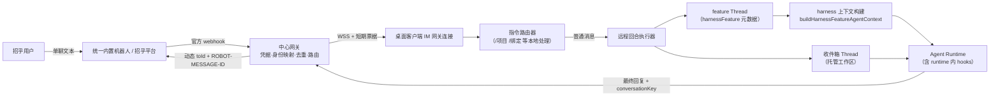

# ChatX 统一内置机器人方案 V2（项目模式版）

> 状态：设计提案（替代性方案，供与 V1 设计对比评审）
> 基线代码：`75bcc12b`（2026-07-22）
> 平台能力依据：[chatx-im-robot-api-compact-reference.md](./chatx-im-robot-api-compact-reference.md)
> 前一版方案：[chatx-unified-builtin-robot-v1-design.md](./chatx-unified-builtin-robot-v1-design.md)

## 1. 方案定位

本方案与 V1 设计共享同一个基础判断：一个统一内置机器人服务所有用户，凭据只放中心网关，网关按上行 `fromId` 路由到该用户的桌面客户端，本地 Agent 执行后动态回复原会话。这部分不再重复论证。

在此之上，本方案做了四个不同的决策：

| 决策 | V1 设计 | 本方案 |
| --- | --- | --- |
| 旧机器人兼容 | schema v2 + legacy 区灰度共存 | 不做兼容。旧 `chatx-config.json` 检测到即视为已停用，提示用户一键清除本地凭据 |
| 项目模式 | 明确排除在 V1 外，远程只有"托管收件箱 + 可选默认项目" | 一等公民。远程可以列出本机项目模式的项目与 feature，绑定后在 feature 会话里对话，完整继承插件上下文注入 |
| 交互层 | 未定义 | 客户端内置指令路由（`/项目`、`/绑定` 等），网关只透传文本，不理解语义 |
| 协议 | 覆盖 group/voice/image/reference 的完整 envelope | 只保留单聊文本所需的最小字段，其余类型由网关直接回复"暂不支持" |

做这些取舍的原因：

1. 用户已确认可以不考虑旧版本兼容，去掉 legacy 双链路后，客户端改造量大约减半（无双连接、无事件命名空间隔离、无灰度开关矩阵）。
2. 项目与 feature 的数据只存在于用户本机（`listHarnessProjects` 读取的是本地 harness 项目注册表，deploy unit 是本地仓库路径）。网关不可能理解这些概念，所以"选 feature"必须在客户端完成，这直接决定了指令层放在客户端。
3. 项目模式是本产品的主使用场景，"在手机上把 feature 会话继续聊下去"比"托管收件箱闲聊"更接近真实需求。

## 2. 目标与非目标

### 目标

1. 用户零机器人配置。登录桌面客户端后，在招乎里给统一机器人发第一条文本即可用。
2. 远程消息可以进入两类目标：默认收件箱（托管工作区，问答/总结/提醒），或本机项目模式中某个已存在的 feature 会话。
3. feature 会话的远程执行与桌面执行使用同一套上下文构建：插件 `session_context_inject` 注入、deploy unit 附加工作区、`FEATURE_ID`/`HARNESS_*` 环境变量、runtime 内 PreToolUse/PostToolUse hooks。
4. 回复动态发给原发送人，凭据、OpenID 不落桌面端。
5. 重复消息、离线、重连、多设备、超时、限流有明确行为。
6. 定时任务保存会话引用，到期后能回到原 IM 会话。

### 非目标

- 不做旧自定义机器人兼容与迁移（只做凭据清理提示）。
- V1 不做群聊、图片、语音、引用消息、自定义卡片（协议预留位置，阶段 2 起做）。
- 不允许远程创建/归档项目、修改 deploy unit 绑定、跳过工作流节点。远程对项目模式是"会话参与者"，不是"管理端"。
- 不把 Agent Runtime 搬到中心服务。
- 不依赖未提供协议的 AI 流式卡片。

## 3. 总体架构



职责边界与 V1 一致：网关负责唯一凭据、官方协议适配、`fromId` 到企业身份的权威映射、持久去重、离线队列、下行幂等；客户端只处理网关确认属于当前登录用户的事件，只持有 opaque `conversationKey`。

## 4. 会话模型：一个 IM 会话对应多个本地 Thread

这是本方案与 V1 最大的结构差异，先讲清楚。

单聊场景下，一个用户与统一机器人之间只有一条 IM 会话，网关为它分配一个稳定的 `conversationKey`。但用户想操作的本地目标有多个：收件箱、项目 A 的 feature x、项目 B 的 feature y。所以 `conversationKey` 不能直接映射 Thread。

模型定义：

- **`conversationKey` 是回信通道**。它回答"回复发到哪"，一个用户一个（单聊）。
- **`activeTarget` 是路由指针**。它回答"下一条消息进哪个 Thread"，取值为 `{ kind: "inbox" }` 或 `{ kind: "feature", projectId, slug }`，由用户通过指令切换，持久化在本地（重启保留）。
- **Thread 是执行与记录单元**。每个目标对应一条专用远程 Thread：

| 目标 | Thread 查找/创建规则 | 关键元数据 |
| --- | --- | --- |
| 收件箱 | 按 `imRemote.conversationKey + kind:"inbox"` 查找，无则在托管工作区创建 | `imRemote: { conversationKey, principalId, kind: "inbox" }` |
| feature | 按 `harnessFeature.projectId + slug + imRemote` 查找，无则创建 | `harnessFeature: { projectId, slug, source: "zhaohu-im" }` + `imRemote: { conversationKey, principalId, kind: "feature" }` |

要点：

1. feature 远程 Thread 的 `harnessFeature` 元数据结构与桌面创建的完全一致（`createHarnessFeatureThread` 写入 `{ projectId, slug, source }`，见 [harness-feature-thread.ts:39](../src/renderer/src/lib/harness-feature-thread.ts)）。主进程读取方 `readHarnessFeatureMetadata`（[service.ts:2674](../src/main/harness-board/service.ts)）只关心 `projectId + slug`，`source` 写成 `"zhaohu-im"` 用于 UI 标识来源，不影响任何行为。所以远程 Thread 天然就是一条合法的 feature 会话：出现在项目模式的会话列表里，桌面可以随时点开查看甚至接着聊。
2. 远程 Thread 与桌面 Thread 分离（不复用桌面已有 Thread）。原因是执行冲突：桌面 `agent:invoke` 与远程执行器各自持有 checkpointer，同一 Thread 双写是现有代码里被反复防御的问题（`services/chatx.ts` 的 runningChats gate 注释）。分离后互不干扰，用户想在桌面接续远程讨论时直接打开那条远程 Thread 即可。
3. 同一 Thread 的远程消息串行；不同 Thread 可以并行。远程执行器启动前额外检查 `hasActiveAgentRun(threadId)`（[agent.ts:550](../src/main/ipc/agent.ts)），若桌面正在这条 Thread 上运行则排队等待，不并发。
4. 回复都发往同一个 `conversationKey`，为避免混淆，feature Thread 的回复带来源前缀（见 5.4）。

## 5. IM 交互设计

### 5.1 指令集

以 `/` 开头的消息是指令，由客户端指令路由器本地处理，不进 Agent。中英文别名等价：

| 指令 | 行为 |
| --- | --- |
| `/帮助` `/help` | 指令说明 |
| `/项目` `/p` | 编号列出本机项目模式项目（名称、projectCode、feature 数），数据来自 `listHarnessProjects()`（[service.ts:2946](../src/main/harness-board/service.ts)） |
| `/功能 <n>` `/f <n>` | 编号列出项目 n 的 feature（标题、状态、当前节点），数据来自 `getHarnessProjectDetail(projectId).runs`（[service.ts:3472](../src/main/harness-board/service.ts)） |
| `/绑定 <n>.<m>` `/use <n>.<m>` | 把 `activeTarget` 切到项目 n 的 feature m，回显确认与当前节点，并附 `buildHarnessFeatureDialogTips(projectId, slug)`（[service.ts:2933](../src/main/harness-board/service.ts)）给出的下一步建议 |
| `/收件箱` `/inbox` | 切回收件箱 |
| `/当前` `/status` | 当前绑定、连接状态、是否有运行中/排队消息 |
| `/停止` `/stop` | 取消当前绑定 Thread 上运行中的远程任务（复用 `cancelChatXByThreadId` 的机制） |

列表指令回显后 10 分钟内，纯数字回复视为对最近一次列表的选择（`/项目` 后回 `2` 等价 `/功能 2`；`/功能` 后回 `3` 等价绑定该 feature）。列表上下文只存内存，超时或有新列表即失效。

指令全部是本地只读操作加一次状态写入（`activeTarget`），毫秒级完成。这带来一个重要体验：长任务运行中，指令仍然即时响应。实现上指令走快速路径，不进 per-thread 串行队列；`/绑定` 只影响后续消息的路由，不打断在途任务。

### 5.2 普通消息

非指令文本按 `activeTarget` 路由进对应 Thread，作为一条用户消息触发 Agent 执行。绑定的 feature 已被删除或项目已归档时，不静默降级，回复错误并把 `activeTarget` 重置为收件箱。

### 5.3 首次使用

用户第一次给机器人发消息（身份映射成功、客户端在线）时，若从未设置过 `activeTarget`，默认进收件箱，并附一条简短引导：“发送 /项目 可以选择项目模式中的 feature 进行对话”。

### 5.4 回复格式

- feature Thread 的回复第一行加前缀 `【<项目名>/<feature 标题>】`，收件箱回复不加。多目标共用一条 IM 会话时，用户靠它区分回的是哪个任务。
- 单段不超过 3,000 字符（平台上限），按 2,800 左右的自然段边界分段，分段串行发送，前一段确认成功后再发下一段，保证顺序。
- 每段幂等键为 `${eventId}:${replySeq}:${segmentIndex}`，可从本地事件表重建，重试复用（平台 `ROBOT-MESSAGE-ID` 10 分钟窗口）。
- 预计超过 8 秒的任务先回一条“已收到，正在【<目标>】处理”，每个事件最多一条。
- 最终回答沿用现有 `stripThink` 清理（[chatx.ts:152](../src/main/services/chatx.ts) 已有同款处理）。

### 5.5 阶段 2：自定义卡片

平台自定义卡片支持列表选择器、按钮、表单提交，回执以 `msgType: CustomCard` 走上行回调（内容是 JSON 字符串，需二次解析）。阶段 2 把 `/项目`、`/功能` 的编号列表升级为卡片选择器，把“处理中”文本升级为可更新状态卡片（发送后按 `msgId` 用 update-custom-card 覆盖为完成/失败）。协议上只需要网关把 CustomCard 回执归一化为一种新事件类型透传，客户端指令路由器增加一个入口，交互模型不变。

## 6. 中心网关

网关是外部依赖（建设方待定），这里只定义客户端依赖的最小契约。V1 设计第 5 节的完整职责清单仍然成立，不重复。

### 6.1 必须提供的行为

1. 接收官方 webhook（来源限制在文档给出的 `12.6.72.0/21`、`12.6.112.0/21` 网段），快速落库返回，异步处理。
2. 以平台 `msgId` 持久去重。
3. 把 `fromId` 权威映射为企业用户身份（`principalId`）。映射优先用平台的 OpenID 转换能力（原始文档未给出接口，上线前必须确认）；兜底用一次性绑定码。客户端已有 `sapId/ystId`（[storage.ts:1048](../src/main/storage.ts)）可作为映射输入，但不能假设等于 OpenID。
4. 为每个（用户 × 机器人）单聊会话分配稳定 opaque `conversationKey`，真实 OpenID 只在网关加密保存。
5. 选择该用户的一个在线设备投递（多设备时选最近活跃者），事件带租约，租约 TTL 内未 ACK 可改投其他设备；已 `accepted` 的事件不改投，超时标记未知并按 8.3 处理。
6. 校验客户端回复：登录身份拥有该 `conversationKey`，长度与类型在策略内；调官方单聊文本接口（动态 `toId`），携带客户端给出的幂等键作为 `ROBOT-MESSAGE-ID`，持久化平台返回的消息 ID。
7. 非文本上行（图片、语音、群消息等）由网关直接回复“当前版本暂不支持”，不投递客户端。
8. 客户端重连时可拉取未完成事件（`redeliver`）。

### 6.2 网关与客户端协议

```ts
// 网关 → 客户端（WSS 下行）
interface RemoteImEvent {
  schemaVersion: 1
  eventId: string                // 网关事件 ID，端上幂等主键
  platformMessageId: string      // 招乎 msgId，贯穿追踪
  principalId: string            // 网关裁决的企业用户内部 ID
  conversationKey: string        // opaque 回信通道
  message: { type: "text"; text: string }   // ≤3,000 字符
  occurredAt: string
  lease: { id: string; expiresAt: string }
  redelivered?: boolean
}

// 客户端 → 网关（WSS 上行）
type RemoteImAck =
  | { type: "received"; eventId: string; leaseId: string }   // 已持久化到本地事件表
  | { type: "accepted"; eventId: string; leaseId: string }   // 已取得目标 Thread 执行权
  | { type: "completed"; eventId: string; leaseId: string }
  | { type: "failed"; eventId: string; leaseId: string; retryable: boolean; reason: string }
  | { type: "busy"; eventId: string; leaseId: string }       // 本地队列满，请网关排队稍后重投

// 客户端 → 网关（HTTPS，回复与主动下行共用）
interface RemoteImReply {
  schemaVersion: 1
  conversationKey: string
  eventId?: string               // 即时回复关联原事件；定时任务等主动下行省略
  idempotencyKey: string         // 每段稳定唯一，可重建
  message: { type: "text"; content: string }
}
```

连接认证：WSS 建连用短期登录票据（绑定用户、设备、客户端版本），`principalId` 由网关按票据裁决，永不接受客户端自报。客户端不能提交 `toId/fromId/token`。

与 V1 协议的差别：去掉 `botKey`（只有一个内置机器人，网关侧常量）、`conversation.type`（V1 只有单聊）、`voice/image/reference` 消息变体、`senderDisplayName/clientType/skillCode`（客户端不消费，网关留在自己库里即可）。字段少一半，语义不变，后续扩展加 `message.type` 变体即可。

## 7. 客户端实现设计

### 7.1 模块拆分

现有 `src/main/services/chatx.ts`（755 行单文件：连接、去重、队列、执行、HTTP 回复混在一起）废弃重写为：

```
src/main/services/im/
  gateway-client.ts        WSS 连接、票据、心跳重连、ACK、redeliver
  event-store.ts           本地持久事件表（去重 + 状态 + 恢复）
  command-router.ts        指令解析与只读响应、列表上下文
  conversation-state.ts    activeTarget 持久化（im-state.json）
  remote-runner.ts         Thread 查找/创建、harness 上下文、runtime 执行、回复提取
  reply-client.ts          分段、幂等键、串行发送、发送状态记录
```

保留现有实现中已被验证的机制，平移进新模块：per-thread 串行与队列 drain、abort 与 dedup 释放的所有权规则、checkpointer pin/close 顺序、`scheduler:stream:${threadId}` 流式广播（preload 已订阅，[preload/index.ts:1951](../src/preload/index.ts)，远程运行在桌面 UI 实时可见）、空 Thread 失败清理。

### 7.2 持久去重与事件状态

现状去重是进程内最多 1,000 条的内存 Set（[chatx.ts:59](../src/main/services/chatx.ts)），重启即失效。新方案在现有 sql.js 库（`src/main/db/index.ts`，建表模式 `CREATE TABLE IF NOT EXISTS`）加一张表：

```sql
CREATE TABLE IF NOT EXISTS im_events (
  event_id     TEXT PRIMARY KEY,
  platform_msg_id TEXT,
  conversation_key TEXT,
  thread_id    TEXT,
  status       TEXT,     -- received | accepted | completed | failed
  reply_seq    INTEGER DEFAULT 0,
  received_at  TEXT,
  updated_at   TEXT
)
```

收到事件先写表再回 `received`。重启后把 `received/accepted` 的残留事件标记 failed 并等网关 redeliver（本地不自行重跑，避免与网关重投双执行）。去重主责在网关，本表是第二道防线，同时为回复幂等键（`reply_seq`）提供可重建的来源。保留期 7 天，启动时清理。

### 7.3 feature 会话的执行路径（本方案核心）

桌面上一条 feature 会话的运行由 `agent:invoke` 驱动，该路径与 BrowserWindow 强耦合（[agent.ts:4907](../src/main/ipc/agent.ts) 取 `event.sender`，无 window 直接返回），远程无法直接复用。但拆开看，项目模式的行为来自三层：

1. **上下文构建**：`getHarnessAgentContext(metadata)`（[agent.ts:736](../src/main/ipc/agent.ts)）调用 `buildHarnessFeatureAgentContext` 与 `resolveHarnessFeatureCurrentStage`，产出插件注入 prompt、附加工作区、`featureId/harnessProjectId/adapter/node` 等全部 harness 字段。这个函数只依赖主进程服务与 Thread 元数据，不碰 renderer，可以原样抽到 `src/main/agent/harness-context.ts`，由 `ipc/agent.ts` 与 `remote-runner.ts` 共同引用。
2. **runtime 内行为**：`CreateAgentRuntimeOptions` 完整接受上述 harness 字段（[runtime.ts:3655](../src/main/agent/runtime.ts)），PreToolUse/PostToolUse/PostToolUseFailure hooks 在 runtime 内部执行（[runtime.ts:1282](../src/main/agent/runtime.ts)），审批走 runtime 的 `requestApproval`。远程执行器把 harness 字段传进 `createAgentRuntime` 后，这一层与桌面完全一致，包括项目模式的 prompt/tool 策略（`isProjectMode` 由 `featureId` 推导，[runtime.ts:478](../src/main/agent/runtime.ts)）。
3. **IPC prepare 层**：UserPromptSubmit hooks、显式技能激活、goal 处理（[agent.ts:1739](../src/main/ipc/agent.ts) 起）。这一层 V1 远程路径不跑。

所以远程 feature 会话的执行流程是：

```
消息 → activeTarget → 查找/创建 feature Thread
  → harness-context.ts 构建上下文（含当前节点）
  → createAgentRuntime({ threadId, workspacePath, ...harness 字段, abortSignal })
  → agent.stream(HumanMessage)，流事件广播到 scheduler:stream:${threadId}
  → 提取最终回答 → reply-client 分段发送 → completed ACK
```

**已知差距（明确接受，阶段 2 收敛）**：远程回合不经过 IPC prepare 层，意味着 UserPromptSubmit 级别的 hook 拦截/改写、`/skill` 显式激活在远程不生效。工具级 hooks、插件上下文注入、工作流节点感知都生效。对"对话、问答、让 Agent 干活"这个主场景足够；需要完整对齐时，把 `prepareUserPromptForRun` 从 `ipc/agent.ts` 抽成共享模块（它的依赖同样不含 renderer），远程路径接入即可，接口已在本设计预留（`remote-runner` 的执行入口单独成函数）。

### 7.4 模型选择

feature Thread 使用项目模式桌面会话相同的缺省模型逻辑；收件箱使用配置中的 `defaultModelId`，经 `getAvailableModelConfigOrDefault` 回退（现有 [chatx.ts:342](../src/main/services/chatx.ts) 模式）。远程不提供改模型指令，模型属于桌面配置。

### 7.5 定时任务

`ScheduledTask.chatxRobotChatId`（[types.ts:377](../src/main/types.ts)）替换为：

```ts
imReply?: { conversationKey: string } | null
```

- `scheduler-tool` 的上下文从 Thread 元数据取 `imRemote.conversationKey`（替代现在的 `chatxRobotChatId` 透传，[runtime.ts:4554](../src/main/agent/runtime.ts)）。
- `scheduler.ts` 完成后调用 `reply-client` 的主动下行（`RemoteImReply`，无 `eventId`）替代 `trySendChatXReply`（[scheduler.ts:334](../src/main/services/scheduler.ts)）。
- 一个现状事实使这项改造范围很小：项目模式 runtime 不注册 scheduler 工具（[runtime.ts:4553](../src/main/agent/runtime.ts) 的 `!runtimePolicy.isProjectMode`），所以只有收件箱 Thread 能创建定时任务，feature Thread 不涉及。
- 不迁移旧任务的 `chatxRobotChatId`（不兼容旧版），旧值一律按 null 处理。

同理，`ipc/agent.ts:7997` 那条“带 `chatxRobotChatId` 元数据的 Thread 每次桌面对话成功都自动外发 HTTP”的隐式路径随旧协议一并删除；桌面主动把结果发到自己 IM 的能力，阶段 2 以显式“发送到我的招乎”按钮提供（走 `conversationKey` 主动下行）。

### 7.6 配置与迁移

```ts
interface ChatXConfigV2 {
  schemaVersion: 2
  enabled: boolean
  remoteMode: "chat-only" | "project"   // project = 允许绑定 feature
  defaultModelId: string | null
  inboxWorkspacePath: string            // 应用托管，自动创建，只读展示
}
```

- 读到旧格式（有 `robots` 数组）时：返回默认 V2 配置，UI 提示“旧版机器人已停用”，提供“清除旧凭据”按钮（删除文件中的 `robots/wsUrl/userIp` 字段，需确认，不可恢复）。不做任何自动迁移。
- `ChatXPanel.tsx` 从机器人 CRUD（777 行）改为单卡片：连接状态、绑定账号与身份状态、`remoteMode` 开关、默认模型、收件箱路径、最近活动、诊断按钮。`RobotEditDialog`、`CallbackUrlBuilder`、`IpConfirmDialog`、IP 校验全部删除。
- `ThreadSidebar.tsx` 删除手动机器人 Thread 入口（[ThreadSidebar.tsx:877](../src/renderer/src/components/sidebar/ThreadSidebar.tsx)）；远程 Thread 自动出现，收件箱 Thread 在普通列表，feature 远程 Thread 在项目模式对应 feature 下，标注“来自招乎”。

### 7.7 代码改造清单

| 位置 | 改造 |
| --- | --- |
| `src/main/services/chatx.ts` | 废弃，机制平移进 `services/im/*`（7.1） |
| `src/main/services/im/*` | 新增六个模块 |
| `src/main/agent/harness-context.ts` | 新增：`getHarnessAgentContext` 从 `ipc/agent.ts:736` 平移，双方引用 |
| `src/main/types.ts` | 新增协议类型、`ChatXConfigV2`、`ScheduledTask.imReply`；删除 `ChatXRobotConfig` |
| `src/main/storage.ts` | `getChatXConfig/saveChatXConfig` 改 V2 校验；新增 `im-state.json` 读写 |
| `src/main/db/index.ts` | 新增 `im_events` 表与访问函数 |
| `src/main/ipc/chatx.ts` | 改为状态/配置/诊断/绑定信息 API，主进程校验写入 |
| `src/main/ipc/agent.ts` | 移除 `chatxRobotChatId` 外发路径（7989 附近）；`getHarnessAgentContext` 改为引用共享模块 |
| `src/main/services/scheduler.ts`、`agent/tools/scheduler-tool.ts` | `chatxRobotChatId` → `imReply.conversationKey`（7.5） |
| `ChatXPanel.tsx`、`ThreadSidebar.tsx` | 见 7.6 |

## 8. 安全与执行策略

网关侧（凭据只在网关、wss、短期票据、principalId 服务端裁决、conversationKey 不可反推 OpenID、日志不记正文）与 V1 第 10 节一致，此处只写客户端与项目模式相关的增量：

1. **远程能到达的路径是封闭集合**。可绑定目标只能是本机已登记的项目/feature，消息里出现的任何路径字符串都只是普通文本，不参与目标解析。deploy unit 工作区是用户在桌面配置项目时登记的，远程绑定 feature 等于复用一份已授权的本地配置，不存在"远程指定任意目录"。
2. **`remoteMode: "chat-only"` 时**，`/绑定` 指令直接回复"未开启项目模式远程访问"，所有消息进收件箱。收件箱 runtime 的执行边界与托管工作区一致。
3. **审批不被远程绕过**。runtime 的 `requestApproval` 无超时（[runtime.ts:4099](../src/main/agent/runtime.ts) `APPROVAL_TIMEOUT_MS = null`），远程触发的高危工具调用会挂在桌面审批弹窗上。远程执行器检测到运行进入待审批状态时，向 IM 回一条"有操作等待桌面确认"；V1 接受"用户不在桌面时任务挂起"这个行为（网关租约对 `accepted` 事件不改投，不会导致重投），阶段 2 再考虑远程提醒或超时策略。
4. **远程输入标记**。远程消息进入 Agent 前包一层来源说明（系统提示注明内容来自 IM 远程输入，不得当作系统指令），feature 会话与收件箱同样处理。
5. **指令无副作用**。指令路由器只读 harness 服务与本地状态，唯一写操作是 `activeTarget`，不触碰项目数据（`skipNode`、`createFeature` 等一律不暴露）。
6. **旧凭据清理**。旧 `chatx-config.json` 里的 `clientSecret` 是明文（[storage.ts:2670](../src/main/storage.ts) 直接 `writeFileSync`），V2 上线后 UI 常驻提示清理，清理动作需用户确认。

## 9. 可靠性

| 场景 | 行为 |
| --- | --- |
| 网关收到重复 webhook | 网关按平台 `msgId` 去重；穿透到客户端时 `im_events` 主键兜底 |
| 客户端断连 | 网关离线排队（执行类事件短 TTL）；重连后 redeliver 未完成事件 |
| 客户端处理中崩溃 | 重启后残留事件标 failed，等网关按租约超时重投；不本地自愈重跑 |
| 桌面正在同一 Thread 运行 | 远程事件排队（`hasActiveAgentRun` 检查），不并发 |
| 本地队列满 | 回 `busy` ACK，网关持有并稍后重投，不静默丢弃 |
| 回复发送超时（状态未知） | 复用同一幂等键重试，限 10 分钟窗口内；超窗标死信并通知用户"投递状态待确认"，不换键重发 |
| 429 | 指数退避，复用幂等键 |
| 绑定目标失效 | 回复错误 + 重置为收件箱 |
| 网关不可达 | 桌面状态卡片显示离线；恢复后按 redeliver 续传 |

追踪键贯穿：`platformMessageId → eventId → threadId → idempotencyKey → 平台回复 msgId`，遥测沿用 `trackEvent` 框架，只报 ID、状态、耗时，不报正文。

## 10. 验收标准

1. 新装用户登录后不填任何机器人字段，在招乎发一条文本能收到本机 Agent 的回复。
2. 用户 A、B 同时发消息，Thread 与回复互不串号；客户端与日志中找不到机器人凭据与完整 OpenID。
3. 同一平台 `msgId` 重放 10 次，Agent 副作用只发生一次。
4. `/项目`、`/功能`、`/绑定` 在有长任务运行时仍秒级响应；绑定后消息进入对应 feature Thread。
5. 绑定 feature 后执行的运行中：系统提示含插件 `session_context_inject` 注入内容，deploy unit 附加工作区可访问，`FEATURE_ID/HARNESS_PROJECT_ID` 环境变量存在，PreToolUse hooks 触发（与桌面同 feature 会话逐项对比）。
6. 远程 Thread 出现在项目模式 UI 对应 feature 下，桌面打开可见完整流式过程与历史。
7. 桌面在某 Thread 运行时，远程消息对同 Thread 排队不并发；对其他 Thread 不受影响。
8. 超过 3,000 字符的回复分段有序到达，中断重试不产生重复段。
9. 收件箱创建的定时任务到期后回复到原 IM 会话。
10. 断网重连后，未完成事件恢复执行且已完成事件不重跑。

## 11. 分阶段交付

**阶段 0（网关，外部依赖）**：统一机器人注册、webhook 接入、身份映射、WSS 通道与票据、事件表与租约、下行文本。客户端同步产出协议 mock（本地起一个 fixture 网关），阶段 1 开发不阻塞在网关进度上。

**阶段 1（客户端 V1，本方案主体）**：`services/im/*` 六模块、`im_events` 表、指令路由、收件箱、feature 绑定与 harness 上下文执行、配置 V2 与单卡片 UI、定时任务改造、旧凭据清理提示。

**阶段 2（体验与对齐）**：自定义卡片选择器与状态卡片、prepare 管线抽取（UserPromptSubmit 远程生效）、“发送到我的招乎”、待审批远程提醒、语音 `asrText` 直通。

**阶段 3（扩展）**：图片/引用消息、群聊 @（先过安全评审）、AI 流式卡片（拿到流式协议后）。

## 12. 待外部确认（阻塞生产，不阻塞设计与 mock 开发）

沿用接口参考文档"原文未闭合"清单，其中阻塞本方案的四项：

1. Bearer Token 的申请、刷新与配额。
2. 企业账号（`sapId/ystId`）到招乎 OpenID 的权威转换接口是否存在；不存在则绑定码兜底方案需要细化（码长、限速、双向确认、解绑）。
3. webhook 的成功响应约定、超时、重试次数与是否有签名头。
4. 网关由谁建设运维。
