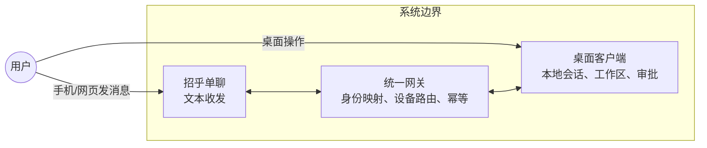
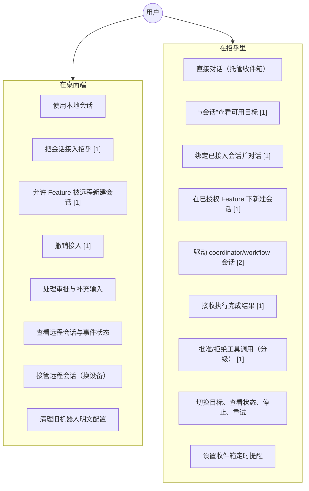
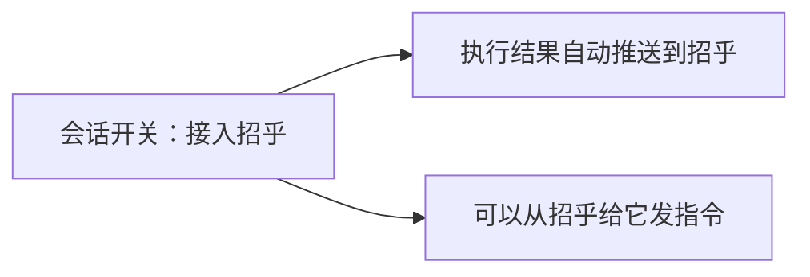
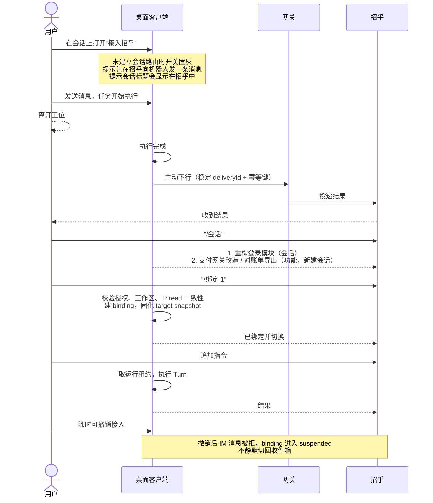
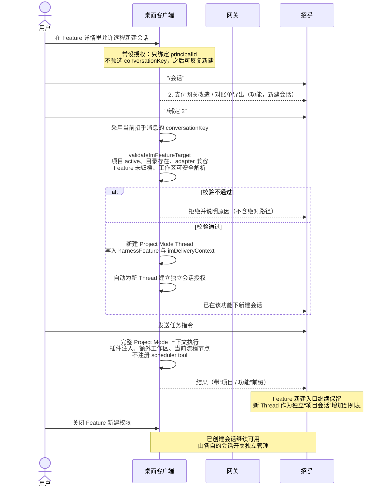
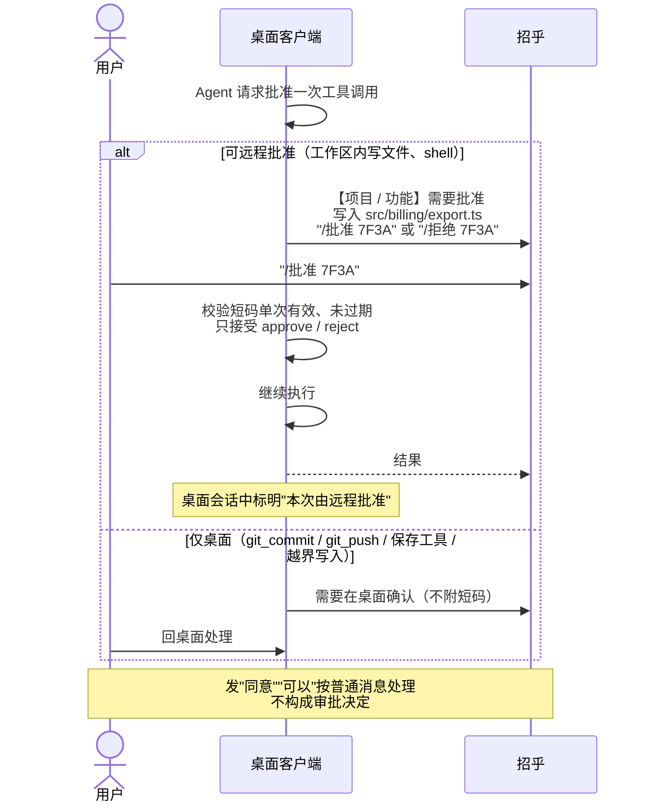
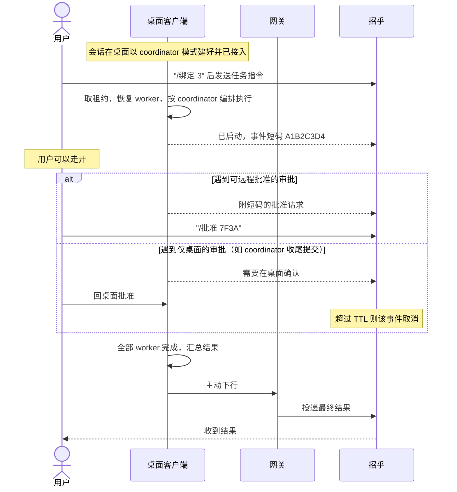

# 用例图：新方案下用户如何操作

> 配套文档：[分阶段方案](./chatx-im-remote-control-staged-plan.md)、[V1 实施规格](./chatx-unified-bot-v1-implementation-spec.md)
> 阶段标记：未标注为 V1 已有能力，`[1]` `[2]` 对应方案的两个阶段。

## 1. 参与者与系统边界

用户是同一个人，通过两个操作面接触系统。凭据和身份映射只存在于网关，桌面与招乎两侧都不持有。

## 2. 用例总图

## 3. 一个开关，两个后果

会话上只有一个开关，语义是"接入招乎"。打开后同时生效两件事，UI 文案必须把两条都写出来：

授权对象有两类，范围不同，文案要区分：

| 授权对象 | 位置                 | 含义                                          | 范围                         |
| -------- | -------------------- | --------------------------------------------- | ---------------------------- |
| 会话     | 会话上的开关         | 驱动这一个已有会话并接收其结果                | 一次性                       |
| Feature  | Feature 详情里的开关 | 允许当前企业主体从招乎在该 Feature 下新建会话 | `principalId` 级常设创建权限 |

从 Feature 新建成功的 Thread 会自动打开自己的“接入招乎”开关。之后 Feature 开关和会话开关互不继承：关闭 Feature 只阻止继续新建，关闭会话只撤销这一条 Thread。

## 4. 关键操作时序

### 4.1 `[1]` 接入已有会话，双向使用

### 4.2 `[1]` 在已授权 Feature 下新建会话

### 4.3 `[1]` 从招乎批准工具调用

远程审批是独立的全局开关，默认关闭，不随会话接入一起打开。

### 4.4 `[2]` 从招乎驱动 coordinator 会话

## 5. 招乎侧指令一览

| 指令 | 作用 | 阶段 |
| --- | --- | --- |
| 直接发文本 | 发给当前目标，默认是托管收件箱 | V1 |
| `/帮助` | 列出可用指令 | V1 |
| `/会话` | 列出已授权的会话与 Feature | `[1]` |
| `/绑定 <编号>` | 绑定会话，或在 Feature 下新建会话 | `[1]` |
| `/收件箱` | 切回默认聊天 | V1 |
| `/当前` | 当前目标、设备、运行、排队、审批状态 | V1 |
| `/停止` | 停止当前由 IM 发起的任务 | V1 |
| `/重试 <短码>` | 重试结果未知的事件 | V1 |
| `/批准 <短码>` | 批准一次工具调用 | `[1]` |
| `/拒绝 <短码>` | 拒绝一次工具调用 | `[1]` |

`/项目`、`/功能` 两级导航退休，暴露哪些 Feature 在桌面决定。

审批短码是随机、单次有效、随请求过期的，不可从请求 id 推算。自然语言不构成审批决定。

## 6. 各操作面的职责划分

有意做成不对称，安全相关的动作只在桌面：

| 能力 | 桌面 | 招乎 |
| --- | --- | --- |
| 新建普通会话 | 是 | 仅限已授权 Feature 下 |
| 新建 coordinator/workflow 会话 | 是 | 否 |
| 开关会话接入 | 是 | 否 |
| 授权 Feature 可远程新建 | 是 | 否 |
| 指定工作区路径 | 是 | 否 |
| 开关远程审批（全局） | 是 | 否 |
| 批准工作区内写文件 / shell | 是 | 是（需开启远程审批） |
| 批准 git 提交 / 推送 / 保存工具 | 是 | 否 |
| 会话级或永久批准 | 是 | 否（只能一次性） |
| 回答结构化补充输入 | 是 | 否 |
| 切换当前目标 | 否 | 是 |
| 停止 IM 发起的任务 | 是 | 是 |
| 接管远程会话（换设备） | 是 | 否 |

## 7. 一个典型的使用过程

上午在工位，用桌面打开"重构登录模块"这个 coordinator 会话，给它派了活，顺手打开接入招乎。

出门开会，手机上收到完成通知和结果。看完想再补一句，于是发 `/会话`，绑定这个会话，直接下指令。它跑到一半要写一个文件，招乎推来一条带短码的批准请求，看清路径后回了 `/批准 7F3A`，任务继续。再往后它要提交代码，这类招乎批不了，只提示回桌面确认。

中途想起"对账单导出"那个功能还没动，而它已经在桌面授权过远程新建，于是在招乎里 `/绑定` 选中它，直接开了一条新会话派活。这条会话是完整的项目模式，插件、额外工作区、当前流程节点都在。

再想起还有个报告要写，发 `/收件箱` 切回默认聊天让它草拟提纲，这一轮跑在应用托管目录里，不碰任何项目代码。原来那些任务完成后仍带着各自的会话标识返回，不会认错归属。

回到工位，把那次待确认的提交点掉，任务收尾。

下班前在桌面把"重构登录模块"的接入关掉。之后手机既收不到它的通知，也无法再对它下指令；其余已接入的会话不受影响。
