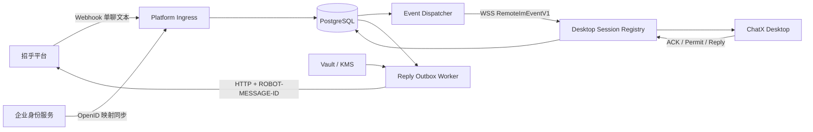

# ChatX 统一机器人网关 V1：JDK 1.8 + 内部增强版 Spring Boot 2.7.2 开发实施规格

> 状态：可作为内网代码 Agent 的任务母版；生产联调前必须完成 GW-00 冻结项
>
> 文档版本：V1.2（2026-07-30，补入招乎机器人接口原文契约）
>
> 目标读者：网关负责人、Java 开发者、低推理代码 Agent、客户端联调人员
>
> 对应客户端规格：`docs/chatx-unified-bot-v1-implementation-spec.md`
>
> 平台能力摘要：`docs/chatx-im-robot-api-compact-reference.md`
>
> 已冻结技术基线（2026-07-29）：**JDK 1.8 + 内部增强版 Spring Boot 2.7.2**；
> 桌面使用现有企业登录链路取得标准 JWT `ystIdToken`，V1 不新增统一凭据管理器；
> 招乎已提供机器人 Token 获取与刷新能力；当前收到的《招呼机器人接口》未包含这两个接口的
> URI、入参与出参，只在错误码章节给出了令牌服务指南链接，具体契约仍须在 GW-00 固化。

## 0. 代码 Agent 执行协议

本节优先级高于后文的解释性文字。把任务交给代码 Agent 前，负责人必须同时提供网关代码
仓库、冻结后的 `contracts/` 目录和一个明确的任务卡编号。**禁止让低推理模型一次实现整个
GW-01～GW-10。** 一次只做第 20 节的一张原子任务卡，验收通过后再进入下一张。

### 0.1 真相来源与冲突处理

| 优先级 | 真相来源                                                                         | 决定内容                                     |
| ------ | -------------------------------------------------------------------------------- | -------------------------------------------- |
| P0     | `contracts/schema/*.json`、`contracts/fixtures/v1/*`                             | WSS envelope、payload 字段、类型、必填和上限 |
| P1     | `src/main/services/im/gateway-ws-client.ts`、`src/shared/im-gateway-contract.ts` | Desktop 的响应关联、超时和运行时兼容行为     |
| P2     | 本文第 6～15、19 节                                                              | 网关状态机、事务、锁、持久化和开发顺序       |
| P3     | `docs/chatx-im-robot-api-compact-reference.md`                                   | 招乎平台已知能力与仍未闭合项                 |

发生冲突时的固定动作：

1. 立即停止修改冲突相关代码；
2. 在交付说明中列出文件、字段和冲突内容；
3. 不得擅自修改 schema、增加“兼容字段”、降低校验或猜测平台行为；
4. 由 Desktop 与 Gateway 负责人先更新 P0 契约及 golden fixture，再恢复开发。

特别提醒：冻结的 WSS V1 **没有** `DEVICE_PREFERENCE_UPDATE`。`preferred_remote` 只能由
GW-00 冻结的管理面或数据库初始化流程设置；代码 Agent 不得自行向 WSS schema 添加该命令。

### 0.2 未冻结占位符

下列值目前不是本文能够替代的生产输入。代码中统一使用强类型配置或 Port，不得写假 URI、
假字段名或默认密钥：

```text
${INTERNAL_BOOT_PARENT_GROUP_ID}
${INTERNAL_BOOT_PARENT_ARTIFACT_ID}
${INTERNAL_BOOT_PARENT_VERSION}
${YST_JWK_SET_URI}
${YST_JWT_ISSUER}
${YST_JWT_AUDIENCE}
${YST_PRINCIPAL_CLAIM}
${YST_ALLOWED_JWS_ALGORITHM}
${ZHAOHU_CALLBACK_AUTH_MODE}
${ZHAOHU_CALLBACK_SUCCESS_STATUS_AND_BODY}
${ZHAOHU_TOKEN_ACQUIRE_URI_AND_SCHEMA}
${ZHAOHU_TOKEN_REFRESH_URI_AND_SCHEMA}
${IDENTITY_SYNC_AUTH_AND_SCHEMA}
${APPROVED_CRYPTO_ADAPTER}
${APPROVED_SECRET_ADAPTER}
```

处理规则：

- GW-00 未完成时，可以实现 domain、application service、Port、Mock Adapter 和测试；
- `local/test` 可用固定测试值，但类名和 `@Profile` 必须明确包含 `Local`、`Test` 或 `Mock`；
- `prod` 不允许为缺失配置提供默认值，必须在启动自检阶段失败；
- 禁止用“先写死以后再改”、跳过 audience、信任 callback body 或静态机器人 Token 来解锁开发。

当前 frozen WSS schema 对部分外部标识只写了 `minLength`，而第 6 节数据库建议使用了
`varchar(128/256)`。GW-00 必须在 GW-02 前二选一并同步契约 fixture：为 `deviceId`、
`eventId`、`conversationKey`、`deliveryId`、`idempotencyKey` 等字段冻结 `maxLength`，或把相应
数据库列改成能覆盖冻结契约的类型。Agent 不得只依赖数据库截断，也不得在 schema 之外
偷偷增加不同上限。

### 0.3 每张任务卡的完成定义

一张任务卡只有同时满足以下条件才算完成：

1. 只修改任务卡允许的包和文件，没有顺手实现后续阶段；
2. 所有状态修改都经过 application service 和显式 SQL/CAS；
3. 数据库事务内没有平台 HTTP、WSS send、远程 KMS/Vault 或身份服务调用；
4. 失败路径具有稳定 reasonCode，日志没有 Token、OpenID、principalId 或消息正文；
5. 单元测试、Testcontainers 并发测试、契约 fixture 测试按任务要求通过；
6. `./mvnw verify` 在真实 JDK 1.8 运行成功，class major version 为 52；
7. Agent 最终报告“改动文件、迁移、状态机变化、测试命令与结果、未关闭阻塞项”；
8. 人工 reviewer 按第 16 节清单审查通过。

Agent 如果无法满足任一项，应返回 `BLOCKED` 和精确原因，不得返回“基本完成”。

## 1. 可行性结论

可行。网关实现为一个 **JDK 1.8 + 内部增强版 Spring Boot 2.7.2 模块化单体**，
以关系数据库作为唯一持久协调点，首版只实现：

- 招乎单聊文本 webhook 入站；
- 官方机器人 Token 托管和单聊文本下行；
- OpenID 到企业 `principalId` 的权威映射；
- 桌面设备认证 WSS、心跳和在线状态；
- conversation 固定设备路由与 `deviceEpoch`；
- 每会话严格顺序、重投、事件执行许可和显式接管；
- 客户端 ACK、回复 outbox、平台幂等和结果未知；
- 指标、审计、保留期和故障恢复。

V1 不需要微服务拆分，也不建议先引入 Redis。平台 webhook 落库、设备事件投递和平台回复都走持久状态机；多实例 worker 使用数据库行锁和 `SKIP LOCKED` 协调。该方案牺牲一部分极限吞吐，换取清晰的一致性边界和较低实现风险，适合内网代码 Agent 分任务交付。

以下三项任一未满足时，不得进入生产联调：

1. OpenID 身份映射、桌面 JWT 验签参数和官方机器人 Token 获取/刷新契约已经确定；
2. 平台 webhook 验真、成功响应、超时和重试契约已经确定；
3. 客户端 WSS JSON Schema 与本计划的状态机已经冻结并完成双边契约测试。

主要风险与处理：

| 风险                                      | 判断         | V1 处理                                                           |
| ----------------------------------------- | ------------ | ----------------------------------------------------------------- |
| 平台签名、Token 字段、回调 ACK 未完全闭合 | 高，生产阻塞 | Token 能力已确认但 DTO 未提供；GW-00 冻结正式契约，Agent 不得猜测 |
| OpenID 权威映射未确定                     | 高，生产阻塞 | 身份同步先于消息使用；未知身份不投递桌面                          |
| 多实例 WSS 路由                           | 中，可控     | node-local socket + DB session/generation + DB polling            |
| 外部副作用 exactly-once                   | 无法普遍保证 | lease、稳定幂等键和 `OUTCOME_UNKNOWN`，不自动重跑                 |
| Java 8 并发与依赖兼容                     | 中，可控     | 内部 BOM 锁版本、限界线程池、CI 禁止 Java 9+ API                  |
| 代码 Agent 能力有限                       | 高，可控     | 一次一个 PR、冻结 schema、Testcontainers 和人工 gate              |

## 2. 开发前必须冻结的输入

代码 Agent 不得猜测下列配置。负责人先填写“生产决定”，再开始 GW-01：

| 决策项       | 本计划开发默认                                                 | 生产决定/阻塞条件                                    |
| ------------ | -------------------------------------------------------------- | ---------------------------------------------------- |
| 部署边界     | 单企业、单官方机器人、一套网关部署                             | 若需要多企业，必须先补 tenant 隔离规格               |
| JDK          | **JDK 1.8**                                                    | 已冻结；生产、CI、开发机均以 Java 8 字节码验收       |
| Spring Boot  | **内部增强版 Spring Boot 2.7.2 parent/BOM**                    | 已冻结；补丁号和 parent 坐标由内网框架团队提供       |
| 构建         | Maven Wrapper，`source/target=1.8`                             | 冻结内网仓库、Maven 版本和 parent 坐标               |
| 数据库       | PostgreSQL 15+                                                 | 若改 MySQL/Oracle，先重写锁与迁移测试                |
| 平台上行     | webhook 优先                                                   | Kafka 只作为后续入站 Adapter，不与 webhook 同时首发  |
| 桌面认证     | 标准 JWT `ystIdToken`，由 Spring Security Resource Server 验证 | 冻结 issuer/JWKS、算法、audience 和主体 claim        |
| 平台回调验真 | 入口网段 allowlist + 平台正式签名/认证                         | 原文未定义签名；生产不得只信任请求体                 |
| 身份映射     | 权威服务同步 `principalId ↔ OpenID` 到网关                     | 冻结同步方式、解绑和冲突处理                         |
| 敏感字段加密 | 内网 KMS/密码服务提供 approved codec                           | 禁止 Agent 自制生产加密算法                          |
| 机器人 Token | 招乎获取/刷新接口 + 网关 Token Provider；client 凭据进 Vault   | 能力已确认；仍需令牌指南原文以冻结 URI、DTO 和错误码 |
| 运行环境     | 至少两个实例 + 负载均衡；WSS 保持长连接                        | 冻结 pod/nodeId、TLS、超时和容量                     |

开发环境允许使用 Mock Identity、Mock Token Provider 和测试加密 codec，但这些 Bean 只能存在于
`local/test` profile。`prod` profile 缺少任何正式实现时必须启动失败，不能静默降级。

桌面 V1 继续使用现有登录、刷新和 `models:upsertUserInfo` 链路，不新增统一凭据管理器。
网关不能复用客户端“验签代码”——客户端当前没有本地 JWT 验签；网关必须独立完成标准 JWT
密码学验证。若 `ystIdToken` 的 `aud` 不包含统一机器人网关，则 GW-00 必须改为身份服务
Token Exchange，禁止放宽 audience 校验。

## 3. V1 明确不做

- 群聊、群 @、图片、语音、文件、引用消息和卡片；
- AI 流式卡片、消息更新和撤回；
- 平台到网关的 WebSocket 上行；
- Agent Runtime、项目、Feature、Thread、工作区或本地路径逻辑；
- IM 文本指令解析；网关只传递文本，指令由桌面客户端处理；
- 自动把离线会话转投另一设备；
- 跨设备自动重跑已经执行或结果未知的事件；
- 无外部幂等保证时宣称 exactly-once；
- 首版拆分身份、路由、WSS、outbox 为多个微服务；
- 为“以后可能需要”提前引入 Redis、内部 Kafka 或分布式事务框架。

## 4. 推荐技术基线

### 4.1 依赖

只使用内网 BOM 批准的版本，建议依赖集合：

- `spring-boot-starter-web`
- `spring-boot-starter-websocket`
- `spring-boot-starter-validation`
- `spring-boot-starter-security`
- `spring-boot-starter-oauth2-resource-server`
- `spring-boot-starter-jdbc`
- `spring-boot-starter-actuator`
- `micrometer-registry-prometheus`
- `flyway-core`
- PostgreSQL JDBC Driver
- `spring-boot-starter-test`
- 与 JDK 1.8 兼容并由内部 BOM 固定的 Testcontainers PostgreSQL 1.x
- WireMock 2.x 或内网等价 HTTP Mock

约束：

- 使用 `NamedParameterJdbcTemplate` 和显式 SQL，不使用 JPA 自动状态更新；
- 协议 DTO 使用普通不可变 JavaBean（`final` 字段、构造器、getter、显式
  `equals/hashCode/toString`），不使用 `record`，也不依赖 Lombok 生成协议语义；
- 使用 Flyway 管理所有 schema 变更，禁止应用启动时 `ddl-auto`；
- WSS 使用独立的 strict `ObjectMapper`：开启 unknown-property、trailing-token、duplicate-key
  拒绝并禁止未知 enum 降级；平台 callback 使用另一 mapper，只允许忽略正式文档允许扩展的
  未知字段。不得修改一个 global mapper 同时服务两种兼容策略；
- 平台 HTTP 调用使用 Spring `RestTemplate` 与内部批准的连接池实现；必须配置连接、读取和
  连接池等待超时；禁止使用 Spring 6 `RestClient` 或 Java 11 `HttpClient`；
- 重试由持久 outbox worker 驱动，不用只存在内存中的注解重试；
- WSS 使用 Spring Servlet WebSocket；worker、调度和异步任务使用有界
  `ThreadPoolTaskExecutor`/`ThreadPoolTaskScheduler`，禁止虚拟线程和无界队列；
- 使用 Spring Boot 2.7 的 `javax.servlet.*`、`javax.validation.*`，禁止引入 Boot 3 的
  `jakarta.*` API；
- 禁止 Java 9+ 语法/API，包括 `var`、`record`、sealed class、switch expression、
  `List.of/Map.of`、`Stream.toList()` 和文本块；
- 时间统一为 UTC `Instant`，数据库使用 `timestamptz`；
- ID 使用服务端 UUID；外部 ID 永远按字符串保存，不推断格式。

Maven 至少固定以下编译属性；若内部 parent 已提供相同配置，不重复覆盖：

```xml
<properties>
  <java.version>1.8</java.version>
  <maven.compiler.source>1.8</maven.compiler.source>
  <maven.compiler.target>1.8</maven.compiler.target>
  <project.build.sourceEncoding>UTF-8</project.build.sourceEncoding>
</properties>
```

CI 必须在 JDK 1.8 上执行 `./mvnw verify`，并检查产物 class major version 为 52。
代码 Agent 不得自行把 parent、Spring Framework、Spring Security、Jackson、Flyway、
PostgreSQL Driver、Testcontainers 或 WireMock 升级到内部 BOM 之外的版本。

### 4.2 工程结构

V1 使用单 Maven module、一个可部署 jar，按端口/适配器分包：

```text
src/main/java/com/cmb/chatx/gateway/
  GatewayApplication.java
  config/
  domain/
    identity/
    device/
    conversation/
    event/
    reply/
  application/
    ingress/
    routing/
    dispatch/
    permit/
    reply/
    takeover/
  adapter/in/platform/webhook/
  adapter/in/desktop/websocket/
  adapter/in/admin/identity/
  adapter/out/platform/
  adapter/out/secret/
  adapter/out/crypto/
  adapter/out/persistence/
  worker/
  observability/

src/main/resources/
  application.yml
  application-local.yml
  application-prod.yml
  db/migration/

contracts/
  openapi/platform-webhook-v1.yaml
  openapi/identity-sync-v1.yaml
  asyncapi/desktop-gateway-ws-v1.yaml
  schema/*.json
```

包之间只通过 application service 和 domain 类型调用。Controller/WebSocket Handler 不直接写 SQL，worker 不直接拼平台 HTTP 请求。

## 5. 总体架构与责任边界

可编辑架构图：`docs/diagrams/chatx-unified-bot-gateway-v1.drawio`



责任边界：

- **平台入站 Adapter**：验真、字段校验、单聊文本筛选和平台 msgId 去重；
- **身份模块**：只接收权威映射，不允许客户端自报 OpenID；
- **路由模块**：创建 opaque `conversationKey`，固定设备并维护 `deviceEpoch`；
- **设备模块**：认证主体、HELLO、心跳、在线 session 和 stale connection 防护；
- **事件模块**：分配 `conversationSeq`、严格首次投递顺序、重投和终态；
- **许可模块**：确保旧设备或失效 epoch 无法开始/继续本地副作用；
- **回复模块**：验证当前 route、持久幂等、按段有序调用平台；
- **数据库**：所有跨实例一致性和恢复的唯一真相；内存只保存当前节点实际 WSS 连接对象。

网关不得接收、推断或保存 `projectId`、Feature、Thread、workspace path、模型或 Agent 状态。

## 6. 数据模型

### 6.1 通用规则

- 表前缀统一为 `chatx_gw_`；
- 所有表包含 `created_at`、`updated_at`；
- 可更新聚合包含 `version bigint not null`，CAS 更新必须带旧 version；
- 文本消息和 OpenID 以 approved codec 加密，日志中不得输出明文；
- OpenID 查找使用 approved codec 生成的稳定 keyed fingerprint，禁止以明文建索引；
- 所有唯一约束冲突都按幂等读取处理，不能转换为 500；
- worker 查询使用小批次 `FOR UPDATE SKIP LOCKED`，事务中不得调用外部 HTTP/WSS。

### 6.2 表清单

#### `chatx_gw_platform_inbox`

所有通过验真的平台回调先写本表，因此未知身份、不支持类型和重复回调也有稳定去重结果：

| 字段                                     | 说明                                           |
| ---------------------------------------- | ---------------------------------------------- |
| `inbox_id uuid PK`                       | 入站记录                                       |
| `platform_message_id varchar(256)`       | 平台 msgId，全局唯一                           |
| `from_id_fingerprint varchar(128)`       | keyed fingerprint                              |
| `from_id_ciphertext text`                | 加密发送人 OpenID                              |
| `robot_open_id_fingerprint varchar(128)` | 接收机器人标识                                 |
| `message_type varchar(64)`               | 原始 msgType                                   |
| `message_ciphertext text null`           | 支持的文本正文                                 |
| `occurred_at timestamptz`                | 平台时间                                       |
| `state varchar(32)`                      | `RECEIVED/NORMALIZED/IGNORED/IDENTITY_UNKNOWN` |
| `event_id uuid null`                     | 成功归一化后的 event                           |
| `result_code varchar(64)`                | 稳定处理结果                                   |

唯一约束：`platform_message_id` 唯一。重复回调读取原记录并返回同一平台 ACK，不重新查身份、分配 seq 或生成提示消息。

#### `chatx_gw_identity_binding`

| 字段                               | 说明              |
| ---------------------------------- | ----------------- |
| `binding_id uuid PK`               | 映射标识          |
| `principal_id varchar(128)`        | 企业主体          |
| `open_id_fingerprint varchar(128)` | keyed fingerprint |
| `open_id_ciphertext text`          | 加密 OpenID       |
| `status varchar(32)`               | `ACTIVE/REVOKED`  |
| `version bigint`                   | CAS               |

唯一约束：active 映射中 `principal_id` 唯一、`open_id_fingerprint` 唯一。映射冲突必须拒绝并告警，不能覆盖。

#### `chatx_gw_device`

| 字段                        | 说明                                             |
| --------------------------- | ------------------------------------------------ |
| `device_id varchar(128) PK` | 桌面生成的稳定设备 ID                            |
| `principal_id varchar(128)` | 必须等于 Spring Security 已验证的 JWT 主体 claim |
| `display_name varchar(128)` | 脱敏设备名                                       |
| `preferred_remote boolean`  | 首次 route 优先设备                              |
| `status varchar(32)`        | `ACTIVE/REVOKED`                                 |
| `last_seen_at timestamptz`  | 最近心跳                                         |
| `version bigint`            | CAS                                              |

唯一约束：一个 principal 最多一台 `preferred_remote=true` 设备；更新主设备必须事务化。

#### `chatx_gw_device_session`

| 字段                                   | 说明                     |
| -------------------------------------- | ------------------------ |
| `session_id uuid PK`                   | 每次 WSS 连接唯一        |
| `device_id varchar(128)`               | 设备                     |
| `node_id varchar(128)`                 | 当前网关实例             |
| `connection_generation bigint`         | 防止旧 close 覆盖新连接  |
| `state varchar(32)`                    | `ONLINE/OFFLINE/REVOKED` |
| `connected_at/heartbeat_at/expires_at` | 在线窗口                 |

同一设备只允许最高 generation 为 ONLINE。旧连接的 heartbeat/close 必须被忽略。

#### `chatx_gw_conversation`

| 字段                                             | 说明                                                     |
| ------------------------------------------------ | -------------------------------------------------------- |
| `conversation_key uuid PK`                       | 发给客户端的 opaque key                                  |
| `principal_id varchar(128)`                      | 企业主体                                                 |
| `platform_conversation_fingerprint varchar(128)` | 单聊来源 fingerprint                                     |
| `peer_open_id_fingerprint varchar(128)`          | 本会话用户 OpenID keyed fingerprint                      |
| `peer_open_id_ciphertext text`                   | 本会话不可变的加密回复目标                               |
| `robot_open_id_fingerprint varchar(128)`         | 创建会话时的官方机器人标识                               |
| `next_sequence bigint`                           | 下一入站 seq，初始 1                                     |
| `delivery_cursor_sequence bigint`                | 已 durable received 或投递前已终结的连续最大 seq，初始 0 |
| `device_wait_active boolean`                     | 当前是否处于“无设备等待”窗口                             |
| `device_wait_generation bigint`                  | 每次进入新等待窗口递增，用于提示幂等                     |
| `last_offline_notice_at timestamptz null`        | 防止重复离线提示                                         |
| `status varchar(32)`                             | `ACTIVE/SUSPENDED/REVOKED`                               |
| `version bigint`                                 | CAS                                                      |

V1 单企业单机器人下，`platform_conversation_fingerprint` 唯一。

#### `chatx_gw_conversation_route`

| 字段                          | 说明                       |
| ----------------------------- | -------------------------- |
| `conversation_key uuid PK/FK` | 会话                       |
| `device_id varchar(128)`      | 固定设备                   |
| `device_epoch bigint`         | 首次为 1，接管递增         |
| `state varchar(32)`           | `ACTIVE/SUSPENDED/REVOKED` |
| `route_reason varchar(32)`    | `PRIMARY/RECENT/TAKEOVER`  |
| `version bigint`              | CAS                        |

route 只在首次选路或显式接管时改变。普通重连、目标切换和消息处理不得递增 epoch。

#### `chatx_gw_inbound_event`

| 字段                                      | 说明                                                         |
| ----------------------------------------- | ------------------------------------------------------------ |
| `event_id uuid PK`                        | 网关事件 ID                                                  |
| `platform_message_id varchar(256)`        | 平台去重 ID                                                  |
| `conversation_key uuid`                   | 会话                                                         |
| `conversation_sequence bigint`            | 网关分配 seq                                                 |
| `assigned_device_id varchar(128) null`    | 事件冻结的目标设备；首次无 route 等待时为空                  |
| `device_epoch bigint null`                | 事件冻结的 route epoch；与 assigned device 同空或同非空      |
| `message_type varchar(32)`                | V1 只允许 `TEXT`                                             |
| `message_ciphertext text`                 | 加密消息正文                                                 |
| `occurred_at timestamptz`                 | 平台消息时间                                                 |
| `state varchar(32)`                       | 见第 7 节                                                    |
| `reason_code varchar(64)`                 | 稳定原因码                                                   |
| `client_retryable boolean null`           | `failed` ACK 的原始 retryable，仅供展示/审计；网关不自动重跑 |
| `delivery_attempt_count int`              | WSS 投递尝试次数，初始 0；用于 `redelivered` 与退避          |
| `next_delivery_at timestamptz`            | 重投时间                                                     |
| `received_ack_at/accepted_at/terminal_at` | 状态时间                                                     |
| `version bigint`                          | CAS                                                          |

唯一约束：`platform_message_id` 唯一；`conversation_key + conversation_sequence` 唯一。

#### `chatx_gw_event_lease`

| 字段                                    | 说明                                |
| --------------------------------------- | ----------------------------------- |
| `lease_id uuid PK`                      | 下发给客户端                        |
| `event_id uuid`                         | 事件                                |
| `device_id varchar(128)`                | 被授权设备                          |
| `session_id uuid`                       | 发放 lease 时的在线 session         |
| `device_epoch bigint`                   | 被授权 epoch                        |
| `status varchar(32)`                    | `ACTIVE/REVOKED/EXPIRED`            |
| `expires_at/last_renewed_at/revoked_at` | 生命周期                            |
| `permit_acquired_at timestamptz null`   | 客户端真正启动 Runtime 前置许可时间 |
| `revoke_reason varchar(64)`             | 接管、断开或终态                    |

一个 event 任一时刻只能有一个 ACTIVE lease。重投允许创建新 lease，但旧 lease 必须先失效。

#### `chatx_gw_client_command`

保存需要 durable 去重的客户端 WSS 命令：`device_id + command_id` 联合主键、
`principal_id`、`session_id`、`command_type`、`payload_hash`、`result_type`、
`result_json`、`expires_at`。`result_type` 只允许 `NO_FRAME/FRAME`；`result_json` 只保存可安全
重放的服务端响应，不保存原始请求。HEARTBEAT、SYNC_REQUEST 不写本表。同 commandId 携带
不同 payload hash 必须拒绝并记录安全告警。

#### `chatx_gw_reply_outbox`

| 字段                                | 说明                                            |
| ----------------------------------- | ----------------------------------------------- |
| `reply_id uuid PK`                  | 回复记录                                        |
| `source varchar(32)`                | `CLIENT_REPLY/SYSTEM_NOTICE`                    |
| `idempotency_key varchar(256)`      | 客户端稳定键或网关生成的 system notice 稳定键   |
| `payload_hash varchar(64)`          | 规范化业务 payload 的 SHA-256，用于冲突检测     |
| `platform_idempotency_uuid uuid`    | 固定 `ROBOT-MESSAGE-ID`                         |
| `delivery_id varchar(256)`          | 一次完整回复/主动消息                           |
| `event_id uuid null`                | Scheduler 主动消息可空                          |
| `conversation_key uuid null`        | 正常回复/离线提示的会话目标                     |
| `direct_to_id_ciphertext text null` | 仅未知身份系统提示使用                          |
| `expected_device_epoch bigint null` | 客户端回复必须有；系统提示可空                  |
| `segment_index int`                 | **0-based**                                     |
| `segment_count int`                 | 1～8                                            |
| `content_ciphertext text`           | 加密正文                                        |
| `state varchar(32)`                 | `PENDING/SENDING/SENT/UNKNOWN/PERMANENT_FAILED` |
| `attempt_count/next_attempt_at`     | 重试                                            |
| `first_attempt_at timestamptz null` | 计算平台幂等安全窗口                            |
| `platform_message_id varchar(256)`  | 成功后保存                                      |
| `last_error_code varchar(64)`       | 脱敏错误                                        |
| `version bigint`                    | CAS                                             |

唯一约束：`idempotency_key` 唯一；`delivery_id + segment_index` 唯一。Check 约束要求 `conversation_key` 与 `direct_to_id_ciphertext` 恰好一个非空；direct target 只允许 `SYSTEM_NOTICE`。同 delivery 的 segmentCount 必须一致，只有 0..count-1 全部落库后才允许发送，并按 index 依次发送。

#### `chatx_gw_audit_log`

只记录身份绑定、设备撤销、route 创建/接管、lease 撤销、人工 redrive 等安全事件。不得记录消息正文、Token 或 OpenID 明文。

## 7. 状态机

### 7.1 入站事件

```text
WAITING_DEVICE ──设备上线且建 route──→ QUEUED
      └──TTL 到期──→ EXPIRED

QUEUED ──严格 seq 首投 + lease──→ LEASED
LEASED ──received ACK──→ RECEIVED
LEASED ──busy/ACK 超时──→ QUEUED
RECEIVED ──accepted ACK──→ ACCEPTED
RECEIVED/ACCEPTED ──waiting_desktop ACK──→ WAITING_DESKTOP
RECEIVED/ACCEPTED/WAITING_DESKTOP
  ├──completed ACK──→ COMPLETED
  ├──cancelled ACK──→ CANCELLED
  ├──failed ACK──→ FAILED
  └──已取得 permit 后许可丢失/强制接管──→ OUTCOME_UNKNOWN
```

规则：

- `COMPLETED/CANCELLED/FAILED/EXPIRED/OUTCOME_UNKNOWN` 对自动执行均为终态；`OUTCOME_UNKNOWN` 只能经受审计的 reconciliation 或用户新建重试事件处理；
- 重复 ACK 返回第一次持久结果；非法回退返回稳定 `INVALID_EVENT_TRANSITION`；
- `busy` 不推进 `delivery_cursor_sequence`，同会话后续 seq 继续被阻塞；
- `received` 必须满足 `sequence == delivery_cursor_sequence + 1`，事务内推进 cursor；
- `WAITING_DEVICE` 在投递前进入 EXPIRED，或接管前事件在未 acquire permit 时被取消，也必须在 conversation 行锁内推进连续 cursor，避免永久 seq 空洞；
- `accepted/waiting/completed` 不能代替 `received`，客户端必须先发 durable received ACK；
- permit 尚未 acquire 时 lease 过期不代表执行过：route 未变且原设备重连后可以取得新 lease；permit 已 acquire 后断连、过期或撤销则进入 `OUTCOME_UNKNOWN`，不得退回 QUEUED；
- 网关收到当前设备重连后可以重投未终态 event，客户端依靠 eventId 去重；接管到新设备不得自动重投已经 `RECEIVED` 的事件用于执行。

### 7.2 回复 outbox

```text
PENDING → SENDING → SENT
              ├──可安全重试──→ PENDING
              ├──结果未知──→ UNKNOWN
              └──确定不可重试──→ PERMANENT_FAILED
```

- claim `PENDING` 时先在短事务内改 `SENDING` 并 commit，再调用平台 HTTP；
- worker 崩溃遗留的 `SENDING` 在 `first_attempt_at` 后安全窗口内回到 `PENDING`，仍使用原 platform UUID；超过窗口且无法查询结果则进入 `UNKNOWN`；
- 平台 `code == 0` 才是成功，必须保存返回 `msg`；
- HTTP 200 但 `code == 120` 按明确发送失败处理，不得标 SENT；
- HTTP 401 最多刷新 Token 后重试一次；429、5xx、网络失败按持久退避重试；400/403/404 和明确业务参数错误进入永久失败；
- 超时或连接中断使用同一 `ROBOT-MESSAGE-ID`，只在平台 10 分钟幂等窗口内重试；开发默认最多 8 分钟；
- 超过安全窗口且没有官方结果查询能力时进入 `UNKNOWN`，不得生成新幂等 UUID 再发；
- 同 delivery 的后一段必须等待前一段 `SENT`；前一段 UNKNOWN/永久失败时暂停后续段并告警。

网关 system notice 的稳定键固定为：

- 未映射身份：`system:identity:<platformMessageId>`；
- 无在线设备：`system:offline:<conversationKey>:<deviceWaitGeneration>`；
- 接管结果：`system:takeover:<conversationKey>:<newEpoch>`，一条消息汇总取消/结果未知事件。

### 7.3 事务与锁边界

| 操作                    | 同一短事务内必须锁定/写入                                                     | 事务外动作                       |
| ----------------------- | ----------------------------------------------------------------------------- | -------------------------------- |
| webhook 入站            | platform inbox、identity lookup、conversation seq、event、route/system notice | 无；commit 后返回平台 ACK        |
| received ACK/投递前终结 | event、ACTIVE lease（如有）、conversation `delivery_cursor_sequence`          | 推动下一次 dispatcher poll       |
| permit acquire/renew    | session、route、event、lease                                                  | 返回 PERMIT_RESULT               |
| remote reply 接收       | route/epoch、幂等键、完整 outbox segment                                      | 返回 REPLY_ACCEPTED              |
| outbox claim            | reply 从 PENDING CAS 到 SENDING                                               | 平台 HTTP；随后新事务写结果      |
| takeover                | route CAS、旧 epoch leases、旧 epoch 非终态 events、audit                     | 推送 LEASE_REVOKED/system notice |

任何外部身份查询、平台 HTTP、WSS send、Vault/KMS 网络调用都不得发生在数据库事务中。生产 CryptoPort 应提供本地可调用的已初始化 codec，不能在每行加解密时远程请求 KMS。

## 8. 平台入站与下行

### 8.0 原始资料核对结果

本节直接依据用户提供的《招呼机器人接口.md.md》整理。当前核对文件 SHA-256 为
`1db60384673bec6b2778def3fa26da7ceb4027746c89a519fc92b5f94b130386`。交给代码 Agent 时，
应把原始文档或经过负责人确认的 OpenAPI/fixture 一并放进网关仓库，不能只给聊天摘要。

| 能力                         | 当前原文是否给出完整契约 | 本文处理                                                                                                        |
| ---------------------------- | ------------------------ | --------------------------------------------------------------------------------------------------------------- |
| 单聊文本下行                 | 是                       | 第 8.2 节固化 URI、Header、请求/响应字段、长度和幂等窗口                                                        |
| 上行普通消息 webhook 字段    | 是                       | 第 8.1 节固化字段；V1 只接收单聊 `text`                                                                         |
| webhook 验签、成功 ACK、重试 | 否                       | 保留为 GW-00 生产阻塞项，禁止按经验猜测                                                                         |
| 常见发送错误码               | 是                       | 第 8.2.4 节区分“平台原文事实”和“网关处理策略”                                                                   |
| Token 获取与刷新             | 否                       | 原文只在 HTTP 429 处链接《招乎令牌服务-开发指南》；第 8.3 节只冻结 Port 和待补字段，不伪造 HTTP DTO             |
| 用户 OpenID 获取             | 否                       | 原文只链接《招乎 OPENID 获取》；V1 仍通过第 13 节权威身份同步取得，代码 Agent 不直接调用未提供契约的 OpenID API |

原文关联资源：

- [招乎令牌服务-开发指南](http://its.paasoa.cmbchina.cn/resources-center/resource-detail/10696?tabIndex=1)
- [招乎 OPENID 获取](http://its.paasoa.cmbchina.cn/resources-center/resource-detail/10683)

上述链接是内网资源引用，不代表其内容已经进入本规格。若 Agent 无法访问，负责人必须导出为
Markdown、PDF、截图或冻结后的 OpenAPI/fixture 再交付。

### 8.1 Webhook 入站

#### 8.1.1 接入与网络条件

以下端点是 **Java 网关自行定义的接收路径**，不是招乎平台固定路径；最终完整 URL 需在招乎
自助工具中配置，且原文要求 webhook 地址固定、总长度不超过 256 个字符：

```http
POST /api/v1/platform/zhaohu/callback
Content-Type: application/json
```

原文要求开通“招乎机器人服务 -> 网关接收服务”的网络访问，生产出口网段为：

- `12.6.72.0/21`
- `12.6.112.0/21`

原文列出的支持部署场景为办公网、测试环境 DMZ 区、业务网；不支持测试环境 BIZ 区和大网段
接入。生产入口应在可信负载均衡/网关层按上述网段限制来源。来源网段只是网络边界，不等于
密码学验签；若经过代理，只能读取由可信入口覆盖写入的真实源地址，不能直接信任外部请求的
`X-Forwarded-For`。

#### 8.1.2 平台回调 DTO

原文“普通消息上行”定义 webhook 使用 HTTP POST，body 为 JSON。平台 DTO 必须能够解析下列字段；V1 domain
只保留业务所需字段，但 Adapter 必须校验原文标为必填的字段。未知的未来字段使用
`FAIL_ON_UNKNOWN_PROPERTIES=false` 兼容，已知字段的类型不得宽松转换：

| 平台字段        | 原文类型 | 原文必填 | 原文含义/枚举                                           | Gateway V1 处理                                                                |
| --------------- | -------- | -------- | ------------------------------------------------------- | ------------------------------------------------------------------------------ |
| `msgId`         | string   | 是       | 消息唯一标识                                            | 非空平台去重键                                                                 |
| `msgType`       | string   | 是       | `text`、`at`、`custom`、`image`、`voice`、`reference`   | 只有精确值 `text` 进入业务；其他类型记录为 `IGNORED`                           |
| `timestamp`     | long     | 是       | 消息时间戳，原文未写单位                                | 先保留原始 long；GW-00 冻结秒/毫秒后才能转 `Instant`                           |
| `fromId`        | string   | 是       | 发送方招乎 OpenID                                       | 用户 OpenID，只允许加密值/fingerprint 落库                                     |
| `toId`          | string   | 否       | 接收方招乎 OpenID；群 @ 时为被 @ 人                     | 平台层可为空；Gateway V1 单聊文本要求非空且等于本部署机器人 OpenID，否则不投递 |
| `groupId`       | long     | 否       | 为空或 `0` 表示单聊，否则表示群聊                       | 只接受为空或 `0`                                                               |
| `groupOpenId`   | string   | 否       | `groupOpenId` 与 `groupId` 都为空表示单聊，否则表示群聊 | 只接受空白                                                                     |
| `groupName`     | string   | 否       | 群消息时必填                                            | V1 不支持群聊，不进入 domain                                                   |
| `msgContent`    | string   | 否       | `text` 或群 @ 时必填，明文                              | text 正文；要求非空并做 body/消息大小限制                                      |
| `imageInfo`     | JSON     | 否       | 图片消息时必填                                          | V1 不支持，不进入 domain                                                       |
| `customInfo`    | JSON     | 否       | custom 消息时使用                                       | V1 不支持，不进入 domain                                                       |
| `voiceInfo`     | JSON     | 否       | 语音消息时使用                                          | V1 不支持，不进入 domain                                                       |
| `referenceInfo` | JSON     | 否       | reference 消息时必填                                    | V1 不支持，不进入 domain                                                       |
| `netWorkStatus` | int      | 是       | 来源网络：`0` 未知、`1` 办公网、`2` 互联网、`3` 业务网  | Adapter 校验必填和枚举；V1 不进入 domain                                       |
| `deviceId`      | string   | 否       | 部分消息的用户设备标识                                  | V1 不进入 domain                                                               |
| `clientType`    | string   | 否       | `pc`、`ios`、`android`、`pad`                           | V1 不进入 domain                                                               |
| `skillCode`     | string   | 否       | 招乎 V6.15+ 快捷短语技能 code，仅单聊存在               | V1 不进入 domain                                                               |

注意字段拼写必须按原文使用 `netWorkStatus`，不能自行改成 `networkStatus`。V1 单聊判定固定为：

```java
boolean singleChat = isBlank(request.getGroupOpenId())
        && (request.getGroupId() == null || request.getGroupId().longValue() == 0L);
```

原文没有给单聊文本 callback 的独立示例。代码 Agent 应由上述字段表生成测试 fixture，不得把
群 @ 示例删字段后冒充“平台原始报文”。正式 OpenAPI 仍须在 GW-00 冻结 `timestamp` 单位和
callback 是否存在额外外层包装。

同一份平台文档还定义了 `readNotify`、`entrySession` 和若干按钮回执，它们使用不同 schema，
部分示例的顶层 `msgId/fromId/toId` 为 null。它们不属于 V1“普通消息上行”接口。GW-00 应优先
确认平台自助工具能否只启用普通消息回调；若同一 URL 必然收到这些通知，必须先为其增加独立
的“验真后忽略并按正式契约 ACK”分支，不能套用本表的必填校验，也不能产生 conversation/event。

#### 8.1.3 处理顺序

处理顺序必须固定：

1. 入口层完成 TLS、来源网段限制和平台正式验真；
2. 限制 body 大小，严格解析平台必填字段和已知字段类型；
3. 对普通消息验证 callback `toId` 非空且是本部署配置的官方机器人，只接受 `msgType=text` 和上述 `singleChat` 条件；
4. 以 `msgId` 唯一插入 `chatx_gw_platform_inbox`，重复回调直接返回与首次相同的平台 ACK；
5. 通过 OpenID fingerprint 查询 ACTIVE identity binding；
6. 未映射时把 inbox 标为 `IDENTITY_UNKNOWN`，并以 `SYSTEM_NOTICE + direct_to_id_ciphertext` 写同一 reply outbox 发送固定激活提示；不得创建 conversation 或投递桌面；
7. 事务内创建/锁定 conversation，分配 sequence，创建 event；
8. 有 ACTIVE route 时进入 QUEUED；无 route 时选择在线设备，仍无设备则进入 WAITING_DEVICE；仅在 conversation 首次进入本轮 device-wait window 时增加 generation 并产生一次离线提示；
9. 把 inbox 标为 `NORMALIZED` 并关联 event；commit 后才返回平台成功响应。

原文未定义 webhook 的认证/签名 Header、成功 HTTP status/body、响应超时、重试计划、消息顺序
保证和 `timestamp` 单位。GW-00 必须从平台方补齐并写入 OpenAPI 与集成测试；代码中禁止散落
硬编码。未冻结成功 ACK 前，不得凭经验返回 `{ "code": 0 }` 并宣称已经完成生产接入。

V1 对不支持的 msgType 在 inbox 去重后标为 `IGNORED`，并在正式 ACK 契约冻结后返回平台成功以
避免重试风暴，同时增加 `gateway_platform_unsupported_message_total{type}`；不得把图片/语音
JSON 当文本传给客户端。

### 8.2 平台文本下行

#### 8.2.1 HTTP 契约

原文定义的接口为：

```http
POST {url}/robot-service/single-message/text
Authorization: Bearer <server-managed-token>
ROBOT-MESSAGE-ID: <chatx_gw_reply_outbox.platform_idempotency_uuid>
Content-Type: application/json

{
  "fromId": "<server-side robot OpenID>",
  "toId": "<decrypted conversation peer OpenID>",
  "content": "<one outbox segment>"
}
```

`{url}` 必须按环境从强类型配置注入。原文示例使用 `zh-gateway.paas.cmbchina.cn`，它只是一条
示例 host，代码和生产配置均不得据此硬编码。

平台把 `ROBOT-MESSAGE-ID` 标为可选，但 Gateway V1 **强制每次发送携带**。首次创建 outbox 行
时生成唯一 UUID；同一逻辑消息的超时或失败重试必须复用原 UUID，不得每次 HTTP 请求重新生成。
平台说明单个 UUID 保留 10 分钟，10 分钟内相同 UUID 不会被成功发送两次。

#### 8.2.2 请求字段

| 字段            | 原文类型 | 原文必填 | 原文规则                                                           | Gateway V1 决策                                        |
| --------------- | -------- | -------- | ------------------------------------------------------------------ | ------------------------------------------------------ |
| `fromId`        | String   | 是       | 机器人的招乎 OpenID                                                | 只能从服务端配置读取                                   |
| `toId`          | String   | 是       | 用户的招乎 OpenID                                                  | 只能从 conversation 的加密 peer OpenID 解密取得        |
| `content`       | String   | 否       | 与 `base64Content` 至少一个；两者都有时优先；长度不超过 3,000 字符 | V1 唯一允许的正文参数                                  |
| `base64Content` | String   | 否       | 与 `content` 至少一个；原文称“base64 加密”；长度不超过 3,000 字符  | V1 不发送。Base64 是编码而非加密，不能代替敏感数据保护 |

Agent 不得发送其他下行接口使用的 `toIdList`，也不得接受 Desktop 传入 `fromId/toId`。如果正式接口
后续变化，应先更新本文、OpenAPI 和 WireMock fixture，不得在 Adapter 中同时兼容多套猜测字段。

正常回复由网关从 conversation 解密不可变的 peer `toId`，并在发送前确认当前 ACTIVE identity
binding 仍是同一 `principalId + peer fingerprint`；不一致时 fail closed，不得改发到新 OpenID。
未知身份系统提示只使用 callback 已加密保存的 direct target。从服务端配置取得机器人
`fromId`。客户端不得提供任一平台 ID。

#### 8.2.3 响应字段

| 字段   | 原文类型 | 必填 | 含义                                      |
| ------ | -------- | ---- | ----------------------------------------- |
| `code` | Int      | 是   | `0` 成功，非 `0` 失败                     |
| `msg`  | String   | 是   | 成功时为平台消息 ID，失败时为失败原因描述 |

原文成功示例：

```json
{
  "code": 0,
  "msg": "1591668393690"
}
```

只有 HTTP 200 且 `code == 0` 才能把 outbox 标为 `SENT`，并把 `msg` 持久化为平台消息 ID。HTTP
200 不能单独代表发送成功；响应缺字段、字段类型错误或 body 无法解析均不能标 `SENT`。

验证规则：

- 平台硬上限为 3,000 Unicode 字符；`CLIENT_REPLY` 每段必须不超过 2,800，`SYSTEM_NOTICE` 必须不超过 3,000；
- `segmentIndex` 为 0-based，`segmentCount` 为 1～8；
- platform UUID 首次创建 outbox 行时随机生成并永久复用；
- HTTP 200 后仍检查 JSON `code`；`code=0` 才标 SENT；
- 平台消息 ID `msg` 必须持久化；
- 网关生成的离线、身份未映射等固定文案同样走 reply outbox，不允许 Controller 直接发 HTTP。

#### 8.2.4 原文错误码与 Gateway V1 分类

下表左侧状态/code 来自《招呼机器人接口》，右侧动作是 Gateway V1 的可靠性策略，不应混写成
平台承诺：

| HTTP / 业务 code      | 平台原文含义                    | Gateway V1 动作                                                                                                           |
| --------------------- | ------------------------------- | ------------------------------------------------------------------------------------------------------------------------- |
| `200` / `0`           | 消息发送成功                    | 校验 `msg` 非空，保存平台消息 ID，标 `SENT`                                                                               |
| `200` / `120`         | 消息发送失败；检查接收方 OpenID | `PERMANENT_FAILED`，记录脱敏 reasonCode 并告警身份数据；不得盲目换 UUID 重试                                              |
| `400`                 | 请求参数错误                    | `PERMANENT_FAILED`，告警契约/本地校验缺陷                                                                                 |
| `401`                 | 未携带合法令牌                  | 对被拒 Token 强制刷新一次，携带新 Token 和原 UUID 重试一次；第二次仍 401 时停止本次发送、保留 outbox 并告警，禁止循环刷新 |
| `403`                 | Token 没有接口权限              | `PERMANENT_FAILED`，告警权限配置                                                                                          |
| `404`                 | 接口路径错误                    | `PERMANENT_FAILED`，告警环境配置                                                                                          |
| `429`                 | 并发过高或超过限额              | 使用原 UUID 持久退避重试；若正式响应提供 `Retry-After` 则遵循，否则使用配置化退避                                         |
| `5xx`、连接失败、超时 | 原文未列出                      | 这是网关容错策略：在安全窗口内使用原 UUID 退避重试；无法确认结果且超窗后转 `UNKNOWN`                                      |

平台原文没有定义 `Retry-After`、5xx 语义或发送结果查询接口，因此这些行为必须由 WireMock 故障测试覆盖，
且不得声称平台提供 exactly-once。Gateway 默认自动重试窗口为 8 分钟，小于平台公布的 10 分钟 UUID
保留窗口；超出窗口不能换新 UUID 自动再发。

### 8.3 招乎机器人 Token 获取与刷新

业务方已确认招乎平台提供 Token 获取接口和刷新接口，但本次收到的《招呼机器人接口》全文没有
这两个接口的 URI、HTTP method、请求 DTO 或响应 DTO。该文档只在 HTTP 429 错误说明中链接：
[招乎令牌服务-开发指南](http://its.paasoa.cmbchina.cn/resources-center/resource-detail/10696?tabIndex=1)。
因此本文不能把能力确认误写成接口契约已经确认，也不能让代码 Agent 根据 OAuth 惯例猜字段。

两类 Token 必须严格分离：

- Desktop 的 `ystIdToken` 只用于认证企业用户到本 Java 网关；
- 招乎机器人 access token 只用于 Java 网关调用 `/robot-service/**`，绝不下发 Desktop。

#### 8.3.1 需要额外提供给内网 Agent 的 Token 契约

负责人需从上述令牌服务指南导出或人工冻结以下内容，并存入 `contracts/platform/zhaohu-token-*`；
缺少任一生产必需项时，GW-07B 正式 HTTP Adapter 保持 `BLOCKED`：

| 必须冻结的内容  | 至少需要的信息                                                                 |
| --------------- | ------------------------------------------------------------------------------ |
| 获取 Token 接口 | base URL、URI、method、Content-Type、认证位置、请求字段及是否签名              |
| 刷新 Token 接口 | URI、method、refresh token 传递位置、请求字段                                  |
| 成功响应        | access token 字段、refresh token 字段、token type、有效期字段及单位            |
| 刷新语义        | refresh token 是否轮换、旧值何时失效、并发刷新是否允许、是否支持提前刷新       |
| 错误响应        | HTTP status、业务 code/msg 字段、凭据无效/过期/限流/服务异常的分类             |
| 配额与重试      | QPS、429 是否有 `Retry-After`、服务端幂等要求、建议退避                        |
| 凭据            | client/robot 标识、secret 的申请和保存方式；只提供引用，不把真实 secret 放文档 |
| 环境            | 开发/测试/生产 base URL、网络开通、证书和代理要求                              |

除了说明文档，最好同时提供脱敏的成功/失败样例，至少覆盖首次获取、正常刷新、refresh token 失效、
401 和 429；再由负责人转成 WireMock fixture。真实 Token、client secret 和 Authorization 不得放入
提示词、Git、fixture 或日志。

#### 8.3.2 现在可以实现的稳定边界

GW-00 必须从正式接口文档冻结获取/刷新 URI、认证参数、请求方法、返回字段、`expiresIn` 单位、
刷新提前量、refresh token 是否轮换、旧 refresh token 失效时点、错误码、并发刷新规则和 QPS。
在此之前，可以实现 Port、缓存/单飞刷新状态机和 Mock Adapter，但不得实现猜测字段的生产 HTTP
Client。

Java 8 端口建议使用普通接口和不可变 JavaBean：

```java
public interface PlatformTokenProvider {
    PlatformAccessToken getValidToken();
    PlatformAccessToken forceRefreshAfterUnauthorized(String rejectedTokenFingerprint);
}
```

实现要求：

1. `clientId/clientSecret` 只从 Vault/内部凭据服务读取，不进入配置仓库或数据库明文；
2. access token 根据平台返回的到期时间提前刷新，不解析或猜测 opaque token；
3. 单节点使用互斥锁合并并发刷新，不允许每个 outbox worker 各刷一次；
4. GW-00 根据平台语义二选一：允许多实例各持 Token 时使用节点内缓存；若 refresh token
   会轮换或全局单活，则由凭据服务或加密共享记录配合 version CAS 协调；
5. 平台 401 时只允许携带“被拒 Token 的指纹”触发一次强制刷新和一次原请求重试；
   第二次仍为 401 时告警并停止该次发送，禁止无限刷新；
6. Token 获取/刷新失败不丢 outbox，也不生成新 `ROBOT-MESSAGE-ID`；按持久状态机退避；
7. 日志、异常、trace、审计和 metrics 不得记录 access token、refresh token、client secret
   或完整 Authorization；允许记录不可逆且截断的 Token 指纹用于并发关联；
8. `prod` profile 缺正式 Token Adapter 或凭据时启动自检失败；Mock/静态 Token 只存在于
   `local/test`。

## 9. 桌面 WSS 契约

### 9.1 连接与认证

建议路径：`/ws/v1/desktop`。

- HTTP Upgrade 必须携带 `Authorization: Bearer <ystIdToken>`；`ystIdToken` 已确认是标准 JWT；
- 使用 Spring Boot 2.7.2 / Spring Security 5.7 Resource Server 的 `NimbusJwtDecoder` 完成
  密码学验签；配置 `issuer-uri` 或 `jwk-set-uri`，不得自己编写 JWT/Base64 解析器；
- 必须校验允许的签名算法、`iss`、`aud`、`exp`、`nbf` 和可配置时钟偏差；JWKS key
  rotation 由受测 decoder 配置处理；
- `principalId` 只取 Spring Security 已验证的主体 claim，不从 HELLO/JSON body 读取；
  主体 claim 是 `sub` 还是企业专用 claim 必须在 GW-00 明确，Agent 不得猜测；
- 如果生产 `ystIdToken.aud` 不包含统一机器人网关，必须由身份服务提供 Token Exchange，
  不得关闭 audience 校验或仅检查 Token 非空；
- HTTP Upgrade 认证失败返回 401；主体有效但缺少网关权限返回 403；失败响应不回显 Token
  或内部 decoder 异常；
- WSS 不增加逐帧 HMAC：TLS + Upgrade JWT 负责通道机密性、完整性和主体认证；Schema、
  `commandId/messageId`、route/epoch 和 permit 负责消息授权与业务防重；
- 网关记录 JWT `exp`，到期时主动关闭 session，强制 Desktop 使用当前登录链路得到的新
  Token 重连；V1 不新增 Desktop 统一凭据管理器；
- Handshake 只把已验证的 `principalId`、JWT 到期时间和必要权限复制到 WebSocket session；
  不得把原始 JWT 或 Authorization 保存到 session、数据库或日志；
- Java 网关只接收 `ystIdToken`，不得接收或代管 Desktop 的 `ystRefreshToken/ystCode`，
  也不得替 Desktop 调用 `/cowork/login-info`；401/403 由现有 App 登录/刷新链路处理；
- 连接后 10 秒内必须发送 HELLO，否则关闭；
- 每条连接状态固定为 `AWAITING_HELLO -> ONLINE -> CLOSED`；AWAITING_HELLO 只接受一次
  HELLO，ONLINE 不再接受 HELLO；
- 默认心跳间隔 15 秒，45 秒无心跳标离线，数值配置化；
- 每个节点只保存自己真实的 WebSocket 对象，DB 保存 nodeId/session/generation；
- 新连接 generation 更高时替换旧连接；旧连接后到的 close 事件不得把新 session 标离线。

建议由内部配置中心提供以下强类型配置，`prod` 缺任一必填项时启动失败：

| 配置键                                     | 含义                                      |
| ------------------------------------------ | ----------------------------------------- |
| `gateway.security.jwt.jwk-set-uri`         | 企业身份服务 JWKS HTTPS 地址              |
| `gateway.security.jwt.issuer`              | 允许的唯一 issuer                         |
| `gateway.security.jwt.audience`            | 统一机器人网关 audience                   |
| `gateway.security.jwt.principal-claim`     | 映射 `principalId` 的已验证 claim 名      |
| `gateway.security.jwt.allowed-algorithm`   | 单一允许算法或经评审的最小 allowlist      |
| `gateway.security.jwt.clock-skew-seconds`  | 仅处理可信时钟微小偏差，不得掩盖过期      |
| `gateway.security.jwt.max-session-seconds` | WSS 最大认证会话时长，不得超过 JWT 有效期 |

若内部增强框架已经提供 JWT Filter/Principal Context，应优先使用内部组件，但必须通过本节
全部坏签名、issuer、audience、时间和 key rotation 契约测试；“框架已经认证”不能替代证据。

统一 envelope：

```json
{
  "schemaVersion": 1,
  "type": "HELLO",
  "commandId": "uuid",
  "sentAt": "2026-07-23T00:00:00Z",
  "payload": {}
}
```

客户端命令必须有 `commandId`；服务端推送使用 `messageId`。所有命令先做 schema 校验和 command 去重。

**响应关联是硬契约：**凡是命令产生的服务端响应，顶层必须原样回显请求的
`commandId`。客户端按 `commandId` 关联 Promise，不允许只用 `eventId`、
`deliveryId` 或 `conversationKey` 猜测响应，否则超时后的迟到响应会误完成下一条命令。
`REMOTE_EVENT`、`LEASE_REVOKED` 等服务端主动推送使用 `messageId`，不复用
`commandId`。

客户端到网关的 WSS 超时或断线不等于平台发送结果未知：客户端会保留同一
`idempotencyKey` 重新提交，网关必须用持久 reply outbox 返回第一次结果。只有网关在
平台幂等窗口或结果查询后仍无法判断时，才返回 `UNKNOWN/PLATFORM_UNKNOWN`；客户端收到
该明确状态后停止自动补发。

### 9.2 V1 消息类型

客户端到网关：

- `HELLO`：`deviceId/deviceName/appVersion/capabilities`；
- `HEARTBEAT`：`deviceId/sessionId`；
- `EVENT_ACK`：现有 `received/accepted/waiting_desktop/completed/cancelled/failed/busy`；
- `EXECUTION_PERMIT_ACQUIRE`：`eventId/lastLeaseId/deviceEpoch`；排队过久时允许为同设备/epoch 换发新 lease；
- `EXECUTION_PERMIT_RENEW`：同上；
- `REMOTE_REPLY`：`RemoteImReplyV1`；
- `ROUTE_TAKEOVER_REQUEST`：`conversationKey/expectedEpoch/mode=NORMAL|FORCE`；
- `SYNC_REQUEST`：重连后查询当前 route 和未终态事件。

V1 没有 `DEVICE_PREFERENCE_UPDATE`。若需要让用户修改主远程设备，必须另行冻结管理面
OpenAPI 或升级 WSS schema；不得由 Gateway 单方面增加消息类型。

网关到客户端：

- `WELCOME`：`sessionId/principalId/serverTime/heartbeatIntervalSeconds`。`principalId`
  必须来自 Upgrade 阶段已经验签的 JWT 主体，不得信任 HELLO payload；
- `REMOTE_EVENT`：`RemoteImEventV1`；
- `PERMIT_RESULT`：回显 `commandId`；payload 含 `eventId/status=GRANTED|DENIED`，
  GRANTED 必须含当前/新 `leaseId/expiresAt`，DENIED 必须含稳定 `reasonCode`；
- `LEASE_REVOKED`：接管或 route 撤销；
- `REPLY_ACCEPTED/REPLY_RESULT`：回显 `commandId`；payload 必须回显
  `deliveryId/idempotencyKey`，并含 `state=ACCEPTED|UNKNOWN|PLATFORM_UNKNOWN` 与可选
  `platformReplyId`；每个分段按自己的 idempotencyKey 独立确认；
- `TAKEOVER_RESULT`：回显 `commandId`；payload 含
  `conversationKey/principalId/previousDeviceEpoch/deviceEpoch/status/reasonCode?`。
  SUCCESS 必须返回网关生成的不可逆 `principalId`，新设备不得用本地 sapId/ystId
  自报主体；
- `SYNC_STATE`：每条 route 必须包含
  `principalId/conversationKey/deviceEpoch/state/deviceId/deviceName?`，其中
  `principalId` 必须与当前 WELCOME 一致；
- `ERROR`：稳定 reasonCode，不含内部异常。若用于拒绝某条命令，必须回显该命令的
  `commandId`，并按命令类型同时回显 `eventId`、`idempotencyKey` 或
  `conversationKey`；字段不匹配时客户端按协议错误断开，不能误完成其他请求。

完整字段必须以 `contracts/asyncapi/desktop-gateway-ws-v1.yaml` 和 JSON Schema 为准；本文示例不是让 Agent自行增加字段的授权。

大小写也是契约：数据库状态使用第 19.2 节大写枚举；`SYNC_STATE.routes[].state` 必须转换为
小写 `active/suspended/revoked`；`PERMIT_RESULT.status`、`TAKEOVER_RESULT.status` 和
`REPLY_ACCEPTED/REPLY_RESULT` 的 `state` 使用 schema 指定的大写值；ACK type 使用小写值。禁止把 Java enum 直接
通用序列化到 wire。所有时间输出为带时区的 RFC 3339/ISO-8601 UTC Instant。

#### 9.2.1 命令与响应关联矩阵

Gateway 必须按下表实现，不能为“统一响应格式”自行增加 `ACK_RESULT` 或 `HEARTBEAT_RESULT`：

| Desktop 命令               | 成功响应                         | 失败响应                                           | 持久 command 去重 |
| -------------------------- | -------------------------------- | -------------------------------------------------- | ----------------- |
| `HELLO`                    | `WELCOME`，回显同一 `commandId`  | `ERROR` 后关闭连接                                 | session 内        |
| `HEARTBEAT`                | 无响应                           | 协议/主体错误时 `ERROR` 后关闭连接                 | 不落 command 表   |
| `EVENT_ACK`                | 无响应                           | `ERROR` 回显 `commandId + eventId`；安全错误可断连 | 必须              |
| `EXECUTION_PERMIT_ACQUIRE` | `PERMIT_RESULT`                  | `PERMIT_RESULT(DENIED)` 或 `ERROR`                 | 必须              |
| `EXECUTION_PERMIT_RENEW`   | `PERMIT_RESULT`                  | `PERMIT_RESULT(DENIED)` 或 `ERROR`                 | 必须              |
| `REMOTE_REPLY`             | durable 后 `REPLY_ACCEPTED`      | `ERROR` 回显 `commandId + idempotencyKey`          | 必须              |
| `ROUTE_TAKEOVER_REQUEST`   | `TAKEOVER_RESULT`                | `TAKEOVER_RESULT(FAILED)` 或 `ERROR`               | 必须              |
| `SYNC_REQUEST`             | `SYNC_STATE`，回显同一 commandId | `ERROR`                                            | 不落 command 表   |

`REMOTE_EVENT` 和 `LEASE_REVOKED` 是 Gateway 主动推送，必须使用新的 `messageId`，不能带
`commandId`。异步 `REPLY_RESULT` 若实现，必须复用最初 `REMOTE_REPLY` 的 `commandId`，但
客户端在收到 durable `REPLY_ACCEPTED` 后已允许结束等待，因此平台最终状态仍以 Gateway
outbox 和运维查询为准。

持久命令去重算法固定为：

1. 严格反序列化为对应 DTO，并拒绝未知字段；
2. 以“消息 type + 规范化 payload”计算 SHA-256；规范化序列化必须固定字段顺序、UTF-8、
   不输出空白，不得直接 hash 原始帧字节；
3. 以 `(device_id, command_id)` 查询 `chatx_gw_client_command`；
4. 不存在则执行业务并在同一事务写入 hash 与结果；
5. 已存在且 hash 相同，返回第一次持久结果；`NO_FRAME` 结果不再次执行业务且不发成功帧；
6. 已存在但 hash 不同，返回 `COMMAND_ID_REUSE` 并写安全审计。

`REMOTE_REPLY` 还必须独立按 `idempotencyKey` 去重。commandId 只解决一次 WSS 命令重放，
idempotencyKey 才是断线重连、客户端重启和跨 session 重提时的业务幂等键。

### 9.3 V1 最小 reasonCode 集合

GW-00 可以补充，但不得改名或复用以下含义：

```text
AUTH_REQUIRED
PRINCIPAL_MISMATCH
SCHEMA_VERSION_UNSUPPORTED
INVALID_PAYLOAD
COMMAND_ID_REUSE
IDENTITY_NOT_FOUND
IDENTITY_CONFLICT
PLATFORM_MESSAGE_UNSUPPORTED
DEVICE_REVOKED
DEVICE_OFFLINE
NO_ONLINE_DEVICE
ROUTE_NOT_FOUND
ROUTE_EPOCH_CONFLICT
ROUTE_OWNED_BY_OTHER_DEVICE
DEVICE_TAKEOVER_CANCELLED
EVENT_NOT_FOUND
EVENT_ORDER_BLOCKED
EVENT_TERMINAL
EVENT_OUTCOME_UNKNOWN
INVALID_EVENT_TRANSITION
LEASE_NOT_FOUND
LEASE_EXPIRED
LEASE_REVOKED
PERMIT_DENIED
REPLY_IDEMPOTENCY_CONFLICT
SEGMENT_INVALID
OUTBOX_INCOMPLETE
PLATFORM_RETRYABLE_FAILURE
PLATFORM_PERMANENT_FAILURE
PLATFORM_RESULT_UNKNOWN
```

数据库/audit 可以使用单独的内部原因码，例如
`CALLBACK_ROBOT_TARGET_MISMATCH/WSS_SEND_FAILED/EVENT_TERMINAL/DEVICE_TAKEOVER/
SESSION_REPLACED/JWT_EXPIRED`。内部码必须定义在独立 `InternalReasonCode`，不得未经映射直接
放入 WSS `ERROR.reasonCode`。客户端 `failed` ACK 携带的 reasonCode 只按长度保存到 event，
不得据此选择 SQL、类名或平台错误映射。

回复错误的客户端处置必须固定：`DEVICE_OFFLINE/AUTH_REQUIRED/PLATFORM_RETRYABLE_FAILURE`
保留原 outbox 与 `idempotencyKey` 退避重试；`PLATFORM_RESULT_UNKNOWN` 进入 UNKNOWN、停止
自动补发；`ROUTE_NOT_FOUND/ROUTE_EPOCH_CONFLICT/ROUTE_OWNED_BY_OTHER_DEVICE/DEVICE_REVOKED/
REPLY_IDEMPOTENCY_CONFLICT/SEGMENT_INVALID/OUTBOX_INCOMPLETE/PLATFORM_PERMANENT_FAILURE`
进入永久失败。其他新增 reasonCode 在契约冻结时必须明确归类，客户端对未知错误默认按
可重试处理，不能静默丢回复。

对外 reasonCode 与内部异常类型分离；数据库错误、堆栈、SQL、URL、OpenID 和 Token 不得进入 ERROR payload。

## 10. 路由、顺序和设备执行许可

### 10.1 首次 route

首次单聊事件没有 route 时，在同一事务中：

1. 查询 principal 的 ONLINE 且 ACTIVE 设备；
2. 优先唯一 `preferred_remote=true` 设备；
3. 否则选择 `last_seen_at` 最大者，平局按 deviceId 排序，保证确定性；
4. 创建 epoch=1 的 ACTIVE route；
5. 后续消息固定投递该设备。

没有在线设备时不创建 route。event 进入 WAITING_DEVICE，同一个 device-wait window 只发送一次“消息已暂存，请在 TTL 内打开 ChatX”提示。开发默认 TTL 24 小时；上线值配置化。设备在 TTL 内上线后才创建 route 并结束 waiting window；过期事件进入 EXPIRED，全部 waiting event 清空后也结束该 window，未来不得补执行。

### 10.2 严格首次投递顺序

每个网关节点的 dispatcher 只 claim 当前节点 ONLINE session 对应设备的事件。一个 conversation 只有满足下式的 event 可首次投递：

```text
event.conversationSequence == conversation.deliveryCursorSequence + 1
```

投递前事务化创建 ACTIVE lease 并把 event 改 LEASED，commit 后才写 WSS。WSS 写失败时撤销 lease 并把 event 退回 QUEUED。ACK 超时重投同一 event；新投递使用新 leaseId，eventId/sequence/message 不变。

### 10.3 执行许可

客户端真正启动 Runtime 前必须发送 `EXECUTION_PERMIT_ACQUIRE`。网关在一个事务中验证：

- WSS session 仍 ONLINE 且属于认证 principal；
- event、最近一次 lease、deviceId、deviceEpoch 匹配；
- route 仍 ACTIVE 且 device/epoch 未变化；
- event 未终结；已 acquire permit 的旧 lease 未撤销/过期；
- 没有另一个 ACTIVE lease。

如果事件只因在客户端持久队列等待而使旧 lease 过期，且旧 lease 从未 acquire permit、route/device/epoch 仍一致，网关先终结旧 lease，再原子创建新 lease 并返回新 leaseId；这不算重投或第二次执行。

通过后写 `permit_acquired_at` 并延长 lease。开发默认许可 90 秒，客户端每 30 秒续租。续租失败或收到 `LEASE_REVOKED` 时客户端必须 Abort；网关不得把同一事件交给新设备自动执行。

### 10.4 接管

- NORMAL：只有旧设备离线且没有 ACTIVE permit 时允许；
- FORCE：管理员/用户显式确认后，事务内递增 deviceEpoch、撤销旧 lease、切换 deviceId；
- expectedEpoch 不匹配返回 `ROUTE_EPOCH_CONFLICT`；
- 新设备不继承客户端 Thread/Feature binding；这些是本地状态；
- 旧设备的 ACK、permit renew、reply 和 Scheduler 主动消息全部因 epoch 不匹配被拒绝；
- 接管事务必须处理旧 epoch 的全部非终态事件：已 acquire permit 的进入 `OUTCOME_UNKNOWN`；未 acquire permit 的进入 `CANCELLED`，reason 为设备接管；两者都不得投递新设备自动重跑；
- 网关通过 system notice 提示用户上一设备任务已取消或结果未知，用户需要重新绑定 Feature 并显式重试。

## 11. 多实例实现方式

V1 不使用 Redis，采用以下方案：

1. 负载均衡把每条 WSS 连接固定到某个实例；断线重连可落到任意实例；
2. session 表记录 `node_id + generation`，实际 socket 只存在该 node 的 `DesktopSessionRegistry`；
3. 每个 node 的 dispatcher 周期查询“route device 在本 node ONLINE”的待投事件；
4. outbox、过期清理和 lease 清理由所有 node 竞争 `FOR UPDATE SKIP LOCKED`；
5. 所有外部调用都在 DB claim 事务提交后执行；
6. pod 被杀后，session TTL 使其离线；SENDING/LEASED 超时按 permit 和平台幂等窗口扫描恢复；
7. 如 DB polling 延迟或容量无法满足 SLO，再以同一 application port 增加 Kafka/Redis wake-up，不改变持久状态机。

禁止仅依靠 `ConcurrentHashMap` 做去重、route、seq、lease 或 outbox 状态。

## 12. 安全与隐私

- 平台 Token、机器人 OpenID、用户 OpenID 不下发桌面；
- 不信任 callback body 中的来源身份，生产必须有正式验真或受控网关认证；
- Desktop `ystIdToken` 必须由 Spring Security/Nimbus 通过 JWKS 做完整验签和 claims 校验；
- 不信任 HELLO 中的 principal，设备永远绑定 JWT 已验证主体；
- Java 8 运行时必须启用受内网批准的 TLS 1.2+、可信 CA 和 hostname verification，禁止
  trust-all `TrustManager`、关闭证书校验或在生产接受明文 WS/HTTP；
- OpenID、消息正文和回复正文加密落库；
- 日志只允许 eventId、conversationKey、deviceId 后 6 位、reasonCode 和耗时；
- 禁止记录 Authorization、ROBOT-MESSAGE-ID 对应正文、OpenID、消息正文、完整 WSS payload；
- 指标 label 禁止 principalId、conversationKey、deviceId、eventId 等高基数字段；
- webhook 和 WSS 都设置 body/frame 上限、速率限制和 JSON 深度限制；
- 管理端身份同步与人工 redrive 使用独立 service role 和审计；
- `local/test` 的明文 codec、静态 Token 和 mock identity Bean 在 prod profile 必须不存在；
- 生产启动自检必须验证正式 CryptoPort、TokenProvider、IdentitySync 和 CallbackAuthenticator 已装配。

## 13. 可靠性、恢复和保留

### 13.1 默认配置建议

这些是开发默认，不是生产 SLO：

| 配置                    | 默认        |
| ----------------------- | ----------- |
| WSS heartbeat           | 15 秒       |
| session offline         | 45 秒       |
| event lease             | 90 秒       |
| lease renew             | 30 秒       |
| received ACK 超时       | 15 秒后重投 |
| 无设备等待              | 24 小时     |
| 终态事件/命令去重保留   | 7 天        |
| reply 分段组装超时      | 30 分钟     |
| 平台幂等安全重试窗口    | 最多 8 分钟 |
| dispatcher/outbox batch | 100         |

### 13.2 启动恢复

- stale ONLINE session → OFFLINE；
- 过期 ACTIVE lease → EXPIRED；未 acquire permit 且 route 未变的 event 可回 QUEUED/等待原设备重连，已 acquire permit 的 event 进入 OUTCOME_UNKNOWN；
- stale SENDING reply 在平台幂等安全窗口内 → PENDING 并复用原 platform UUID；超过窗口且无法查询结果 → UNKNOWN；
- WAITING_DEVICE 到期 → EXPIRED，并写一次终态提示/审计；
- 已 SENT/终态记录不重发、不重跑；
- UNKNOWN 只能由正式结果查询或受审计人工操作关闭；
- 清理 job 不删除非终态 event、ACTIVE lease、PENDING/SENDING/UNKNOWN outbox。

### 13.3 已知限制

严格 seq 与 durable received ACK 会产生队头阻塞。V1 接受该限制；必须暴露 ACK 延迟和最老待投事件年龄，不能通过跳过 seq 恢复。外部副作用结果未知时不自动重跑。

## 14. 可观测性

至少提供：

- `chatx_gateway_platform_ingress_total{result,type}`
- `chatx_gateway_platform_duplicate_total`
- `chatx_gateway_identity_unknown_total`
- `chatx_gateway_ws_connections`
- `chatx_gateway_device_online`
- `chatx_gateway_event_backlog{state}`
- `chatx_gateway_event_oldest_age_seconds{state}`
- `chatx_gateway_event_ack_latency_seconds`
- `chatx_gateway_lease_total{result}`
- `chatx_gateway_takeover_total{mode,result}`
- `chatx_gateway_reply_total{state,platform_code}`
- `chatx_gateway_reply_oldest_age_seconds{state}`
- `chatx_gateway_worker_errors_total{worker}`

健康检查：

- liveness 只反映进程是否存活；
- readiness 检查数据库、正式 Token Provider 初始化和安全 Adapter；不因单次平台 API 失败永久摘流；
- 独立 dependency 指标展示平台、身份服务、Vault/KMS 状态。

告警至少覆盖：最老 QUEUED/WAITING_DEVICE 超阈值、received ACK P95/P99、UNKNOWN 回复、identity mapping 冲突、旧 epoch 请求、lease 大量撤销、outbox backlog 和平台 401/403/429。

## 15. 分 PR 开发计划

本节定义项目里程碑，实际编码必须再拆成第 20 节原子任务卡。前一张任务卡未通过
`./mvnw verify` 和人工 review，不得开始下一张。

### GW-00：契约与生产决定冻结（无业务实现）

交付：

- 填完第 2 节生产决定；
- 冻结内部增强版 Spring Boot 2.7.2 parent/BOM 坐标、Maven/JDK 1.8 镜像与依赖仓库；
- 冻结 `ystIdToken` 的 issuer、JWKS、签名算法、audience、主体 claim 和时钟偏差；
- 冻结招乎 Token 获取/刷新接口及多实例刷新语义；
- OpenAPI：平台 webhook、身份同步；
- AsyncAPI/JSON Schema：WSS envelope 和全部 V1 message；
- reasonCode、事件状态和 reply 状态枚举；
- 客户端与网关各自跑同一组 JSON golden fixtures。

验收：所有示例能通过 schema 校验；未知 schemaVersion、缺字段、额外超限字段有固定失败；负责人签字确认所有未闭合平台契约。

### GW-01：Spring Boot 骨架

交付：Maven Wrapper、内部增强版 Spring Boot 2.7.2 parent/BOM、Java 8 编译门禁、包结构、
profiles、Actuator、Spring Security Resource Server 框架、Flyway 空基线、CI。

测试：JDK 1.8 `./mvnw verify`、class major version 52、应用 context、local profile、prod
缺正式 Adapter 启动失败、受保护测试入口拒绝缺失/错误签名/错误 issuer/audience/过期 JWT。

禁止：数据库业务表、平台真实调用、route 逻辑。

### GW-02：数据库迁移与 Repository

交付：第 6 节所有表、索引、唯一约束、Repository 和状态 CAS helper。

测试：Testcontainers PostgreSQL；唯一键并发、CAS 冲突、`SKIP LOCKED` 双 worker、Flyway 从空库升级及重复启动。

禁止：Controller、WSS 业务、外部 HTTP。

### GW-03：身份同步与平台 webhook 入站

交付：approved crypto port、identity sync Adapter、callback 验真 port、platform inbox、单聊文本解析、平台 msgId 去重、conversation/seq/event 原子落库、未知身份 direct system notice。

测试：重复 webhook、并发同会话 seq、不同会话并行、群聊/图片忽略、未映射只生成一次 direct notice、冲突映射、事务失败时不返回成功。

禁止：设备选路、WSS 投递、直接平台回复 HTTP。

### GW-04：WSS 设备会话

交付：基于 `ystIdToken` 的 JWT upgrade、已验证主体 claim、JWT 到期关闭 session、
HELLO/WELCOME、heartbeat、device/session/generation、主设备偏好、node-local SessionRegistry。

测试：合法 JWT、坏签名、错误算法/issuer/audience、过期/尚未生效、JWKS key rotation、
伪造 principal、JWT 到期断线、HELLO 超时、重复 command、同设备重连、旧 close 不覆盖
新 session、心跳过期、双节点 DB session 模拟。

禁止：event dispatch、permit、reply。

### GW-05：固定 route、无设备等待与严格顺序投递

交付：首次设备选择、WAITING_DEVICE/TTL、route epoch=1、dispatcher、event lease、REMOTE_EVENT、received/busy ACK 和严格 seq。

测试：零设备、多条离线消息只产生一次 waiting-window 提示、首选设备、最近设备平局、route 固定、同会话第二条被 received ACK 阻塞、WAITING_DEVICE 过期推进 cursor、重投不改 eventId/seq、WSS 写失败恢复、两 worker 不双投。

禁止：completed 等终态 ACK、permit renew、reply outbox。

### GW-06：完整 ACK 与执行许可

交付：全部 ACK 转移、command 去重、permit acquire/renew/expiry/revocation、稳定 reasonCode、SYNC_STATE。

测试：合法全路径、非法状态回退、重复 ACK、排队导致的 pre-permit lease 换发、permit 后过期进入 OUTCOME_UNKNOWN、旧 lease、旧 epoch、断线续租失败、终态不能重新许可、客户端重连去重。

禁止：接管改变 route、平台下行。

### GW-07：回复 outbox 与招乎文本下行

交付：REMOTE_REPLY 验证/幂等、完整分段后按序发送；在令牌服务指南完成 GW-00 冻结后实现
正式招乎 Token 获取/刷新 Adapter；
并发安全的 Token Provider、`RestTemplate` 平台 client、持久 retry、
SENT/UNKNOWN/永久失败、REPLY_RESULT。

测试：Token 首次获取、到期前刷新、并发单飞、refresh token 轮换（若平台支持）、401
强制刷新且只重试一次、刷新失败保留 outbox；重复 key、相同 key 不同 payload、缺段、
CLIENT_REPLY 超 2,800、任意文本超 3,000、超 8 段、conversation/direct 两类 target、
动态 toId、固定 platform UUID、HTTP 200/code 非 0、429/5xx/超时、worker crash 在安全窗口内外的恢复。

禁止：群聊、卡片、生成新 key 绕过 UNKNOWN。

### GW-08：接管、撤销与主动消息

交付：NORMAL/FORCE takeover、deviceEpoch CAS、旧 lease 撤销、旧设备请求拒绝、Scheduler 无 eventId 的主动 reply、reconciliation 状态。

测试：expectedEpoch 冲突、执行中 NORMAL 拒绝、FORCE 撤销、permit event→OUTCOME_UNKNOWN、未 permit event→CANCELLED、cursor 连续推进、旧设备 ACK/reply/renew 全拒绝、新设备不自动执行旧 event、主动消息 route/epoch 校验。

### GW-09：运维、安全和保留

交付：第 12～14 节安全门禁、metrics、structured logging、审计、retention/recovery workers、runbook、告警规则和容量测试脚本。

测试：日志敏感数据扫描、TLS 校验、禁止 trust-all、prod mock Bean 缺失、Java 8 线程池
饱和与优雅停机、stale session/lease/SENDING 恢复、清理不删活跃记录、DB/平台故障注入、
ACK 队头阻塞压测。

### GW-10：双边契约与试点演练

交付：生产网关与客户端 Mock 共用 golden fixtures；客户端连真实测试网关；平台 sandbox/测试机器人闭环；故障演练报告。

必须演练：重复 webhook、客户端崩溃、网关实例被杀、DB 短暂不可用、平台超时、设备掉线、强制接管、旧 epoch、无设备 24h 模拟、UNKNOWN 人工处理。

## 16. 代码 Agent 的固定工作方式

每次只给它第 20 节的一张原子任务卡，并附以下提示词。将尖括号内容替换成真实值后可直接
交给 DeepSeek-V4-Flash W8A8；不要把多个任务卡拼成一次请求。

```text
你是 ChatX 统一机器人 Java Gateway 的实现 Agent。

本次唯一任务：<TASK_CARD，例如 GW-05B>
基线 commit：<BASE_COMMIT>
冻结契约 commit：<FROZEN_CONTRACT_COMMIT>
只允许修改：<ALLOWED_PATHS>
验证命令：<TEST_COMMAND，默认 ./mvnw verify>

第一步只做检查，不写代码：
1. 确认当前 HEAD 等于 BASE_COMMIT，并输出 git status；工作区有不属于本任务的改动时停止。
2. 阅读 chatx-unified-bot-gateway-java-development-plan.md 的 §0、对应 GW 里程碑、§19、
   本 TASK_CARD、§21 中相关流程。
3. 阅读 contracts/README.md、相关 JSON Schema、valid/invalid fixtures。
4. 如果文档、schema、现有代码冲突，输出 BLOCKED，禁止自行选择一种解释。
5. 输出不超过 8 步的实施计划，逐项映射本任务卡验收条件；然后直接实施，不等待确认。

若任务涉及招乎 HTTP，再阅读 chatx-im-robot-api-compact-reference.md 的“先读结论”、
“通用约定”、“下行单聊能力”、“上行回调”、“本地附件未闭合”。

规则：
- 只能使用 JDK 1.8 和内部增强版 Spring Boot 2.7.2 parent/BOM；不得升级或替换框架。
- 只能使用 Java 8 语法和 `javax.*` API；禁止 record、var、sealed、switch expression、
  List.of/Map.of、Stream.toList、Spring RestClient、Java 11 HttpClient、virtual thread 和
  `jakarta.*`。
- 不实现 GW-XX 之外的后续功能。
- 不自行修改协议、状态枚举、表名、唯一约束、segment index 或 reasonCode。
- 不自行选择或升级依赖版本。
- 未知平台契约必须停在 Port/Adapter 接口或明确阻塞，禁止猜测。
- 外部 HTTP/WSS 不得发生在数据库事务内。
- 幂等、状态转移和 worker 必须有 Testcontainers/WireMock 测试。
- 不记录 Token、OpenID、principalId、Authorization、完整 WSS payload 或消息正文。
- 不用 Thread.sleep 验证并发；使用 barrier/latch、可注入 Clock 和可控 fake。
- 不使用内存 Map 代替数据库状态；node-local WebSocket 对象是唯一例外。
- 不吞异常；外部 reasonCode 与内部异常分离。
- 每完成一项先运行最小测试，最终运行 TEST_COMMAND。
- 最终严格使用本文 §20.2 的格式报告；未实现后续任务必须列入 NOT_IMPLEMENTED。
```

Reviewer 每个 PR 固定检查：

1. 是否超出任务范围；
2. 是否绕过状态机直接更新状态；
3. 是否把内存当持久真相；
4. 是否在事务中调用网络；
5. 是否遗漏唯一约束或稳定幂等键；
6. 是否信任客户端 principal/OpenID/epoch；
7. 是否在日志或指标泄漏敏感/高基数字段；
8. 是否用 mock 行为冒充生产契约已完成；
9. 是否出现 Java 9+ 字节码/API、Boot 3/Jakarta import 或 BOM 外依赖；
10. 是否完整验签 JWT 并校验 issuer/audience/时间，而不是只 decode；
11. 是否把用户 `ystIdToken` 与招乎机器人 Token 混用。

## 17. V1 最终验收清单

1. 一个官方机器人可以根据上行 `fromId` 为多个企业用户创建独立 conversation。
2. Token、机器人 OpenID 和用户 OpenID 从未下发桌面。
3. 同一平台 msgId 并发重投只生成一个 event。
4. 同一 conversation 的 seq 连续且首次投递严格有序。
5. 没有设备时不创建任意 route，同一 waiting window 只提示一次，TTL 到期不补执行。
6. route 创建后始终固定设备，普通重连不改变 epoch。
7. 两个网关实例不会双投同一 event 或双发同一 reply。
8. 客户端未 durable received 时后续 seq 不首投。
9. 旧 lease、旧 epoch、旧 session generation 的请求全部拒绝。
10. Runtime 执行前必须得到 permit，执行期间必须续租。
11. FORCE takeover 原子撤销旧许可，新设备不自动重跑旧事件。
12. ACK 重投幂等，非法状态回退有稳定错误。
13. 回复只发权威映射得到的动态 toId。
14. 同一客户端或 system notice idempotency key 只生成一个平台 UUID。
15. 分段为 0-based、最多 8 段；CLIENT_REPLY 每段不超过 2,800 字符，任何平台文本不超过 3,000，并按序发送。
16. 平台 HTTP 200/code 非 0 不会被误判成功。
17. 超时重试复用原 UUID，超出安全窗口进入 UNKNOWN。
18. 网关/worker 崩溃重启不丢未终态 event/outbox，也不重发 SENT。
19. 终态保留和清理符合策略，活跃记录不会被删。
20. prod profile 不可能启用 mock identity、静态 Token 或明文 codec。
21. 日志、指标和审计不包含 Token、OpenID 或消息正文。
22. 客户端与网关使用同一份 schema golden fixtures，真实测试网关闭环通过。
23. 未映射身份和不支持消息也经过 platform inbox 去重；重复 webhook 不重复发送 system notice。
24. 投递前 EXPIRED/CANCELLED 会连续推进 delivery cursor，不会永久阻塞后续 seq。
25. 坏签名、错误算法/issuer/audience、过期或尚未生效的 `ystIdToken` 无法完成 WSS Upgrade。
26. WSS 主体只来自 Spring Security 已验证 claim，JWT 到期后 session 被关闭并重新认证。
27. 招乎机器人 Token 获取、提前刷新、并发刷新和 401 单次重试均通过正式 Adapter 测试，
    且与用户 `ystIdToken` 完全隔离。
28. 网关在 JDK 1.8 上完成构建和测试，产物 class major version 为 52，不包含 Boot 3、
    Jakarta 或 Java 9+ API。

## 18. 交付物

网关团队最终需要交付：

- 可在 JDK 1.8 复现构建的内部增强版 Spring Boot 2.7.2 仓库、Maven Wrapper、parent/BOM
  坐标和 class version 校验；
- Flyway migrations 和数据库容量/备份说明；
- OpenAPI、AsyncAPI、JSON Schema 和 golden fixtures；
- 平台/身份/凭据/加密 Adapter、JWT 验签参数、招乎 Token 获取/刷新配置及生产说明；
- Dockerfile、部署清单、健康检查和资源基线；
- dashboard、告警、runbook、数据保留和人工 reconciliation 工具；
- 单元、集成、契约、并发、恢复和故障注入测试报告；
- 与 ChatX Desktop 的联调记录及 GW-10 演练报告。

只有代码仓库、没有契约/迁移/监控/演练，不算网关 V1 完成。

## 19. Java 落地蓝图

本节把前文架构收敛为可直接编码的类、枚举、约束和算法。新建仓库时按本节命名；若内部
脚手架已经有等价目录，可以映射目录，但不得合并职责或改变协议名。

### 19.1 最小文件清单与职责

```text
src/main/java/com/cmb/chatx/gateway/
  GatewayApplication.java
  config/
    GatewayProperties.java               # 所有 gateway.* 强类型配置；prod 无默认密钥
    SecurityConfig.java                  # Upgrade JWT 验签、issuer/audience/alg/time
    WebSocketConfig.java                 # 只注册 /ws/v1/desktop
    ExecutorConfig.java                  # 有界 dispatcher/outbox/scheduler 线程池
    ProductionAdapterGuard.java          # prod 启动检查正式 Port
  contract/ws/
    WsEnvelope.java
    WsMessageType.java
    WsContractValidator.java
    dto/
      HelloPayload.java
      HeartbeatPayload.java
      EventAckPayload.java
      PermitRequestPayload.java
      RemoteReplyPayload.java
      TakeoverRequestPayload.java
      WelcomePayload.java
      RemoteEventPayload.java
      PermitResultPayload.java
      LeaseRevokedPayload.java
      ReplyResultPayload.java
      TakeoverResultPayload.java
      SyncStatePayload.java
      ErrorPayload.java                   # 每种 payload 一个 JavaBean；禁止 Map 贯穿业务层
    WsResponseFactory.java               # commandId/messageId 关联只在这里组装
  domain/model/
    PlatformInbox.java
    IdentityBinding.java
    Device.java
    DeviceSession.java
    Conversation.java
    ConversationRoute.java
    InboundEvent.java
    EventLease.java
    ClientCommand.java
    ReplyOutbox.java
  domain/state/
    PlatformInboxState.java
    BindingStatus.java
    DeviceStatus.java
    SessionState.java
    RouteState.java
    InboundEventState.java
    InboundEventTransitions.java          # 第 21.4 节唯一状态矩阵
    LeaseState.java
    ReplyState.java
  application/port/
    CallbackAuthenticator.java
    CryptoPort.java
    SecretPort.java
    PlatformTokenProvider.java
    PlatformMessageClient.java
    DesktopSessionSender.java
  application/service/
    IdentityBindingService.java
    PlatformIngressService.java
    DeviceSessionService.java
    ConversationRoutingService.java
    EventDispatchService.java
    EventAckService.java
    ExecutionPermitService.java
    ReplyAcceptanceService.java
    RouteTakeoverService.java
    RecoveryService.java
  adapter/in/platform/webhook/
    ZhaohuWebhookController.java
    ZhaohuCallbackRequest.java
  adapter/in/desktop/websocket/
    DesktopWebSocketHandler.java
    DesktopHandshakeInterceptor.java
    DesktopSessionRegistry.java
  adapter/in/admin/identity/
    IdentitySyncController.java             # 只有 GW-00 冻结认证后才能在 prod 开启
  adapter/out/persistence/
    *JdbcRepository.java                    # NamedParameterJdbcTemplate + 显式 SQL
  adapter/out/platform/
    ZhaohuPlatformMessageClient.java
    ZhaohuPlatformTokenProvider.java
  adapter/out/crypto/
    ApprovedCryptoAdapter.java
  worker/
    EventDispatcherWorker.java
    ReplyOutboxWorker.java
    SessionExpiryWorker.java
    LeaseExpiryWorker.java
    WaitingDeviceExpiryWorker.java
    SendingRecoveryWorker.java
    RetentionWorker.java
```

硬性依赖方向：

```text
adapter/in -> application/service -> domain + application/port <- adapter/out
worker ----^
```

- domain 不 import Spring、JDBC、WebSocket、平台 DTO；
- application service 不接收原始 JSON，不直接使用 `WebSocketSession`；
- Controller/Handler 只做认证上下文获取、schema 校验、DTO 转换和调用 service；
- Repository 不决定状态转移，状态转移由 application service 明确传入 expected state/version；
- worker 只 claim 工作并调用 service，不复制业务 SQL。

### 19.2 枚举必须逐项照抄

```java
public enum PlatformInboxState {
    RECEIVED, NORMALIZED, IGNORED, IDENTITY_UNKNOWN
}

public enum BindingStatus { ACTIVE, REVOKED }
public enum DeviceStatus { ACTIVE, REVOKED }
public enum SessionState { ONLINE, OFFLINE, REVOKED }
public enum RouteState { ACTIVE, SUSPENDED, REVOKED }
public enum RouteReason { PRIMARY, RECENT, TAKEOVER }
public enum LeaseState { ACTIVE, REVOKED, EXPIRED }
public enum InboundMessageType { TEXT }
public enum ReplySource { CLIENT_REPLY, SYSTEM_NOTICE }
public enum CommandResultType { NO_FRAME, FRAME }

public enum InboundEventState {
    WAITING_DEVICE,
    QUEUED,
    LEASED,
    RECEIVED,
    ACCEPTED,
    WAITING_DESKTOP,
    COMPLETED,
    CANCELLED,
    FAILED,
    EXPIRED,
    OUTCOME_UNKNOWN
}

public enum ReplyState {
    PENDING, SENDING, SENT, UNKNOWN, PERMANENT_FAILED
}
```

不得使用一个通用 `status` 枚举覆盖多张表；不得把未知数据库值映射成默认状态。读取未知值
应抛内部数据完整性异常、增加指标并停止处理该行。

### 19.3 跨模块不变量

| 编号  | 不变量                                                                                      | 必须由哪里保证                        |
| ----- | ------------------------------------------------------------------------------------------- | ------------------------------------- |
| I-01  | WSS principal 只来自已验签 JWT；HELLO 没有 principal 字段                                   | SecurityConfig + Handler              |
| I-02  | 一个 deviceId 永远不能从 principal A 改绑到 principal B                                     | device 唯一键 + DeviceSessionService  |
| I-03  | conversationKey 是 Gateway UUID，平台和 Desktop 都不能自定义                                | PlatformIngressService                |
| I-04  | 同 conversation 的 sequence 在锁住 conversation 行时分配，永不复用                          | PlatformIngressService + DB           |
| I-05  | route 只有首次选择或显式 takeover 才能改变 device；重连不改 epoch                           | ConversationRoutingService            |
| I-06  | event 首投必须是 `sequence == delivery_cursor + 1`                                          | EventDispatchService + DB lock        |
| I-06A | event 一旦分配目标，`assignedDeviceId + deviceEpoch` 冻结；接管不改写旧 event               | Ingress/Takeover service              |
| I-07  | 任一 event 同时最多一个 ACTIVE lease                                                        | partial unique index + PermitService  |
| I-08  | Runtime 启动前必须成功 acquire permit；已 acquire 后失联绝不回 QUEUED                       | ExecutionPermitService + recovery     |
| I-09  | `(deviceId, commandId)` 同 hash只重放结果，不同 hash 返回 `COMMAND_ID_REUSE`                | ClientCommandRepository               |
| I-10  | `idempotencyKey` 同 payload只返回第一次结果，不同 payload 返回 `REPLY_IDEMPOTENCY_CONFLICT` | ReplyAcceptanceService + unique index |
| I-11  | 平台 HTTP 重试始终复用同一 `platform_idempotency_uuid`                                      | ReplyOutboxWorker                     |
| I-12  | 数据库事务提交前不返回 webhook 成功、不发 WSS 成功响应                                      | 所有入口 service                      |
| I-13  | 数据库事务内不发 HTTP/WSS、不访问远程 Vault/KMS                                             | 代码结构 + review                     |
| I-14  | 旧 epoch 的 ACK、permit、reply、proactive delivery 一律拒绝                                 | 每个命令 service 都重查 ACTIVE route  |
| I-15  | `FAILED.retryable=true` 仅供用户判断；Gateway 不自动重新执行 Agent                          | EventAckService                       |
| I-16  | conversation 的 peer OpenID 冻结且发送前仍需匹配 ACTIVE identity；解绑/换绑不改发新 OpenID  | Ingress + ReplyOutboxWorker           |

### 19.4 Flyway 迁移必须包含的约束和索引

V1 建议拆为三份迁移，避免一个 Agent 一次生成超大 SQL：

```text
V001__identity_device_conversation.sql
V002__event_lease_command.sql
V003__reply_audit.sql
```

所有表的 `created_at/updated_at` 为 `timestamptz not null`，由应用传入同一个 `Instant`；
所有可更新聚合的 `version` 为 `bigint not null default 0`。禁止数据库 trigger 隐式推进状态。

必须显式创建以下约束；名称可以按内网规范加前缀，但语义不得删减：

```text
UNIQUE chatx_gw_platform_inbox(platform_message_id)
UNIQUE ACTIVE identity_binding(principal_id)                 # PostgreSQL partial index
UNIQUE ACTIVE identity_binding(open_id_fingerprint)          # PostgreSQL partial index
UNIQUE ACTIVE preferred device(principal_id)                 # WHERE preferred_remote AND status='ACTIVE'
UNIQUE chatx_gw_device_session(device_id, connection_generation)
UNIQUE chatx_gw_conversation(platform_conversation_fingerprint)
PRIMARY KEY chatx_gw_conversation_route(conversation_key)
UNIQUE chatx_gw_inbound_event(platform_message_id)
UNIQUE chatx_gw_inbound_event(conversation_key, conversation_sequence)
UNIQUE ACTIVE chatx_gw_event_lease(event_id)                 # PostgreSQL partial index
PRIMARY KEY chatx_gw_client_command(device_id, command_id)
UNIQUE chatx_gw_reply_outbox(idempotency_key)
UNIQUE chatx_gw_reply_outbox(delivery_id, segment_index)
```

必须有以下 check：

```text
next_sequence >= 1
delivery_cursor_sequence >= 0
device_epoch >= 1
conversation_sequence >= 1
delivery_attempt_count >= 0
(assigned_device_id IS NULL) = (device_epoch IS NULL)
segment_count BETWEEN 1 AND 8
segment_index BETWEEN 0 AND 7
segment_index < segment_count
attempt_count >= 0
(conversation_key IS NOT NULL) <> (direct_to_id_ciphertext IS NOT NULL)
source='CLIENT_REPLY' => conversation_key、expected_device_epoch 非空且 direct target 为空
source='SYSTEM_NOTICE' => 允许 conversation target 或 direct target，但仍只能二选一
```

状态列必须有枚举 check，枚举值使用第 19.2 节。外键默认 `ON DELETE RESTRICT`；禁止 cascade
删除 event、lease、reply 或 audit。至少创建以下 worker 索引：

```text
inbound_event(state, next_delivery_at, conversation_key, conversation_sequence)
inbound_event(assigned_device_id, device_epoch, state, next_delivery_at)
event_lease(status, expires_at)
device_session(node_id, state, expires_at)
reply_outbox(state, next_attempt_at, delivery_id, segment_index)
platform_inbox(state, created_at)
client_command(expires_at)
audit_log(created_at)
```

Repository 更新模板固定为 CAS；更新行数不是 1 时返回 `CONFLICT`，不能再次无条件 update：

```sql
UPDATE chatx_gw_inbound_event
   SET state = :next_state,
       reason_code = :reason_code,
       version = version + 1,
       updated_at = :now
 WHERE event_id = :event_id
   AND state = :expected_state
   AND version = :expected_version;
```

worker claim 使用 `SELECT ... FOR UPDATE SKIP LOCKED LIMIT :batchSize`，只在短事务内把行改成
处理中状态并提交；不得持锁执行 WSS 或平台 HTTP。

默认事务隔离级别使用 PostgreSQL `READ COMMITTED` 配合显式行锁/CAS，不要把全局隔离级别
改为 SERIALIZABLE。WSS 命令的锁顺序固定为：current session → client command →
conversation → route → event（按 sequence/id 排序）→ lease → outbox。Takeover 处理多个
event/lease 时也按稳定排序加锁；检测到 deadlock/serialization failure 只允许整个短事务做
有界重试，不能在半完成状态继续。

`client_command` 的并发 claim 使用 `INSERT ... ON CONFLICT DO NOTHING`，新行先写当前
payloadHash 和 `result_type=NO_FRAME`，随后在**同一事务**完成业务并按需更新为 `FRAME +
result_json`（即 `result_type=FRAME` 并保存响应 JSON）。该行在 commit 前不可见；业务异常时
整笔事务回滚。插入返回 0 表示已有命令，
随后读取并比较 hash，绝不能先执行业务再尝试插入 command 记录。

### 19.5 必需 Port 的最小签名

以下签名表达边界，不代表允许 Agent 猜外部 HTTP DTO：

```java
public interface CallbackAuthenticator {
    CallbackAuthResult authenticate(HttpHeaders headers, byte[] rawBody);
}

public interface CryptoPort {
    String fingerprint(String plaintext);
    String encrypt(String plaintext);
    String decrypt(String ciphertext);
}

public interface SecretPort {
    String getRequiredSecret(String secretReference);
}

public interface PlatformTokenProvider {
    PlatformAccessToken getValidToken();
    PlatformAccessToken forceRefreshAfterUnauthorized(String rejectedTokenFingerprint);
}

public interface PlatformMessageClient {
    PlatformSendResult sendSingleText(PlatformTextCommand command);
}

public interface DesktopSessionSender {
    SendResult send(String nodeId, String sessionId, String serializedEnvelope);
}
```

`PlatformTextCommand` 必须只由 Gateway 内部构造，字段固定为机器人 `fromId`、从
conversation 解密且重新校验 identity 后得到的 peer `toId`、正文和已经持久化的
`platformIdempotencyUuid`。Desktop DTO 不得 import 或创建它。

`PlatformSendResult` 只允许：

```text
SENT(platformMessageId)
RETRYABLE(reasonCode, retryAfter)
PERMANENT_FAILURE(reasonCode)
RESULT_UNKNOWN(reasonCode)
UNAUTHORIZED(rejectedTokenFingerprint)
```

平台 adapter 把 HTTP、JSON `code` 和网络异常转换成上述结果；application service 不判断
平台原始错误字符串。

### 19.6 配置键与默认值

配置类必须使用 `@ConfigurationProperties(prefix = "gateway")` 和 `@Validated`，不得在业务
代码散落 `@Value`。下面的 `${...}` 没有生产默认值：

```yaml
gateway:
  node-id: ${GATEWAY_NODE_ID}
  websocket:
    path: /ws/v1/desktop
    max-frame-bytes: 65536
    hello-timeout-seconds: 10
    heartbeat-interval-seconds: 15
    session-offline-seconds: 45
    send-time-limit-millis: 5000
    send-buffer-bytes: 262144
  security:
    jwt:
      jwk-set-uri: ${YST_JWK_SET_URI}
      issuer: ${YST_JWT_ISSUER}
      audience: ${YST_JWT_AUDIENCE}
      principal-claim: ${YST_PRINCIPAL_CLAIM}
      allowed-algorithm: ${YST_ALLOWED_JWS_ALGORITHM}
      clock-skew-seconds: 30
      max-session-seconds: 3600
  event:
    lease-seconds: 90
    lease-renew-seconds: 30
    received-ack-timeout-seconds: 15
    waiting-device-hours: 24
    dispatcher-batch-size: 100
  reply:
    worker-batch-size: 100
    max-segment-code-points: 2800
    max-segments: 8
    assembly-timeout-minutes: 30
    platform-idempotency-safe-seconds: 480
    max-attempts: 8
  platform:
    base-url: ${ZHAOHU_BASE_URL}
    robot-from-id-secret-ref: ${ZHAOHU_ROBOT_FROM_ID_SECRET_REF}
    client-id-secret-ref: ${ZHAOHU_CLIENT_ID_SECRET_REF}
    client-secret-secret-ref: ${ZHAOHU_CLIENT_SECRET_SECRET_REF}
    token-acquire-uri: ${ZHAOHU_TOKEN_ACQUIRE_URI}
    token-refresh-uri: ${ZHAOHU_TOKEN_REFRESH_URI}
    connect-timeout-millis: 2000
    read-timeout-millis: 5000
    pool-acquire-timeout-millis: 1000
  retention:
    terminal-days: 7
    command-days: 7
```

`max-session-seconds` 最终值不得超过 JWT 剩余有效期；`lease-renew-seconds` 必须小于
`lease-seconds`；平台幂等安全窗口必须小于平台 10 分钟窗口。配置校验不满足时启动失败。

### 19.7 `ystIdToken` 验签实现边界

Spring Security 的 Bearer filter 必须保护 WebSocket Upgrade 的 HTTP GET；握手成功后直接
复用已经认证的 `Authentication/Jwt`，不得在 `HandshakeInterceptor` 再手工 decode Token。

实现结构固定为：

```text
SecurityConfig
  -> NimbusJwtDecoder.withJwkSetUri(frozenJwkSetUri)
  -> 只允许 GW-00 冻结的 JWS algorithm
  -> DelegatingOAuth2TokenValidator
       JwtTimestampValidator(clockSkew)
       JwtIssuerValidator(exactIssuer)
       AudienceValidator(exactAudience)
  -> stateless security
  -> /ws/v1/desktop authenticated

DesktopHandshakeInterceptor
  -> require authentication instanceof JwtAuthenticationToken
  -> read configured principal claim as non-empty String
  -> read exp and permissions
  -> copy only principalId/jwtExpiresAt/permissions to WebSocket attributes
```

自定义 audience validator 的语义只能是 `jwt.getAudience().contains(exactAudience)`；不得用
substring、前缀或“aud 缺失也通过”。algorithm 配置必须映射到显式 allowlist，不能直接把
任意配置字符串交给宽松 decoder。`exp/nbf` 使用注入 Clock 的边界测试覆盖允许的 clock skew。

如果内部增强框架在 Upgrade 前已经创建了可信 Principal，可以接入该 Principal，但仍必须
保留 `JwtAuthenticationIT` 的完整攻击用例。生产代码禁止：

```text
Base64 decode JWT 后直接读取 payload
关闭 issuer/audience 校验
从 query 参数接收 ystIdToken
把原始 token 放入 WebSocket attributes
在日志打印 Authentication credentials 或 Jwt.getTokenValue()
JWT 过期后继续沿用已建立的 socket
```

## 20. 低推理模型原子任务卡

第 15 节是项目里程碑；本节是实际发给代码 Agent 的最小工作单元。每个任务卡独立提交，
不得把同一行和下一行合并给 Agent。依赖任务未完成时返回 `BLOCKED_DEPENDENCY`。

| 任务卡 | 只允许实现的内容                                                                       | 最低验收                                                         |
| ------ | -------------------------------------------------------------------------------------- | ---------------------------------------------------------------- |
| GW-00A | 复制冻结 contracts/fixtures 和招乎接口原始资料；写契约 README、来源 SHA 和冲突报告模板 | Java 测试能区分全部 valid/invalid fixtures                       |
| GW-00B | 填写 Boot parent、JWT、callback、Token、identity、crypto 的生产决定                    | Token 指南已导出且无 `${...}` 决策被假值替代；负责人签字         |
| GW-01A | Maven Wrapper、内部 parent、Java 8 编译、空应用、Actuator                              | JDK 8 `verify`；class major 52                                   |
| GW-01B | `GatewayProperties`、profiles、ProductionAdapterGuard、有界线程池                      | prod 缺 Port/配置启动失败；local 可启动                          |
| GW-01C | WSS DTO、严格 Jackson、JSON Schema validator、golden fixture 测试                      | 额外字段、错误版本、跨字段 `index >= count` 均拒绝               |
| GW-01D | SecurityConfig：JWT 签名、alg、iss、aud、exp、nbf、principal claim                     | 合法 Token 通过；每类坏 Token 单独失败                           |
| GW-02A | V001：identity/device/session/conversation/route 表和 Repository                       | Flyway、partial unique、device 不能跨主体                        |
| GW-02B | V002：event/lease/client_command 表和 Repository                                       | seq 唯一、ACTIVE lease 唯一、CAS 冲突、双 worker claim           |
| GW-02C | V003：reply/audit 表和 Repository                                                      | XOR target、segment check、idempotency 唯一                      |
| GW-03A | CryptoPort、identity binding application service；仅 test/local Adapter                | 映射重复幂等、冲突拒绝、日志扫描                                 |
| GW-03B | CallbackAuthenticator Port、callback DTO/校验/单聊文本筛选、platform inbox 去重        | 重复 msgId、`netWorkStatus`、群聊判定、错误机器人 toId、未知字段 |
| GW-03C | conversation 创建、锁内 seq 分配、event 落库、未知身份 system notice                   | 同会话 50 并发 seq 无重复/空洞；事务失败不 ACK                   |
| GW-04A | WebSocket 注册、Upgrade 已认证 Principal、帧上限、HELLO/WELCOME                        | 伪造 principal 不生效；commandId 回显；HELLO 超时关闭            |
| GW-04B | device/session/generation、node-local registry、旧 close fencing                       | 同设备重连；旧 close/heartbeat 不影响新 session                  |
| GW-04C | HEARTBEAT、JWT 到期关闭、SYNC_REQUEST/SYNC_STATE                                       | route principal 与 WELCOME 一致；坏 route 不发送                 |
| GW-05A | 首次 route、preferred/recent 决策、WAITING_DEVICE window/TTL                           | route 固定；已有 route 离线时不转投其他设备                      |
| GW-05B | dispatcher claim、strict seq、lease 创建、REMOTE_EVENT、WSS send 失败恢复              | 两 worker 不双投；重投只换 lease、不改 event                     |
| GW-05C | EVENT_ACK 的 received/busy、cursor 连续推进、command 去重                              | 第二 seq 被阻塞；busy 不推进；重复 ACK 幂等                      |
| GW-06A | accepted/waiting/completed/cancelled/failed 状态矩阵                                   | 每条合法边；非法回退；failed retryable 不自动重跑                |
| GW-06B | permit acquire/renew、pre-permit lease 换发、旧 lease/epoch 拒绝                       | permit 后失联变 OUTCOME_UNKNOWN；未 permit 可给原设备重投        |
| GW-06C | lease/session/event 启动恢复和超时 worker                                              | kill/restart 后状态与第 13 节一致                                |
| GW-07A | REMOTE_REPLY 严格校验、payload hash、业务幂等、分段完整性、REPLY_ACCEPTED              | 同 key 同 payload重放；不同 payload冲突；Unicode code point 上限 |
| GW-07B | Token Provider Port、单飞刷新；契约冻结后才做正式获取/刷新 Adapter                     | 缺 Token 原文时 BLOCKED；并发刷新、轮换语义、日志无 Token        |
| GW-07C | RestTemplate 文本发送 Adapter、准确请求与平台结果分类                                  | Header/DTO、无 base64Content、UUID 复用、各 HTTP/code/timeout    |
| GW-07D | outbox worker、段顺序、持久退避、SENDING 恢复、UNKNOWN                                 | crash 安全窗口内外；UUID 永不变化；前段失败阻塞后段              |
| GW-08A | NORMAL/FORCE takeover、epoch CAS、旧 lease/event 处置、audit                           | 并发接管只有一个成功；旧设备全部拒绝                             |
| GW-08B | proactive reply（eventId 可空）、接管/离线 system notice                               | current route/epoch 才接受；稳定 system key                      |
| GW-09A | metrics、结构化日志脱敏、health/readiness、TLS 和 prod 安全门禁                        | 自动扫描敏感字段；禁止 trust-all                                 |
| GW-09B | retention/reconciliation/runbook/容量与故障注入脚本                                    | 不删活跃/UNKNOWN；DB/平台故障恢复                                |
| GW-10A | Desktop mock ↔ Java Gateway 双边 WSS 契约测试                                          | 全部 envelope、关联、断线重连                                    |
| GW-10B | 招乎 sandbox 闭环与演练报告                                                            | 第 15 节 GW-10 的全部故障场景                                    |

### 20.1 每张任务卡固定输入

负责人发任务时必须给出：

```text
TASK_CARD=GW-XXY
BASE_COMMIT=<40位 commit>
ALLOWED_PATHS=<允许修改的目录或文件>
FROZEN_CONTRACT_COMMIT=<contracts 所在 commit>
JDK_PATH=<真实 JDK 8>
INTERNAL_PARENT=<已冻结坐标；不涉及则写 N/A>
PRODUCTION_DECISIONS=<GW-00 已冻结项；不涉及则写 N/A>
TEST_COMMAND=./mvnw verify
```

缺 `TASK_CARD`、`BASE_COMMIT`、`ALLOWED_PATHS` 或依赖任务产物时，Agent 必须停止，不得在未知
基线上大范围生成代码。

### 20.2 Agent 的固定输出格式

```text
STATUS: DONE | BLOCKED | NEEDS_REVIEW
TASK_CARD: GW-XXY
BASE_COMMIT: ...
CHANGED_FILES:
- ...
MIGRATIONS:
- ... 或 NONE
STATE_TRANSITIONS_CHANGED:
- ... 或 NONE
TESTS_ADDED:
- 测试类#方法 -> 覆盖的不变量
COMMANDS_RUN:
- 命令 -> PASS/FAIL
SECURITY_CHECK:
- 是否记录 Token/OpenID/principalId/正文: NO
- 是否在事务内调用网络: NO
- 是否增加 Java 9+/Jakarta/BOM 外依赖: NO
BLOCKERS:
- ... 或 NONE
NOT_IMPLEMENTED:
- 下一任务卡内容，明确说明未实现
```

没有上述报告，人工 reviewer 不合并 PR。

## 21. 核心流程伪代码

伪代码中的 `tx {}` 表示一个数据库短事务。所有 `sendWs`、`platformClient`、远程凭据访问
都必须出现在事务外。时间从注入的 `Clock` 获取，测试不得依赖真实 sleep。

### 21.1 平台 webhook

```text
handleWebhook(headers, rawBody):
  auth = callbackAuthenticator.authenticate(headers, rawBody)
  if !auth.valid:
    return productionDefinedAuthenticationFailure

  envelope = parseMsgTypeAndIgnoreDocumentedFutureFields(rawBody)
  if envelope.msgType is a non-V1 notification schema:
    incrementUnsupportedMetric(envelope.msgType)
    return productionDefinedSuccess # no业务副作用；GW-00确认这些通知是否可能到达

  request = parseOrdinaryMessageWithStrictKnownFieldTypes(rawBody)
  validateOrdinaryRequiredFieldsAndBodySize(request) # msgId/msgType/timestamp/fromId/netWorkStatus
  configuredRobotOpenId = secretPort.getRequiredSecret(robotFromIdSecretRef) # cached outside tx
  configuredRobotFingerprint = crypto.fingerprint(configuredRobotOpenId)
  fromFingerprint = crypto.fingerprint(request.fromId)
  fromCiphertext = crypto.encrypt(request.fromId)
  robotFingerprint = isBlank(request.toId) ? null : crypto.fingerprint(request.toId)
  supported = request.msgType == "text"
      && isBlank(request.groupOpenId)
      && (request.groupId == null || request.groupId == 0)
      && !isBlank(request.toId)
      && !isBlank(request.msgContent)
  messageCiphertext = supported ? crypto.encrypt(request.msgContent) : null

  result = tx {
    inserted = platformInbox.insertIfAbsent(
      request.msgId, fromFingerprint, fromCiphertext,
      robotFingerprint, messageCiphertext, state=RECEIVED)
    if !inserted:
      existing = platformInbox.findByPlatformMessageIdForUpdate(request.msgId)
      return existing.stableCallbackResult

    if !supported:
      platformInbox.markIgnored("PLATFORM_MESSAGE_UNSUPPORTED")
      return platformSuccess

    if request.toId != configuredRobotOpenId:
      platformInbox.markIgnored("CALLBACK_ROBOT_TARGET_MISMATCH")
      return platformSuccess

    binding = identity.findActiveByOpenIdFingerprint(fromFingerprint)
    if binding == null:
      platformInbox.markIdentityUnknown()
      replyOutbox.insertSystemNoticeIfAbsent(
        key="system:identity:" + request.msgId,
        directTarget=fromCiphertext)
      return platformSuccess

    conversation = conversation.findOrCreateThenLock(
      platformConversationFingerprint = fingerprint(
        canonicalTuple("single-v1", request.fromId, configuredRobotOpenId)),
      principalId = binding.principalId,
      peerFingerprint = fromFingerprint,
      peerCiphertext = fromCiphertext,
      robotFingerprint = configuredRobotFingerprint)
    assert conversation.principalId == binding.principalId
    assert conversation.peerFingerprint == fromFingerprint

    sequence = conversation.nextSequence
    conversation.incrementNextSequenceByOne()

    route = route.findActive(conversation.key)
    if route == null:
      candidate = chooseOnlineDevice(binding.principalId) # preferred, then lastSeen, then deviceId
      if candidate != null:
        route = route.create(epoch=1, device=candidate)

    online = route != null && session.hasOnlineSession(route.deviceId)
    eventState = online ? QUEUED : WAITING_DEVICE
    event.insert(
      request, conversation, sequence, eventState,
      assignedDeviceId=route?.deviceId,
      deviceEpoch=route?.epoch)

    if !online:
      conversation.openDeviceWaitWindowIfNeeded()
      replyOutbox.insertOfflineNoticeIfAbsent(
        key="system:offline:" + conversation.key + ":" + conversation.waitGeneration)

    platformInbox.markNormalized(event.id)
    return platformSuccess
  }

  return result.onlyAfterCommit
```

平台 callback DTO 与 WSS 不同：WSS 必须拒绝未知字段；callback 为兼容平台增加字段，可以
忽略未知字段，但必填字段、类型、正文上限、机器人 `toId` 和单聊判定必须严格验证。未通过
callback 验真时不能写 identity、conversation、event 或 reply outbox。

`canonicalTuple` 使用带字段名和 UTF-8 字节长度的编码，不能直接字符串相加，避免
`("ab", "c")` 与 `("a", "bc")` 得到同一输入。fingerprint 必须使用 approved keyed
实现；普通 SHA-256 OpenID 不能抵抗字典枚举。

已有 ACTIVE route 但目标设备离线时，event 必须进入 `WAITING_DEVICE` 并等待**原设备**；
即使同一用户另一设备在线，也不得自动改 route。只有显式 takeover 可以换设备。

### 21.2 WSS Upgrade、HELLO 与心跳

```text
HTTP Upgrade /ws/v1/desktop:
  Spring Security Resource Server verifies signature + alg + iss + aud + exp + nbf
  principalId = configured claim from verified Jwt
  jwtExpiresAt = min(jwt.exp, now + maxSessionSeconds)
  store only principalId/permissions/jwtExpiresAt in handshake attributes
  never store raw token

on HELLO(commandId, payload):
  validate exact schema and capabilities enum
  tx {
    device.insertIfAbsent(payload.deviceId, authenticatedPrincipal, payload.deviceName)
    device = device.findByIdForUpdate(payload.deviceId)
    if device.principalId != authenticatedPrincipal:
      fail PRINCIPAL_MISMATCH and audit
    if device revoked:
      fail DEVICE_REVOKED
    generation = maxGeneration(deviceId) + 1
    mark every older ONLINE session for this device OFFLINE
    create ONLINE session(sessionId, nodeId, generation, expiresAt)
  }
  registry.replaceOnlyIfGenerationHigher(deviceId, sessionId, socket)
  send WELCOME with the HELLO commandId and authenticated principalId
  conversationRoutingService.wakeWaitingConversations(authenticatedPrincipal)

on HEARTBEAT(commandId, deviceId, sessionId):
  tx update heartbeat/expiresAt
     where sessionId, deviceId, principalId, nodeId, generation and ONLINE all match
  if updated != 1:
     send correlated ERROR and close socket

on socket close(sessionId, generation):
  registry.removeOnlyIfSameSessionAndGeneration()
  tx mark OFFLINE only where sessionId/generation still current
```

到达 `jwtExpiresAt` 时 Gateway 主动 close；不能仅依赖下一次 heartbeat 才检查过期。旧 socket
的 close、heartbeat 和命令都必须带当前 session 身份进行 fencing。

Spring Servlet WebSocket 的并发发送不能直接假定线程安全。`DesktopSessionRegistry` 必须为
每个 session 使用 `ConcurrentWebSocketSessionDecorator` 或等价的单写者有界发送队列；
dispatcher、命令响应和 `LEASE_REVOKED` 不得同时直接调用原始 `sendMessage`。慢消费者超过
冻结的 send-time/buffer 上限时关闭连接，让 durable event/outbox 后续恢复，不能无限缓存。
同一 socket 的入站 frame 也按收到顺序串行进入 Handler；跨 socket 并发由数据库锁处理。

关闭码建议固定：正常 `1000`，非法 JSON/schema `1007`，frame 超限 `1009`，内部不可恢复
错误 `1011`。认证失败发生在 Upgrade 阶段，使用 HTTP 401/403，不先升级再发送业务 ERROR。

`wakeWaitingConversations(principal)` 必须逐个锁定存在 `WAITING_DEVICE` event 的 conversation：

- 已有 ACTIVE route：只有 route 的原 device 当前 ONLINE 时，才把尚未到期的 waiting event
  保持原 `assignedDeviceId/deviceEpoch` 并改为 QUEUED；
- 没有 route：按 preferred → lastSeen → deviceId 选择一次，创建 epoch=1 route，再把尚未
  到期的 waiting event 填入该 device/epoch 并改为 QUEUED；
- route 指向另一台离线设备时保持等待，不得因为本次 HELLO 自动换设备；
- 更新后没有 WAITING_DEVICE event 时关闭该 conversation 的 device-wait window。

### 21.3 严格顺序投递

```text
dispatcherTick(nodeId):
  candidates = tx claim up to batchSize using SKIP LOCKED where:
    event.state = QUEUED
    event.nextDeliveryAt <= now
    event.sequence = conversation.deliveryCursor + 1
    event.assignedDeviceId/deviceEpoch == current ACTIVE route
    route.deviceId has ONLINE session on nodeId

  for candidate outside tx:
    leased = tx {
      re-lock event + conversation + route + current session
      re-check every predicate
      expire/revoke previous unpermitted lease if necessary
      create ACTIVE lease bound to session/device/epoch
      event: QUEUED -> LEASED
      deliveryAttemptCount += 1
      return immutable delivery snapshot
    }

    envelope = REMOTE_EVENT(
      messageId=newUuid,
      event=stable event fields,
      lease=current lease,
      redelivered=deliveryAttemptCount > 1)

    sent = desktopSessionSender.send(leased.nodeId, leased.sessionId, envelope)
    if !sent:
      tx if event still LEASED and same lease still ACTIVE and permit not acquired:
        lease -> REVOKED(reason=WSS_SEND_FAILED)
        event LEASED -> QUEUED with backoff
```

不得在第一条尚未 `received` 时投递第二条。`messageId` 每次 WSS 推送可以变化；eventId、
platformMessageId、conversationSeq、principalId、conversationKey、deviceEpoch、正文和
occurredAt 永远不变。未 acquire permit 的重投可以更换 leaseId/expiresAt。

### 21.4 EVENT_ACK 状态矩阵

处理每个 ACK 前统一验证：认证 principal、当前 device、ACTIVE route、epoch、event 和 lease
归属全部匹配。验证后先走 command 去重，再按下表转移。**精确重复 ACK** 可以引用已经因
相同终态关闭的历史 lease；首次状态转移仍要求 lease ACTIVE 且属于当前 epoch，不能把
“幂等”当作绕过 lease/route 校验的理由。

| ACK               | 允许的当前 event state              | 目标 state        | lease 处理                     | cursor |
| ----------------- | ----------------------------------- | ----------------- | ------------------------------ | ------ |
| `received`        | `LEASED`                            | `RECEIVED`        | 保持 ACTIVE                    | 推进   |
| `busy`            | `LEASED`                            | `QUEUED`          | REVOKED；设置投递退避          | 不推进 |
| `accepted`        | `RECEIVED`                          | `ACCEPTED`        | 保持 ACTIVE                    | 不变   |
| `waiting_desktop` | `RECEIVED/ACCEPTED`                 | `WAITING_DESKTOP` | 保持 ACTIVE，仍需 permit renew | 不变   |
| `completed`       | `RECEIVED/ACCEPTED/WAITING_DESKTOP` | `COMPLETED`       | REVOKED(reason=EVENT_TERMINAL) | 不变   |
| `cancelled`       | `RECEIVED/ACCEPTED/WAITING_DESKTOP` | `CANCELLED`       | REVOKED(reason=EVENT_TERMINAL) | 不变   |
| `failed`          | `RECEIVED/ACCEPTED/WAITING_DESKTOP` | `FAILED`          | REVOKED(reason=EVENT_TERMINAL) | 不变   |

相同 ACK 导致的相同目标状态是幂等成功；终态收到同类 ACK 也返回第一次 `NO_FRAME` 结果。任何
不同终态、状态回退或跳过 `received` 的 ACK 返回 `INVALID_EVENT_TRANSITION`。`failed` 保存
reasonCode 和 retryable，但无论 retryable 值为何都进入终态 `FAILED`，不自动放回 QUEUED。

`received` 和“投递前 EXPIRED/CANCELLED”都调用同一个 cursor helper：锁住 conversation 后，
从 `delivery_cursor + 1` 开始连续扫描；遇到已 RECEIVED 或任何更后状态、以及明确的投递前
终态便推进，遇到 WAITING_DEVICE/QUEUED/LEASED 立即停止。不得用 `MAX(sequence)` 跳过空洞。

### 21.5 permit acquire 与 renew

```text
acquire(commandId, eventId, lastLeaseId, requestedEpoch, authenticatedSession):
  return executeIdempotentCommand {
    tx lock session + route + event + last lease
    deny unless principal/device/session/current route/current epoch all match
    deny terminal event or OUTCOME_UNKNOWN
    allow event state only RECEIVED/ACCEPTED/WAITING_DESKTOP

    if last lease ACTIVE and not expired:
      if permit already acquired by same session: return same GRANTED result
      set permitAcquiredAt=now; extend expiresAt; return GRANTED

    if last lease expired/revoked and permitAcquiredAt != null:
      event -> OUTCOME_UNKNOWN; deny EVENT_OUTCOME_UNKNOWN

    if last lease expired and permitAcquiredAt == null and same device/route epoch still current:
      mark old lease EXPIRED
      create new ACTIVE lease for same event/device/current authenticated session/epoch
      set permitAcquiredAt=now
      return GRANTED(new leaseId)

    otherwise deny PERMIT_DENIED
  }

renew(...):
  tx lock same objects
  require exact ACTIVE lease, permitAcquiredAt != null, not expired, current route/epoch/session
  expiresAt = now + leaseSeconds
  return GRANTED(same leaseId, new expiresAt)
```

permit 已 acquire 后，session/route/epoch/lease 失效时 event 进入 `OUTCOME_UNKNOWN`，不是
QUEUED。Gateway 可以发送 `LEASE_REVOKED` 通知旧 socket，但数据库状态才是真相。

### 21.6 REMOTE_REPLY 接收

```text
acceptReply(commandId, reply, authenticatedSession):
  strictValidateSchema(reply)
  require codePointCount(content) between 1 and 2800
  require 1 <= count <= 8 and 0 <= index < count
  payloadHash = sha256(canonicalBusinessPayload(reply))

  result = executeIdempotentCommand(commandId) {
    tx lock conversation + ACTIVE route
    require route.principal == authenticated principal
    require route.device == authenticated device
    require route.epoch == expectedDeviceEpoch
    if eventId present:
      require event belongs to conversation
      require event.deviceEpoch == expectedDeviceEpoch

    existing = replyOutbox.findByIdempotencyKeyForUpdate(reply.idempotencyKey)
    if existing:
      if existing.payloadHash != payloadHash: fail REPLY_IDEMPOTENCY_CONFLICT
      return mapExistingReplyState(existing)

    verify every existing segment under deliveryId has same count, conversation and epoch
    insert one CLIENT_REPLY outbox row with a new platform UUID
    return REPLY_ACCEPTED(ACCEPTED)
  }

  send correlated result only after commit
```

`canonicalBusinessPayload` 至少包含 schemaVersion、deliveryId、eventId 是否存在及其值、
conversationKey、expectedDeviceEpoch、idempotencyKey、segment index/count、message type/content。
Java 字符上限使用 `content.codePointCount(0, content.length())`，不能用 `String.length()`。

同一 delivery 从第一段落库起超过 `assembly-timeout-minutes` 仍缺段时，将已落库段标记为
`PERMANENT_FAILED/OUTBOX_INCOMPLETE`，不调用平台。迟到分段提交返回同一错误；不得重新开启
该 delivery。超时值配置化，测试用可推进 Clock，不使用真实等待。

重复 idempotencyKey 的返回规则：

| Gateway outbox 状态 | 重复提交响应                                    |
| ------------------- | ----------------------------------------------- |
| `PENDING/SENDING`   | `REPLY_ACCEPTED state=ACCEPTED`                 |
| `SENT`              | `REPLY_RESULT state=ACCEPTED + platformReplyId` |
| `UNKNOWN`           | `REPLY_RESULT state=PLATFORM_UNKNOWN`           |
| `PERMANENT_FAILED`  | `ERROR PLATFORM_PERMANENT_FAILURE`              |

### 21.7 平台 Token 与 reply outbox worker

Token Provider 的节点内实现使用 `ReentrantLock` + double-check：先无锁读取未过期 snapshot；需要
刷新时加锁，再读一次，只有仍需刷新才调用 Token 接口。提前刷新时间按正式接口 `expiresIn`
计算，不能解析 opaque token。多实例是节点独立缓存还是共享 refresh token CAS，必须服从
GW-00，Agent 不能自行选择。

`forceRefreshAfterUnauthorized(rejectedFingerprint)` 加锁后先比较当前 token fingerprint：如果
当前 token 已不是被拒的那一枚，说明其他线程已刷新，直接返回当前 token；只有仍相同才调用
刷新接口。一次平台发送最多执行一次此路径，刷新后的第二个 401 直接分类为认证失败并告警。

```text
outboxTick:
  rows = tx claim PENDING rows with SKIP LOCKED where:
    nextAttemptAt <= now
    delivery has all segments 0..count-1
    every earlier segment is SENT
    CLIENT_REPLY still matches current ACTIVE route/device epoch
    conversation peer fingerprint still matches ACTIVE identity binding
  tx changes claimed row PENDING -> SENDING, attemptCount += 1, commit

  for row outside tx:
    token = tokenProvider.getValidToken()
    result = platformClient.sendSingleText(row, token, same platform UUID)

    if UNAUTHORIZED:
      refreshed = tokenProvider.forceRefreshAfterUnauthorized(fingerprint(token))
      result = platformClient.sendSingleText(row, refreshed, same platform UUID) # only once

    tx lock row and require same SENDING version:
      SENT                  -> save platformMessageId
      RETRYABLE in window   -> PENDING + persisted exponential backoff
      PERMANENT_FAILURE     -> PERMANENT_FAILED
      RESULT_UNKNOWN        -> UNKNOWN
      retry would exceed safe window -> UNKNOWN
```

推荐退避：`min(60s, 2^(attempt-1)s) + 0..500ms jitter`，jitter/Clock 在测试中可注入。平台
`HTTP 200 + code=0` 才是 SENT；`code=120` 是明确失败。网络 timeout 在 8 分钟安全窗口内
可以用原 UUID 重试，超窗且无结果查询接口时进入 UNKNOWN。绝不生成新 UUID 绕过 UNKNOWN。

### 21.8 route takeover

```text
takeover(conversationKey, expectedEpoch, mode, authenticatedNewDevice):
  executeIdempotentCommand {
    tx lock conversation + route + all old-epoch nonterminal events/leases
    require route.principal == authenticated principal
    require route.epoch == expectedEpoch
    require new device ACTIVE and belongs to same principal

    if mode NORMAL and (old device online or any old lease has acquired permit):
      return FAILED(DEVICE_TAKEOVER_CANCELLED)

    route.deviceId = authenticatedNewDevice
    route.epoch += 1
    route.reason = TAKEOVER

    for each old-epoch ACTIVE lease: revoke
    for each old-epoch nonterminal event:
      if any lease permitAcquiredAt != null: event -> OUTCOME_UNKNOWN
      else: event -> CANCELLED(reason=DEVICE_TAKEOVER)
    for each old-epoch CLIENT_REPLY outbox:
      PENDING -> PERMANENT_FAILED(reason=ROUTE_EPOCH_CONFLICT)
      SENDING -> UNKNOWN(reason=PLATFORM_RESULT_UNKNOWN)
      SENT/UNKNOWN/PERMANENT_FAILED unchanged
    advanceCursorAcrossOnlyContiguousPreDeliveryTerminalEvents()
    insert audit and one stable system notice
    return SUCCESS(previousEpoch, newEpoch, authenticated principal)
  }
  after commit: best-effort LEASE_REVOKED to old online socket
```

接管不能把旧 event 改写成新 epoch，也不能把旧 event 放回 QUEUED。用户如需重试，必须产生
一个新的平台消息/event 或走未来受审计的显式重试契约。

### 21.9 启动恢复顺序

每个恢复动作都要可重复执行，多个实例并行运行也只能处理一次：

1. `ONLINE session` 过期且 generation 仍匹配 → `OFFLINE`；
2. `ACTIVE lease` 过期：未 permit 的只终结 lease，event 根据是否已经 received 决定等待
   原设备 permit 或重新投递；已 permit 的 event → `OUTCOME_UNKNOWN`；
3. `LEASED` 且对应 lease 已终结、未 received 的 event → `QUEUED`；
4. `WAITING_DEVICE` 超 TTL → `EXPIRED`，按连续序列推进 cursor；
5. stale `SENDING` reply：安全窗口内 → `PENDING`，超窗 → `UNKNOWN`；
6. 超过 assembly deadline 的不完整 delivery → `PERMANENT_FAILED/OUTBOX_INCOMPLETE`；
7. 清理到期 command 和终态历史；永不删除活跃、WAITING、PENDING、SENDING、UNKNOWN 数据。

## 22. 最低测试矩阵与静态门禁

测试名称可以遵循内网规范调整，但场景和断言不得删减。集成测试统一使用 PostgreSQL
Testcontainers，禁止用 H2 替代 PostgreSQL 锁、partial index 和 `SKIP LOCKED` 语义。

| 测试类                      | 最少场景                                                                                    |
| --------------------------- | ------------------------------------------------------------------------------------------- |
| `WsContractFixtureTest`     | 所有 valid fixture 通过；invalid version/extra field/missing field/index>=count 拒绝        |
| `JwtAuthenticationIT`       | 正常、坏签名、错误 alg/iss/aud、expired、nbf、缺 principal claim、JWKS rotation             |
| `MigrationIT`               | 空库迁移、重复启动、所有 check/unique/partial index 生效                                    |
| `RepositoryConcurrencyIT`   | 50 并发 seq、CAS 单赢家、两个 `SKIP LOCKED` worker 不重复 claim                             |
| `ZhaohuWebhookContractTest` | 普通文本字段类型/必填；`netWorkStatus`；单聊空/0；群聊；未知字段；非 V1 通知独立分支        |
| `WebhookIdempotencyIT`      | 重复/并发 msgId 只有一 inbox/event/notice；事务 rollback 不返回平台成功                     |
| `IdentityBindingIT`         | 同映射幂等；principal/OpenID 任一冲突拒绝；REVOKED 后按冻结规则重绑                         |
| `DesktopSessionFencingIT`   | 同设备 generation 递增；旧 heartbeat/close/command 不改变新 session                         |
| `DispatchOrderingIT`        | seq2 等待 seq1 received；busy 不推进；重投字段稳定只换 lease；WSS send 失败恢复             |
| `EventAckStateMachineTest`  | 第 21.4 节每条合法边、重复边、非法回退、不同终态冲突                                        |
| `ExecutionPermitIT`         | acquire/renew、pre-permit 换 lease、post-permit expiry→OUTCOME_UNKNOWN、旧 epoch 拒绝       |
| `ReplyAcceptanceIT`         | route/epoch、event 归属、同 key 同 payload、同 key异 payload、分段关系、Unicode code point  |
| `PlatformTokenProviderTest` | 首次获取、提前刷新、并发单飞、401 单次强刷、第二次 401、刷新失败、Token 日志扫描            |
| `PlatformMessageClientTest` | WireMock 断言 URI/Auth/UUID/content-only；200/0、120、400、401、403、404、429、5xx、timeout |
| `ReplyOutboxWorkerIT`       | 段顺序、固定 UUID、持久退避、双 worker、crash 后安全窗内/外恢复                             |
| `RouteTakeoverIT`           | NORMAL 拒绝、FORCE CAS、并发单赢家、permit/未 permit 事件分流、旧设备全拒绝                 |
| `RecoveryIT`                | stale session/lease/LEASED/SENDING/WAITING_DEVICE；重复执行恢复 worker 无额外变化           |
| `SensitiveLoggingTest`      | Token、Authorization、OpenID、principalId、正文和原始帧都不出现在日志                       |
| `ProductionProfileIT`       | 缺正式 Callback/Crypto/Secret/Token Adapter 或必填配置时启动失败                            |

并发测试必须使用 `CountDownLatch`、`CyclicBarrier` 或数据库锁协调开始时刻，并断言最终数据库
行数/状态；禁止用 `Thread.sleep` 猜并发顺序。时间相关测试注入 `Clock.fixed` 或可推进 Clock。

每个 PR 的最低命令：

```bash
./mvnw -q -DskipTests compile
./mvnw -q test
./mvnw -q verify
javap -verbose target/classes/com/cmb/chatx/gateway/GatewayApplication.class
```

`javap` 输出必须包含 `major version: 52`。CI 还应扫描以下禁止项；命中后人工判断，不能让
Agent 自动批量替换业务代码：

```text
import jakarta.
record
sealed
List.of(
Map.of(
.toList()
java.net.http
RestClient
newCachedThreadPool
Executors.newFixedThreadPool  # 若没有显式有界队列与拒绝策略
TrustManager                  # 检查是否存在 trust-all
HostnameVerifier              # 检查是否关闭 hostname verification
Authorization                 # 检查日志拼接
```

### 22.1 人工必审场景

以下内容即使测试通过也不得由低推理模型自行拍板：

1. JWT audience、principal claim 和权限 claim；
2. callback 验真方式与入口网段策略；
3. OpenID 映射的权威来源、解绑和冲突规则；
4. refresh token 是否轮换、是否允许多实例各自刷新；
5. approved Crypto/Secret Adapter；
6. FORCE takeover 的产品授权入口；
7. UNKNOWN 的人工 reconciliation 权限和审计；
8. 数据保留期、容量和告警阈值。

模型可以实现已冻结决定，不能代替负责人做这些决定。
