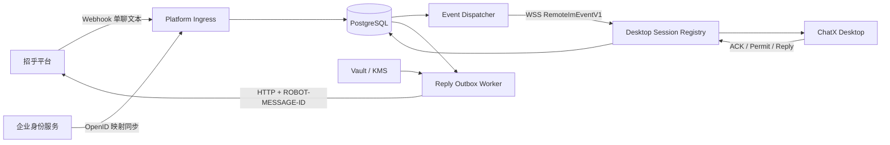

# ChatX 统一机器人网关 V1：Java + Spring Boot 开发计划

> 状态：可作为内网代码 Agent 的任务母版；生产开发前必须完成第 2 节冻结项
>
> 目标读者：网关负责人、Java 开发者、能力有限的代码 Agent、客户端联调人员
>
> 对应客户端规格：`docs/chatx-unified-bot-v1-implementation-spec.md`
>
> 平台能力摘要：`docs/chatx-im-robot-api-compact-reference.md`

## 1. 可行性结论

可行。建议把网关实现为一个 **Java 21 + Spring Boot 模块化单体**，以关系数据库作为唯一持久协调点，首版只实现：

- 招乎单聊文本 webhook 入站；
- 官方机器人 Token 托管和单聊文本下行；
- OpenID 到企业 `principalId` 的权威映射；
- 桌面设备认证 WSS、心跳和在线状态；
- conversation 固定设备路由与 `deviceEpoch`；
- 每会话严格顺序、重投、事件执行许可和显式接管；
- 客户端 ACK、回复 outbox、平台幂等和结果未知；
- 指标、审计、保留期和故障恢复。

V1 不需要微服务拆分，也不建议先引入 Redis。平台 webhook 落库、设备事件投递和平台回复都走持久状态机；多实例 worker 使用数据库行锁和 `SKIP LOCKED` 协调。该方案牺牲一部分极限吞吐，换取清晰的一致性边界和较低实现风险，适合内网代码 Agent 分任务交付。

以下三项任一未满足时，不得进入生产联调：

1. OpenID 身份映射、桌面认证和官方机器人 Token 来源已经确定；
2. 平台 webhook 验真、成功响应、超时和重试契约已经确定；
3. 客户端 WSS JSON Schema 与本计划的状态机已经冻结并完成双边契约测试。

主要风险与处理：

| 风险 | 判断 | V1 处理 |
| --- | --- | --- |
| 平台签名、Token、回调 ACK 尚未闭合 | 高，生产阻塞 | GW-00 冻结正式 Adapter；Agent 不得猜测 |
| OpenID 权威映射未确定 | 高，生产阻塞 | 身份同步先于消息使用；未知身份不投递桌面 |
| 多实例 WSS 路由 | 中，可控 | node-local socket + DB session/generation + DB polling |
| 外部副作用 exactly-once | 无法普遍保证 | lease、稳定幂等键和 `OUTCOME_UNKNOWN`，不自动重跑 |
| 代码 Agent 能力有限 | 高，可控 | 一次一个 PR、冻结 schema、Testcontainers 和人工 gate |

## 2. 开发前必须冻结的输入

代码 Agent 不得猜测下列配置。负责人先填写“生产决定”，再开始 GW-01：

| 决策项 | 本计划开发默认 | 生产决定/阻塞条件 |
| --- | --- | --- |
| 部署边界 | 单企业、单官方机器人、一套网关部署 | 若需要多企业，必须先补 tenant 隔离规格 |
| JDK | Java 21 LTS | 若内网只允许 Java 17，在建仓前改定 |
| Spring Boot | 使用内网批准的 Spring Boot 3.x parent/BOM | Agent 不得自行选择“最新版” |
| 构建 | Maven Wrapper | 冻结内网仓库和 parent 坐标 |
| 数据库 | PostgreSQL 15+ | 若改 MySQL/Oracle，先重写锁与迁移测试 |
| 平台上行 | webhook 优先 | Kafka 只作为后续入站 Adapter，不与 webhook 同时首发 |
| 桌面认证 | Bearer JWT，由 Spring Security Resource Server 验证 | 冻结 issuer/JWKS、audience 和 `principalId` claim |
| 平台回调验真 | 入口网段 allowlist + 平台正式签名/认证 | 原文未定义签名；生产不得只信任请求体 |
| 身份映射 | 权威服务同步 `principalId ↔ OpenID` 到网关 | 冻结同步方式、解绑和冲突处理 |
| 敏感字段加密 | 内网 KMS/密码服务提供 approved codec | 禁止 Agent 自制生产加密算法 |
| 机器人 Token | 内网 Vault/凭据服务 + 正式 Token Provider | 冻结获取、刷新、过期和轮换接口 |
| 运行环境 | 至少两个实例 + 负载均衡；WSS 保持长连接 | 冻结 pod/nodeId、TLS、超时和容量 |

开发环境允许使用 Mock Identity、Mock Token Provider 和测试加密 codec，但这些 Bean 只能存在于 `local/test` profile。`prod` profile 缺少任何正式实现时必须启动失败，不能静默降级。

## 3. V1 明确不做

- 群聊、群 @、图片、语音、文件、引用消息和卡片；
- AI 流式卡片、消息更新和撤回；
- 平台到网关的 WebSocket 上行；
- Agent Runtime、项目、Feature、Thread、工作区或本地路径逻辑；
- IM 文本指令解析；网关只传递文本，指令由桌面客户端处理；
- 自动把离线会话转投另一设备；
- 跨设备自动重跑已经执行或结果未知的事件；
- 无外部幂等保证时宣称 exactly-once；
- 首版拆分身份、路由、WSS、outbox 为多个微服务；
- 为“以后可能需要”提前引入 Redis、内部 Kafka 或分布式事务框架。

## 4. 推荐技术基线

### 4.1 依赖

只使用内网 BOM 批准的版本，建议依赖集合：

- `spring-boot-starter-web`
- `spring-boot-starter-websocket`
- `spring-boot-starter-validation`
- `spring-boot-starter-security`
- `spring-boot-starter-oauth2-resource-server`
- `spring-boot-starter-jdbc`
- `spring-boot-starter-actuator`
- `micrometer-registry-prometheus`
- `flyway-core`
- PostgreSQL JDBC Driver
- `spring-boot-starter-test`
- Testcontainers PostgreSQL
- WireMock 或内网等价 HTTP Mock

约束：

- 使用 `NamedParameterJdbcTemplate` 和显式 SQL，不使用 JPA 自动状态更新；
- 使用 Java `record` 定义协议 DTO，不使用 Lombok；
- 使用 Flyway 管理所有 schema 变更，禁止应用启动时 `ddl-auto`；
- 平台 HTTP 调用使用 Spring `RestClient`；重试由持久 outbox worker 驱动，不用只存在内存中的注解重试；
- WSS 使用 Spring Servlet WebSocket；允许在获批的 Spring Boot 版本中开启 Java 21 virtual threads；
- 时间统一为 UTC `Instant`，数据库使用 `timestamptz`；
- ID 使用服务端 UUID；外部 ID 永远按字符串保存，不推断格式。

### 4.2 工程结构

V1 使用单 Maven module、一个可部署 jar，按端口/适配器分包：

```text
src/main/java/com/cmb/chatx/gateway/
  GatewayApplication.java
  config/
  domain/
    identity/
    device/
    conversation/
    event/
    reply/
  application/
    ingress/
    routing/
    dispatch/
    permit/
    reply/
    takeover/
  adapter/in/platform/webhook/
  adapter/in/desktop/websocket/
  adapter/in/admin/identity/
  adapter/out/platform/
  adapter/out/secret/
  adapter/out/crypto/
  adapter/out/persistence/
  worker/
  observability/

src/main/resources/
  application.yml
  application-local.yml
  application-prod.yml
  db/migration/

contracts/
  openapi/platform-webhook-v1.yaml
  openapi/identity-sync-v1.yaml
  asyncapi/desktop-gateway-ws-v1.yaml
  schema/*.json
```

包之间只通过 application service 和 domain 类型调用。Controller/WebSocket Handler 不直接写 SQL，worker 不直接拼平台 HTTP 请求。

## 5. 总体架构与责任边界

可编辑架构图：`docs/diagrams/chatx-unified-bot-gateway-v1.drawio`



责任边界：

- **平台入站 Adapter**：验真、字段校验、单聊文本筛选和平台 msgId 去重；
- **身份模块**：只接收权威映射，不允许客户端自报 OpenID；
- **路由模块**：创建 opaque `conversationKey`，固定设备并维护 `deviceEpoch`；
- **设备模块**：认证主体、HELLO、心跳、在线 session 和 stale connection 防护；
- **事件模块**：分配 `conversationSeq`、严格首次投递顺序、重投和终态；
- **许可模块**：确保旧设备或失效 epoch 无法开始/继续本地副作用；
- **回复模块**：验证当前 route、持久幂等、按段有序调用平台；
- **数据库**：所有跨实例一致性和恢复的唯一真相；内存只保存当前节点实际 WSS 连接对象。

网关不得接收、推断或保存 `projectId`、Feature、Thread、workspace path、模型或 Agent 状态。

## 6. 数据模型

### 6.1 通用规则

- 表前缀统一为 `chatx_gw_`；
- 所有表包含 `created_at`、`updated_at`；
- 可更新聚合包含 `version bigint not null`，CAS 更新必须带旧 version；
- 文本消息和 OpenID 以 approved codec 加密，日志中不得输出明文；
- OpenID 查找使用 approved codec 生成的稳定 keyed fingerprint，禁止以明文建索引；
- 所有唯一约束冲突都按幂等读取处理，不能转换为 500；
- worker 查询使用小批次 `FOR UPDATE SKIP LOCKED`，事务中不得调用外部 HTTP/WSS。

### 6.2 表清单

#### `chatx_gw_platform_inbox`

所有通过验真的平台回调先写本表，因此未知身份、不支持类型和重复回调也有稳定去重结果：

| 字段 | 说明 |
| --- | --- |
| `inbox_id uuid PK` | 入站记录 |
| `platform_message_id varchar(256)` | 平台 msgId，全局唯一 |
| `from_id_fingerprint varchar(128)` | keyed fingerprint |
| `from_id_ciphertext text` | 加密发送人 OpenID |
| `robot_open_id_fingerprint varchar(128)` | 接收机器人标识 |
| `message_type varchar(64)` | 原始 msgType |
| `message_ciphertext text null` | 支持的文本正文 |
| `occurred_at timestamptz` | 平台时间 |
| `state varchar(32)` | `RECEIVED/NORMALIZED/IGNORED/IDENTITY_UNKNOWN` |
| `event_id uuid null` | 成功归一化后的 event |
| `result_code varchar(64)` | 稳定处理结果 |

唯一约束：`platform_message_id` 唯一。重复回调读取原记录并返回同一平台 ACK，不重新查身份、分配 seq 或生成提示消息。

#### `chatx_gw_identity_binding`

| 字段 | 说明 |
| --- | --- |
| `binding_id uuid PK` | 映射标识 |
| `principal_id varchar(128)` | 企业主体 |
| `open_id_fingerprint varchar(128)` | keyed fingerprint |
| `open_id_ciphertext text` | 加密 OpenID |
| `status varchar(32)` | `ACTIVE/REVOKED` |
| `version bigint` | CAS |

唯一约束：active 映射中 `principal_id` 唯一、`open_id_fingerprint` 唯一。映射冲突必须拒绝并告警，不能覆盖。

#### `chatx_gw_device`

| 字段 | 说明 |
| --- | --- |
| `device_id varchar(128) PK` | 桌面生成的稳定设备 ID |
| `principal_id varchar(128)` | 必须等于认证 JWT 主体 |
| `display_name varchar(128)` | 脱敏设备名 |
| `preferred_remote boolean` | 首次 route 优先设备 |
| `status varchar(32)` | `ACTIVE/REVOKED` |
| `last_seen_at timestamptz` | 最近心跳 |
| `version bigint` | CAS |

唯一约束：一个 principal 最多一台 `preferred_remote=true` 设备；更新主设备必须事务化。

#### `chatx_gw_device_session`

| 字段 | 说明 |
| --- | --- |
| `session_id uuid PK` | 每次 WSS 连接唯一 |
| `device_id varchar(128)` | 设备 |
| `node_id varchar(128)` | 当前网关实例 |
| `connection_generation bigint` | 防止旧 close 覆盖新连接 |
| `state varchar(32)` | `ONLINE/OFFLINE/REVOKED` |
| `connected_at/heartbeat_at/expires_at` | 在线窗口 |

同一设备只允许最高 generation 为 ONLINE。旧连接的 heartbeat/close 必须被忽略。

#### `chatx_gw_conversation`

| 字段 | 说明 |
| --- | --- |
| `conversation_key uuid PK` | 发给客户端的 opaque key |
| `principal_id varchar(128)` | 企业主体 |
| `platform_conversation_fingerprint varchar(128)` | 单聊来源 fingerprint |
| `next_sequence bigint` | 下一入站 seq，初始 1 |
| `delivery_cursor_sequence bigint` | 已 durable received 或投递前已终结的连续最大 seq，初始 0 |
| `device_wait_active boolean` | 当前是否处于“无设备等待”窗口 |
| `device_wait_generation bigint` | 每次进入新等待窗口递增，用于提示幂等 |
| `last_offline_notice_at timestamptz null` | 防止重复离线提示 |
| `status varchar(32)` | `ACTIVE/SUSPENDED/REVOKED` |
| `version bigint` | CAS |

V1 单企业单机器人下，`platform_conversation_fingerprint` 唯一。

#### `chatx_gw_conversation_route`

| 字段 | 说明 |
| --- | --- |
| `conversation_key uuid PK/FK` | 会话 |
| `device_id varchar(128)` | 固定设备 |
| `device_epoch bigint` | 首次为 1，接管递增 |
| `state varchar(32)` | `ACTIVE/SUSPENDED/REVOKED` |
| `route_reason varchar(32)` | `PRIMARY/RECENT/TAKEOVER` |
| `version bigint` | CAS |

route 只在首次选路或显式接管时改变。普通重连、目标切换和消息处理不得递增 epoch。

#### `chatx_gw_inbound_event`

| 字段 | 说明 |
| --- | --- |
| `event_id uuid PK` | 网关事件 ID |
| `platform_message_id varchar(256)` | 平台去重 ID |
| `conversation_key uuid` | 会话 |
| `conversation_sequence bigint` | 网关分配 seq |
| `message_type varchar(32)` | V1 只允许 `TEXT` |
| `message_ciphertext text` | 加密消息正文 |
| `occurred_at timestamptz` | 平台消息时间 |
| `state varchar(32)` | 见第 7 节 |
| `reason_code varchar(64)` | 稳定原因码 |
| `next_delivery_at timestamptz` | 重投时间 |
| `received_ack_at/terminal_at` | 状态时间 |
| `version bigint` | CAS |

唯一约束：`platform_message_id` 唯一；`conversation_key + conversation_sequence` 唯一。

#### `chatx_gw_event_lease`

| 字段 | 说明 |
| --- | --- |
| `lease_id uuid PK` | 下发给客户端 |
| `event_id uuid` | 事件 |
| `device_id varchar(128)` | 被授权设备 |
| `device_epoch bigint` | 被授权 epoch |
| `status varchar(32)` | `ACTIVE/REVOKED/EXPIRED` |
| `expires_at/last_renewed_at/revoked_at` | 生命周期 |
| `permit_acquired_at timestamptz null` | 客户端真正启动 Runtime 前置许可时间 |
| `revoke_reason varchar(64)` | 接管、断开或终态 |

一个 event 任一时刻只能有一个 ACTIVE lease。重投允许创建新 lease，但旧 lease 必须先失效。

#### `chatx_gw_client_command`

保存客户端 WSS 命令去重结果：`command_id`、`device_id`、`command_type`、`payload_hash`、`result_json`、`expires_at`。同 commandId 携带不同 payload hash 必须拒绝并记录安全告警。

#### `chatx_gw_reply_outbox`

| 字段 | 说明 |
| --- | --- |
| `reply_id uuid PK` | 回复记录 |
| `source varchar(32)` | `CLIENT_REPLY/SYSTEM_NOTICE` |
| `idempotency_key varchar(256)` | 客户端稳定键或网关生成的 system notice 稳定键 |
| `platform_idempotency_uuid uuid` | 固定 `ROBOT-MESSAGE-ID` |
| `delivery_id varchar(256)` | 一次完整回复/主动消息 |
| `event_id uuid null` | Scheduler 主动消息可空 |
| `conversation_key uuid null` | 正常回复/离线提示的会话目标 |
| `direct_to_id_ciphertext text null` | 仅未知身份系统提示使用 |
| `expected_device_epoch bigint null` | 客户端回复必须有；系统提示可空 |
| `segment_index int` | **0-based** |
| `segment_count int` | 1～8 |
| `content_ciphertext text` | 加密正文 |
| `state varchar(32)` | `PENDING/SENDING/SENT/UNKNOWN/PERMANENT_FAILED` |
| `attempt_count/next_attempt_at` | 重试 |
| `first_attempt_at timestamptz null` | 计算平台幂等安全窗口 |
| `platform_message_id varchar(256)` | 成功后保存 |
| `last_error_code varchar(64)` | 脱敏错误 |
| `version bigint` | CAS |

唯一约束：`idempotency_key` 唯一；`delivery_id + segment_index` 唯一。Check 约束要求 `conversation_key` 与 `direct_to_id_ciphertext` 恰好一个非空；direct target 只允许 `SYSTEM_NOTICE`。同 delivery 的 segmentCount 必须一致，只有 0..count-1 全部落库后才允许发送，并按 index 依次发送。

#### `chatx_gw_audit_log`

只记录身份绑定、设备撤销、route 创建/接管、lease 撤销、人工 redrive 等安全事件。不得记录消息正文、Token 或 OpenID 明文。

## 7. 状态机

### 7.1 入站事件

```text
WAITING_DEVICE ──设备上线且建 route──→ QUEUED
      └──TTL 到期──→ EXPIRED

QUEUED ──严格 seq 首投 + lease──→ LEASED
LEASED ──received ACK──→ RECEIVED
LEASED ──busy/ACK 超时──→ QUEUED
RECEIVED ──accepted ACK──→ ACCEPTED
RECEIVED/ACCEPTED ──waiting_desktop ACK──→ WAITING_DESKTOP
RECEIVED/ACCEPTED/WAITING_DESKTOP
  ├──completed ACK──→ COMPLETED
  ├──cancelled ACK──→ CANCELLED
  ├──failed ACK──→ FAILED
  └──已取得 permit 后许可丢失/强制接管──→ OUTCOME_UNKNOWN
```

规则：

- `COMPLETED/CANCELLED/FAILED/EXPIRED/OUTCOME_UNKNOWN` 对自动执行均为终态；`OUTCOME_UNKNOWN` 只能经受审计的 reconciliation 或用户新建重试事件处理；
- 重复 ACK 返回第一次持久结果；非法回退返回稳定 `INVALID_EVENT_TRANSITION`；
- `busy` 不推进 `delivery_cursor_sequence`，同会话后续 seq 继续被阻塞；
- `received` 必须满足 `sequence == delivery_cursor_sequence + 1`，事务内推进 cursor；
- `WAITING_DEVICE` 在投递前进入 EXPIRED，或接管前事件在未 acquire permit 时被取消，也必须在 conversation 行锁内推进连续 cursor，避免永久 seq 空洞；
- `accepted/waiting/completed` 不能代替 `received`，客户端必须先发 durable received ACK；
- permit 尚未 acquire 时 lease 过期不代表执行过：route 未变且原设备重连后可以取得新 lease；permit 已 acquire 后断连、过期或撤销则进入 `OUTCOME_UNKNOWN`，不得退回 QUEUED；
- 网关收到当前设备重连后可以重投未终态 event，客户端依靠 eventId 去重；接管到新设备不得自动重投已经 `RECEIVED` 的事件用于执行。

### 7.2 回复 outbox

```text
PENDING → SENDING → SENT
              ├──可安全重试──→ PENDING
              ├──结果未知──→ UNKNOWN
              └──确定不可重试──→ PERMANENT_FAILED
```

- claim `PENDING` 时先在短事务内改 `SENDING` 并 commit，再调用平台 HTTP；
- worker 崩溃遗留的 `SENDING` 在 `first_attempt_at` 后安全窗口内回到 `PENDING`，仍使用原 platform UUID；超过窗口且无法查询结果则进入 `UNKNOWN`；
- 平台 `code == 0` 才是成功，必须保存返回 `msg`；
- HTTP 200 但 `code == 120` 按明确发送失败处理，不得标 SENT；
- HTTP 401 最多刷新 Token 后重试一次；429、5xx、网络失败按持久退避重试；400/403/404 和明确业务参数错误进入永久失败；
- 超时或连接中断使用同一 `ROBOT-MESSAGE-ID`，只在平台 10 分钟幂等窗口内重试；开发默认最多 8 分钟；
- 超过安全窗口且没有官方结果查询能力时进入 `UNKNOWN`，不得生成新幂等 UUID 再发；
- 同 delivery 的后一段必须等待前一段 `SENT`；前一段 UNKNOWN/永久失败时暂停后续段并告警。

网关 system notice 的稳定键固定为：

- 未映射身份：`system:identity:<platformMessageId>`；
- 无在线设备：`system:offline:<conversationKey>:<deviceWaitGeneration>`；
- 接管结果：`system:takeover:<conversationKey>:<newEpoch>`，一条消息汇总取消/结果未知事件。

### 7.3 事务与锁边界

| 操作 | 同一短事务内必须锁定/写入 | 事务外动作 |
| --- | --- | --- |
| webhook 入站 | platform inbox、identity lookup、conversation seq、event、route/system notice | 无；commit 后返回平台 ACK |
| received ACK/投递前终结 | event、ACTIVE lease（如有）、conversation `delivery_cursor_sequence` | 推动下一次 dispatcher poll |
| permit acquire/renew | session、route、event、lease | 返回 PERMIT_RESULT |
| remote reply 接收 | route/epoch、幂等键、完整 outbox segment | 返回 REPLY_ACCEPTED |
| outbox claim | reply 从 PENDING CAS 到 SENDING | 平台 HTTP；随后新事务写结果 |
| takeover | route CAS、旧 epoch leases、旧 epoch 非终态 events、audit | 推送 LEASE_REVOKED/system notice |

任何外部身份查询、平台 HTTP、WSS send、Vault/KMS 网络调用都不得发生在数据库事务中。生产 CryptoPort 应提供本地可调用的已初始化 codec，不能在每行加解密时远程请求 KMS。

## 8. 平台入站与下行

### 8.1 Webhook 入站

建议端点：

```http
POST /api/v1/platform/zhaohu/callback
Content-Type: application/json
```

处理顺序必须固定：

1. 入口层完成 TLS、来源网段限制和平台正式验真；
2. 限制 body 大小，严格解析必填字段；
3. 验证 callback `toId` 是本部署配置的官方机器人，只接受 `msgType=text` 且 `groupId/groupOpenId` 为空的单聊；
4. 以 `msgId` 唯一插入 `chatx_gw_platform_inbox`，重复回调直接返回与首次相同的平台 ACK；
5. 通过 OpenID fingerprint 查询 ACTIVE identity binding；
6. 未映射时把 inbox 标为 `IDENTITY_UNKNOWN`，并以 `SYSTEM_NOTICE + direct_to_id_ciphertext` 写同一 reply outbox 发送固定激活提示；不得创建 conversation 或投递桌面；
7. 事务内创建/锁定 conversation，分配 sequence，创建 event；
8. 有 ACTIVE route 时进入 QUEUED；无 route 时选择在线设备，仍无设备则进入 WAITING_DEVICE；仅在 conversation 首次进入本轮 device-wait window 时增加 generation 并产生一次离线提示；
9. 把 inbox 标为 `NORMALIZED` 并关联 event；commit 后才返回平台成功响应。

原文未定义 webhook 成功 body、超时、重试和签名。GW-00 必须把正式值写入 OpenAPI 和集成测试；代码中禁止散落硬编码。

V1 对不支持的 msgType 返回平台成功以避免重试风暴，同时增加 `gateway_platform_unsupported_message_total{type}`；不得把图片/语音 JSON 当文本传给客户端。

### 8.2 平台文本下行

```http
POST /robot-service/single-message/text
Authorization: Bearer <server-managed-token>
ROBOT-MESSAGE-ID: <chatx_gw_reply_outbox.platform_idempotency_uuid>
```

正常回复由网关从 identity binding 解密动态 `toId`；未知身份系统提示只使用 callback 已加密保存的 direct target。从服务端配置取得机器人 `fromId`。客户端不得提供任一平台 ID。

验证规则：

- 平台硬上限为 3,000 Unicode 字符；`CLIENT_REPLY` 每段必须不超过 2,800，`SYSTEM_NOTICE` 必须不超过 3,000；
- `segmentIndex` 为 0-based，`segmentCount` 为 1～8；
- platform UUID 首次创建 outbox 行时随机生成并永久复用；
- HTTP 200 后仍检查 JSON `code`；`code=0` 才标 SENT；
- 平台消息 ID `msg` 必须持久化；
- 网关生成的离线、身份未映射等固定文案同样走 reply outbox，不允许 Controller 直接发 HTTP。

## 9. 桌面 WSS 契约

### 9.1 连接与认证

建议路径：`/ws/v1/desktop`。

- HTTP Upgrade 必须携带 Bearer JWT；
- `principalId` 只取 Spring Security 认证结果，不从 JSON body 读取；
- 连接后 10 秒内必须发送 HELLO，否则关闭；
- 默认心跳间隔 15 秒，45 秒无心跳标离线，数值配置化；
- 每个节点只保存自己真实的 WebSocket 对象，DB 保存 nodeId/session/generation；
- 新连接 generation 更高时替换旧连接；旧连接后到的 close 事件不得把新 session 标离线。

统一 envelope：

```json
{
  "schemaVersion": 1,
  "type": "HELLO",
  "commandId": "uuid",
  "sentAt": "2026-07-23T00:00:00Z",
  "payload": {}
}
```

客户端命令必须有 `commandId`；服务端推送使用 `messageId`。所有命令先做 schema 校验和 command 去重。

### 9.2 V1 消息类型

客户端到网关：

- `HELLO`：`deviceId/deviceName/appVersion/capabilities`；
- `HEARTBEAT`：`deviceId/sessionId`；
- `EVENT_ACK`：现有 `received/accepted/waiting_desktop/completed/cancelled/failed/busy`；
- `EXECUTION_PERMIT_ACQUIRE`：`eventId/lastLeaseId/deviceEpoch`；排队过久时允许为同设备/epoch 换发新 lease；
- `EXECUTION_PERMIT_RENEW`：同上；
- `REMOTE_REPLY`：`RemoteImReplyV1`；
- `ROUTE_TAKEOVER_REQUEST`：`conversationKey/expectedEpoch/mode=NORMAL|FORCE`；
- `DEVICE_PREFERENCE_UPDATE`：显式设置主远程设备；
- `SYNC_REQUEST`：重连后查询当前 route 和未终态事件。

网关到客户端：

- `WELCOME`：`sessionId/serverTime/heartbeatIntervalSeconds`；
- `REMOTE_EVENT`：`RemoteImEventV1`；
- `PERMIT_RESULT`：`GRANTED/DENIED`、当前/新 leaseId、expiresAt 和 reasonCode；
- `LEASE_REVOKED`：接管或 route 撤销；
- `REPLY_ACCEPTED/REPLY_RESULT`：outbox 持久化与最终平台状态；
- `TAKEOVER_RESULT`；
- `SYNC_STATE`；
- `ERROR`：稳定 reasonCode，不含内部异常。

完整字段必须以 `contracts/asyncapi/desktop-gateway-ws-v1.yaml` 和 JSON Schema 为准；本文示例不是让 Agent自行增加字段的授权。

### 9.3 V1 最小 reasonCode 集合

GW-00 可以补充，但不得改名或复用以下含义：

```text
AUTH_REQUIRED
PRINCIPAL_MISMATCH
SCHEMA_VERSION_UNSUPPORTED
INVALID_PAYLOAD
COMMAND_ID_REUSE
IDENTITY_NOT_FOUND
IDENTITY_CONFLICT
PLATFORM_MESSAGE_UNSUPPORTED
DEVICE_REVOKED
DEVICE_OFFLINE
NO_ONLINE_DEVICE
ROUTE_NOT_FOUND
ROUTE_EPOCH_CONFLICT
ROUTE_OWNED_BY_OTHER_DEVICE
DEVICE_TAKEOVER_CANCELLED
EVENT_NOT_FOUND
EVENT_ORDER_BLOCKED
EVENT_TERMINAL
EVENT_OUTCOME_UNKNOWN
INVALID_EVENT_TRANSITION
LEASE_NOT_FOUND
LEASE_EXPIRED
LEASE_REVOKED
PERMIT_DENIED
REPLY_IDEMPOTENCY_CONFLICT
SEGMENT_INVALID
OUTBOX_INCOMPLETE
PLATFORM_RETRYABLE_FAILURE
PLATFORM_PERMANENT_FAILURE
PLATFORM_RESULT_UNKNOWN
```

对外 reasonCode 与内部异常类型分离；数据库错误、堆栈、SQL、URL、OpenID 和 Token 不得进入 ERROR payload。

## 10. 路由、顺序和设备执行许可

### 10.1 首次 route

首次单聊事件没有 route 时，在同一事务中：

1. 查询 principal 的 ONLINE 且 ACTIVE 设备；
2. 优先唯一 `preferred_remote=true` 设备；
3. 否则选择 `last_seen_at` 最大者，平局按 deviceId 排序，保证确定性；
4. 创建 epoch=1 的 ACTIVE route；
5. 后续消息固定投递该设备。

没有在线设备时不创建 route。event 进入 WAITING_DEVICE，同一个 device-wait window 只发送一次“消息已暂存，请在 TTL 内打开 ChatX”提示。开发默认 TTL 24 小时；上线值配置化。设备在 TTL 内上线后才创建 route 并结束 waiting window；过期事件进入 EXPIRED，全部 waiting event 清空后也结束该 window，未来不得补执行。

### 10.2 严格首次投递顺序

每个网关节点的 dispatcher 只 claim 当前节点 ONLINE session 对应设备的事件。一个 conversation 只有满足下式的 event 可首次投递：

```text
event.conversationSequence == conversation.deliveryCursorSequence + 1
```

投递前事务化创建 ACTIVE lease 并把 event 改 LEASED，commit 后才写 WSS。WSS 写失败时撤销 lease 并把 event 退回 QUEUED。ACK 超时重投同一 event；新投递使用新 leaseId，eventId/sequence/message 不变。

### 10.3 执行许可

客户端真正启动 Runtime 前必须发送 `EXECUTION_PERMIT_ACQUIRE`。网关在一个事务中验证：

- WSS session 仍 ONLINE 且属于认证 principal；
- event、最近一次 lease、deviceId、deviceEpoch 匹配；
- route 仍 ACTIVE 且 device/epoch 未变化；
- event 未终结；已 acquire permit 的旧 lease 未撤销/过期；
- 没有另一个 ACTIVE lease。

如果事件只因在客户端持久队列等待而使旧 lease 过期，且旧 lease 从未 acquire permit、route/device/epoch 仍一致，网关先终结旧 lease，再原子创建新 lease 并返回新 leaseId；这不算重投或第二次执行。

通过后写 `permit_acquired_at` 并延长 lease。开发默认许可 90 秒，客户端每 30 秒续租。续租失败或收到 `LEASE_REVOKED` 时客户端必须 Abort；网关不得把同一事件交给新设备自动执行。

### 10.4 接管

- NORMAL：只有旧设备离线且没有 ACTIVE permit 时允许；
- FORCE：管理员/用户显式确认后，事务内递增 deviceEpoch、撤销旧 lease、切换 deviceId；
- expectedEpoch 不匹配返回 `ROUTE_EPOCH_CONFLICT`；
- 新设备不继承客户端 Thread/Feature binding；这些是本地状态；
- 旧设备的 ACK、permit renew、reply 和 Scheduler 主动消息全部因 epoch 不匹配被拒绝；
- 接管事务必须处理旧 epoch 的全部非终态事件：已 acquire permit 的进入 `OUTCOME_UNKNOWN`；未 acquire permit 的进入 `CANCELLED`，reason 为设备接管；两者都不得投递新设备自动重跑；
- 网关通过 system notice 提示用户上一设备任务已取消或结果未知，用户需要重新绑定 Feature 并显式重试。

## 11. 多实例实现方式

V1 不使用 Redis，采用以下方案：

1. 负载均衡把每条 WSS 连接固定到某个实例；断线重连可落到任意实例；
2. session 表记录 `node_id + generation`，实际 socket 只存在该 node 的 `DesktopSessionRegistry`；
3. 每个 node 的 dispatcher 周期查询“route device 在本 node ONLINE”的待投事件；
4. outbox、过期清理和 lease 清理由所有 node 竞争 `FOR UPDATE SKIP LOCKED`；
5. 所有外部调用都在 DB claim 事务提交后执行；
6. pod 被杀后，session TTL 使其离线；SENDING/LEASED 超时按 permit 和平台幂等窗口扫描恢复；
7. 如 DB polling 延迟或容量无法满足 SLO，再以同一 application port 增加 Kafka/Redis wake-up，不改变持久状态机。

禁止仅依靠 `ConcurrentHashMap` 做去重、route、seq、lease 或 outbox 状态。

## 12. 安全与隐私

- 平台 Token、机器人 OpenID、用户 OpenID 不下发桌面；
- 不信任 callback body 中的来源身份，生产必须有正式验真或受控网关认证；
- 不信任 HELLO 中的 principal，设备永远绑定 JWT 主体；
- OpenID、消息正文和回复正文加密落库；
- 日志只允许 eventId、conversationKey、deviceId 后 6 位、reasonCode 和耗时；
- 禁止记录 Authorization、ROBOT-MESSAGE-ID 对应正文、OpenID、消息正文、完整 WSS payload；
- 指标 label 禁止 principalId、conversationKey、deviceId、eventId 等高基数字段；
- webhook 和 WSS 都设置 body/frame 上限、速率限制和 JSON 深度限制；
- 管理端身份同步与人工 redrive 使用独立 service role 和审计；
- `local/test` 的明文 codec、静态 Token 和 mock identity Bean 在 prod profile 必须不存在；
- 生产启动自检必须验证正式 CryptoPort、TokenProvider、IdentitySync 和 CallbackAuthenticator 已装配。

## 13. 可靠性、恢复和保留

### 13.1 默认配置建议

这些是开发默认，不是生产 SLO：

| 配置 | 默认 |
| --- | --- |
| WSS heartbeat | 15 秒 |
| session offline | 45 秒 |
| event lease | 90 秒 |
| lease renew | 30 秒 |
| received ACK 超时 | 15 秒后重投 |
| 无设备等待 | 24 小时 |
| 终态事件/命令去重保留 | 7 天 |
| 平台幂等安全重试窗口 | 最多 8 分钟 |
| dispatcher/outbox batch | 100 |

### 13.2 启动恢复

- stale ONLINE session → OFFLINE；
- 过期 ACTIVE lease → EXPIRED；未 acquire permit 且 route 未变的 event 可回 QUEUED/等待原设备重连，已 acquire permit 的 event 进入 OUTCOME_UNKNOWN；
- stale SENDING reply 在平台幂等安全窗口内 → PENDING 并复用原 platform UUID；超过窗口且无法查询结果 → UNKNOWN；
- WAITING_DEVICE 到期 → EXPIRED，并写一次终态提示/审计；
- 已 SENT/终态记录不重发、不重跑；
- UNKNOWN 只能由正式结果查询或受审计人工操作关闭；
- 清理 job 不删除非终态 event、ACTIVE lease、PENDING/SENDING/UNKNOWN outbox。

### 13.3 已知限制

严格 seq 与 durable received ACK 会产生队头阻塞。V1 接受该限制；必须暴露 ACK 延迟和最老待投事件年龄，不能通过跳过 seq 恢复。外部副作用结果未知时不自动重跑。

## 14. 可观测性

至少提供：

- `chatx_gateway_platform_ingress_total{result,type}`
- `chatx_gateway_platform_duplicate_total`
- `chatx_gateway_identity_unknown_total`
- `chatx_gateway_ws_connections`
- `chatx_gateway_device_online`
- `chatx_gateway_event_backlog{state}`
- `chatx_gateway_event_oldest_age_seconds{state}`
- `chatx_gateway_event_ack_latency_seconds`
- `chatx_gateway_lease_total{result}`
- `chatx_gateway_takeover_total{mode,result}`
- `chatx_gateway_reply_total{state,platform_code}`
- `chatx_gateway_reply_oldest_age_seconds{state}`
- `chatx_gateway_worker_errors_total{worker}`

健康检查：

- liveness 只反映进程是否存活；
- readiness 检查数据库、正式 Token Provider 初始化和安全 Adapter；不因单次平台 API 失败永久摘流；
- 独立 dependency 指标展示平台、身份服务、Vault/KMS 状态。

告警至少覆盖：最老 QUEUED/WAITING_DEVICE 超阈值、received ACK P95/P99、UNKNOWN 回复、identity mapping 冲突、旧 epoch 请求、lease 大量撤销、outbox backlog 和平台 401/403/429。

## 15. 分 PR 开发计划

每个任务只允许实现本节指定范围。前一个任务未通过 `./mvnw verify` 和人工 review，不得开始下一任务。

### GW-00：契约与生产决定冻结（无业务实现）

交付：

- 填完第 2 节生产决定；
- OpenAPI：平台 webhook、身份同步；
- AsyncAPI/JSON Schema：WSS envelope 和全部 V1 message；
- reasonCode、事件状态和 reply 状态枚举；
- 客户端与网关各自跑同一组 JSON golden fixtures。

验收：所有示例能通过 schema 校验；未知 schemaVersion、缺字段、额外超限字段有固定失败；负责人签字确认所有未闭合平台契约。

### GW-01：Spring Boot 骨架

交付：Maven Wrapper、内网 parent/BOM、包结构、profiles、Actuator、Spring Security 框架、Flyway 空基线、CI。

测试：应用 context、local profile、prod 缺正式 Adapter 启动失败、未认证 WSS/管理端拒绝。

禁止：数据库业务表、平台真实调用、route 逻辑。

### GW-02：数据库迁移与 Repository

交付：第 6 节所有表、索引、唯一约束、Repository 和状态 CAS helper。

测试：Testcontainers PostgreSQL；唯一键并发、CAS 冲突、`SKIP LOCKED` 双 worker、Flyway 从空库升级及重复启动。

禁止：Controller、WSS 业务、外部 HTTP。

### GW-03：身份同步与平台 webhook 入站

交付：approved crypto port、identity sync Adapter、callback 验真 port、platform inbox、单聊文本解析、平台 msgId 去重、conversation/seq/event 原子落库、未知身份 direct system notice。

测试：重复 webhook、并发同会话 seq、不同会话并行、群聊/图片忽略、未映射只生成一次 direct notice、冲突映射、事务失败时不返回成功。

禁止：设备选路、WSS 投递、直接平台回复 HTTP。

### GW-04：WSS 设备会话

交付：JWT upgrade、HELLO/WELCOME、heartbeat、device/session/generation、主设备偏好、node-local SessionRegistry。

测试：伪造 principal、HELLO 超时、重复 command、同设备重连、旧 close 不覆盖新 session、心跳过期、双节点 DB session 模拟。

禁止：event dispatch、permit、reply。

### GW-05：固定 route、无设备等待与严格顺序投递

交付：首次设备选择、WAITING_DEVICE/TTL、route epoch=1、dispatcher、event lease、REMOTE_EVENT、received/busy ACK 和严格 seq。

测试：零设备、多条离线消息只产生一次 waiting-window 提示、首选设备、最近设备平局、route 固定、同会话第二条被 received ACK 阻塞、WAITING_DEVICE 过期推进 cursor、重投不改 eventId/seq、WSS 写失败恢复、两 worker 不双投。

禁止：completed 等终态 ACK、permit renew、reply outbox。

### GW-06：完整 ACK 与执行许可

交付：全部 ACK 转移、command 去重、permit acquire/renew/expiry/revocation、稳定 reasonCode、SYNC_STATE。

测试：合法全路径、非法状态回退、重复 ACK、排队导致的 pre-permit lease 换发、permit 后过期进入 OUTCOME_UNKNOWN、旧 lease、旧 epoch、断线续租失败、终态不能重新许可、客户端重连去重。

禁止：接管改变 route、平台下行。

### GW-07：回复 outbox 与招乎文本下行

交付：REMOTE_REPLY 验证/幂等、完整分段后按序发送、Token Provider、平台 client、持久 retry、SENT/UNKNOWN/永久失败、REPLY_RESULT。

测试：重复 key、相同 key 不同 payload、缺段、CLIENT_REPLY 超 2,800、任意文本超 3,000、超 8 段、conversation/direct 两类 target、动态 toId、固定 platform UUID、HTTP 200/code 非 0、401 刷新、429/5xx/超时、worker crash 在安全窗口内外的恢复。

禁止：群聊、卡片、生成新 key 绕过 UNKNOWN。

### GW-08：接管、撤销与主动消息

交付：NORMAL/FORCE takeover、deviceEpoch CAS、旧 lease 撤销、旧设备请求拒绝、Scheduler 无 eventId 的主动 reply、reconciliation 状态。

测试：expectedEpoch 冲突、执行中 NORMAL 拒绝、FORCE 撤销、permit event→OUTCOME_UNKNOWN、未 permit event→CANCELLED、cursor 连续推进、旧设备 ACK/reply/renew 全拒绝、新设备不自动执行旧 event、主动消息 route/epoch 校验。

### GW-09：运维、安全和保留

交付：第 12～14 节安全门禁、metrics、structured logging、审计、retention/recovery workers、runbook、告警规则和容量测试脚本。

测试：日志敏感数据扫描、prod mock Bean 缺失、stale session/lease/SENDING 恢复、清理不删活跃记录、DB/平台故障注入、ACK 队头阻塞压测。

### GW-10：双边契约与试点演练

交付：生产网关与客户端 Mock 共用 golden fixtures；客户端连真实测试网关；平台 sandbox/测试机器人闭环；故障演练报告。

必须演练：重复 webhook、客户端崩溃、网关实例被杀、DB 短暂不可用、平台超时、设备掉线、强制接管、旧 epoch、无设备 24h 模拟、UNKNOWN 人工处理。

## 16. 代码 Agent 的固定工作方式

每次只给它一个 GW 任务，并附以下提示词：

```text
你只实现《ChatX 统一机器人网关 V1：Java + Spring Boot 开发计划》的 GW-XX。

开始前必须完整阅读：
1. chatx-unified-bot-gateway-java-development-plan.md
2. chatx-unified-bot-v1-implementation-spec.md 中 §6.2、§6.3、§12.6、§13、§15、§16.3、§16.4、§18～§20
3. chatx-im-robot-api-compact-reference.md 中“先读结论”“通用约定”“下行单聊能力”“上行回调”“原文未闭合”
4. contracts/ 下已冻结的 OpenAPI、AsyncAPI 和 JSON Schema

规则：
- 不实现 GW-XX 之外的后续功能。
- 不自行修改协议、状态枚举、表名、唯一约束、segment index 或 reasonCode。
- 不自行选择或升级依赖版本。
- 未知平台契约必须停在 Port/Adapter 接口或明确阻塞，禁止猜测。
- 外部 HTTP/WSS 不得发生在数据库事务内。
- 幂等、状态转移和 worker 必须有 Testcontainers/WireMock 测试。
- 不记录 Token、OpenID、principalId 或消息正文。
- 完成后运行 ./mvnw verify，并列出改动文件、迁移、测试结果和仍未关闭的阻塞项。
```

Reviewer 每个 PR 固定检查：

1. 是否超出任务范围；
2. 是否绕过状态机直接更新状态；
3. 是否把内存当持久真相；
4. 是否在事务中调用网络；
5. 是否遗漏唯一约束或稳定幂等键；
6. 是否信任客户端 principal/OpenID/epoch；
7. 是否在日志或指标泄漏敏感/高基数字段；
8. 是否用 mock 行为冒充生产契约已完成。

## 17. V1 最终验收清单

1. 一个官方机器人可以根据上行 `fromId` 为多个企业用户创建独立 conversation。
2. Token、机器人 OpenID 和用户 OpenID 从未下发桌面。
3. 同一平台 msgId 并发重投只生成一个 event。
4. 同一 conversation 的 seq 连续且首次投递严格有序。
5. 没有设备时不创建任意 route，同一 waiting window 只提示一次，TTL 到期不补执行。
6. route 创建后始终固定设备，普通重连不改变 epoch。
7. 两个网关实例不会双投同一 event 或双发同一 reply。
8. 客户端未 durable received 时后续 seq 不首投。
9. 旧 lease、旧 epoch、旧 session generation 的请求全部拒绝。
10. Runtime 执行前必须得到 permit，执行期间必须续租。
11. FORCE takeover 原子撤销旧许可，新设备不自动重跑旧事件。
12. ACK 重投幂等，非法状态回退有稳定错误。
13. 回复只发权威映射得到的动态 toId。
14. 同一客户端或 system notice idempotency key 只生成一个平台 UUID。
15. 分段为 0-based、最多 8 段；CLIENT_REPLY 每段不超过 2,800 字符，任何平台文本不超过 3,000，并按序发送。
16. 平台 HTTP 200/code 非 0 不会被误判成功。
17. 超时重试复用原 UUID，超出安全窗口进入 UNKNOWN。
18. 网关/worker 崩溃重启不丢未终态 event/outbox，也不重发 SENT。
19. 终态保留和清理符合策略，活跃记录不会被删。
20. prod profile 不可能启用 mock identity、静态 Token 或明文 codec。
21. 日志、指标和审计不包含 Token、OpenID 或消息正文。
22. 客户端与网关使用同一份 schema golden fixtures，真实测试网关闭环通过。
23. 未映射身份和不支持消息也经过 platform inbox 去重；重复 webhook 不重复发送 system notice。
24. 投递前 EXPIRED/CANCELLED 会连续推进 delivery cursor，不会永久阻塞后续 seq。

## 18. 交付物

网关团队最终需要交付：

- 可复现构建的 Spring Boot 仓库与 Maven Wrapper；
- Flyway migrations 和数据库容量/备份说明；
- OpenAPI、AsyncAPI、JSON Schema 和 golden fixtures；
- 平台/身份/凭据/加密 Adapter 及生产配置说明；
- Dockerfile、部署清单、健康检查和资源基线；
- dashboard、告警、runbook、数据保留和人工 reconciliation 工具；
- 单元、集成、契约、并发、恢复和故障注入测试报告；
- 与 ChatX Desktop 的联调记录及 GW-10 演练报告。

只有代码仓库、没有契约/迁移/监控/演练，不算网关 V1 完成。
