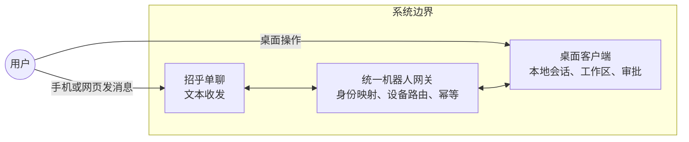
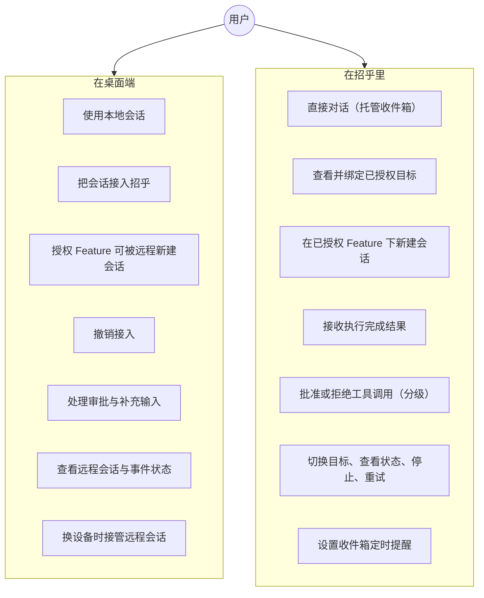
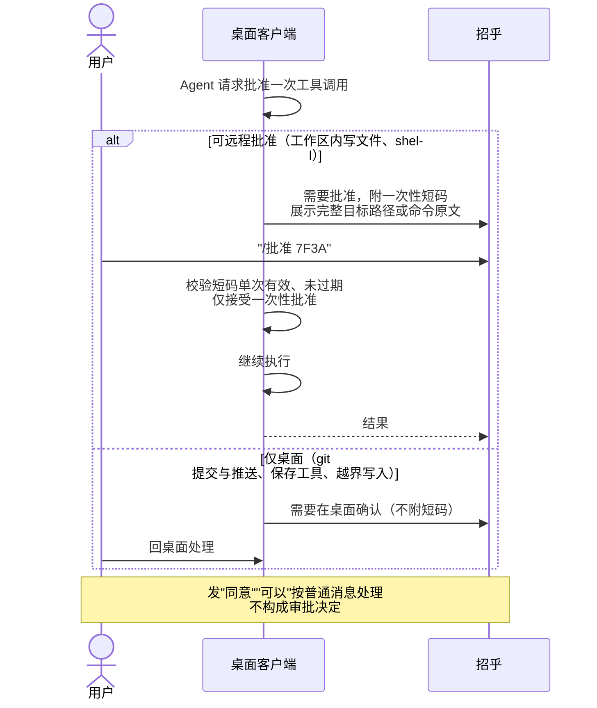
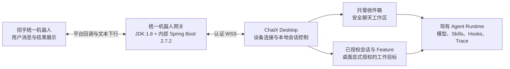

# 招乎（ChatX）统一内置机器人技术方案

> 汇报日期：2026-07-29
>
> 文档性质：技术方案。说明目标形态、用户使用方式、总体架构、关键机制、安全边界与分期交付计划。

## 1. 背景与目标

现有机器人需要每位用户分别配置机器人凭据、接收人和工作目标。配置成本高，凭据分散保存在用户本地明文文件中，也无法稳定关联到具体项目的 Feature。

本方案提供一个企业统一内置机器人。用户完成企业身份登录后无需任何机器人配置即可使用；普通消息默认进入安全的托管工作区；有项目协作需求时，可在同一个聊天框里切换到桌面上已授权的工作目标。

目标收益：

- 降低使用门槛，取消逐用户机器人配置；
- 集中安全治理，平台凭据由网关统一保管，本地目录按桌面授权逐项开放；
- 扩展使用场景，从普通问答扩展到远程驱动桌面上已有的项目工作；
- 保持桌面稳定，不重写现有桌面 Agent 的复杂执行主链路。

## 2. 用户如何使用

### 2.1 一个典型的使用过程

上午在工位，用桌面打开"重构登录模块"这个会话，给它派了活，顺手打开"接入招乎"。

出门开会，手机上收到完成通知和结果。看完想再补一句，于是在招乎里发 `/会话`，绑定这个会话，直接下指令。它跑到一半要写一个文件，招乎推来一条带短码的批准请求，看清路径后回了 `/批准 7F3A`，任务继续。再往后它要提交代码，这类操作招乎批不了，只提示回桌面确认。

中途想起"对账单导出"那个功能还没动，而它已经在桌面授权过远程新建，于是在招乎里选中它，直接开了一条新会话派活。这条会话是完整的项目模式，插件、额外工作区、当前流程节点都在。

再想起还有个报告要写，发 `/收件箱` 切回默认聊天让它草拟提纲。这一轮跑在应用托管目录里，不碰任何项目代码。前面那些任务完成后仍带着各自的会话标识返回，不会认错归属。

回到工位，把那次待确认的提交点掉，任务收尾。下班前把"重构登录模块"的接入关掉，之后手机既收不到它的通知，也无法再对它下指令。

### 2.2 参与者与系统边界

用户是同一个人，通过桌面和招乎两个操作面接触系统。平台凭据与身份映射只存在于网关，两侧都不持有。

### 2.3 用例总图

### 2.4 职责划分

有意设计成不对称。安全相关的动作只在桌面完成：

| 能力 | 桌面 | 招乎 |
| --- | --- | --- |
| 新建普通会话 | 是 | 仅限已授权 Feature 下 |
| 新建复杂模式会话 | 是 | 否 |
| 开关会话接入 | 是 | 否 |
| 授权 Feature 可远程新建 | 是 | 否 |
| 指定工作区路径 | 是 | 否 |
| 批准工作区内写文件与 shell | 是 | 是（需开启远程审批） |
| 批准 git 提交、推送、保存工具 | 是 | 否 |
| 会话级或永久批准 | 是 | 否 |
| 回答结构化补充输入 | 是 | 是（选项与自定义内容） |
| 切换当前目标 | 否 | 是 |
| 换设备接管 | 是 | 否 |

### 2.5 关键流程：远程批准工具调用

这是安全上最敏感的一条链路，单独说明。

## 3. 总体架构

| 模块 | 主要职责 |
| --- | --- |
| 招乎平台 | 提供统一机器人入口、用户单聊消息与文本结果展示 |
| Java 网关 | 统一凭据、企业身份映射、消息顺序、设备路由、执行许可、幂等下行与审计 |
| 桌面客户端 | 管理托管收件箱、目标授权与绑定、本地持久化与受限远程执行 |
| Agent Runtime | 复用现有模型路由、Prompt、Skills、Hooks、Checkpoint、Trace 与自动提交 |

网关不保存本地项目名、Feature、会话或绝对路径，这些信息只保留在用户的桌面设备上。

## 4. 两类工作目标

### 托管收件箱（默认，零配置）

用户首次发消息即可使用。运行在应用管理的独立工作区，不接触任意本地项目目录。支持问答、总结、方案编写、文件产物与定时提醒。默认关闭 Shell 越界写入与高风险外部副作用。

### 桌面已授权的会话与 Feature（可选）

用户在桌面对某个会话打开"接入招乎"，或对某个 Feature 开启常设授权。此后在招乎里用一个指令即可列出全部已授权目标并绑定。

选择界面不区分普通会话与项目模式会话，但执行侧仍按会话自身属性运行：项目模式会话完整继承其工作区、插件注入、额外工作区、Skills、Hooks、流程节点与模型配置。

消息到达时固化目标快照，因此运行过程中切换目标不会导致结果串线，回复带目标前缀便于识别上下文。

## 5. 关键技术机制

1. **桌面行为零回归**：保留现有桌面执行状态机。前两期只做增量接入，不改动桌面主链路；第三期需要共享的编排代码由既有行为基线测试守护。
2. **单执行所有权**：本地运行租约确保桌面、招乎和定时任务不会同时操作同一会话或其检查点。复杂模式派生的子任务运行在父任务之下，同一把租约已覆盖整棵运行树。
3. **可靠消息处理**：本地持久化事件、目标快照与回复队列；关键确认前强制落盘，重启后不会因平台重投而重复执行。
4. **结果未知保护**：执行中崩溃或平台发送超时时标记为结果未知，不自动重跑可能产生副作用的操作，需人工确认后才能重试。
5. **固定设备与接管**：同一会话固定投递到一个桌面设备；换机需显式接管并递增设备版本，旧设备立即失去执行与回复权限。
6. **端到端幂等**：事件、执行许可与分段回复都有稳定标识，重试沿用原幂等键。
7. **旧能力清退**：删除旧的逐用户机器人配置、旧执行通路与隐式外发，不兼容、不迁移、不双跑；旧的明文凭据文件仅在用户确认后删除。

## 6. 安全边界与权限设计

**凭据不落到客户端。** 平台 Token 与用户 OpenID 只存在于网关，客户端仅持有不可逆的会话标识。

**授权只发生在桌面。** 招乎侧无法给自己提权。不提供"列出全部最近会话"这类入口：会话标题由用户首句自动生成，可能包含敏感内容，与人工命名的项目名性质不同，必须由用户在桌面逐个授权后才对招乎可见。工作区为任意目录，同理。

**远程输入按不可信处理。** 招乎侧文本在系统上下文中标记为不可信输入；错误回复不含堆栈、绝对路径、环境变量与凭据。

**审批按操作类型分级。** 工作区内写文件与 shell 可远程批准；git 提交与推送、保存执行工具、越界写入仅限桌面。其中 git 提交与推送是结构性限制，其批准动作按现有设计包含由桌面实际执行提交，远程无法产生等价结果。

**审批不接受自然语言。** 决定只能通过卡片按钮或带一次性短码的显式指令给出。按钮点击在协议层是独立事件类型，与普通文本结构上不同，因此不存在"自然语言误触发审批"的可能；短码同样随机、单次有效、随请求过期。用户发"同意""可以"按普通消息处理。

**远程审批只能一次性。** 不开放会话级与永久豁免，避免在手机上一次点击产生长期授权。该能力是独立的全局开关，默认关闭，并在桌面留痕可查。

**结构化补充输入可远程回答。** Agent 需要用户在若干选项间做出选择或补充信息时，可通过卡片表单或编号指令回答。这不新增能力通道，用户本就能从招乎发文本驱动会话。

## 7. 分期交付

三期依次交付，前一期是后一期的基础。

### 第一期：统一入口与安全工作区

零配置统一机器人、企业身份映射、托管收件箱、Project Mode Feature 绑定、设备路由与接管、持久化去重与崩溃恢复、旧机器人清退。同期完成 Java 网关与双边协议契约测试。

交付后用户即可脱离机器人配置使用，并在招乎中完成普通问答与项目 Feature 协作。

### 第二期：桌面已有工作的远程接入

会话接入开关、统一目标列表、Feature 常设授权、执行完成主动推送、远程审批分级、结构化补充输入的远程回答。

交互按两层交付。文本层用编号与一次性短码采集决定，不依赖契约变更，可先行落地并作为长期的降级形态。卡片层使用招乎审批 2.0 的同意与拒绝按钮，以及自定义卡片的表单组件，体验更好且从协议层消除误触发风险；该层需要网关把卡片回执归一化为契约中的结构化事件，与网关团队同期排期。客户端版本不具备卡片能力时自动退回文本层。

本期不改动桌面执行主链路，客户端部分可与网关联调并行推进。

### 第三期：复杂执行模式

允许从招乎驱动桌面已建好并授权的 Coordinator 与 Workflow 会话，不支持从招乎创建此类会话。

技术前提是把模式分发、子任务恢复、通知与完成处理三块编排逻辑抽入桌面与招乎共用的核心，避免形成两套执行语义。这是三期中唯一需要改动桌面主链路的一期，因此放在最后，此时其余部分已具备完整回归测试。

由于复杂任务常以代码提交收尾，而提交属于仅桌面批准的类别，该场景在最后一步仍会等待桌面确认。

## 8. 方案边界

以下能力本方案不提供：群聊、图片与附件、语音、群卡片与千人千面、由招乎指定任意本地目录、从招乎创建复杂模式会话、桌面与招乎互相抢占或干预对方正在运行的任务。

这些限制不影响核心目标：统一入口、零机器人配置、默认安全聊天、以及对桌面已有工作的受控远程操作。

## 9. 需要协调与决策的事项

1. 明确网关负责团队、代码仓库、部署拓扑、容量与服务水平目标；
2. 归档招乎 Token 获取与刷新接口的完整契约，冻结企业身份与平台 OpenID 的映射来源；
3. 冻结身份令牌的签发方、密钥集、受众与主体声明，以及平台入站验签、重试与顺序保证；
4. 确认平台是否原生支持下行幂等键或发送结果查询，据此确定重试策略；
5. 明确生产环境的数据保留期、审计与告警要求；
6. 确认三期的范围与优先级，其中第二期不改动桌面执行主链路，可与网关联调并行。

建议决策：批准本方案与网关进入开发；在上述外部依赖关闭前，不承诺生产发布时间。

## 10. 详细资料

- [V1 实施规格](./chatx-unified-bot-v1-implementation-spec.md)
- [远程接入分阶段方案](./chatx-im-remote-control-staged-plan.md)
- [远程接入用例图](./chatx-im-remote-control-use-cases.md)
- [招乎侧交互式决定需求](./chatx-im-interactive-decision-requirement.md)
- [JDK 1.8 + 内部增强版 Spring Boot 2.7.2 网关开发计划](./chatx-unified-bot-gateway-java-development-plan.md)
- [桌面与网关协议说明](../contracts/README.md)
