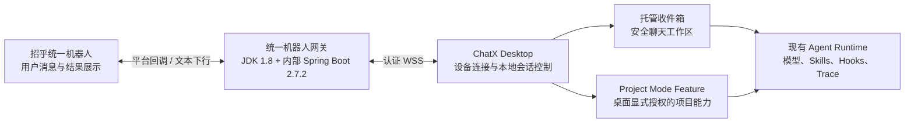

# 招乎（ChatX）统一内置机器人 V1 技术方案简报

> 汇报日期：2026-07-29
>
> 当前结论：方案与桌面客户端 V1 主链路已完成，Java 网关待内网团队实现并联调；当前尚未达到生产上线状态。

## 1. 背景与目标

现有机器人需要每位用户分别配置机器人凭据、接收人和工作目录，配置成本高，凭据分散，也无法稳定关联项目 Feature。

V1 目标是提供一个企业统一内置机器人：用户完成企业身份登录后无需配置机器人即可使用；普通消息默认进入安全的“收件箱”，有项目协作需求时可在同一聊天框切换到已授权的 Project Mode Feature。

核心收益：

- 降低使用门槛：取消逐用户机器人配置；
- 统一安全治理：平台凭据集中保管，本地目录按桌面授权开放；
- 扩展使用场景：既支持普通问答，也支持远程触发 Feature 内的代码与流程任务；
- 保持桌面稳定：不重写现有桌面 Agent 的复杂执行主链路。

## 2. 总体架构

责任边界如下：

| 模块          | 主要职责                                                                  |
| ------------- | ------------------------------------------------------------------------- |
| 招乎平台      | 提供统一机器人入口、用户单聊消息和文本结果展示                            |
| Java 网关     | 统一凭据、企业身份映射、消息顺序、设备路由、执行许可、幂等下行和审计      |
| 桌面客户端    | 管理收件箱、Feature 绑定、目标切换、本地持久化和受限远程执行              |
| Agent Runtime | 复用现有模型路由、Prompt、Skills、Hooks、Checkpoint、Trace 和自动提交能力 |

网关不保存本地项目名、Feature、Thread 或绝对路径；这些信息只保留在用户桌面设备。

## 3. 两种使用模式

### 托管收件箱（默认）

- 用户首次发消息即可直接使用；
- 运行在应用管理的独立工作区，不接触任意本地项目目录；
- 支持问答、总结、方案编写、文件产物和定时提醒；
- 默认关闭 Shell、外部写入和交互式授权等高风险能力。

### Project Mode Feature（可选）

- 用户先在桌面开启 Feature 远程访问；
- 可在招乎聊天框查看、绑定和切换已授权 Feature；
- 每个 Feature 使用独立 Thread，继承对应工作区、Skills、Hooks、流程节点和模型配置；
- 消息到达时固化目标快照，因此运行过程中切换 Feature 不会导致结果串线；回复带目标前缀，方便用户识别上下文。

V1 不允许机器人指定任意本地路径，也不能直接绑定任意已有普通 Thread。

## 4. 关键技术机制

1. **桌面行为零回归**：保留现有 `agent:invoke`、Goal、Coordinator、Workflow、Stop/Replace/Steer 等桌面状态机；IM 只接入明确支持的标准单轮能力。
2. **单执行所有权**：本地 Thread 运行租约确保桌面、IM 和 Scheduler 不会同时操作同一 Thread 或 Checkpoint。
3. **可靠消息处理**：本地持久化事件、目标快照和回复 outbox；关键 ACK 前强制落盘，重启后不会因普通重投重复执行。
4. **结果未知保护**：执行中崩溃或平台发送超时时标记 `outcome_unknown`，不自动重跑潜在副作用；人工确认后才能重试。
5. **固定设备与接管**：同一 IM 会话固定投递到一个桌面设备；换机需显式接管并递增 `deviceEpoch`，旧设备立即失去执行和回复权限。
6. **端到端幂等**：事件、执行许可和分段回复都有稳定 ID；同一回复重试沿用原幂等键。
7. **旧能力 Clean Cut**：删除旧自定义机器人 CRUD、旧 WSS/HTTP 执行和隐式外发，不兼容、不迁移、不双跑；旧明文配置仅在用户确认后删除。

## 5. 当前进度

| 工作项             | 状态   | 说明                                                                                        |
| ------------------ | ------ | ------------------------------------------------------------------------------------------- |
| 统一方案与实施规格 | 已完成 | 已完成多轮交叉评审并形成单一 V1 实施规格                                                    |
| 桌面客户端核心链路 | 已完成 | 收件箱、Feature 绑定与切换、运行租约、持久去重、WSS 客户端、接管、管理 UI、Clean Cut 已实现 |
| 双边协议           | 已完成 | 已提供 JSON Schema、AsyncAPI 和契约测试；桌面代码基线为 `9366957d`                          |
| Java 网关计划      | 已完成 | 已按 JDK 1.8 + 内部增强版 Spring Boot 2.7.2 拆分 GW-00～GW-10                               |
| 生产网关实现       | 待完成 | 由内网团队负责，不在当前桌面代码仓库内                                                      |
| 真实平台联调与试点 | 待完成 | 依赖正式 Token、OpenID 映射、平台回调和生产部署环境                                         |

桌面侧 IM 专项测试、消息崩溃恢复测试和既有桌面 Agent 行为基线已经通过。生产就绪仍以网关契约测试、真实平台联调、安全检查和故障演练通过为准。

## 6. V1 边界

为控制首版风险，V1 暂不支持群聊、图片/附件、自定义卡片、任意本地目录、远程 Goal/Coordinator/Workflow，以及桌面与 IM 之间互相抢占或 Steer 正在运行的任务。

这些限制不影响核心目标：统一入口、零机器人配置、默认聊天和可选 Feature 项目协作。

## 7. 下一步与需要协调的事项

1. 明确网关负责团队、代码仓库、部署拓扑、容量和 SLO；
2. 归档招乎 Token 获取/刷新接口的完整契约，并冻结企业 `principalId ↔ OpenID` 映射来源；
3. 冻结 `ystIdToken` 的 issuer/JWKS/audience/主体 claim，以及平台入站验签、重试和顺序；
4. 按 GW-00～GW-10 开发 Java 网关，并与桌面共享契约测试；
5. 完成双设备接管、断网、重复消息、发送结果未知等故障演练；
6. 选择小范围用户同时试点“收件箱 + Feature”，验证后再逐步放量。

建议当前决策：批准网关进入开发和联调阶段；在上述外部依赖关闭前，不承诺生产发布时间。

## 8. 详细资料

- [V1 实施规格](./chatx-unified-bot-v1-implementation-spec.md)
- [JDK 1.8 + 内部增强版 Spring Boot 2.7.2 网关开发计划](./chatx-unified-bot-gateway-java-development-plan.md)
- [桌面—网关协议说明](../contracts/README.md)
