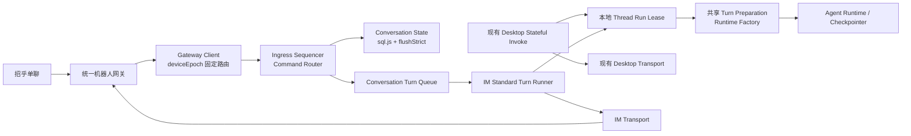

# ChatX 统一内置机器人 V1 实施规格

> 状态：实施基线，可进入客户端阶段 0 与 Gateway G0；生产联调仍受第 18 节交付门槛约束
> 工作分支：`codex/chatx-unified-bot-design`
> 代码基线：`f31bf732`（2026-07-23）

本文是统一内置机器人的单一实施规格。正式采纳后，下列文件只作为决策过程记录，不再分别指导开发：

- `docs/chatx-unified-builtin-robot-v1-design.md`
- `docs/chatx-project-feature-binding-v1-design.md`
- `docs/chatx-builtin-robot-v2-project-mode-design.md`
- `docs/chatx-unified-bot-integrated-plan-review.md`
- `docs/chatx-unified-bot-integrated-plan-fable-review.md`
- `docs/chatx-unified-bot-v1-spec-fable-review.md`

平台接口能力、字段约束与 3,000 字符上限以 `docs/chatx-im-robot-api-compact-reference.md` 为本仓库精简参考；生产契约仍需由 Gateway G0 与平台正式文档共同冻结。

文中的“必须”“不得”是 V1 验收约束；“建议”允许在不破坏验收语义的前提下调整实现。

## 1. 最终决策

V1 采用以下产品和技术结构：

**统一内置机器人 + 托管收件箱默认聊天 + Project Mode Feature 可选绑定 + 会话固定设备 + 桌面行为零回归 + IM 标准单轮能力子集。**

不可退让的实现约束：

1. 用户不配置机器人凭据、OpenID、回调地址或工作目录即可使用统一机器人。
2. 第一次普通文本默认进入应用托管的收件箱 Thread。
3. 开启 Feature 远程访问后，可在招乎单聊中选择 Project/Feature，并切换后续消息的目标 Thread。
4. 同一 IM 会话可以保留多个目标 Thread，但任一时刻只有一个 `activeTarget`，IM 触发的 Agent Turn 只允许一个执行 owner。
5. 桌面现有 active-run、Stop/Replace/Steer、Goal、Coordinator 和 Workflow 行为保持不变；V1 不重写其 stateful 所有权核心。
6. 对空闲、普通 Agent Mode、没有 active/paused Goal、Coordinator、Workflow 或内部通知的 Thread，IM 标准单轮必须复用桌面的 Harness、Prompt/Skill/Hook、模型/Trace 和 Runtime options 语义。
7. 正式路径不得从 IM 模块直接拼装裸 `createAgentRuntime()`；IM 必须调用共享准备层和 Runtime factory。
8. 桌面和 IM 通过本地 per-thread 运行租约保证单 Runtime owner；跨路径抢占、Steer、Replace 和精确取消不属于 V1。
9. 设备版本只解决设备转移；目标切换是本地事务，不与网关做目标 CAS。
10. 事件接收时固化 target snapshot；运行中的旧任务不受后续目标切换影响。
11. sql.js 的关键状态在对外确认前必须 `flushStrict()`；不得宣称无法保证的外部副作用 exactly-once。
12. 旧自定义机器人 clean cut：不迁移、不兼容、不双跑。

## 2. 目标与非目标

### 2.1 V1 目标

- 所有已完成企业身份映射的用户共享一个平台内置机器人入口；
- 无机器人配置即可进行普通问答、总结、规划和托管目录内产物生成；
- 支持从招乎聊天框查看并绑定本机允许远程访问的 Feature；
- Feature 远程标准单轮继承 Project Mode 的工作区、提示、Skills、MCP、Hooks、流程节点、模型路由、Trace、Checkpoint 和自动提交语义；
- 桌面可以查看、镜像流和审批远程创建的 Thread；Feature Thread 空闲时可在桌面本地继续处理；
- 支持收件箱定时提醒和主动下行；
- 支持重连、持久去重、明确的崩溃结果未知语义、多设备固定路由和显式接管；
- 删除旧 ChatX 机器人运行路径与明文凭据入口。

### 2.2 V1 非目标

- 不支持群聊；
- 不支持图片、语音、附件、引用消息和自定义卡片；
- 不允许 IM 指定任意本地路径或绑定任意已有普通 Thread；
- 不开放“远程默认真实项目目录”；
- 不允许多个 target 并行运行后同时向一个聊天框回复；
- 不允许设备离线后自动转投另一设备；
- 不允许通过 IM 文本批准命令、文件写入或外部系统副作用；
- 不支持从 IM 发起或续跑 Goal、Coordinator、Workflow 和内部通知 Turn；
- 不支持 IM Steer/Replace 桌面 run，也不支持桌面 Stop/Replace IM run；
- 不要求桌面与 IM 在同一 Thread 上进行富并发协作；
- 不保证进程在任意外部副作用中间崩溃时仍能 exactly-once；
- 不保留旧配置 schema 的运行时识别、转换或兼容分支。

## 3. “等效桌面输入”的精确定义

### 3.1 IM V1 支持的标准单轮语义

当目标 Thread 空闲、处于普通 Agent Mode、没有 active/paused Goal、Coordinator、Workflow 或内部通知时，同一条普通文本分别从桌面和招乎进入该 Thread，必须经过同一套无状态准备和 Runtime 组装语义：

- Thread 元数据、历史和 Checkpoint；
- UserPromptSubmit、显式 Skill 激活和 Hook scope；
- Feature Harness Context、插件提示、AGENTS.md 和额外工作区；
- Skills、MCP、PreToolUse/PostToolUse/Stop 等 Hook 治理；
- 模型路由、回退、重试和模型使用记录；
- Trace、消息持久化、自动提交和文件变更回调；
- 当前 Feature 流程节点语义；
- 工具沙箱、单轮内部审批门控和 IM 自身 `/停止`；
- 最终 Assistant 结果的提取、持久化和状态处理。

必须复用共享 Harness/Prompt/Skill/Hook、模型/Trace 和 Runtime options 构建模块，而不是在 IM 目录复制这些逻辑。

“等效”不要求随机模型两次生成字节完全相同的文本；对比测试检查输入准备、Runtime 参数、工具治理、状态迁移和结果处理，不比较自然语言逐字相等。

### 3.2 允许不同的 Transport 行为

下列差异属于输入/输出通道能力，不视为 Turn 语义分叉：

- 桌面实时渲染完整流事件；IM V1 只回复处理中提示和最终分段文本；
- IM 控制指令在进入 Agent 前由 command router 处理；
- IM 消息在目标忙时进入本地持久队列，不要求复刻 Renderer 草稿队列的交互；
- 审批和结构化补充输入只在桌面展示，IM 只收到等待、超时或取消状态；
- `remotePolicy` 可以收紧工具权限，但不得替换提示处理、Harness、Hooks、模型路由或持久化逻辑；
- IM run 在并发上从属于桌面：V1 不保证桌面即时取消 IM run，也不保证 IM 抢占、Steer 或 Replace 桌面 run；
- IM 收到 Goal、Coordinator、Workflow、内部通知或其他不支持的 stateful 模式时必须拒绝并引导到桌面，不得降级成普通文本执行；
- 同一 Thread 被另一来源占用时，当前来源只能显示 busy/排队，不能创建第二个 Runtime owner。

桌面主动在带 `imDeliveryContext` 的 Thread 中发送消息，V1 默认只在桌面显示结果，不隐式外发到招乎。若后续需要“桌面代回 IM”，必须做成用户明确选择的 Composite Transport，不能恢复依赖 Thread 元数据自动 HTTP 外发的旧行为。

因此，V1 的等效定义是：**桌面原有行为零回归；IM 在明确支持的标准单轮范围内共享上下文、治理和 Runtime 组装，但不复制桌面的富并发与 stateful 控制能力。**

### 3.3 V1 能力边界表

| 能力 | 桌面 V1 | IM V1 |
| --- | --- | --- |
| 空闲 Thread 普通单轮 | 保持现状 | 支持，共享准备与 Runtime factory |
| Goal/Coordinator/Workflow/内部通知 | 保持现状 | 不支持，提示回桌面 |
| 同来源 Stop/Replace/Steer/Resume | 保持现状 | 仅 `/停止` 当前 IM owner |
| 跨来源抢占或取消 | 不新增 | 不支持；排队或显示 busy |
| 收件箱 Shell/外部写入/交互审批 | 不影响普通桌面 Thread | 禁用 |
| Feature 工具审批/结构化输入 | 保持现状 | 由桌面完成，受远程 TTL 约束 |
| 远程 Thread 桌面续聊 | 普通桌面 Thread 不受影响 | 收件箱只读；Feature 空闲时可本地续聊，结果不外发 IM |

## 4. 当前实现基线

当前 ChatX 远端入口在 [chatx.ts](../src/main/services/chatx.ts#L227) 中维护 WSS、内存去重、串行队列和 Thread 复用，但在 [chatx.ts](../src/main/services/chatx.ts#L353) 直接调用 `createAgentRuntime()`。

当前远端路径已经验证、可以复用的机制：

- WSS 重连、心跳和服务停止；
- `chatId + fromId` 维度的串行 owner 与队列 drain；
- AbortController 的所有权规则；
- Thread 查找/创建和稳定 HumanMessage ID；
- Checkpointer pin/close 顺序；
- StreamConverter、桌面流事件镜像和最终文本提取；
- HTTP 下行超时后的保守重试策略。

当前实现不能直接保留的部分：

- `processedMsgIds` 是内存集合，重启后丢失；
- 远端 Runtime 明确 `enableAgentsPrompt: false`；
- 未经过桌面的 prompt/Skill/Hook/Harness 准备流程；
- 未共用完整模型路由、Trace、自动提交和运行状态；对 Goal/Coordinator/Workflow 状态也没有安全能力门禁；
- 每个用户配置独立机器人、密钥、工作目录和收件人；
- 机器人 Thread 在桌面输入后由 [agent.ts](../src/main/ipc/agent.ts#L7989) 隐式 HTTP 外发，Scheduler 在 [scheduler.ts](../src/main/services/scheduler.ts#L333) 也有旧外发分支。

本规格保留已经验证的可靠性机制，但替换身份、配置、持久化、目标模型和执行入口。

## 5. 总体架构



架构分为五层：

1. **统一网关**：平台凭据、企业身份、设备在线状态、固定设备路由、事件租约和下行幂等。
2. **本地会话控制层**：入站顺序、控制指令、activeTarget、Feature binding、事件队列和崩溃恢复。
3. **共享标准单轮层**：Harness、Prompt/Skill/Hook、模型/Trace、Runtime options 和 Runtime factory；不接管桌面 stateful 所有权。
4. **本地运行租约与执行器**：桌面保留现有 stateful invoke；IM 使用受限标准单轮 runner；两者不得同时拥有同一 Thread。
5. **Transport Adapter**：Electron、IM、Scheduler 各自负责展示与下行，不复制共享准备逻辑。

## 6. 配置、身份与设备路由

### 6.1 桌面配置

新配置不保存机器人凭据或用户 OpenID：

```ts
interface BuiltinRobotSettings {
  enabled: boolean
  remoteAccess: "inbox-only" | "inbox-and-features"
}
```

- 企业身份激活完成后默认 `enabled: true`、`remoteAccess: "inbox-only"`；
- 用户可以断开本设备远程连接；
- `inbox-and-features` 代表在收件箱之上开放 Feature，不会关闭收件箱；
- 项目/Feature/路径信息不上传为配置；
- UI 只显示连接状态、固定设备状态、远程访问级别和旧凭据清理提示。

### 6.2 企业身份

- 网关负责把平台 OpenID 映射为企业 `principalId`；
- 客户端只接收不可逆的 `principalId/conversationKey`，不得接收平台 Token；
- 客户端不能自报 `fromId/toId/clientSecret`；
- 单聊是 V1 唯一允许的会话类型。

### 6.3 网关设备路由

```ts
interface GatewayConversationRoute {
  conversationKey: string
  principalId: string
  deviceId: string
  deviceEpoch: number
  state: "active" | "suspended" | "revoked"
}
```

规则：

- 第一次投递由网关选择显式主设备或最近活跃设备一次；
- 创建路由后收件箱、控制指令、Feature 消息和主动下行都固定在该设备；
- `deviceEpoch` 只在显式设备接管、撤销或重新激活时递增；
- 目标切换不改变 `deviceEpoch`，也不访问网关 CAS；
- 网关不保存 `targetRef/projectId/featureSlug/threadId/workspacePath`；
- 旧设备的事件 ACK、回复和主动下行必须被网关拒绝。

### 6.4 “机器人管理 / 机器人”页面

旧的机器人列表和 CRUD 改为一张固定的“内置统一机器人”卡片，不允许新增、复制或删除机器人。

卡片展示：

- 企业身份映射状态；
- 当前设备名称和连接状态：`connecting / online / offline / error`；
- `enabled` 开关；
- 远程访问级别：仅收件箱 / 收件箱 + Feature；
- 最近连接时间、最后错误和重连操作；
- 显式断开与“接管远程会话”入口；
- 检测到旧明文配置时的独立清理提示。

页面不得展示或允许编辑：

- clientId/clientSecret/Token；
- fromId/toUserList/OpenID；
- WSS/HTTP/callback URL；
- 模型、工作目录和自定义机器人数组。

开启“收件箱 + Feature”时，UI 必须说明：项目/Feature 名称会在该用户的招乎单聊中可见，但本地路径不会上传。

### 6.5 Project Mode 与 Thread UI

- Feature 详情显示是否允许远程绑定、当前远程 binding 状态和“打开远程 Thread”；
- ThreadSidebar 用独立图标/标签区分“远程收件箱”和“远程 Feature”；
- 远程 Thread 顶部显示来源 conversation、当前 binding/target 状态和设备；
- 收件箱远程 Thread 在 V1 只用于查看历史、运行状态和结果，桌面输入框禁用；需要继续聊天时从招乎发送；
- Feature 远程 Thread 在本地运行租约空闲时允许桌面继续执行普通本地 Turn，但明确提示“本轮仅保留在桌面，不会自动发送到招乎”；
- 同一 Feature Thread 正由 IM 执行时，桌面输入框显示“远程任务执行中”，不得启动第二个 Runtime；
- Goal、Coordinator、Workflow 或已有挂起交互等不受 IM V1 支持的状态，必须在 Thread 中明确标记，并提示用户回桌面继续；
- waiting approval/input、suspended、outcome_unknown 都必须在 Thread 和机器人状态页可见；
- 接管后旧设备 Thread 标为历史，不伪装成新设备的活动远程会话。

## 7. 本地会话、Target 与 Binding

### 7.1 活动目标

```ts
type LocalActiveTarget =
  | {
      kind: "inbox"
      targetId: string
      threadId: string
    }
  | {
      kind: "feature"
      targetId: string
      bindingId: string
      projectId: string
      featureSlug: string
      threadId: string
    }
```

规则：

- 一个本地 `principalId + conversationKey` 在当前 `deviceEpoch` 下只有一个 activeTarget；
- 本地可以保留多个 target/Thread 历史；
- 每个普通事件接收时固化 `targetId + threadId + bindingId?` snapshot；
- target 切换后，已落库事件继续使用原 snapshot；
- 不使用 `routeVersion`、`targetRef` 或 `bindingVersion`；
- `bindingId` 是生命周期和审计标识，不是版本栅栏。

### 7.2 Feature Binding 状态

```ts
type FeatureBindingState = "pending" | "active" | "suspended" | "revoked"
```

建议保存：

```ts
interface FeatureBindingRecord {
  bindingId: string
  conversationKey: string
  targetId: string
  projectId: string
  featureSlug: string
  threadId: string
  workspacePath: string
  state: FeatureBindingState
  suspendReason?: string
  createdAt: string
  updatedAt: string
}
```

状态语义：

- `pending`：目标已选择，正在校验和创建 Thread；
- `active`：每次执行前校验通过；
- `suspended`：项目/Feature/工作区/插件/Thread 暂时不可用；
- `revoked`：用户解除、设备转移或目标永久失效，终态。

Feature 失效不得静默切回收件箱。当前 binding 进入 suspended，直到用户明确 `/收件箱`、修复或重新绑定。

## 8. 托管收件箱

### 8.1 创建与 Thread

第一条普通文本到达且没有本地会话状态时：

1. 创建应用托管目录；
2. 创建一条普通 Thread；
3. 写入收件箱 target 并设为 active；
4. `flushStrict()` 后确认初始化成功；
5. 固化事件 snapshot 并进入本地 conversation Turn 队列。

建议元数据：

```ts
interface ImInboxThreadMetadata {
  workspacePath: string
  targetKind: "inbox"
  imDeliveryContext: {
    provider: "zhaohu"
    conversationKey: string
    deviceEpoch: number
    targetId: string
  }
  memoryEnabled: false
}
```

用户不能通过 IM 指定路径、切换目录、创建符号链接逃逸或绑定已有普通 Thread。

### 8.2 收件箱能力策略

V1 允许：

- 普通问答、总结、规划和写方案；
- 文件工具在托管目录内读写，不触发桌面交互式审批；
- 经 `remotePolicy` 允许的只读工具；
- 创建只属于该收件箱的定时提醒。

V1 约束：

- 远程文本在系统上下文中标记为不可信用户输入；
- 文件工具的虚拟根固定为托管目录；
- IM 收件箱 V1 禁用 Shell；
- 外部 MCP、连接器和网络写操作默认禁用，不进入等待桌面审批的死路；
- 外部只读工具只能通过显式 allowlist 开放；
- `request_user_input` 在 IM 收件箱禁用，需要补充信息时由模型用普通文本提问；
- 远程 V1 默认关闭 Memory 注入；
- 错误外发不得包含堆栈、本地绝对路径、环境变量或凭据；
- “托管目录”不是允许任意网络或外部系统副作用的充分条件。

### 8.3 Scheduler

- Scheduler Tool 只在收件箱 Runtime 可用；
- Feature Runtime 继续由 Project Mode 策略禁用 Scheduler；
- 定时任务保存 `conversationKey + expectedDeviceEpoch + inboxThreadId`；
- 到期执行先取得 `owner: "scheduler"` 的本地 Thread 运行租约，再调用共享准备层和受控 Runtime factory，`trigger.source = "scheduler"`；
- Scheduler 遇到 desktop/IM owner 时延后执行，不得取消或并发创建 Runtime；
- 主动下行由网关校验当前连接设备和 `expectedDeviceEpoch`；
- 设备转移后旧设备任务暂停，不得向新设备会话自动发送。

## 9. Feature 模式

### 9.1 开放与列表

只有 `remoteAccess === "inbox-and-features"` 时允许 `/项目`、`/功能` 和 `/绑定`。

桌面开启该模式代表用户允许固定设备暴露本机可绑定目标。IM 列表只显示：

- 项目显示名；
- Feature 标题、slug 和状态；
- 不显示本地路径、projectCode、插件路径或其他设备目标。

### 9.2 绑定前校验

必须全部通过：

1. Project Mode Gate 开启；
2. 项目 active 且目录存在；
3. Harness Adapter/Plugin 兼容；
4. Feature 存在且未归档；
5. 工作区可从 `sessionWorkspacePath`、该 Feature 已有有效会话或项目配置中安全解析；
6. 项目约束、AGENTS.md 和插件上下文可加载；
7. conversation route 仍固定在本设备和当前 `deviceEpoch`；
8. 拟复用的 Thread 没有另一个执行 owner；新建专属 Thread 不要求锁住整个 Feature 的其他桌面会话。

无法解析工作区必须阻止绑定，不允许回退到应用根目录、最近目录或用户输入目录。

### 9.3 Feature Thread

每次新 binding 创建一条专属 Project Mode Thread：

```ts
interface ImFeatureThreadMetadata {
  workspacePath: string
  harnessFeature: {
    projectId: string
    slug: string
    source: typeof HARNESS_SOURCE
  }
  imDeliveryContext: {
    provider: "zhaohu"
    conversationKey: string
    deviceEpoch: number
    targetId: string
    bindingId: string
  }
}
```

约束：

- `HARNESS_SOURCE` 是默认展示来源；远程身份以 `imDeliveryContext` 存在为准；
- `harnessFeature.projectId/slug` 创建后不可修改；
- 切换到另一个 Feature 创建或复用其独立 binding Thread，不改绑旧 Thread；
- Thread 继续出现在 Feature 会话列表中，桌面可以打开和继续处理；
- 每次 Turn 前重新校验 binding、项目、Feature、插件、工作区和 Thread 一致性。

### 9.4 标准单轮一致性与能力门禁

Feature 远程标准单轮必须继承：

- 静态提示或 `session_context_inject`；
- Feature deploy units 与额外工作区；
- 当前流程节点；
- `FEATURE_ID/HARNESS_PROJECT_ID` 等 Runtime/Hook 环境；
- Skills、MCP、Hook scope；
- Trace 的 Harness 归属；
- 模型路由、回退和重试；
- Checkpoint、自动提交和文件变更回调。

继承上述 Project Mode 上下文不等于开放桌面所有 stateful 控制能力。每次执行前必须确认 Thread 为普通 Agent Mode，且没有 active/paused Goal、Coordinator、Workflow、内部通知或另一个本地运行 owner；不满足时稳定拒绝并引导用户在桌面继续。`remotePolicy` 仍可收紧高风险工具，但不能绕开 Project Mode 原有 Hook 和沙箱治理。

## 10. 招乎指令与目标切换

### 10.1 V1 指令

| 指令                   | 行为                                                   |
| ---------------------- | ------------------------------------------------------ |
| `/帮助`                | 显示控制指令                                           |
| `/项目`                | 列出固定设备允许远程访问的项目                         |
| `/功能 <项目编号>`     | 列出项目可绑定 Feature                                 |
| `/绑定 <Feature 编号>` | 创建/恢复 binding，并把后续消息切到 Feature Thread     |
| `/收件箱`              | 把后续消息切回托管收件箱                               |
| `/当前`                | 显示当前目标、设备、运行、排队和审批状态               |
| `/停止`                | 只中止当前 IM 启动的事件；不跨来源取消桌面任务         |
| `/重试 <事件短码>`     | 显式重试最近的 outcome_unknown 事件，并提示副作用风险  |

### 10.2 Selection Context

编号选择使用短期本地 selection context：

```ts
interface SelectionContext {
  token: string
  conversationKey: string
  kind: "project" | "feature"
  candidates: Array<{ id: string; label: string }>
  expiresAt: string
}
```

- Token 可以隐含在最近一次列表上下文中，不要求用户手工输入长 Token；
- TTL 到期、应用重启、设备接管或新列表生成后失效；
- 它只防止编号对应错误，不承担设备或 binding 版本控制。

### 10.3 入站控制通道与执行队列

一个 conversation 必须拆成两个相互配合的层次：

1. **Ingress Sequencer**：按平台会话顺序持久接收事件，在短临界区内处理控制指令或为普通消息固化 target snapshot；
2. **Conversation Turn Queue**：普通消息按 `conversationSeq` 串行执行，同一时刻最多一个 Agent Turn。

控制指令不得被一个长时间 Agent Turn 阻塞。否则运行中 `/收件箱`、`/当前` 和 `/停止` 都无法生效。

### 10.4 运行中切换

允许在当前任务运行或等待审批时执行 `/收件箱`、`/绑定`：

1. 在 ingress 锁内校验目标；
2. 本地事务更新 activeTarget；
3. `flushStrict()`；
4. 立即回复切换结果；
5. 当前事件继续使用原 target snapshot；
6. 切换后的普通消息使用新 snapshot，进入同一执行队列等待。

切换确认必须在旧任务仍运行时明确说明：

```text
已切换到【收件箱】。
上一 Feature 任务仍在执行，完成后会以【原项目 / Feature】标识返回。
新消息将进入收件箱队列。
```

控制回复可能先于旧任务最终回复出现，这是预期行为；不得宣称所有回复严格按输入顺序展示。归属正确依靠 snapshot、明确前缀和 `/当前`，不是依靠禁止切换。

### 10.5 回复标识

- 收件箱普通回复使用裸文本；
- Feature 的处理中、等待、失败和最终回复统一带 `【项目 / Feature】` 前缀；
- 切换后完成的旧任务增加“切换前任务”提示；
- 所有回复使用事件 snapshot，不读取回复时的 activeTarget；
- V1 不允许同一 conversation 的多个 IM-triggered target Agent Turn 并发。

## 11. 桌面零回归、共享准备层与本地运行租约

### 11.1 桌面 stateful 核心保持现状

V1 不抽取或重写桌面的下列所有权逻辑：

- `activeRuns/activeRunSettled`；
- Stop、Replace、Steer 和当前消息注入；
- TurnState、Goal、Coordinator、Workflow 和内部通知；
- Renderer 队列、Desktop Transport 与既有审批 UI；
- 桌面现有恢复、断流重试和清理顺序。

“桌面行为不变”指没有 IM run 时，现有桌面输入、成功、失败、并发、停止和恢复路径的用户可见行为与副作用保持不变。允许为新出现的 IM owner 增加窄运行租约守卫，但不得借机重构桌面成功路径。

### 11.2 共享无状态准备层

V1 抽取并由桌面与 IM 共用：

- Thread workspace/model/agentMode 元数据解析；
- Harness Context、Feature 当前节点与额外工作区；
- 显式 Skill、UserPromptSubmit、Hook scope 和生命周期；
- 模型路由、ordered fallback、Trace 初始化；
- Runtime options、Skills/MCP/Tools、自动提交和 remotePolicy 组装；
- transport-neutral 流事件转换与最终文本提取；
- 受统一参数控制的 Runtime factory。

目标接口示意：

```ts
interface PrepareStandardTurnInput {
  threadId: string
  rawMessage: string
  userMessageId: string
  trigger: { source: "desktop" | "im" | "scheduler"; eventId?: string }
  requestedModelId?: string
  remotePolicy?: RemoteTurnPolicy
}

interface PreparedStandardTurn {
  workspacePath: string
  effectiveMessage: string
  harnessContext?: HarnessAgentContext
  routing: ResolvedTurnRouting
  trace: TraceCollector
  runtimeOptions: CreateAgentRuntimeOptions
}

prepareStandardThreadTurn(input: PrepareStandardTurnInput): Promise<PreparedStandardTurn>
createPreparedThreadRuntime(turn: PreparedStandardTurn): Promise<DeepAgent>
```

接口名称可以调整。约束是 IM 模块不得复制上述准备逻辑，也不得直接调用裸 `createAgentRuntime()`。

### 11.3 IM 标准单轮 Runner

`invokeImStandardTurn()` 只负责 V1 支持的普通单轮：

1. 校验 target snapshot、Feature binding 和设备执行许可；
2. 获取本地 Thread 运行租约；
3. 在租约内重新读取 Thread 状态，确认它处于普通 Agent Mode，且没有 active/paused Goal、Workflow、Coordinator 或内部通知状态；
4. 调用共享 `prepareStandardThreadTurn()` 和 Runtime factory；
5. 使用稳定 HumanMessage ID 执行一次标准 stream；
6. 镜像桌面流、更新事件状态并写回复 outbox；
7. 释放 Checkpointer pin 和本地运行租约。

所有可能在排队期间变化的校验都必须在 Runtime 创建前重做。不支持的 stateful 状态返回稳定错误并引导用户到桌面，不得清理、暂停、恢复或修改桌面 Goal/Coordinator/Workflow 状态。

### 11.4 本地 Thread 运行租约

本地运行租约是桌面与 IM 之间的单 owner 互锁，与网关设备租约不同：

```ts
interface LocalThreadRunLease {
  threadId: string
  owner: "desktop" | "im" | "scheduler"
  runId: string
  acquiredAt: string
}
```

规则：

- 创建 Runtime 或 pin Checkpointer 前必须取得租约；
- 同一 Thread 任一时刻只允许一条租约记录和一个 Runtime owner；
- 桌面自己的 active run、Replace、Resume 和 Interrupt 继续使用现有逻辑；同来源所有权的复用/移交必须沿用现有规则且不能短暂产生第二个 Runtime，租约主要新增 foreign-owner 互锁；
- IM 遇到 desktop owner 时持久排队并显示 busy，不得 Steer、Abort 或 Replace；
- 桌面遇到 IM owner 时显示“远程任务正在执行”，不得直接操作该 IM run；
- IM `/停止` 只中止 IM owner；桌面 Stop 只中止 desktop owner；
- 租约在 Runtime、Checkpointer 和 run-scoped 清理全部完成后释放；
- `agent:invoke`、Resume、Interrupt 等所有可能创建桌面 Runtime 的入口都必须经过同一个 foreign-owner 守卫；
- 租约异常不得通过超时强行产生第二 owner。

单 owner 是 V1 数据完整性底线；双向抢占和跨路径精确取消是 Post-V1 功能。

### 11.5 Headless 与桌面交互

- IM Runner 和共享准备层不得要求存在 `BrowserWindow`；
- 桌面关闭时，受支持的 IM 标准单轮仍能执行并持久化；
- 桌面打开时，远程 Thread 的流事件可实时镜像；
- 收件箱远程 Thread 在 V1 只用于查看、流镜像和状态展示，不从桌面发起新 Turn；
- Feature 远程 Thread 在租约空闲时可以从桌面本地继续处理，结果不隐式外发招乎；
- Feature 远程触发的审批或 `request_user_input` 只在桌面响应，IM 文本不构成批准或结构化答案；
- 远程等待使用独立 TTL，超时后中止 IM event；不得修改桌面前台运行现有的无限等待策略。

### 11.6 Post-V1 执行增强

以下能力不阻塞 V1：

- 将桌面 stateful invoke 完整收敛为 transport-neutral 核心；
- 桌面 Stop/Replace IM run 并让 IM event 得到精确终态；
- IM Steer/Replace 桌面 run；
- Goal、Coordinator、Workflow 和内部通知的 IM 输入；
- 同一 Thread 的桌面/IM 双向并发协作。

## 12. 持久化、去重与崩溃语义

### 12.1 为什么使用现有 sql.js

使用现有 DB 不是因为它天然提供磁盘级 exactly-once，而是因为：

- events、conversation、targets、bindings 和 reply outbox 需要关联查询与唯一约束；
- 可以在一次内存事务中更新关联状态；
- 项目已经有原子快照、备份恢复和 `flushStrict()`；
- 不需要引入第二套 JSON 状态文件。

现有 DB 是内存 sql.js，普通写入经过 300ms 防抖后落盘。因此所有对外确认边界必须显式 flush。

### 12.2 建议表

- `im_conversations`：conversation、principal、deviceEpoch、activeTarget、状态；
- `im_targets`：inbox/feature target、Thread、binding、状态；
- `im_events`：event、platform msgId、conversationSeq、target snapshot、执行状态、可选 `retryOfEventId`；
- `im_reply_outbox`：回复分段、幂等键、平台回复 ID、投递状态；
- `im_selection_contexts`：可选；也可仅内存保存并在重启时失效。

关键唯一约束：

- `principalId + conversationKey` 唯一 conversation，并保存当前 `deviceEpoch`；
- `platformMessageId` 和 `eventId` 分别唯一；
- 一个 conversation 只有一个 activeTarget；
- 一个 binding 对应一个不可改绑 Feature Thread；
- `deliveryId + segmentIndex` 唯一回复分段。

### 12.3 事件状态机

```text
received
  ├─→ queued → executing → completed
  │                 ├─→ waiting_desktop → executing
  │                 ├─→ cancelled
  │                 ├─→ failed
  │                 └─→ outcome_unknown
  └─→ rejected
```

持久化边界：

1. **received ACK 前**：事件、顺序和 target snapshot 写入 DB，`flushStrict()`；
2. **执行副作用前**：确认网关设备执行许可、取得本地 Thread 运行租约，将状态改为 `executing`，`flushStrict()`；
3. **等待桌面前**：状态改为 `waiting_desktop`，`flushStrict()`；审批/输入完成后重新确认设备执行许可和本地租约仍有效，再恢复为 `executing` 并 flush，之后才能继续潜在副作用；
4. **最终下行前**：结果、回复分段和 `completed` 在一个事务写入，`flushStrict()`；
5. **目标切换确认前**：activeTarget 更新后 `flushStrict()`；
6. flush 失败时不得发送对应成功 ACK 或切换确认。

### 12.4 重投处理

- `received/queued` 重投：返回当前状态，不新增队列项；
- `executing/waiting_desktop` 重投：不得启动第二个 Runtime；
- `completed` 重投：从 outbox 使用原幂等键补发未确认分段，不重跑 Agent；
- `cancelled/failed/rejected` 重投：返回稳定终态；
- 启动恢复发现遗留 `executing/waiting_desktop`：转为 `outcome_unknown` 并 flush，不自动重跑；
- `outcome_unknown` 只能由用户在桌面事件状态页或通过 `/重试 <事件短码>` 明确重试；重试创建新的 event/run 标识、写入 `retryOfEventId`，并在执行前提示可能重复外部副作用。
- `outcome_unknown` 和可显式重试的 failed 回复必须在 IM 正文中携带事件短码；短码不得只存在桌面状态页。

### 12.5 不承诺无法实现的 exactly-once

`flushStrict()` 可以关闭“Agent 已完成、completed ACK 前崩溃”的重复窗口，但无法证明外部工具副作用执行后、Turn 完成前崩溃时的 exactly-once。

V1 的可靠性承诺是：

- 已持久完成的事件不会重跑；
- 同一事件正常重投不会并发执行；
- 执行中崩溃采用结果未知、禁止自动重跑的保守策略；
- 平台回复使用稳定幂等键；
- 后续只有在工具支持幂等 Token 或可安全恢复时，才对特定副作用开放自动恢复。

### 12.6 网关设备执行许可

入站 `lease` 是网关授予当前设备处理事件的设备执行许可，不是第 11.4 节的本地 Thread 运行租约。

客户端在队列真正启动 Runtime 前必须：

1. 仍与网关保持有效认证连接；
2. 校验 `lease.expiresAt` 未过期；
3. 向网关确认 `eventId + lease.id + deviceEpoch` 仍属于当前 route；
4. 在长任务期间续租或监听撤销。

断连、租约过期或 epoch 落后时，事件保持 queued/suspended，不得开始本地副作用。执行中失去设备许可时必须 Abort；由于副作用可能已经发生，事件进入 `outcome_unknown`，新设备不得自动重跑同一事件。

设备接管需要处理正在执行的旧设备事件：正常接管等待其终结；强制接管撤销旧许可并把未确认事件视为结果未知，不得同时投递给新设备执行。

## 13. 网关协议

### 13.1 入站事件

```ts
interface RemoteImEventV1 {
  schemaVersion: 1
  eventId: string
  platformMessageId: string
  principalId: string
  conversationKey: string
  conversationSeq: number
  deviceEpoch: number
  message: { type: "text"; text: string }
  occurredAt: string
  lease: { id: string; expiresAt: string }
  redelivered?: boolean
}
```

### 13.2 ACK

```ts
type RemoteImAck =
  | { type: "received"; eventId: string; leaseId: string }
  | { type: "accepted"; eventId: string; leaseId: string }
  | { type: "waiting_desktop"; eventId: string; leaseId: string }
  | { type: "completed"; eventId: string; leaseId: string }
  | { type: "cancelled"; eventId: string; leaseId: string }
  | {
      type: "failed"
      eventId: string
      leaseId: string
      retryable: boolean
      reasonCode: string
    }
  | { type: "busy"; eventId: string; leaseId: string }
```

### 13.3 下行回复

```ts
interface RemoteImReplyV1 {
  schemaVersion: 1
  deliveryId: string
  eventId?: string
  conversationKey: string
  expectedDeviceEpoch: number
  idempotencyKey: string
  segment: { index: number; count: number }
  message: { type: "text"; content: string }
}
```

`deliveryId` 对普通消息等于稳定 event 派生值，对 Scheduler 等主动消息等于稳定 run ID。分段幂等键由稳定数据生成，例如 `deliveryId:reply:index`，超时重试不得生成新键。

文本分段策略：

- 平台硬上限为 3,000 字符；
- V1 每段最多 2,800 个 Unicode 字符，Feature 前缀和 `[i/n]` 计入上限；
- 优先按段落、换行和句子边界拆分；
- 单次回复最多 8 段；
- 超出部分不继续刷屏，最后一段提示“内容已截断，完整结果请在桌面 Thread 查看”；
- 所有分段在首次下行前确定 count、内容和幂等键并持久化。

ACK 语义：

- `received`：入站事件、顺序和 snapshot 已持久化；
- `accepted`：控制指令已应用，或普通消息已进入持久执行队列；
- `waiting_desktop`：Runtime 正等待桌面审批/输入，租约不应触发第二次执行；
- `completed`：Turn 结果和回复 outbox 已持久提交，回复实际送达由 outbox 状态继续跟踪；
- `busy`：尚未 accepted，客户端持久队列达到上限，网关保留事件稍后重投。

### 13.4 网关顺序与租约要求

V1 网关契约必须保证以下全部行为：

- 每个 conversation 分配单调递增 `conversationSeq`；
- 同一 conversation 的首次投递严格按 seq；
- 较早事件未收到 `received` 前不首次投递较晚事件；
- 重投可以晚到，但客户端通过 eventId/seq 去重，不得改变已固化 snapshot；
- 网关只接受当前 route device/epoch 的 ACK、回复和主动下行；
- 平台下行超时视为结果未知，使用原幂等键查询或补发，不盲目创建第二条回复。

严格 seq + durable received ACK 会产生队头阻塞：本地 `flushStrict()` 卡顿时，后续 `/停止`、`/收件箱` 也不会被首次投递。V1 接受该正确性优先的限制，但必须监控 ACK 延迟、设置用户可见的网关超时提示，并在压测中验证不会形成长期死锁。

### 13.5 传输边界

- 平台到统一网关的上行由招乎正式契约决定，可能是 webhook、Kafka 或平台回调；
- 桌面客户端到统一网关可以使用认证 WSS；
- 两段传输相互独立，客户端 WSS 不代表平台原生提供 WSS 上行；
- 网关负责在两段协议之间完成签名校验、身份映射、顺序、租约和幂等转换。

## 14. 审批、补充输入与停止

### 14.1 桌面审批

- 收件箱 remotePolicy 不提供会进入审批的能力：Shell、外部写入工具和交互式授权默认不可用，不产生等待桌面的死路；
- Feature IM Turn 继续使用现有 ToolOrchestrator；确需审批时，请求必须出现在对应远程 Feature Thread 的桌面 UI；
- Feature IM 收到“等待桌面确认”，网关 ACK 为 `waiting_desktop`；
- IM 文本“同意”“批准”或类似内容一律作为普通新消息，不能解析为审批决定。

### 14.2 结构化补充输入

- 收件箱 IM Turn 禁用 `request_user_input`，模型需要追问时直接输出普通文本，下一条 IM 消息作为新 Turn；
- Feature IM Turn 的 `request_user_input` 只通过桌面交互完成；
- IM Adapter 必须感知等待状态，不能无提示挂起；
- 无论桌面窗口当前是否打开，都进入可恢复的 `waiting_desktop`；桌面打开后显示待处理交互；
- 默认等待 TTL 为 10 分钟，可由统一产品配置调整，但不能按旧机器人配置覆盖。

### 14.3 TTL 与 `/停止`

- 远程事件的 waiting TTL 是 IM Transport 策略，不改桌面普通 Turn 的无限审批等待；
- TTL 到期后中止该事件、清理 pending approval/input、标记 cancelled 并通知 IM；
- binding 保持 active；
- `/停止` 走控制通道，只 abort 当前 conversation 通过 IM 启动且仍持有本地运行租约的事件；
- 若同一 Thread 当前由桌面拥有，IM 只回复“桌面任务执行中，请在桌面停止”，不得跨来源取消；
- 停止不自动切换 target，也不清空尚未执行的普通消息。

## 15. 多设备与显式接管

### 15.1 固定设备

- 收件箱和 Feature 都固定在 conversation route 设备；
- 尚无任何已认证在线设备时，网关不得凭空创建 route 或把消息投递给任意设备；
- 首条事件进入有界等待队列，默认 TTL 24 小时，并立即通过平台回复“暂无在线设备，消息已暂存；请在 24 小时内打开 ChatX，连接后将继续处理”；设备在 TTL 内上线后才创建 route 并投递；
- TTL 到期的首条事件终结为 `device_unavailable`，不得在未来上线时补执行；
- 已有 route 的设备离线时，网关短期排队或明确回复离线；
- 不按每条消息选择最近活跃设备；
- 不自动在另一设备创建同名收件箱或查找同名项目。

### 15.2 接管

绑定设备长期离线时，用户从另一桌面设备执行“接管远程会话”：

1. 网关对 `deviceEpoch` 做 CAS；
2. 撤销旧设备租约和下行权限；
3. 新设备建立新的本地 conversation 状态；
4. 收件箱创建新 Thread，明确提示历史不会自动迁移；
5. Feature 必须在新设备重新校验并重新绑定；
6. 旧设备 Scheduler 主动下行被网关拒绝。

接管原语和故障测试属于 V1；完整接管 UI 最迟在 GA 前提供，不能让固定设备成为无逃生通道的永久锁定。

## 16. 本地模块与代码改造

### 16.1 共享 Agent 层

建议新增或抽取：

```text
src/main/agent/
  prepare-standard-thread-turn.ts
  prepared-runtime-factory.ts
  harness-context.ts
  prompt-preparation.ts
```

最终文件名可调整。关键约束是：

- `ipc/agent.ts` 的 `agent:invoke` 保留现有 stateful 调度、active run、Goal/Coordinator/Workflow 与 Desktop Transport 行为；
- Harness Context 与 prompt preparation 不再是 IPC 私有函数；
- IM 模块不得复制 `prepareUserPromptForRun` 或 Runtime options；
- Desktop 与 IM 的标准单轮都通过受控 Runtime factory 接入自动提交、Trace、路由和治理 Hook；
- 共享层无 active-run 所有权、Steer/Replace、Goal 或 Coordinator 状态，不以“顺手重构”改变桌面行为。

### 16.2 IM 层

建议模块：

```text
src/main/services/im/
  gateway-client.ts
  event-store.ts
  conversation-state.ts
  command-router.ts
  inbox-service.ts
  feature-binding-service.ts
  remote-runner.ts
  reply-client.ts
```

职责：

- `gateway-client`：认证 WSS、心跳、租约、重连；
- `event-store`：事件状态、去重、outbox、flush 边界；
- `conversation-state`：activeTarget、targets、bindings、selection context；
- `command-router`：控制指令和即时切换；
- `inbox-service`：托管目录、Thread、Scheduler 上下文；
- `feature-binding-service`：列表、校验、生命周期；
- `remote-runner`：能力门禁、本地运行租约、队列、snapshot 校验、共享准备层和受控 Runtime factory；
- `reply-client`：前缀、分段、幂等和主动下行。

模块数量不是验收目标；不得为了减少文件把持久化、控制通道和 Runtime 逻辑重新耦合。

### 16.3 网关最小数据

网关只保存：

- 企业用户与加密平台 OpenID 映射；
- 官方机器人凭据；
- 设备会话；
- conversation route/deviceEpoch；
- 入站事件、租约、平台 msgId 去重；
- 下行幂等键和平台回复 ID。

网关不得保存本地项目、Feature、Thread 或路径。

### 16.4 网关是独立交付物

统一机器人网关不是客户端 Mock 的部署版，而是一条独立工程交付线，至少包含：

- 平台入站适配：webhook/Kafka/平台回调、签名验真、平台消息去重和顺序归一；
- 官方凭据与企业身份：Token 托管/轮换、OpenID 映射和最小化 principal；
- 设备面：认证 WSS、在线状态、conversation route、deviceEpoch、事件执行许可和接管撤销；
- 可靠下行：事件 ACK、回复 outbox、分段发送、幂等键、结果查询与发送结果未知；
- 运维安全：限流、保留期、审计、指标、告警、凭据隔离和故障演练。

生产联调前必须单独冻结网关 API/状态机规格，并明确负责团队、部署拓扑、容量和 SLO。客户端 Mock Gateway 只用于并行开发和故障注入，不能作为生产网关验收替代品。

## 17. 旧机器人 Clean Cut

新路径不读取、不转换、不运行旧 `chatx-config.json`。需要删除：

1. 旧机器人 CRUD 与配置字段；
2. `src/main/services/chatx.ts` 旧 WSS/HTTP 执行服务；
3. `agent.ts` 中 `chatxRobotChatId` 桌面对话成功后的隐式 HTTP 外发；
4. `scheduler.ts` 中 `trySendChatXReply`；
5. ThreadSidebar 的机器人 Thread 创建入口与 robots 加载；
6. preload ChatX API、旧 IPC 通道和类型；
7. `VITE_CHATX_WS_URL/HTTP_URL/CHANNEL/CALLBACK_URL` 引用；
8. 固定 `toUserList`、手工 `workDir/modelId` 机器人配置；
9. 旧状态、通知和环境变量文案。

存量 Thread 的 `chatxChatId/chatxRobotChatId` 元数据在代码删除后自然失活，不迁移也不自动删除。

旧文件只允许检测“是否存在”，UI 提示用户确认清理明文凭据；未经明确确认不得自动删除。清理代码不得解析后继续使用旧密钥。

## 18. 外部依赖与网关交付门槛

客户端可先依靠冻结 schema 和 Mock Gateway 开发，但下列事项必须在生产联调前关闭：

1. 统一机器人网关的负责团队、代码仓库、部署边界、容量和 SLO；
2. 官方机器人 Token、OpenID 获取和轮换方式；
3. 企业 `principalId ↔ OpenID` 映射来源及账号解绑语义；
4. 平台上行的正式传输、签名、顺序、重试和超时契约；
5. 平台是否支持下行幂等键、发送结果查询及其结果未知语义；
6. 网关无在线设备队列、route 设备离线队列、事件租约和保留时间；
7. 生产数据保留、审计、限流、告警和故障响应要求。

如果平台不能保证 `conversationSeq`，网关必须在入站侧自行建立并持久化顺序。阶段 G0 必须产出独立的网关 V1 规格；仅有客户端文档或 Mock Gateway 不得进入生产试点。

## 19. 分阶段实施

阶段是内部工程里程碑，不是产品发布切分。试点和 GA 必须同时包含收件箱与 Feature。

### Gateway G0：责任与契约冻结

- 明确网关负责团队、部署拓扑、容量、SLO 和安全责任；
- 形成独立 Gateway API/状态机规格；
- 冻结平台入站、客户端 WSS、身份映射、route/deviceEpoch、事件许可、ACK/outbox 和接管契约；
- 用契约测试套件同时约束 Mock Gateway 与生产网关。

### Gateway G1：可联调网关

- 接入官方机器人凭据、平台验签和企业身份映射；
- 实现入站去重/顺序、无设备等待、固定 route、设备执行许可和接管撤销；
- 实现下行分段、幂等、结果查询、结果未知和 Scheduler 主动消息；
- 建立限流、保留、审计、指标、告警和故障演练。

Gateway G0/G1 是与客户端并行的一等交付线，不隶属于 Mock 阶段。

### 客户端阶段 0A：冻结桌面行为

- 为当前桌面普通 Turn、Feature、Hook、Skill、模型回退、审批、补充输入、Stop/Replace/Steer、Goal、Coordinator 和 Workflow 增加 characterization tests；
- 盘点 `agent:invoke`、Resume、Interrupt 和其他所有可能创建 Runtime/写 Checkpoint 的入口；
- 记录现有成功、失败、并发、恢复、流事件和副作用顺序，作为 V1 零回归门槛；
- 本阶段不改产品执行路径。

### 客户端阶段 0B：共享准备层与本地租约

- 只抽取无状态 Harness Context、prompt/skill/hook preparation、路由/Trace 和受控 Runtime factory；
- 桌面现有 stateful invoke 改为调用共享模块，但保留 activeRuns、Goal/Coordinator/Workflow、Transport 和清理所有权；
- 在所有 Runtime 创建入口增加统一的 foreign-owner 本地 Thread 租约守卫；
- 保持桌面自己的 Stop/Replace/Steer 和 Resume 行为不变；
- 禁止 IM 目录直接调用 `createAgentRuntime()` 的架构测试。

### 客户端阶段 0C：协议、Mock 与持久化

- 冻结 Gateway Event/ACK/Reply schema；
- 建立 Mock Gateway，支持乱序重投、无在线设备、断线、旧 epoch、许可撤销和发送超时；
- 建立 conversation/target/event/outbox 表和状态机；
- 实现 `flushStrict()` 纪律和进程崩溃测试；
- 建立 Ingress Sequencer 与 Conversation Turn Queue。

### 客户端阶段 1：托管收件箱闭环

- 身份连接、固定设备 route 和持久去重；
- 自动托管目录、收件箱 Thread、remotePolicy；
- IM Runner 完成能力门禁、本地运行租约、共享准备和标准单轮执行；
- 文本回复、2,800 字符分段、outbox、事件短码和桌面流镜像；
- 收件箱远程 Thread 在桌面只读，不改变桌面普通 Thread 行为；
- Scheduler 主动下行；
- 内置机器人状态页和旧凭据检测。

Feature 客户端执行可以同时针对 Mock Gateway 开发，不必等待收件箱阶段全部结束。

### 客户端阶段 2：Feature 与目标切换

- 项目/Feature 列表与 selection context；
- Feature binding、Thread 和生命周期；
- 仅在普通 Agent Mode、无 Goal/Coordinator/Workflow 的空闲 Thread 执行 IM 标准单轮；
- Harness/Skills/Hooks/路由/Trace/自动提交准备语义一致性测试；
- 控制通道、运行中切换、前缀和只停止 IM owner 的 `/停止`；
- Feature 审批/补充输入 desktop mediation 和远程 TTL。

### 客户端阶段 3：加固、接管与 Clean Cut

- 双设备、显式接管、旧 epoch、执行许可撤销、离线 Scheduler；
- outcome_unknown、outbox 发送未知和重启恢复；
- 3,000 字符平台上限、8 段截断和 ACK 队头阻塞压测；
- 事件保留期与启动清理，建议默认 7 天；
- 敏感数据扫描、指标、审计和故障演练；
- 删除全部旧 ChatX 路径；
- 收件箱 + Feature 一起试点和 GA。

## 20. V1 验收标准

### 20.1 零配置与收件箱

1. 用户不填写机器人字段，第一次普通文本创建托管收件箱并得到回复。
2. IM 无法指定任意目录或绑定已有普通 Thread。
3. 文件工具只能读写托管目录；收件箱 Shell、外部写入工具和交互式授权不可用，不产生等待桌面的死路。
4. 远程输入带不可信标记，错误回复不含堆栈、绝对路径、环境变量或凭据。
5. 收件箱默认不注入 Memory，`request_user_input` 转为普通文本追问。
6. 没有任何认证在线设备时不创建任意 route、不执行本地副作用；用户立即收到离线提示，等待事件在 TTL 后稳定终结。

### 20.2 桌面零回归与 IM 标准单轮

7. 0A 的桌面 characterization 覆盖普通 Turn、Feature、Hook、Skill、模型回退、审批、补充输入、Stop/Replace/Steer、Goal、Coordinator 和 Workflow，并在最终实现后全部通过。
8. 没有 foreign owner 时，桌面现有成功、失败、并发、停止、恢复、流事件和副作用顺序保持不变。
9. 桌面与 IM 标准单轮复用同一 Harness/Prompt/Skill/Hook、路由/Trace 准备模块和受控 Runtime factory；IM 目录没有裸 Runtime 创建或复制准备逻辑。
10. 同一阻断型 UserPromptSubmit Hook 在桌面普通 Turn 与 IM Feature 标准单轮中的门禁结果一致。
11. 同一显式 Skill 在桌面普通 Turn 与 IM 标准单轮中执行相同激活和 Hook 生命周期。
12. Feature 的 Harness Context、AGENTS.md、额外工作区、当前流程节点和环境变量一致。
13. 模型路由、fallback、Trace、Checkpoint 和自动提交准备参数逐项一致。
14. Headless 状态下受支持的 IM 标准单轮可以执行；打开桌面后 Thread 历史完整可恢复。
15. IM 遇到 active/paused Goal、Coordinator、Workflow、内部通知或非普通 Agent Mode 时稳定拒绝并引导到桌面，不执行 Runtime，也不改变其状态。
16. 本地 Thread 运行租约保证桌面、IM、Scheduler 不会同时创建 Runtime 或写同一 Checkpoint。
17. desktop owner 存在时 IM 消息持久排队；IM owner 存在时桌面显示远程忙；两侧都不能跨来源 Stop/Replace/Steer。
18. `agent:invoke`、Resume、Interrupt 和盘点出的所有 Runtime 创建入口均经过 foreign-owner 守卫；桌面自身原有 owner 规则不变。

### 20.3 Feature 与切换

19. `inbox-and-features` 开启后可在 IM 查看并绑定 Feature，列表不泄露本地路径。
20. Feature Thread 元数据和工作区准确，创建后不可改绑。
21. 项目/Feature/插件/工作区失效时 binding suspended，不静默切到收件箱。
22. Feature 运行中执行 `/收件箱`：切换立即持久生效，旧任务按旧前缀返回，新消息按新 snapshot 排队。
23. 控制回复允许越过长任务，但所有 Agent 结果归属准确，不存在缺少前缀的旧目标回复。
24. `/停止` 只中止当前 conversation 的 IM owner，不改变 activeTarget、不丢弃后续队列，也不取消 desktop owner。
25. 过期 selection context 不会绑定错误项目或 Feature。

### 20.4 顺序、去重与崩溃

26. 网关重投同一 `eventId/platformMessageId` 不产生第二个队列项或并发 Runtime。
27. 乱序重投不会改变首次持久化的 target snapshot。
28. 进程在 completed 状态写入后、ACK 前被杀死，重启只补发原 outbox，不重跑 Agent。
29. 进程在 executing 期间被杀死，重启标记 outcome_unknown，不自动重跑潜在副作用。
30. received、executing、completed 和 activeTarget 对外确认前均有可注入失败的 `flushStrict()` 测试。
31. 回复超时重试保持原 `idempotencyKey`、内容、分段总数和分段序号。
32. 事件按保留期清理，不删除未终结事件和待发送 outbox。
33. outcome_unknown 和可重试 failed 回复显示事件短码；只有桌面显式操作或匹配短码的 `/重试` 才创建新 run，并保留 `retryOfEventId`。
34. Runtime 启动前必须得到当前 event/lease/epoch 的网关设备执行许可；无效许可不产生本地副作用。
35. 执行中许可被撤销会 Abort 并进入 outcome_unknown；新设备不自动重跑。
36. 每个下行分段不超过 2,800 个 Unicode 字符、单次最多 8 段；超长结果稳定截断并可在桌面查看，全部分段在首次发送前持久化。
37. 严格 seq 的 ACK 队头阻塞有延迟指标、用户可见超时和故障压测，不形成无界死锁。

### 20.5 审批、设备与 Scheduler

38. Feature 远程审批和结构化输入只在桌面完成；IM 文本不能批准或充当结构化答案。
39. Feature waiting TTL 到期会取消 IM 事件、清理该事件交互并继续后续队列，binding 保持 active；桌面原有无限等待不变。
40. 双设备在线时只在 route 设备执行；设备离线不自动转投。
41. 接管递增 deviceEpoch 并撤销旧许可，旧设备事件、回复和 Scheduler 下行全部被拒绝。
42. 收件箱可以创建并管理定时提醒；Feature Runtime 不提供 Scheduler Tool。
43. 定时提醒通过当前 route 回复原 conversation，设备转移后旧任务暂停。

### 20.6 Clean Cut

44. 新运行路径不读取旧机器人配置内容。
45. 不存在 legacy/builtin 双 WSS、双执行或隐式 HTTP 外发。
46. 旧明文配置只在用户确认后清理，未确认时保持原文件不动。

### 20.7 产品 UI

47. “机器人管理 / 机器人”只显示一张内置机器人卡片，不存在机器人 CRUD、凭据、URL、收件人、模型或工作目录字段。
48. 远程访问级别、设备连接、最后错误、断开/接管和旧凭据清理状态均有明确 UI。
49. 远程 Inbox/Feature Thread 有稳定标签；收件箱只读、Feature 桌面本地-only、另一来源 busy、不支持的 stateful 状态、审批等待、suspended 和 outcome_unknown 均可见。

## 21. 首批开发任务

实施从以下独立、可评审变更开始：

1. **PR-A：桌面 Invoke Characterization**
   - 锁定普通、Feature、Hook、Skill、路由回退、审批、补充输入、Stop/Replace/Steer、Goal、Coordinator 和 Workflow 行为；
   - 盘点所有 Runtime/Checkpoint 创建入口；
   - 不改变产品行为。
2. **PR-B：共享无状态准备层与 Runtime Factory**
   - 移出 IPC 私有 Harness、prompt/skill/hook preparation、路由和 Trace 组装；
   - 桌面保留现有 stateful owner，只替换为共享模块调用；
   - 用架构测试禁止 IM 裸建 Runtime；
   - PR-A 回归全部通过。
3. **PR-C：本地 Thread 运行租约**
   - 对所有 Runtime 创建入口增加 foreign-owner 守卫；
   - 保持桌面同来源 Stop/Replace/Steer/Resume 行为不变；
   - 覆盖 desktop/IM/scheduler 竞争与异常清理。
4. **PR-D：IM Schema、DB 与 Mock Gateway**
   - 事件/target/outbox 表、flush 边界和状态机；
   - Mock 的顺序、重投、无设备、断线、旧 epoch、许可撤销和发送未知场景。
5. **PR-E：收件箱 IM Runner**
   - 建立端到端闭环；
   - 只调用共享准备层和 Runtime factory；
   - 实现 Inbox remotePolicy、分段、短码、只读 Thread 和 Scheduler。
6. **PR-F：Feature Binding 与 IM 标准单轮**
   - 实现列表、绑定、目标切换和生命周期；
   - 对 stateful/非普通模式做显式能力门禁；
   - 接入 Feature 桌面审批、TTL 和回复前缀。
7. **Gateway G0/G1：独立规格与实现**
   - 由网关负责人单独评审和交付；
   - 与 PR-D 共享契约测试，不能用 Mock 验收替代。

PR-A 与 PR-D/Gateway G0 可以并行；PR-B 依赖 PR-A 的基线，PR-C 依赖 PR-A 的入口盘点；PR-E 依赖 PR-B、PR-C、PR-D，PR-F 依赖 PR-E 的稳定 runner。生产联调依赖 Gateway G1。

## 22. 实施完成定义

V1 只有在以下条件全部满足时才算完成：

- 第 20 节验收全部通过；
- 桌面 characterization 和完整回归证明没有 IM owner 时既有行为不变；
- IM 标准单轮只使用共享准备层和受控 Runtime factory，不复制 Harness/Prompt/Skill/Hook、路由或 Trace 组装；
- 本地 Thread 租约证明任何时刻不存在两个不同来源 Runtime owner；
- 生产网关完成 G0/G1、契约测试、安全和故障演练，不以 Mock 替代；
- 收件箱和 Feature 同时完成试点；
- 旧 ChatX 代码、配置入口和隐式外发已删除；
- 崩溃、设备转移、执行许可撤销、审批超时、超长回复和下行结果未知均有可演练的用户可见语义；
- IM 未支持的 Goal/Coordinator/Workflow、跨来源 Stop/Replace/Steer 已在产品中明确拒绝并有 Post-V1 路线。
