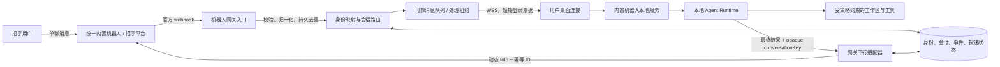

# ChatX 统一内置机器人 V1 方案

> 状态：设计提案  
> 基线代码：`b303cfd5`（2026-07-21）  
> 接口能力速查：[chatx-im-robot-api-compact-reference.md](./chatx-im-robot-api-compact-reference.md)  
> 可编辑架构图：[chatx-unified-bot-architecture.drawio](./chatx-unified-bot-architecture.drawio)

## 1. 方案结论

建议把当前“每个用户在桌面端配置一套机器人”的模式，升级为：

**一个平台统一内置机器人 + 一个中心机器人网关 + 每个用户已登录的桌面客户端。**

统一机器人只在中心网关保存一次 OpenID、Token 和凭据。用户在招乎里直接找到内置机器人发消息；网关根据上行 `fromId` 找到该用户已认证的桌面会话，把消息推送给其本机 Agent。Agent 完成后只返回一个受限的会话引用，网关再把结果动态回复给原发送人。

这能同时满足：

- 所有用户共用同一个机器人；
- 用户不配置 `chatId/fromId/clientId/clientSecret/toUserList/webhook/IP`；
- 任务仍在用户自己的电脑和工作区执行；
- 凭据集中托管，回复不会串到其他用户；
- 保留当前本地 Agent、任务线程、模型、工作区和定时任务能力。

不建议把统一机器人的官方 webhook 直接指向某台用户电脑，也不建议继续按 IP 路由。一个固定 webhook 无法表达多用户归属，IP 也不是稳定身份。

## 2. V1 范围

### 目标

1. 用户无需创建或填写机器人配置，登录 CMBDevClaw 后即可使用统一招乎机器人。
2. 单聊文本消息准确路由到消息发送者本人的一个在线桌面实例。
3. 回复动态发给原发送人，不再使用固定 `toUserList`。
4. 机器人凭据完全退出桌面端和 `chatx-config.json`。
5. 对重复消息、离线、重连、多设备、超时和限流有明确处理。
6. 远程消息继续复用本地 Thread、Agent Runtime、模型和工作区，但受独立的远程执行策略约束。
7. 旧自定义机器人继续兼容一段时间，可灰度切换和回滚。

### V1 明确不做

- 不把 Agent Runtime 整体搬到中心服务。
- 不在首版开放群聊执行、图片理解、附件读写和复杂交互卡片。
- 不依赖原文没有给出协议的 AI 流式卡片。
- 不允许用户通过 IM 消息指定任意本地绝对路径。
- 不把招乎 OpenID、机器人 Token 或 `clientSecret` 下发到客户端。

## 3. 当前实现审计

### 3.1 当前链路

当前实现是“环境变量指定中转服务 + 用户本地机器人配置”：

1. 桌面端把 `userIp` 拼到 WebSocket URL 后连接中转服务。
2. 中转服务推送自定义报文 `{msgId, fromId, content, chatId}`。
3. 客户端按 `chatId` 查本地机器人配置。
4. 按 `chatId + fromId` 查找或创建 Thread。
5. 本地 Agent 执行，最终结果 POST 到中转 HTTP 地址。
6. 请求体使用机器人固定的 `toUserList` 作为收件人。

### 3.2 主要问题

| 问题 | 当前证据 | 共享机器人下的后果 |
| --- | --- | --- |
| 每个机器人保存固定收件人 | [`src/main/types.ts`](../src/main/types.ts) 的 `ChatXRobotConfig.toUserList` | 无法天然“回复原发送人”；多人列表会造成误发/群发 |
| 凭据保存在客户端 | `clientId/clientSecret` 被写入本地 `chatx-config.json` | 每台终端都持有统一机器人高权限凭据 |
| 启用前必须建机器人 | [`ChatXPanel.tsx`](../src/renderer/src/components/customize/ChatXPanel.tsx) 校验机器人数量和全部字段 | 与“开箱即用”目标冲突 |
| webhook 绑定 IP 与 `chatId` | `CallbackUrlBuilder` 生成 `?ip=...&chatId=...` | 一个固定 webhook 不能对应所有用户；IP 会变化或共享 |
| 中转协议丢失官方上下文 | 当前入站只有 `content/chatId` | 没有 `msgType/groupOpenId/clientType/skillCode` 等扩展能力 |
| 去重仅在进程内 | `processedMsgIds` 是最多 1,000 条的内存 Set | 重启后重复执行，无法跨设备/网关去重 |
| 长度被截到 1,000 字符 | `MAX_CONTENT_LENGTH = 1000` | 平台文本支持 3,000 字符，当前无故损失输入 |
| 定时任务只保存 `chatxRobotChatId` | [`scheduler-tool.ts`](../src/main/agent/tools/scheduler-tool.ts) | 共享后不知道该把提醒发给哪个用户/会话 |
| 手动机器人 Thread 没有发送人 | [`ThreadSidebar.tsx`](../src/renderer/src/components/sidebar/ThreadSidebar.tsx) | 本地任务完成后无法确定远端目标 |
| 入站发送人无本地授权校验 | 仅按 `chatId` 命中配置后运行 Agent | 统一入口扩大远程执行攻击面 |

### 3.3 可直接复用的部分

- Agent Runtime 与模型选择/回退。
- Thread 创建、消息持久化和流式 UI。
- 同会话串行执行及本地取消机制。
- Checkpointer 生命周期保护。
- 最终回复提取与 `<think>` 清理。
- 定时任务、桌面通知、状态广播和事件上报框架。

## 4. 目标架构



架构的核心边界：

- **招乎平台**负责机器人会话、用户 OpenID、消息分发和展示。
- **中心机器人网关**负责唯一凭据、官方协议适配、身份映射、路由、幂等、离线队列和审计。
- **桌面客户端**只处理被网关确认属于当前登录用户的消息。
- **本地 Agent**继续使用用户机器上的工作区、模型、技能、MCP 和沙箱。

## 5. 中心机器人网关

### 5.1 必要职责

1. 接收官方 webhook，限制来源网段并校验可用的认证信息。
2. 立刻持久化并快速返回成功，异步处理；不让 Agent 执行时长占用 webhook 请求。
3. 把官方消息归一化成版本化内部事件。
4. 以平台 `msgId` 做持久去重。
5. 将 `fromId` 映射为 CMBDevClaw 企业用户身份。
6. 在该用户的在线设备中选择一个处理主实例，并发放处理租约。
7. 维护离线队列、ACK、超时、重投和死信状态。
8. 校验客户端回复权限，把 opaque 会话引用还原为真实 `toId/groupOpenId`。
9. 统一获取/刷新 Bearer Token，并调用官方下行接口。
10. 使用 `ROBOT-MESSAGE-ID` 做下行幂等，记录官方返回 `msgId`。
11. 提供管理和审计能力，但默认不记录完整消息正文。

### 5.2 最小数据表

| 数据 | 关键字段 | 用途 |
| --- | --- | --- |
| `im_user_binding` | 企业用户 ID、加密 OpenID、状态、来源、更新时间 | 用户身份映射 |
| `im_device_session` | 用户 ID、设备 ID、连接 ID、心跳、优先级、租约 | 多设备选主 |
| `im_inbound_event` | 平台 msgId、归一化类型、用户 ID、状态、重试、时间 | 去重和处理状态 |
| `im_conversation` | opaque conversationKey、用户 ID、机器人、真实目标密文 | 安全回信与定时任务 |
| `im_outbound_delivery` | idempotencyKey、会话、平台 msgId、结果、尝试次数 | 下行幂等、撤回和更新 |
| `im_audit_event` | 操作类型、主体、结果、耗时、错误分类 | 安全审计和排障 |

真实 OpenID 建议只在网关加密存储；客户端持有的 `conversationKey` 不应能反推出 OpenID。

## 6. 身份映射与“零机器人配置”

当前客户端已有企业登录信息 `sapId/ystId`，但它们不能直接假定等于招乎 OpenID。

推荐优先级：

1. **自动映射（首选）**：网关调用文档引用但未附带的“招乎 OpenID 获取”能力，把已认证的企业账号转换为 OpenID。
2. **服务端已有统一身份映射**：复用企业 IAM/通讯录中的权威对应关系。
3. **一次性绑定码（兜底）**：客户端登录后显示短期码，用户只需向统一机器人发送一次“绑定 123456”；网关用该消息的 `fromId` 完成绑定。它不是机器人配置，但会增加一次引导动作。

禁止使用以下方式作为主身份：

- 用户手填 OpenID；
- IP 地址；
- 消息体自报 `sapId/ystId`；
- 仅凭桌面端传来的 `fromId`。

### 多设备选主

- 同一用户可有多个在线桌面实例，但一个入站事件只授予一个设备处理租约。
- 默认选择用户显式设为主设备的在线实例；没有主设备时选择最近活跃实例。
- 设备在租约 TTL 内未 ACK，网关可换实例重投。
- 已经进入 Agent 工具执行阶段的事件不得并发换机；先标记未知状态并等待人工处理，避免重复副作用。

## 7. 网关与客户端内部协议

以下是建议的 V2 语义契约，不要求字段名完全照搬，但必须保留这些信息。

### 7.1 入站事件

```ts
interface RemoteImEventV2 {
  schemaVersion: 2
  eventId: string                 // 网关事件 ID
  platformMessageId: string       // 招乎 msgId，用于端到端追踪
  botKey: "cmbdevclaw-builtin"
  principalId: string             // 已认证企业用户的内部 ID，不是 OpenID
  conversation: {
    key: string                   // opaque、稳定、服务端校验归属
    type: "single" | "group"
    displayName?: string
  }
  message:
    | { type: "text"; text: string }
    | { type: "voice"; asrText?: string; assetRef?: string }
    | { type: "image"; assetRef: string }
    | { type: "reference"; text?: string; referenced: unknown }
  senderDisplayName?: string
  clientType?: "pc" | "ios" | "android" | "pad"
  skillCode?: string
  occurredAt: string
  lease: { id: string; expiresAt: string }
}
```

V1 网关只下发 `text`；其他类型可先返回“当前版本暂不支持该消息类型”，不能静默丢弃。

### 7.2 ACK 状态

客户端至少上报：

- `received`：报文已落到客户端队列；
- `accepted`：已取得本地会话执行权；
- `completed`：Agent 完成且回复已提交网关；
- `failed`：失败分类和可否重试；
- `cancelled`：用户或服务停止。

`received` 不是业务完成，网关不能据此删除事件。状态机应为：

```text
received_by_gateway -> routed -> leased -> accepted -> completed
                                      |          |
                                      v          v
                                   expired     failed/dead_letter
```

### 7.3 下行回复

```ts
interface RemoteImReplyV2 {
  schemaVersion: 2
  eventId?: string                // 即时回复关联原事件
  conversationKey: string         // 定时任务也可使用
  idempotencyKey: string          // 每条/每段回复稳定唯一
  message: {
    type: "text"
    content: string
  }
}
```

网关必须验证：当前登录用户拥有该 `conversationKey`，机器人与会话匹配，消息类型和长度在策略内。客户端不能提交 `toId/fromId/token`。

## 8. 本地会话与工作区策略

### 8.1 Thread 身份

新 Thread 的远端身份改为：

```ts
interface ImDeliveryContext {
  provider: "zhaohu"
  botKey: "cmbdevclaw-builtin"
  conversationKey: string
  conversationType: "single" | "group"
  principalId: string
  lastInboundEventId?: string
}
```

- Thread 查找键：`botKey + principalId + conversationKey`。
- 不再把原始 OpenID 作为 Thread 主键或标题。
- 标题可显示“招乎 · 我的远程助手”或网关提供的脱敏会话名。
- 定时任务保存完整 `ImDeliveryContext` 或稳定 `conversationKey`，不能只保存机器人 ID。

### 8.2 默认工作区

“无需配置机器人”不等于默认给远程消息访问任意项目。

建议：

1. 安装后自动创建应用托管的“远程收件箱”安全工作区，统一机器人可立即进行普通问答、总结和规划。
2. 用户可选配一个“远程默认项目”，这是本地权限设置，不是机器人接入配置。
3. 未选择项目时禁止文件系统和命令工具越过托管工作区。
4. 远程消息不得传入绝对路径；项目切换只允许使用客户端已登记的 workspace ID/别名。
5. 涉及审批的工具调用在桌面端等待用户确认；IM 侧返回“等待桌面确认”，不能远程绕过沙箱。

### 8.3 并发

- 同一个 `principalId + conversationKey` 保持串行，避免上下文乱序。
- 不同用户/会话可以并行。
- 本地队列上限不能静默丢消息；达到上限时向网关返回明确的 `busy`，由网关排队或通知用户。
- 去重主责在网关，本地仍保留持久的最近事件表作为第二道防线。

## 9. 下行消息策略

### V1 文本

- 最终回答清理 `<think>` 后发送。
- 单段不超过 3,000 字符，建议按 2,800～2,900 字符的自然段边界切分。
- 每段有独立、可重建的 `idempotencyKey`，例如 `replyId + segmentIndex`。
- 429 或明确网络失败可用相同 `ROBOT-MESSAGE-ID` 重试。
- 超时状态不明时仍复用相同幂等 ID，并限制在平台 10 分钟幂等窗口内；超过窗口进入人工核对/死信，不能盲目生成新 ID 重发。
- 保存平台返回的每段 `msgId`，为后续撤回和卡片更新做准备。

### 处理中提示

首版可在任务预计超过阈值时发送一条短文本“已收到，正在本机处理”。为减少噪声，快速任务不发送该提示。

后续可升级为：

1. 发送一个自定义状态卡片；
2. 处理中更新状态；
3. 完成后覆盖为 Markdown/AI 内容；
4. V6.15+ 且获得完整流式协议后再做流式 AI 卡片。

## 10. 安全设计

统一机器人扩大了入口范围，安全要求应高于当前自定义机器人。

### 网关入口

- 仅允许文档列出的招乎出口网段访问 webhook，入口不直接暴露桌面端。
- 获取官方是否存在签名头；在确认前，网段限制、专线/内网入口、WAF 和请求大小限制必须同时启用。
- webhook 快速落库后返回，解析失败进入隔离队列。
- 严格校验字段、消息类型、时间窗和最大尺寸。

### 网关到桌面

- 只使用 `wss://`。
- 用短期 SSO 票据建立连接；票据绑定用户、设备、客户端版本和 nonce。
- 服务端根据认证身份决定 `principalId`，不接受客户端自报。
- 事件带处理租约，回复必须绑定租约/会话归属。
- 支持远程注销、设备吊销和最低客户端版本。

### 本地执行

- 远程入口使用独立的能力策略，默认仅托管工作区。
- 高风险命令、写文件、外部系统写操作继续走人工审批。
- 群消息首版关闭，避免群成员通过 @机器人触发他人工作区操作。
- 附件默认不自动下载；后续要做域名、大小、类型、病毒扫描和过期校验。
- 系统提示中标记内容来自远程不可信输入，防止把消息或引用内容当作系统指令。

### 数据

- 机器人 Token、密钥和 OpenID 只在网关加密保存。
- 客户端只保存 opaque `conversationKey`。
- 日志默认记录 ID、类型、长度、状态、耗时，不记录正文、Token、附件 URL 和完整 OpenID。
- 对话正文继续按本地 Thread 策略保存；中心网关正文保留期尽量短。

## 11. 产品交互

### 机器人管理页改版

原来的机器人列表和“+ 添加机器人”改为一个置顶的“招乎内置机器人”卡片：

- 可用状态：可用、连接中、已连接、离线、身份待绑定、版本需升级；
- 当前登录账号与绑定状态；
- 本机是否接收远程任务；
- 远程默认工作区；
- 默认模型；
- 远程能力：仅问答 / 项目读写 / 允许等待桌面审批；
- 最近连接时间和“重新连接/诊断”；
- 使用说明：在招乎搜索统一机器人后直接发消息。

页面不再展示：

- `chatId`
- `fromId`
- `clientId/clientSecret`
- `toUserList`
- webhook 地址
- 用户 IP

旧功能暂放入“自定义机器人（兼容）”折叠区，只对已有配置用户显示，并标记计划下线。

### 侧边栏

- 移除基于机器人列表手动创建 Thread 的入口。
- 远端消息到达时自动创建“招乎远程任务”Thread。
- Thread 显示来源、连接/排队/等待审批状态。
- 如需主动把本地结果发给自己，提供“发送到我的招乎”，目标由网关按当前登录身份解析，不让用户选择 OpenID。

## 12. 代码改造建议

| 模块 | 改造 |
| --- | --- |
| `src/main/types.ts` | 增加 V2 内置配置、版本化事件、`ImDeliveryContext`；把旧类型标为 legacy |
| `src/main/storage.ts` | `chatx-config.json` 升级到 schema v2；新配置不保存凭据/OpenID；保留旧配置只读迁移 |
| `src/main/services/chatx.ts` | 拆成连接、协议、路由、执行、回复五个小模块；按 `conversationKey` 工作 |
| 新 `im-gateway-client.ts` | WSS 鉴权、心跳、ACK、重连、租约和版本协商 |
| 新 `im-event-store.ts` | 本地持久去重、事件状态和恢复 |
| 新 `im-reply-client.ts` | 分段、幂等键、状态明确的下行调用 |
| `src/main/ipc/chatx.ts` | 暴露状态、策略、绑定和诊断 API；服务端校验所有写入 |
| `ChatXPanel.tsx` | 内置机器人单卡片 UI；隐藏所有平台凭据字段 |
| `ThreadSidebar.tsx` | 删除机器人选择器；展示远端 Thread 来源和状态 |
| Scheduler | 把 `chatxRobotChatId` 升级为 `ImDeliveryContext/conversationKey` |
| Agent Runtime | 注入远程来源和能力策略；审批等待状态回传 IM |
| 事件上报 | 增加路由、离线、租约、处理、投递和降级指标，不上报正文 |

建议不要在现有 `ChatXRobotConfig` 上继续堆可选字段。旧模型围绕“机器人即配置项”，新模型围绕“内置服务 + 用户策略 + 会话上下文”，语义不同，应显式版本化。

## 13. 配置迁移与兼容

建议的新本地配置：

```ts
interface ChatXConfigV2 {
  schemaVersion: 2
  builtin: {
    enabled: boolean
    defaultWorkspacePath: string | null
    modelId: string | null
    remoteMode: "chat-only" | "workspace"
    allowGroupMessages: boolean   // V1 固定 false
  }
  legacy: {
    enabled: boolean
    robots: LegacyChatXRobotConfig[]
  }
}
```

迁移规则：

1. 首次读取旧文件时生成 V2 配置，原 `robots` 原样放入 legacy，不删除、不覆写凭据。
2. 内置机器人通过 Feature Gate 灰度启用，与 legacy 服务使用不同连接和事件命名空间。
3. 已有用户先保持 legacy 开启；内置链路验证成功后提示迁移。
4. 同一平台 `msgId` 只允许进入一条链路，避免双处理。
5. 灰度稳定后停止新建自定义机器人，再下线 legacy 写入，最后提供清理本地凭据按钮。
6. 清理凭据是破坏性操作，必须用户确认，并明确不可恢复。

## 14. 可靠性与可观测性

### 状态指标

- webhook 接收量、校验失败量、重复量；
- 身份未映射、无在线设备、多设备抢占；
- 网关排队时长、设备 ACK 时长、Agent 处理时长；
- 成功回复率、429、401/403、超时未知、死信；
- 按消息类型和客户端版本的降级量；
- 每用户并发和限流命中，不包含正文。

### 追踪键

从 webhook 到官方下行统一贯穿：

```text
platformMessageId -> eventId -> leaseId -> localThreadId -> replyId -> platformReplyMessageId
```

### 用户可见失败语义

| 场景 | 用户侧行为 |
| --- | --- |
| 未安装/未绑定 | 回复安装或一次性绑定指引 |
| 客户端离线 | 提示打开客户端；可短期排队，但不得无限期执行陈旧命令 |
| 无远程工作区 | 在托管安全工作区回答，项目操作提示到桌面设置 |
| 队列繁忙 | 明确回复排队或稍后重试，不静默丢弃 |
| 等待审批 | IM 提示“等待桌面确认”，桌面处理后继续 |
| Agent 失败 | 返回简洁错误和 traceId，不泄露堆栈/路径/凭据 |
| 回复状态未知 | 提示投递状态待确认，后台停止自动生成新幂等 ID 重发 |

## 15. 测试与验收

### 核心验收标准

1. 新用户登录后，机器人页不要求任何平台字段；在招乎发首条文本可以到达本机。
2. 用户 A 和 B 同时给同一机器人发消息，各自只在自己的桌面产生 Thread，回复不串用户。
3. 客户端和日志中找不到机器人 `clientSecret`、Bearer Token 或完整 OpenID。
4. 同一官方 `msgId` 重放 10 次只执行一次 Agent 副作用。
5. 用户双设备在线时只有一个设备执行；租约失效后的接管不会与已执行任务并发。
6. 断网重连后未完成事件能恢复，已完成事件不会重跑。
7. 3,000 字以上回复被安全分段，顺序和幂等键稳定。
8. 定时任务准确回复创建它的原用户/原会话。
9. 无默认项目时远程消息不能访问其他本地目录。
10. 旧自定义机器人可在灰度期继续工作并能一键回滚。

### 必测场景

- 单用户、多用户、多设备、设备切换；
- 重复 webhook、乱序、迟到、空消息、超长消息、未知类型；
- 网关重启、客户端重启、Agent 中途退出；
- 401/403/429/500、连接超时、响应超时但平台可能已送达；
- 工作区不存在、模型不可用、工具等待审批、取消；
- 恶意伪造 `principalId/conversationKey/leaseId`；
- 日志和遥测的敏感字段扫描；
- legacy 与 builtin 双开时的事件隔离。

## 16. 分阶段交付

### 阶段 0：补齐协议与网关基础

- 获取 Token、OpenID 映射、webhook ACK/重试/签名、限流的正式文档。
- 创建统一机器人和中心网关。
- 完成身份映射、WSS 登录、设备会话、持久去重和动态文本回复。

### 阶段 1：客户端 V1

- 新协议类型、配置 schema 和内置机器人 UI。
- 单聊文本、Thread 复用、远程安全工作区、ACK/租约、动态回复。
- 定时任务保存会话上下文。
- 小范围白名单灰度，与 legacy 并行但不双消费。

### 阶段 2：体验增强

- 语音 `asrText`、图片、引用消息。
- 自定义卡片“处理中/完成/失败”与卡片更新。
- “发送到我的招乎”、已读/进入会话分析。

### 阶段 3：协作能力

- 经过安全评审后开放群 @。
- 互动表单、文件回传、批量通知。
- 获取独立流式指南后接入 V6.15 AI 流式卡片。

## 17. 开发前阻塞项

以下问题不影响确定总体架构，但会阻塞生产实现：

1. 谁负责建设和运维中心机器人网关？
2. “招乎 OpenID 获取”接口能否从当前 `sapId/ystId` 自动得到 OpenID？
3. webhook 的成功响应、超时、重试和签名契约是什么？
4. 统一机器人 Token 的申请、刷新、权限和 QPS 配额是什么？
5. 用户离线消息保留多久：建议远程执行类短 TTL，提醒类可更长。
6. 多设备默认选主规则是否允许用户设置？
7. V1 是否只开放单聊；本方案建议是。
8. 默认托管工作区和“远程默认项目”的产品口径是否接受？
9. 旧自定义机器人需要兼容几个版本？

## 18. 推荐决策

可以立即确定的决策：

- 采用中心网关路由，不再按用户 IP 配 webhook；
- 统一凭据只放服务端；
- 以 `fromId` 的权威身份映射路由，动态回复原发送人；
- 客户端只持有 opaque 会话引用；
- V1 只做单聊文本和本地安全工作区；
- 定时任务和 Thread 升级为携带完整会话上下文；
- legacy 配置灰度兼容，不直接删除。

在这些决策下，网关和客户端可以并行设计接口；待第 17 节的正式平台契约补齐后再进入生产开发。

