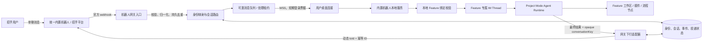

# ChatX 统一内置机器人 V1 方案

> 状态：设计提案  
> 基线代码：`b303cfd5`（2026-07-21）  
> 接口能力速查：[chatx-im-robot-api-compact-reference.md](./chatx-im-robot-api-compact-reference.md)  
> Project Mode Feature 绑定设计：[chatx-project-feature-binding-v1-design.md](./chatx-project-feature-binding-v1-design.md)
> 可编辑架构图：[chatx-unified-bot-architecture.drawio](./chatx-unified-bot-architecture.drawio)

## 1. 方案结论

建议把当前“每个用户在桌面端配置一套机器人”的模式，升级为：

**一个平台统一内置机器人 + 一个中心机器人网关 + 每个用户已登录的桌面客户端。**

统一机器人只在中心网关保存一次 OpenID、Token 和凭据。用户在桌面 Project Mode 把一个 Feature 绑定到招乎后，网关根据上行 `fromId` 和 opaque binding ref 把消息推送到持有该 Feature 的设备；本机 Agent 在 Feature 专属 Thread 中执行，再由网关动态回复原发送人。

这能同时满足：

- 所有用户共用同一个机器人；
- 用户不配置 `chatId/fromId/clientId/clientSecret/toUserList/webhook/IP`；
- 任务仍在用户自己的电脑和已绑定 Feature 工作区执行；
- 凭据集中托管，回复不会串到其他用户；
- 复用当前 Project Mode 的 Thread、插件、约束、流程节点、模型和 Trace 能力。

不建议把统一机器人的官方 webhook 直接指向某台用户电脑，也不建议继续按 IP 路由。一个固定 webhook 无法表达多用户归属，IP 也不是稳定身份。

## 2. V1 范围

### 目标

1. 用户无需创建或填写机器人配置，登录 CMBDevClaw 后即可使用统一招乎机器人。
2. 单聊文本消息准确路由到消息发送者当前 Feature 绑定的在线桌面实例。
3. 回复动态发给原发送人，不再使用固定 `toUserList`。
4. 机器人凭据完全退出桌面端和 `chatx-config.json`。
5. 对重复消息、离线、重连、多设备、超时和限流有明确处理。
6. 远程消息只进入用户显式绑定的 Project Mode Feature，并复用其 Thread、Agent Runtime、插件约束、模型和工作区。
7. 绑定固定到持有本地项目的设备；多设备之间不自动转投。

### V1 明确不做

- 不把 Agent Runtime 整体搬到中心服务。
- 不在首版开放群聊执行、图片理解、附件读写和复杂交互卡片。
- 不依赖原文没有给出协议的 AI 流式卡片。
- 不允许用户通过 IM 消息指定任意本地绝对路径。
- 不把招乎 OpenID、机器人 Token 或 `clientSecret` 下发到客户端。
- 不提供未绑定 Feature 时的通用 Agent，也不开放 Project Mode 已禁用的定时任务能力。
- 不兼容、不迁移、不双跑旧自定义机器人配置。

## 3. 当前实现审计

### 3.1 当前链路

当前实现是“环境变量指定中转服务 + 用户本地机器人配置”：

1. 桌面端把 `userIp` 拼到 WebSocket URL 后连接中转服务。
2. 中转服务推送自定义报文 `{msgId, fromId, content, chatId}`。
3. 客户端按 `chatId` 查本地机器人配置。
4. 按 `chatId + fromId` 查找或创建 Thread。
5. 本地 Agent 执行，最终结果 POST 到中转 HTTP 地址。
6. 请求体使用机器人固定的 `toUserList` 作为收件人。

### 3.2 主要问题

| 问题 | 当前证据 | 共享机器人下的后果 |
| --- | --- | --- |
| 每个机器人保存固定收件人 | [`src/main/types.ts`](../src/main/types.ts) 的 `ChatXRobotConfig.toUserList` | 无法天然“回复原发送人”；多人列表会造成误发/群发 |
| 凭据保存在客户端 | `clientId/clientSecret` 被写入本地 `chatx-config.json` | 每台终端都持有统一机器人高权限凭据 |
| 启用前必须建机器人 | [`ChatXPanel.tsx`](../src/renderer/src/components/customize/ChatXPanel.tsx) 校验机器人数量和全部字段 | 与“开箱即用”目标冲突 |
| webhook 绑定 IP 与 `chatId` | `CallbackUrlBuilder` 生成 `?ip=...&chatId=...` | 一个固定 webhook 不能对应所有用户；IP 会变化或共享 |
| 中转协议丢失官方上下文 | 当前入站只有 `content/chatId` | 没有 `msgType/groupOpenId/clientType/skillCode` 等扩展能力 |
| 去重仅在进程内 | `processedMsgIds` 是最多 1,000 条的内存 Set | 重启后重复执行，无法跨设备/网关去重 |
| 长度被截到 1,000 字符 | `MAX_CONTENT_LENGTH = 1000` | 平台文本支持 3,000 字符，当前无故损失输入 |
| 手动机器人 Thread 没有发送人 | [`ThreadSidebar.tsx`](../src/renderer/src/components/sidebar/ThreadSidebar.tsx) | 本地任务完成后无法确定远端目标 |
| 入站发送人无本地授权校验 | 仅按 `chatId` 命中配置后运行 Agent | 统一入口扩大远程执行攻击面 |

### 3.3 可直接复用的部分

- Agent Runtime 与模型选择/回退。
- Thread 创建、消息持久化和流式 UI。
- 同会话串行执行及本地取消机制。
- Checkpointer 生命周期保护。
- 最终回复提取与 `<think>` 清理。
- 桌面通知、状态广播和事件上报框架。

## 4. 目标架构



架构的核心边界：

- **招乎平台**负责机器人会话、用户 OpenID、消息分发和展示。
- **中心机器人网关**负责唯一凭据、官方协议适配、身份映射、路由、幂等、离线队列和审计。
- **桌面客户端**保存真实 Feature 绑定，并只处理主体、设备、租约和 binding 版本全部匹配的消息。
- **本地 Agent**通过现有 `harnessFeature(projectId, slug)` 链路使用 Feature 的工作区、插件、技能、MCP、流程节点和沙箱。

## 5. 中心机器人网关

### 5.1 必要职责

1. 接收官方 webhook，限制来源网段并校验可用的认证信息。
2. 立刻持久化并快速返回成功，异步处理；不让 Agent 执行时长占用 webhook 请求。
3. 把官方消息归一化成版本化内部事件。
4. 以平台 `msgId` 做持久去重。
5. 将 `fromId` 映射为 CMBDevClaw 企业用户身份。
6. 未绑定控制消息可选择用户主实例；Feature 消息只能投递到绑定设备，并发放处理租约。
7. 维护离线队列、ACK、超时、重投和死信状态。
8. 校验客户端回复权限，把 opaque 会话引用还原为真实 `toId/groupOpenId`。
9. 统一获取/刷新 Bearer Token，并调用官方下行接口。
10. 使用 `ROBOT-MESSAGE-ID` 做下行幂等，记录官方返回 `msgId`。
11. 提供管理和审计能力，但默认不记录完整消息正文。

### 5.2 最小数据表

| 数据 | 关键字段 | 用途 |
| --- | --- | --- |
| `im_user_binding` | 企业用户 ID、加密 OpenID、状态、来源、更新时间 | 用户身份映射 |
| `im_device_session` | 用户 ID、设备 ID、连接 ID、心跳、优先级、租约 | 连接管理与绑定设备投递 |
| `im_inbound_event` | 平台 msgId、归一化类型、用户 ID、状态、重试、时间 | 去重和处理状态 |
| `im_conversation` | opaque conversationKey、用户 ID、机器人、真实目标密文 | 安全回信 |
| `im_feature_route` | conversationKey、bindingId/version、deviceId、状态 | 绑定设备亲和；不保存项目名、Feature 名和路径 |
| `im_outbound_delivery` | idempotencyKey、会话、平台 msgId、结果、尝试次数 | 下行幂等、撤回和更新 |
| `im_audit_event` | 操作类型、主体、结果、耗时、错误分类 | 安全审计和排障 |

真实 OpenID 建议只在网关加密存储；客户端持有的 `conversationKey` 不应能反推出 OpenID。

## 6. 身份映射与“零机器人配置”

当前客户端已有企业登录信息 `sapId/ystId`，但它们不能直接假定等于招乎 OpenID。

推荐优先级：

1. **自动映射（首选）**：网关调用文档引用但未附带的“招乎 OpenID 获取”能力，把已认证的企业账号转换为 OpenID。
2. **服务端已有统一身份映射**：复用企业 IAM/通讯录中的权威对应关系。
3. **一次性绑定码（兜底）**：客户端登录后显示短期码，用户只需向统一机器人发送一次“绑定 123456”；网关用该消息的 `fromId` 完成绑定。它不是机器人配置，但会增加一次引导动作。

禁止使用以下方式作为主身份：

- 用户手填 OpenID；
- IP 地址；
- 消息体自报 `sapId/ystId`；
- 仅凭桌面端传来的 `fromId`。

### 多设备路由

- 同一用户可有多个在线桌面实例，但一个入站事件只授予一个设备处理租约。
- Feature 绑定前，网关可把“请先绑定”一类控制消息交给主设备；不运行 Agent。
- Feature 绑定后，网关固定使用该绑定的 `deviceId`，设备离线时短期排队或明确提示，禁止自动换机。
- 设备转移必须在目标设备显式校验同一项目并通过 binding version CAS；旧版本事件一律拒绝。
- 已经进入 Agent 工具执行阶段时禁止切换或解绑，先完成、取消或处理未知副作用状态。

## 7. 网关与客户端内部协议

以下是建议的 V2 语义契约，不要求字段名完全照搬，但必须保留这些信息。

### 7.1 入站事件

```ts
interface RemoteImEventV2 {
  schemaVersion: 2
  eventId: string                 // 网关事件 ID
  platformMessageId: string       // 招乎 msgId，用于端到端追踪
  botKey: "cmbdevclaw-builtin"
  principalId: string             // 已认证企业用户的内部 ID，不是 OpenID
  conversation: {
    key: string                   // opaque、稳定、服务端校验归属
    type: "single" | "group"
    displayName?: string
  }
  binding?: {
    id: string                    // 网关只传 opaque binding ref
    version: number               // 防止切换后的旧事件执行
    deviceId: string              // 必须与当前连接设备一致
  }
  message:
    | { type: "text"; text: string }
    | { type: "voice"; asrText?: string; assetRef?: string }
    | { type: "image"; assetRef: string }
    | { type: "reference"; text?: string; referenced: unknown }
  senderDisplayName?: string
  clientType?: "pc" | "ios" | "android" | "pad"
  skillCode?: string
  occurredAt: string
  lease: { id: string; expiresAt: string }
}
```

V1 网关只下发 `text`；其他类型可先返回“当前版本暂不支持该消息类型”，不能静默丢弃。

### 7.2 ACK 状态

客户端至少上报：

- `received`：报文已落到客户端队列；
- `accepted`：已取得本地会话执行权；
- `completed`：Agent 完成且回复已提交网关；
- `failed`：失败分类和可否重试；
- `cancelled`：用户或服务停止。

`received` 不是业务完成，网关不能据此删除事件。状态机应为：

```text
received_by_gateway -> routed -> leased -> accepted -> completed
                                      |          |
                                      v          v
                                   expired     failed/dead_letter
```

### 7.3 下行回复

```ts
interface RemoteImReplyV2 {
  schemaVersion: 2
  eventId?: string                // 即时回复关联原事件
  conversationKey: string
  binding?: { id: string; version: number }
  idempotencyKey: string          // 每条/每段回复稳定唯一
  message: {
    type: "text"
    content: string
  }
}
```

网关必须验证：当前登录用户拥有该 `conversationKey`，机器人、设备、租约和 binding 版本匹配，消息类型和长度在策略内。客户端不能提交 `toId/fromId/token`。

## 8. Project Mode Feature 绑定与本地会话

完整领域模型、生命周期和代码边界见 [Project Mode Feature 绑定 V1 设计](./chatx-project-feature-binding-v1-design.md)。本节给出主方案必须遵守的约束。

### 8.1 绑定基数

- 一个 `principalId + conversationKey` 任一时刻只绑定一个 Feature。
- 绑定键是稳定的 `projectId + featureSlug`，但网关只保存 opaque `bindingId/version/deviceId`。
- 每次新绑定创建一条 Feature 专属 IM Thread；同一 Feature 重复绑定幂等复用，切换 Feature 必须新建 Thread。
- Thread 的 `harnessFeature` 创建后不可改写，旧 Thread 历史在切换或解绑后保留。

### 8.2 Thread 元数据

```ts
interface ImDeliveryContextV1 {
  schemaVersion: 1
  provider: "zhaohu"
  botKey: "cmbdevclaw-builtin"
  transport: "single"
  principalId: string
  conversationKey: string
  bindingId: string
  bindingVersion: number
}

interface ImFeatureThreadMetadata {
  workspacePath: string
  harnessFeature: {
    projectId: string
    slug: string
    source: "autobizdevops"
  }
  imDeliveryContext: ImDeliveryContextV1
}
```

Thread 由绑定表中的 `threadId` 精确定位，不扫描标题或原始 OpenID。事件到 Thread 的关系放入本地事件表，避免每条消息更新 Thread 元数据。

### 8.3 工作区与运行时

1. 工作区只能来自 Project Mode 已配置的 `sessionWorkspacePath` 或该 Feature 最近一条有效会话；无法解析时阻止绑定。
2. IM 消息不能提供绝对路径、切换工作区、发布单元、插件或系统约束。
3. Runner 必须从 Thread 的 `harnessFeature` 调用现有 `buildHarnessFeatureAgentContext()`，继承插件提示、发布单元、当前流程节点、Hook 和 Trace。
4. 当前 ChatX 直接调用 `createAgentRuntime()` 的路径必须替换为桌面与 IM 共用的 `runThreadTurn()`，避免 Project Mode 语义缺失。
5. 涉及审批或 `request_user_input` 时在桌面等待；IM 只返回状态，普通文本不能解释成审批决定。
6. Project Mode 现有 Scheduler Tool 继续禁用，V1 不提供远程定时任务。

### 8.4 并发与失效

- 同一 binding/Thread 串行，其他用户或 Feature 可并行。
- 切换、解绑必须等待当前运行和审批结束；旧 binding version 的事件拒绝执行。
- 项目/Feature 归档或删除、插件不兼容、工作区/Thread 丢失时将 binding 置为 suspended；不回退到普通会话或其他项目。
- 本地队列上限不能静默丢消息；达到上限时返回 `busy`，由网关排队或通知用户。
- 去重主责在网关，本地仍保存持久事件状态作为第二道防线。

## 9. 下行消息策略

### V1 文本

- 最终回答清理 `<think>` 后发送。
- 单段不超过 3,000 字符，建议按 2,800～2,900 字符的自然段边界切分。
- 每段有独立、可重建的 `idempotencyKey`，例如 `replyId + segmentIndex`。
- 429 或明确网络失败可用相同 `ROBOT-MESSAGE-ID` 重试。
- 超时状态不明时仍复用相同幂等 ID，并限制在平台 10 分钟幂等窗口内；超过窗口进入人工核对/死信，不能盲目生成新 ID 重发。
- 保存平台返回的每段 `msgId`，为后续撤回和卡片更新做准备。

### 处理中提示

首版可在任务预计超过阈值时发送一条短文本“已收到，正在本机处理”。为减少噪声，快速任务不发送该提示。

后续可升级为：

1. 发送一个自定义状态卡片；
2. 处理中更新状态；
3. 完成后覆盖为 Markdown/AI 内容；
4. V6.15+ 且获得完整流式协议后再做流式 AI 卡片。

## 10. 安全设计

统一机器人扩大了入口范围，安全要求应高于当前自定义机器人。

### 网关入口

- 仅允许文档列出的招乎出口网段访问 webhook，入口不直接暴露桌面端。
- 获取官方是否存在签名头；在确认前，网段限制、专线/内网入口、WAF 和请求大小限制必须同时启用。
- webhook 快速落库后返回，解析失败进入隔离队列。
- 严格校验字段、消息类型、时间窗和最大尺寸。

### 网关到桌面

- 只使用 `wss://`。
- 用短期 SSO 票据建立连接；票据绑定用户、设备、客户端版本和 nonce。
- 服务端根据认证身份决定 `principalId`，不接受客户端自报。
- 事件带处理租约，回复必须绑定租约/会话归属。
- 支持远程注销、设备吊销和最低客户端版本。

### 本地执行

- 未绑定 Feature 时不运行 Agent；绑定后只使用该 Feature 已登记的会话工作区和发布单元。
- 高风险命令、写文件、外部系统写操作继续走人工审批。
- 群消息首版关闭，避免群成员通过 @机器人触发他人工作区操作。
- 附件默认不自动下载；后续要做域名、大小、类型、病毒扫描和过期校验。
- 系统提示中标记内容来自远程不可信输入，防止把消息或引用内容当作系统指令。
- binding 设备离线、项目失效或版本不一致时 fail closed，不自动换设备或工作区。

### 数据

- 机器人 Token、密钥和 OpenID 只在网关加密保存。
- 客户端只保存 opaque `conversationKey`。
- 日志默认记录 ID、类型、长度、状态、耗时，不记录正文、Token、附件 URL 和完整 OpenID。
- 对话正文继续按本地 Thread 策略保存；中心网关正文保留期尽量短。

## 11. 产品交互

### 机器人管理页改版

原来的机器人列表和“+ 添加机器人”改为一个置顶的“招乎内置机器人”卡片：

- 可用状态：可用、连接中、已连接、离线、身份待绑定、版本需升级；
- 当前登录账号与绑定状态；
- 本机是否接收远程任务；
- 当前绑定的 Project Mode 项目 / Feature，可跳转；
- Feature 专属 IM 会话、待审批和排队状态；
- 最近连接时间和“重新连接/诊断”；
- 使用说明：在 Project Mode Feature 上先点“绑定到招乎”，再向统一机器人发消息。

页面不再展示：

- `chatId`
- `fromId`
- `clientId/clientSecret`
- `toUserList`
- webhook 地址
- 用户 IP

不保留“自定义机器人”折叠区，也不提供新增、导入或旧配置迁移入口。

### Project Mode Feature 详情

- 新增“绑定到招乎”操作和绑定状态卡片。
- 同一 Feature 重复绑定为幂等；切换到另一个 Feature 时提示后续消息目标变化，旧会话历史保留。
- 绑定失效时展示项目归档、Feature 消失、插件不兼容、工作区缺失等可操作原因。
- 提供打开 Feature 专属 IM 会话、恢复绑定和解绑。

### 侧边栏

- 移除基于机器人列表手动创建 Thread 的入口。
- 绑定时创建 Feature 专属 IM Thread；未绑定消息不创建 Thread。
- Thread 留在对应 Feature 的会话列表，显示招乎来源、连接/排队/等待审批状态。
- 如需主动把本地结果发给自己，提供“发送到我的招乎”，目标由网关按当前登录身份解析，不让用户选择 OpenID。

## 12. 代码改造建议

| 模块 | 改造 |
| --- | --- |
| 新 `shared/im-builtin-types.ts` | 版本化事件、binding ref、`ImDeliveryContext`、ACK 和错误码 |
| 新 `im-feature-binding.ts` | SQLite 绑定事务、Feature 校验、切换、暂停、恢复和生命周期联动 |
| 新 `im-gateway-client.ts` | WSS 鉴权、心跳、ACK、重连、租约和版本协商 |
| 新 `im-event-store.ts` | 本地持久去重、事件状态和恢复 |
| 新 `im-reply-client.ts` | 分段、幂等键、状态明确的下行调用 |
| 新 `im-feature-runner.ts` | binding 校验、串行、调用共用 Thread Turn Runner、结果回传 |
| `src/main/ipc/agent.ts` | 抽取 transport-neutral `runThreadTurn()` 与 Project Mode context builder |
| Harness Board service/IPC | 暴露 Feature 目标/工作区校验；项目归档删除时暂停 binding |
| `src/main/ipc/chatx.ts` | 暴露统一服务状态、绑定、暂停、恢复和诊断 API |
| `ChatXPanel.tsx` | 内置机器人状态页；隐藏所有平台凭据和工作区字段 |
| `HarnessBoardView.tsx` | Feature 绑定卡片、切换确认、失效修复和打开 IM Thread |
| `ThreadSidebar.tsx` | 删除机器人选择器；Feature 专属 Thread 留在 Project Mode 会话列表 |
| 旧 ChatX 代码 | 删除配置类型/存储、旧 WS/HTTP 服务、固定收件人和手动机器人 Thread 入口 |
| 事件上报 | 增加路由、离线、租约、处理、投递和降级指标，不上报正文 |

不要在现有 `ChatXRobotConfig` 上继续堆可选字段。新模型围绕“内置服务 + Feature 授权绑定 + 会话上下文”，旧配置类型和运行路径直接退出生产代码。

## 13. 旧机器人 clean cut

本方案明确不做兼容迁移：

1. 新代码不读取、不写入、不转换 `chatx-config.json`。
2. 删除 `ChatXRobotConfig/ChatXConfig`、自定义机器人表单、旧 WS/HTTP 服务和固定 `toUserList` 回信路径。
3. 不允许 legacy 与 builtin 双开，不需要双消费隔离或旧链路回滚开关。
4. 新状态只保存内置服务连接信息和 SQLite Feature binding，不保存机器人凭据、OpenID 或默认工作区。
5. 旧文件可能包含明文密钥；是否在升级时自动删除属于破坏性清理策略，发布前单独确认。无论选择何种清理方式，新服务都绝不读取它。

## 14. 可靠性与可观测性

### 状态指标

- webhook 接收量、校验失败量、重复量；
- 身份未映射、无在线设备、多设备抢占；
- 未绑定、binding 版本冲突、绑定设备离线、绑定暂停原因；
- 网关排队时长、设备 ACK 时长、Agent 处理时长；
- 成功回复率、429、401/403、超时未知、死信；
- 按消息类型和客户端版本的降级量；
- 每用户并发和限流命中，不包含正文。

### 追踪键

从 webhook 到官方下行统一贯穿：

```text
platformMessageId -> eventId -> leaseId -> bindingId/version -> localThreadId -> replyId -> platformReplyMessageId
```

### 用户可见失败语义

| 场景 | 用户侧行为 |
| --- | --- |
| 未安装/身份未绑定 | 回复安装或一次性身份绑定指引 |
| 未绑定 Feature | 提示在桌面 Project Mode 选择 Feature 并“绑定到招乎”；不运行 Agent |
| 绑定设备离线 | 提示打开该设备；可短期排队，但不转投其他设备 |
| 项目/Feature/插件/工作区失效 | 暂停 binding，返回具体修复指引，不回退到其他工作区 |
| 队列繁忙 | 明确回复排队或稍后重试，不静默丢弃 |
| 等待审批 | IM 提示“等待桌面确认”，桌面处理后继续 |
| Agent 失败 | 返回简洁错误和 traceId，不泄露堆栈/路径/凭据 |
| 回复状态未知 | 提示投递状态待确认，后台停止自动生成新幂等 ID 重发 |

## 15. 测试与验收

### 核心验收标准

1. 新用户登录后，机器人页不要求任何平台字段；在招乎发首条文本可以到达本机。
2. 用户 A 和 B 同时给同一机器人发消息，各自只在自己的桌面产生 Thread，回复不串用户。
3. 客户端和日志中找不到机器人 `clientSecret`、Bearer Token 或完整 OpenID。
4. 同一官方 `msgId` 重放 10 次只执行一次 Agent 副作用。
5. 用户双设备在线时只有一个设备执行；租约失效后的接管不会与已执行任务并发。
6. 断网重连后未完成事件能恢复，已完成事件不会重跑。
7. 3,000 字以上回复被安全分段，顺序和幂等键稳定。
8. 未绑定时不创建 Thread、不运行模型或工具；绑定后只进入对应 Feature 专属 Thread。
9. IM Thread 的插件、约束、工作区、当前节点和 Trace 归属与同一 Feature 的桌面会话一致。
10. 双设备在线时只在绑定设备执行；旧 binding version、项目/Feature 失效时全部 fail closed。
11. 等待桌面审批时，IM 文本不能直接批准或绕过工具策略。
12. 新链路不读取旧 `chatx-config.json`，且 Project Mode Scheduler Tool 仍不可用。

### 必测场景

- 单用户、多用户、多设备、设备切换；
- 重复 webhook、乱序、迟到、空消息、超长消息、未知类型；
- 网关重启、客户端重启、Agent 中途退出；
- 401/403/429/500、连接超时、响应超时但平台可能已送达；
- 项目/Feature 归档或删除、插件不兼容、工作区/专属 Thread 不存在；
- 绑定切换与运行竞态、binding version 过期、绑定设备离线、显式设备转移；
- 模型不可用、工具等待审批、补充输入、取消；
- 恶意伪造 `principalId/conversationKey/leaseId`；
- 恶意伪造或重放 `bindingId/version/deviceId`；
- 日志和遥测的敏感字段扫描；
- 删除旧配置代码后确认不存在 legacy/builtin 双入口。

## 16. 分阶段交付

### 阶段 0：补齐协议与网关基础

- 获取 Token、OpenID 映射、webhook ACK/重试/签名、限流的正式文档。
- 创建统一机器人和中心网关。
- 完成身份映射、WSS 登录、设备会话、持久去重和动态文本回复。

### 阶段 1：客户端 V1

- 抽取共用 `runThreadTurn()` 与 Project Mode context builder，保持桌面行为不变。
- 新协议类型、SQLite binding/event 表和内置机器人状态 UI。
- Feature 绑定/切换/暂停/恢复、专属 Thread、binding 设备亲和。
- 单聊文本、ACK/租约、持久去重、动态回复和桌面审批状态。
- 删除旧机器人配置、旧 WS/HTTP 服务和手动机器人 Thread 入口。

### 阶段 2：体验增强

- 语音 `asrText`、图片、引用消息。
- 自定义卡片“处理中/完成/失败”与经绑定设备确认的 Feature 选择器。
- “发送到我的招乎”、已读/进入会话分析。

### 阶段 3：协作能力

- 经过安全评审后开放群 @。
- 互动表单、文件回传、批量通知。
- 获取独立流式指南后接入 V6.15 AI 流式卡片。

## 17. 开发前阻塞项

以下问题不影响确定总体架构，但会阻塞生产实现：

1. 谁负责建设和运维中心机器人网关？
2. “招乎 OpenID 获取”接口能否从当前 `sapId/ystId` 自动得到 OpenID？
3. webhook 的成功响应、超时、重试和签名契约是什么？
4. 统一机器人 Token 的申请、刷新、权限和 QPS 配额是什么？
5. 用户离线消息保留多久：建议远程执行类使用短 TTL。
6. 未绑定控制消息的主设备规则是否允许用户设置？
7. V1 是否只开放单聊；本方案建议是。
8. 绑定设备离线消息保留多久，以及是否立即给招乎返回设备离线提示？
9. 插件会话约束是否必须全部加载成功才允许远程执行；本方案建议 fail closed。
10. 旧 `chatx-config.json` 是由安装器清理、首次启动显式确认清理，还是保留但永不读取？

## 18. 推荐决策

可以立即确定的决策：

- 采用中心网关路由，不再按用户 IP 配 webhook；
- 统一凭据只放服务端；
- 以 `fromId` 的权威身份映射路由，动态回复原发送人；
- 客户端只持有 opaque 会话引用；
- V1 只做单聊文本，并要求先绑定一个 Project Mode Feature；
- 每个 binding 使用 Feature 专属 Thread，直接复用 `harnessFeature` 运行时链路；
- Feature 消息固定到绑定设备，离线不自动转投；
- 审批只在桌面完成，Scheduler Tool 继续禁用；
- 旧配置 clean cut，不兼容、不迁移、不双跑。

在这些决策下，网关和客户端可以并行设计接口；待第 17 节的正式平台契约补齐后再进入生产开发。
