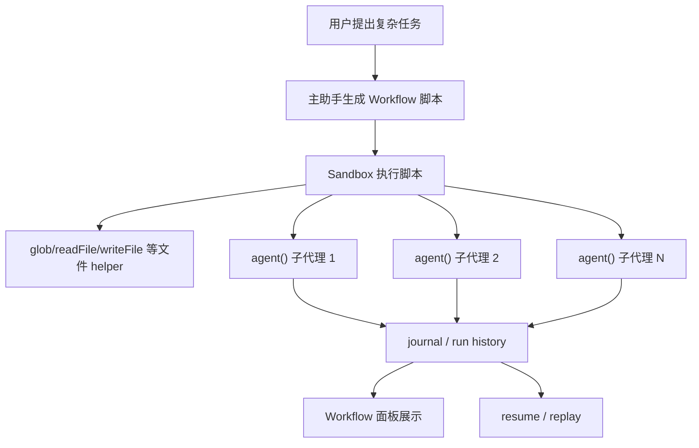

# Dynamic Workflow 使用指南

这份文档面向第一次使用 Dynamic Workflow 的同事。目标是让大家知道：Workflow 是什么、内部怎么跑、怎么写需求、怎么判断是否应该使用它。

## 一句话说明

Dynamic Workflow 是“用 JavaScript 脚本编排复杂任务的多代理执行系统”。

普通聊天是一个助手根据当前上下文一步步做。Dynamic Workflow 会先生成一段工作流脚本，再由脚本调用 `agent()`、`pipeline()`、`parallel()`、文件工具和阶段日志，把复杂任务拆成多个可观察、可恢复、可验证的执行步骤。

## 它解决的核心问题

单个 AI 助手不适合处理跨度很大的复杂任务，例如：

- 任务需要多个阶段，例如“发现问题 -> 验证问题 -> 生成报告”。
- 任务需要多个视角，例如“前端风险、后端风险、测试覆盖、安全风险”分别分析。
- 任务需要独立验证，例如“先让一批 agent 找问题，再让另一批 agent 反驳和确认”。
- 任务需要稳定结构化结果，例如每个子任务都必须返回固定 JSON 字段。
- 任务需要可恢复、可查看历史、可重跑，避免一次模型失败导致全盘重来。
- 任务本身包含批量处理，例如扫描 100 个文件。
- 对多个模块分别做安全审计。

Dynamic Workflow 把“复杂任务”拆成“脚本 + 多个 agent 调用”：

- 脚本负责确定流程。
- agent 负责理解和判断。
- pipeline/parallel 负责并发、流水线和阶段编排。
- schema 负责让结果结构化。
- journal 记录符合条件的 agent 结果，用于恢复和 replay。

## 架构与运行机制

Dynamic Workflow 不是简单让模型“多想几步”。它是一个明确的运行系统：

1. 用户选择 Dynamic Workflow 模式并提出目标。
2. 主助手生成 workflow JavaScript 脚本。
3. workflow engine 在受限 sandbox 中执行脚本。
4. 脚本通过 `agent()` 创建多个 workflow subagent。
5. 每个 subagent 使用独立运行时完成任务。
6. 结果写入运行历史；符合大小和模型条件的 agent 结果会写入 journal。
7. UI 展示 phase、agent 状态、结果和错误。
8. 如果恢复运行，已写入 journal 且调用身份一致的 agent 调用可以 replay。



关键点：

- workflow 脚本运行在主进程受限 sandbox 中，不是 Node.js 任意脚本。
- 脚本没有 `process`，也不能随便访问系统文件。
- 文件 helper 限定在 workspace 内。
- 子代理并发有上限，避免一口气打爆模型和应用。
- `schema` 模式下，子代理必须返回合法结构化结果。
- 运行历史可以用于查看、恢复和排查。

## 和 Agent Team 的区别

Agent Team 是“主协调者动态带团队”。

Dynamic Workflow 是“脚本化的复杂任务编排”。

| 对比项 | Agent Team | Dynamic Workflow |
|---|---|---|
| 控制方式 | 主协调者动态判断 | JavaScript 脚本控制 |
| 适合任务 | 开放式协作、边做边判断、实现 + 验证 | 复杂任务编排、多阶段执行、结构化结果、批量处理 |
| 是否需要脚本 | 不需要用户关心脚本 | 内部会生成/执行脚本 |
| 执行形态 | worker 异步协作 | 多个 agent 调用组成流程 |
| 典型场景 | 修复杂 bug、跨模块协作、根据 worker 结果动态调整 | 多阶段审计、迁移评估、批量扫描、验证波次、报告生成 |

## 用户如何启动

在界面里选择 `Dynamic Workflow` 模式，然后直接描述目标。

注意：请先切到 `Dynamic Workflow` 模式。普通聊天里只写“用 Dynamic Workflow”不等于一定会切换执行模式；新手操作时以页面模式选择为准。

推荐表达方式：

```text
用 Dynamic Workflow 做一次完整的登录链路审计：先让 agent 分别分析前端入口、后端接口、权限校验和测试覆盖，再汇总风险，最后对高风险项做独立验证。
```

```text
用 Dynamic Workflow 评估把旧 hooks 系统迁移到新架构的方案。先收集相关文件，再让不同 agent 分析兼容性、测试成本和回滚风险，最后输出迁移计划。
```

```text
用 Dynamic Workflow 排查 workflow subagent 偶发 400 的问题。先拆成运行时、工具调用协议、UI 日志三条线并行调查，再汇总根因候选，最后让 verification agent 复核最可能原因。
```

```text
用 Dynamic Workflow 扫描 src/main/agent/workflow 下所有 TypeScript 文件，找出潜在性能风险，并按 P1/P2/P3 汇总。
```

```text
创建一个 workflow：找出 tests 目录下所有 workflow 相关测试文件，每个文件交给一个 agent 检查覆盖面，最后汇总缺口。
```

```text
用工作流分析最近改动的文件。先按文件输出风险和是否需要补测试，再对高风险文件做第二轮验证，最后给出合并建议。
```

```text
用 Dynamic Workflow 对 src/renderer 里的组件做一次 UI 风险扫描。每个组件一个 agent，最后汇总可能的布局、溢出、状态缺失问题。
```

```text
用 workflow 做一次文档体系审计：检查 docs 目录文档是否过期、是否缺少关键功能说明，最后生成 reports/docs-audit.md。
```

## Workflow 脚本基础

Workflow 脚本是普通 JavaScript，不是 TypeScript。

每个脚本需要声明 `meta`：

```js
export const meta = {
  name: "scan-workflow-files",
  description: "扫描 workflow 相关文件并汇总风险",
  phases: ["收集文件", "分析文件", "汇总结果"]
};
```

`meta` 的作用：

- `name`：工作流名称，方便历史记录识别。
- `description`：说明这个工作流做什么。
- `phases`：运行阶段，用于 UI 展示。

脚本主体可以直接使用 `await`。

## Workflow 提供的能力

### agent(prompt, opts?)

启动一个子代理。

没有 `schema` 时，返回最终文本。

有 `schema` 时，返回校验过的结构化对象。

```js
const summary = await agent("总结这个模块的职责");
```

结构化结果：

```js
const result = await agent("判断这个文件的风险等级", {
  label: "risk-check",
  schema: {
    type: "object",
    properties: {
      risk: { type: "string", enum: ["low", "medium", "high"] },
      reason: { type: "string" }
    },
    required: ["risk", "reason"],
    additionalProperties: false
  }
});
```

常用 `opts`：

| 选项 | 作用 |
|---|---|
| `label` | UI 中显示的 agent 名称 |
| `phase` | 指定它属于哪个阶段 |
| `schema` | 要求结构化输出 |
| `model` | 指定模型 |
| `agentType` | 指定子代理类型，例如 `Explore`、`verification` 或自定义角色 |

### pipeline(items, ...stages)

流水线处理一组对象。默认推荐用它做多对象、多阶段任务。

```js
const results = await pipeline(files, async (file) => {
  return await agent(`分析文件 ${file}`);
});
```

多阶段示例：

```js
const results = await pipeline(
  files,
  async (file) => {
    const content = await readFile(file);
    return { file, content };
  },
  async (item) => {
    if (!item || !item.content) return null;
    return await agent(`审查文件 ${item.file}\n\n${item.content}`);
  }
);
```

### parallel(thunks)

并行执行一组任务，并等待全部完成。

只有确实需要“等所有结果一起回来”时才用。

```js
const [frontend, backend, tests] = await parallel([
  () => agent("检查前端风险"),
  () => agent("检查后端风险"),
  () => agent("检查测试覆盖")
]);
```

### glob(pattern)

列出 workspace 内匹配的文件。

```js
const files = await glob("src/**/*.ts");
```

注意：CmbCowork 的 `glob()` 主要返回文件，不把目录当成处理对象。这对“每个文件一个 agent”的复杂审查、迁移评估或批量扫描更稳定。

### readFile(path)

读取 workspace 内文件。

```js
const content = await readFile("src/main/agent/runtime.ts");
```

### writeFile(path, content)

写 workspace 内文件，父目录会自动创建。

```js
await writeFile("reports/workflow-audit.md", markdown);
```

### exists(path)

判断文件是否存在。

```js
if (await exists("package.json")) {
  log("发现 package.json");
}
```

### phase(title)

设置当前阶段。

```js
phase("收集文件");
```

### log(message)

写入运行日志。

```js
log(`发现 ${files.length} 个文件`);
```

### args

启动 workflow 时传入的参数。

```js
const targetDir = args.targetDir || "src";
```

### budget

查看本次 workflow 的 token 预算。

```js
if (budget.total && budget.remaining() < 50000) {
  log("预算不足，跳过低优先级检查");
}
```

### workflow({ scriptPath }, args?)

运行一个子 workflow。

```js
const childResult = await workflow({ scriptPath: "workflows/audit-files.js" }, {
  targetDir: "src/main"
});
```

子 workflow 会共享父 workflow 的并发、预算和 agent 计数。

## 可复制脚本样例

### 样例 1：批量审查 TypeScript 文件

```js
export const meta = {
  name: "batch-ts-risk-review",
  description: "批量审查 TypeScript 文件风险",
  phases: ["收集文件", "逐文件审查", "汇总"]
};

const REVIEW_SCHEMA = {
  type: "object",
  properties: {
    file: { type: "string" },
    risk: { type: "string", enum: ["low", "medium", "high"] },
    summary: { type: "string" },
    needsTest: { type: "boolean" }
  },
  required: ["file", "risk", "summary", "needsTest"],
  additionalProperties: false
};

phase("收集文件");
const files = await glob("src/main/**/*.ts");
log(`发现 ${files.length} 个文件`);

phase("逐文件审查");
const results = await pipeline(files, async (file) => {
  const content = await readFile(file);

  return await agent(
    `请审查这个 TypeScript 文件，判断风险等级和是否需要补测试。\n文件：${file}\n\n${content}`,
    {
      label: file,
      phase: "逐文件审查",
      schema: REVIEW_SCHEMA
    }
  );
});

phase("汇总");
return results.filter(Boolean).sort((a, b) => {
  const rank = { high: 0, medium: 1, low: 2 };
  return rank[a.risk] - rank[b.risk];
});
```

### 样例 2：先扫描，再验证高风险项

```js
export const meta = {
  name: "scan-and-verify",
  description: "先找风险，再验证高风险项",
  phases: ["扫描", "验证", "汇总"]
};

const FINDING_SCHEMA = {
  type: "object",
  properties: {
    file: { type: "string" },
    findings: {
      type: "array",
      items: {
        type: "object",
        properties: {
          title: { type: "string" },
          severity: { type: "string", enum: ["low", "medium", "high"] },
          evidence: { type: "string" }
        },
        required: ["title", "severity", "evidence"],
        additionalProperties: false
      }
    }
  },
  required: ["file", "findings"],
  additionalProperties: false
};

const VERDICT_SCHEMA = {
  type: "object",
  properties: {
    title: { type: "string" },
    real: { type: "boolean" },
    reason: { type: "string" }
  },
  required: ["title", "real", "reason"],
  additionalProperties: false
};

phase("扫描");
const files = await glob("src/main/agent/**/*.ts");

const scans = await pipeline(files, async (file) => {
  const content = await readFile(file);

  return await agent(`找出这个文件里的潜在 bug：${file}\n\n${content}`, {
    label: `scan:${file}`,
    schema: FINDING_SCHEMA
  });
});

const highFindings = scans
  .filter(Boolean)
  .flatMap((r) => r.findings.map((f) => ({ ...f, file: r.file })))
  .filter((f) => f.severity === "high");

phase("验证");
const verified = await parallel(
  highFindings.map((finding) => () =>
    agent(`请独立验证这个问题是否真实：${JSON.stringify(finding)}`, {
      label: `verify:${finding.file}`,
      agentType: "verification",
      schema: VERDICT_SCHEMA
    })
  )
);

phase("汇总");
return {
  totalHighFindings: highFindings.length,
  verified: verified.filter(Boolean)
};
```

### 样例 3：生成 Markdown 报告

```js
export const meta = {
  name: "docs-audit-report",
  description: "检查文档并生成报告",
  phases: ["扫描文档", "分析文档", "写报告"]
};

const DOC_SCHEMA = {
  type: "object",
  properties: {
    file: { type: "string" },
    outdated: { type: "boolean" },
    missingTopics: {
      type: "array",
      items: { type: "string" }
    },
    summary: { type: "string" }
  },
  required: ["file", "outdated", "missingTopics", "summary"],
  additionalProperties: false
};

phase("扫描文档");
const docs = await glob("docs/**/*.md");

phase("分析文档");
const results = await pipeline(docs, async (file) => {
  const content = await readFile(file);

  return await agent(`检查这份文档是否过期或缺少关键信息：${file}\n\n${content}`, {
    label: file,
    schema: DOC_SCHEMA
  });
});

phase("写报告");
const rows = results.filter(Boolean);
const markdown = [
  "# 文档审计报告",
  "",
  `共检查 ${rows.length} 份文档。`,
  "",
  ...rows.map((r) => [
    `## ${r.file}`,
    "",
    `- 是否过期：${r.outdated ? "是" : "否"}`,
    `- 缺失主题：${r.missingTopics.length ? r.missingTopics.join(", ") : "无"}`,
    `- 摘要：${r.summary}`,
    ""
  ].join("\n"))
].join("\n");

await writeFile("reports/docs-audit.md", markdown);
return { report: "reports/docs-audit.md", count: rows.length };
```

### 样例 4：用 args 控制扫描目录

```js
export const meta = {
  name: "audit-by-args",
  description: "根据 args 指定目录进行审查",
  phases: ["收集", "审查"]
};

const targetDir = args.targetDir || "src";
const pattern = `${targetDir.replace(/\/$/, "")}/**/*.ts`;

phase("收集");
const files = await glob(pattern);

phase("审查");
return await pipeline(files, async (file) => {
  return await agent(`请简要说明 ${file} 的职责和风险。`, {
    label: file
  });
});
```

启动时可以传：

```json
{
  "targetDir": "src/main/agent/workflow"
}
```

### 样例 5：使用 agentType 调用只读探索代理

```js
export const meta = {
  name: "explore-with-agent-type",
  description: "用 Explore 角色批量调查模块",
  phases: ["探索"]
};

const modules = [
  "workflow runtime",
  "coordinator worker",
  "thread export"
];

phase("探索");
return await parallel(
  modules.map((topic) => () =>
    agent(`请只读调查 ${topic} 的实现入口、关键文件和风险点。`, {
      label: topic,
      agentType: "Explore"
    })
  )
);
```

## pipeline 和 parallel 怎么选

默认优先用 `pipeline()`。

原因是很多复杂任务都可以拆成“每个对象自己走完多个阶段”，不需要所有对象同步等待。批量文件扫描是这种模式，多个风险项逐一验证也是这种模式。

适合 `pipeline()`：

- 每个文件独立审查。
- 每条记录独立分类。
- 每个模块独立总结。
- 第一阶段结果可以直接进入第二阶段。

适合 `parallel()`：

- 必须等所有方向的结果回来再汇总。
- 要先收集全部 findings，再统一去重。
- 要对同一个结论做多视角投票。

不推荐：

```js
const stage1 = await parallel(files.map((f) => () => agent(...)));
const stage2 = await parallel(stage1.map((r) => () => agent(...)));
```

如果每个文件可以独立进入下一阶段，用 `pipeline()` 更自然。

## 结构化输出最佳实践

推荐：

```js
schema: {
  type: "object",
  properties: {
    file: { type: "string" },
    ok: { type: "boolean" },
    issues: {
      type: "array",
      items: { type: "string" }
    }
  },
  required: ["file", "ok", "issues"],
  additionalProperties: false
}
```

不推荐：

```js
schema: { type: "object" }
```

因为这表示任何对象都合法，模型不知道你真正想要哪些字段。

也不推荐把完整长报告塞进一个字段。结构化结果应该是摘要、分类、证据、路径等关键信息；长文本报告可以用 `writeFile()` 写入文件。

## 运行限制和原因

Workflow 有一些限制，是为了保证 Electron 应用稳定：

| 限制 | 目的 |
|---|---|
| 并发 agent 数有上限 | 防止一次启动太多模型请求 |
| 总 agent 数有上限 | 防止死循环无限创建 agent |
| pipeline/parallel 集合有上限 | 防止一次传入过大集合 |
| 脚本大小有限制 | 防止巨大脚本卡住解析 |
| 文件读写大小有限制 | 防止把工作区大文件直接塞进模型 |
| 非确定性 API 禁用 | 保证 resume/replay 稳定 |

这些限制不是为了减少能力，而是为了让大任务可控。

## 不要使用非确定性 API

Workflow 支持恢复和 replay，所以脚本必须尽量确定。

不要写：

```js
const id = Date.now();
const n = Math.random();
```

推荐通过 `args` 传入：

```js
const id = args.runId;
const seed = args.seed;
```

禁用原因：

- 同一个脚本恢复运行时，如果时间或随机数变了，agent 调用身份就可能变化。
- 已完成的 agent 结果无法稳定 replay。
- workflow 历史和重跑行为会变得不可预测。

## 恢复和重跑

Workflow 运行后会有 `runId`。

当 workflow 因中断、应用退出或临时失败需要恢复时，可以用之前的 `runId` 继续。

恢复时，已经完成且调用身份一致的 `agent()` 可以从 journal 中重放，不需要再次消耗模型调用。

调用身份主要和这些内容有关：

- prompt
- schema
- model
- agentType
- child workflow 信息

不是简单按第几个 agent 匹配。因此即使并发顺序变化，只要调用内容不变，也能更稳定 replay。

## 运行面板怎么看

Workflow 面板通常会显示：

- workflow 名称。
- runId。
- 当前阶段。
- 每个 agent 的 label。
- agent 是否成功、失败、缓存命中。
- 输出 token。
- 最终结果。
- 错误信息。

如果某个 agent 返回 `null`，通常表示这个 agent 失败但属于可恢复失败，workflow 可能仍然继续。具体要看脚本如何处理 `null`。

## 常见问题

### 为什么 workflow 已启动后不是马上出结果

因为 workflow 可能正在后台启动多个 agent。工具调用只表示 workflow 已经 launched，最终结果会在运行历史或任务通知里出现。

### 为什么 structured output 会要求 schema

schema 可以让 agent 返回固定 JSON，而不是自由文本。这样脚本可以安全地继续处理结果。

### 为什么不让 agent 一次分析所有文件

因为上下文会太大，结果也不稳定。更好的方式是每个文件一个 agent，最后汇总。

### 为什么 glob 只返回文件

Workflow 的常见单位是文件。返回目录容易让模型把目录当作文件处理，增加错误。需要目录时，可以从文件路径里推导目录，或者让只读 agent 做目录分析。

### 为什么有些失败最后返回 null

`agent()` 的普通失败会被折叠成 `null`，方便 workflow 继续处理其他项。真正 fatal 的错误，例如预算耗尽、用户中止、agent 上限等，会中断整个 workflow。

### 大结果应该怎么处理

不要把特别大的报告放进 structured JSON 字段。建议：

- structured result 返回摘要、路径、计数、风险等级。
- 长报告用 `writeFile()` 写入 workspace 文件。
- 最终结果返回报告路径。

## 同事应该怎么提需求

推荐结构：

```text
用 Dynamic Workflow 做 [目标]。
任务要分成 [阶段 1、阶段 2、阶段 3]。
每个阶段让 agent 分别负责 [文件/模块/风险项/验证视角]。
每个结果返回 [字段列表]。
最后汇总成 [结论/JSON/Markdown/报告文件]。
需要时，对高风险或不确定结果再做一轮 verification。
```

示例：

```text
用 Dynamic Workflow 做登录链路审计。
阶段一：分别分析前端入口、后端接口、权限校验、测试覆盖。
阶段二：汇总所有风险并去重。
阶段三：对 high 风险项用 verification agent 复核。
最后输出 risk、evidence、recommendation 和 ownerArea。
```

示例：

```text
用 Dynamic Workflow 评估一次架构迁移。
阶段一：收集旧实现相关文件。
阶段二：让 agent 分别分析数据流、API 兼容、UI 影响和测试成本。
阶段三：汇总迁移步骤、风险和回滚方案。
最后生成 reports/migration-plan.md。
```

示例：

```text
用 Dynamic Workflow 检查 src/main/agent 下所有 .ts 文件。
每个 agent 分析一个文件，返回 file、risk、summary、needsTest。
最后按 high/medium/low 汇总，并写入 reports/agent-risk-audit.md。
```

示例：

```text
用 workflow 批量检查 docs 目录。
每个 agent 检查一份文档是否过期，返回 file、outdated、missingTopics、summary。
最后生成 Markdown 报告。
```

示例：

```text
用 Dynamic Workflow 做一次安全扫描。
范围是 src/main/ipc 和 src/main/agent。
每个 agent 只看一个文件，输出潜在漏洞类型、证据、建议。
高风险项再用 verification agent 复核一次。
```

## 什么时候不用 Workflow

不要因为它强大就所有任务都用 workflow。

不推荐：

```text
用 workflow 帮我解释这个函数。
```

这种直接普通聊天即可。

不推荐：

```text
用 workflow 改一个按钮文案。
```

这种普通模式更快。

推荐：

```text
用 workflow 做一次 UI 文案规范审计：扫描所有按钮文案，按模块分组分析，找出不符合规范的地方，并生成报告。
```

这种有范围、有阶段、有汇总产物的复杂任务，才是 workflow 擅长的场景。
