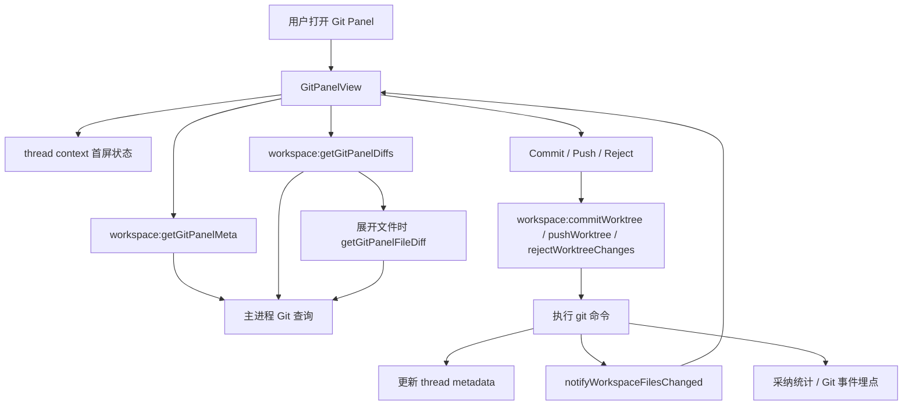

# Git Panel 使用指南

这份文档面向第一次使用或维护 Git Panel 的同事。目标是让大家知道：Git Panel 是什么、能做什么、内部怎么跑、怎么判断问题应该从哪里排查。

## 一句话说明

Git Panel 是“围绕当前线程工作区的 Git 变更评审、提交、推送和回退面板”。

普通终端里的 Git 操作依赖用户手动敲命令。Git Panel 会基于线程绑定的 workspace / worktree 自动读取仓库状态、展示文件级 diff、支持勾选部分文件提交、按任务卡片生成规范 commit message，并把提交和推送事件接入代码采纳统计链路。

## 它解决的核心问题

AI 修改代码之后，用户通常需要确认这些问题：

- 当前线程到底改了哪些文件。
- 每个文件具体改了什么，新增/删除了多少行。
- 是否只提交本次任务相关的一部分文件。
- 多仓库工作区里应该对哪个子仓库执行 commit、push 或回退。
- 提交消息是否满足团队的任务卡片和 `#CMBDevClaw` 约定。
- Push 前是否已经有本地 commit 等待发布。
- 不满意某个文件或一批文件时，能否直接回退。

Git Panel 把这些动作收敛到一个可视化流程：

- meta 负责读取仓库、分支、待推送 commit 和变更数量。
- diff 负责读取文件列表、状态、行数统计和按需 diff。
- Commit Dialog 负责收集任务卡片、提交类型和提交说明。
- Push Dialog 负责展示待推送 commit 并执行 push。
- Reject Dialog 负责选择和回退变更。
- 主进程 IPC 负责执行真实 Git 命令、更新线程 metadata、发送文件变更通知和埋点。

## 架构与运行机制

Git Panel 不是单纯渲染 `git diff`。它是“渲染层状态管理 + preload API + 主进程 Git 执行 + 线程 metadata”的组合。

1. 线程绑定工作区路径，路径保存在 thread metadata 的 `workspacePath`。
2. Git 探测结果会短期缓存在 `metadata.gitContext`，用于首屏快速展示。
3. 用户打开右侧 Git Panel。
4. `GitPanelView` 先用 thread context 构造轻量首屏状态。
5. 渲染层通过 `window.api.workspace.getGitPanelMeta()` 拉取仓库 meta。
6. 渲染层通过 `window.api.workspace.getGitPanelDiffs()` 拉取文件列表和折叠态行数。
7. 用户展开文件时，再通过 `getGitPanelFileDiff()` 懒加载单文件 diff。
8. 用户 commit / push / reject 时，主进程执行对应 Git 命令并刷新 metadata。
9. 主进程通知 workspace 文件变化，Git Panel 和文件树刷新。
10. commit / push 成功后，采纳统计和 Git 事件埋点异步记录。



关键点：

- Git Panel 只对当前线程绑定的 workspace 生效。
- workspace 本身不是 Git 仓库时，会向下发现子仓库。
- 多仓库工作区可以聚合展示变更，但 commit、push、reject 需要明确操作仓库，或只选择同一个仓库的文件。
- 文件列表默认限制为前 200 个，避免超大仓库阻塞渲染。
- 列表首屏默认不加载完整 diff，展开文件时才按需加载。
- 单文件 diff 有大小上限，超大 diff 会显示占位提示。
- 未跟踪的大文件不会完整读取，会以轻量统计和占位 diff 保护主进程内存。
- `node_modules`、`dist`、`build`、`.next`、`.venv` 等噪音目录会在 Git Panel 扫描阶段排除。

## 和终端 Git 操作的区别

| 对比项 | 终端 Git | Git Panel |
|---|---|---|
| 变更查看 | 手动运行 `git status` / `git diff` | 自动展示文件树、状态、行数和 diff |
| 提交范围 | 用户手写 pathspec | 勾选文件提交 |
| 提交消息 | 用户自由输入 | 任务卡片 + type + message + `#CMBDevClaw` |
| 多仓库 | 用户自己 `cd` 到目标仓库 | 面板聚合展示，并要求选择操作仓库 |
| 回退 | 手动 `restore` / `clean` / `checkout` | 支持单文件和批量回退 |
| 采纳统计 | 可能无法归因 | commit / push 后接入采纳与事件链路 |
| UI 刷新 | 手动重新查看 | 文件变化通知触发刷新 |

## 用户如何使用

### 打开面板

先确保当前线程已经绑定工作区。工作区可以是 Git 仓库根目录，也可以是包含多个子 Git 仓库的目录。

打开右侧 Git Panel 后，通常会看到：

- 当前分支或多仓库提示。
- 当前变更文件数。
- 是否有待 push commit。
- 文件树、文件状态、每个文件的新增/删除行数。
- Commit、Push、Pull、Reject 等操作入口。

如果提示“当前任务未关联 Git 仓库”，请先在工作区选择器绑定 Git 仓库路径，或绑定包含子仓库的父目录。

### 查看变更

Git Panel 默认加载文件列表和行数统计，不会一次性加载所有 diff。

推荐流程：

1. 先看顶部变更数量和分支。
2. 在文件树中按目录浏览。
3. 勾选需要关注或提交的文件。
4. 展开单个文件查看 diff。
5. 对不需要的文件点击单文件回退，或打开 Reject Dialog 批量回退。

文件状态含义：

| 状态 | 含义 |
|---|---|
| 新增 | added 或 untracked 文件 |
| 修改 | modified 文件 |
| 删除 | deleted 文件 |
| 改名 | 同目录 rename |
| 移动 | 跨目录 rename |
| 复制 | copied 文件 |

### Commit 提交

点击 Commit 后会打开提交弹窗。

必填项：

- 任务卡片。
- 提交类型：`fix`、`feat`、`refactor`、`docs`、`style`、`test`、`chore`。
- 提交说明。

最终 commit message 格式：

```text
<任务卡片> #comment <type>:<提交说明> #CMBDevClaw
```

示例：

```text
TASK-123 #comment fix:修复 Git Panel diff 懒加载刷新问题 #CMBDevClaw
```

提交时，Git Panel 会：

- 根据勾选文件计算真实 pathspec。
- 对存在文件执行 `git add`。
- 对删除文件执行 `git update-index --remove`。
- 对 rename / move 同时处理旧路径和新路径。
- 执行 `git commit -m <message>`。
- 提交后刷新 HEAD、变更列表和线程 metadata。
- 记录 commit 历史，供下次提交复用。
- 触发代码采纳统计。

注意：

- 没有勾选文件时不能提交。
- 多仓库工作区中，必须选择具体操作仓库，或只勾选同一个仓库的文件。
- Git Panel 不会自动提交所有仓库。

### Push 推送

点击 Push 后，Git Panel 会读取当前仓库的待推送 commit。

Push 行为：

- 如果当前分支已有 `origin/<branch>` upstream，执行默认 `git push`。
- 如果没有 upstream，执行 `git push -u origin <branch>`。
- Push 流程不会自动 commit。
- Push 流程为了速度会跳过 `pull --rebase`，如果远端非 fast-forward，会把 Git 错误返回给用户处理。
- Push 成功后，后台记录 `git.push.executed` 事件，并标记相关 commit 的采纳推送状态。

多仓库工作区中，Push 必须先在“操作仓库”里选择一个子仓库。

### Pull 拉取

Pull 会执行：

```text
git pull --rebase origin <当前分支>
```

多仓库工作区在“全部仓库”下会逐仓库执行 Pull；指定操作仓库时只拉取该仓库。

如果远端不存在当前分支，会视为无需拉取并跳过。

### Reject 回退

Git Panel 支持两类回退：

- 单文件回退：在文件行上直接回退某个文件。
- 批量回退：打开 Reject Dialog，选择一批文件回退。

回退策略：

- 如果线程 metadata 中有文件编辑历史，优先回退到上一个快照，相当于一步撤销。
- 如果没有可用快照，回退到当前分支 HEAD。
- 新增或未跟踪文件会通过 `git clean` 或文件系统删除清理。
- 删除文件或已跟踪修改会通过 `git restore`，旧 Git 版本会 fallback 到 `reset` + `checkout`。

注意：超过快照大小上限的历史内容不能精确回退，面板会阻止这类回退并提示原因，避免误删中间编辑。

## 多仓库工作区

当绑定的 workspace 本身不是 Git 仓库时，系统会向下发现子仓库。

发现规则：

- 默认最多扫描 4 层目录。
- 默认最多扫描 2000 个目录。
- 跳过 `.git`、`node_modules`、`dist`、`build`、`out`、`.next`、`.venv` 等目录。
- 子仓库按展示路径排序。

多仓库展示规则：

- Git Panel 会聚合多个仓库的变更。
- 文件路径会加上子仓库相对 workspace 的前缀。
- 文件列表用 round-robin 从各仓库取前 200 个，避免单个大仓库挤掉其他仓库。
- 顶部分支位置会显示“几个仓库”的汇总提示。

多仓库操作规则：

- Commit：可以选择一个操作仓库，也可以只勾选同一个仓库的文件。
- Push：必须选择一个操作仓库。
- Reject：必须选择一个操作仓库，或传入的文件能唯一归属到一个仓库。
- Pull：全部仓库模式下可以逐仓库执行。

## 线程 metadata 中的 Git 信息

Git Panel 依赖 thread metadata 维护上下文。

常见字段：

| 字段 | 作用 |
|---|---|
| `workspacePath` | 当前线程绑定的工作区 |
| `gitContext` | 短期 Git 探测缓存 |
| `isWorktree` | 当前线程是否标记为 worktree |
| `gitRoot` | worktree 对应的 Git 根目录 |
| `worktreeBranch` | 当前 worktree 分支 |
| `worktreeBaseBranch` | 创建 worktree 时的基线分支 |
| `worktreeBaseCommit` | 创建 worktree 时的基线 commit |
| `llmModifiedFiles` | AI 修改过的文件集合 |
| `llmFileHistory` | 用于一步回退的文件快照 |
| `llmRecentlyRevertedFiles` | 最近回退文件记录 |

`llmModifiedFiles` 可以帮助提交归因，但 Git Panel 作为工作区评审面板，在没有 tracked 过滤时仍会展示工作区内实际 Git 变更，不会故意隐藏用户手动修改的文件。

## 主要 IPC/API

渲染层通过 `window.api.workspace` 和 `window.api.gitPanel` 访问主进程能力。

| API | 作用 |
|---|---|
| `workspace.getGitPanelMeta(threadId, options?)` | 读取分支、变更数量、待推送 commit |
| `workspace.getGitPanelDiffs(threadId, options?)` | 读取文件列表、状态、行数和可选 diff |
| `workspace.getGitPanelFileDiff(threadId, filePath, options?)` | 懒加载单文件 diff |
| `workspace.getGitChangedFilesSummary(threadId)` | 给其他视图使用的轻量变更摘要 |
| `workspace.getGitPanelSummary(threadId)` | 顶部/外部入口使用的快速摘要 |
| `workspace.commitWorktree(threadId, message, filePaths?, options?)` | 提交选中文件 |
| `workspace.pushWorktree(threadId, options?)` | 推送当前仓库 |
| `workspace.pullWorktree(threadId, options?)` | 拉取当前仓库或多仓库 |
| `workspace.rejectWorktreeChanges(threadId, filePaths?, options?)` | 批量回退 |
| `workspace.rejectWorktreeFile(threadId, filePath, options?)` | 单文件回退 |
| `gitPanel.getCommitHistory(threadId)` | 读取 Git Panel commit 历史 |
| `gitPanel.recordCommitHistory(threadId, fullMessage)` | 记录本次规范 commit message |

## 关键代码位置

| 文件 | 职责 |
|---|---|
| `src/renderer/src/components/panels/GitPanelView.tsx` | Git Panel 主界面、刷新、选择、commit/push/reject 调度 |
| `src/renderer/src/components/panels/GitCommitDialog.tsx` | Commit 弹窗和 commit message 预览 |
| `src/renderer/src/components/panels/GitPushDialog.tsx` | Push 弹窗 |
| `src/renderer/src/components/panels/GitRejectDialog.tsx` | 批量回退弹窗 |
| `src/renderer/src/components/panels/git-panel-file-tree.ts` | 文件树构建、目录折叠和行数汇总 |
| `src/main/ipc/models.ts` | Git Panel 主要 IPC、Git 命令执行、diff/state 构建、commit/push/reject |
| `src/main/ipc/git-panel.ts` | Commit 历史读写 |
| `src/main/services/git-repository-discovery.ts` | workspace 子仓库发现和操作路径解析 |
| `src/preload/index.ts` | 暴露 Git Panel 相关 preload API |
| `src/shared/git-commit-history.ts` | Commit 历史记录类型 |

## 性能与安全保护

Git Panel 需要频繁跑 Git 命令，所以实现里有多层保护：

- Git 查询短缓存：Git root、worktree、branch、HEAD、summary 等都有短 TTL。
- 首屏轻量化：先展示 meta，再异步刷新 diff。
- diff 懒加载：文件展开时才拉取完整 diff。
- 并发限制：展开多个文件时最多 3 个单文件 diff 并发。
- 可见文件上限：默认最多返回 200 个文件。
- 单文件 diff 上限：超过大小会返回截断或占位 diff。
- 超大新文件保护：不会一次性读入大文件，只显示占位行数。
- 噪音目录排除：依赖目录、构建产物、IDE 配置目录不进入评审列表。
- Git 交互关闭：`GIT_TERMINAL_PROMPT=0`，避免后台 Git 进程卡住。
- LFS smudge 关闭：`GIT_LFS_SKIP_SMUDGE=1`，避免状态查询触发大文件下载。
- Windows 隐藏子进程窗口：避免 GitPanel 刷新时弹出 git.exe 窗口。
- safe.directory 自愈：遇到 dubious ownership 时会自动添加一次 safe.directory 后重试。

## 常见问题排查

### 面板提示“未配置工作区”

原因：thread metadata 没有 `workspacePath`。

处理：

- 在工作区选择器绑定工作区。
- 检查线程 metadata 是否被清空。

### 面板提示“当前任务未关联 Git 仓库”

原因：

- workspace 不是 Git 仓库。
- workspace 下没有可发现的子仓库。
- Git 探测失败。

处理：

- 确认目录里存在 `.git`。
- 如果是多仓库父目录，确认子仓库深度没有超过发现上限。
- 在终端执行 `git -C <workspace> rev-parse --show-toplevel` 验证。

### 文件数量和预期不一致

可能原因：

- Git Panel 默认最多显示前 200 个文件。
- `node_modules`、`dist`、`build` 等噪音目录被排除。
- 未暂存的移动会被合并成 rename/move，因此数量可能比 `git status` 原始条目少。
- 多仓库模式下可见文件采用 round-robin 截断。

处理：

- 看 UI 是否提示 omitted file count。
- 检查是否有大量未跟踪文件。
- 需要完整列表时，优先从 Reject Dialog 或终端验证。

### 展开文件后 diff 为空或显示占位

可能原因：

- diff 超过主进程 buffer 或 UI 字符上限。
- 文件是二进制或 Git textconv 不可用。
- 文件在刷新和展开之间已被删除或移动。
- 新文件过大，面板只显示性能保护占位。

处理：

- 终端用 `git diff -- <file>` 复核。
- 检查是否有超大生成文件误入工作区。

### Commit 按钮不可用

可能原因：

- 没有选中文件。
- 没有选择任务卡片。
- 没有填写提交说明。
- 多仓库模式下没有明确操作仓库，且选中文件跨多个仓库。

处理：

- 勾选需要提交的文件。
- 选择任务卡片并填写说明。
- 在“操作仓库”中选择子仓库，或只勾选同一子仓库文件。

### Push 显示没有可推送提交

可能原因：

- 本地 HEAD 相对 upstream 没有领先提交。
- 当前分支没有 upstream，系统退化到 `HEAD --not --remotes=origin` 或 baseCommit 估算。
- 刚提交后缓存短时间内未刷新。

处理：

- 点击刷新。
- 终端执行 `git log @{upstream}..HEAD` 或 `git log HEAD --not --remotes=origin` 验证。
- 确认当前分支名和远端分支配置。

### 回退失败

可能原因：

- 文件历史快照过大，无法精确回退。
- Git 版本过旧，不支持 `git restore`，fallback 也失败。
- 文件路径在扫描后发生变化。
- 多仓库模式没有明确目标仓库。

处理：

- 先刷新 Git Panel。
- 对单个文件尝试回退。
- 在多仓库模式选择具体操作仓库。
- 终端检查 `git status --porcelain=v1 -z` 输出。

## 适合使用 Git Panel 的场景

- AI 完成一次代码修改后，需要人工 review diff。
- 希望只提交部分文件，而不是整个工作区。
- 需要把 commit message 绑定任务卡片。
- 当前线程使用 worktree，需要安全提交和推送。
- 工作区包含多个 Git 子仓库，需要统一查看变更。
- 想快速撤销 AI 刚刚改坏的某个文件。

## 不适合只依赖 Git Panel 的场景

- 需要复杂 rebase、cherry-pick、bisect、stash 管理。
- 需要解决大型 merge conflict。
- 需要跨多个仓库做原子提交。
- 需要完整处理超过可见上限的大规模文件变更。
- 需要精细控制 Git hooks、签名、submodule 或 LFS 高级行为。

这些场景建议使用终端或 IDE Git 工具完成，Git Panel 作为结果确认和轻量提交入口。

