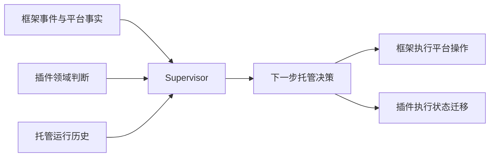
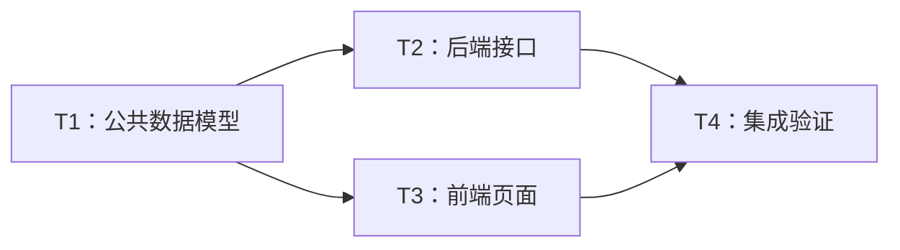
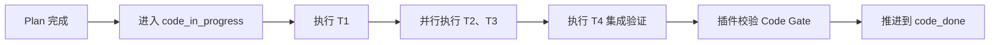

# 托管模式

## 一、要解决的问题

当前项目模式已经能够通过插件定义 Feature 阶段、产物、任务和状态校验，但开发过程仍需要用户或 LLM 负责流程衔接，例如：

- Turn （一轮会话）结束但任务未完成时，用户需要手动输入“继续”；
- 上下文过高时，用户需要手动开启新会话；
- Plan 拆出多个 Task 后，需要人工安排执行顺序和并行会话，不支持并行。
- 阶段完成后，依赖 LLM 记住并正确调用插件脚本推进状态；
- 某个会话启动或执行失败后，需要人工判断从哪里恢复。

托管模式的目标是

1. 增加一个框架级 Supervisor，在用户授权托管后，自动完成 Feature 开发过程中的流程推进，尽量将用户介入收敛到真正需要业务决策、权限审批或风险确认的场景。

2. 在此基础上还需要增加统一的消息中心/通知机制，汇总所有的执行结果、下一步操作，让用户无需在多个 agent 会话中跳来跳去。

3. 还需要搭建托管模式的可观测能力，完整记录决策过程和结果

## 二、托管模式提供的产品能力

1. **自动续跑**：Turn 结束但当前工作单元未完成时，自动继续执行。
2. **自动切换会话**：上下文占用过高或任务要求隔离时，自动创建新会话并完成工作交接。
3. **自动推进阶段**：插件确认产物和 Gate 满足后，在 turn 结束以后自动执行状态和阶段迁移，不再依赖 LLM 记住调用推进脚本。
4. **多任务依赖调度**：识别插件 Plan 中 Task 的依赖关系，只启动依赖已经满足的任务。
5. **并行执行**：对彼此独立的 Task 创建独立会话和工作区，并行完成 Code 工作。
6. **自动收束**：持续跟踪各 Task 的完成结果，全部满足插件定义的 Code Gate 后自动推进到 `code_done`。
7. **失败恢复**：会话启动失败、应用重启或单个任务失败后，从未完成的工作单元恢复，避免重复推进状态或重复执行已完成任务。
8. **过程可见**：向用户展示当前阶段、运行中的 Task、依赖等待、失败原因、自动操作和需要介入的事项。

托管模式不替代 Agent 的编码能力，也不替代插件的业务状态机；它负责在正确的时间组织两者继续工作。

## 三、需要补充的能力

### Supervisor（托管控制器）

Supervisor 是托管模式新增的框架控制核心。它不写代码，也不自行解释插件的业务状态，而是在稳定的决策时点汇总信息、形成下一步计划，并协调框架和插件执行。

**输入：**

- **框架事件**：Turn 结束、上下文超过水位、交互请求（request_user_input)、运行失败（LLM 报错）等；
- **平台事实**：当前会话、上下文占用、运行中的 Agent、可用并发、用户暂停和审批状态；
- **插件判断**：当前 Feature 阶段、Task 完成情况、依赖关系、可执行任务、阶段是否允许推进；
- **托管历史**：已经执行和尚未完成的操作，用于避免重复启动或重复推进。

**输出：**

- **下一步托管决策**：继续当前工作、切换会话、推进阶段、启动一个或多个 Task、等待用户、暂停或结束托管；
- **受控执行计划**：明确操作之间的先后依赖和可并行部分，交由框架执行；
- **过程状态与原因**：记录本次为什么继续、等待、重试或推进，供 UI 展示和问题追踪。

**自身能力：**

- 只在 Turn 稳定结束等安全时点进行完整决策，避免与运行中的 Agent 相互干扰；
- 将插件给出的业务方向与框架的资源、安全、审批和用户策略合并；
- 把“推进状态后再启动任务”等复合决策组织为有依赖的执行计划；
- 持续跟踪 Feature、Task、会话和执行结果，驱动下一轮托管；
- 在部分失败或应用重启后识别未完成操作并恢复执行；
- 当插件无法判断、平台不允许自动执行或需要业务选择时，停止自动推进并请求用户介入。

### 框架平台侧

- 将 Turn 结束、上下文压力、交互请求、运行失败等生命周期事件提供给 Supervisor；
- 建立 Feature 级托管运行，持续跟踪阶段、会话和工作单元；
- 提供受控的平台操作，包括继续 Turn、创建会话、准备隔离工作区、启动 Agent、暂停和恢复；
- 支持按依赖关系调度多个会话/agent，并根据平台资源控制实际并发；
- 记录每次自动决策和执行结果，支持失败重试和应用重启后的恢复；
- 保留用户暂停、权限审批、安全策略和并发限制等平台控制权。

### 插件侧

- 对外提供当前 Feature 阶段、Task、依赖、产物和完成证据；（已有能力）
- 判断当前阶段能否推进、哪些 Task 已经就绪、哪些任务允许并行；（已有能力）
- 为每个工作单元提供明确的目标、执行要求和完成标准；
- 校验并执行插件自己的状态迁移；（已有能力）
- 在无法自动判断或需要业务选择时，明确要求等待用户，而不是由框架猜测。

## 四、框架与插件如何协作

双方遵循一个简单边界：

> 插件决定“业务上下一步应该做什么”，框架决定“平台上如何安全、可靠地把它执行出来”。
>
> 框架作为控制面，agent runtime 作为执行面，插件作为业务面

| 插件负责 | 框架负责 |
| --- | --- |
| 定义任意 Feature 阶段和合法后继 | 感知 Turn、上下文、会话和运行状态 |
| 定义 Plan、Task 依赖和完成标准 | 创建或恢复会话、工作区并启动 Agent |
| 判断 Task 是否 ready、completed 或 blocked | 根据依赖和资源安排串行或并行执行 |
| 校验产物、Evidence 和阶段 Gate | 记录执行过程，处理失败、重试和恢复 |
| 授权并落地插件领域状态迁移 | 执行平台安全、审批和用户暂停策略 |

框架不理解各插件自定义的 `plan_done`、`code_done` 或其他阶段含义；插件也不直接操作框架的会话和 Agent Runtime。这样可以兼容不同插件，同时保持平台行为一致。

## 五、示例：Plan 拆分任务后并行完成 Code

### 1. Plan 阶段产出任务图

Agent 在 Plan 阶段将 Feature 拆分为四个 Task：

- T1 是公共基础任务；
- T2 和 T3 都依赖 T1，二者可以并行；
- T4 同时依赖 T2 和 T3；
- 全部 Task 完成并通过 Code Gate 后，Feature 才能进入 `code_done`。

### 2. Plan Turn 结束

**框架做什么：**

- 感知 Plan Turn 已稳定结束；
- 获取当前上下文占用、用户暂停状态和可用并发资源；
- 唤醒 Supervisor 并调用插件判断下一步。

**插件做什么：**

- 校验 Plan 产物完整、任务依赖合法且 Plan Gate 已通过；
- 确认 Feature 可以从 `plan_done` 进入 `code_in_progress`；
- 判断当前只有 T1 的依赖已经满足；
- 向框架提出“推进到 Code 并启动 T1”。

### 3. 启动第一波 Code 任务

**框架做什么：**

- 调用插件完成受控状态迁移；
- 为 T1 创建或恢复合适的会话和工作区；
- 将 T1 的工作目标交给 Agent 并开始执行；
- 如果 Plan 会话上下文过高，自动使用新会话。

**插件做什么：**

- 再次校验状态迁移是否合法并更新插件状态；
- 提供 T1 的任务说明、产物要求和完成标准；
- T1 结束后，根据产物和 Evidence 判断它是否真正完成。

### 4. 并行启动第二波任务

T1 完成后，T2 和 T3 的依赖同时满足。

**框架做什么：**

- 收到 T1 会话结束事件后再次调用插件；
- 根据平台并发能力，为 T2 和 T3 准备独立会话及隔离工作区；
- 并行启动两个 Code Agent；
- 某个 Task 未完成时只续跑该 Task，不影响已经完成或仍在运行的任务。

**插件做什么：**

- 确认 T1 已完成，并将 T2、T3 判定为 ready；
- 声明二者不存在领域依赖冲突、允许并行；
- 分别提供 T2、T3 的任务目标和完成标准；
- 独立记录和判断两个 Task 的完成状态。

### 5. 收束并执行最终任务

T2、T3 都完成后，T4 的依赖满足。

**框架做什么：**

- 等待两个并行任务分别结束，不因其中一个先结束而过早推进；
- 在插件确认 T4 ready 后启动集成验证会话；
- T4 未通过时按插件结论继续或恢复，不直接推进 Feature 状态。

**插件做什么：**

- 汇总 T2、T3 的产物和 Evidence；
- 确认 T4 的全部前置依赖已经完成；
- 提供集成验证目标，并判断最终结果是否满足 Code Gate。

### 6. 推进到 `code_done`

**插件做什么：**

- 确认 T1～T4 全部完成；
- 校验代码产物、集成结果和插件定义的 Code Gate；
- 授权并执行从 `code_in_progress` 到 `code_done` 的状态迁移。

**框架做什么：**

- 调用插件完成状态迁移；
- 记录 Feature 的阶段变化和本轮托管结果；
- 根据插件定义继续启动后续阶段，或在 Feature 已完成时结束托管运行。

整体流程如下：

## 六、预期价值

- 用户不再承担机械式的“继续、开新会话、复制任务、推进状态”；

- 将流程推进从“大模型基于当前上下文完成语义判断后，主动发起状态迁移，由插件规则校验”，改为“框架事件自动触发，插件基于规则校验，综合规则结果与 LLM 的语义结论判断是否允许推进，再由 Supervisor 受控执行和恢复”。LLM 仍负责必要的语义判断，但不再负责记住何时推进、调用插件推进状态。因此，即使在最基础的情况下，也可以避免 LLM 跳过步骤或者忘记推进步骤**（可以由 supervisor 给出明确的注入提醒，而不是由 LLM 主动发起）**

- 多 Task 在依赖正确的前提下并行执行，缩短 Feature 开发周期；

- 不同插件保留自己的阶段和业务规则，框架提供统一托管体验；

- 失败后能够从具体 Task 恢复，而不是重新开始整个 Feature；

- 用户仍然可以随时查看、暂停或接管托管运行。
