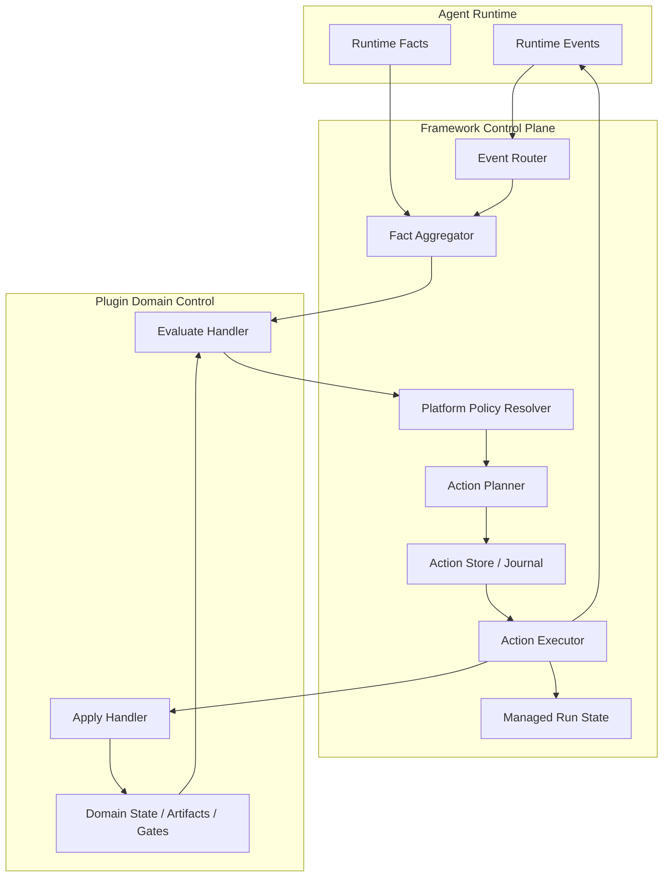
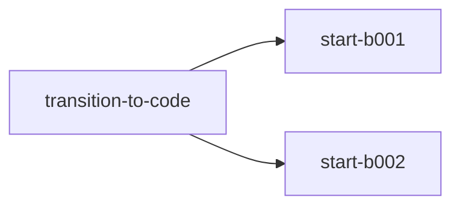
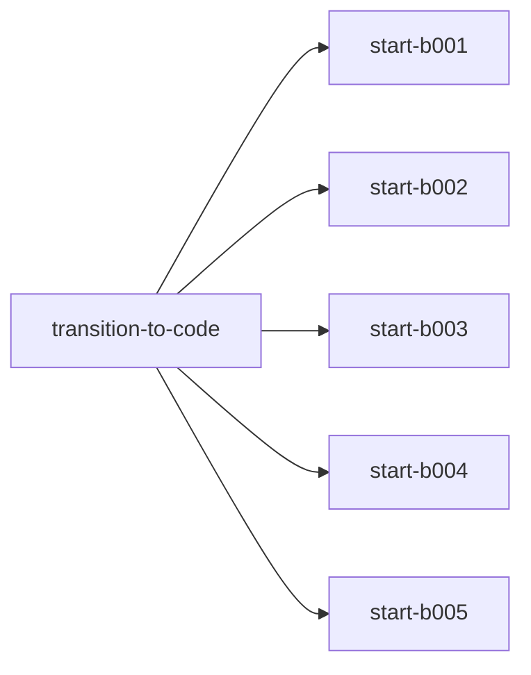

# 项目模式自动托管设计

> 状态：方案讨论稿  
> 更新时间：2026-07-13 11:39:29（GMT+8）  
> 适用范围：CMBDevClaw 项目模式、支持 Harness Board 的插件及其 Feature 工作流

## 1. 摘要

自动托管模式的目标是在一个 Feature 的开发过程中，将“继续下一 Turn、切换会话、执行确定性状态迁移、处理 Batch/Task 交接、等待必要输入、失败恢复”等编排职责从用户和 LLM 中剥离，交给框架的 Supervisor 执行。

总体结构是一个控制型生命周期 Hook：

```text
Agent Runtime 产生决策事件
→ 框架聚合当前事实
→ 调用插件注册的 Evaluate 命令
→ 插件返回受控 ActionIntent
→ 框架合并平台策略
→ 持久化 Action Plan
→ 框架执行平台 Action 或调用插件 Apply
→ 产生后续事件
```

关键原则：

1. 事件只是唤醒信号，最终决策以最新事实快照为准。
2. Turn 结束是正常编排的主要安全边界。
3. 框架拥有平台控制权，插件拥有领域状态解释权，LLM负责当前工作单元。
4. 插件返回领域 Intent，不直接创建会话或控制 Agent Runtime。
5. 框架可以保守兜底，但不能替插件猜测领域状态或后继节点。
6. 影响托管决策的领域事实必须可持久化、可重建。
7. 语义完成判断不应被简单替换为规则判断；插件应按状态声明完成权威。
8. 所有具有副作用的 Action 必须可追踪、幂等并支持崩溃恢复。

## 2. 背景与问题

当前项目模式已经具备：

- Feature 与会话绑定；
- 插件外置状态、产物、Plan、Task、Evidence；
- 插件状态检查和状态迁移脚本；
- 上下文占用提醒和手动新建会话；
- Batch handoff 和 task runner；
- Agent Runtime Hook、审批、request_user_input、Trace 等基础能力。

但流程推进仍依赖用户或 LLM：

- Turn 提前结束后，用户需要输入“继续”；
- 上下文较高时，用户需要手动创建会话；
- LLM 需要记住调用状态脚本；
- LLM 需要识别 Batch 边界并告诉用户新开会话；
- 状态推进成功但会话创建失败时缺乏统一恢复；
- 不同插件可能重复实现会话切换和续跑逻辑；
- 用户难以判断“Turn 结束”和“阶段完成”的区别。

## 3. 目标与非目标

### 3.1 目标

- 在安全条件满足时自动继续未完成的工作单元；
- 在上下文压力或插件隔离约束下自动切换会话；
- 托管任意插件自定义状态机，不在框架中硬编码阶段名称；
- 确定性推进 Task、Batch 及可自动推进的状态边；
- 对 request_user_input、审批、用户暂停等交互进行一致控制；
- 对状态迁移、创建会话、启动 Turn 等 Action 提供幂等和恢复；
- 支持满足条件的 Feature 从启动到终态实现零用户介入；
- 提供可解释的事件、Intent、策略、Action 和结果时间线。

### 3.2 非目标

- 不让 Supervisor 替代插件的领域状态机；
- 不让插件直接控制 Thread、审批或 Agent Runtime；
- 不保证所有 Feature 均可零介入；
- 不通过隐藏的辅助 LLM 在每个 Turn 后重新评审全部产物；
- 不用规则强行替代所有语义完成判断；
- 不构建完整 Event Sourcing 系统，领域状态仍以插件外置状态为事实源。

## 4. 术语

| 术语 | 含义 |
| --- | --- |
| Managed Run | 一个 Feature 从托管启动到完成、暂停或失败的运行实例 |
| Supervisor | 框架中的托管控制器，负责事件路由、事实聚合、策略合并和 Action 执行 |
| Decision Event | 会触发插件 Evaluate 的稳定事件 |
| Signal | Turn 内累积的状态变化提示，本身通常不触发完整决策 |
| Fact Snapshot | 框架在决策点构建的最新平台事实快照 |
| ActionIntent | 插件返回的领域意图，不是最终平台 Action |
| Action Plan | 框架根据 Intent 和平台策略生成的可持久化执行计划 |
| Completion Authority | 当前状态“完成”由规则、Agent、评审产物还是用户决定 |
| Scope Key | `adapterId + projectId + featureId`，用于串行化托管执行 |

## 5. 总体架构



### 5.1 职责边界

| 主体 | 负责 | 不负责 |
| --- | --- | --- |
| LLM | 当前工作单元的代码、文档、验证和必要语义判断 | 会话创建、平台重试、并发租约、确定性 Batch 激活 |
| 插件 | 领域状态、状态合法性、产物门禁、Task/Batch、下一工作单元 | 创建 Thread、绕过审批、决定平台重试 |
| Supervisor | Turn 生命周期、事实聚合、平台策略、Action Plan、恢复 | 解释插件自定义 checkpoint 的业务含义 |
| 用户 | 启动/暂停托管、业务决策、权限审批、不可自动处理的输入 | 日常续跑、复制 handoff 命令、机械式新建会话 |

## 6. Turn 安全边界

正常编排只在 Turn 稳定结束后执行：

```text
LLM 和工具执行
→ PostToolUse 等普通 Hook 完成
→ Stop/Completion Hook 完成
→ transcript/checkpoint 稳定
→ runtime.turn_settled
→ Supervisor Evaluate
```

Turn 内的文件变化、状态变化、Context 变化只更新事实或标记 dirty，不启动并发编排。

以下事件可以在 Turn 内执行受限控制：

- request_user_input：自动解析或进入等待；
- 审批：挂起并等待平台审批；
- 用户取消、安全阻断：立即停止；
- 外部并发状态变化：标记当前运行 stale，阻止继续使用旧决策；
- Context 硬阈值：禁止新的模型子轮次，在最近安全点结束当前 Turn。

## 7. 最小事件模型

为保持协议简单，第一版只定义四个必需决策事件和一个可选事件。

### 7.1 决策事件

| 事件 | 中文含义 | 说明 |
| --- | --- | --- |
| `runtime.turn_settled` | Turn 已稳定结束 | `outcome` 区分 `success`、`failed`、`cancelled`；不代表领域工作已完成 |
| `runtime.interaction_requested` | Runtime 请求交互 | `kind` 区分 `user_input`、`approval`；只进行受限交互决策 |
| `plugin.watch_ref_changed` | 插件外置事实发生变化 | 活跃 Turn 内只累积为 Signal；无活跃 Turn 时可以触发 Evaluate |
| `supervisor.recovery` | 托管运行需要恢复 | 覆盖应用重启、Action 中断、租约过期、Action 失败后的恢复 |
|  |  |  |

`turn.failed`、`turn.cancelled` 合并进 `runtime.turn_settled.outcome`；`approval_resolved` 由平台恢复原运行，后续仍会产生 `runtime.turn_settled`；`action_failed` 记录在 Journal 后统一转为 `supervisor.recovery`。

### 7.2 Turn 内 Signal

以下 Signal 不单独调用插件，而是在下一决策事件中合并传递：

- `plugin_state_changed`
- `artifact_changed`
- `task_run_changed`
- `files_changed`
- `tool_failure_observed`
- `context_soft_limit_reached`
- `context_hard_limit_reached`
- `progress_changed`

## 8. 最小 ActionIntent 集合

事件与 Intent 不一一对应。插件只需处理已订阅事件，并为每次成功调用返回一个顶层 Intent。

| Intent | 中文含义 |
| --- | --- |
| `continue_work` | 当前工作单元未完成，继续执行当前或插件指定的工作单元 |
| `advance_work` | 当前领域条件允许推进，插件提供不透明 transition token 和后续工作描述 |
| `wait` | 等待用户输入、审批或外部条件，不继续自动运行 |
| `resolve_interaction` | 使用确定性答案解决当前结构化交互请求 |
| `pause_run` | 安全暂停 Managed Run，不表示领域工作完成 |
| `complete_run` | 插件领域状态已进入终态，Managed Run 可以结束 |
| `no_op` | 插件已成功判断当前无需领域动作 |
| `undecidable` | 插件因事实缺失或状态矛盾无法可靠判断 |

`no_op` 与 handler 未响应不同；handler 超时、非法 JSON 或异常不得当作 `no_op`。

## 9. 最小平台 Action 集合

框架将 Intent 编译为以下四类逻辑 Action：

| Action | 含义 |
| --- | --- |
| `plugin.apply_transition` | 调用插件 Apply，根据 token 和 expected revision 原子修改领域状态 |
| `agent.start_work` | 在当前会话或新会话启动下一工作单元；内部可展开为创建 Thread 和启动 Turn |
| `interaction.resolve` | 回答结构化 user_input 或恢复已批准的交互 |
| `managed_run.set_status` | 设置 `waiting`、`paused`、`completed` 或 `failed` 等托管状态 |

实际 Journal 可以记录更细的原子步骤，例如 `thread.create`、`turn.start`，但它们不进入插件协议的最小 Action 类型。

### 9.1 Intent 到 Action 的典型映射

| Intent | 可能生成的 Action |
| --- | --- |
| `continue_work` | `agent.start_work` |
| `advance_work` | `plugin.apply_transition`，成功后 `agent.start_work` 或继续 Reconcile |
| `wait` | `managed_run.set_status(waiting)` |
| `resolve_interaction` | `interaction.resolve` |
| `pause_run` | `managed_run.set_status(paused)` |
| `complete_run` | `managed_run.set_status(completed)` |
| `no_op` | 无领域 Action，可保留当前状态 |
| `undecidable` | 补充允许的 Fact、有限重试或安全暂停 |

### 9.2 复合 Action Proposal 与 DAG

简单场景可以由一个 Intent 映射为一个 Action；涉及“先推进状态，再并行启动多个工作单元”时，插件应返回一个复合 Action Proposal。Proposal 中每个高层 Action Request 使用唯一 `id` 定义节点，使用 `dependsOn` 定义依赖边。

```json
{
  "proposalId": "proposal-001",
  "requestedActions": [
    {
      "id": "transition-to-code",
      "type": "domain.apply_transition"
    },
    {
      "id": "start-b001",
      "type": "agent.start_work",
      "dependsOn": ["transition-to-code"]
    },
    {
      "id": "start-b002",
      "type": "agent.start_work",
      "dependsOn": ["transition-to-code"]
    }
  ]
}
```

对应关系：



框架必须校验 Action ID 唯一、依赖节点存在、无自依赖、无环，并通过拓扑排序生成可执行计划。`dependsOn` 第一版只表示“依赖 Action 成功后执行”。

Action Proposal DAG 仅覆盖当前决策周期的即时编排，不替代插件 `plan.json` 中跨多个 Turn 存在的领域 Task/Batch DAG。`agent.start_work` 成功表示工作区、Thread 和 Turn 已成功启动，不表示对应 Batch 已完成；Batch 完成后由新事件触发下一轮 Evaluate。

## 10. 插件 Manifest 协议

概念配置：

```json
{
  "supervision": {
    "apiVersion": "1.0",
    "handlers": {
      "evaluate": {
        "darwin": "python3 hooks/supervisor.py evaluate",
        "linux": "python3 hooks/supervisor.py evaluate",
        "win32": "python hooks\\supervisor.py evaluate",
        "timeoutSeconds": 15
      },
      "apply": {
        "darwin": "python3 hooks/supervisor.py apply",
        "linux": "python3 hooks/supervisor.py apply",
        "win32": "python hooks\\supervisor.py apply",
        "timeoutSeconds": 30
      }
    },
    "subscriptions": [
      {
        "event": "runtime.turn_settled",
        "handler": "evaluate",
        "requiredFacts": ["execution.outcome"],
        "optionalFacts": ["resources.contextPressure", "progress.changed"]
      },
      {
        "event": "runtime.interaction_requested",
        "handler": "evaluate",
        "requiredFacts": ["interaction.kind", "interaction.requestId"]
      },
      {
        "event": "supervisor.recovery",
        "handler": "evaluate",
        "requiredFacts": ["recovery.reason"]
      }
    ],
    "capabilities": {
      "autoContinue": true,
      "automaticTransition": true,
      "crossSessionResume": true,
      "structuredInteractionResolution": true
    }
  }
}
```

规则：

- 插件只订阅需要的事件；
- Fact 需求按订阅事件声明；
- 已订阅事件必须返回合法 Intent，可返回 `no_op`；
- 未订阅事件由框架按平台默认策略处理；
- 声明某项 Capability 时必须满足其最低订阅要求；
- 动态参数全部通过 JSON stdin 传入，stdout 只返回协议 JSON，stderr 用于日志。

## 11. Evaluate 接口

### 11.1 请求

```json
{
  "apiVersion": "1.0",
  "invocationId": "plugin-inv-0031",
  "event": {
    "id": "evt-0088",
    "type": "runtime.turn_settled",
    "occurredAt": "2026-07-13 00:20:00",
    "outcome": "success",
    "signals": [
      "artifact_changed",
      "context_soft_limit_reached"
    ]
  },
  "scope": {
    "adapterId": "autobizdevops-plugin-kanban",
    "projectId": "project-001",
    "featureId": "feature-001",
    "threadId": "thread-008",
    "managedRunId": "managed-run-001"
  },
  "facts": {
    "execution": {
      "turnId": "turn-012",
      "outcome": "success",
      "threadBusy": false
    },
    "interaction": {
      "pendingApproval": false,
      "pendingUserInput": false,
      "userPaused": false
    },
    "resources": {
      "contextUsagePercent": 76,
      "contextPressure": "soft"
    },
    "progress": {
      "changed": true,
      "consecutiveNoProgressTurns": 0
    }
  }
}
```

框架传平台事实；插件自行读取自己的状态、Plan、Task、Artifact、Evidence 和 Gate。默认不传完整 transcript、思考内容、未脱敏工具输出或凭据。

### 11.2 响应示例

```json
{
  "apiVersion": "1.0",
  "invocationId": "plugin-inv-0031",
  "decisionId": "decision-0017",
  "observedState": {
    "revision": 27,
    "fingerprint": "sha256:domain-state"
  },
  "intent": {
    "kind": "continue_work",
    "reasonCode": "unfinished_tasks_remaining",
    "reason": "当前 Batch 仍有两个未完成任务。",
    "nextWork": {
      "workUnitId": "B001/T004",
      "skill": "autodev-code",
      "message": "执行下一个依赖已满足的任务 T004。"
    },
    "handoff": {
      "safe": true,
      "resumeCurrentWork": false
    },
    "sessionConstraint": "new_required"
  }
}
```

### 11.3 Session Constraint

| 值 | 含义 |
| --- | --- |
| `reuse_required` | 必须恢复原会话，例如当前存在挂起工具调用 |
| `reuse_allowed` | 插件不要求隔离，由框架根据 Context 决定 |
| `new_preferred` | 建议新会话，框架可因平台条件暂缓 |
| `new_required` | 领域要求会话隔离，例如 per-task 或 Batch handoff |
| `no_session` | 等待、暂停或完成，不启动会话 |

## 12. Apply 接口与状态迁移

插件 Evaluate 返回 `advance_work` 时，只提供不透明 transition token：

```json
{
  "intent": {
    "kind": "advance_work",
    "transition": {
      "token": "opaque-transition-token",
      "expectedRevision": 27
    },
    "nextWork": {
      "skill": "plugin-defined-skill",
      "message": "继续下一工作单元。"
    },
    "sessionConstraint": "reuse_allowed"
  }
}
```

框架持久化 Action Plan 后调用 Apply：

```json
{
  "apiVersion": "1.0",
  "operation": "apply_transition",
  "invocationId": "apply-001",
  "decisionId": "decision-0017",
  "scope": {
    "projectId": "project-001",
    "featureId": "feature-001"
  },
  "transition": {
    "token": "opaque-transition-token",
    "expectedRevision": 27
  },
  "executedAt": "2026-07-13 00:20:05"
}
```

插件必须：

1. 重读状态；
2. 校验 revision；
3. 重新执行必要 Gate；
4. 原子修改状态；
5. 对 `decisionId` 幂等；
6. 返回新 revision。

冲突时返回 `conflict`，框架丢弃旧 Action，重新 Evaluate。建议每次只 Apply 一条状态边，Apply 成功后执行有上限的 Reconciliation Loop，直到需要启动 Agent、等待、暂停或完成。

## 13. 完成权威与语义判断

规则校验不能替代全部语义判断；同时，不应在每个 Turn 后隐藏调用一个辅助 LLM重新读取全部产物。插件应为状态或 transition 声明完成权威。

| Completion Authority | 中文含义 | 典型场景 |
| --- | --- | --- |
| `deterministic` | 完成可由机器规则充分判断，Supervisor 可以自动推进 | task runner、Batch 完成、测试、Evidence、Schema |
| `agent` | 当前工作 LLM 是语义完成判断者 | 需求讨论、Plan、技术设计 |
| `review_artifact` | 必须存在显式 Reviewer 工作单元产生的持久化评审结果 | Requirements Review、架构评审 |
| `user` | 必须由用户确认 | 业务选择、合规或发布审批 |

### 13.1 不同权威下的行为

#### deterministic

```text
规则通过 → advance_work
规则不通过 → continue_work
```

#### agent

保留当前工作 LLM 的语义判断。LLM 可以继续通过插件现有状态脚本推进语义完成边；Supervisor 不因规则满足而代替 LLM推进。Turn 结束时：

```text
LLM 已合法推进 → Supervisor 处理后续确定性状态或下一工作单元
规则满足但未推进 → continue_work，要求当前 Agent 复核并完成语义收敛
规则不满足 → continue_work，补齐确定性缺口
```

这不能完全消除 LLM 忘记或过早判断，但能自动续跑并避免用户介入，且不引入每 Turn 双模型评审成本。

#### review_artifact

重型语义评审应作为插件显式节点运行，产出结构化 Review Artifact。Supervisor 只消费已落盘 Verdict；同一 artifact fingerprint 不重复评审。

#### user

没有用户确认时返回 `wait`，不得为了零介入强行推进。

### 13.2 推荐的混合策略

| 工作单元 | 推荐权威 |
| --- | --- |
| 需求讨论、PRD、Specs、Plan | `agent` + 确定性 Gate |
| 单个 Code Task | `deterministic` |
| Batch 完成 | `deterministic` |
| Code 阶段收敛 | `deterministic`，语义实现质量交给后续显式 Requirements Review |
| Requirements Review | `review_artifact` |
| Unit Test、E2E 强校验 | `deterministic` |
| Verify | `agent` 或 `review_artifact` |
| Archive | `deterministic` |

## 14. 场景一：Batch 全部 Task 完成

假设 B001 中的任务均有完成记录。

### 14.1 B001 不是最后一批

1. 最后一个 task runner 完成并原子更新 Plan：B001 done、根状态 `awaiting_next_conversation`、`nextBatchId=B002`。
2. 当前 Turn 结束，产生 `runtime.turn_settled`。
3. 插件 Evaluate 校验所有 task、Evidence、Batch 依赖和 handoff。
4. 插件返回 `advance_work`，transition token 表示激活 B002，`sessionConstraint=new_required`。
5. 框架持久化 Action Plan。
6. 框架调用 Apply 激活 B002并取得新 revision。
7. 框架创建新 Feature 会话。
8. 框架启动 B002 中第一个依赖满足的 task。

如果激活成功而创建会话失败，Recovery 只重试会话创建，不重复激活 B002。

### 14.2 B001 是最后一批

插件不应直接返回 `complete_run`，而应检查 project-check、前端回检、smoke、Code gate 等收敛工作。未完成时返回 `continue_work`，必要时为收尾工作创建新会话；全部完成后再推进 Code 状态。

## 15. 场景二：Batch 有两个 Task 没有完成记录

假设：

```text
T001 = done
T002 = done
T003 = done
T004 = todo
T005 = todo
```

流程：

1. 当前 Turn 结束。
2. 插件 Evaluate 读取 active Batch、task status、依赖和 task-run。
3. 如果 T004 未启动，返回 `continue_work(T004)`。
4. 如果 T004 存在未收敛 run，优先返回恢复 T004，禁止启动 T005。
5. 框架根据 `sessionConstraint` 和 Context 选择当前会话或新会话。
6. T004 完成后的下一个 Turn 再次 Evaluate，选择 T005。
7. T005 完成后进入“Batch 全部完成”流程。

失败、blocker、依赖未满足或 Evidence 冲突时不得跳过当前 task；插件应返回 `continue_work`、`wait`、`pause_run` 或 `undecidable`。

若采用 per-task 会话隔离，成功完成 task 必须成为 Runtime 硬边界，禁止同一 Turn 启动下一 task；否则 Supervisor 只能在整个 Turn 结束后介入。

## 16. 场景三：Plan 到 Code

推荐将两条状态边采用不同完成权威：

```text
plan_in_progress → plan_done       completionAuthority=agent
plan_done → code_in_progress       completionAuthority=deterministic 或 user（有选择时）
```

流程：

1. Plan LLM生成设计和计划产物。
2. Plan LLM基于语义判断调用现有受 Gate 保护的状态脚本推进到 `plan_done`。
3. Turn 结束，Supervisor Evaluate 读取最终状态。
4. 如果仍是 `plan_in_progress`：
   - Gate 未通过：返回 `continue_work` 补齐缺口；
   - Gate 已通过但 Agent 尚未推进：返回 `continue_work`，让原 Agent 复核语义完成情况。
5. 如果已是 `plan_done`：
   - 存在未决工作流选择：返回 `wait` 或采用已持久化默认值；
   - 存在唯一后继：插件返回 `advance_work`，框架 Apply 到 `code_in_progress`。
6. 框架根据 Context 和 Session Constraint 在当前会话或新会话启动 Code。

相比完全由 LLM编排，Supervisor 消除了“已到 plan_done 但忘记开启下一阶段/新会话”的问题；相比纯规则推进，该设计保留 Plan 的语义完成判断。

### 16.1 完整样例：Plan Done 后推进 Code 并启动五个 Batch 会话

本样例用于完整说明一次复合托管决策中插件和框架分别做什么。样例假设插件已经支持并行 Wave、多 active Batch 或等价领域模型；当前 Kanban 插件的单 `activeBatchId`、单 active task run 模型不能直接执行该并行样例，需要先扩展插件并发协议。

#### 16.1.1 初始条件

Plan 会话已经完成语义判断并通过现有受 Gate 保护的状态脚本进入：

```text
featureState = plan_done
stateRevision = 42
planThreadContextUsage = 82%
```

插件 `plan.json` 中存在五个已经满足依赖、允许并行的 Batch：

```text
wave-001
├── B001 ready
├── B002 ready
├── B003 ready
├── B004 ready
└── B005 ready
```

插件还必须能够证明或声明：

- 五个 Batch 没有未满足的前置依赖；
- 它们属于同一个可并行 Wave；
- 每个 Batch 可以独立恢复；
- 每个 Batch 要求独立会话；
- 每个 Batch 使用独立 Worktree 或等价写隔离；
- 冲突文件、共享入口和最终合并策略已定义；
- `plan_done` 后不存在未决 workflow choice；
- 当前唯一合法后继是 Code 的开始状态。

#### 16.1.2 第一步：框架产生决策事件

Plan Turn 完成、普通 Hook 和持久化收敛后，框架产生：

```json
{
  "type": "runtime.turn_settled",
  "outcome": "success",
  "occurredAt": "2026-07-13 10:00:00",
  "signals": [
    "plugin_state_changed",
    "artifact_changed",
    "context_soft_limit_reached"
  ]
}
```

框架在调用插件前负责：

1. 确认当前 Turn 已经稳定结束；
2. 聚合 Context 82%、用户暂停、审批、活动运行和并发额度等平台事实；
3. 获取当前 Feature Scope 租约；
4. 按 Manifest 订阅调用插件 Evaluate；
5. 将动态事实通过 JSON stdin 传入，不要求插件访问框架内部数据库。

#### 16.1.3 第二步：插件 Evaluate 领域状态

插件负责读取并判断：

1. 当前领域状态是否确实为 `plan_done`；
2. 当前 state revision 是否为 42；
3. Plan Gate、Batch Schema 和依赖是否有效；
4. 是否存在详细设计等未决分支；
5. `plan_done` 的合法后继是否为 `code_in_progress`；
6. B001～B005 是否全部 ready；
7. 五个 Batch 是否允许并行；
8. 是否需要 Worktree 隔离；
9. 每个 Batch 的 skill、工作指令和领域 Work Unit ID。

插件不创建 Thread、不读取平台 Thread 列表、不决定审批、不直接执行状态修改。Evaluate 是只读操作。

插件返回以下 Action Proposal：

```json
{
  "apiVersion": "1.0",
  "proposalId": "proposal-plan-to-code-001",
  "decisionId": "decision-plan-to-code-001",
  "observedState": {
    "stateId": "plan_done",
    "revision": 42,
    "fingerprint": "sha256:plan-state"
  },
  "reasonCode": "parallel_code_wave_ready",
  "requestedActions": [
    {
      "id": "transition-to-code",
      "type": "domain.apply_transition",
      "transition": {
        "token": "opaque:plan-done-to-code-wave-001",
        "expectedRevision": 42,
        "display": {
          "from": "plan_done",
          "to": "code_in_progress"
        }
      }
    },
    {
      "id": "start-b001",
      "type": "agent.start_work",
      "dependsOn": ["transition-to-code"],
      "workUnit": {
        "id": "B001",
        "skill": "autodev-code",
        "instruction": "执行 wave-001 的 B001，只加载 B001 的任务契约。"
      },
      "sessionMode": "new_required",
      "isolation": "worktree_required"
    },
    {
      "id": "start-b002",
      "type": "agent.start_work",
      "dependsOn": ["transition-to-code"],
      "workUnit": {
        "id": "B002",
        "skill": "autodev-code",
        "instruction": "执行 wave-001 的 B002，只加载 B002 的任务契约。"
      },
      "sessionMode": "new_required",
      "isolation": "worktree_required"
    },
    {
      "id": "start-b003",
      "type": "agent.start_work",
      "dependsOn": ["transition-to-code"],
      "workUnit": {
        "id": "B003",
        "skill": "autodev-code",
        "instruction": "执行 wave-001 的 B003，只加载 B003 的任务契约。"
      },
      "sessionMode": "new_required",
      "isolation": "worktree_required"
    },
    {
      "id": "start-b004",
      "type": "agent.start_work",
      "dependsOn": ["transition-to-code"],
      "workUnit": {
        "id": "B004",
        "skill": "autodev-code",
        "instruction": "执行 wave-001 的 B004，只加载 B004 的任务契约。"
      },
      "sessionMode": "new_required",
      "isolation": "worktree_required"
    },
    {
      "id": "start-b005",
      "type": "agent.start_work",
      "dependsOn": ["transition-to-code"],
      "workUnit": {
        "id": "B005",
        "skill": "autodev-code",
        "instruction": "执行 wave-001 的 B005，只加载 B005 的任务契约。"
      },
      "sessionMode": "new_required",
      "isolation": "worktree_required"
    }
  ],
  "executionPolicy": {
    "desiredConcurrency": 5,
    "minimumConcurrency": 1,
    "failurePolicy": "continue_independent"
  }
}
```

其中 `display.from/to` 仅用于日志和 UI；框架不根据状态名称推导迁移，真正授权 Apply 的是 opaque token 和 expected revision。

#### 16.1.4 第三步：框架校验并编译 Action DAG

插件 Proposal 表达的 DAG：



框架负责：

1. 校验 Action ID 唯一；
2. 校验 `dependsOn` 引用存在；
3. 检查 DAG 无环并完成拓扑排序；
4. 校验所有 Action 都属于当前 Feature Scope；
5. 校验插件 Capability 允许自动迁移和并行启动；
6. 检查用户未暂停、没有 pending approval、没有冲突 Managed Run；
7. 检查平台并发额度和 Worktree 能力；
8. 根据 `desiredConcurrency/minimumConcurrency` 决定实际并发数；
9. 将高层 `agent.start_work` 编译为低层可恢复步骤；
10. 在执行任何副作用前持久化 Action Plan。

高层 `start-b001` 在框架内部可以展开为：

```text
workspace.ensure(B001)
→ thread.ensure(B001)
→ thread.bind_feature_and_work_unit(B001)
→ managed_input.persist(B001)
→ turn.start(B001)
```

插件不需要知道这些低层平台 API。

#### 16.1.5 第四步：框架调用插件 Apply 推进状态

框架首先执行根节点 `transition-to-code`，调用插件 Apply：

```json
{
  "apiVersion": "1.0",
  "operation": "apply_transition",
  "invocationId": "apply-plan-to-code-001",
  "proposalId": "proposal-plan-to-code-001",
  "decisionId": "decision-plan-to-code-001",
  "transition": {
    "token": "opaque:plan-done-to-code-wave-001",
    "expectedRevision": 42
  },
  "executedAt": "2026-07-13 10:00:05"
}
```

插件 Apply 负责：

1. 重新读取当前领域状态；
2. 校验 revision 仍为 42；
3. 重新检查合法后继和 Code startup gate；
4. 重新检查 B001～B005 仍然 ready；
5. 原子写入 `code_in_progress`；
6. 初始化 `wave-001` 及五个 Batch 的 ready/running 投影；
7. 写入插件领域 transition audit；
8. 对同一 `decisionId` 幂等；
9. 返回新 revision。

```json
{
  "status": "applied",
  "oldRevision": 42,
  "newRevision": 43,
  "currentStateId": "code_in_progress",
  "waveId": "wave-001"
}
```

如果 Apply 失败或 revision conflict，框架不会执行五个 `agent.start_work`，而是终止旧 Action Plan并重新 Evaluate。

#### 16.1.6 第五步：框架并行启动五个 Code 工作单元

`transition-to-code` 成功后，五个 start Action 同时进入 ready。框架根据实际并发额度执行：

1. 为每个 Batch 确保独立 Worktree 或等价隔离环境；
2. 创建或恢复对应的 Feature Thread；
3. 在 Thread metadata 中绑定 `managedRunId`、`waveId`、`workUnitId`、`baseRevision` 和 workspace；
4. 持久化托管输入；
5. 启动对应的 Agent Turn；
6. 将托管输入标记为 `managed_continuation`，不伪装成真实用户消息；
7. 自动输入仍经过 UserPromptSubmit 和安全 Hook。

Plan 会话 Context 已达到 82%，且每个工作单元都是 `new_required`，因此不复用 Plan 会话。

五个会话分别执行：

```text
Thread-B001 → B001 Worktree → B001 task queue
Thread-B002 → B002 Worktree → B002 task queue
Thread-B003 → B003 Worktree → B003 task queue
Thread-B004 → B004 Worktree → B004 task queue
Thread-B005 → B005 Worktree → B005 task queue
```

每个 Batch 内的 task 是否串行或并行仍由插件 Plan 和 Runner 决定，框架不会根据 Thread 数量推断 Task 依赖。

#### 16.1.7 第六步：Batch 执行和后续收敛

每个 Code Turn 结束后，框架按对应 Work Unit Scope 产生新的 `runtime.turn_settled` 并调用插件 Evaluate。插件负责：

- 读取对应 Batch 的 task-run 和 Evidence；
- 未完成时返回继续或恢复当前 Batch；
- 完成时更新领域 Batch 状态；
- 某个 Batch完成但 Wave 未完成时返回 `no_op` 或仅处理该 Work Unit；
- 全部 Batch 完成后提出 Integration/merge 工作单元；
- Integration、project-check 和 Code gate 通过后，才允许继续推进后续 Feature 状态。

`agent.start_work` Action 成功只表示会话和 Turn 已成功启动，不表示 Batch 已完成。因此初始 Action DAG 不包含“等待五个 Batch 完成后自动 merge”的长时间节点；Batch 完成通过后续事件和新的 Action Proposal 驱动。

#### 16.1.8 失败与恢复

典型部分失败：

```text
transition-to-code = succeeded
start-b001 = succeeded
start-b002 = succeeded
start-b003 = succeeded
start-b004 = succeeded
start-b005 = failed(thread create)
```

框架 Journal 已记录领域状态处于 `code_in_progress`，Recovery 只重试 B005 的 `thread.ensure/turn.start`，不重复 Apply、不重复创建 B001～B004，也不重新使用高 Context 的 Plan 会话。

#### 16.1.9 职责总结

| 步骤 | 插件职责 | 框架职责 |
| --- | --- | --- |
| Turn 结束 | 无 | 产生事件、聚合 Fact、取得 Scope 租约 |
| Evaluate | 解释领域状态、Gate、依赖和并行安全，返回 Action Proposal DAG | 调用 handler、校验协议和超时 |
| 状态迁移 | 生成 opaque token；Apply 时重验并原子写状态 | 持久化计划、调用 Apply、处理 conflict |
| 并发决策 | 提供 desired/minimum concurrency 和领域硬约束 | 根据资源、安全和产品策略确定实际并发 |
| 工作区 | 声明是否要求隔离及领域写边界 | 创建/恢复 Worktree，管理路径和生命周期 |
| 会话 | 提供 Work Unit、skill、instruction、sessionMode | 创建/恢复 Thread、绑定 metadata、启动 Turn |
| 自动输入 | 提供领域工作指令 | 以 managed continuation 提交并经过安全 Hook |
| Batch 执行 | 管理 Task/Batch 状态、Runner、Evidence、完成判定 | 管理 Turn、Context、重试、会话切换和运行锁 |
| 失败恢复 | 保证 Evaluate 无副作用、Apply 幂等和 revision 校验 | Write-ahead Journal、重试未完成低层 Action |
| 全部完成 | 判断何时进入 Integration 和后继领域状态 | 启动后续工作单元并维护用户可见时间线 |

## 17. Context 与会话策略

建议默认阈值：

- Soft：70%；
- Hard：85%～90%，由产品配置确定。

规则：

1. Turn 内达到 Soft：只记录 Signal。
2. Turn 内达到 Hard：禁止新的模型子轮次，在最近安全边界结束。
3. `reuse_required`：不允许切换。
4. `new_required`：无论 Context 多少均切换。
5. `reuse_allowed` 且达到 Soft：在 `handoff.safe=true` 时切换。
6. 未达到 Soft：优先复用当前会话。
7. 达到 Hard 但插件不能安全交接：收敛一次后暂停，不盲目继续。

## 18. 交互处理

`runtime.interaction_requested` 只进行受限决策，不执行完整领域推进。

### 18.1 自动解析条件

- 存在结构化 `questionId`；
- 插件声明支持该问题；
- 答案来自已持久化项目默认值或用户历史明确选择；
- 答案属于允许选项；
- 框架安全策略允许自动回答。

业务澄清、权限审批、自由文本问题默认进入 `wait`。插件不能通过 Intent 绕过平台审批。

## 19. 零用户介入

满足以下条件的 Feature 可标记为 `zero_touch_eligible`：

- 插件支持所需托管 Capability；
- 所有可选流程分支存在确定性默认值；
- 权限与审批策略已预配置；
- 必要输入、仓库、测试环境可用；
- 状态、异步任务和 handoff 均可重建；
- 所有 Apply 和平台 Action 可幂等恢复；
- 不存在必须由用户完成的业务或合规决策。

产品承诺应为：

> 对 `zero_touch_eligible` Feature，从托管启动到插件终态实现零用户介入；其他 Feature 自动运行到第一个真正需要用户决策或权限的安全边界。

## 20. 托管状态机

插件领域状态与框架托管状态相互独立。

框架最小托管状态：

```text
idle
running
evaluating
applying
waiting
paused
recovering
completed
failed
```

例如插件状态可以是 `code_in_progress`，同时框架状态为 `waiting`，表示领域仍在 Code，但运行正在等待审批。

## 21. 可观测性与日志

### 21.1 四层可观测模型

| 层 | 回答的问题 |
| --- | --- |
| Agent Runtime Trace | LLM和工具做了什么 |
| Supervisor Journal | 为什么决定下一步、执行了什么 Action |
| Plugin Domain Evidence | 为什么领域状态允许或拒绝推进 |
| 用户时间线 | Feature 当前在哪里、为什么暂停或切换会话 |

### 21.2 关联 ID

至少包含：

- `managedRunId`
- `scopeKey`
- `eventId`
- `turnId`
- `threadId`
- `pluginInvocationId`
- `decisionId`
- `actionPlanId`
- `actionId`
- `transitionToken`
- `stateRevision`
- `traceId`

完整链路应可查询：

```text
eventId
→ pluginInvocationId
→ decisionId
→ actionPlanId
→ actionId
→ next threadId / turnId
```

### 21.3 Supervisor Journal 事件

最小记录：

```text
managed_run.started / waiting / paused / completed / failed
runtime_event.received
fact_snapshot.captured
plugin_evaluate.started / succeeded / failed
plugin_intent.received
policy_resolution.completed
action_plan.persisted
action.started / succeeded / failed
plugin_transition.applied / rejected / conflict
recovery.started / completed / failed
```

### 21.4 结构化日志示例

```json
{
  "timestamp": "2026-07-13 00:30:00",
  "level": "info",
  "eventType": "plugin_intent.received",
  "managedRunId": "managed-run-001",
  "scopeKey": "adapter:project:feature",
  "projectId": "project-001",
  "featureId": "feature-001",
  "threadId": "thread-008",
  "turnId": "turn-012",
  "eventId": "evt-0088",
  "pluginInvocationId": "plugin-inv-0031",
  "decisionId": "decision-0017",
  "stateRevision": 27,
  "intent": "advance_work",
  "reasonCode": "batch_completed_next_batch_ready",
  "summary": "B001 已完成，插件建议激活 B002。"
}
```

所有持久化时间使用 GMT+8 `YYYY-MM-DD HH:mm:ss`。

### 21.5 Write-ahead Journal

副作用执行前必须先写：

```text
action_plan.persisted
action.started
```

完成后写：

```text
action.succeeded 或 action.failed
```

应用重启后，Recovery 查询停留在 `started` 的 Action，依据幂等键和外部真实状态决定补偿、重试或重新 Evaluate。

### 21.6 隐私与脱敏

Supervisor Journal 默认不保存：

- 完整 Prompt、模型回答和思考内容；
- 文件正文；
- 完整工具 stdout/stderr；
- 用户 token、密钥和环境变量。

保存结构化状态、reasonCode、脱敏摘要、Hash，以及对 Runtime Trace、插件 Evidence、原始日志的引用。

### 21.7 核心指标

- `zero_touch_completion_rate`
- `user_interventions_per_run`
- `managed_run_completion_rate`
- `autonomous_turns_per_run`
- `thread_rotations_per_run`
- `context_usage_at_rotation`
- `plugin_evaluate_failure_rate`
- `action_failure_rate`
- `transition_conflict_count`
- `undecidable_rate`
- `recovery_success_rate`
- `consecutive_no_progress_turns`
- `waiting_duration`

## 22. 并发、投递和恢复语义

### 22.1 At-least-once

事件和 Action 采用 at-least-once 语义：

- Evaluate 尽量无副作用；
- Apply 必须幂等；
- Event、Decision、Action 均有唯一 ID；
- 不承诺 exactly-once。

### 22.2 Scope 串行

同一 Scope Key 同时只允许：

- 一个 Evaluate；
- 一个 Action Plan；
- 一个 Apply；
- 一个自动写运行会话。

不同 Feature 可以并行。

### 22.3 事件合并

Evaluate 或 Action 执行期间产生的新 Signal 只标记 Scope dirty。当前执行完成后，如事实或 revision 已变化，再统一 Evaluate 一次。

### 22.4 No-progress 熔断

根据领域 state fingerprint、相关 artifact fingerprint、task/evidence 进展判断。连续若干 Turn 无进展时暂停，不依据模型自然语言判断进展。

## 23. 错误处理

| 情况 | 框架行为 |
| --- | --- |
| 未订阅事件 | 执行平台默认行为，不猜领域推进 |
| `no_op` | 明确无领域动作 |
| `undecidable` | 补 Fact、有限重试或安全暂停 |
| handler timeout/非零退出 | 有限重试后暂停，禁止回退给 LLM猜状态 |
| stdout 非法 JSON | 协议错误，禁用本次托管并报告 |
| Apply conflict | 丢弃旧 Action，重新 Evaluate |
| Gate rejected | 保持状态，按插件结果继续、等待或暂停 |
| Thread 创建失败 | 保留已完成领域迁移，只重试平台 Action |
| Turn 启动失败 | 不重复创建 Thread，重试启动或 Recovery |
| 插件卸载/不兼容 | 暂停 Managed Run，降级为手动模式 |

## 24. 安全边界

- 插件输出按结构化不可信输入处理；
- Intent 类型、字段长度、Scope、Session Constraint 使用白名单校验；
- 插件不能返回任意平台 Shell Action；
- 插件不能指定任意 Thread 或其他 Feature；
- 插件不能绕过审批、权限和用户暂停；
- handler 使用固定 cwd、最小环境变量、timeout 和输出大小限制；
- 动态输入使用 JSON stdin，避免命令行拼接和敏感信息泄露；
- 自动续跑输入仍经过现有 UserPromptSubmit 和安全 Hook；
- 新会话仍经过现有 Session 生命周期 Hook。

## 25. 兼容与渐进演进

### 阶段一：自动续跑与会话切换

- 支持 `runtime.turn_settled`；
- 支持 `continue_work`；
- 保留现有 LLM状态更新方式；
- 自动处理 Context 和 Feature 会话创建。

### 阶段二：确定性 Task/Batch 托管

- Task/Batch 使用 `completionAuthority=deterministic`；
- 自动恢复 task run；
- 自动激活下一 Batch；
- 支持 per-task/per-batch 会话策略。

### 阶段三：插件状态 Apply 与 Recovery

- 引入 revision、transition token、Action Journal；
- 自动推进 deterministic 状态边；
- 支持崩溃恢复和冲突重评估。

### 阶段四：交互和零介入资格

- 结构化交互自动解析；
- Zero-touch Preflight；
- 托管时间线、指标和告警。

## 26. 关键 ADR

### ADR-001：采用框架驱动的单向插件调用

**状态：** Proposed

**决定：** Runtime 事件由框架监听，框架按插件 Manifest 调用 Evaluate/Apply。插件不主动调用框架。

**原因：** 单入口更容易保证顺序、幂等、权限、生命周期和恢复；当前插件状态主要是可 Watch 的外置事实。

**代价：** 插件拥有独立后台任务时，需要 WatchRef、Heartbeat 或未来扩展能力。

### ADR-002：插件返回 Intent，框架执行 Action

**状态：** Proposed

**决定：** 插件表达领域意图和约束，框架拥有平台 Action 最终决策权。

**原因：** 插件缺少 Thread、审批、Context、并发和恢复等完整平台事实。

**代价：** 需要定义稳定的 Intent、Fact 和 Action 协议。

### ADR-003：采用混合 Completion Authority

**状态：** Proposed

**决定：** 状态完成可由 deterministic、agent、review_artifact 或 user 决定，不用单一规则或隐藏辅助 LLM覆盖全部阶段。

**原因：** 规则不足以判断全部语义完成；每 Turn 辅助 LLM评审成本过高。

**代价：** 部分语义阶段仍依赖当前 LLM，不能完全消除其忘记或误判，只能通过自动续跑、Gate 和显式 Review 节点降低风险。

### ADR-004：Action 采用 Write-ahead Journal

**状态：** Proposed

**决定：** 所有副作用先持久化 Action Plan 和 started 状态，再执行并写结果。

**原因：** 状态迁移、Thread 创建和 Turn 启动跨越多个子系统，必须支持部分成功后的恢复。

**代价：** 增加持久化、幂等查询和 Recovery 状态机复杂度。

## 27. 待确认事项

1. Code 默认采用 per-task、per-batch 还是 adaptive 会话策略；
2. Soft/Hard Context 阈值的产品默认值；
3. Managed Run 和 Action Journal 的具体存储位置与保留策略；
4. 哪些现有 checkpoint 边标记为 deterministic，哪些保留 agent 权威；
5. 结构化 request_user_input 的 questionId 协议；
6. Zero-touch Preflight 的权限检查范围；
7. 单次 Reconciliation Loop 的最大自动迁移步数；
8. 插件协议版本和最低 Host 版本兼容策略。
