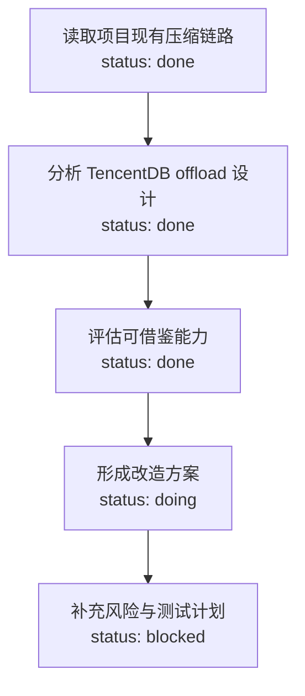

# TencentDB Agent Memory 方案借鉴可行性说明（通俗版）

> 日期：2026-05-24  
> 参考资料：`C:\Users\87624\Documents\介绍文档.pdf`、`C:\ai\TencentDB-Agent-Memory` 本地源码、CmbCoworkAgent 现有代码  
> 目标：说明 TencentDB Agent Memory 哪些思想值得借鉴，能给本项目带来什么收益，以及建议怎么改造。

---

## 1. 一句话结论

**可以借鉴，但不建议整套照搬。**

TencentDB Agent Memory 最值得我们学习的，不是“再加一套压缩系统”，而是它把长任务变成了一个可恢复、可查看、可继续推进的“任务工作台”：

- 原始的大内容放到外部保存，不让它一直挤占模型上下文。
- 上下文里只保留高度压缩的关键信息。
- 用 Mermaid 图把任务步骤、当前进度、关键节点关系画出来。
- 需要细节时，再从外部记录里按节点找回原文。

本项目现在已经有比较完整的上下文压缩链路，所以不需要把 TencentDB 的整套 offload 系统搬进来。更合适的路线是：

**第一期只做“任务画布 task-mmd”加轻量工具轨迹记录，让 Agent 在长任务中始终知道自己做到哪一步。**

---

## 2. 这篇文章到底解决了什么问题？

长任务里，Agent 会不断读文件、跑命令、查资料、修改代码、分析结果。每一步都会产生大量上下文。

当上下文越来越长时，会出现三个问题：

1. **成本变高**  
   每次模型调用都带着越来越多的历史内容，token 消耗持续上涨。

2. **模型容易迷路**  
   历史太长以后，模型不一定能准确抓住“当前任务已经做到哪一步、下一步该做什么”。

3. **压缩后容易丢结构**  
   普通总结能减少 token，但总结往往是一段文字。它能说明发生过什么，却不一定能清楚表达步骤之间的关系、哪些已完成、哪些还阻塞。

文章的核心思路可以用一句话概括：

**不是让所有信息都留在上下文里，而是把上下文变成一个索引和任务地图。**

完整内容可以放在外部；上下文只留下模型当前推理最需要的结构化信息。

---

## 3. TencentDB Agent Memory 的核心做法

### 3.1 上下文卸载：把大内容移出上下文

文章里把这种做法叫做 context offloading。它的意思不是简单删除历史，而是：

- 原始工具结果、网页内容、文件内容等，保存到外部文件。
- 上下文里只保留一小段摘要、引用路径、节点编号。
- 如果后面真的需要细节，再按引用找回。

这有点像项目文档管理：  
我们不会把所有原始材料都贴在会议纪要里，而是在纪要里写“结论、出处、下一步”，需要时再打开原始材料。

### 3.2 Mermaid 无限画布：让 Agent 看见任务结构

普通总结是一段文字，适合“回顾发生了什么”。  
Mermaid 任务图更像一张路线图，适合回答：

- 这个任务被拆成了哪几步？
- 哪些步骤已经完成？
- 当前卡在哪里？
- 哪些文件、工具调用、验证结果和这个节点有关？
- 下一步应该沿哪条线继续？

文章里的重点不是“画图好看”，而是 Mermaid 这种格式同时具备几件事：

- **省 token**：几行图语法就能表达很多步骤关系。
- **可读**：人可以在 UI 里看成流程图。
- **模型能理解**：模型可以直接读 Mermaid 文本。
- **可更新**：每做几步就增量更新，不用等到上下文快爆了才总结。

### 3.3 分层记忆：不同信息放在不同地方

从源码看，TencentDB Agent Memory 大致把信息分成几层：

| 信息 | 放在哪里 | 作用 |
|---|---|---|
| 原始工具结果 | `refs/*.md` | 保留证据和可回查原文 |
| 工具调用摘要 | `offload-*.jsonl` | 记录每次工具调用做了什么 |
| 任务图 | `mmds/*.mmd` | 保留任务结构和进度 |
| 元数据 | state / metadata | 记录当前活跃任务、节点编号、边界等 |

这种设计的好处是：  
**上下文里不必背着所有原文，但 Agent 仍然知道哪些资料存在、怎么找回、当前任务处于什么状态。**

---

## 4. 文章里给出的效果

文章给出的实验结论可以概括为两类收益：

1. **Token 明显下降**
   - WideSearch 任务中，最高节省约 61% token。
   - SWEBench 代码修复任务中，节省约 31%-33% token。
   - AA-LCR 长文档分析任务中，总 token 节省约 31%。

2. **长任务成功率提升**
   - WideSearch 通过率相对提升约 51.52%。
   - SWEBench 完成率从 58.4% 提升到约 61.8%-64.2%。
   - Toolathon 复杂长任务通过率从 20% 提升到 30%-35%。

需要注意：这些数字来自文章中的实验场景，不能直接等同于本项目的收益。但它说明一个方向是成立的：

**在长任务、长网页、长文档、多工具调用场景里，单纯扩上下文不一定最划算；把上下文组织成“外部资料 + 任务地图”更有效。**

---

## 5. 本项目当前已经有什么

CmbCoworkAgent 不是空白状态。我们已经有一套上下文压缩能力：

| 层级 | 当前能力 | 作用 |
|---|---|---|
| L1 | `read_file` 行数和字符裁剪 | 防止一次读文件塞爆上下文 |
| L2 | 大工具结果 evict 到 DeepAgents filesystem | 非文件类大输出自动变成引用 |
| L3 | 历史 tool args 截断 | 避免旧参数长期占上下文 |
| L4 | `summarizationMiddleware` | 上下文长了以后自动生成续作总结 |
| L5 | routing guard | 上下文压力大时切到更大窗口模型 |

所以，TencentDB 里的很多压缩机制，本项目已经有等价能力或近似能力。

真正缺的是：

**压缩以后，任务结构感不够强。**

现在的总结更像一段交接说明；它能告诉 Agent “之前做过什么”，但不一定能稳定告诉 Agent：

- 当前任务树是什么样；
- 哪些分支已经完成；
- 哪些节点被验证过；
- 哪些节点还有阻塞；
- 后续如果要回查，应该从哪个节点找。

这正是 Mermaid 任务画布可以补上的地方。

---

## 6. 哪些能力值得借鉴

### 6.1 强烈建议借鉴：任务画布 task-mmd

建议做一个轻量模块，持续记录当前线程里的工具调用和任务进度，然后生成一张 Mermaid 图。

示例：



它能带来的好处：

- Agent 更不容易忘记当前做到哪一步。
- 用户能在 UI 中看到任务进展，而不是翻几十轮聊天记录。
- summarization 触发以后，任务结构仍然保留。
- 后续可以按节点做回查和审计。

### 6.2 建议借鉴：轻量工具轨迹日志

每次工具调用后，记录一条小日志：

```json
{
  "tool_call_id": "call_xxx",
  "tool_name": "read_file",
  "args_preview": "src/main/agent/runtime.ts",
  "result_summary": "读取 runtime 中 summarization middleware 的挂载位置",
  "scope": "main",
  "timestamp": "2026-05-24T00:00:00+08:00"
}
```

注意，这里不建议保存完整工具结果。原因是：

- 本项目已有 DeepAgents 虚拟 filesystem 保存大结果。
- 完整结果可能包含敏感信息。
- task-mmd 只需要足够生成任务图的摘要。

### 6.3 可以作为二期：node_id 回查

等 task-mmd 跑稳后，可以给每个任务图节点绑定 `node_id`，让 Agent 或用户按节点查看相关工具调用。

例如：

- 点击 Mermaid 节点，看到对应工具调用列表。
- Agent 需要细节时，用 `task_mmd_read_entry(node_id)` 找回摘要或引用。
- 如果工具结果已经被 DeepAgents evict，再通过已有虚拟文件路径读取。

这会让压缩从“不可逆总结”变成“可回查索引”。

### 6.4 暂不建议借鉴：整套 L1/L2/L3 压缩链

TencentDB 的 mild / aggressive / emergency 三档压缩、score-cascade 等设计很完整，但本项目已经有 summarization、tool evict、args 截断、routing guard。

如果整套移植，会带来几个问题：

- 和现有压缩逻辑重复。
- 增加额外 LLM 调用成本。
- 改动范围大，风险高。
- 多套压缩同时修改消息，调试困难。

因此，第一期不要平推整套 offload。

---

## 7. 会给 CmbCoworkAgent 带来什么好处

### 7.1 长任务更稳

长任务最怕“做到一半忘了前面为什么这么做”。  
任务画布能持续保留路线图，让 Agent 在 summarization 之后仍然知道：

- 已经搜索过哪些方向；
- 哪些文件改过；
- 哪些测试跑过；
- 哪些结论已经确定；
- 哪些问题还没解决。

### 7.2 用户体验更直观

用户不用在聊天记录里翻进度，可以直接看到一张当前任务图。

适合展示：

- 当前任务状态；
- 已完成步骤；
- 正在进行的分支；
- 阻塞点；
- 关键文件和工具调用。

这对复杂代码改造、长时间排障、跨天续作都很有价值。

### 7.3 更少重复工作

如果 Agent 忘记自己已经读过哪些文件、查过哪些资料，就容易重复搜索、重复读文件、重复跑命令。

task-mmd 能减少这种重复，因为它把“已经做过什么”压成了一张稳定的任务地图。

### 7.4 为后续“可回查记忆”打基础

第一期只做任务图，后续可以自然扩展出：

- 节点回查；
- 工具调用审计；
- 长任务恢复；
- 用户手动标记关键节点；
- 多任务线程切分。

这比一开始就做完整长期记忆系统更稳。

---

## 8. 推荐改造方案

### 8.1 总体原则

改造原则是：

1. **不替换现有压缩链路**  
   继续使用现有 `read_file` 裁剪、tool evict、summarization、routing guard。

2. **只在上面加一层任务结构**  
   task-mmd 是补充层，不接管 message 压缩。

3. **默认关闭，灰度启用**  
   初期通过设置开关打开，避免影响所有会话。

4. **不保存完整敏感结果**  
   只保存摘要、路径、节点关系。必要时再读取已有外部引用。

### 8.2 新增模块

建议新增目录：

```text
src/main/agent/task-mmd/
  types.ts
  storage.ts
  sanitizer.ts
  recorder.ts
  compiler.ts
  prompts.ts
  middleware.ts
```

职责如下：

| 文件 | 职责 |
|---|---|
| `types.ts` | 定义工具调用记录、MMD 状态、配置 |
| `storage.ts` | 读写 `~/.cmbcoworkagent/task-mmd/<threadId>/` |
| `sanitizer.ts` | 对 token、password、Authorization、`.env` 等做脱敏 |
| `recorder.ts` | 记录工具调用摘要 |
| `compiler.ts` | 把多条工具调用摘要编译成 Mermaid |
| `prompts.ts` | MMD 生成提示词 |
| `middleware.ts` | 挂到 agent 中间件，记录工具调用并注入任务图 |

### 8.3 数据存放

建议每个线程一个目录：

```text
~/.cmbcoworkagent/task-mmd/
  <threadId>/
    entries.jsonl
    active.mmd
    state.json
```

含义：

- `entries.jsonl`：轻量工具调用记录。
- `active.mmd`：当前活跃任务图。
- `state.json`：编译时间、记录数量、是否用户编辑过等状态。

### 8.4 中间件接入

需要同时接入 main agent 和 subagent。

原因是：  
如果只在 main agent 记录，我们只能看到一次 `task` 工具调用和最终结果，看不到 subagent 内部实际做了哪些读文件、跑命令、改文件动作。

推荐接入方式：

- `wrapToolCall`：工具调用后记录摘要。
- `wrapModelCall`：模型调用前临时注入当前 MMD。

这里要特别注意：  
**不要用 `beforeModel` 返回追加后的 messages。**

在 LangChain 里，`beforeModel` 返回的 `messages` 会进入 graph state/checkpoint，可能污染真实聊天历史。  
MMD 应该只作为本次模型请求的临时上下文，所以更适合用 `wrapModelCall`。

### 8.5 MMD 编译策略

建议参考 TencentDB 默认思路：

- 累积 4 条新工具记录后触发一次编译；
- 或者距离上次编译超过 300 秒后触发；
- 编译模型走 economy 档；
- 每次只取最近一批记录和已有 MMD 做增量更新；
- MMD 长度控制在上下文的一小部分，避免喧宾夺主。

### 8.6 UI 展示

第一期可以先放在 Customize 里的一个新 Tab：

- 当前线程任务图；
- 最近工具节点；
- 编译状态；
- 清空当前任务图；
- 导出 `.mmd`。

更理想的二期形态是放到聊天侧边栏，因为 task-mmd 是线程状态，不是纯全局设置。

---

## 9. 改造分期

### 第一期：任务画布 MVP

目标：证明 task-mmd 对长任务有帮助。

范围：

- 记录工具调用摘要。
- 生成 Mermaid 任务图。
- 在模型调用时临时注入任务图。
- UI 展示当前线程任务图。
- 默认关闭，通过设置开启。

预计工作量：约 4.5 人日。

交付：

- `src/main/agent/task-mmd/*`
- `src/main/ipc/task-mmd.ts`
- Customize 新增 Task MMD 页面
- routing 增加 `taskSource: "task_mmd"`
- 基础单测和一轮真实长任务验证

### 第二期：节点回查

目标：让图不只是展示，还能成为“索引”。

范围：

- MMD 节点绑定 `node_id`。
- 节点关联工具调用摘要。
- UI 点击节点查看工具记录。
- Agent 可通过工具读取节点详情。

预计工作量：约 1-2 人日。

### 第三期：任务边界和高级压缩

目标：处理一个 thread 里多个任务混在一起的问题。

范围：

- 判断新任务还是续作。
- 支持多个 active MMD。
- 引入轻量 L1.5 任务边界判断。
- 视效果评估 score-cascade。

预计工作量：约 2-4 人日。

---

## 10. 不建议第一期做什么

### 10.1 不建议整套搬 TencentDB offload

原因：

- 本项目已有压缩链路。
- 重复压缩会增加复杂度。
- 大量改动 message state 风险高。
- 收益不如先补任务结构明显。

### 10.2 不建议把完整工具结果再存一遍

原因：

- 可能重复占磁盘。
- 可能二次保存敏感内容。
- 本项目已有 DeepAgents 虚拟 filesystem 承载大结果。

第一期只存摘要、引用、节点关系即可。

### 10.3 不建议默认开启

初期应默认关闭，适合以下场景手动启用：

- 大型代码改造；
- 多文件排障；
- 长网页/长文档分析；
- 需要跨天续作的任务；
- 需要向用户展示任务进度的任务。

普通短问答不一定需要 task-mmd。

---

## 11. 风险和缓解

| 风险 | 影响 | 缓解 |
|---|---|---|
| MMD 生成不准确 | 误导 Agent | 只作为辅助上下文，不替代真实历史；保留清空和重新生成 |
| 增加 LLM 调用成本 | 成本上升 | economy 模型、批量触发、默认关闭 |
| 注入污染历史 | 聊天 state 变脏 | 使用 `wrapModelCall` 临时注入，不用 `beforeModel` 写回 messages |
| subagent 轨迹缺失 | 任务图不完整 | main agent 和 subagent 都挂 middleware |
| 敏感信息落盘 | 安全风险 | sanitizer 脱敏，只保存 bounded excerpt |
| 并发工具调用写坏文件 | 数据损坏 | thread 级 append lock / compile lock，temp file + rename |
| 一个 thread 多个任务混杂 | 图变乱 | 第一期提供手动清空，二期加任务边界判断 |

---

## 12. 需要修改的主要文件

| 位置 | 改动 |
|---|---|
| `src/main/agent/runtime.ts` | 挂载 task-mmd middleware，main/subagent 都接入 |
| `src/main/agent/task-mmd/*` | 新增核心模块 |
| `src/main/routing/index.ts` | 增加 `taskSource: "task_mmd"`，走 economy |
| `src/main/agent/trace/types.ts` | 同步 routing trace 类型 |
| `src/main/ipc/task-mmd.ts` | 新增 UI 读写接口 |
| `src/main/ipc/threads.ts` | 删除线程时清理 task-mmd 目录 |
| `src/renderer/src/components/customize/CustomizeView.tsx` | 新增 Task MMD Tab |
| `package.json` | 增加 `mermaid` 渲染依赖 |

---

## 13. 验收标准

第一期可以用下面标准验收：

1. 开关关闭时，对现有聊天和工具调用没有影响。
2. 开关开启后，工具调用会生成 `entries.jsonl`。
3. 累积几次工具调用后，会生成 `active.mmd`。
4. 模型调用时能看到 MMD，但 MMD 不进入持久化 messages。
5. UI 能渲染当前线程任务图。
6. 删除线程时，对应 task-mmd 目录被清理。
7. 敏感字段被脱敏，不会原样写入本地文件。
8. 长任务测试中，Agent 能更稳定地说明当前进度和下一步。

---

## 14. 最终建议

建议立项，但按“小步快跑”做：

**第一期只做 task-mmd，不搬整套 offload。**

原因很简单：

- 本项目已经有上下文压缩，不缺“再压一遍”。
- 本项目缺的是长任务里的结构感、进度感和可恢复性。
- Mermaid 任务画布正好补这个缺口。
- 改造范围可控，默认关闭，失败也容易回滚。
- 一旦跑通，可以自然演进到节点回查、任务边界、多任务恢复。

用一句通俗的话总结：

**现有压缩能帮 Agent 少背东西；task-mmd 能帮 Agent 记住自己在干什么。**

