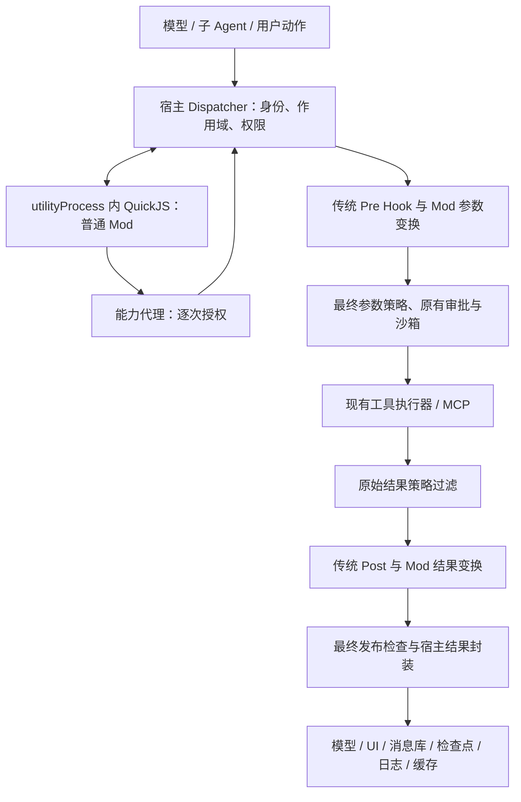

# CMB Mods v1 最终实现方案与复核

日期：2026-09-16。工程基线：`18e2ea88a21d0ed745a523307ff083579aba94df`。

方案形成时状态：架构与边界已确定，生产功能尚未接入。随后已在 `codex/mods-v1` 实现默认关闭的核心机制。**实际交付范围、未完成项和验证结果以 [Mods 核心实现与验收记录](mods-v1-delivery-2026-09-16.md) 为准**。下文保留完整设计和发布目标，不代表每一项目标均已交付。

## 1. 最终决策

实现本工程自己的 `cmb.mods/v1` 协议：**统一工具调度入口 + 宿主持有权限与执行事实 + 独立进程中的 QuickJS 插件环境 + 受控结果发布 + 声明式 UI**。

保留现有 Electron、Agent、LangGraph、MCP、传统 Hooks、审批和本地执行器。新增扩展层，把分散在工具适配、提示词和 React 中的场景增强组织到一个插件包中。借鉴 Claude 的机制和实测行为，独立编写实现；不引入恢复出的专有代码，也不承诺兼容任意 Claude Mod。

第一版必须完整覆盖工具调用、项目上下文、命令和结果卡片。隔离、权限、取消、故障处理、发布检查属于上线前置条件，不能先开放第三方执行再补。

**当前不存在阻止选型的待决问题。** 剩余问题均转为明确实现工作和发布门槛；未通过门槛就维持功能关闭，不能以“方案完成”替代验收。

## 2. 用户最终能看到什么

| 用户操作/场景 | 完成后的行为 | 明确边界 |
| --- | --- | --- |
| 安装并在项目中启用 Mod | 插件页显示接口版本、代码摘要、申请权限、作用范围和运行状态；确认权限后生效 | 安装本身不授予执行权；不同项目分别授权 |
| 工具结果脱敏 | 模型、聊天、工具详情、持久化、审计和 MCP 示例缓存使用经过检查的结果；卡片显示规则与处理数量 | 不能撤回工具此前已外发的数据；这不是对整台电脑的全面 DLP |
| 研发规范助手 | 工具执行前检查目标与参数，执行后展示检查结果；用户点击“运行验证”发起受控命令 | 仍经过当前只读限制、工作区隔离和审批；检查失败不能冒充已撤销写入 |
| 项目/技能场景增强 | 经授权的 Mod 补充有限的项目上下文、包裹指定工具并显示结果卡片 | 只能使用宿主开放的能力；不会自动提高模型推理能力 |
| 插件更新或故障 | 更新在安全切换点生效；失败显示所属插件及原因；不能因插件崩溃重复提交工具操作 | 必需策略不可用时阻止受影响操作；可选展示失败允许降级 |
| 历史会话与审计 | 显示执行来源、参数变化摘要、结果状态、策略版本与 Mod 版本；旧卡片仍可读 | 历史动作默认失效；敏感原文不进入插件诊断日志 |

交付两个必需示范包：`company-output-policy`（受管输出规则与处理卡片）和 `project-quality`（项目规范上下文、工具前置检查、验证按钮）。知识库引用卡片可以用同一协议开发，但不是第一版上线依赖。

普通模式保留现有后台输出体验；启用严格输出策略时，尚未完成安全检查的后台任务只显示状态/耗时，完整结果通过检查后展示。这是明确的产品行为。

## 3. 从还原与实测中得到的约束

分析对象为本机 Claude Code **2.1.272**，不是所有未来版本。还原范围为 PE/Bun 内嵌 JavaScript、压缩资源、声明和测试工具包；没有恢复原始 TypeScript 仓库或反编译 Bun 的原生机器码。

| 发现 | 证据 | 本工程决策 |
| --- | --- | --- |
| 模块通过隔离环境和宿主消息通道调用能力 | [Worker/宿主入口](../output/claude-code-2.1.272-analysis/formatted/chunk-pada1xhk.js)、[模块加载与调度](../output/claude-code-2.1.272-analysis/formatted/chunk-5b87cxfe.js) | 插件不能获得 Node、Electron、凭据或执行器引用 |
| 能力撤销在宿主再次检查；旧引用不能自然绕过 | 宿主文件约 209355、209388 行，崩溃约束约 210765 行 | 每次能力请求、最终执行和发布都核对权限代次 |
| 两次 next 会执行下层两次 | 本轮真实 `claude plugin test` 用例通过 | v1 对所有事件均最多一次 next；缓存成功短路及自动重入不开放 |
| 普通 Hook 在 next 前抛异常可以失败放行 | 本轮用例通过 | 本工程工具变换 Hook 在执行前失败，结束当前调用；强制策略更不能放行 |
| next 后 Hook 抛异常不会自动重放下层 | 本轮用例通过 | 保留宿主执行事实和安全结果；插件失败不能触发再次执行 |
| .catch 可拒绝，直接返回可跳过下层 | 本轮用例通过 | v1 支持显式拒绝；不能凭空返回“写入成功” |
| 追踪、来源、预算和取消是协议的一部分 | 声明及测试；预算代码约 3047、3080 行 | 身份由宿主生成；等待 next/审批不消耗插件自身执行预算 |
| 当前实现有多层次、流式事件、自定义能力表等复杂性 | [恢复的类型声明](../output/claude-code-2.1.272-analysis/readable/claude-code.d.ts) | v1 不开放 engine.create、next.to、模型循环重写和任意 React 组件 |

8 项动态测试只覆盖 `command.run` 的测试环境组合、失败和来源，不据此声称 Claude 所有事件、UI、企业策略和取消都已验证。其官方 [Mods 说明](https://raw.githubusercontent.com/anthropics/claude-code/main/mods/README.md) 仍标记早期接口，采用独立版本协议可避免跟随内部 API 变化。

## 4. 架构与一次调用的完整顺序

1. 宿主解析规范工具 ID、provider、参数模式、工具副作用分类和调用身份。先做调用准入，限制插件可以看到的数据和工具范围。
2. 固定本次调用的链快照。普通 Mod 按显式顺序进入；最内层运行原有 PreToolUse。所有参数变化归一后，再进入最终策略和现有原生检查/审批。
3. Mod 只能修改同一工具的参数，不能改 toolCallId、provider、调用者或工作区。需要调用另一能力时发起新的子调用。
4. 在执行器真正启动前写入持久执行记录。执行器收到的参数必须与授权绑定的最终参数一致。
5. 原始结果只进入宿主的私有结果适配器和受管输出策略；普通 Mod 与传统 Post 先看到已处理的结果。受管输出策略也在隔离环境运行，但由宿主固定调度，不能被普通链绕过。
6. 传统 Post 返回后，Mod 按逆序处理结果。宿主再做一次最终发布检查，防止新增文本、附件或反馈绕过规则。
7. 发布唯一的规范结果，再投影到各消费方。宿主单独保留不可改写的实际执行状态；错误不能被插件改成成功。

强制策略不属于普通 `next` 链，拒绝路径、插件异常和短路输出仍经过发布检查。Graph/LangChain 内部对象留在宿主，不跨插件边界。

### 4.1 不遗漏、不重复的接入

不能仅在通用 `wrapToolCall` 外再包一层：当前 [runtime.ts](../src/main/agent/runtime.ts) 的 `toolHookExclusions`（约 5731 行）明确排除本地工具、task_output、MCP 等路径。

| 路径 | 具体改造 |
| --- | --- |
| 普通 LangChain 工具 | 通用适配器进入 Dispatcher；保留 ToolMessage 的 tool_call_id、name、status 和宿主 metadata |
| 文件 / Shell / LocalSandbox | 在后端实际能力入口接入；原有最终命令、cwd、只读和 worktree 检查继续运行 |
| MCP eager / deferred | 都解析为同一规范能力，再统一 dispatch；查询目录与真正 invoke 分别建模 |
| CodeExec 内部调用 MCP | 每个内部调用走能力代理，获得子调用身份；外层 code_exec 与内部实际调用各记一次 |
| 主 Agent / 子 Agent | 复用同一入口，身份包含真实 agentId、父调用、工作区和权限交集 |
| 后台任务 / task_output | 启动任务、读取状态与最终结果分别建模；读取前校验任务归属，不能仅信任 task_id |
| 用户点击卡片执行 | 宿主校验交互句柄，然后进入现有线程队列和同一能力入口 |

通用包装器与底层适配器之间使用宿主创建的一次性 `routePermit`，绑定 callId、规范目标、预期适配器和版本，仅用于证明同一次调用已经进入调度。它不是插件参数，也不是全局 `skipHooks`。新的嵌套调用必须产生新身份。直达底层但没有 permit 的路径必须主动 dispatch 或拒绝，不能默默绕过。

MCP 自动选择浏览器或失败后回退到另一工具，同样视作单独能力调用并重新授权；不能借用原目标的批准。未识别工具不能走未经检查的“原样转发”后门。

### 4.2 调用顺序与作用域

- 默认：按已批准的项目安装顺序、Mod ID、注册顺序稳定排序；同级 `before/after` 只允许引用同一项目的已知 Mod，拓扑环使候选版本加载失败。普通 Mod 不能用数字优先级挤入宿主策略层。
- 一个 turn 固定代码摘要、注册表和排序快照。技能激活可以改变下一次调用的启用集合，但只能激活该快照中事先批准的 Mod，不能在执行途中装入新代码。
- 子 Agent 使用自己的 agentId 和插件运行环境，继承权限上限；允许收窄，不允许增加父调用未授予的能力。
- 传统 Hook 原有次序保持；但输出保护启用后，Post 和诊断日志只能获得安全投影，这是有意的兼容性变化，须写进发布说明。

事件和 next 传入值中的身份字段只读且由宿主校验，不接受插件构造的新 origin。每个 invocation 的 `$`、next、结果凭据和回调都绑定独立宿主调用记录；不能从同一 runtime 的并发调用借用另一调用的权限。第一版按精确工具 ID 匹配，不开放按任意参数执行的动态匹配函数。

## 5. 第一版接口与语义

评审用类型契约见 [mods-v1-contract.ts](./mods-v1-contract.ts)。它不导入生产工程，不是运行时实现；类型检查不能替代宿主运行时校验。

| 扩展点 | 输入与允许操作 | 禁止事项 |
| --- | --- | --- |
| `tool.call` | 指定工具的已授权输入；修改 args 后 next；处理安全结果；执行前显式拒绝 | 多次 next、换目标、伪造成功、改写执行状态、读取原始结果 |
| `prompt.context` | 提交有来源、长度限制的项目补充上下文；结果按宿主槽位组合 | 覆盖系统安全指令、传入宿主内部对象、无界增长 |
| `command.run` | 执行 Mod 命名空间下的命令；通过能力代理申请工具 | 接管任意内置命令、直接执行 Node/Shell、直接决定审批 |
| `ui.render` | 对宿主提供的安全模型返回声明式描述树 | 原生 React 函数、JS/HTML 注入、任意网络资源和有副作用的渲染 |
| 受管输入/输出策略 | 纯函数校验参数或过滤完整结果；失败阻断 | 普通插件自行声明为受管、通过 next 跳过、在策略里调用工具 |

宿主提供 `$.tools.invoke`、允许字段的 `$.context.get`、隔离的 `$.store` 和结构化日志。`ui.render` 不提供这些 I/O 能力；受管策略使用独立的纯函数接口。

工具 Hook 中嵌套调用第一版只允许宿主认定的只读能力；写操作从明确的用户命令或卡片动作发起，再走权限和审批。MCP 的自报 `readOnlyHint` 不是可信分类依据；未知能力按有副作用处理。

### 5.1 next、失败和执行事实

- 所有事件的 next 最多一次。第二次调用立即报协议错误；第一次已开始的执行不会因此重新启动。
- 工具 next 返回宿主签发、与当前调用/代次绑定的结果凭据及安全投影。Mod 只能提交该凭据和新的投影。凭据没有执行权限，不能跨调用复用。
- 第一版工具短路只允许“拒绝”。缓存命中式成功、模拟工具成功与通用重试 API 延至后续版本，避免第一版出现第二套结果真实性规则。
- 工具 Hook 在 next 前异常或超时：当前工具不启动，显示插件错误。在 next 后异常：保留真实执行结果，发布通过策略的基础投影和诊断信息，不能重放工具。
- 调用 next 后提前返回且未等待：视为协议错误，宿主等待执行结算或请求取消；已发生的副作用保持记录。不能把 Promise 丢弃视为下游从未执行。
- 宿主内部 GraphBubbleUp、审批暂停、HookHalt、取消等控制信号继续走原控制流，不能经插件转换成普通成功/可重试工具错误。
- `next.signal` 是插件环境内的取消信号代理，响应取消、预算到期和撤销。正常完成后的清理使用 `finally`，卸载清理使用独立生命周期；不依赖正常完成一定触发 abort。
- 可选上下文/卡片提供者失败可省略其补充内容，展示诊断；必需输入或输出策略失败必须阻断对应步骤。

### 5.2 防重复、重试与取消

持久记录键至少包含 `threadBranchId + turnId + toolCallId`；记录规范能力、最终参数摘要、授权/策略代次、调用来源、启动与结算状态。分支、重新生成和人工重新提交使用新的明确身份。

使用独立 `mods-control.sqlite` 保存执行记录、授权及版本，以唯一约束和事务 CAS 领取启动权；主进程持有控制权，插件进程不能访问。相同键但目标或参数摘要不同直接拒绝，不能把旧批准用于新意图。

本次复核发现 [native-sqlite-adapter.ts](../src/main/db/native-sqlite-adapter.ts) 默认 `WAL + synchronous=NORMAL`。该设置对应用进程崩溃与系统断电的持久性保证不同，见 [SQLite 官方说明](https://www.sqlite.org/pragma.html#pragma_synchronous)。控制库必须独立使用 `WAL + synchronous=FULL`，确认事务提交成功后才执行；I/O 错误、锁超时、库损坏都阻止启动。不能直接复用吞掉 flush 错误的路径，也不能自动回退旧备份后继续执行。迁移失败或控制库缺失但已有部署记录时进入恢复检查状态。持久性仍以操作系统和存储正确实现同步写为前提。

执行前先持久化 `running`。只有确定未交付执行器的失败可标记 `not_started`；崩溃恢复发现未结算记录一律 `unknown`，不自动重放。可以重用已发布且权限/策略仍适用的结果；需要升级过滤规则时先重新检查，不能直接回放旧原文。

这提供本地同一逻辑调用的防重复启动能力，**不声称外部系统 exactly-once**。网络断开时远端可能已经完成。未知结果显示“执行结果未确认”，由查询型能力对账或用户明确发起新操作。

当前 [MCP 调用服务](../src/main/mcp/capability-service.ts) 的 `invokeToolWithRetry` 对部分连接错误默认再调用一次，不区分副作用，必须修改：未知/写能力取消通用自动重试；只对宿主明确登记为无副作用，或提供有效幂等键与协议保证的能力配置有限重试。适配器不能依靠错误字符串推断未执行。

MCP 调用接口增加 signal、callId、deadline 和宿主幂等元数据，底层支持则传递取消，不支持则只停止本地等待并保留 `unknown`。Shell 保持 `task.completed` 与进程树 `task.settled` 的区别：取消已请求不代表进程已经停止。

### 5.3 与现有审批的精确衔接

当前 [ApprovalStore](../src/main/agent/approval-store.ts) 按命令、cwd、sandboxMode 缓存，并支持永久命令模式。Mods 不得直接共享这个批准作为插件授权：新授权上下文增加规范工具/provider、最终参数摘要、实际 shell/工作区、调用者 Mod 摘要、grantEpoch 和 policyEpoch。保留现有普通用户操作的审批体验，但未明确涵盖插件来源的永久规则不能自动批准插件写入。

审批等待返回后再次核对权限、参数及真实路径边界，操作执行前不能继续修改参数；文件目标采用执行时的安全路径解析，防止等待期间链接变化。复用 [ApprovalDecisionBroker](../src/main/agent/approval-decision-broker.ts) 的请求归属、tool_call_id 校验和一次性消费，不让插件获得决定接口。主 Agent、子 Agent、桌面和 IM 的批准都落到同一授权记录。

## 6. 权限、代码信任与运行时

### 6.1 插件包与授权

复用现有插件目录，在根插件 manifest 新增可选字段 `"mods": "mods/manifest.json"`。Mods 清单要求 `apiVersion: "cmb.mods/v1"`、entry、事件/目标声明、权限、激活范围及可选顺序约束。每个 Mod 一个入口，可以导入包内模块。

现有 [manifest 校验](../src/main/plugins/manifest.ts) 只保留已知字段；[插件 IPC](../src/main/ipc/plugins.ts) 只按传统 hooks 计数。必须同步修改校验、安装、更新、导入导出、详情类型和 UI，否则配置看似存在但不会生效。

`hooks.json.modules` 只作为迁移检测信号：识别后提示接口版本；缺少 CMB 清单、版本不支持或需要 Claude 专用接口时显示“不兼容”，不自动作为 command 执行，也不隐式授予权限。

生效权限始终取交集：**清单声明 ∩ 用户对本代码摘要/项目的授权 ∩ 宿主策略 ∩ 线程模式 ∩ 调用链权限**。仅静态扫描或 TypeScript 类型检查不产生授权。

模块构建只接受插件根内的相对导入及锁定的包内依赖；不运行 npm install、生命周期脚本或构建插件，不允许网络导入、Node 内置模块及外部动态导入。TypeScript 由受控构建器编译，运行时仅加载生成的 JS。

对源文件、全部传递依赖、manifest、接口版本、构建选项和编译器版本计算摘要。构建时校验真实路径和符号链接/Windows junction，复制到不可变的内容寻址快照；授权的是即将执行的快照，不能一边校验源文件一边执行仍可改写的源文件。拒绝路径穿越、大小写别名绕过、ADS 和越界文件。授权后代码变更必须产生新候选与授权流程。

现有 [workspace Hook 信任](../src/main/storage.ts) 针对配置文件摘要，不足以覆盖模块依赖，需独立保存 Mods 授权记录。普通用户可安装的包不能通过 `managed: true` 升格：受管规则来自应用固定摘要，或由预置可信公钥校验的组织签名与受保护部署配置。能替换整个应用的本机管理员不在插件隔离威胁模型内。

混合插件中的传统 Shell Hook、MCP 服务依然使用各自已有执行权限；不能把“Mods 已隔离”表述成整个插件包都被沙箱限制。权限界面必须分别展示。

### 6.2 运行时选型及已验证范围

采用 **quickjs-emscripten 0.32.0 的普通同步 WASM 版本，置于 Electron utilityProcess**。通过 guest Promise + 有限 job pump 实现异步 next，不依赖 Asyncify。使用独立进程负责故障隔离，QuickJS 中的能力代理负责插件边界。

依据：[QuickJS 维护方文档](https://github.com/justjake/quickjs-emscripten)、[Electron utilityProcess](https://www.electronjs.org/docs/latest/api/utility-process)、[parentPort](https://www.electronjs.org/docs/latest/api/parent-port)。Node 官方明确说明 [node:vm 不提供安全机制](https://nodejs.org/api/vm.html)，因此不把 VM context 当作本工程第三方代码安全边界。

宿主 helper 仍拥有 Node 权限，utilityProcess 本身不是完整 OS 沙箱。guest 不获得这些对象，只收到受限 JSON 和在 guest 内实现的 SDK。隔离效果依赖 QuickJS/WASM、序列化和能力代理正确实现；本轮没有证明不存在逃逸漏洞。

- 一个工作区与权限主体对应一个 utilityProcess；每个 `(thread, agent, modDigest)` 一个独立 QuickJSRuntime。强制策略使用独立的策略 utilityProcess，避免可选 Mod 故障同时拖垮规则。策略进程故障期间仍然拒绝受影响操作。
- helper 使用环境变量白名单，不继承凭据、模型配置或主进程 `process.env`。通过私有 MessagePort 通信，不复用现有 CodeExec helper 的环境继承或本地网络桥。
- 不向 guest 开放 process、require、Electron、fetch、Socket、任意文件系统或宿主对象。可见数据必须按当前事件与声明权限裁剪。
- 跨边界只传有界普通 JSON 和宿主校验的句柄。getter、Proxy、循环引用和原型污染必须在 guest 预算内处理；禁止对任意 guest 对象在宿主无界递归 dump。固定序列化内建引用、验证深度/字节数/字段类型，拒绝非有限数字和非法键。
- 每次 eval、回调、Promise job pump 和卸载都启用中断；限制每批 jobs，避免无限微任务链饿死心跳。QuickJS handle 必须确定性 dispose。

以下是待性能测试校准的初始限制，**不是已经测得的性能保证**：每 runtime 堆 16 MiB、栈 512 KiB；每批至多 32 个 jobs；单次连续 guest 执行 50 ms；每事件累计 guest CPU 500 ms、自身活动时间 5 s。等待合法 next/宿主审批暂停自身计时，但沿用线程取消与工具期限；宿主能力调用数量、输出字节和递归深度单独计费，不能用等待规避配额。

每工作区至多 16 个活跃 runtimes、32 个未完成能力请求；根调用深度 16、累计子能力调用 64；单次 JSON 1 MiB、深度 32，超大结果改为经策略处理的宿主产物引用。进程 RSS 384 MiB 作为监控/终止阈值而非操作系统硬隔离保证。链启动前预留其 runtime 配额；不能在占用下游等待状态时无限排队，容量不足明确失败。仅回收无在途调用和句柄的空闲环境。

父进程每 250 ms 检查心跳，连续 2 s 无响应终止故障进程并记录在途状态。生产计时受调度影响，须实测；不把阈值当作严格实时保证。恢复只重建环境，不重放工具调用。

### 6.3 打包与生命周期

在 electron-vite 增加 `mod-host` 入口，确定 CJS、QuickJS 依赖与 WASM 的打包位置；WASM 放入 asarUnpack，运行时使用实际资源路径。本轮已经在 ASAR 中运行通过，但仍需正式 electron-builder 安装包验证。

发现版本偏差：本机 Electron 为 **39.8.10 / Node 22.22.1**，package 的 electron 范围为 `^39.8.9`，builder 的 `electronVersion` 却为 `39.8.0`。实施时先把开发依赖、锁文件和打包版本统一到本轮测试的 39.8.10；后续升级作为单独验证变更。外部开发 Node 遵循 `.nvmrc` 的 22。

加载流程固定为：解析 → 受控构建/摘要 → 授权校验 → 无 I/O 注册 → 校验候选注册表 → 下个 turn 原子发布。模块顶层执行不能发起能力调用；加载失败保留仍可信的旧版本，显示候选错误。

撤销权限立即增加 grantEpoch；每次 RPC、最终执行、最终发布和 UI 动作重新检查。旧闭包、旧结果凭据和旧按钮不能绕过撤销。已启动的外部操作只能尽力取消，明确报告实际状态；输出在重新授权/策略检查前不再发布。

更新正常按 turn 切换；撤销是即时中断。可选 Mods 的功能开关可回滚，但组织必需策略不能因开关关闭、全局禁用 Hook 或策略进程崩溃而被移除。紧急解除组织策略需要独立、有审计的管理操作。

## 7. 结果发布：必须一次解决的工程缺口

新增宿主内部 `PublishedToolResult`，包含执行事实引用、已批准内容和产物、策略/权限代次及发布摘要。只有发布模块能构造它；TypeScript 品牌类型只是辅助，运行时还要核验。

| 当前入口/消费方 | 风险与必须修改的行为 |
| --- | --- |
| [capability-types.ts](../src/main/mcp/capability-types.ts) 的 raw/text/structuredContent/contentBlocks | 不能只改 text；所有模型和 UI 投影从同一批准内容生成，raw 不继续向外透传 |
| [capability-service.ts](../src/main/mcp/capability-service.ts) 约 269 行写工具示例 | 当前写入早于外层 Post；迁移到发布完成后，仅记录批准投影；原有字符串截断不是脱敏 |
| [langchain-tool.ts](../src/main/mcp/langchain-tool.ts) 的 start/end callbacks | 外层 middleware 处理前可能已交给回调；回调与外部 trace 都必须用允许的输入/输出摘要，不能成为旁路 |
| [tool-hooks.ts](../src/main/agent/tool-hooks.ts) 的 ToolMessage/Command | artifact、metadata、feedback 一并检查；只替换当前 tool_call_id 的消息，保留 Command 的 graph/resume/goto 和控制流 |
| [LocalSandbox](../src/main/agent/local-sandbox.ts) 后台 partialOutput | onData 先累积缓冲；task_output 可在进程完成前读取，不能只在最终工具完成时脱敏 |
| [runtime.ts](../src/main/agent/runtime.ts) task_output | 修改 task_id 后重新验归属；严格策略下未完成只返回安全状态，不发布未经完整检查的片段 |
| [stream-converter.ts](../src/main/agent/stream-converter.ts) / [agent IPC](../src/main/ipc/agent.ts) | tool-message、toolOutput、goalEvidence、恢复快照、检查点使用批准结果；不能先 emit 原文再覆盖 |
| [turn-trace-recorder.ts](../src/main/agent/trace/turn-trace-recorder.ts) / [Hook 日志](../src/main/hooks/log-record.ts) | 原始 stdin/stdout、异常栈、调试 console 不可另行持久化；日志只保留允许字段和处理摘要 |
| 大结果文件、附件、图片和下载链接 | 使用批准产物句柄；按类型检查或阻止，不支持的类型明确 suppressed，不能回退原始内容 |

输出策略先覆盖完整输入，再截断或落盘。超出可检查上限、丢失上下文的截断数据或不支持格式，严格模式禁止发布内容并显示原因。不能对截断片段跑一次正则就声称保证完整脱敏。

两次输出检查必须具有幂等约定：确定性替换、固定占位符、计数按宿主发布 ID 去重；第二次只会维持或收紧信息，不得还原数据。策略版本包含在发布记录中。

原始数据默认只在受限内存中短暂存在；不得新建明文诊断缓存。它不等于保证内存、系统崩溃转储或第三方 MCP 服务从未保存原文，也不覆盖用户自行在终端运行命令等工程之外路径。

## 8. 上下文、状态和 UI

`prompt.context` 只写入宿主预留的项目扩展槽，有来源标签和宿主 token/字符预算；不能替换系统指令或整个消息历史。固定在本次模型请求前执行，子 Agent 使用其自身作用域。受保护文本在进入模型前按该槽位规则检查。

`$.store` 按工作区、Mod ID、代码/状态模式版本隔离；需要线程私有数据时增加 threadId。使用事务、大小配额和键校验，写入内容也经过适用的数据策略；不能借状态库保存被过滤原文。跨版本迁移独立声明，候选迁移失败保持旧状态，不在工具副作用中顺便迁移。

v1 UI 插槽只开放 `tool.result.after` 和 `turn.summary`。组件为 text、card、table、code、badge、button、artifact-link；纯描述数据，长度、层级与节点数量有界。React renderer 负责安全渲染，禁用任意 HTML、脚本、远端自动加载资源及插件自带 React 代码。

button 描述引用本 Mod 已注册的 command；宿主签发一次性交互句柄，绑定 webContents、thread、turn、card/revision、Mod 摘要、权限代次、command 和参数摘要。用户点击后验证真实所属页面与线程，消费句柄、排队执行；请求产生写入仍经过审批。

插件既不能调用审批决定 API，也不能伪造 approvalId/点击来源。卡片中的“确认”文字不构成宿主批准。历史重放保存版本化描述树，动作默认禁用；需要再次操作时由当前可信版本重新生成。

## 9. 文件级实施顺序

下列是依赖顺序，不是互相独立的半成品上线。功能默认关闭，PR 6 验收后才逐步开放。

| 批次 | 新增/改造 | 完成条件 |
| --- | --- | --- |
| PR 0：契约与路径基线 | `src/shared/mods/`、事件与错误/结果 schema；列出工具入口、发布出口；补现有行为特征测试 | 本文所有路径都有负责的适配器/测试；身份、错误和预算契约固定 |
| PR 1：隔离运行时 | `src/main/mods/runtime/`、`mod-host`、消息代理、supervisor；electron-vite/package/lock/asar 配置 | 无限循环、微任务、内存、句柄回收、进程崩溃和安装包测试通过 |
| PR 2：包与授权 | `src/main/mods/loader/`、digest/grant 存储；manifest/types/plugins IPC/UI | 安装至卸载闭环；依赖篡改、junction、更新、撤销与失败回滚测试通过 |
| PR 3：统一调度 | `src/main/mods/dispatcher/`、FULL 同步控制库、ledger、tool/local/MCP adapters；runtime、LocalSandbox、ToolOrchestrator、审批绑定 | 主/子 Agent、eager/deferred/CodeExec 路径各执行一次；最终参数授权；未知写结果不重试 |
| PR 4：发布与策略 | `src/main/mods/publication/`、受管策略注册；MCP 示例、callbacks、ToolMessage、背景输出、stream/IPC/trace/持久化 | 使用同一敏感标记遍历所有出口，未批准原文不得出现；强制策略失败阻断 |
| PR 5：上下文与卡片 | prompt 槽位、store、commands、共享 UI schema、preload IPC、React ModSlot | 真实点击能执行批准命令；伪造、重放、跨线程、卸载后动作全部拒绝 |
| PR 6：真实场景和发布 | 两个示范包、测试 SDK、文档、迁移提示、诊断面板、功能开关 | 端到端、全量测试、性能和 Windows 正式安装包门槛全部通过 |

现有 `src/main/code-exec/runner.ts` 只借鉴能力桥思路，不能直接复用为第三方沙箱。新逻辑按职责拆分，避免继续把运行时所有行为堆进 `agent/runtime.ts`。

执行 ledger 与 grant 使用版本化存储迁移；添加后旧版本应用不能在不理解必需策略/未结算记录的情况下继续执行。卸载可选 Mod 保留最小审计记录，状态清理由单独操作处理；不通过删数据库“解决”恢复问题。

## 10. 严谨复核：风险、结论与验收

表中“已收敛”表示方案已经规定如何处理，**不表示生产实现已经验证**。

| 复核问题 | 方案结论 | 发布前必须通过的反例测试 |
| --- | --- | --- |
| 两次 next / 断线重试会否重复写？ | 单次 next + ledger + 禁止未知副作用重试，已收敛 | 同调用 ID 重入、网络完成后断线、崩溃恢复，写计数不得增加 |
| 执行记录“写成功”是否已经持久？ | 独立 FULL 同步控制库，提交失败不得启动 | 数据库 busy/I/O 错误、提交前后杀进程、损坏/旧备份恢复、相同 ID 不同参数 |
| 插件报错会否意外放行？ | 输入变换失败停止；强制策略失败阻断 | next 前抛错/超时；策略进程退出后再次调用 |
| next 后报错会否伪装未执行？ | 执行事实独立保存，禁止重放 | 写成功后 Hook throw，UI 必须仍显示已经执行及插件错误 |
| 修改参数能否复用旧审批？ | 最终参数摘要、目标、调用来源和代次绑定授权 | command/cwd/provider/task_id 修改后必须重核验 |
| 旧引用/旧卡片能否绕过撤销？ | 每个能力和交互入口核对 epoch | 在审批等待、RPC 排队、输出发布前撤销 |
| eager/deferred/CodeExec 会否漏/重复？ | 规范目标 + 单次 routePermit + 子调用身份 | 同一模拟能力从所有路径调用，实际执行/策略/日志次数一致 |
| task_output 能否读别人的任务？ | 最终 task_id 与线程/工作区授权联合检查 | 跨线程任务、Hook 替换任务 ID、已撤销作用域 |
| 只改 text 是否仍泄漏？ | 所有结果与产物统一发布 | text/structured/raw/artifact/metadata/示例缓存/trace 各植入不同标记 |
| 输出切片是否漏检？ | 严格模式完成检查前不发布 raw partial | 敏感词跨 stdout chunk、超时读取、截断边界、stderr 与最终快照 |
| Graph 与审批暂停会否被破坏？ | 控制信号不进入普通业务错误转换 | Command.goto/resume、GraphBubbleUp、HookHalt、AbortError、FailureFuse |
| 插件循环是否拖死应用？ | QuickJS 中断 + 有限 job pump + supervisor | 同步死循环、Promise 链、超量内存、巨大序列化、guest getter |
| 宿主对象/凭据会否进入插件？ | 无 ambient Node/网络；最小环境；纯数据代理 | process/require/import/prototype 探测、环境白名单、跨 Mod 句柄 |
| 多个 next 等待是否资源死锁？ | 链预留容量，有限递归，取消清理 | 达到 runtime/RPC 配额、递归调用与同时撤销 |
| 模块更新是否只信任旧清单？ | 传递依赖摘要 + 不可变快照 + 新授权 | 依赖文件替换、symlink/junction、加载期间更新、候选编译失败 |
| 打包是否改变运行时？ | Electron 版本统一；WASM unpack | 从正式安装位置无开发 node_modules 启动，取消/崩溃测试仍通过 |
| 动作按钮是否变成第二套审批？ | action 只触发能力请求，原审批唯一决定 | 伪造 webContents、重放旧 card、重复点击、插件直接调用决定接口 |
| 策略关闭是否变相放权？ | 必需策略独立于普通 Mods 开关 | 全局关闭 Hook、普通插件崩溃、清单自称 managed 均不能移除策略 |
| 安全检查是否影响现有模式？ | 严格输出变化显式配置；其他语义做回归 | 只读模式、worktree、主/子 Agent、IM 审批、后台结算、恢复会话 |

验收必须用宿主外部可观察的执行计数、文件内容、消息/缓存/数据库扫描和真实 IPC 事件判断，不能只测“调用了某个内部函数”。所有异常路径保证 UI 有终态或明确未确认状态，不无限转圈。

功能测试先跑受影响窄测试，再按仓库要求执行 `npm test`、`npm run lint`、`npm run typecheck`、`npm run build`。Windows installer 是首个发布门槛；跨平台发行前各自跑相同沙箱与打包测试。对 JSON/模块解析、权限代理、消息顺序、取消和 UI 句柄做边界测试与模糊测试；第三方开放前需要专项安全复核。

性能目标作为验收条件而非现状宣称：固定机器与假工具，报告冷启动、暖态 p50/p95、RSS 和至少 1,000 次调用后的句柄/内存趋势；暖态单个 no-op Mod 的附加 p95 目标不超过 15 ms，关闭功能时 p95 不超过基线 5% 的回归。未达标先优化或限制链长度，不绕开权限/发布检查。

## 11. 本轮实际验证记录

| 验证 | 结果 | 证明范围 |
| --- | --- | --- |
| Claude Code 2.1.272 真实插件语义 | **8/8 通过** | 次序、多次 next、前/后异常、catch 拒绝、短路、trace/origin、下游错误；测试未调用真实模型/业务工具 |
| QuickJS 独立测试 | **7/7 通过** | 无环境 Node/网络入口、无 node:fs 导入、runtime 隔离、循环中断、内存限制、有限微任务、异步桥 |
| Electron utilityProcess | **相同 7/7 通过**；主进程仍有响应，可终止卡住的子进程 | Electron 39.8.10 / Node 22.22.1 中具备运行可行性 |
| ASAR + WASM unpack | **相同 7/7 通过**，响应与终止探针通过 | 受控小型 ASAR 可运行；不是完整产品安装包验收 |
| 现有相关生产测试 | **43/43 通过**，实际 Electron 内嵌 Node 22.22.1 运行 | ToolOrchestrator 19、MCP LangChain 2、MCP result projection 14、后台结算 8；是当前基线，不是尚未实现的 Mods 测试 |
| 本文接口草案 | **TypeScript strict 检查通过** | 仅证明契约自身可编译，不证明运行时 schema、授权或调度已实现 |

复现脚本与原始结果见 [本轮证据目录](../output/mods-design-review-2026-09-16/README.md)。恢复代码的索引、校验清单和版本摘要见 [前轮分析目录](../output/claude-code-2.1.272-analysis/README.md)。`output/` 已被仓库忽略，不提交本机恢复代码、二进制或实验 node_modules。

本轮没有修改生产源码、主 package/lock、用户 Claude 配置或企业策略，也没有部署 Mods。测试专用 Claude 开关仅用于子进程环境。完整实现完成后必须重新跑本节之外的发布验收，不能复用研究结论替代。

## 12. 相比上一版建议的最终修正

1. 从“三步探索”收敛为七个有依赖的实施批次，第一版包括完整权限、隔离和基础 UI。
2. 从“参考 Worker/VM”确定为 Electron utilityProcess + QuickJS，并完成实际运行与 ASAR 验证。
3. 从“工具前后包裹”明确到所有入口、宿主执行事实、两次输出检查和每个结果消费方。
4. 明确不继承 Claude 普通 Hook 的失败放行、多次 next 和任意短路成功；这些差异服务于当前工程的写入、审批与恢复语义。
5. 明确第一版不做 Claude API 全兼容、任意能力创建、模型流改写、自定义 React 和缓存成功短路，避免扩展范围失控。

最终效果是：新业务场景可以通过独立插件交付工具增强、上下文与交互卡片；工程仍由现有宿主掌握实际执行、审批与存储，且每个扩展的权限、版本和失败行为都可解释、可验证、可撤销。
