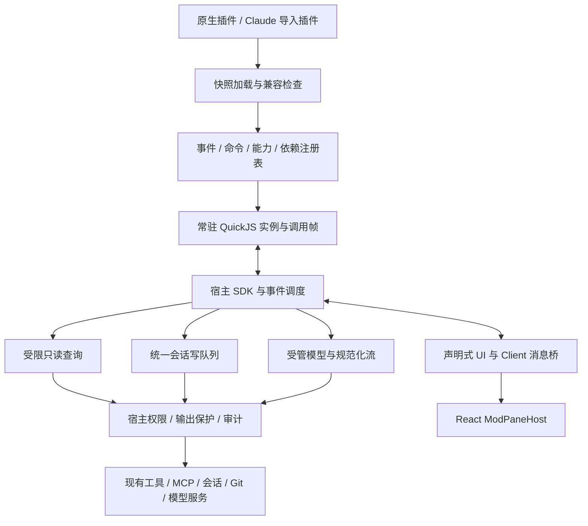

# Mods v2：能力补齐与 Claude Code 兼容设计

状态：实施中；运行时基础与对照夹具已开始落地，完整集成尚未交付。日期：2026-09-16。
代码基线：`codex/mods-v1`，`6abb89dcec5a4f7ee30407dc27db7b9a947aa92e`。
实施分支：`codex/mods-v2`；工作区：`C:\ai\CmbCoworkAgent-mods-v2`。
实施时重新拉取 `origin/UAT`，仍为 `18e2ea88a21d0ed745a523307ff083579aba94df`，
从此新开分支并快进纳入 v1 与设计提交 `82bceb0c`。

## 1. 结论与交付边界

要补齐。v1 已有工具拦截、上下文、命令、结果卡片和治理，但还不是可以系统性
DIY Claw 的插件平台。v2 应补成：**可安装、可组合、可测试、能持续交互的引擎插件平台**。
用户能通过插件改变命令、会话行为、模型请求、输出展现和工作面板，而不需要修改主工程。

采用“原生运行时 + Claude 兼容适配层”，保留 v1 已验证的执行事实、授权、审批和审计。
不能在现有四个事件及卡片协议上不断增加特例；必须先补事件分发、常驻运行时、能力注册、
流式协议和 UI 生命周期。分八批完成，每批自行检视和验证，最终交付集成效果。

本方案的“补齐”具有三个明确层次：

1. **产品能力补齐**：下节六个完整使用场景全部可用，并具有开发、安装、调试、迁移流程。
2. **指定版本的兼容范围**：按公开接口逐项实现或明确差异，不以几个同名 API 宣称完全兼容。
3. **有意保留的差异**：CMB 权限约束、桌面宿主、模型供应商和企业服务不同；不复制 Claude
   私有登录、第一方遥测、终端渲染器或产品品牌。差异必须出现在安装检查报告和类型声明中。

设计表格表示目标；实施结果和证据见 [实施记录](mods-v2-implementation-2026-09-16.md)，
不能将事件名称清单或底层原型通过当作整套产品能力已经完成。

## 2. 最终用户可以怎样 DIY Claw

| 场景 | 最终效果 | 验收 |
| --- | --- | --- |
| 代码变更面板 | 输入 `/diff` 打开旁侧面板；模型改文件后自动刷新；切换文件、滚动、选择代码；把选中片段填入输入框 | A08、A09 |
| 自定义工作命令 | 输入 `/review` 或点按钮，选择检查范围；先显示进度，再显示结果；只读面板在模型运行时仍能使用，需要写入的操作进入统一队列和审批 | A06、A08 |
| 团队工作方式 | 插件添加自己的提示词章节、上下文和工具说明，推荐或限制子代理，按任务选择已授权模型；团队强制规则持续有效 | A03、A04、A10、A11 |
| 模型输出处理 | 观察或变换允许公开的文本流、校验工具调用、显示自定义状态和轮次总结；聊天记录、恢复状态与实际执行一致 | A10 |
| 企业能力组合 | 一个插件提供 `$.company.lookup()`，多个插件依赖它；统一类型、权限、错误与追踪；不能借提供方获得未授权权限 | A05、A07 |
| 不改主程序的开发 | 创建插件 → 本地检查/测试 → 开发预览 → 批准新版本 → 安装启用；代码错误定位到源码，旧版本可继续使用 | A12、A13 |

安装页面增加“命令、面板、模型能力、依赖、权限变化、兼容性”信息；提供内置示例：
`live-diff`、`project-review`、`model-router`、`company-provider` 和消费者、`client-board`。
示例必须走公开 SDK，不能通过测试专用入口或私有 IPC 获得额外能力。

v1 的 `/mod project-quality:verify {}`、卡片、报告和已有配置继续可用。
新用户主要使用直接命令和表单，不再必须手写 JSON；命名冲突时保留完整命名空间调用。

## 3. 对照证据、版本与完整性

参考官方仓库提交 `b782847db9a18667f00918ea341197f201b22bb4`，类型声明首行标记
Claude Code **2.1.273**。声明文件 SHA-256：
`3320DB952D7441BECA33D4AE084A3FFC99D206F92911280A93D27D9EAA670D36`。
此前本机逆向与动态行为验证针对 2.1.272。此次另安装隔离的 2.1.273 对照运行环境，
21 项普通事件及流式契约夹具在其真实 `plugin test` 中通过；未据此外推其他事件已经一致。

官方说明了函数注册、插件目录、测试工具及能力组合；该接口仍处于 early access。
本方案冻结版本，不随上游 `main` 自动改变运行行为。
来源：[官方 Mods 说明](https://github.com/anthropics/claude-code/blob/b782847db9a18667f00918ea341197f201b22bb4/mods/README.md)。

使用 TypeScript AST 和类型检查器枚举公开声明，得到下列覆盖基线；名称存在不代表行为已实现。
详细逐项分批、差异编号和验收映射见
[机器可读兼容矩阵](mods-v2-compatibility-matrix.json)。

| 声明集合 | 数量 | 本方案的处理 |
| --- | ---: | --- |
| `EngineEventOf` | 34 | 每项设置落点与验收，不能只实现四个 v1 事件 |
| `OpEventOf` | 50 | SDK 操作也经过分发、权限和测试，不仅暴露函数名 |
| `ClassicEventOf` | 33 | 对应真实宿主触发点；无等价语义的事件显式拒绝 |
| `CoreEngineInterface` | 19 个命名空间、65 个成员 | 其中 `plugin` 的两个成员是元数据；其余 63 个为方法 |
| `RenderComponent` | 14 | 宿主渲染位置逐项接入，包括 `Pane` |
| 桌面元素表 | 9 | 包括 `Client`，不是仅增加几个静态卡片节点 |
| `ClientSurface` | 9 个成员 | 状态、尺寸、事件、定时器及消息端口均列入 |

这不是“Claude 所有 API 总共 117 个”的声明：还有插件新增事件、全局环境、匹配器、
结果类型、测试 API 等。静态集合覆盖只是检查入口，最终还要进行字段、返回值和行为验证。
以上枚举以[官方类型声明](https://github.com/anthropics/claude-code/blob/b782847db9a18667f00918ea341197f201b22bb4/mods/types/claude-code.d.ts)为依据。

### 3.1 兼容策略

- 原生协议版本为 `cmb.mods/v2`，使用自己的 SDK 包 `@cmb/mods`；v1 走独立适配器。
- Claude 导入模式识别 `.claude-plugin/plugin.json`、`hooks/hooks.json`、
  `register(on, options)`、类型导入 `claude-code` 和 TS/TSX 模块。
- 导入后生成 CMB 的权限清单和兼容报告，不执行安装脚本、不读取第三方账号密钥。
  检查通过不等于授权；批准绑定完整编译快照、依赖版本和权限。
- 生成的 `claude-code` 类型只描述 CMB 已支持的版本范围；不发放上游全部类型再让运行时静默失效。
  能静态发现的未支持用法在检查阶段报错；动态事件名和能力请求在运行时同样校验。
- 命名空间、方法存在性不等于参数兼容。B1 建立参数、返回值、匹配器、异常、取消、来源、
  多次 `next`、流式终值等契约用例；B7 输出“支持 / 适配 / 差异 / 不支持”的逐插件报告。
- 官方 `diff` 作为行为对照和兼容夹具；没有实际导入、编译和执行通过前，不宣称原文件零修改可用。
  生产示例由本工程独立实现，借用代码时另行核对许可证与署名。

### 3.2 必须公示的差异

| 编号 | 差异 | 处理原则 |
| --- | --- | --- |
| D01 | 权限、组织策略和层级 | 普通插件不能扩大权限、取代审批、修改强制提示词或伪造受管身份；允许收紧策略 |
| D02 | 副作用、错误和重试 | v2 普通函数 hook 按 Claude 语义允许有界多次 `next`，每次是独立且需重新授权的宿主调用；前置异常跳过、后置异常保留已完成结果，catch 重取已有结果不重复执行。宿主强制权限和未知执行状态仍不可绕过；v1 保持单次 next |
| D03 | 宿主表面 | v2 交付 Electron desktop；CLI 测试为 headless，不冒充终端 UI；`Raster`/`ui.blit` 及 mobile/vscode 表面不支持 |
| D04 | Claude 第一方服务 | `session.authorize` 在无 Anthropic 第一方授权时返回空；不冒用企业凭据；第一方遥测和计费数据不模拟 |
| D05 | 模型和上下文 | 模型名映射到本机已授权配置；不接受插件提供的任意模型服务地址；不支持的 effort 明确报错 |
| D06 | 文件、环境和配置 | 项目路径与授权目录受限；env 是插件隔离覆盖层；settings 返回已过滤视图，不能读取原始凭据 |
| D07 | 无等价业务事件 | `classic.TeammateIdle` 不映射成任意子任务完成；当前 Claw 无同等 teammate 语义，声明为不支持 |
| D08 | 开发重载 | 代码摘要变化需批准后切换；自动编译与预览不等于自动授权执行 |
| D09 | Client 执行环境 | 保留 Client 的状态/消息/交互模型，但代码在隔离 VM 中运行，不在 React 主线程执行 |
| D10 | 模块与环境 | 仅加载审核快照中的模块；支持明确列出的 Web 基础 API，不开放 Node、DOM、任意动态导入或原生依赖 |

这些是公开边界，不应在最后验收时临时解释为“下一期再补”。桌面 DIY 所需能力仍在八批范围内。

### 3.3 本机还原产物怎样进入本方案

有直接借鉴。本方案的依据分为三层：2.1.272 内嵌程序静态还原与有限动态验证用于理解
实际机制；2.1.273 官方声明用于更新公开兼容范围；本工程代码和 v1 验收用于确定实现取舍。
此前正文对第一层证据引用不够明确，本节补充对应关系。

这里的“反编译产物”准确指从 PE/Bun 容器提取内嵌 JS、解压资源、恢复声明与测试工具包、
格式化压缩代码；没有恢复原始 TypeScript 仓库或反编译 Bun/JSC 原生机器码。
程序哈希、文件偏移、提取脚本及阅读索引见
[2.1.272 本机还原产物](C:/ai/CmbCoworkAgent/output/claude-code-2.1.272-analysis/README.md)。
证据文件保留在原工程的被忽略目录，未复制进入本工作区或生产包。

| 证据 | 从产物确认的机制 | 本方案对应决策 | 证据强度 |
| --- | --- | --- | --- |
| [Worker 消息协议](C:/ai/CmbCoworkAgent/output/claude-code-2.1.272-analysis/formatted/src/plugins/functionHooks/hooks-worker/hooks-worker.js)，约 94 行起 | next、宿主能力、取消及流读取通过消息传递，并携带调用标识 | 第 6 节的调用帧、SDK 代理、取消树及流通道；B2 | 静态读取；不代表本工程多 frame 已实现 |
| [宿主能力入口](C:/ai/CmbCoworkAgent/output/claude-code-2.1.272-analysis/formatted/chunk-pada1xhk.js)，约 209388 行起 | 扫描的调用范围、参数约束、加载状态和调用链准入在真正执行前核验 | 第 5、7 节的能力清单、宿主执行校验与跨插件委托；B2–B4 | 静态读取；本工程权限模型独立设计 |
| [能力扣留及崩溃恢复](C:/ai/CmbCoworkAgent/output/claude-code-2.1.272-analysis/formatted/chunk-pada1xhk.js)，约 209355、210765 行 | 旧表引用不能绕过被扣留能力；造成 Worker 崩溃的插件被卸载时，已扣留能力仍保持限制 | 第 5.2、7.2 节的宿主拒绝、旧句柄失效和故障期间不放宽策略；B2、B4 | 静态读取；尚未对 Claude 做完整故障注入 |
| [调度器](C:/ai/CmbCoworkAgent/output/claude-code-2.1.272-analysis/formatted/chunk-5b87cxfe.js)，约 3199 行起；[语义实测输出](C:/ai/CmbCoworkAgent/output/mods-design-review-2026-09-16/claude-semantics-result.txt) | 组合次序、多次 next、前后异常、catch、短路、trace/origin、下游失败具有不同语义 | 第 5.2、9.2 节按事件区分失败与重复请求；保留执行事实，工具写入不重放；B2、B6 | command.run 的 8 项实际用例通过；不外推到所有事件 |
| [渲染动作处理](C:/ai/CmbCoworkAgent/output/claude-code-2.1.272-analysis/formatted/chunk-5b87cxfe.js)，约 6135 行起 | 校验动作是否由本插件创建或从下游树继承，并回收不再使用的句柄 | 第 8 节的动作归属、pane/revision/epoch、卸载清理和重放控制；B5 | 静态读取；Electron 绑定与 intentId 是本工程扩展 |
| [恢复的流式类型与契约](C:/ai/CmbCoworkAgent/output/claude-code-2.1.272-analysis/readable/claude-code.d.ts)、上述 Worker 流读取路径 | 异步生成器、next 来源和层级、流读取是协议的一部分 | 第 5、6、9 节的一般事件内核与 turn.step；用 2.1.273 声明补足当前字段；B2、B6 | 静态代码与声明；真实模型流语义仍须单独验证 |

**独立设计的部分也必须明确：** Electron utilityProcess + QuickJS、持久执行账本、
授权代次、共享写队列/只读查询分流、跨插件委托权限、整文/增量输出保护、数据库回退及
8 批交付次序，均是为本工程条件作出的设计，不能归为“反编译发现 Claude 就是这样实现”。
其中 Worker/VM 机制提供了参考，但 QuickJS 并非本次从 Claude 还原出的运行时选型。

需要与上游不同的行为有实际依据：测试表明两次 next 会调用下层两次、普通 Hook 在 next 前
异常可继续下层，所以本工程对写操作限制重复执行，对权限相关失败保留阻断。
这些是研究后的主动取舍，不是遗漏了上游语义。当前 v2 的八批能力仍是方案，不能把上述
静态发现或八项测试表述为 v2 已完成兼容验证。

## 4. 现有代码复核：可复用与必须调整

| 实际位置 | 当前约束 | v2 决策 |
| --- | --- | --- |
| `src/shared/mods/types.ts` | 四个事件、两个卡片位置、七类节点 | 新增 v2 契约，v1 类型不原地破坏 |
| `src/main/mods/guest-runtime.ts` | 单个 `active` 调用、全局调用期限 | 改为常驻实例、调用帧表及协作调度，不能直接挂定时器和流 |
| `src/main/mods/guest-bootstrap.ts` | 自定义 `on.tool/context/command/ui` 注册 | 新通用 `on(event, matcher?, handler)`，保留旧注册适配 |
| `src/main/mods/engine.ts` | 引擎互斥、工具中心、单次 next | 拆分事件内核、权限边界、写队列和流式调度 |
| `src/main/mods/manager.ts` | 会话绑定偏向轮次，命令专用上下文 | 插件实例归属 thread，turn/step 是其下级作用域 |
| `src/main/mods/runtime-client.ts` | 有界请求/响应，无流式背压及长期订阅 | 增加流通道、回调句柄、取消和代次 |
| `src/main/mods/command-queue.ts` | 所有命令共用物理线程租约 | 区分只读查询与会话写队列，写入仍沿用统一租约 |
| `src/main/mods/control-store.ts` | schema 4，执行事实与待核查机制 | 增量迁移，保留 unknown 和防重放记录 |
| `src/main/mods/loader.ts` | 相对导入与审核快照，未支持 JSX | 扩展 TSX/Client 构建；保留路径约束、快照和 esbuild 隔离 |
| `src/main/agent/runtime.ts` | 真实模型创建和多个中间件在此 | 提取模型边界，不能误把仅提供配置的 `models/registry.ts` 当成流式执行点 |
| `standard-turn-stream.ts` | 转换 UI 前已记录 trace/attribution | 在更早模型边界生成唯一可发布流，防止原始内容先进入其他消费者 |
| `src/main/hooks/types.ts` | 声明不等于支持；Pre/PostCompact 尚未接通 | 补真实触发点并验证，不只增加枚举 |
| `useModCommands.ts` | `/mod namespace:command [JSON]` | 增加统一命令注册、别名和参数表单 |
| `TabbedPanel.tsx`、`RightPanel.tsx` | 主体为内置视图 | 引入 PaneRegistry/ModPaneHost，插件不直接修改内置 React 组件 |
| `bin/cli.js` | 当前是 `openwork` 启动器 | 增加 `openwork plugin ...` 子命令，不假设已有 `claw plugin` |

保留并复用 v1 的审核快照、独立受管策略进程、宿主执行凭据、共享写队列、卡片防重放、
工具/MCP 统一入口、审计与恢复机制。v2 不把这些权限交给插件事件处理器。

建议新增模块边界如下，避免继续把所有功能集中在 manager/runtime 两个大文件中：

| 拟新增位置 | 单一职责 |
| --- | --- |
| `src/shared/mods/v2/` | 契约、schema、序列化消息、UI 数据树、错误码 |
| `src/main/mods/v2/event-registry.ts`、`dispatcher.ts` | 事件定义、匹配、层级、字段变换与失败规则 |
| `src/main/mods/v2/session-runtime.ts`、`frame-scheduler.ts` | 实例、调用帧、作用域、预算与资源释放 |
| `src/main/mods/v2/stream-channel.ts`、`callback-registry.ts` | 背压、取消、回调句柄与防重放 |
| `src/main/mods/v2/host-sdk/` | 每个宿主能力的授权、实现、审计和输出保护 |
| `src/main/mods/v2/capability-registry.ts`、`command-registry.ts` | 提供方、依赖、委托、命令与别名 |
| `src/main/mods/v2/compat/` | Claude 格式/语义适配、v1 适配、差异报告 |
| `src/main/agent/mods-model-adapter.ts` | 模型请求、流规范化、实际用量和 graph 一致性 |
| `src/renderer/src/features/mods-v2/` | PaneHost、元素渲染、Client 桥、开发与兼容性界面 |
| `src/main/mods/devtools/` | 生产 loader 驱动的 check/types/test/dev/pack 服务 |

跨模块错误有稳定代码，例如不支持接口、权限拒绝、旧代次、预算耗尽、UI 版本冲突、
能力调用回环和写入待核查；用户文字与诊断细节分离，插件不能伪造宿主错误来源。

## 5. 总体架构与事件语义



图中策略不是一个可被跳过的插件节点。每个宿主能力在实际执行前核验权限，所有内容发布出口
再执行输出保护。事件链的排序不会绕过这些边界。

### 5.1 契约与事件注册

新增 `src/shared/mods/v2/`：事件输入/输出、字段可写性、能力权限、UI 协议和错误码。
以共同的契约描述生成运行时校验、SDK 声明、文档和测试数据，避免维护三套不一致的定义。

通用 `on` 支持精确事件名、命名空间匹配和受限 matcher；支持函数返回值与 `turn.step`
异步生成器，`.catch` 使用独立且有界的恢复预算。matcher 深度、正则成本、注册数量都有上限。
`register` 阶段同步收集注册，不允许任意后台初始化逃过快照生命周期。

每个事件必须在注册表声明：

- 类型：查询、转换、通知或流；输入/输出 schema 和允许修改字段。
- 可见上下文、权限需求、超时、取消规则、缓存与失效范围。
- 是否允许短路、是否允许重复下游请求、失败处理、所属宿主触发点。
- 安全标识：host 分配的 workspace/thread/turn/step/agent、origin、digest、epoch。

只读事件输入冻结；插件返回新值，不能改写受保护的标识、计费、权限决定来源和执行凭据。
通知、转换事件不可混用：例如 `turn.start` 是通知；`turn.complete` 的文本用于附加总结，
不重写已持久化的模型回答。方法调用事件与引擎事件统一调度，不能发生同一操作双重执行。

### 5.2 排序、组织插件和失败

支持 `prepend / user / append / builtin / core` 层级概念；实际层级由安装来源和宿主策略分配，
不能由项目 manifest 自授。层内按显式依赖和稳定次序排序，循环依赖拒绝加载。
受管配置、组织要求、现有 classic 强制阻断处于不可跳过的宿主边界。

`next.to` 只能越过授权范围内的较低层插件，不能跨过宿主检查；`next.trace` 输出经过脱敏的
事件来源、调用和结果摘要。企业插件能限制用户插件、隐藏能力、拒绝注册；不能把只适合
普通插件运行的外部 `sec-default` 直接当成已获企业身份的可信代码。

失败分级：装饰 UI 失败保留宿主视图；可选观察失败记录诊断；权限/工具参数转换失败停止该操作；
`engine.create` 构建失败不让半初始化插件上线。已开始的副作用失败只按真实结算记录，不能
因为 Hook 抛错就再次调用工具。流式输出已经发布后，不得从头调用模型伪装恢复。
已批准策略代次建立的能力扣留由宿主保存，策略插件或其进程崩溃不能解除限制。
只有新的有效策略成功原子替换，或有权限的管理操作明确解除时才更新；重启恢复期间先拒绝
受影响能力，不等待故障插件自行恢复再补检查。这一条直接借鉴第 3.3 节的崩溃扣留路径。

## 6. 常驻运行时、调度与背压

### 6.1 实例与调用帧

每个 `(workspace, thread, plugin, digest, epoch)` 对应常驻 QuickJS 实例；同一 workspace
可复用受限的 utilityProcess 池。关闭 thread、撤销、换版本时释放实例；冷却的 thread 可按
LRU 卸载，恢复只读取显式持久化状态，不能声称 JS 闭包跨进程重启仍存在。

每次事件、回调和 SDK 调用建立独立 frame，含调用 ID、父调用、原始来源、授权代次、取消信号、
预算及允许的副作用。异步回调捕获 frame 的受限能力，不读取“当前 active”全局变量。
多个调用在单 VM 上协作推进，不把多个 Promise 等同于多线程执行；异步交错下共享状态必须
由插件显式管理，宿主 store 提供原子更新或 revision/CAS 扩展。

QuickJS 的中断与内存统计是 VM 级，不承诺精确归属每个异步 Promise 的 CPU。
按执行片段、VM 总预算和队列数量限制；越界终止实例，所有关联 frame 失败；宿主已经开始的
写操作继续受执行账本跟踪，未确定结算保持 unknown，不能因 VM 消失自动重放。
从 v1 的进程/堆限制出发，在 B2 按多实例实测冻结池大小、总 RSS、单 VM 堆和活跃实例上限；
全部限制同时生效。容量不足显式排队或卸载空闲实例，不能无限增开进程，也不能静默漏执行 Hook。

### 6.2 调度通道

| 通道 | 用途 | 约束 |
| --- | --- | --- |
| read-query | Git 状态、面板查询、已过滤会话快照 | 不持有会话写租约；宿主能力必须证明只读；下游调用继承只读限制 |
| UI-local | 输入、切换、选中、局部状态、重绘 | 不等待模型；只发消息或生成操作意图，不持有写租约 |
| session-mutation | 工具写入、修改会话、发送提示词、需要独占状态的命令 | 进入现有 desktop/IM/scheduler/Mods 共用队列 |
| model-child | `model.complete/fork/classify` 及主模型 step | 独立请求/费用/取消预算；不得隐式创建一个抢占父租约的新主轮次 |

插件声明 `read` 只是意图，不能把任意 `process.run`、未知 MCP 或网络 POST 当成只读。
已审核的 Git 查询由宿主受限能力提供；命令行 Git 需验证 argv、环境和配置影响。
执行 git read 时禁用 pager、external diff、textconv 等可导致额外程序执行的选项。

避免三类死锁：

1. 命令占有写租约时再提交 prompt：原生接口返回排队句柄，不在原租约内等待新轮次完成；
   兼容 `prompt.submit` 的返回按上游契约适配，不以“等待模型回答”改变含义。
2. A 调用 B 的插件能力：等待 RPC 时释放 VM 调度占用；禁止调用图回环，不持有跨插件互斥锁。
3. 工具审批期间界面查询：UI 和只读查询不争用写租约；取消请求不等于实际写操作已经结算。

### 6.3 流与订阅协议

普通 RPC 增加 `stream.open / pull / chunk / end / error / cancel`；所有消息包含
`streamId + frameId + epoch + sequence`。消费者发放 credit 后生产者才能继续；慢面板、
慢插件和失联 renderer 不能让宿主无限积压。

初始工程预算：每条通道最多 16 个在途 chunk、合计 128 KiB；单个 chunk 上限 32 KiB，
较大数据走分块或受控 artifact。预算在 B2 压测后冻结为配置常量；不能等验收失败后静默放宽。
取消沿调用树传播，结束仅发送一次；重复、乱序、过期 epoch 消息拒绝。

定时器、watch、UI 回调和后台任务均登记所属作用域，释放时批量取消。隐藏面板合并/暂停刷新；
关闭面板后该面板的订阅和定时器为零。插件可有显式授权的 session 级定时器，不得冒充面板定时器存活。

## 7. SDK、插件组合和会话接入

### 7.1 核心 SDK 覆盖

| 命名空间 | 补齐方式 |
| --- | --- |
| plugin | 宿主只读身份与快照根目录；不能替换来源 |
| ui | notice、invalidate、resolve、log、ask、toast、status、open/close、scroll/focus；blit 按 D03 拒绝 |
| model | complete、fork、classify；走相同模型权限、费用记录、输出保护和取消机制 |
| audio | 播放与朗读由宿主媒体服务执行，限制来源/大小，显示可停止状态，遵守用户声音设置和权限 |
| mcp | 复用既有 server/tool 路由、审批和工具审计，不绕过实际工具效果判断 |
| session | 消息、目录、模型、轮次、仓库、表面、使用量、压缩；空缺的供应商计费信息标为不可用，authorize 按 D04 |
| turn | abort 精确绑定运行中的 turn，不中断其他会话；等真实结算后释放租约 |
| prompt | submit/fill/suggest；草稿填充可预览，不因填充自动发送；用户已编辑草稿时做 revision 冲突处理 |
| tool | list/call/check/register；注册工具带 schema、命名空间、实际权限与生命周期 |
| command | list/run/register；模型指令与命令入口区分，参数校验和原始来源由宿主负责 |
| config | list/set；插件自己的配置可改，宿主配置仅开放白名单，强制设置不可覆盖 |
| agent | spawn/list；主子代理身份、权限继承和模型预算进入既有任务管理 |
| fs | read/write/list/exists/stat/ancestors；路径、链接、工作目录和目标文件同时校验，越界拒绝 |
| store | get/set/delete/keys；插件、项目隔离，明确是否 thread 级；加配额，持久化与事务失败可见 |
| clock | now/sleep/after/every；宿主可取消；测试时使用可推进时钟 |
| http | 受限 fetch；域名、重定向、解析地址、响应体积和超时均核验；需特别授权的内网目标单列 |
| process | argv 模式运行，使用现有沙箱与审批；没有隐含 shell、宿主完整 env 或无界输出 |
| settings | 按来源提供过滤后的设置；敏感项与企业内部策略细节不泄漏 |
| env | 插件自身的字符串覆盖层加明确的非敏感白名单；不读写 `process.env` |

HTTP 凭据使用宿主持有的、受目标域名与会话约束的 opaque handle；不会把模型 API key
变成通用网络访问令牌。重定向和 DNS 重绑定都必须在实际连接时验证，代理配置不能绕过域限制。
对企业服务另设原生 `$.company`/认证能力，不改变 `session.authorize` 的第一方语义。

全局环境支持 `h/Fragment/JSX`、URL、编码、AbortController、结构化克隆、受限 crypto
和单调计时；逐方法建立兼容测试。无 DOM、Node、原始 fetch 或无限后台任务。
同步语义的方法在 VM 生成已验证的本地描述或入队消息，不能用 Promise 偷换成不兼容接口。

### 7.2 engine.create 与能力提供方

能力提供方声明命名空间、版本、方法 schema、所需底层权限与效果。`engine.create` 返回的
函数仍驻留提供方 VM，跨实例传递可验证描述符和宿主句柄，不序列化闭包或暴露宿主对象。
消费者通过 `$` 的代理调用；其类型契约随依赖安装生成，不手工复制。

名称归属唯一，禁止覆盖 core 或另一插件命名空间。被受管层隐藏的能力在类型报告与运行时
均不可用；重新构建时旧句柄失效。只有完整依赖图、版本与注册全部校验通过才原子切换。

权限不是简单取“消费者也持有提供方全部底层权限”的交集：消费者可获准调用指定服务方法，
提供方持有所需受限底层权限；宿主还必须校验**消费者的委托授权 + 提供方权限 + 组织规则 +
原始调用作用域限制**。调用图保留原始发起者，消费者无权委托的动作无法借提供方执行。
安装页展示传递能力与效果；未知实现按有副作用处理，不能仅相信方法的 `read` 声明。

依赖循环加载失败，运行调用图深度默认 8，预算沿链递减；A→B→A 明确报错。
提供方版本或权限变化，重新计算消费者契约与委托授权；不能仅更新一份 .d.ts 后继续使用旧句柄。

### 7.3 生命周期与 classic Hooks

区分 thread/session、逻辑 turn、模型 step、网络 attempt、物理 stream run。
重连、恢复与 retry 不能重复触发用户级 turn.start、写操作或所有会话初始化。
持久事件记录使用 stable eventId；需要投递恢复的通知带 replay 标记，让处理方幂等。
不承诺跨崩溃外部副作用的“恰好一次”。

session.start/receive/attach/detach 接真实线程与 renderer 连接生命周期；IM 无 UI 时
`surfaces()` 返回空，不伪造 desktop。session.compact 接真实压缩前后状态；只有落盘成功
才发完成事件。子代理获得独立 agentId、父身份和不扩大的权限。
`session.start` 回传的 cwd 是观察结果，不能因插件改了返回值就切换真实工作目录。
`session.receive` 的来源由入站通道核实：已验证的定时任务可标为 scheduled-trigger，
无法证明的来源保持 unclassified；正文看起来像系统通知不能获得系统身份。

classic 事件复用 `src/main/hooks/runner.ts` 的真实执行和结果折叠，在合适边界加入函数插件。
已有 14 项 SUPPORTED_HOOK_EVENTS 包含两项本工程特有 Skill 事件，不能直接视作上游 33 项
均支持。新增 PostToolBatch、模型切换、配置/指令加载、worktree、目录变化、elicitation、
任务生命周期、消息显示等必须有真实触发点；只有类型声明而没有生产触发点不算完成。
压缩事件必须与真实 summarization/compaction 调用共同接入，不能仅插 beforeModel。
`classic.TeammateIdle` 按 D07 不支持；本工程自己的 Skill 事件作为原生扩展保留。

事件桥只调用 classic 执行器一次；受管阻断不受下层返回覆盖。普通函数 Hook 不能自动替人
同意工具、MCP 授权或企业登录。兼容测试检查事件顺序、实际副作用次数和最终参数，而不只计数日志。

## 8. 命令、交互面板与 Client

### 8.1 命令注册

统一 `CommandRegistry` 管理内置命令、技能入口和插件命令，给 `/goal` 等内置命令保留名称。
插件主标识为 `pluginId:command`；`/diff` 等别名只有无冲突且用户选择启用时生效，冲突不覆盖。
列出命令说明、参数提示、来源与权限；支持 JSON Schema 表单和普通文本参数两种模式。

可只读运行的命令在查询通道执行；有写入或未知效果的命令进入统一队列。
命令可以先创建面板再返回，长期刷新由该面板的作用域托管，不能让命令永久占住写租约。
`command.run` 的文字输出和长期 job/面板句柄分层管理，兼容模式不偷换上游返回类型。

### 8.2 声明式 UI 和 14 个渲染位置

支持 14 个 RenderComponent 的匹配、核心视图引用和装饰。权限审批控件仍由宿主专有渲染；
`AskUserQuestion` 是普通问答，不等于批准工具权限。工具结果和计费的事实区域不可伪造或遮盖。
插件渲染区域显示来源，保持可访问性、键盘操作、主题和高 DPI 支持。

桌面元素支持 Box/Text/Button/Input/Select/Link/Code/Svg/Client。
Code 提供文本、行号和 diff；另以原生扩展提供虚拟列表、表格和 artifact。
Svg 通过结构化白名单和体积限制处理，拒绝脚本、外部资源、foreignObject 与可执行链接。
Link 走宿主 URL 策略。兼容元素属性逐项验证，不能遇到不支持属性就静默忽略。

`ModPaneHost` 管理打开、关闭、大小、焦点和滚动，Renderer 只接收数据与受控动作句柄。
UI 初始 snapshot 加 revision；后续有界 patch，revision 不连续则重取 snapshot。
每个句柄绑定 sender/thread/plugin/digest/epoch/pane/revision；renderer 无法指定任意命令路径。

重复点击与重放分别处理：真实用户每次点击取得新的 intentId；IPC 重试沿用原 intentId，
同一 intent 的写入只领取一次。开关、搜索等交互可以反复使用；v1 一次性卡片语义不被改成可重放。
input/select/Client post 本身不是写授权；需要写入时派生带来源和参数摘要的操作意图并走宿主审批。

### 8.3 Client 模块

不能用“没有任意 React”作为省略 Client 的理由。支持快照内静态声明的 TSX Client 模块，
采用独立 QuickJS surface 实例和纯数据树；与主插件通过 `ui.message` 通信，无直接 `$`。
这是对公开交互模型的桌面适配，执行线程不同按 D09 公示。

以 `(plugin, pane, key, epoch)` 保存 state；props 更新和 resize 不丢 state；移除 key 即释放。
提供 setState、columns/rows、every、onPointer、onKey、post；尺寸按宿主定义的逻辑网格转换，
实际像素布局由 React 负责。指针捕获在窗口失焦或实例卸载时释放，Escape 返回宿主焦点。
同一帧多次 setState/post 合并；有界执行、异常占位、帧频限制，不能阻塞 React 渲染线程。

### 8.4 Live Diff 完整验收场景

复用 `services/git-read-context.ts` 与 `ipc/git-read-request-coordinator.ts` 的查询/取消逻辑，
提取宿主 Git 只读能力，避免插件直接调用 renderer IPC。工具写入后按仓库合并失效事件；
外部编辑由有限 watcher 触发，丢事件时低频核对；隐藏/关闭时减少或停止工作。

覆盖空仓库、未初始化仓库、删除/重命名、未跟踪文件、二进制、大文件、CRLF、中文路径、
worktree 和同时写入。读取的快照带 revision；选择行后文件变化，填入提示词须保留对应旧内容
与来源标记或要求重新选择，不能把行号错误地套到新文件。
大 diff 分页与虚拟化，默认限制数据量并给出可理解的提示。

## 9. 模型与流式 Hook：最关键的正确性边界

### 9.1 接入位置和可变内容

在 `runtime.ts` 的实际模型构造/调用边界建立 `ModAwareModel`/模型 transport 适配器，
在 LangChain callbacks、graph checkpoint、trace、transcript、renderer 分流之前生成唯一的
规范化结果流。仅加 `wrapModelCall` 或只在 StreamConverter 后改字无法保证一致性。
既有重试、steer、恢复、摘要和多代理流程继续由原宿主管理。

`turn.step` 接收冻结的 turnId/index/messageCount/agentId；可改 model、允许的 effort。
messages 的调整通过 `prompt.submit/section/context/skill.prompt` 的白名单字段进行，
不把全部原始系统消息和密钥发送给插件。受管章节不能被删改，插件上下文保留来源。
上下文缓存键包含插件版本、依赖、配置和受管策略代次；invalidate 在下一请求前生效。

`attribution.text` 是提交/PR 等场景中的署名与说明文字，不能误接成本工程的 Skill 使用归因。
新增统一的提交/PR 文字组合服务，覆盖 commit/pr/exemption/remedy 四类输入；组织强制内容
继续保护。没有触发相应业务时不人为制造事件，相关功能也不构成自动提交或发布的授权。

模型接入覆盖桌面、IM、scheduler、goal、workflow worker、子代理及恢复路径的实际 agent 请求。
optimizer、编译器等没有当前逻辑 turn 的后台模型调用使用明确 purpose，不伪造用户 turn.step；
它们与模型 SDK 的权限和发布边界分开核验。B1 列出实际模型构造点，防止遗漏裸 ChatOpenAI 路径。

支持文本、允许公开的 reasoning、工具开始、工具参数、结束和 opaque engine 引用等流形态。
不向插件暴露供应商未公开的隐藏推理；engine 引用只在同一 step 有效，不能自造或跨 step 使用。
模型实际用量和费用由宿主计账；插件生成文本标明来源，不得伪装成付费模型的真实 token usage。

### 9.2 多次 next、流终值和工具调用

- v1 保留原有单次 next。根据最新一致性要求，v2 普通 hook 的多次 next 按 Claude 语义处理，
  每次领取独立调用 ID、校验权限并记录执行事实；异常恢复不得自动重放先前副作用。
- `turn.step` 允许串行多个下游模型请求，默认每逻辑 step 总请求上限 3；需要相应模型调用授权。
  每次分配独立 attempt ID，记录所有实际费用，避免模型 Hook 内部重试与宿主网络重试相乘失控。
- 插件决定哪些 chunk 向上游发出；宿主按 attempt 为 block/tool ID 分配不会冲突的真实标识。
  已发布文本不能用修改 generator 的终值撤回；需要更正时发显式修订消息，而非改旧持久记录。
- generator 的 return 值只是上层 Hook 读到的结果；界面与记录取决于已经 yield 的规范化流。
  不把修改 `TurnStepResult.answer` 误当成修改用户已经看到的文字。
- 工具参数片段必须收齐、限制大小并解析，通过工具 schema、最终权限和参数检查后才能执行。
  修改或合成的工具调用也只能形成宿主工具请求，不能直接生成成功执行凭据。
- 输出和工具启动顺序由宿主维护；流异常、取消或批准后恢复不能重复执行已经领取的工具。
  流中断后的 fallback 只允许在未公开且未产生副作用的边界重试，其他情况保留失败事实。

`model.complete/classify` 是有预算的旁路模型请求；`model.fork` 使用会话的受控快照，
不隐式覆盖主会话记录。插件触发的 agent/model 请求保留来源，并跳过直接引起它的同一处理器，
其他插件仍按契约接收；调用深度和预算限制进一步阻止事件递归。
故意短路模型的 Hook 也受内容校验与来源标识约束。

### 9.3 输出保护不能只逐 chunk 做正则替换

模型提供方 → 宿主解码与结构校验 → 输入插件前的保护 → 插件变换 → 最终保护 →
同一规范流的 checkpoint/trace/transcript/UI/外部发送。低层网络诊断也不能提前记录未过滤正文。
业务需要保留的执行事实采用不泄露敏感正文的结构化记录。

流式策略分两类：经过证明可增量执行的规则使用带状态过滤器；任意整文策略先收齐再发布。
不能以“固定尾部保留 N 字符”宣称能防止所有跨片段、无限长度或跨字段泄漏。
整文缓冲设上限，超限停止并显示原因，不把原始数据写进临时文件或调试日志。
需要原始参数执行工具时，仅在可信宿主的受限执行区使用；插件、UI 与 trace 得到受保护视图。

严格缓冲模式会增加首字等待，界面显示处理状态；性能报告分别测严格模式与可流式模式。
没有证明策略满足增量条件时，不能以降低保护换取流式性能指标。

## 10. 开发工具、包格式与迁移

### 10.1 开发者工作流

新增以下 `openwork` 子命令，源码开发和安装包使用同一生产 loader/QuickJS/协议：

```text
openwork plugin init <dir>
openwork plugin check <dir> --profile cmb.mods/v2
openwork plugin types <dir>
openwork plugin test <dir>
openwork plugin dev <dir>
openwork plugin inspect <dir>
openwork plugin pack <dir>
openwork --plugin-dir <dir>
```

这是目标命令，v1 当前没有实现。CLI 不依赖运行时 npm 下载，打包后也能离线执行 check/test。
测试服务以受控 headless Electron/utilityProcess 启动，不以不一致的 Node mock 代替 QuickJS。
原生测试 API 对应 `@cmb/mods/testing`；导入插件提供 `claude-code/testing` 的已支持适配。

测试插件按实际包加载；外界能力由下层测试处理器回答，未模拟的网络、文件写入或进程操作
明确失败。提供 fake clock、隔离 store/env、模型流夹具、UI 点击/输入/选择、能力提供方夹具、
层级与 trace 断言。测试模式不能加载生产凭据或把 fixture 当成用户授权。

`dev` 监听文件，构建不可变候选快照，静态检查及测试通过后展示版本差异。
开发预览使用受限 fixture；真实会话只有批准新 digest 后切换。切换前取消旧订阅，旧写操作
结算或标记 unknown 后再释放，失败保持最后可用版本；源码映射支持定位出错行。

### 10.2 包、模块和依赖

原生包保留 manifest、hooks、types、ui、tests、assets 的明确布局；schema 在 B1 冻结。
TypeScript/TSX 在构建期处理，`h`/`Fragment` 只生成受限树。
运行时只接收快照内模块；静态扫描 Client module 字面量、检查符号链接和 Windows 路径边界。
可打包纯 JS 依赖，但不允许运行生命周期脚本、原生模块或运行时任意联网 import。
依赖锁记录源码/类型/资源摘要、编译器版本与兼容配置，防止代码不变而依赖悄然变化。

### 10.3 v1 数据与发布回退

- v1 原样识别，不自动提升权限、不重写旧卡片。授权包含 API 版本，v1 批准不自动变成 v2 批准。
- 新增 v2 实例状态、契约、订阅、版本记录和队列字段，使用增量迁移与一致性备份；迁移失败
  不覆盖旧数据。保持执行账本与 unknown 记录；垃圾回收只清除确认不被引用的快照/临时资源。
- 迁移工具输出可审查差异；老插件逐个选择升级，确保项目规范示例、审计与报告全回归。
- 以 feature flag 分阶段启用 v2。故障回退是**在新程序中停用 v2、继续运行 v1**，已经开始的
  工具仍由宿主结算；不能声称关闭插件就撤销了已写文件。
- 旧二进制可能不认识新数据库。禁止把安装旧包加恢复旧备份当成无损回退；如确需二进制
  降级，必须停机、导出并核对新执行事实，使用经验证的离线迁移，不能丢弃期间写入记录。

## 11. 八批实施计划

每批先完成对应契约和回归用例，再交付实现、代码检视和实测记录；后续批次必须继承前序测试。
用户主要看最后集成效果，但不能把所有检视积压到最后。

开始实施时重新获取最新 UAT，在独立工作区创建 `codex/mods-v2`；先核对 v1 提交是否已进入
UAT，未进入则显式整合已验收的 v1 提交，避免重复应用或遗漏修复。记录实际合并基线并重做
受影响的基线验证；本方案的代码依据仍是上述 v1 提交，不冒充未来 UAT 的状态。

| 批次 | 范围与主要产物 | 可观察结果 | 必须通过的门禁 |
| --- | --- | --- | --- |
| B1 | 冻结原生 schema、上游兼容范围、字段矩阵、类型生成、CLI 骨架；验证 QuickJS 多 frame、隔离 Client、模型统一流三个原型 | 能检查插件缺什么、为何不兼容，形成可执行契约夹具 | A01；三个原型证据，达不到边界要求则先调整设计 |
| B2 | 常驻 VM、frame、通用事件分发、权限/层级、取消、stream credit、资源作用域 | 并发查询/定时器可用，撤销后旧调用失效 | A02、A03；无死锁、无写重放、队列有界 |
| B3 | session/turn 生命周期、宿主基础 SDK、真实 classic 事件入口、状态持久化 | 插件能长期观察会话、读受限项目数据、运行受控能力 | A04、A05 的本批条目；A11 中非 UI/模型/配置事件 |
| B4 | 命令注册与别名/表单、配置、工具注册、能力提供方/依赖与 engine.create | `/review` 可运行，两个插件共享 `$.company` | A06、A07；委托权限与循环依赖验证 |
| B5 | 14 个 UI 位置、Pane、TSX、Client、输入/焦点/滚动、Live Diff、媒体适配 | 模型执行时可交互的 `/diff` 与 Client 示例 | A08、A09；A11 MessageDisplay、A05 audio |
| B6 | prompt/skill/agent/model 接入、turn.step 流、多请求预算、真实压缩/模型切换 | 改提示词、模型路由、变换流、子代理规则完整贯通 | A10；A11 压缩/模型事件；记录/执行一致性 |
| B7 | 完整开发 CLI、SDK/testing、Claude 导入、兼容报告、开发预览/重载、v1 迁移与回退 | 插件作者无需改主工程即可开发与分发 | A12、A13；差异不是 silent no-op |
| B8 | 集成功能/性能/长期稳定性/E2E、实际安装包、真实已授权模型与 MCP 验证、用户使用文档 | 给用户直接可用的 DIY Claw 与示例包 | A01–A15 全部有证据；明确发布阻断与支持范围 |

依赖：B1→B2→B3→B4；B5 依赖 B2–B4；B6 依赖 B2–B4 的身份、调度、能力；
B7 汇总所有稳定契约；B8 不能替代前序批次的专项门禁。
CLI 类型与测试夹具从 B1 起随实现维护，B7 才宣布完整开发流程可交付。

## 12. 验收与性能回检

### 12.1 功能与正确性验收编号

| 编号 | 必须验证的行为 |
| --- | --- |
| A01 | 固定版本静态集合无漏项；字段/返回值/同步异步/匹配器契约；支持矩阵与运行时声明一致 |
| A02 | 并发 frame、Promise 回调、资源预算、慢消费者、取消、VM 崩溃、代次替换；待处理计数最终归零 |
| A03 | 受管层不可跳过、权限不能扩大、旧句柄失效、策略崩溃/重启仍保持扣留、敏感数据保护、真实写入次数、unknown 不重试 |
| A04 | 冷会话、切换线程、恢复、IM/headless、子代理、step/attempt 区分；不重复发逻辑生命周期事件 |
| A05 | 63 个 SDK 方法逐项成功/拒绝/取消/失败路径；两个元数据字段；路径、网络、MCP、计费与能力隔离 |
| A06 | 无模型调用也可执行命令；别名冲突、参数表单、队列、公平性、取消后仍等真实结算 |
| A07 | provider/consumer 类型和版本；隐藏能力、循环调用、越权委托、重载、提供方崩溃与错误传播 |
| A08 | 14 渲染位置、9 桌面元素、9 Client 成员；键盘/鼠标/高 DPI/主题；重复交互与 IPC 重放区分 |
| A09 | Live Diff 自动更新、选中填入、外部修改、边界文件；模型运行仍可查询；关闭后无面板资源 |
| A10 | 主模型/子代理/旁路模型、取消与恢复；跨 chunk/字段保护；多 next；工具 JSON；UI/trace/checkpoint/transcript 一致 |
| A11 | 32 项可适配 classic 事件有真实触发点和顺序证据；TeammateIdle 明确拒绝；原生 Skill 扩展保留 |
| A12 | init→check→types→test→dev→pack→安装完整闭环；生产/测试共用 loader/VM；未 mock 的外界请求失败 |
| A13 | Claude 导入逐项报告、上游样例兼容夹具、v1 回归、数据迁移、停用 v2 回退、重启后的版本与授权 |
| A14 | 固定环境的性能 A/B、长时间运行与资源释放；不把 mock 或不等价工作量当性能对照 |
| A15 | 真实 Electron 和安装包；真实授权模型、真实 stdio MCP；无测试专用捷径的最终用户场景 |

63 个方法的验收包括明确不支持返回、平台空值与权限拒绝，并不意味着所有方法均能在每台机器成功。
测试报告必须分列通过、适配差异、条件不可用、未验证、失败；不能把不可用当正常成功。

### 12.2 必须落地的测试层次

1. 契约测试：同一事件 fixture 经原生入口和兼容入口，校验所有允许/禁止字段及实际效果。
2. 真实 QuickJS 测试：导入模块、闭包、多 frame、异步生成器、Client、跨插件 RPC；不用纯 mock
   证明运行时正确性。网络/模型 fixture 只替外部端点，仍经过真实 SDK、stream 和 Graph 路径。
3. Electron E2E：从 Mods 页面安装、授权、命令、Pane、重载、撤销、故障恢复、审计到报告导出。
   工具/MCP 验证服务端实际次数；不能只数界面消息或审计行。
4. 模型集成：至少一个已授权真实模型覆盖主/子代理/插件请求；另一种流式协议形态用可重放端点
   验证。真实凭据不可用时明确列为未验证，不能交付“真实模型 E2E 已完成”的结论。
5. 包内验证：Windows installer/ASAR 离线加载、QuickJS/WASM/esbuild/测试 CLI、资源路径和重启。
   macOS/Linux 或其他 UI 表面未实际验证时不扩大支持声明。
6. 代码检视：先审权限和副作用路径，再审协议/生命周期/缓存，再审产品体验；每批记录问题、
   修复、对应复现和回归。新增行为写回归测试，先专项后全量。

### 12.3 性能预算（待 B1/B2 原型校准，非既有成绩）

| 指标 | 初始目标与测法 |
| --- | --- |
| 关闭 v2 的真实工具路径 | 相同硬件、进程和工作负载交错 A/B，p95 增幅不超过 5%；同时报告绝对毫秒与噪声 |
| 单 no-op 插件 | 预热后至少 1000 次，每组重复 5 轮；p95 ≤15 ms；冷启动单列 |
| 面板输入/切换 | 8 个已加载插件、4 个面板场景下，宿主输入反馈 p95 ≤100 ms；查询等待单独测 |
| 可增量保护的模型流 | 新增首个可发布 chunk 延迟 p95 ≤40 ms，稳定吞吐 ≥无插件基线的 95%；不含远端排队 |
| 严格整文缓冲模式 | 报告首字等待、缓冲峰值和完成延迟，单独对照，不套用流式 TTFT 目标 |
| 资源释放 | 面板关闭/插件卸载后对应 timer、订阅、callback、stream、pending frame 均归零；审计保留不算泄漏 |
| 长期稳定性 | 2 小时、至少 10000 次事件、反复开关/重载；预热后多个 GC 观察窗口内不呈持续线性增长，报告峰值与归因 |
| 空闲消耗 | 关闭所有面板、无 session 定时任务时，5 分钟 CPU 与宿主基线差值目标 ≤0.5 个百分点 |

v1 已测 no-op p95 约 9.65 ms，但不能用它替代 v2 性能证据。
预算不满足时定位主要成本，记录设计调整后重新冻结；不能删除失败场景、降低保护或换成更轻工作量。

### 12.4 全仓已有失败的处理

v1 最终报告记录了既有全量测试与 lint 失败；这不等于 v2 可直接豁免所有未来失败。
每批对相同环境的基线按测试文件、fullName 和失败原因核对；维护明确允许列表及责任事项，
新增或性质变化的失败阻断本批。全仓不是全绿时，报告“无新增失败”和“生产发布门禁”必须分开。
最终生产发布仍需解决阻断级既有问题，不能以本专项通过替代。

## 13. 方案复核与未证实事项

下表是本次设计复核发现并处理的问题；不是宣称尚未开发的运行时已通过测试。

| 复核问题 | 设计处理 | 证明责任 |
| --- | --- | --- |
| 只列引擎事件遗漏 SDK/classic/Client | 34+50+33 集合、SDK/UI/Client 逐项矩阵，枚举类型而非目测 | B1/A01 |
| 旧单 active 支撑不了长期异步 | 常驻实例、frame、VM 级真实预算；不承诺虚假的 Promise CPU 隔离 | B1 原型，B2/A02 |
| 只读面板等待写租约而冻结 | 单独查询/交互通道，宿主逐能力验证只读 | B2、B5/A06–A09 |
| provider 成为越权代理 | 显式委托、提供方权限、组织规则与调用作用域一起核验 | B4/A07 |
| 插件 RPC 互等或递归 | 不持有跨 VM 锁、调用图回环检测、深度/费用预算 | B2、B4/A02、A07 |
| UI 一次性按钮无法支持面板 | 每次真实意图新 ID，网络重试复用 ID，v1 语义保持 | B5/A08 |
| 只有静态 JSX 没有 Client | 独立 surface VM、生命周期、输入和消息协议全部纳入 | B1 原型，B5/A08 |
| 只改 UI 导致 checkpoint/日志泄漏 | 模型分流前统一规范流，检查低层诊断出口 | B1 原型，B6/A10 |
| 逐 chunk 正则漏掉跨片段敏感信息 | 有证明的增量保护或整文缓冲；单列性能 | B6/A03、A10 |
| 多请求重复计费/工具，终值冒充已发布流 | attempt 账本、真实用量、工具领取、yield/return 分离 | B6/A10 |
| classic 枚举存在但无真实触发 | 每个受支持事件绑定实际生产触发点，压缩共同接入实际流程 | B3、B5、B6/A11 |
| 开发热重载悄悄扩大授权 | 候选快照、摘要批准、原子切换、旧执行结算 | B7/A12、A13 |
| 数据库备份回退丢弃新执行事实 | 首选新程序关闭 v2，二进制降级另走离线核对迁移 | B7/A13 |

必须通过原型证明的三件事：QuickJS 多 frame 与取消不会串上下文；surface VM 的交互成本可接受；
现有 LangChain/DeepAgents 实际调用链可以在所有消费者之前插入一致的规范流。
这些都是 B1 的实施准入条件，失败时修改方案和影响矩阵，不能带着假设直接推进到最终验收。

本次文档校验已通过：固定上游 SHA-256、类型检查器重新枚举的各 API 名称集合、
241 条矩阵记录的批次/验收/差异引用、32 项拟适配 classic 事件的分配、文档本地链接及
UTF-8/LF/空白检查。该检查覆盖方案完整性与内部一致性，不是 v2 功能、性能或 E2E 测试。
重现脚本、上游声明和检查结果暂存于被忽略的 `output/mods-v2-design/`；不将恢复出的
Claude 程序或下载产物加入生产代码。

最终完成的定义：六个用户场景完整可用，八批验收有证据，所有矩阵条目有真实实现或明确差异，
没有以 silent no-op 隐藏缺口，v1 使用方式与治理能力无退化，实际安装包中的体验与报告一致。

## 14. 关联材料

- [当前 v1 交付与真实验证范围](mods-final-delivery-2026-09-16.md)
- [当前插件开发说明](mods-authoring.md)
- [当前部署与恢复说明](mods-operations.md)
- [v2 逐项兼容矩阵](mods-v2-compatibility-matrix.json)
- [官方 diff 实现对照](https://github.com/anthropics/claude-code/blob/b782847db9a18667f00918ea341197f201b22bb4/mods/diff/hooks/register.ts)
- [官方 telemetry 能力提供方对照](https://github.com/anthropics/claude-code/blob/b782847db9a18667f00918ea341197f201b22bb4/mods/telemetry/hooks/register.ts)
