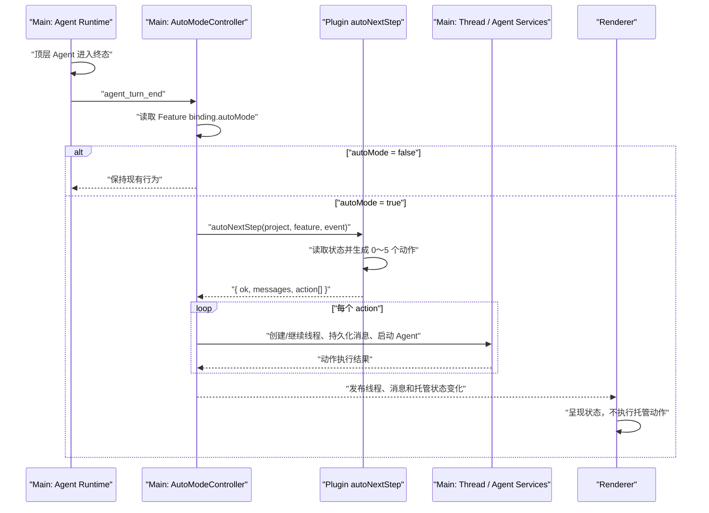

# Managed Mode V1 Design and Implementation Plan

> **For Codex:** REQUIRED SKILL: Use `executing-plans` to implement this plan task by task.

**Goal:** 在用户为 Feature 开启托管模式后，由框架在 Agent 结束时调用插件决策接口，并在不抢占当前页面的前提下继续已有会话或创建并启动一个或多个新会话。

**Architecture:** 第一版在 Main 中建立统一的 `AutoModeController` 控制面。插件负责读取业务状态、判断下一步并返回平台动作；Main 负责事件、线程、工作区、Skill、消息和 Agent Runtime 操作；Renderer 只订阅并呈现状态，不参与托管动作执行。

**Tech Stack:** Electron、TypeScript、React、现有 Harness Board 插件命令机制、现有 Thread/Agent IPC 与消息持久化机制。

---

## 1. 背景

现有项目模式已经支持：

- 插件定义 Feature 工作流和阶段；
- 插件提供阶段对应的 `nextAction`；
- 框架创建绑定 Feature 的会话；
- 框架根据 Feature 和工作区调用 `session_context_inject`；
- Chat 页面根据 `nextAction` 选择 Skill 并填入用户消息。

目前 Feature 开发过程仍然需要用户手动完成以下机械操作：

- Agent 结束后输入“继续”；
- 上下文占用较高时创建新会话；
- 为新会话重新选择工作区、Skill 和用户消息；
- 根据插件状态判断启动一个或多个后续会话。

第一版托管模式的目标是自动完成这些平台操作，同时保持插件和框架的职责边界。

## 2. 设计目标

### 2.1 功能目标

1. Feature 创建时提供托管模式开关。
2. 将开关持久化为 Feature binding 的 `autoMode`。
3. 只在顶层 Agent 运行结束后调用插件 `autoNextStep`。
4. 向插件传递 Agent 结束事件和上下文占用。
5. 插件一次最多返回 5 个动作。
6. 框架支持：
   - 继续来源会话；
   - 创建一个或多个新会话；
   - 填入 Skill 和用户消息；
   - 根据 `autoSend` 决定是否自动发送；
   - 结束当前自动推进链。
7. 新会话workspace：如果插件返回了 workspace，则使用插件的返回的绝对路径。否则默认自动继承来源会话的 workspace。
8. 托管动作不主动切换用户当前正在查看的页面或会话。
9. 特性创建好以后，如果开启了托管模式开关，仍需要用户创建第一个活跃的会话，然后才会激活托管模式。

### 2.2 非功能目标

- `autoMode=false` 时与现有行为完全一致。
- 事件和动作协议保留后续扩展能力。
- 框架不理解插件自定义阶段和 Task 图。
- 托管控制面和动作执行统一归属 Main，不依赖 Renderer 页面或组件生命周期。
- 保持现有 ChatContainer 和 Renderer → Main IPC 契约不变。
- 第一版不引入新的 ManagedRun、Action Queue 或调度状态持久化文件。
- 第一版不依赖 Goal 模式状态，只复用已有 Agent 自动提交能力。

## 3. 第一版非目标

第一版不实现：

- 修改插件源码；
- Agent 数量限制；
- Task 依赖和并发编排；
- workspace/worktree 冲突调度；
- 无效循环检测；
- Token、时间或成本预算；
- 插件命令重试；
- 动作幂等和应用重启恢复；
- Feature 级暂停、恢复和接管；
- 统一消息中心；
- 完整决策审计和可观测系统；
- Goal 模式接入；
- 工具调用、工具入参返回和文件修改日志上报。

本设计定义插件最终需要实现的 `autoNextStep` 协议，但首轮代码实施不修改插件仓库。框架在插件未提供该命令时必须保持现有行为，不得影响非托管 Feature。

## 4. 核心职责边界

### 4.1 LLM

- 生成 Feature 的业务计划和 Task 图；
- 执行具体研发工作；
- 按插件约定更新结构化 Task 状态；
- 产出插件需要的文件和 Evidence。

### 4.2 插件

- 读取并校验结构化业务状态；
- 判断哪些 Task 已完成、运行中、阻塞或 ready；
- 根据当前状态决定是否继续、创建新会话或结束；
- 将业务计划编译成框架可以执行的 action 数组；
- 必要时在返回 action 前推进插件自己的业务状态。

### 4.3 框架

- 感知顶层 Agent 运行结束；
- 收集会话和上下文占用事实；
- 调用插件命令；
- 校验插件返回结构；
- 由 Main `AutoModeController` 统一执行 action；
- 在 Main 中创建线程、继承 workspace；
- 在 Main 中解析 Skill、准备并持久化用户消息；
- 根据 `autoSend` 从 Main 启动 Agent；
- 记录动作执行结果并向 Renderer 发布状态变化；
- Renderer 只负责展示线程、消息、运行状态和待发送 draft；
- 托管动作不抢占用户当前页面。

框架不判断：

- Task 业务上是否完成；
- Task 之间是否存在依赖；
- 哪些 Task 允许并行；
- Feature 是否满足自定义 Gate。

## 5. 总体架构



当前方案是插件驱动的业务调度：

```text
LLM 生成并维护结构化 Task 状态
  → 插件解析状态并计算 ready Task
  → 插件生成平台 action
  → 框架执行 action
```

框架无需理解完整 Task 图。只有未来出现跨插件资源治理、统一 Task UI 或平台级任务恢复需求时，才考虑引入框架级工作图模型。

## 6. Feature 托管配置

### 6.1 创建接口

扩展 `HarnessFeatureCreateInput`：

```ts
interface HarnessFeatureCreateInput {
  projectId: string
  feature: string
  selectedDeployUnits?: string[]
  sessionContextInjectionSource?: string
  autoMode?: boolean
}
```

约束：

- UI 默认 `false`；
- 未传入时按 `false` 处理；
- 第一版只在创建 Feature 时设置；
- 第一版不提供后续编辑入口；
- `false` 时不注册或触发任何托管行为。

### 6.2 持久化结构

配置继续存储在：

```text
/Users/sixinjian/.cmbcoworkagent/harness-board-features.json
```

示例：

```json
{
  "version": 1,
  "bindings": [
    {
      "projectId": "project-001",
      "featureId": "payment-callback",
      "selectedDeployUnitMappings": [],
      "sessionContextInjectionSource": "plugin",
      "autoMode": true,
      "createdAt": "2026-07-28 16:30:00",
      "updatedAt": "2026-07-28 16:30:00"
    }
  ]
}
```

兼容规则：

- 文件版本继续使用 `version: 1`；
- 老记录缺少 `autoMode` 时按 `false` 处理；
- 更新部署单元时保留原有 `autoMode`；
- 时间字段使用 GMT+8 的 `YYYY-MM-DD HH:mm:ss`。

Feature 配置层第一版只新增 `autoMode`。`autoSend=false` 产生的
`PendingAutoDraft` 复用现有 Thread metadata/thread values 持久化，不新增独立文件；
第一版不增加 ManagedRun、Action Queue 或调度状态文件。

## 7. 触发事件

### 7.1 第一版事件类型

第一版传给插件的事件只有：

```text
agent_turn_end
```

它表示一次用户可见的顶层 Agent 运行真正进入终态。

正常完成、错误和用户取消使用同一个事件，通过 `outcome` 区分。

补充：用户取消的时候，不再触发下一次 autoNextStep 留给用户手动操作，并在对话框 toast 提示

### 7.2 触发条件

同时满足以下条件时调用 `autoNextStep`：

1. 当前线程绑定 Harness Feature；
2. Feature binding 的 `autoMode=true`；
3. 当前运行是用户可见的顶层 Agent 运行；
4. Agent 已正常完成、错误终止或被用户取消；
5. Agent Runtime 已进入最终清理阶段。

以下情况不触发：

- Agent 开始运行；
- Agent 调用工具；
- Agent 修改文件；
- 上下文占用超过阈值；
- 弹出文件或权限审批；
- 等待 `request_user_input`；
- 创建新会话完成；
- 自动消息发送成功；
- 内部通知运行；
- Goal continuation；
- 子 Agent 内部运行。

审批或用户输入等待仍属于本次 Agent 运行，不是 `agent_turn_end`。

### 7.3 事件扩展模型

```ts
interface AutoModeEventBase {
  eventId: string
  eventType: string
  eventTime: string
  threadId: string
}

interface AgentTurnEndEvent extends AutoModeEventBase {
  eventType: "agent_turn_end"
  outcome: "success" | "error" | "cancelled"
  endReason: {
    code:
      | "normal"
      | "provider_error"
      | "user_cancelled"
      | "hook_halt"
      | "failure_fuse"
      | "unknown"
    message?: string
  }
  contextUsage?: {
    inputTokens: number
    maxTokens: number
  }
}

type AutoNextStepEvent =
  | AgentTurnEndEvent
  // 后续在此增加其他 eventType
```

示例：

```json
{
  "eventId": "3bff91a4-d688-4f2b-b05d-f57fa994621d",
  "eventType": "agent_turn_end",
  "eventTime": "2026-07-28 16:30:00",
  "threadId": "c2f2e928-456f-4739-a609-3e2fb68b92ca",
  "outcome": "success",
  "endReason": {
    "code": "normal"
  },
  "contextUsage": {
    "inputTokens": 90000,
    "maxTokens": 128000
  }
}
```

说明：

- 不包含 `protocolVersion`；
- 不包含 `runId`；
- `eventTime` 使用 GMT+8 的 `YYYY-MM-DD HH:mm:ss`；
- `threadId` 是来源会话的持久化 ID；
- `eventId` 由 Main `AutoModeController` 为本次事件生成；
- `contextUsage` 无法可靠获得时整体省略；
- 插件需要上下文比例时自行计算 `inputTokens / maxTokens`。

后续协议扩展遵循：

- 新增事件时增加新的 `eventType`；
- 现有事件只增加可选字段；
- 不修改已有字段含义；
- 破坏性变化使用新的 `eventType`；
- 框架只向声明支持对应事件的插件发送未来事件。

## 8. 插件调用协议

### 8.1 命令

目标命令：

```text
autoNextStep --project ${projectDir} --feature ${feature} --event-json ${eventJson}
```

插件配置中的建议命令键：

```text
auto_next_step
```

约定：

- `${projectDir}` 是插件对应项目目录；
- `${feature}` 是 Feature ID/slug；
- `${eventJson}` 作为一个独立 argv 参数传入；
- stdout 只输出最终 JSON；
- 日志写入 stderr；
- 第一版不重试、不重传；
- 插件在返回前自行完成必要的业务状态推进。

本轮不修改插件源码；此命令作为框架集成契约保留。

### 8.2 顶层返回结构

```ts
interface AutoNextStepResult {
  ok: boolean
  messages: string
  action: AutoNextStepAction[]
}
```

字段含义：

| 字段 | 含义 |
| --- | --- |
| `ok` | 插件是否成功完成本次判断 |
| `messages` | 插件对本次判断的说明，第一版用于日志，后续可进入消息中心 |
| `action` | 框架需要执行的动作数组，长度为 0～5 |

`ok=false` 时：

```json
{
  "ok": false,
  "messages": "无法确定 Feature 当前状态。",
  "action": []
}
```

框架不执行动作、不重试，只记录 `messages`。

### 8.3 Action 类型

```ts
type AutoNextStepAction =
  | ContinueCurrentSessionAction
  | CreateNewSessionAction
  | CompleteAction

interface ContinueCurrentSessionAction {
  actionType: "continue_current_session"
  nextAction: AutoModeNextAction
}

interface CreateNewSessionAction {
  actionType: "create_new_session"
  nextAction: AutoModeNextAction
}

interface CompleteAction {
  actionType: "complete"
}

interface AutoModeNextAction {
  slashSkill?: string
  userMessage?: string
  autoSend: boolean
}
```

托管模式的 `AutoModeNextAction` 不包含 `preferredPlugin`。框架根据 Feature 绑定的 Harness 插件解析 `slashSkill`。

现有通用 `HarnessWorkflowNextAction.preferredPlugin` 暂不删除，避免影响非托管流程。

### 8.4 Action 数组约束

- `action` 必须是数组；
- 长度允许为 0～10；
- 超过10个时整个响应无效，不截断执行；
- 每个 action 拥有独立的 `nextAction`；
- 一次响应最多包含一个 `continue_current_session`；
- `complete` 必须是数组中的唯一 action；
- `autoSend=true` 时 `userMessage` 必须非空；
- `create_new_session + autoSend=true` 时 `slashSkill` 必须非空；
- `autoSend` 缺失时按 `false` 处理。
- sessionWorkspace存在时使用它作为新开会话的工作空间，不存在时则继承触发事件会话 工作区

`action: []` 表示插件判断成功，但当前没有可执行动作，例如其他依赖 Task 仍在运行。

`complete` 表示当前自动推进链完成，框架不执行任何平台动作。第一版不自动将 Feature 的 `autoMode` 改为 `false`。

### 8.5 多会话示例

```json
{
  "ok": true,
  "messages": "分别启动后端、前端和待确认的集成验证会话。",
  "action": [
    {
      "actionType": "create_new_session",
      "sessionWorkspace": "/User/info/test"
      "nextAction": {
        "slashSkill": "autodev-code",
        "userMessage": "完成支付回调后端接口。",
        "autoSend": true
      }
    },
    {
      "actionType": "create_new_session",
      "nextAction": {
        "slashSkill": "frontend-design",
        "userMessage": "完成支付结果前端页面。",
        "autoSend": true
      }
    },
    {
      "actionType": "create_new_session",
      "nextAction": {
        "slashSkill": "autodev-code",
        "userMessage": "准备集成验证，暂时不要执行。",
        "autoSend": false
      }
    }
  ]
}
```

框架不理解三个 action 之间的业务依赖；它们被视为插件已经确认可执行的独立平台操作。

### 8.6 Task fan-in 示例

T2 结束时，T3 仍在运行：

```json
{
  "ok": true,
  "messages": "T4 仍在等待 T3 完成。",
  "action": []
}
```

T3 结束后，插件从结构化文件确认 T2、T3 均完成：

```json
{
  "ok": true,
  "messages": "T4 的前置任务均已完成。",
  "action": [
    {
      "actionType": "create_new_session",
      "nextAction": {
        "slashSkill": "autodev-code",
        "userMessage": "执行 T4 集成验证。",
        "autoSend": true
      }
    }
  ]
}
```

这类依赖判断由插件完成，框架无需持有任务图。

## 9. threadId 和 workspace

### 9.1 来源 threadId

插件不需要在 action 中返回 `threadId`。Main `AutoModeController` 调用插件时已经持有 `agent_turn_end.threadId`，并在动作执行上下文中保留为 `sourceThreadId`。

### 9.2 continue_current_session

`continue_current_session` 始终作用于 `sourceThreadId`，而不是用户当前选中的会话。

### 9.3 create_new_session

每个 `create_new_session`：

1. 根据 `sourceThreadId` 读取来源线程 metadata；
2. 获取来源 `workspacePath`；
3. 创建新的线程并生成新的 `threadId`；
4. 写入继承的 `workspacePath`；
5. 绑定相同的 `projectId` 和 `featureId`；
6. 使用该 action 自己的 `nextAction`。

插件不传 workspace，也不需要知道新生成的 threadId。

未来如果插件需要知道动作与新 threadId 的映射，可新增 `auto_actions_executed` 事件；第一版不实现。

## 10. UI 交互

### 10.1 总体原则

> 托管动作不主动改变用户当前正在查看的页面或会话。

用户停留在以下页面时，均可以后台创建并启动会话：

- 项目列表页；
- Feature 详情页；
- 其他 Chat 会话；
- 其他应用主页面。

托管动作执行不依赖当前页面或 Chat 组件是否挂载。应用完全退出后，第一版不会继续执行，也不会在重启后恢复丢失的 action。

这里的“不主动改变页面”只约束托管 action 本身。托管启动的 Agent 后续如果请求权限审批或风险确认，继续复用现有全局审批机制；审批 UI 可以提示用户并切换到对应会话。审批等待仍属于正在运行的 Agent，不触发 `agent_turn_end`。

### 10.2 continue_current_session

#### autoSend=true

- 目标是 `sourceThreadId`；
- 如果来源会话当前可见，用户会看到用户消息被提交并开始输出；
- 如果来源会话当前不可见，不跳转；
- 后台追加用户消息并启动 Agent；
- 会话列表更新为运行状态；
- 用户以后打开时可以看到完整消息和 Agent 输出。

#### autoSend=false

- 不跳转；
- Main 将待发送 Skill 和 userMessage 持久化为来源线程的 `pendingAutoDraft`；
- Renderer 收到线程状态变化后刷新当前页面；
- 如果来源会话当前可见，ThreadProvider 从线程状态消费并恢复 draft；
- 如果当前不可见，用户以后打开时再消费并恢复 draft；
- draft 成功写入现有 Renderer draft state 后清除 `pendingAutoDraft`，避免再次打开时重复填入；
- 不启动 Agent。

### 10.3 create_new_session

#### autoSend=true

- 后台创建新会话；
- 不切换当前页面；
- 继承 workspace；
- 绑定 Feature；
- 根据 Feature 插件解析 Skill；
- 写入并提交用户消息；
- 启动 Agent；
- 新会话在会话列表中显示运行状态。

由于消息已提交，用户以后打开新会话时看到的是用户消息气泡，而不是仍留在输入框中的草稿。

#### autoSend=false

- 后台创建新会话；
- 不切换当前页面；
- Main 将待发送 Skill 和 userMessage 持久化为新线程的 `pendingAutoDraft`；
- 新会话保持空闲；
- 用户以后打开该会话时，ThreadProvider 一次性消费 `pendingAutoDraft`，Skill 被选中，userMessage 被填入输入框；
- 用户可以修改后手动发送。

### 10.4 complete

- 不创建线程；
- 不切换页面；
- 不填入消息；
- 不启动 Agent；
- 当前自动推进链结束。
- complete 表示插件判断本次 agent_turn_end 不需要创建或继续任何会话；它不改变 Feature 的 autoMode 配置。

### 10.5 多动作 UI

插件一次返回多个新会话时：

```text
用户当前页面保持不变

会话列表新增：
- 会话 B：运行中
- 会话 C：运行中
- 会话 D：空闲，已保存待发送 draft
```

框架可以串行完成“创建线程和提交请求”这段很短的平台操作，但不限制已启动 Agent 的并发数量。

## 11. Main AutoModeController

第一版将托管决策和动作执行统一放在 Main。Renderer 不创建托管线程、不提交托管 Agent，也不维护托管 action 生命周期。

`AutoModeController` 负责：

1. 接收顶层 `agent_turn_end`；
2. 查询 Feature binding 和 `autoMode`；
3. 调用插件 `autoNextStep`；
4. 校验插件返回的 0～10个 action；
5. 为每个 action 建立 Main 内部执行上下文；
6. 调用 Thread Service 和 Agent Run Service；
7. 在内存中记录动作执行结果；
8. 发布线程、消息和托管状态变化；
9. 不执行任何页面导航。

建议形成：

```ts
interface ManagedActionExecutionContext {
  eventId: string
  sourceThreadId: string
  projectId: string
  featureId: string
  messages: string
}

interface ManagedActionResult {
  eventId: string
  actionIndex: number
  actionType: AutoNextStepAction["actionType"]
  status: "succeeded" | "failed"
  targetThreadId?: string
  message?: string
}
```

第一版不持久化 `ManagedActionResult`，但结果必须由 Main 产生并持有，为后续动作审计和恢复留出接口。

## 12. Main Thread Service 与 Agent Run Service

现有线程创建和 Agent 启动逻辑位于 Main IPC handler 中，但直接面向 Renderer IPC。为了让 AutoModeController 在不依赖 Renderer 的情况下复用相同行为，需要先进行行为保持型服务抽取。

### 12.1 Thread Service

将 `threads:create` handler 中的核心逻辑抽成：

```ts
async function createThreadService(
  metadata?: Record<string, unknown>
): Promise<Thread>
```

调用关系：

```text
现有 threads:create IPC ───┐
                           ├── createThreadService
AutoModeController ───────┘
```

该服务继续负责：

- 生成 threadId；
- 写入 thread metadata；
- 处理显式 workspace；
- 应用默认 model 和 agentMode；
- 持久化 Thread。

现有 `threads:create` IPC 契约和 Renderer 调用方式保持不变。

### 12.2 Agent Run Service

将 `agent:invoke` handler 的核心运行逻辑抽成 Main 内部服务：

```ts
interface AgentRunRequest {
  threadId: string
  message: string
  modelId?: string
  streamRequestId?: string
  userMessageId?: string
  agentMode?: "normal" | "coordinator" | "workflow"
  coordinatorInternalNotification?: boolean
}

interface AgentRunDelivery {
  window: BrowserWindow
  send(channel: string, payload: unknown): void
  isAvailable(): boolean
}

async function runAgent(
  request: AgentRunRequest,
  delivery: AgentRunDelivery
): Promise<void>
```

调用关系：

```text
现有 agent:invoke IPC ─────┐
                          ├── runAgent
AutoModeController ──────┘
```

抽取要求：

- 原有 IPC 参数保持不变；
- 原有 Stream channel 和事件顺序保持不变；
- 原有 Main 侧用户消息、流式消息和 Thread 状态持久化保持不变；
- 原有审批、Hook、Goal、Workflow、Coordinator、取消和清理行为保持不变；
- 第一阶段只做机械抽取，不顺便整理或改写分支；
- 原有 IPC handler 变成薄适配器；
- AutoModeController 使用 Main 内部入口，不伪造 IPC event。

现有 `agent:invoke` 使用来源 `BrowserWindow` 构造 `AgentRunDelivery`；
AutoModeController 使用应用注册的可用主窗口构造 delivery。delivery 只负责把流式状态和审批请求送到 UI，
Agent 运行所有权、消息持久化和结束清理由 Main 持有。只要应用仍有可用主窗口，即使用户位于项目列表页、
Feature 详情页或其他会话，也可以启动托管 Agent。

执行多个 `autoSend=true` action 时，AutoModeController 串行完成消息准备和 Agent 启动调用，
但不等待前一个 Agent 运行结束后再启动下一个。每个 Agent 的完成 Promise 由 Main Runtime 独立持有，
结束时分别产生新的 `agent_turn_end`。

### 12.3 Harness 托管消息准备

托管模式只支持纯文本 `userMessage` 和一个由 `slashSkill` 解析得到的 Skill，不处理：

- 附件和 `@文件`；
- Goal 命令；
- Chat 消息草稿队列；
- 输入框、滚动或 Toast；
- Renderer 页面状态。

Main 增加 Harness 专用消息准备能力：

```ts
interface PrepareHarnessMessageInput {
  projectId: string
  featureId: string
  userMessage: string
  slashSkill?: string
}

interface PreparedHarnessMessage {
  modelMessage: string
  displayMessage: string
  userMessageId: string
}
```

Main 根据 Feature 绑定插件解析 Skill，使用共享的 `formatSkillUseBlock` 构造模型消息，持久化可见用户消息，然后调用 `runAgent`。

`session_context_inject` 继续通过现有 Harness Agent Context 路径，在 Agent 模型调用前执行。Action 不携带 session context，也不携带 workspace。

### 12.4 autoSend=false

`autoSend=false` 时 Main 不启动 Agent，而是将待发送内容持久化到 thread metadata 或 thread values：

```ts
interface PendingAutoDraft {
  source: "managed_mode"
  slashSkill?: string
  userMessage?: string
}
```

Renderer 的 ThreadProvider 初始化或打开线程时读取 `PendingAutoDraft`，并映射为现有
`draftInput` 和 `draftSkill`。成功写入 Renderer draft state 后立即通过线程更新接口清除该字段。
因此后续用户发送、修改或清空只操作现有 draft state，不需要改动 `ChatContainer` 的提交和清空逻辑。

`ChatContainer` 的 `handleSubmit` 和现有用户发送链路保持不变。

### 12.5 非 Harness 路径隔离

服务抽取后保留两条入口：

```text
现有 Renderer 发送
  → 原 agent:invoke IPC 参数
  → 原 BrowserWindow delivery
  → runAgent

托管模式
  → AutoModeController
  → Main 内部 AgentRunRequest
  → 应用主窗口 delivery
  → runAgent
```

两条入口只在调用来源和 delivery 构造上不同，共享同一个 Agent Runtime。AutoModeController 只会在
Harness Feature、`autoMode=true` 且顶层运行结束时进入；普通 Chat、非 Harness Thread 和
`autoMode=false` 不会经过任何托管分支。

## 13. Main 与 Renderer 的状态通知

Main 完成线程创建、消息写入或动作状态变化后，只向 Renderer 发布状态通知。Renderer 不接收待执行 action。

建议使用通用状态事件：

```text
harnessBoard:autoModeStateChanged
```

Payload：

```ts
interface AutoModeStateChangedEvent {
  eventId: string
  projectId: string
  featureId: string
  sourceThreadId: string
  messages: string
  results: ManagedActionResult[]
}
```

Preload 暴露：

```ts
window.api.harnessBoard.onAutoModeStateChanged(
  listener: (event: AutoModeStateChangedEvent) => void
): () => void
```

Renderer 收到通知后只刷新：

- Thread 列表；
- Thread 状态；
- 当前可见消息；
- `pendingAutoDraft`；
- 后续消息中心需要的提示。

Renderer 不调用 `createThread`、`stream.submit` 或页面导航。该状态事件第一版不持久化。

## 14. 失败和边界行为

第一版基于以下假设：

- 插件命令不会失败；
- 插件状态推进不会失败；
- 框架动作不会失败；
- 不发生事件重传；
- 暂不处理用户与自动动作之间的竞态；
- 暂不处理应用退出和重启恢复。

仍需进行基本结构校验：

- stdout 必须是合法 JSON；
- `ok` 必须是 boolean；
- `messages` 必须是 string；
- `action` 必须是数组；
- action 数量不得超过 5；
- `actionType` 必须是支持值；
- `nextAction` 必须满足 `autoSend` 对字段的要求；
- `complete` 必须是唯一 action；
- `continue_current_session` 最多一个。

返回结构无效时，框架不执行部分动作，不做截断或猜测。

## 15. 后续兼容设计

### 15.1 新事件

通过新增 `eventType` 扩展，例如：

- `approval_resolved`；
- `user_input_resolved`；
- `auto_actions_executed`；
- `application_recovered`。

第一版只发送 `agent_turn_end`。

### 15.2 可靠托管

未来可以增加：

- Feature 级 ManagedRun；
- actionId；
- 动作执行状态；
- 待执行动作持久化；
- 幂等和重试；
- 应用重启恢复；
- 暂停、恢复、接管；
- 循环和预算保护。

这些能力不要求框架理解 Task 图。

### 15.3 插件驱动业务调度

插件继续根据结构化 Task 文件执行：

```text
读取全图
  → 找出 pending Task
  → 检查依赖是否 completed
  → 生成 0～5 个 action
```

只有未来需要跨插件资源治理、平台级 Task UI 或统一 workspace 调度时，才考虑让框架持有标准化 WorkUnit 图。

### 15.4 消息中心和可观测

现有事件和结果已经保留：

- `eventId`；
- `eventType`；
- `eventTime`；
- `sourceThreadId`；
- 插件 `messages`；
- action 数组。

后续可以在不修改插件核心协议的前提下，将这些数据写入消息中心或审计存储。

## 16. 架构决策记录

### ADR-001：框架不理解 Task 图

**决策：** 第一版由插件解析 LLM 维护的结构化 Task 状态，并直接返回 action。

**理由：**

- 当前不做依赖调度和资源治理；
- 将任务图引入框架只会增加协议和双状态同步复杂度；
- 插件已经可以基于结构化文件实现 fan-out/fan-in；
- 不同插件可以保留自己的工作流语义。

**后果：** 框架无法提供统一 Task 级 UI 和跨插件调度，但不影响第一版自动推进。

### ADR-002：Action 使用数组

**决策：** 插件一次返回 0～10个 action。

**理由：**

- 支持一次启动多个独立会话；
- 支持某个 Agent 结束时暂时没有 ready Task；
- 避免为 fan-out 增加额外接口。

**后果：** 框架需要校验 action 组合，但不理解 action 之间的业务依赖。

### ADR-003：托管动作不自动导航

**决策：** 自动创建和自动继续均不切换用户当前页面。

**理由：**

- 一次可能创建多个会话；
- 页面连续切换会打断用户；
- 用户可能正在项目列表、Feature 详情或其他会话中工作。

**后果：** 托管动作由 Main 执行，Renderer 只接收状态变化，不依赖 `ChatContainer` 挂载。

### ADR-004：不向插件回传 threadId

**决策：** action 不包含来源或目标 threadId。

**理由：**

- 来源 threadId 已存在于触发事件和 AutoModeController 上下文；
- 新 threadId 由框架生成；
- 插件负责业务决策，不负责平台线程寻址。

**后果：** 插件第一版不知道新线程 ID；未来通过新的执行结果事件扩展。

### ADR-005：第一版不持久化托管运行状态

**决策：** 不持久化 ManagedRun、Action Queue 和动作执行结果。Feature binding 持久化
`autoMode`；`autoSend=false` 仅在目标 Thread 中暂存一次性 `PendingAutoDraft`。

**理由：**

- 当前明确不做重试、恢复和循环保护；
- 避免提前引入 ManagedRun 和动作状态机。

**后果：** 应用退出时未执行的内存 action 会丢失；已创建线程中的待发送 draft 可以恢复，
但不会恢复或重放托管 action。

### ADR-006：控制面统一归属 Main

**决策：** 托管决策、线程创建、消息写入和 Agent 启动统一由 Main `AutoModeController` 执行；Renderer 只观察状态。

**理由：**

- 线程数据库和 Agent Runtime 原本就在 Main；
- UI 页面生命周期不应决定托管动作能否执行；
- 避免多窗口或 Renderer 重载导致动作生命周期不一致；
- 为后续动作审计、恢复和消息中心保留统一控制面。

**后果：**

- 需要将现有 `threads:create` 和 `agent:invoke` 核心逻辑抽成 Main 内部服务；
- Renderer 不新增托管动作执行器；
- `autoSend=false` 需要持久化 `PendingAutoDraft`；
- `ChatContainer` 的 `handleSubmit` 和现有 IPC 契约保持不变；
- 第一版托管消息不支持附件、`@文件` 或 Goal；
- Agent 运行中的审批交互继续复用现有全局审批机制，框架不会自动批准。

### ADR-007：行为保持型抽取先于托管接入

**决策：** 先单独抽取 Thread Service 和 Agent Run Service，验证现有行为不变后，再接入 AutoModeController。

**理由：**

- `agent:invoke` 是所有会话共用的运行热路径；
- 将重构和新功能混在一次改动中会扩大问题定位范围；
- 保持原 IPC、Stream channel 和事件顺序可以降低非 Harness 回归风险。

**后果：** 实施步骤增加，但 ChatContainer 和非 Harness UI 无需改变。

## 17. 框架侧实施计划

> 按仓库工作约定，代码实施前需要再次确认；不得主动新增或修改测试。若需要增加自动化测试，应单独征得确认。

### Task 1：增加共享数据类型

**Files:**

- Modify: `src/shared/harness-board-types.ts`

**Changes:**

- 增加 `autoMode`；
- 增加 `AutoModeEventBase`、`AgentTurnEndEvent`；
- 增加 `AutoNextStepResult`；
- 增加 action 联合类型；
- 增加 `ManagedActionResult`、`AutoModeStateChangedEvent` 和 `PendingAutoDraft`；
- 保留现有 `HarnessWorkflowNextAction`，不全局删除 `preferredPlugin`。

### Task 2：扩展 Feature binding 持久化

**Files:**

- Modify: `src/main/harness-board/service.ts`

**Changes:**

- 老记录归一化为 `autoMode=false`；
- Feature 创建时保存 `autoMode`；
- Feature deploy unit 更新时保留 `autoMode`；
- 增加按 projectId/featureId 查询 Feature binding 的内部方法；
- 时间继续使用现有 GMT+8 格式化方法。

### Task 3：增加 Feature 级别的 autoMode 开关

**Files:**

- Modify: `src/renderer/src/components/harness-board/HarnessBoardView.tsx`

**Changes:**

- Feature 创建完成后，在详情页编辑绑定的发布单元左侧添加“托管模式（自动推进）”开关；
- 默认关闭；
- createFeature payload 传入 `autoMode`；
- 不改变编辑 Feature 和非托管 Feature 行为。
- 如果插件不存在 autoNextStep 命令则该开关置灰色，不可打开

### Task 4：增加插件命令框架适配

**Files:**

- Modify: `src/main/harness-board/service.ts`

**Changes:**

- 增加逻辑命令 `autoNextStep`；
- 映射配置键 `auto_next_step`；
- 增加 `${eventJson}` placeholder；
- 调用现有 JSON invocation 能力；
- 校验顶层结果和 action 数组；
- 插件未配置命令时安全返回，不影响现有运行。

**Scope note:** 本 Task 只修改框架适配，不修改插件配置或脚本。

### Task 5：行为保持型抽取 Thread Service

**Files:**

- Create: `src/main/services/thread-service.ts`
- Modify: `src/main/ipc/threads.ts`

**Changes:**

- 将现有 `threads:create` 的核心逻辑机械抽成 `createThreadService`；
- 保持 threadId、workspace、model、agentMode 和 title 规则不变；
- 保持 `threads:create` IPC 参数和返回值不变；
- 现有 IPC handler 只委托调用 service；
- 本 Task 不接入托管模式。

### Task 6：行为保持型抽取 Agent Run Service

**Files:**

- Create: `src/main/agent/agent-run-service.ts`
- Modify: `src/main/ipc/agent.ts`

**Changes:**

- 将现有 `agent:invoke` 核心逻辑机械抽成 `runAgent`；
- 引入 `AgentRunDelivery`，继续使用现有 BrowserWindow 完成 Stream 和审批输出；
- 保持 `AgentInvokeParams`、IPC channel 和事件顺序不变；
- 保持 Main 侧 transcript、消息时间和 Thread 状态持久化行为不变；
- 保持审批、Hook、Goal、Workflow、Coordinator、取消和清理行为不变；
- 现有 IPC handler 只负责构造 sink 并调用 service；
- 本 Task 不接入托管模式，也不修改 `ChatContainer.tsx`。

### Task 7：新增 Main AutoModeController

**Files:**

- Create: `src/main/harness-board/managed-orchestrator.ts`
- Create: `src/main/harness-board/managed-action-executor.ts`
- Create: `src/shared/skill-use-block.ts`
- Modify: `src/renderer/src/features/slash-commands/skill-marker.ts`
- Modify: `src/main/harness-board/service.ts`
- Modify: `src/main/ipc/agent.ts`

**Changes:**

- 在顶层 Agent 最终结束路径构造 `agent_turn_end`；
- 使用 `highWaterInputTokens` 和实际模型上下文上限构造 `contextUsage`；
- 排除审批等待、内部通知、Goal continuation 和子 Agent；
- 查询 Feature binding，`autoMode=false` 时直接返回；
- 调用 `autoNextStep` 并校验 action 数组；
- `continue_current_session` 使用来源 threadId；
- `create_new_session` 调用 `createThreadService` 并继承 workspace；
- Main 解析 Skill、构造并持久化可见用户消息；
- `autoSend=true` 调用 `runAgent`；
- 多个 `autoSend=true` action 只串行发起，不等待前一个 Agent 结束；
- `autoSend=false` 持久化 `PendingAutoDraft`；
- `complete` 和空 action 数组不执行平台动作；
- 在 Main 内存中生成 `ManagedActionResult`；
- 将 Skill block 的纯格式化逻辑移到 shared，Renderer 原模块保持兼容导出；
- 不修改 `ChatContainer.tsx`；
- 托管消息不处理附件、`@文件`、Goal 和 Chat 消息队列。

### Task 8：增加 Renderer 状态观察

**Files:**

- Modify: `src/preload/index.ts`
- Modify: `src/preload/index.d.ts`
- Modify: `src/renderer/src/lib/thread-context.tsx`
- Modify: `src/renderer/src/lib/store.ts`

**Changes:**

- 增加 `harnessBoard:autoModeStateChanged`；
- 暴露 `onAutoModeStateChanged` 和 listener cleanup；
- 收到通知后刷新 Thread 列表和相关 Thread 状态；
- Thread 初始化时读取 `PendingAutoDraft`；
- 将 `PendingAutoDraft` 映射为现有 draftInput 和 draftSkill；
- 成功恢复到 Renderer draft state 后清除 `PendingAutoDraft`；
- 后续发送、修改和清空继续走现有 ChatContainer 逻辑；
- Renderer 不接收或执行 action；
- Renderer 不调用托管 `createThread` 或 `stream.submit`；
- 不调用页面导航；
- 不修改 `ChatContainer.tsx`。

### Task 9：局部验证

**Existing checks:**

```bash
npm run typecheck:node
npm run typecheck:web
npx vitest run src/shared/harness-board-types.test.ts
npm run build
```

Lint 只对本次改动文件运行，不使用 `--fix`，不运行全项目 lint 或格式化。

手工验证场景：

1. `autoMode=false` 时行为与现有版本一致；
2. 老 Feature binding 缺少 `autoMode` 时按 false；
3. 项目列表页收到 `create_new_session + autoSend=true`，页面不跳转，新会话后台运行；
4. Feature 详情页一次创建 3 个新会话，当前页面保持不变；
5. `autoSend=false` 通过 Thread state 保存 draft，新会话打开后正确显示 Skill 和消息；
6. 来源会话不可见时 `continue_current_session` 不跳转且后台运行；
7. `action: []` 时不创建会话；
8. `complete` 时不执行动作；
9. 超过 5 个 action 时全部拒绝；
10. 审批弹窗期间不触发 `agent_turn_end`；
11. success/error/cancelled 正确传递；
12. 新会话优先使用插件返回的路径，未传递则继承来源 workspace；
13. Agent 调用前继续执行现有 `session_context_inject`；
14. 普通 Chat 的手动发送、Skill、Stream、取消、错误和审批行为与抽取前一致；
15. 非 Harness Thread 和 `autoMode=false` 不进入 AutoModeController；
16. `PendingAutoDraft` 恢复到输入区后从 Thread 中清除，重新打开不会重复填入；
17. 托管 Agent 请求审批时继续使用现有审批 UI，审批等待不触发结束事件；
18. Renderer 只接收状态通知，不负责执行 action。

## 18. 验收标准

- `harness-board-features.json` 正确保存并兼容旧数据；
- 非托管 Feature 没有行为变化；
- 框架可以生成符合本文定义的 `agent_turn_end`；
- 框架可以解析 0～10 个 action；
- 新会话优先使用插件返回的路径，未传递则继承来源 workspace；
- 不需要插件回传 threadId；
- `autoSend=true` 可以在任意主页面后台启动 Agent；
- `autoSend=false` 可以通过目标线程 draft state 在打开会话时显示 Skill 和消息；这个可以复用现有的实现
- 自动动作不切换当前页面；
- Agent 后续触发审批时允许复用现有审批 UI 唤起对应会话；
- `ChatContainer.tsx` 保持不变；
- 现有 `threads:create`、`agent:invoke` IPC 参数、返回和 Stream channel 保持不变；
- 普通 Chat、非 Harness Thread 和非托管 Feature 行为保持不变；
- 多个新会话使用各自独立的 nextAction；
- 空 action 和 complete 都不会触发新的 Agent；
- 第一版未引入 Agent 编排、重试、恢复或消息中心。
