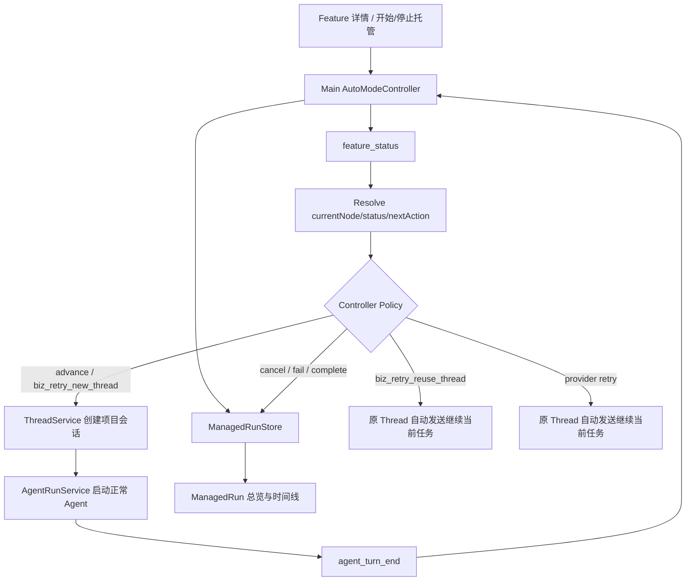

# Harness 托管模式 V2 设计与 V3 路线

- 状态：V2 设计已确认，待实施；V3 能力已定边界、暂不实施
- 更新日期：2026-08-24
- 适用范围：CMBDevClaw 项目模式中的 Harness Feature
- 当前代码基线：`feature/board_automode`
- 参考实现：V1 `AutoModeController`、内置 Dynamic Workflow 的 RunStore/Journal/Structured Output

## 1. 结论

托管模式主线采用内置 Controller，不使用 Dynamic Workflow 作为插件阶段的默认执行容器。

V2 将当前无持久状态的事件处理器升级为持久化的 `ManagedRun` Process Manager：

```text
用户点击“开始托管”
  → 创建 ManagedRun
  → 直接执行插件已有 feature_status
  → 根据 workflow/currentNode/status/nextAction 创建普通项目会话
  → 会话内按原 Skill 执行，保留 subagent、request_user_input、Hook 和多轮能力
  → Agent Turn 结束后重新 feature_status
  → Controller 决定进入下一节点、继续同一节点、重试、失败、取消或完成
```

V2 的插件准入协议只有 Harness 已有的：

- `inspectCommands.<platform>.feature_status`；
- `workflow.nodes[].states[].nextAction`；
- Feature/Thread 项目模式上下文。

插件不需要实现额外的托管动作协议，也不需要修改 Skill。V1 插件动作协议、动作数组、草稿恢复和能力门禁代码从 V2 中删除，避免形成第二控制源。

V3 才增加阶段结构化报告和按需 Side Agent：抽取现有 Workflow `structured_output` 的公共 Schema Capture 内核，但不改变原有 Workflow 行为；为托管会话新增 `managed_stage_result` 和最多三次报告补交。

## 2. 背景与 V1 现状

当前分支已经实现：

- Main 侧 `AutoModeController`；
- 顶层 Agent Turn 结束事件；
- `ThreadService` 创建真实会话；
- `AgentRunService` 从 Main 启动正常 Agent；
- 插件驱动的多动作执行；
- 后台创建会话且不抢占当前页面；
- request_user_input、审批等待不误触发 Turn End；
- Renderer 刷新 Thread。

V1 的主要问题不是事件驱动，而是没有一个长期存在的执行实例。每次 Agent 结束后，Controller 临时调用插件、发起动作、发布内存事件，然后丢失执行上下文。因此缺少：

- 循环和数量保护；
- 持久重试计数；
- action 幂等；
- App 重启后的未终态 Run 失败化；
- 用户主动停止和重新开始；
- 决策审计和完整可视化；
- 多会话的逻辑聚合；
- 可验证的当前执行游标。

V2 不把插件业务流程硬编码为 TypeScript if/else 图，而是增加固定的平台生命周期状态机；插件业务节点继续从 `feature_status` 动态读取。

## 3. 设计目标

### 3.1 V2 功能目标

1. 插件零新增协议适配即可开启托管。
2. 开启托管后立即创建 ManagedRun 并基于 `feature_status` 启动首个会话。
3. 每个阶段完成后开启新的普通项目会话；Provider Error 除外。
4. 普通会话保留原 Skill 的 subagent、request_user_input、Hook、产物和 checkpoint 行为。
5. 一个 Feature 同时最多存在一个未终态 ManagedRun。
6. ManagedRun 持久化快照、事件、动作和 Thread 关联。
7. 支持用户主动停止托管，但不取消已创建的会话。
8. App 重启后将未终态 Run 标记为 failed，不自动继续；下次开启创建新的 Run。
9. 支持 Provider Error 在当前 App 生命周期内有界重试，并持久化该重试计数。
10. 支持当前阶段未完成时有界 Biz Retry，并根据业务进展、上下文占用选择复用当前 Thread 或创建新 Thread。
11. Feature 详情页展示完整托管总览、两类重试状态、决策原因和时间线。
12. 自动创建的 Thread 在 V2 与普通 Feature 会话同等展示。
13. 普通 Chat、非 Harness Thread、没有活跃 ManagedRun 的行为不变。

### 3.2 V2 非目标

V2 不实现：

- `managed_stage_result`；
- 修改 Workflow `structured_output`；
- Recovery Side Agent；
- action 幂等与执行恢复；
- event journal replay；
- App 重启后复用或找回旧 Thread；
- 平台动作自动重试；
- 通用会话/节点计数和硬上限（当前阶段 Biz Retry 上限除外）；
- 跨会话自动并行和资源冲突调度；
- worktree 隔离；
- 精确 Token 硬预算；
- 运行时长上限；
- 插件自定义托管策略；
- 隐藏或降级托管 Thread；
- 全局跨项目托管运行中心；
- 自动取消已运行的托管会话。

### 3.3 V3 目标

V3 规划：

- action 索引、actionKey、执行恢复和跨重启幂等；
- versioned event reducer、journal replay 和 snapshot reconcile；
- 会话/节点计数、硬上限和平台动作重试；
- 抽取 Workflow Structured Output 的公共 Schema Capture 内核；
- 保持现有 `structured_output` 名称、错误、重试和 stop semantics 完全不变；
- 新增 `managed_stage_result`；
- 在派生的 `nextAction.userMessage` 后追加 `<managed-mode>` 控制信封；
- 正常 Turn 结束但未提交合法报告时，在同一 Thread 最多自动补发三次；
- 三次补交仍失败时将整个 ManagedRun 标记为 failed；
- 报告缺失不调用 Side Agent；
- 仅在报告与 feature_status 冲突、同节点进度模糊或异常恢复难以按规则判断时调用只读 Side Agent；
- Side Agent 使用结构化输出、hash 缓存和有界重试。

## 4. 术语与事实源

### 4.1 ManagedRun

一个 Feature 的一次完整托管执行实例，地位对应 Dynamic Workflow 的 `run.json + journal`，但执行节点是真实 Thread，而不是一次性 Workflow Agent。

### 4.2 Stage Session

Controller 为一个插件阶段、Review 或重试创建的普通项目模式会话。但一个阶段可能对应多个 Session，取决于创建会话时 feature_status 返回的阶段状态

### 4.3 事实源边界

```text
feature_status
= 插件业务状态、当前节点、合法 nextAction 的事实源

Thread / checkpoint
= 单个阶段会话历史、工具、交互和运行终态的事实源

ManagedRun
= 平台托管状态、Provider 重试、当前 Thread、停止控制和审计事实源
```

ManagedRun 不复制：

- 插件 `plan.json`；
- Batch/task 私有状态；
- 插件 checkpoint；
- Evidence 正文；
- Feature 产物正文。

## 5. 总体架构



### 5.1 固定平台生命周期

ManagedRun 状态：

```ts
type ManagedRunStatus =
  | "running"
  | "failed"
  | "completed"
  | "cancelled"
```

Provider Retry 等待期间仍属于 `running`，通过 `nextRetryAt` 表示当前 Run 已计划下一次重试，
不再为等待重试单独建模平台状态。

平台状态转换：

```text
running
  → running（Provider Retry 计划或发送，nextRetryAt 表示等待中的重试）
  → failed
  → completed
  → cancelled（用户停止托管）

failed / completed / cancelled
  → 终态；再次开启创建新 runId
```

插件节点不是这个状态机的一部分。`dev.plan`、`dev.code` 等始终来自 `feature_status`。

## 6. ManagedRun 持久化

### 6.1 存储形式

V2 采用项目实际目录中的文件模式。项目实际目录由 Harness项目元数据的 `workspacePath + projectDir`经过既有越界校验得到：

```text
<workspacePath>/<projectDir>/.cmbdevclaw/managed-runs/<featureId>/<runId>/
  run.json
  events.ndjson
```

目录已经归属于具体 Harness项目，因此不再增加 projectId层级。Store不自行读取项目配置；Main启动时由 Harness service注册 projectId→项目实际目录解析器，启动恢复通过同一解析器枚举所有项目目录。

- `run.json`：原子更新的托管状态快照；
- `events.ndjson`：append-only 决策、动作和生命周期日志，同时作为完整时间线 UI 的数据源。

所有写入使用 GMT+8 `YYYY-MM-DD HH:mm:ss`。

### 6.2 run.json

```ts
interface ManagedRunSnapshot {
  version: 2
  runId: string
  projectId: string
  featureId: string
  status: ManagedRunStatus

  currentSession?: {
    threadId: string
    workspacePath?: string
  }

  decisionBaseline?: {
    nodeId: string
    featureStateHash: string
    featureStatus: HarnessFeatureStatus
    nodeStatus: HarnessNodeStatus
    nextActionHash: string
  }

  providerRetryCount: number
  bizRetryCount: number
  nextRetryAt?: string
  failureReason?: string
  cancellationReason?: string

  startedAt: string
  updatedAt: string
  completedAt?: string

  lastDecision?: {
    decision: string
    reasonCode?: string
    summary?: string
    facts?: ManagedRunDecisionFacts
    rule?: string
    createTime: string
  }
}
```

`run.json` 是 V2 的托管状态快照，不是执行 journal。`currentSession` 只负责当前 Thread/工作区指针；`decisionBaseline` 只负责下一次 Inspect 的结构化比较基线。`featureStateHash` 与 `nextActionHash` 使用带版本和域分隔的完整 SHA-256，不保存原始 nextAction/userMessage。Baseline 只在自动动作提交时整体更新。最后决策随快照保存，避免总览查询为查找最后决策而扫描完整事件文件。V2 不根据该文件恢复旧 action 或旧 Thread，也不保存通用会话数量和 Token 预算。

### 6.3 events.ndjson

事件示例：

```json
{"eventId":"uuid-1","createTime":"2026-08-19 10:00:00","type":"run_started","scope":"global"}
{"eventId":"uuid-2","createTime":"2026-08-19 10:00:01","type":"feature_inspected","scope":"stage","nodeId":"dev.plan","nodeStatus":"done"}
{"eventId":"uuid-3","createTime":"2026-08-19 10:00:01","type":"decision_made","scope":"stage","nodeId":"dev.plan","decision":"advance","reasonCode":"next_action_resolved"}
{"eventId":"uuid-4","createTime":"2026-08-19 10:00:02","type":"session_created","scope":"stage","targetThreadId":"thread-1","nodeId":"dev.code"}
{"eventId":"uuid-5","createTime":"2026-08-19 10:10:00","type":"session_completed","scope":"stage","threadId":"thread-1","outcome":"success"}
```

每条事件至少包含：

- 唯一 `eventId`；
- GMT+8 秒级 `createTime`；
- `type`；
- `runId`；
- `scope=global/stage`；
- 相关来源/目标 `threadId`；
- 内部决策来源和 reasonCode；
- 有界的人类可读摘要。

`decision_made` 额外持久化 `decisionFacts` 和 `decisionRule`。facts 至少包含当前阶段、featureStatus、currentNodeStatus、slashSkill、相对上次基线变化的字段、两类重试计数和可用的会话终态；rule 是本次决策命中的有界中文规则。run.json 的 lastDecision 同步保存该 facts/rule，UI 不从 summary 或相邻事件反推决策依据。

事件不使用 `seq`，NDJSON 的文件追加顺序是唯一权威顺序；`createTime` 只用于展示，不用于同秒事件排序。Main 内部使用字节偏移反向定位分页，但对 Renderer 只暴露包含版本和 Run 身份的 opaque string cursor：首次查询从文件尾读取最近 limit 条，后续 cursor 继续读取更早事件；每页返回后恢复文件追加顺序。Renderer 不直接读取文件，也不解释或修改 cursor。

`events.ndjson` 必须包含渲染完整托管时间线所需的事实，而不是只记录调试字符串。Inspect 事件保存结构化 featureStatus、nodeStatus 和 slashSkill；`session_completed` 保存结构化 outcome 和 endReason；不保存完整 userMessage；所有 summary 有固定长度上限。Renderer 展示自动动作、动作原因、来源/目标 Thread、状态变化、重试和恢复结果。

`source`、`reasonCode`、runId 和 Controller 英文决策枚举只用于内部诊断，不直接展示给用户。用户界面使用中文动作文案；决策标签通过 hover/focus tips 展示有界的具体决策原因。

### 6.4 V2 写入与恢复边界

V2 每次状态变化：

1. 原子更新 `run.json`；
2. append 一条有界事件到 `events.ndjson`；
3. 将增量状态通知 Renderer。

`run.json` 是状态权威，`events.ndjson` 是可视化和审计日志。V2 不实现 `lastAppliedEventCursor`、event reducer 或 journal replay。若 App 在快照更新后、事件追加前退出，时间线可能缺少最后一条精确事件；重启时将未终态 Run 标记为 failed，不尝试自动恢复或伪造丢失事件。

快照采用同目录临时文件写入、文件 fsync、rename 和尽可能的父目录 fsync。事件以单个完整 JSON 行追加并 fsync，不为生成序号读取完整文件。每个 Run 在当前进程首次访问或文件大小/mtime 改变时校验 Journal：合法 JSON 尾记录仅缺换行时补写换行并 fsync；非法尾记录可以截断恢复；任意中间损坏均 fail closed，并隔离为 corrupt Run，不能中断其他 Run 或 App 启动。

用户停止后不取消已有 Thread：Controller 只停止后续自动动作和 Provider Retry。已有会话可以自然结束，但其结果不再触发下一轮 Inspect 或创建新会话。再次开启始终创建新的 runId，并从最新 `feature_status` 开始。

## 7. 开启、停止与终态

### 7.1 开启托管

用户点击“开始托管”时：

1. 检查 Feature 下是否存在运行中的顶层会话；
2. 存在则拒绝开启并提示“已有运行中的会话，无法开启托管”；
3. 检查是否存在未终态 ManagedRun；
4. 存在 running Run 则拒绝开启；
5. 只有不存在活跃会话和未终态 Run 时才创建新 runId；
6. 立即执行 `feature_status`；
7. 解析合法 nextAction；
8. 创建并启动第一个托管会话；
9. Main 返回首轮处理后的 ManagedRunSummary；Renderer 仅在 status=running 时提示“已开始托管”，completed 显示“无需继续托管”，failed/corrupt 显示具体失败原因。

一个 Feature 同时最多一个未终态 ManagedRun，且开始操作在 Renderer 侧防抖、Main 侧 keyed mutex 内再次校验。

### 7.2 开始/停止按钮语义

托管模式使用“开始托管”和“停止托管”两个明确按钮，不使用一个开关隐式区分新建和停止。

- 无活跃 Run：开始按钮可用；
- running：开始按钮禁用，停止按钮可用；
- failed/completed/cancelled：开始按钮可用，停止按钮禁用；
- 已取消但仍有旧会话运行：开始操作继续被活跃会话检查拒绝。

停止 ManagedRun 只表示停止 Controller 自动推进，不表示取消或关闭已有 Thread。

### 7.3 停止托管

用户点击“停止托管”时：

1. 请求必须携带当前页面看到的 expectedRunId；只有它与当前活跃 Run 的 runId 一致时才允许停止；
2. 在等待 Feature mutex 前按该 runId 设置进程内 stop token；
3. 立即取消 Provider Retry 定时器；
4. 取得 mutex 后再次校验 runId，并将匹配的 ManagedRun 标记为 `cancelled`；
5. 不取消、不关闭、不修改已有托管会话；
6. Controller 在创建会话和发送 Provider Retry 前检查 stop token；
7. 已有会话自然结束后只记录带结构化 outcome/endReason 的 `session_completed`，Controller 不再 Inspect 或创建新会话；
8. 历史 Thread 的取消回调若 runId 不匹配当前活跃 Run，只取消该 Thread，不改变当前 ManagedRun。

stop token 是当前进程内的最小竞态保护，不是 V3 actionKey 或可恢复 action 状态机。自动动作通过最终检查后即视为已经提交；随后到达的停止请求不取消该动作产生的既有会话。

停止后的 Run 仍保留当前 Thread 和完整时间线。新的托管 Run 必须等 Feature 下已有运行会话自然结束后才能开始。

### 7.4 App 重启

App 启动时：

1. 扫描所有未终态 ManagedRun；
2. 读取 `run.json` 和 `events.ndjson`；
3. 将 `running` Run 标记为 `failed`，reasonCode 为 `app_interrupted`；
4. 清除未发送的 `nextRetryAt`；
5. 恢复 Feature 详情页总览、状态和历史时间线；
6. 不自动创建会话、不自动补发“继续”；
7. 用户点击“开始托管”时创建新的 runId。

App 重启不提供续跑语义。

### 7.5 终态

`completed`、`failed` 和 `cancelled` 都是终态：

- `completed` 只能由 Feature 最终状态触发；
- `failed` 表示 Provider Retry 用尽、Feature 阻塞、Hook/Agent/Skill 等不可继续；
- `cancelled` 只表示用户停止托管；
- 终态 Run 保留历史，再次点击“开始托管”创建新的 runId。

## 8. feature_status 默认决策

### 8.1 唯一默认插件协议

V2 默认只使用现有：

```text
inspectCommands.<platform>.feature_status
workflow.nodes[].states[].nextAction
```

Controller 从 snapshot 提取：

```ts
interface ManagedFeatureSnapshot {
  featureStatus: string
  currentNodeId: string
  currentNodeStatus: string
  isFinalNode: boolean
  nextAction?: {
    slashSkill?: string
    userMessage?: string
  }
  fingerprint: string
}
```

Main 与 Renderer 共用同一个纯 `resolveHarnessRunNextAction()`，不得分别实现路由算法。

### 8.2 决策优先级

Controller 优先使用插件 `feature_status` 返回的顶层 `featureStatus`。当顶层状态缺失或无法识别时，回退到
`currentNodeId + currentNodeStatus` 推导有效 Feature 状态；`isFinalNode` 由 workflow 节点顺序计算。

```text
1. 有效 featureStatus=done/archived，且当前节点为 workflow 最后节点，且 nodeStatus=done/archived
   → complete

2. 有效 featureStatus=blocked/warning/error/unknown
   → fail

3. hook_halt / failure_fuse / 非 provider Agent Error
   → fail

4. 尚无 currentSession/decisionBaseline（首次启动）
   → 校验 nextAction
   → 创建第一个普通会话
   → bizRetryCount=0

5. provider_error
   → 不应用 90% 上下文阈值
   → 原 Thread 按 5/30/120 秒退避发送“继续当前任务”
   → providerRetryCount+1，最多三次

6. Agent success，currentNodeId 相对当前基线变化
   → advance，新建会话，bizRetryCount=0

7. Agent success，currentNodeStatus 相对当前基线发生变化，且新状态=done/archived/skipped
   → advance，新建会话，bizRetryCount=0

8. Agent success，当前阶段未推进，且 bizRetryCount 已完成三次
   → fail，原因“当前任务重试超过限制次数”

9. Agent success，当前阶段未推进，上下文占用 >90%
   → biz_retry_new_thread
   → bizRetryCount+1

10. Agent success，当前阶段未推进，上下文占用 <=90% 或无法计算，featureStateHash 不变
   → biz_retry_new_thread
   → bizRetryCount+1

11. Agent success，当前阶段未推进，上下文占用 <=90% 或无法计算，featureStateHash 变化
   → biz_retry_reuse_thread
   → 原 Thread 发送“继续当前任务”
   → bizRetryCount+1
```

`nextAction.slashSkill` 和 `userMessage` 只在创建新 Thread 时必须同时为非空字符串，任一缺失都将 ManagedRun 标记为 failed。`biz_retry_reuse_thread` 和 Provider Retry 使用平台固定消息“继续当前任务”，不依赖 nextAction。slashSkill 可以解析为当前绑定 Harness 插件提供的可用 Skill，或已启用的本地非插件 Skill；不接受其他插件的 Skill。

### 8.3 每个工作单元新会话

`advance` 和 `biz_retry_new_thread` 创建新的普通项目会话；`biz_retry_reuse_thread` 继续当前会话：

```text
dev.plan → Session 1
dev.code/B001 → Session 2
dev.code/B002 → Session 3
dev.code/Review → Session 4
dev.review → Session 5
```

Controller 对规范化 nextAction 生成 `nextActionHash`，再对 `currentNodeId + featureStatus + currentNodeStatus + nextActionHash` 生成 `featureStateHash`。两者均为带版本/域分隔的完整 SHA-256。Hash 不直接决定是否推进阶段；只有 currentNodeId 变化，或 currentNodeStatus 相对基线发生变化并进入 done/archived/skipped，才视为推进。其余情况使用 Hash 判断是否仍有业务进展：hash 变化表示仍有进展，优先复用当前 Thread；hash 不变表示没有识别到进展，使用新 Thread 重新执行当前阶段。

两种行为是独立 Controller action：`biz_retry_reuse_thread` 和 `biz_retry_new_thread`，并共享当前阶段唯一的 `bizRetryCount`。每次 Biz Retry 均增加计数；currentNodeId 变化，或 currentNodeStatus 变化并进入 done/archived/skipped 且创建推进会话时清零。完成三次 Biz Retry 后阶段仍未推进，则 ManagedRun failed，failureReason 为“当前任务重试超过限制次数”，reasonCode 为 `biz_retry_limit_exceeded`。

上下文占用比例使用 Agent Turn 上报的 `inputTokens / maxTokens`。严格 `>0.9` 时强制 `retryMode=new_thread`；等于 90% 仍允许复用。缺少 contextUsage、数值无效或 maxTokens<=0 时视为无法计算，回退到 `featureStateHash` 的自适应规则。该阈值只覆盖 Biz Retry，不影响 Provider Retry。

Controller 内部配置：

```ts
interface ManagedRunPolicyConfig {
  incompleteStageRetryMode: "adaptive" | "reuse_thread" | "new_thread"
  maxBizRetries: number
  maxProviderRetries: number
  maxContextReuseRatio: number
}

const DEFAULT_MANAGED_RUN_POLICY = {
  incompleteStageRetryMode: "adaptive",
  maxBizRetries: 3,
  maxProviderRetries: 3,
  maxContextReuseRatio: 0.9
}
```

V2 只实现并使用默认 `adaptive`，暂不向插件或项目开放配置入口，保持插件零新增协议。

## 9. 重试与保护

### 9.1 Provider Error

`provider_error` 表示模型 Provider/API 调用失败，例如请求超时、网关错误、连接中断、模型服务不可用或流式异常。

处理：

```text
初始 Turn provider_error
  → Run 保持 running，记录 nextRetryAt
  → 5 秒后在原 Thread 自动发送“继续当前任务”（1/3）
  → 仍失败，30 秒后发送“继续当前任务”（2/3）
  → 仍失败，120 秒后发送“继续当前任务”（3/3）
  → 仍失败，ManagedRun failed
```

约束：

- 不创建新 Thread；
- 不增加 stageSessionIndex；
- 只增加当前节点 providerRetryCount；
- 每次发送前检查 Run 仍为 `running`、runId 匹配且存在匹配的 `nextRetryAt`；
- 每次发送前重新 Inspect；状态已推进则取消旧重试；
- Provider Retry 始终复用原 Thread，不受 90% 上下文阈值影响；
- 任意一次成功 Turn 后，在重新 Inspect 和决策前将当前节点 providerRetryCount 清零并清除 nextRetryAt；原计数非零时记录 `provider_retry_reset/turn_succeeded`；
- App 重启后未发送的 retry 不自动恢复，Run 标记为 `failed`；
- 用户停止后未发送的 retry 取消；
- 三次失败后整个 Run failed。

### 9.2 其他失败

| 情况 | V2 行为 |
| --- | --- |
| currentNodeId 变化 | `advance`，新建会话并清零 bizRetryCount |
| currentNodeStatus 变化并进入 done/archived/skipped | `advance`，新建会话并清零 bizRetryCount |
| 当前阶段未推进且上下文占用 >90% | `biz_retry_new_thread`，增加 bizRetryCount |
| 当前阶段未推进、上下文可复用且 featureStateHash 不变 | `biz_retry_new_thread`，增加 bizRetryCount |
| 当前阶段未推进、上下文可复用且 featureStateHash 变化 | `biz_retry_reuse_thread`，原 Thread 发送“继续当前任务”，增加 bizRetryCount |
| 完成三次 Biz Retry 后阶段仍未推进 | ManagedRun failed，原因“当前任务重试超过限制次数” |
| `hook_halt` | ManagedRun failed |
| `failure_fuse` | ManagedRun failed |
| 用户停止 | `cancelled`，不取消已有会话 |
| 有效 featureStatus blocked/warning/error/unknown | ManagedRun failed |
| Thread 创建失败 | ManagedRun failed |
| Skill 解析失败 | ManagedRun failed |
| Agent 启动失败 | ManagedRun failed |

V2 不自动重试平台动作。用户重新开启失败 Run 时会创建新的 runId，并重新从 `feature_status` 开始。

### 9.3 V2 保护边界

V2 持久化两套相互独立的重试上限：

```text
maxProviderRetriesPerNode = 3
maxBizRetriesPerStage = 3
```

Provider Retry 只处理模型服务失败并始终复用原 Thread；Biz Retry 只处理成功结束但当前阶段尚未结束的业务继续执行，并按自适应规则选择复用或新建 Thread。两者预算独立。V2 仍不实现通用会话总数、节点会话数、运行时长或 Token 硬预算，通用计数和硬限制进入 V3。

## 10. V2 并发与恢复边界

### 10.1 进程内 Feature 互斥

同一 `projectId + featureId` 的 Inspect → Decide → Persist → Launch 必须在 Main keyed mutex 内串行执行，防止多个 sibling 会话同时结束后创建重复会话。

该 mutex 只在当前 App 进程内有效，不提供跨重启 action 幂等。

### 10.2 重启边界

App 重启时：

- 未终态 Run 标记为 failed；
- 不恢复旧平台动作；
- 不扫描 actionKey；
- 不复用退出前托管 Thread；
- 不自动重新执行 feature_status；
- 用户点击“开始托管”后以新 runId 重新执行；
- Provider Retry 计数不跨 Run 继承；
- 新 Run 可能根据 Feature 当前状态重新进入未完成工作。

### 10.3 V3 提升

V3 再增加：actionKey、Thread metadata 关联、action 索引、平台动作重试、跨重启幂等、会话/节点计数、硬预算和 event replay。

## 11. V1 插件动作协议移除

V2 删除 V1 插件动作命令映射、能力字段、动作数组、草稿恢复、旧状态通知和执行器，只保留 `feature_status + nextAction + Controller Policy`。插件配置中残留的旧字段被忽略；未来如需插件高级策略，必须重新版本化设计，不能恢复旧优先级或形成第二控制源。

## 12. 决策审计与可视化

### 12.1 UI 复用范围

Feature 详情页是唯一主入口，复用现有：

- Execution timeline；
- 当前节点展示；
- Selected stage；
- Feature 会话列表。

V2 不新建第二套阶段树。

### 12.2 ManagedRun 总览

右侧“托管模式信息”只回答当前状态，避免和已有 Current stage 及完整时间线重复：

```text
ManagedRun 状态
活跃会话；没有活跃会话时显示最近会话
等待 Provider Retry 时显示次数 / 上限和计划时间
当前 bizRetryCount 非零时显示当前任务重试次数 / 上限
failed/cancelled 时显示一行有界原因
```

开始/停止托管按钮保留在 Feature 页头。当前节点继续由已有 Current stage 展示。Managed Run 展示开始/更新时间、最近操作和历史状态，但不展示内部 runId。历史 ManagedRun 的 UI 入口仍默认只展示最新 Run，暂不增加历史 Run 切换器。

### 12.3 Selected Stage 增强

现有 Execution timeline、Selected stage、产物和 Hook 继续使用同一个 `selectedNodeId`。Managed Run 以 Workflow 节点顺序为排序事实源，但只渲染当前已加载记录中至少存在一条可见事件的阶段，避免空阶段冗余。Managed Run 与阶段流程双向联动：

- 点击阶段流程节点，选中现有阶段并展开、滚动到对应 ManagedRun 事件分组；
- 点击 ManagedRun 阶段分组，反向选中已有阶段；
- 选择阶段只高亮和展开，不过滤或隐藏其他阶段事件；
- 当前阶段存在可见事件时默认展开，所有非当前阶段默认收起；用户手动展开/收起状态在当前页面生命周期内保留；
- 阶段分组保持稳定的 Workflow 顺序，阶段内部事件保持 NDJSON 文件顺序倒序；未知 nodeId 的事件分组追加在 Workflow 阶段之后；
- 没有可见事件的阶段不显示；加载更早事件后若首次出现该阶段，则按 Workflow 顺序插入分组；
- 当前阶段节点可展示轻量“托管中”或 Retry 状态，不复制完整审计信息。

### 12.4 Managed Run

Managed Run 放在左侧阶段内容列，宽度与 Selected stage 和阶段产物一致，紧贴阶段产物下方；不放在 340px 右侧栏，也不横跨整个 Feature 页面。时间线按以下层级分组：

```text
全局生命周期
dev.plan
dev.code
dev.review
```

全局生命周期固定承载 Run 创建、停止、完成、失败、取消和 App 中断，不受阶段选择影响。阶段分组保持稳定的 Workflow 顺序；全局事件和各阶段组内事件严格按照 NDJSON 文件顺序倒序展示，加载更早事件时追加到对应倒序列表尾部。时间线详情至少支持：

- Run 创建、停止、完成、失败、取消；
- feature_status snapshot；
- 会话创建/启动/结束；
- nextAction；
- Controller decision；
- 自动会话创建/启动结果；
- Provider Retry 计划和执行；
- Provider Retry 成功清零；
- App 重启导致 Run failed；
- 停止后已有会话自然结束且不再推进。

用户可见事件文案：

```text
run_started              → 启动托管运行
decision_made            → 托管运行决策
session_created          → 创建会话
session_completed        → 会话结束
provider_retry_sent      → 发起模型服务重试
provider_retry_reset     → 模型服务已恢复
biz_retry_reuse_thread   → 继续当前任务
biz_retry_new_thread     → 重新执行当前阶段
run_cancelled            → 已停止托管
run_failed               → 托管失败
run_completed            → 托管完成
```

`feature_inspected`、`provider_retry_scheduled` 和 `session_started` 正常持久记录，但不渲染到时间线。检查结果通过 `decision_made.decisionFacts` 进入决策 tips。决策使用动作导向的中文标签：`advance → 创建新会话执行后续任务`、`biz_retry_reuse_thread → 复用当前会话继续任务`、`biz_retry_new_thread → 创建新会话重试当前阶段任务`、`provider_retry → 复用当前会话重试模型服务`、`fail → 结束托管运行`、`complete → 完成托管运行`。决策标签 hover 或键盘 focus 时分为“判断事实”和“判断规则”两部分：事实来自结构化 decisionFacts，规则来自 decisionRule；不直接展示通用 summary。UI 不展示内部 action、source、reasonCode 或 runId。

自适应 Biz Retry 六种分支必须分别持久化并展示以下 tips 依据：

| 分支 | 判断事实至少包含 | 判断规则 |
| --- | --- | --- |
| currentNodeId 变化 | 上次阶段、当前阶段、bizRetryCount | 当前节点变化表示进入新的工作阶段，创建新会话并清零 Biz Retry |
| currentNodeStatus 变化并进入 done/archived/skipped | 当前阶段、上次 nodeStatus、当前 nodeStatus、nextAction 是否合法 | 当前阶段状态变化并进入结束状态，创建新会话推进并清零 Biz Retry |
| Biz Retry 已完成三次 | 当前阶段、nodeStatus、bizRetryCount=3 | 三次业务重试后阶段仍未推进，Run failed |
| 上下文占用 >90% | inputTokens、maxTokens、占用百分比、90%阈值 | 上下文超过复用阈值，不复用当前会话，创建新会话重试 |
| 上下文可复用且 featureStateHash 不变 | 上下文占用或“无法计算”、四项基线均未变化、bizRetryCount | 未识别到业务进展，创建新会话重新执行当前阶段 |
| 上下文可复用且 featureStateHash 变化 | 上下文占用或“无法计算”、具体 changedFields、bizRetryCount | 仍有业务进展且上下文可复用，在原 Thread 输入“继续当前任务” |

decisionFacts 因此增加：`previousNodeId`、`contextInputTokens`、`contextMaxTokens`、`contextUsageRatio`、`contextReuseThreshold`、`contextReusable` 和 `bizRetryCount`；具体 Biz Retry方式由独立 action 枚举表达。Hash 不直接展示，只展示由结构化 decisionBaseline 比较得到的 changedFields。

自动创建的托管 Thread 在 V2 与普通 Feature 会话同等展示，不隐藏、不折叠、不改变 Sidebar 规则。

### 12.5 UI 状态

- Loading：读取 ManagedRun 文件时显示骨架，不阻塞 Feature 其他内容；
- Empty：无历史 Run 时仅显示“尚未开始托管”；
- Cancelled：显示 cancellationReason、已有会话状态和重新开始入口；
- Failed：显示 failureReason、最后 Thread、重新开启入口；
- Completed：显示完成时间、最终节点和历史时间线；
- Corrupt：文件无法读取时显示“托管记录损坏”；损坏 Run 作为隔离历史保留，不提供 baseline、Retry、Thread 指针或自动动作。只要不存在有效 running Run 和活跃 Feature Thread，用户仍可开始新的 ManagedRun。
- Timeline loading/error/corrupt 不阻塞已有阶段流程、产物和 Thread 访问；分页入口不依赖当前分组是否已有事件。

## 13. Main 模块设计

### 13.1 新增模块

```text
src/main/harness-board/managed-run-store.ts
src/main/harness-board/managed-run-controller.ts
src/main/harness-board/managed-feature-status.ts
src/main/harness-board/managed-run-policy.ts
src/main/harness-board/managed-run-recovery.ts
```

职责：

- `managed-run-store`：精简快照、append-only 可视化事件；
- `managed-run-controller`：持久状态管理和进程内 keyed mutex；
- `managed-feature-status`：异步轻量 Inspect、nextAction、fingerprint；
- `managed-run-policy`：纯规则决策与 reasonCode；
- `managed-run-recovery`：App 启动将未终态 Run 标记为 failed。

### 13.2 修改现有模块

- `auto-mode-controller.ts`：从无状态入口改为 ManagedRunController 兼容适配层；
- `auto-mode-action-executor.ts`：执行 Controller 内部 ManagedAction，关联 runId；
- `agent-run-service.ts`：保持普通会话执行入口，支持 ManagedRun 关联元数据；
- `agent.ts`：上报稳定 Turn 终态和 Provider Error；
- `service.ts`：提供 async feature_status snapshot、共享 nextAction 解析，并允许 `session_context_inject.agentConfig.agentMode` 配置 `solo/multi/agent_team/workflow`；
- `harness-board-types.ts`：增加 ManagedRun/Action/Event/View 类型；
- `thread-service.ts`：创建 Thread 时写入 runId/node/sessionIndex/attempt metadata；当 Thread 未显式指定 agentMode 时，将插件 `workflow` 默认值映射为 `metadata.agentMode="workflow"`；
- preload/Renderer：查询 ManagedRun、订阅增量事件、开始/停止托管；
- `HarnessBoardView.tsx`：ManagedRun 总览、Selected stage 增强和时间线详情。

### 13.3 保持不变

- 普通 Chat IPC；
- 非 Harness Thread；
- Skill 正文；
- 插件 feature_status 协议；
- request_user_input；
- subagent/task；
- Thread/checkpoint；
- Hook 和 Agent Runtime；
- Dynamic Workflow 公共 API。

## 14. V3：结构化阶段结果与 Side Agent

### 14.1 公共 Schema Capture

将 Workflow `createStructuredOutputTool()` 中通用能力抽取为参数化内核：

- JSON Schema tool input；
- runtime validation；
- repair feedback；
- 最大 5 次不同无效输入；
- 连续 3 次相同无效输入 hard stop；
- 首个合法结果获胜。

原 `structured_output` 必须保持：

- 工具名；
- Prompt；
- 错误文本；
- stopAfterAccepted；
- nudge；
- fresh-session retry；
- journal/hash；
- 全部现有测试。

### 14.2 managed_stage_result

托管会话注入独立工具 `managed_stage_result`，使用公共 Schema Capture，但：

- 不替代用户最终回复；
- 不自动 stop stream；
- 结果持久写入 ManagedRun；
- 与 stageExecutionId/turnId 关联；
- 不允许指定任意 Skill、命令、workspace 或 checkpoint。

实际发给 Agent 的模型消息在原 `nextAction.userMessage` 后追加：

```xml
<managed-mode>
当前 Feature 已开启托管模式。
本轮工作结束前必须调用 managed_stage_result 工具，提交符合 Schema 的阶段执行结果。
该报告不替代 Skill 产物、Hook、runner、Evidence 或 checkpoint。
</managed-mode>
```

插件 `feature_status` 原始对象不被修改；这是 Controller 派生的模型消息。

### 14.3 缺失报告补交

仅 `outcome=success` 正常结束但缺少合法报告时：

1. ManagedRun 进入 `awaiting_stage_result`；
2. 同一 Thread 自动发送报告补交 userMessage；
3. 不重新执行业务、不增加 bizRetryCount；
4. 初始业务 Turn 之后最多补发 3 个报告 Turn；
5. 仍缺失则整个 ManagedRun failed；
6. 此分支不调用 Side Agent。

Provider Error 使用独立重试预算，不消耗报告补交次数；hook_halt、failure_fuse、用户取消和 pending user input 不触发补交。

### 14.4 Recovery Side Agent

V3 只在规则无法确定时调用只读 Side Agent：

- feature_status 与合法报告冲突；
- 路由未变化且报告语义不足；
- 无法区分合法 handoff 和业务 retry；
- 异常恢复证据冲突。

Side Agent 输出结构化决策；相同证据使用 evidenceHash 缓存。Side Agent 不修改文件、不启动 subagent、不选择任意 nextAction，不覆盖 feature_status 明确事实。低置信度结果转为 failed 并等待人工重新开始。

## 15. 安全与失败边界

1. feature_status 输出视为插件输入，必须结构校验和有界解析。
2. run.json 和 events.ndjson 在写入前与读取时使用同一套深层 schema 校验；currentSession、decisionBaseline、lastDecision.facts、decisionFacts.changedFields、状态枚举、时间和事件专属必填字段无效时标记 corrupt，不允许作为运行事实进入 Renderer。
3. ManagedRun nextAction 必须同时包含 slashSkill 和 userMessage；slashSkill 只接受当前绑定插件的可用 Skill或已启用的本地非插件 Skill，不接受其他插件 Skill。
4. 自动消息不接受插件任意 Tool、Shell 或附件。
5. runId、nodeId、threadId 插入日志和路径前必须安全编码。
6. ManagedRun 路径必须固定在经过校验的项目实际目录 `.cmbdevclaw/managed-runs`下，禁止由插件、Feature状态或 nextAction指定；featureId/runId仍需安全编码。
7. 快照使用临时文件 + fsync/rename + 尽可能的父目录 fsync；事件追加完整行后 fsync。
8. `events.ndjson` 只追加，文件顺序为权威顺序；损坏尾行可截断恢复，中间损坏 fail closed；单个 corrupt Run 不得中断 App 启动，UI 不得静默跳过损坏事件。
9. V2 不承诺跨重启 action 幂等；自动创建的 Skill 必须能够根据插件真实状态安全恢复或拒绝重复执行。
10. 所有当前进程内的自动决策在 Feature mutex 内完成。
11. UI 不允许通过编辑展示数据直接修改 RunStore。

## 16. 迁移与兼容

### 16.1 V1 Feature binding

- 删除 Feature binding 中的托管布尔字段，旧文件中的该字段在归一化后被忽略；
- `ManagedRunSnapshot.status` 是唯一持久化托管生命周期事实源；
- Renderer 从最新 ManagedRun 状态派生按钮状态；
- V1 内存 action result 不迁移；
- 现有 Thread 不修改归属，只有 V2 创建的新 Thread 带 ManagedRun metadata。
- V2 不自动清理历史 ManagedRun；删除 Feature或项目时，由现有删除流程显式清理对应项目目录下的 ManagedRun。删除项目元数据前先解析并保留项目实际目录，确保删除后仍能清理 `.cmbdevclaw/managed-runs`。
- 当前 V2开发阶段不迁移原全局应用目录中的 ManagedRun记录；新实现只读取项目实际目录。
- 当前 V2 尚未提交，试运行期间生成的旧 `seq/time` 事件格式不提供迁移或兼容 reader；实施新 `eventId/createTime/cursor` 格式后，测试前显式清理旧试运行数据。

### 16.2 V1 插件动作配置

- V1 插件动作协议代码全部删除；
- 插件配置中残留的旧字段不读取、不校验、不执行；
- 旧 pending draft Thread value 不迁移，保留为无行为影响的历史数据。

### 16.3 Workflow MVP

V2 不合入或依赖 Harness Workflow MVP 的 Launcher、JS scheduler、Inspect relay 和 Runtime 叶子适配。若其他分支仍保留这些能力，应明确为独立实验/可选后端，不得与同一 Feature 的 ManagedRun 同时控制阶段。

## 17. 实施分期

### 17.1 V2-A：持久运行基础

1. ManagedRun 类型和文件 Store；
2. 精简 run.json 和可视化 events.ndjson；
3. Feature 唯一未终态 Run；
4. 显式 start/stop API 与 Run 状态门禁；
5. App 重启将未终态 Run 标记为 failed；
6. 查询 API 和基础总览。

### 17.2 V2-B：feature_status 驱动

1. async 轻量 Inspect；
2. shared nextAction resolver；
3. Controller 固定规则；
4. 初始工作单元和阶段推进新建 Thread；
5. 进程内 Feature mutex；
6. 删除 V1 插件动作协议和能力门禁。

### 17.3 V2-C：重试与停止

1. Provider Retry 原 Thread“继续当前任务”3次，5/30/120秒退避；
2. 自适应 Biz Retry：上下文>90%或 featureStateHash 不变使用新 Thread，否则复用当前 Thread；
3. 两种 Biz Retry模式共享3次预算；
4. 用户停止托管但不取消已有会话；
5. 活跃会话自然结束后不再推进；
6. completed/failed/cancelled 成为唯一托管生命周期终态。

### 17.4 V2-D：决策可视化

1. 右侧 ManagedRun 当前状态和活跃/最近会话；
2. 位于左侧阶段产物下方、按全局生命周期与阶段分组的 Managed Run；
3. Execution timeline、Selected stage 与 ManagedRun 阶段分组双向联动；
4. 中文决策文案、原因 tips 和 Thread 跳转；
5. loading/empty/running/failed/completed/cancelled/corrupt 状态。

### 17.5 V3

1. actionKey、action 索引和 Thread metadata 幂等关联；
2. event replay、lastAppliedEventCursor 和 versioned reducer；
3. 平台动作恢复/重试和跨重启 reconcile；
4. 会话/节点计数、硬上限和精确预算；
5. 公共 Schema Capture 抽取；
6. `managed_stage_result`；
7. `<managed-mode>` 控制信封；
8. 最多三次报告补交；
9. Side Agent；
10. evidenceHash 缓存；
11. 冲突决策可视化。

## 18. 验证策略

### 18.1 Store 与恢复

- 原子 run.json 更新；
- 无 seq 的 event append、opaque string cursor 分页和文件顺序稳定；
- GMT+8 秒级 createTime；
- 合法无换行尾记录补写换行；损坏尾行截断后可继续追加；中间损坏标记 corrupt 且不影响 App 启动；
- latest decision 从 run.json 读取，不扫描完整 Journal；
- current、lastDecision.facts 或 decisionFacts 嵌套结构无效时标记 corrupt，不能触发 Renderer 不安全访问；
- 同 Feature 唯一未终态 Run；
- App 重启 running → failed，并清除未发送的 `nextRetryAt`；
- failed 可视化展示失败原因；
- 用户重新开始时创建新的 runId；
- 新 Run 从最新 `feature_status` 开始；
- Provider Retry 计数不跨 Run 继承。

### 18.2 Controller

- 没有运行中会话才允许开启；
- corrupt 历史不属于 active Run，不阻止新 Run；有效 running snapshot 或活跃 Feature Thread 仍阻止并发开启；
- 开启后立即 Inspect 和启动首会话；
- 启动 API 返回首轮后的 ManagedRun 状态；failed/completed 不显示“已开始托管”；
- 最后 workflow 节点且有效 featureStatus/nodeStatus 为 done 或 archived → complete；
- currentNodeId 变化 → advance，新建会话并清零 bizRetryCount；
- currentNodeStatus 变化并进入 done/archived/skipped → advance，新建会话并清零 bizRetryCount；
- 当前阶段未推进且上下文占用 >90% → biz_retry_new_thread；
- 当前阶段未推进、上下文可复用且 featureStateHash 不变 → biz_retry_new_thread；
- 当前阶段未推进、上下文可复用且 featureStateHash 变化 → biz_retry_reuse_thread，原 Thread 发送“继续当前任务”；
- 第三次 Biz Retry 后阶段仍未推进 → fail，原因“当前任务重试超过限制次数”；
- 有效 featureStatus blocked/warning/error/unknown → fail；顶层状态缺失时由 currentNodeId + nodeStatus 回退判断；
- hook_halt/failure_fuse → fail；
- Provider Retry 和 Biz Retry 使用相互独立的三次预算；
- slashSkill 和 userMessage 任一缺失时 fail closed；
- 已启用本地 Skill 可用，其他插件 Skill 不可用；

### 18.3 Provider Retry

- 原 Thread 发送“继续当前任务”；
- 5s/30s/120s 退避；
- 成功后在 Inspect/Decide 前计数清零并记录 `provider_retry_reset`；
- 第三次仍失败 → run failed；
- stop 后定时 retry 不发送；
- 重启后 retry 不自动发送；
- Inspect 已推进时取消旧 retry。
- 90% 上下文阈值不影响 Provider Retry，Provider Retry 始终复用原 Thread。

### 18.4 竞态和 V2 恢复边界

- 当前进程内两个 sibling 同时结束时由 Feature mutex 串行决策；
- 重复 terminal event 在当前进程内保持现有 turnId 去重；
- stop 请求携带 expectedRunId；只有当前活跃 Run 匹配时才设置 stop token；停止与 Agent 结束竞态不继续创建会话或发送 Retry；
- 历史 Thread 取消不影响新的活跃 Run；
- App 重启后不尝试找回旧 action/Thread；
- 新 Run 只依据新的 feature_status 创建会话；
- 时间线明确记录 `run_failed` 的 `app_interrupted` 原因。

### 18.5 UI

- 复用 Execution timeline 和 Selected stage；
- 右侧 ManagedRun 当前状态和活跃/最近会话实时更新；
- 每阶段会话/重试次数正确；
- Managed Run 位于左侧阶段产物下方，宽度与 Selected stage 一致，并按全局生命周期和阶段分组；
- 阶段流程与 ManagedRun 阶段分组双向联动，选择阶段不隐藏其他事件；
- 仅展示存在可见事件的 Workflow 阶段；当前阶段存在事件时默认展开，非当前阶段默认收起；
- 阶段分组保持 Workflow 顺序，所有组内事件保持文件顺序倒序；
- 内部 runId、source、reasonCode 和英文 decision 不展示；决策使用中文文案并通过 hover/focus tips 展示具体原因；
- 决策 tips 分别展示结构化判断事实和命中的判断规则，不直接复用 summary；
- feature_inspected、provider_retry_scheduled 和 session_started 正常记录但不展示；
- App 重启后历史恢复；
- 自动 Thread 与普通会话同等展示；
- 托管动作不抢占当前页面；
- 键盘可访问开始/停止和时间线展开；
- 状态不只依赖颜色表达。

### 18.6 非回归

- 没有活跃 ManagedRun 时不进入 Controller；
- 普通 Chat 行为不变；
- `threads:create` IPC 不变；
- `agent:invoke` IPC 与 Stream 顺序不变；
- request_user_input 等待不触发 Turn End；
- subagent 内部运行不触发 Controller；
- Dynamic Workflow 行为不变；
- V1 插件动作协议、能力字段、草稿和旧状态通知均不存在。

## 19. 当前实现差距

| 模块 | 当前 V1 | V2 目标 |
| --- | --- | --- |
| 决策源 | 插件动作协议 | `feature_status + nextAction + Controller Policy` |
| Run 状态 | 内存事件 | 持久 ManagedRun |
| Journal | 无 | run.json 状态快照 + events.ndjson 可视化日志 |
| 幂等 | 仅部分 turnId 内存去重 | V2 仍只保证当前进程去重；跨重启幂等进 V3 |
| 循环保护 | 无 | 当前阶段 Biz Retry 最多3次；通用计数和硬上限进 V3 |
| Provider Retry | 无 | 原 Thread “继续当前任务”3次，不受上下文阈值影响 |
| Biz Retry | 无 | 自适应复用/新建 Thread，共享3次预算，上下文>90%强制新 Thread |
| Stop | 单 Thread cancel 提示 | ManagedRun cancelled；不取消已有会话、不再自动推进 |
| Restart | 动作丢失 | 未终态 Run 标记 failed，下一次开始创建新 Run |
| UI | Thread 刷新 | Run 总览、重试、原因、时间线 |
| 插件适配 | 必须实现额外动作协议 | 零新增适配 |
| Structured Stage Result | 无 | V3 |
| Side Agent | 无 | V3 按需 |

## 20. 架构决策记录

### ADR-001：Controller 升级为 Durable Process Manager

V2 继续事件驱动，但每个 Feature 的托管链拥有持久 ManagedRun；不把插件 workflow 硬编码为框架执行图。

### ADR-002：feature_status 是默认唯一业务决策输入

Controller 只解释标准 workflow/current status/nextAction；插件私有 Task、Batch 和 checkpoint 仍由 Skill/插件管理。

### ADR-003：每个工作单元使用普通项目会话

以 Thread 换取完整 subagent、request_user_input、多轮、历史、单阶段接管和重试能力。Provider Error 使用原 Thread“继续当前任务”；Biz Retry 根据自适应策略复用当前 Thread 或创建新 Thread。

### ADR-004：ManagedRun 与插件状态分层

ManagedRun 只记录托管状态、Provider Retry、Biz Retry、当前执行基线和可视化信息，不复制插件业务正文；停止后再次开始不找回旧动作，始终创建新的 Run 并重新执行 feature_status。

### ADR-005：采用文件式 run.json + append-only journal

V2 不增加数据库表。`run.json` 只负责状态、停止、两类重试和当前执行基线，`events.ndjson` 只负责可视化和审计；V2 不做 event replay 或 action 幂等，完整 journal 恢复进入 V3。

### ADR-006：Stop 不取消运行中会话

停止托管只阻止新动作并取消 Provider Retry；已运行会话自然结束并记账，Controller 不再推进。V2 不主动取消会话。

### ADR-007：App 重启后不续跑

重启恢复历史和可视化，但所有未终态 Run 标记为 failed；用户下一次开始托管时创建新的 Run。

### ADR-008：V2 不实现结构化阶段结果和 Side Agent

V2 使用 feature_status、Agent outcome/endReason 和固定规则。V3 同期引入 `managed_stage_result`、三次补交与按需 Side Agent。

### ADR-009：删除 V1 插件动作协议

V2 不保留旧命令、能力字段、动作数组、草稿和状态通知；`feature_status + nextAction + Controller Policy` 是唯一控制权来源。

### ADR-010：当前阶段未推进时采用自适应 Biz Retry

Stage Retry 和同 Thread Biz Retry 合并为共享单一 `bizRetryCount` 的两个独立 action：`biz_retry_reuse_thread` 与 `biz_retry_new_thread`。当前节点变化，或 currentNodeStatus 变化并进入 done/archived/skipped 时推进并清零；阶段未推进时，上下文占用 >90% 强制新 Thread，否则 featureStateHash 不变使用新 Thread、变化时复用当前 Thread。两个 action 共享三次预算，避免叠加为六次。选择策略以 Controller 内部配置建模，V2 暂不开放插件或项目自定义。

### ADR-011：上下文阈值不影响 Provider Retry

90% 上下文复用阈值只用于 Biz Retry 会话选择。Provider Retry 处理模型服务瞬时失败，继续沿用原 Thread、5/30/120 秒退避和独立三次预算；自动消息统一为“继续当前任务”。

## 21. V2 验收标准

- 插件只实现标准 feature_status 即可开启托管；
- 无运行会话时点击“开始托管”会立即创建 ManagedRun 和首个会话；
- 有运行会话时明确拒绝开启；
- 一个 Feature 同时最多一个未终态 ManagedRun；
- 创建新 Thread 时，nextAction 只有 slashSkill 和 userMessage 同时存在且 Skill 属于当前绑定插件或已启用本地 Skill 时才允许执行；复用 Thread 的 Biz/Provider Retry 使用平台固定消息；
- 初始工作单元、阶段推进和 `biz_retry_new_thread` 创建普通项目会话；`biz_retry_reuse_thread` 与 Provider Retry 复用当前会话；
- Provider Error 在原 Thread 最多自动发送三次“继续当前任务”，且不受 90% 上下文阈值影响；
- 当前阶段未推进时使用统一 Biz Retry预算：上下文超过90%或 featureStateHash 不变执行 `biz_retry_new_thread`，否则执行 `biz_retry_reuse_thread` 并发送“继续当前任务”；
- 两种 Biz Retry模式共享最多三次预算，第三次后阶段仍未推进时结束托管，原因“当前任务重试超过限制次数”；
- 点击停止时 expectedRunId 必须匹配当前活跃 Run；匹配后 Run 标记 cancelled，不取消已运行会话且不再自动推进；历史 Thread 取消不影响新 Run；
- App 重启后 ManagedRun 历史和可视化恢复，未终态 Run 标记 failed；
- 再次开始托管时创建新的 runId，重新 Inspect，不使用旧 action/Thread；
- run.json 能记录 Run 状态、Provider Retry 次数、Biz Retry 次数、currentSession、decisionBaseline 的两个 SHA-256 hash 和最后决策摘要，events.ndjson 以 eventId/createTime 和文件顺序解释每次自动动作、原因和时间；
- 事件 API 使用 opaque string cursor 分页，Main 内部保留字节 offset，长 Run 不因生成 seq 或分页而读取完整 Journal；
- 合法无换行尾记录可无损补齐；损坏尾行可截断恢复；中间损坏隔离为 corrupt 且不阻断 App 启动；
- run.json 或 events.ndjson 无法恢复时只隔离对应历史 Run；不存在有效 running Run/活跃 Thread 时仍可创建新 runId，并仅从最新 feature_status 建立状态；
- `session_completed` 持久化结构化 outcome 和 endReason，不从 summary 反向解析；
- Feature 详情复用现有阶段 UI；右侧只展示当前托管状态和活跃/最近会话，Managed Run 紧贴左侧阶段产物下方并与阶段流程联动；
- Managed Run 只展示存在可见事件的 Workflow 阶段，当前阶段默认展开，其他阶段默认收起，组内记录倒序；
- 每次 Controller 决策都能通过中文 tooltip 解释结构化判断事实和命中的判断规则；
- 自动 Thread 继续与普通会话同等展示；
- 使用插件 session_context_inject 的 Feature 可通过 `agentConfig.agentMode="workflow"` 将新建 Thread 初始化为 Workflow Agent 模式；显式 Thread metadata 仍优先；
- completed/failed/cancelled 后再次开始创建新 runId，历史保留；
- V2 明确不承诺跨重启执行幂等、旧 Thread 恢复或通用会话计数；除当前阶段 Biz Retry 上限外，其他循环硬限制仍进入 V3；
- 普通 Chat、非 Harness Thread、没有活跃 ManagedRun、Dynamic Workflow 均无行为变化。
