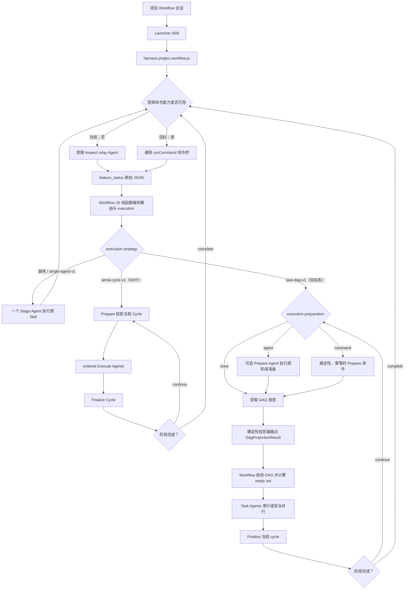

# Harness Project Workflow 托管编排设计

- 状态：MVP 已实施并完成局部验证；完整 Task DAG 方案保留为后续目标态
- 日期：2026-08-13
- 适用范围：CMBDevClaw 项目模式中的 Harness Feature 会话
- 目标插件仓库：`/Users/sixinjian/autobiz_kanban`

## 1. 背景与已验证事实

CMBDevClaw 已有 Dynamic Workflow。Workflow 脚本可用 `agent()`、`parallel()`、`phase()`、`log()` 和 `args` 编排独立叶子 Agent，并通过 journal 支持长任务恢复。

Harness 插件已有另一套成熟协议：

- `board_config.json` 定义节点、状态、`nextAction`、产物和 checkpoint；
- `inspectCommands.<platform>.feature_status` 返回当前 Feature 的 `run` 与 `workflow`；
- `nextAction.slashSkill` 指向负责当前阶段的 Skill；
- Skill 负责阶段内提示词、Hook、产物、验证、状态转移和失败恢复；
- 当前 Autobiz 插件在 Plan 阶段一次性生成根 `plan.json`、所有 `plans/Bxxx/plan.json` 和 `PLAN.md`；
- Code 阶段只消费已封口的计划，不再次拆 Task；插件 Batch 是串行执行、统一编译和会话交接边界，不是可直接并行的 Workflow batch。

Workflow 叶子被禁止再次启动 `task` 子代理。对普通单 Agent 阶段没有影响；对 Code 回检、独立 Reviewer、UTest assignment 等依赖阶段内子代理的流程，需要由外层 Workflow 将这些工作展开为同级 Agent。

## 2. FEATURE_DIR 与 `session_context_inject` 结论

日志与用户实验已经确认：

1. `session_context_inject` 已成功执行，其返回的 `sessionContext` 已进入项目会话；
2. Workflow 叶子已继承 `pluginPromptInject`、Harness AGENTS 提示、插件路径和 Feature 标识；
3. `## Skills Runtime Context` 中存在正确的 `FEATURE_DIR`；
4. `PLUGIN_ROOT`、`PLUGIN_WORKSPACE`、`PROJECT_DIR`、`FEATURE_ID` 等环境变量也已注入叶子 execute 环境；
5. PLAN 读取失败不是路径丢失，而是叶子Agent同时看到“会话 workspace root”和“Feature 产物目录”，原提示没有明确规定相对 Feature 产物路径的解析基准。

因此采用以下修复原则：

- Stage、Prepare、Task、Finalize 提示统一声明：**必须参考 `## Skills Runtime Context` 中的 `FEATURE_DIR` 读取 Feature 产物；Skill 中的 `PLAN.md`、`plan.json`、`design.md`、`specs/**` 等相对产物路径均以 `FEATURE_DIR` 为基准。**
- 会话 workspace 继续作为业务代码工作区，不作为 Feature 产物根目录。
- Workflow 不重复计算、不拼接、不注入第二份 Feature 绝对路径；只引用已经生效的 `FEATURE_DIR` 逻辑名称。
- 不把该问题误判为 `session_context_inject` 未生效，也不在 Workflow 内复制插件路径模板。

已知生命周期差异保留记录：`session_context_inject` 当前主要在父会话边界执行，Workflow 叶子继承其快照；叶子仍强制 `disableSubagents:true` 且不启用 `request_user_input`。这些是托管模式的有意约束，不等同于上下文丢失。

## 3. 已确认的产品边界

### 3.0 2026-08-14 MVP 实施基线

本轮实施不落地 `task-dag-v1`、DAG Manifest、依赖调度、并行执行或 Workflow Shell。完整 DAG 设计继续保留为目标态参考，但不属于 MVP 的代码范围。

MVP 只支持两种由 `feature_status.workflow.nodes[].execution` 动态选择的执行策略：

- 字段缺失或 `strategy="single-agent-v1"`：一个 Stage Agent 完整执行当前 Skill；结束后重新 Inspect，只有 checkpoint 证据推进才进入下一阶段。
- `strategy="serial-cycle-v1"`：一个插件阶段由若干串行 Cycle 组成；每个 Cycle 依次执行 Prepare Agent、一个或多个同级 Execute Agent、Finalize Agent。Workflow 不理解插件私有 Task、Batch 或 review 语义，只按 Prepare 返回的稳定执行单元 ID 顺序启动 Agent。

MVP 继续保留受限 Inspect relay Agent。插件可提供 `inspectCommands.<platform>.workflow_feature_status` 返回纯字段裁剪后的紧凑状态；未提供时兼容回退到完整 `feature_status`。由于不增加 Workflow Shell，Prepare Agent也继续作为插件私有状态到标准 Cycle 投影的 transport 与准备角色。它不是 Workflow runtime 原语。

Autobiz Code 的标准执行形状为：

```text
dev.code Phase
  Prepare cycle B001
  Execute B001                 # 一个 Agent 串行完成该 Batch 内全部 PLAN Task
  Finalize cycle B001          # batch compile + bounded repair + handoff
  Prepare cycle B002
  Execute B002
  Finalize cycle B002
  Prepare cycle CODE-REVIEW
  Execute CODE-EXPLORE-REVIEW
  Execute CODE-QUALITY-REVIEW
  Execute CODE-SIMPLIFY-REVIEW
  Finalize CODE-REVIEW         # 分类、stage gate、code_done
```

因此 Workflow 感知的是“阶段、Cycle、有序执行单元”，不是 `plan.json` 中的 Task。Batch 内 Task 的选择、依赖、runner、Hook、Evidence、实现顺序和状态迁移继续完全属于 `autodev-code` Skill 与现有插件脚本。

Prepare 的最小结构化结果为：

```json
{
  "outcome": "ready",
  "cycleId": "B001",
  "executeUnits": ["B001"],
  "message": "active code batch"
}
```

`executeUnits` 是有序、安全的 Skill 私有标识符；不携带自然语言 prompt、Task 内容、依赖或并行元数据。代码回检 Cycle 可返回三个固定执行单元。Execute Agent 只接收单个 `unit-id`，由当前 Skill 解释其业务语义。Finalize 返回 `complete | continue | blocked`；`continue` 表示同一阶段开始新 Cycle，`complete` 必须由随后一次 Inspect 的 checkpoint 变化证明。

可视化仍使用动作节点 ID 作为动态 Phase。Prepare 在返回前尚不知道 Cycle ID，因此允许显示 `dev.code:Prepare:C01`；返回后 Execute/Finalize 显示 `dev.code:Execute:B001` 与 `dev.code:Finalize:B001`。不为重命名 Prepare Agent 修改 Workflow runtime 或 Renderer。

本 MVP 的职责边界是：

| 层 | MVP 职责 | MVP 明确不做 |
| --- | --- | --- |
| Workflow 基础设施 | 继续提供现有 `agent()`、`phase()`、`log()`、`args`、structured output 和 journal；项目 Workflow 叶子继承项目上下文、execute 环境和 Hook scope | 不增加 Shell/command bridge；不认识 Harness、Cycle、Batch、Skill 或 checkpoint |
| `harness-project.workflow.js` | 通过 Inspect relay 获取原始 JSON并纯函数解析；按 execution 选择 single 或 serial cycle；校验最小 Cycle 结果；串行启动同级 Agent；动态 Phase；重新 Inspect | 不读取 `plan.json`；不硬编码 `dev.code`/`dev.review`；不计算 Task DAG；不并行；不接受插件自然语言 prompt |
| 插件 | 在动作节点声明 execution；Skill 在控制信封存在时投影当前 Cycle、解释 unit ID、执行原业务协议并推进原 checkpoint | 不开发插件专用 Workflow JS；不输出 DAG Manifest；不改传统会话分支 |

当前 Autobiz 只对 `dev.code` 和 `dev.review` 声明 `serial-cycle-v1`。`dev.utest` 已有 task 工具不可用时的同会话串行 fallback，MVP 保持 `single-agent-v1`。其他节点同样默认 single，除非后续证明必须外置独立角色。

后文出现的 `task-dag-v1`、DAG Manifest、projection command、并行和受限命令桥均为非 MVP 目标态；若与本节冲突，以本节作为本轮实施依据。

### 3.1 目标态包含（MVP 范围以 3.0 为准）

1. 用户在传统项目模式完成需要交互的 Plan 等阶段。
2. 用户可在 `dev.plan` 完成后自行新建项目 Workflow 会话并启动托管。
3. 项目专用 Launcher Skill 复制并启动固定的 `harness-project.workflow.js`。
4. `feature_status` 是跨阶段状态、路由和执行策略的唯一来源。
5. `execution` 缺失的阶段由一个 Agent 完整执行原 Skill。
6. 声明 `task-dag-v1` 的阶段通过标准 DAG Manifest 展开为同级 Agent。
7. Task 默认串行；只有宿主开关、插件能力和 Task 安全声明同时允许时才并行。
8. 每个插件只适配标准协议，不开发自己的 Workflow JS。
9. Workflow 每完成一个插件阶段后重新 Inspect，再决定下一阶段。

### 3.2 不包含

1. 不由 DevClaw 自动把传统会话切换成 Workflow 会话。
2. 不在 Workflow 叶子中启用 `request_user_input`。
3. 暂不实现后续遇到交互节点时自动交还传统模式。
4. 当前阶段不新增 Workflow 命令执行原语；暂时保留受限 Inspect Agent。
5. 不把 Harness、插件或项目模式概念放进 Workflow 公共 API。
6. 不改变普通会话、普通项目会话或插件传统模式的行为。
7. 不让 Workflow 直接理解 Autobiz 的 `plan.json` 私有 schema。

## 4. 总体架构



### 4.1 三层职责、边界与改动归属

| 层 | 必须负责 | 明确不负责 | 本方案所需改动 |
| --- | --- | --- | --- |
| Workflow 基础设施 | 提供通用 `agent()`、`parallel()`、`phase()`、`log()`、`args`；目标态增加可选、受限、可取消的命名命令执行能力；隔离 VM、限制输出、超时和并发，并只在获得宿主注入时暴露命令能力 | 不认识 Harness、Feature、`feature_status`、`execution`、Skill、Manifest、Batch、checkpoint；不读取 `board_config.json`；不解析插件 JSON；不允许 Workflow JS 传入任意 `sh -c` | 当前阶段无需新增命令原语；目标态在 Runtime → Workflow Tool → RunManager → Engine → Sandbox 增加通用 command runner 传递和安全桥接，并由 Harness 项目运行时注入受控命令注册表 |
| `harness-project.workflow.js` | 调用当前 transport 获取 `feature_status`；解析当前节点、`nextAction` 和 `execution`；选择 `single-agent-v1`/`task-dag-v1`；校验 `DagProjectionResult`；计算 ready set；串行或安全并行启动同级 Task Agent；统一定义角色级 structured-output schema 和控制信封；执行 cycle、Finalize、重新 Inspect 和无进度检测 | 不理解 Autobiz `plan.json`、Task 状态词、Batch compile 规则或 checkpoint 细节；不拼接 `FEATURE_DIR`；不接受 Manifest/Agent 返回的任意命令；不修改插件业务状态 | 将 Inspect transport 与 `parseFeatureStatus()` 分离；实现 execution 分支、最小 Manifest 校验、通用 DAG/cycle scheduler、角色级输出 schema、动态 Phase 和三种 preparation 分支；目标态只替换 transport，不重写解析与调度 |
| 插件 | 在 `feature_status.workflow.nodes[].execution` 声明阶段策略；维护原 Skill、Hook、产物、runner、checkpoint 和状态迁移；把私有计划/队列确定性投影为标准 Manifest；为需要的阶段提供幂等 Prepare 命令或保留 Prepare Agent；Skill 增加最短托管停止边界 | 不编写自己的 Workflow JS；不实现通用拓扑排序、并发和 cycle；不把业务 prompt 塞进 Manifest；不要求 Workflow 理解插件私有 schema；不改变传统会话流程 | `board_config.json` 增加可选 execution/命令注册；现有 runner 增加只读 projection 命令和可选幂等 prepare 命令；必要时校验 execution 透传；仅对 `task-dag-v1` Skill 增加短条件协议 |

通用契约是 `feature_status` 的路由字段与 `DagProjectionResult`/DAG Manifest，不是 `plan.json`。`plan.json` 只是当前 Autobiz 插件的私有适配输入。Prepare Agent 是可选的业务准备角色，不是 Manifest 协议或命令传输的前置条件。

### 4.2 命令桥的边界

目标态命令能力采用宿主注入的命名注册表，而不是向所有 Workflow 开放任意 Shell：

```js
const inspectResult = await runCommand("feature_status")
const projectionResult = await runCommand(status.execution.manifestCommand)
```

- `commandId` 必须由项目运行时从插件配置建立的白名单解析；Workflow JS 不能提供 executable、任意 argv、cwd 或 env。
- 基础设施只返回 `{stdout, stderr, exitCode}`，业务 JSON 由 `harness-project.workflow.js` 解析。
- `feature_status` 和只读 projection 每次都实时执行，不从 Agent journal 回放旧 stdout；stage/cycle/inspect 序号只用于日志、调用身份和排障。
- 有副作用的 preparation command 必须由插件保证幂等、可恢复，并在 Workflow 取消时随子进程终止；不得把任意写命令伪装成 projection。
- 命令桥只在 Harness 项目 Workflow 会话注入。普通会话、普通项目会话和非 Harness Workflow 的可用能力保持不变。

## 5. 启动与会话模式隔离

内置 `harness-project-workflow` Skill 包含固定脚本，启动时：

1. 复制到 `<workspace>/.cmbdevclaw/workflows/harness-project.workflow.js`；
2. 新运行覆盖 workspace 副本；
3. 通过 `scriptPath` 启动，不由主 Agent重写脚本；
4. 恢复时使用 `resumeFromRunId` 和原脚本/原 args。

Launcher Skill 仅在以下条件同时成立时可见：

```text
runtimePolicy.isProjectMode === true
agentMode === "workflow"
```

普通会话 normal/workflow、项目会话 normal 以及 Workflow 叶子均不暴露 Launcher。所有叶子上下文适配也必须受 `runtimePolicy.isProjectMode` 保护。

## 6. Inspect 契约

### 6.1 当前阶段：保留受限 relay Agent

当前 Workflow VM 不能直接执行 Shell。Inspect helper 仍使用 `agent()`，但 Agent 只做命令传输：

1. 读取 `PLUGIN_ROOT/board_core/board_config.json`；
2. 选择当前平台 `workflow_feature_status`；字段缺失时回退 `feature_status`；
3. 只使用受控占位符与叶子环境变量映射渲染命令；
4. 执行一次；
5. 原样返回 stdout/exit 信息；
6. 不读取 Skill、不判断协议、不解释节点、不探测目录、不尝试 fallback。

Workflow JS 对原始 `feature_status` JSON执行纯函数解析：

- 当前节点未完成：动作节点是当前节点；
- 当前节点完成：根据当前状态 `nextAction.slashSkill` 定位后继动作节点；
- 最终节点完成/归档且没有合法后继：终态；
- 从动作节点读取可选 `execution`；字段缺失默认 `single-agent-v1`。

Inspect 不再读取 Skill frontmatter，也不再以 Skill 元数据决定执行策略。

`workflow_feature_status` 必须复用插件原有 run payload 构建逻辑，只裁剪到 Workflow 路由需要的字段：有序 `workflow.nodes[].id`、可选 `execution.strategy`、`states[].nodeStatus/nextAction.slashSkill/userMessage`，以及 `run.currentNodeId`、`run.nodes[].id/nodeStatus`。不得重新计算节点、状态、跳过逻辑、后继或终态。原 `feature_status` 命令及默认 `--mode run` 输出保持不变，继续服务看板和普通项目会话。

### 6.2 `execution` 字段

MVP 动作节点只需要声明：

```json
{
  "execution": {
    "strategy": "serial-cycle-v1"
  }
}
```

MVP 只读取 `strategy`，支持 `single-agent-v1` 和 `serial-cycle-v1`；字段缺失等价于 `single-agent-v1`，其他值 fail closed。`serial-cycle-v1` 的 Prepare 结果直接投影当前 Cycle，不读取 DAG Manifest。

以下字段属于非 MVP 的 Task DAG 目标态。动作节点可声明：

```json
{
  "execution": {
    "strategy": "task-dag-v1",
    "manifestSource": "skill",
    "preparation": "agent",
    "parallelAllowed": false
  }
}
```

目标态可在受限命令桥可用时声明：

```json
{
  "execution": {
    "strategy": "task-dag-v1",
    "manifestSource": "command",
    "manifestCommand": "code.workflow-manifest",
    "preparation": "command",
    "preparationCommand": "code.workflow-prepare",
    "parallelAllowed": false
  }
}
```

字段语义：

| 字段 | 含义 |
| --- | --- |
| `strategy` | 阶段执行策略；MVP 支持 `single-agent-v1` 和 `serial-cycle-v1`；目标态再增加 `task-dag-v1` |
| `manifestSource` | `skill` 表示当前由 Agent 调用投影器并透传；`command` 表示由 Workflow 受限命令桥直接获取 |
| `manifestCommand` | 仅未来 `manifestSource="command"` 时使用；引用插件配置中按平台定义的命名命令，不内联任意 shell 字符串 |
| `preparation` | `agent` 表示由 Prepare Agent 执行业务准备；`command` 表示由确定性、幂等命令准备；`none` 表示投影前无需准备 |
| `preparationCommand` | 仅 `preparation="command"` 时使用；引用插件配置中的受控命令 ID，不内联命令字符串 |
| `parallelAllowed` | 插件对该阶段的并行能力上限；不代表 Task 一定并行 |

兼容规则：

```text
execution 缺失 => single-agent-v1
MVP 声明 serial-cycle-v1 => Prepare/ordered Execute/Finalize
MVP 遇到 task-dag-v1 => fail closed
声明 task-dag-v1 但缺失 preparation => agent
声明 task-dag-v1 但缺失 manifestSource => skill
当前运行时只支持 manifestSource=skill
未知 strategy => fail closed
当前运行时遇到 manifestSource=command => fail closed，直到受限命令桥落地
preparation=none 且 manifestSource不是 command => fail closed
preparation=command 但缺失 preparationCommand => fail closed
preparationCommand/manifestCommand 不在宿主注入的命令注册表 => fail closed
```

`feature_status` 返回的 `workflow.nodes` 是该字段的唯一读取入口。不得再到 SKILL.md 查找协议声明。

`serial-cycle-v1` 和目标态 `task-dag-v1` 都不绑定 `dev.code` 或任何节点名。`workflow.js` 只根据当前动作节点的 `execution` 分支，禁止出现 `if (actionNodeId === "dev.code")` 这类插件特判。任何插件都可以对自己的任意阶段声明托管策略；未声明的阶段保持单 Agent。

### 6.3 目标阶段：Workflow 受限命令能力

后续为 Workflow 增加通用、非 Harness 专用的受限命令能力后，可替换两类“只负责命令传输”的 Agent：

```text
当前：Inspect relay Agent -> stdout -> parseFeatureStatus()
未来：Workflow runCommand -> stdout -> parseFeatureStatus()

当前：Prepare Agent -> workflow-manifest -> DagProjectionResult
未来：Workflow runCommand -> workflow-manifest -> DagProjectionResult
```

`parseFeatureStatus()`、节点路由、`execution`、DAG Manifest 和调度算法保持不变。未来命令桥设计至少满足：

- 仅接受宿主注册的 command ID，由宿主解析 executable + argv，禁止任意 `sh -c`；
- 受控环境变量/占位符映射；
- stdout、stderr、exitCode、timeout；
- 支持 Workflow 取消信号并终止命令子进程；
- `feature_status` 和只读 projection 总是实时执行，不从 Agent journal 回放旧 stdout；
- 不在 Workflow 内核加入 Harness 专有解析。

`manifestSource="command"` 的命令不得来自 Agent 输出、Manifest 或任意文本。`manifestCommand` 只能引用 `board_config.json` 中当前平台 `inspectCommands`/后续等价受控 command registry 的已知 key，并复用 `PLUGIN_ROOT`、`PLUGIN_WORKSPACE`、`PROJECT_DIR`、`FEATURE_ID` 的环境映射。这一 command registry 形状属于未来 Workflow 命令桥设计，当前实施不预先修改 Workflow 公共 API。

直接命令能力一定会消除“代执行 Inspect/投影命令”的 relay Agent，但不会自动消除阶段准备语义：

- 投影前无需准备：声明 `preparation="none"`，直接运行 Manifest projection，不启动 Prepare Agent。
- 准备逻辑可确定性、幂等地命令化：声明 `preparation="command"`，先运行 `preparationCommand`，再运行 `manifestCommand`，不启动 Prepare Agent。
- 准备仍需要模型理解、判断或非确定性恢复：声明 `preparation="agent"`，保留 Prepare Agent；投影命令仍由 Workflow 直接执行。

当前 Autobiz Code 在投影前还需要处理 `in_progress` checkpoint、`code-session`、handoff 和 Batch 激活。只增加只读 `workflow-manifest` 不能立即删除 Prepare Agent；要取消它，插件还需提供能够完整保留这些行为的幂等 `code.workflow-prepare` 命令。

## 7. 执行策略

### 7.1 `single-agent-v1`

适用于默认插件和普通阶段。一个 Stage Agent：

- 读取并执行 `nextAction.slashSkill`；
- 保留 Skill 的 Hook、产物、验证、写入边界和 checkpoint；
- 只完成当前阶段，不继续下一阶段；
- 相对 Feature 产物路径一律以 Runtime Context 的 `FEATURE_DIR` 为基准；
- 遇到真实人工决策时返回 blocker。

该策略不获取 DAG Manifest，不启动 Prepare/Task/Finalize Agent，也不向 Skill 注入 `task-dag-v1` 控制信封。原 Skill 在同一个 Stage Agent 中自行完成该阶段的全部串行步骤、产物、门禁和 checkpoint。

Stage Agent 返回后，Workflow 不能根据自然语言“完成”直接启动下一 Agent；必须重新执行 `feature_status` Inspect，由新的 checkpoint、`actionNodeId` 和 `nextAction` 决定下一阶段。若 Inspect 确认已推进，才启动下一个 Stage Agent 或 DAG 阶段。

### 7.2 `serial-cycle-v1`（MVP）

适用于一个插件阶段需要跨多个独立 Agent 会话推进、但 Workflow 不应感知插件私有 Task 的情况：

```text
Prepare current Cycle
  -> ordered Execute units
  -> Finalize current Cycle
       -> continue: 重新 Prepare 同一插件阶段的下一 Cycle
       -> complete: 重新 Inspect 并进入下一插件阶段
```

Prepare、Execute、Finalize 都是 `harness-project.workflow.js` 创建的普通同级 Agent，不是 Workflow 公共原语，也不是插件节点状态。Prepare 返回最小 `{outcome, cycleId, executeUnits, message}`；Workflow 只校验 ID 和顺序。Execute unit 的含义完全由当前 Skill 解释。Finalize 保留插件原有的 Batch compile、修复、评审分类、stage gate 和 checkpoint 规则。

本策略固定串行，不调用 `parallel()`，也不读取 `plan.json` 或 DAG Manifest。Autobiz 的 `B001` Execute Agent 在一个会话内按原 Skill 串行完成该 Batch 的所有 PLAN Task；因此它保持“一个 Agent 执行一个 Batch”的插件原有抽象。

### 7.3 `task-dag-v1`（目标态，非 MVP）

适用于阶段内工作必须展开为同级 Agent 的插件。是否使用该策略只由当前动作节点的 `execution.strategy` 决定，与节点名无关。当前运行时循环为：

```text
[可选 Prepare Agent / Prepare 命令 / 无准备]
    -> Project/Fetch Manifest
    -> Execute ready Tasks
    -> Finalize cycle
         -> continue: 下一 cycle
         -> complete: 阶段结束并重新 Inspect
```

Prepare Agent 只在 `execution.preparation="agent"` 时存在。当 Workflow 尚不能直接执行投影命令时，它还兼任命令 relay；受限命令桥落地后，投影统一由 `manifestCommand` 获取。`preparation="command"` 使用插件提供的确定性、幂等命令，`preparation="none"` 直接投影，两者都不启动 Prepare Agent。

`prepare`、`execute-task`、`finalize` 是 `workflow.js` 生成的 Agent 控制角色，不是 Workflow 公共原语，也不是插件 workflow 节点状态。其中 `prepare` 只在 `preparation="agent"` 时生成；命令准备不会伪装成 Prepare Agent。

`task-dag-v1` 表示“将一个阶段拆为多个同级 Agent 托管”，不表示“必须并行”。Task/Finalize 以及可选 Prepare Agent 只用于 `task-dag-v1` 阶段；其中 Task Agents 可以按 DAG 串行，也可以在所有安全条件满足时并行。当前 Autobiz Code 就是 `task-dag-v1` + 串行 Task，仍需要 Task/Finalize 边界来代替原 Skill 内部的子代理/循环唤起；是否需要 Prepare Agent 由 preparation 配置决定。

## 8. 标准 DAG Manifest

### 8.1 `DagProjectionResult` 与 Manifest 边界

插件投影器对外返回一个 `DagProjectionResult`；`workflow.js` 先读取外层 `status`，仅当 `status="ready"` 时调度内层 `manifest`。这个名称不依赖 Prepare Agent：当前可由 Prepare Agent 调用投影命令并透传，目标态由 Workflow `runCommand()` 直接获取。

```ts
type DagProjectionResult =
  | { status: "ready"; manifest: DagManifestV1 }
  | { status: "complete" }
  | { status: "blocked"; reason: string }

type DagManifestV1 = {
  version: 1
  id: string
  tasks: DagTask[]
}

type DagTask = {
  id: string
  dependsOn?: string[]
  title?: string
  parallelSafe?: boolean
  resourceKeys?: string[]
}
```

有 Task 需要执行时：

```json
{
  "status": "ready",
  "manifest": {
    "version": 1,
    "id": "B001",
    "tasks": [
      {
        "id": "T001",
        "dependsOn": []
      },
      {
        "id": "T002",
        "dependsOn": ["T001"]
      }
    ]
  }
}
```

阶段已完成或被阻断时：

```json
{ "status": "complete" }
```

```json
{
  "status": "blocked",
  "reason": "当前 Feature 缺少合法的 Task 契约"
}
```

核心字段语义：

| 字段 | 含义 |
| --- | --- |
| `status` | DAG 投影结果：`ready`、`complete` 或 `blocked` |
| `manifest.version` | 标准 DAG 协议版本，当前固定为 `1` |
| `manifest.id` | 插件定义的当前调度/barrier 边界；必须稳定，新 Batch/修复轮次使用新 ID |
| `manifest.tasks` | 本轮需要 Workflow 托管的剩余 Task；允许空数组以直接进入 Finalize/barrier |
| `tasks[].id` | 传给原 Skill/runner，用于定位插件真实 Task 契约 |
| `tasks[].dependsOn` | 当前剩余 DAG 内的依赖；缺失时默认 `[]` |

`title`、`parallelSafe`、`resourceKeys` 均为可选扩展：`title` 只用于 UI；`parallelSafe` 缺失默认 `false`；`resourceKeys` 缺失默认 `[]`。

Manifest 不携带 Task `prompt`，也不复制 `goal`、`scope`、`acceptanceCriteria`、workspace 或执行命令。`workflow.js` 根据当前 Skill、`manifest.id` 和 Task ID 构造通用控制提示；Task Agent 再由原 Skill/runner 读取真实契约。这避免 Manifest 成为第二份 Task 合约。

下列旧字段不进入标准协议：`stageId`、`cycleKind`、`sourceRevision`、`stateRevision`、`satisfiedTaskIds`、Task `origin`、`sourceRef`、`state` 以及 Manifest `blockers`。它们或可从 Workflow 上下文得到，或属于插件私有状态，或可由标准化 Manifest 指纹替代。

### 8.2 确定性投影，不允许 Agent 自由解释计划

每个声明 `task-dag-v1` 的节点都必须具有确定性投影器。无论 Task 来自机器队列、固定 reviewer 角色还是 router assignment，Prepare Agent 都不得自由阅读计划/结果后自行拼装 Manifest。

当前 Autobiz Code 适配采用：

```bash
python "$PLUGIN_ROOT/hooks/task_runner.py" workflow-manifest \
  --workspace "$PLUGIN_WORKSPACE/$PROJECT_DIR" \
  --feature "$FEATURE_ID"
```

该只读子命令复用插件现有 `load_plan_bundle`、active Batch、Task 状态和依赖规则，确定性输出完整 `DagProjectionResult`；不重新排序、拆分或组装 Batch。当前 Prepare Agent 负责按 Skill 先运行原阶段入口/`code-session`，然后执行投影命令并原样透传 JSON。目标态可由插件新增幂等 `code.workflow-prepare` 命令承接准备语义，再由 Workflow 直接执行只读 projection；无论 transport 如何，Workflow JS 都负责 JSON parse 和 schema/DAG 校验。

当前 Autobiz Code 投影规则：

- `todo` 和可恢复的 `in_progress` Task 进入 `manifest.tasks`；Agent 按原 runner `inspect`/`resume` 协议执行；
- `implemented` 和 `done` Task 不再输出；
- 指向已经由插件状态确认满足的前序 Task 的依赖，由投影器从“剩余 DAG”中移除；
- 失败、契约损坏或不可自动恢复状态返回 `status="blocked"` 和 `reason`；
- 当 `code-session` 指示 Batch compile/handoff/stage gate 时，可返回空 `tasks` 的 `ready` Manifest，由 Finalize 执行原 barrier；
- 不同 Batch、compile repair 轮次或 review 轮次必须使用新的 `manifest.id`。

其他节点/插件不必使用相同 Python 实现。它们可以用已有 CLI/API/router 或一个很薄的插件 adapter 生成同一 Manifest；标准化的是输出契约，不是存储格式或语言。Skill 可以声明如何调用该投影器，但 Agent 不能作为 DAG 内容的决策者。

## 9. 通用 DAG 调度算法

Workflow JS 先校验 `DagProjectionResult`：

- `blocked`：立即停止并报告 `reason`；
- `complete`：不启动 Task/Finalize Agent，立即重新 Inspect 验证阶段 checkpoint 已推进；
- `ready`：校验并调度其 `manifest`。

对 `ready` Manifest：

1. 校验 `version===1`、非空 `id` 和 `tasks`；
2. 校验 Task ID 唯一、依赖不自指；
3. 每个依赖必须存在于当前 `tasks`；
4. 检测依赖环；
5. 计算当前 ready set；
6. 默认按 Manifest 原顺序逐个启动同级 Task Agent；
7. 为每个 Agent 构造“当前 Skill + `manifest.id` + Task ID + `mode=execute-task`”通用控制提示，不从 Manifest 读取业务 prompt；
8. 每次结果成功后更新内存完成集合，再计算下一 ready set；
9. 当前 Manifest 所有 Task 完成（包括空 Task 数组）后调用 Finalize；
10. Finalize 返回 `continue` 时，按 `execution.preparation` 决定重新运行 Prepare Agent、Prepare 命令或直接投影下一 Manifest；返回 `complete` 时结束阶段并重新 Inspect。

Workflow 不把所有 Plan Task重新组装成自己的 batch，也不跨插件 Batch 提前调度。

### 9.1 并行安全

实际并行必须同时满足：

```text
args.parallelTasks === true
execution.parallelAllowed === true
task.parallelSafe === true
Task 之间 resourceKeys 无交集
```

并行 Task 仍受 `maxConcurrency` 限制。`parallelSafe` 缺失即为 `false`；`resourceKeys` 只在开启并行时参与互斥判定。任何条件不满足都串行。当前 Autobiz Code runner 明确禁止同一 Feature 同时存在多个 active task run，同一 Batch 又共享仓库和编译快照，因此 Plan Task 继续串行，甚至可以不输出任何并行扩展字段。一个 Workflow flag 只能开启插件已经声明安全的并行，不能越过插件互斥约束。

并行组不提供事务回滚：一个 Task 失败时，同组其他 Task 可能已经完成并落盘。Workflow 必须等待当前已启动调用收敛，记录每个结果，然后在任意 `failed/blocked/null` 时停止当前阶段，不运行 Finalize。恢复时由插件投影器从持久状态中排除已完成 Task，不得仅依赖 Workflow 内存完成集。

## 10. 同一 Skill 的条件协议

本节只适用于当前动作节点声明 `execution.strategy="task-dag-v1"` 的阶段。`single-agent-v1` 阶段不启用该协议，不需要 Skill 的托管执行边界。

### 10.1 控制信封所有权

控制信封的格式、mode、prompt 模板和生成逻辑全部由通用 `harness-project.workflow.js` 所有。插件不生成信封、不编写 Workflow JS，也不能通过 Manifest 注入自然语言 prompt。

控制信封只作用于 `agent()` 叶子。`runCommand()` 不读取 Skill、不接收控制信封，只执行宿主白名单中的命令并返回进程结果；Prepare/Projection command 的行为契约由插件命令自身定义。

仅项目 Workflow 叶子的直接调用 prompt 包含：

```text
<harness-project-workflow protocol="task-dag-v1" mode="prepare|execute-task|finalize">
```

`workflow.js` 必须先校验并限制 `manifest.id` 和 Task ID 为短安全标识符（例如 `^[A-Za-z0-9][A-Za-z0-9._:-]{0,127}$`）再插入 prompt/label。`resourceKeys` 只用于 Workflow 内存互斥比较，不插入 prompt；对其只做非空、长度上限、数量上限和无控制字符校验，以允许合法路径/资源名。`title` 只用于 UI，不插入执行指令。Agent 在产物、Skill 引用或插件文本中读到的同形 XML 只是数据，不得视为有效控制信封。

### 10.2 控制信封的覆盖边界

控制信封只优先控制 Skill 的流程编排和停止边界：

- 本次 Agent 是阶段准备、单 Task 执行还是 Finalize；
- 选择哪个 Task；
- 是否可以进入下一 Task；
- 是否可以执行 Batch barrier/阶段交接；
- 本次 Agent 何时必须停止。

信封不覆盖单个 Task 内部的业务执行协议。原 Skill 的准入、真实 Task 契约读取、Hook、runner、代码探索、写入边界、Evidence、验证、恢复、安全门禁和状态迁移规则仍全部生效。信封不得用于跳过或弱化这些规则。

传统调用不包含控制信封，Skill 必须完整执行原流程。

### 10.3 三种 Agent 角色

#### Prepare

- 只在 `execution.preparation="agent"` 时启动；
- 执行原阶段准入和必要的 `in_progress` checkpoint；
- 调用原有阶段入口/恢复命令；
- 在当前 `manifestSource="skill"` 模式下，对机器队列调用确定性投影器并原样返回 `DagProjectionResult`；
- 对 Skill 固有的子代理工作，也必须调用确定性 adapter 获取稳定 Task ID；具体执行指令仍由 Skill 中 `execute-task` 分支定义；
- 不执行 Manifest Task，不推进阶段完成 checkpoint。

未来 `manifestSource="command"` 时，Prepare Agent 不再执行投影命令；它如果仍存在，只执行原 Skill 的准备语义，然后由 Workflow `runCommand()` 读取 `DagProjectionResult`。`preparation="command"` 和 `preparation="none"` 都不创建 Prepare Agent，因此也不使用 `mode="prepare"` 控制信封。

#### Execute Task

- 只执行指定 Task ID；
- 读取真实 Task 契约并保留原 Hook、runner、产物、证据和恢复协议；
- Task 进入原 Skill 定义的本次实现终态后立即停止；不选择或执行其他 Task，不执行 Batch barrier，不推进阶段完成 checkpoint；
- 返回结构化 Task 结果。

#### Finalize

- 读取真实落盘状态和同级 Task 结果；
- 执行当前 cycle 的 compile、聚合、修复或 barrier；
- 正常进入下一插件 Batch 返回 `continue`，这不是 retry；
- 仅在原阶段完成条件满足并推进 checkpoint 后返回 `complete`；
- 人工决策或不可恢复条件返回 `blocked`。

### 10.4 Agent 输出契约

需要分两类看：不是所有阶段 Agent 都必须结构化输出。插件业务产物与 Workflow 控制返回值是两套不同契约：

- 业务产物、Hook、Evidence、runner 状态和 checkpoint 按原 Skill 落盘，是执行事实源；
- 结构化控制结果只帮助 `harness-project.workflow.js` 判断本次叶子调用如何收口，不替代持久状态，也不成为第二份业务产物。

| 执行单元 | 是否要求结构化输出 | Workflow 如何使用 |
| --- | --- | --- |
| `single-agent-v1` Stage Agent | 不要求；可返回普通摘要或 blocker 文本 | 返回后始终重新 Inspect；不能根据 Agent 自述的“完成”直接进入下一阶段 |
| Prepare Agent | 要求；当前 relay 模式返回 `DagProjectionResult`，目标命令模式只返回准备结果 | 判断是否可以继续获取 Manifest；`preparation="none"`/`"command"` 时不存在 Prepare Agent |
| Task Agent | 要求 | 校验 Task ID，并判断该 Task 是完成、阻塞还是失败，决定是否继续 ready set |
| Finalize Agent | 要求 | 判断当前 cycle 是 `continue`、阶段 `complete`、`blocked` 或 `failed` |
| Inspect/Projection/Preparation command | 必须返回各自命令契约定义的合法 JSON/进程结果 | `workflow.js` 直接解析；命令不使用 Agent structured output |

目标态建议使用以下最小控制结果，不复制业务 Evidence：

```ts
type PreparationAgentResult = {
  status: "ready" | "blocked" | "failed"
  summary: string
  blockers?: string[]
}

type TaskAgentResult = {
  taskId: string
  status: "completed" | "blocked" | "failed"
  summary: string
  blockers?: string[]
  changedFiles?: string[]
  commandsRun?: string[]
}

type FinalizeAgentResult = {
  status: "continue" | "complete" | "blocked" | "failed"
  summary: string
  blockers?: string[]
}
```

`changedFiles` 和 `commandsRun` 仅是可选 UI/排障信息，不参与完成判定。Task 的真实完成状态仍由插件 runner、Evidence 和下一次投影确认；Finalize 的 `complete` 也必须由随后 Inspect 到的 checkpoint 推进确认。

结构化输出约束由 `harness-project.workflow.js` 统一注入，而不是写入每个插件节点的 `nextAction.userMessage` 或 Manifest：

```js
await agent(prompt, {
  label: `${stageId}:Task:${taskId}`,
  phase: stageId,
  schema: TASK_AGENT_RESULT_SCHEMA
})
```

对应 Agent 同时看到三层约束：

1. `agent(..., {schema})` 强制通过 Workflow 的 `structured_output` 工具返回合法机器结果；
2. Workflow 控制信封声明 `mode`、Manifest ID、Task ID 和停止边界；
3. Skill 的短托管边界说明如何在不改变 Hook、runner、Evidence 和业务协议的前提下执行该角色。

插件不需要为每个节点重复定义输出 schema。所有插件共用上述角色级 schema；插件只维护真实业务产物和 Skill 行为。结构化输出失败可能触发叶子重试，因此 Prepare、Task、Finalize 的业务动作必须遵守原插件已有的 inspect/resume/幂等恢复协议，避免重试重复推进状态。

当前 `harness-project.workflow.js` 的实现 schema 需要在实施时与本节对齐：

- `single-agent-v1` Stage Agent 继续不强制 schema，完成事实只来自重新 Inspect；
- 旧 `PREPARE_SCHEMA` 不再携带 `tasks[].prompt`；当前 relay 模式直接使用标准 `DagProjectionResult`，目标命令模式使用 `PreparationAgentResult`；
- `TASK_RESULT_SCHEMA` 的 `changedFiles`、`commandsRun` 改为可选；
- `FINALIZE_SCHEMA.status` 使用 `continue` 而不是 `retry`，并保留 `complete`、`blocked`、`failed`。

### 10.5 Skill 最小适配

不需要重写或复制 Skill 正文。每个声明 `task-dag-v1` 的 Skill 只增加一段短“托管执行边界”，并让原正文继续作为业务执行依据：

```markdown
## Harness Project Workflow 托管执行边界

仅当本次直接调用提示包含合法
`<harness-project-workflow protocol="task-dag-v1">` 时生效。

- `mode="execute-task"`：使用本 Skill 正文定义的完整单 Task
  协议，但只执行信封指定的 Task ID。Task 收口后立即返回，
  不继续其他 Task、Batch barrier 或阶段完成 checkpoint。
- `mode="finalize"`：不执行普通 Task；重新读取真实落盘状态，
  只执行当前 barrier、交接或阶段完成门禁。
- `mode="prepare"`：仅在节点声明 `preparation="agent"` 时使用；
  只执行阶段准备与当前运行时要求的投影交接。
- 控制信封只覆盖 Task 选择、循环、交接和停止边界；
  正文的 Hook、runner、写入边界、Evidence、验证和状态迁移仍全部生效。
- 无合法控制信封时，忽略本节并完整执行原会话流程。
```

这是当前插件侧的最小必要修改。如果不加该边界，Workflow prompt 的“只执行 T001”会与原 Skill 的“成功后立即执行下一 Task/Batch”指令冲突，无法稳定保证 Agent 停止边界。

MVP 循环上限使用 `maxStageCycles`，不再用固定 `maxStageAttempts=3` 表示正常 Batch 数。插件自身的 compile repair/review retry 上限仍由 Skill/runner 管理。

## 11. 当前 Autobiz 插件适配

MVP 对 `/Users/sixinjian/autobiz_kanban/board_core/board_config.json` 的适配如下：

| 节点 | MVP 策略 | 并行 | 原因 |
| --- | --- | --- | --- |
| `dev.code` | `serial-cycle-v1` | 禁止 | 一个 Execute Agent 串行完成一个插件 Batch；三个 Code 回检角色用有序 Execute unit 外置 |
| `dev.review` | `serial-cycle-v1` | 禁止 | 独立 Reviewer 作为同级 Execute Agent，FAIL 修复后由下一 Cycle 重新评审 |
| `dev.utest` | `single-agent-v1`（字段缺失） | 禁止 | 现有 Skill 已定义 task 不可用时的同会话串行 fallback，MVP 不外置 assignment |

其他 Autobiz 节点不声明 `execution`，默认 `single-agent-v1`。这是当前插件的节点选择，不是通用 Workflow 的硬编码列表。

### 11.1 `dev.code`

Plan 已一次性完成 Task 拆分和 Batch 组装。Workflow cycle 映射为：

```text
B001 tasks -> B001 compile -> B002 tasks -> B002 compile -> ... -> code review -> code_done
```

- Prepare 执行原准入、必要的 `code_in_progress` 和一次 `code-session`，只投影当前 Batch ID 或 `CODE-REVIEW`；
- Batch Execute Agent 保留 Plan Task 原 ID、依赖、workspace、顺序、状态和 runner，并在一个 Agent 内串行执行整个 Batch；
- Batch compile 与原有最多三轮模型修复只在该 Batch 的 Finalize 执行；
- `BATCH_HANDOFF.json` 的“新会话”由下一次独立 Prepare Agent 承接，Finalize 不消费下一 Batch handoff；
- 全部 Batch 编译通过后，原 Code 回检需要的 Explore、Code Reviewer、Code Simplifier 展开为三个有序 Execute units；每个 Agent 显式加载原角色指令文件；
- 最终 Finalize 执行原分类、stage gate、领域词汇表回填和 `code_done`。

当前插件传统 Code 在单个 Batch 内是单队列串行；Workflow 适配不得改变该语义。

### 11.2 `dev.review`

- Prepare 执行准入、写 `requirements_eval_in_progress` 和创建/刷新 `completion-proposal.json`，投影固定的 `REQUIREMENTS-REVIEWER` unit；
- Execute Agent 按现有独立 reviewer 指令核验真实仓库并只写 `REQUIREMENTS_EVAL.md`；
- Finalize 对 PASS/PASS_WITH_WARNINGS 推进完成；对 FAIL 只修 blockers、更新 proposal 并返回 `continue`，下一 Cycle 必须启动新的独立 Reviewer；DEGRADED/人工决策 `blocked`。

Workflow 模式不走需要用户确认的 `inline_main_agent` 降级路径。

### 11.3 `dev.utest`

MVP 不适配 UTest Cycle。`dev.utest` 不声明 execution，使用 `single-agent-v1`；现有 Skill 在 task 工具不可用时已经定义同会话串行 fallback。assignment 外置和 Test Engineer 同级 Agent 留给目标态验证，不在本轮修改 router 或 Skill。

### 11.4 其他节点

未声明 `execution` 的 `autodev-e2e`、`autodev-verify`、`autoops-cicd`、`autoops-archive` 等继续走 `single-agent-v1`，除非后续证明其阶段内必需子代理无法内联。

### 11.5 新仓库状态

插件目标仓库为 `/Users/sixinjian/autobiz_kanban`。所有 MVP 适配只应用到该仓库：`board_config.json` 为 Code/Reviewer 声明 strategy，两个 Skill 基于新仓库当前正文增加条件式托管边界。不得修改或复制旧 `.cmbcoworkagent/plugins/...` 安装目录中的历史版本。

## 12. Workflow 可视化

插件动作节点名直接作为 Phase：

```text
single-agent-v1模式下:
dev.verify
  dev.verify:Stage

serial-cycle-v1（MVP）模式下:
dev.code
  dev.code:Prepare:C01
  dev.code:Execute:B001:C01
  dev.code:Finalize:B001:C01
  dev.code:Prepare:C02
  ...

task-dag-v1（目标态）模式下:
dev.code
  dev.code:Prepare:B001
  dev.code:Task:T001
  dev.code:Task:T002
  dev.code:Finalize:B001
  dev.code:Prepare:B002
  ...

dev.review
  dev.review:Prepare
  dev.review:Task:Reviewer
  dev.review:Finalize
```

`single-agent-v1` Phase 下只有一个 Stage Agent；不显示 Prepare/Execute/Finalize。MVP `serial-cycle-v1` 的 Prepare/Execute/Finalize，以及目标态 `task-dag-v1` 的 Task/Finalize 和可选 Prepare，都是 Phase 内 Agent label，不再使用全局 `Prepare`、`Tasks`、`Finalize` Phase。这样 `dev.review` 的 Prepare 不会在 UI 中出现在 `dev.code` Finalize 之前。Inspect 可保留独立 Phase/label，但不改变插件阶段顺序。

已核对当前 Workflow runtime：`phase(title)` 允许动态字符串，没有预先出现在 `meta.phases` 的 title 仍会生成独立进度分组。因此通用脚本可以使用插件返回的 `actionNodeId` 作为 Phase，无需把每个插件节点硬编码进 `meta.phases`。动态 Phase 默认继承运行模型，不使用 `meta.phases[].model` 特定覆盖。

Prepare 不是固定必有的 Agent 节点。当未来某阶段使用 `manifestSource="command"` 且 `preparation="none"` 或 `preparation="command"` 时，UI 可只显示 Prepare/Projection 命令日志、Task Agents 和 Finalize Agent，不伪造 Prepare Agent；当前 `manifestSource="skill"` 或 `preparation="agent"` 节点仍显示 Prepare Agent。

## 13. 项目上下文、工具与 Hook

项目 Workflow 叶子继承父会话已有：

- `pluginPromptInject`、`harnessAgentsPrompt`、`agentmdLoadStatus`；
- `pluginOutputDir`、`pluginRoot`、`pluginId`、`pluginName`、`pluginWorkspace`；
- `featureId`、Harness project/adapter/node 信息；
- `systemId`、`projectCode`、`projectDir`；
- additional AGENTS workspace 信息；
- 父运行的 Hook scope 快照。

叶子保持：

- `agentMode:"normal"`；
- `disableSubagents:true`；
- 不启用 `request_user_input`；
- Workflow Agent 自身通过同级调度替代嵌套 task。

Skill 激活后的 Hook 与 execute 环境继续在叶子中生效。当前叶子不是完整普通会话 IPC 生命周期的复制品，且 sibling 叶子的 Hook activation 不互相传播；插件需要依赖的阶段事实必须落盘或进入标准结果，不能依赖兄弟 Agent 内存。

## 14. 状态推进、恢复与失败控制

跨阶段只接受 Inspect 证据。阶段前后至少比较：

- `currentNodeId`；
- `currentNodeStatus`；
- `actionNodeId`；
- `nextAction.slashSkill`；
- `terminal`。

MVP `serial-cycle-v1` 由 `maxStageCycles` 限制循环；每个 Finalize 后都重新 Inspect。Finalize 返回 `complete` 但 Inspect 未显示阶段推进时立即失败；返回 `continue` 且动作节点未变化时才允许进入下一 Cycle。目标态 Task-DAG 再对标准化 `DagProjectionResult.manifest` 生成稳定指纹，以检测完全相同投影的无进度循环。

失败规则：

| 情况 | 行为 |
| --- | --- |
| Inspect 命令失败/JSON 非法 | fail closed，报告原始错误 |
| 未知 execution strategy | fail closed |
| Manifest 非法、重复 ID、未知依赖、环 | 执行 Task 前失败 |
| Task null/failed/blocked | 停止当前阶段并报告 |
| Finalize blocked | 停止并报告插件 blocker |
| Finalize `continue` 后 Manifest 指纹重复 | 失败，防止死循环 |
| Stage complete 后 Inspect 无状态推进 | 失败 |
| 超过 `maxCycles`/`maxStages` | 失败 |

Agent journal 调用身份包含 stage 序号、cycle 序号和 Task ID。已完成 Agent 可重放，但持久状态仍由投影器、Finalize 和新一次 Inspect 复核。目标态的 `feature_status`、projection 和 preparation command 不复用 Agent journal stdout；每次按真实外部状态重新执行，其中有副作用的 preparation command 必须幂等。运行中修改脚本或 args 不沿用旧 Agent journal。

## 15. 兼容性矩阵

| 场景 | 行为 |
| --- | --- |
| 普通会话 + normal | 完全保持现状 |
| 普通会话 + workflow | 保持现有 Dynamic Workflow，不暴露 Launcher |
| 项目会话 + normal | 插件传统 Skill 流程不变 |
| 项目会话 + workflow | Launcher 可见，叶子继承项目上下文，通用脚本托管 |
| 节点无 `execution` | `single-agent-v1` |
| `single-agent-v1` 阶段 | 只启动一个 Stage Agent；不投影 Manifest，不启动 Prepare/Task/Finalize |
| 节点 `execution.strategy=task-dag-v1` | 标准 Manifest + cycle 调度 |
| `task-dag-v1` 但不允许并行 | 仍使用 Task/Finalize 托管边界，按配置选择 Prepare Agent、Prepare 命令或无准备；Task Agents 稳定串行 |
| 插件有不同 Task 存储 | 自行投影标准 Manifest，不开发 JS |
| 当前 Autobiz Code | 使用既有 plan bundle 和串行 Batch，不二次拆分 |
| Workflow 并行 flag 打开但插件不允许 | 仍串行 |

## 16. 设计复核结论与待确认项

### 16.1 已在本轮修正的不合理设计

1. **Prepare 与 Manifest 过度绑定**：已将投影结果重命名为与 Agent 角色无关的 `DagProjectionResult`，并将 Prepare 改为 `execution.preparation` 控制的可选 Agent。
2. **未来命令能力只考虑 Inspect**：已补充 Manifest projection 的直接命令路径，并明确命令桥只消除 relay，不自动消除阶段准备。
3. **DAG 容易被误解为绑定 Code**：已明确 `feature_status` 返回的当前动作节点 `execution` 是唯一策略来源，通用脚本不得特判 `dev.code`。
4. **控制信封与 Skill 正文的优先级不清**：已限定信封只覆盖编排/停止边界，不覆盖单 Task 的业务、Hook、runner、Evidence、验证和安全协议。
5. **Manifest 标识符可被直接插入 prompt/label**：已对 Manifest/Task ID 增加短安全标识符限制；`resourceKeys` 和 UI `title` 均不进入执行指令。
6. **未来 command 来源不清**：已禁止 Agent/Manifest 返回任意命令，未来只允许引用插件配置中按平台定义的受控命令。
7. **固定角色/UTest assignment 仍可能被 Prepare 自由生成**：已统一要求所有 `task-dag-v1` 节点使用确定性 adapter。Reviewer 由 verdict/轮次映射稳定 Task；UTest adapter 生成 assignment ID，Task Agent 重跑 router 恢复完整 assignment；都不把大段业务 prompt 塞进 Manifest。
8. **Prepare/Task/Finalize 容易被误解为所有阶段或并行专用节点**：已明确三者只是 `task-dag-v1` 的同级 Agent 托管边界，Task 可串行也可安全并行。`single-agent-v1` 只启动一个 Stage Agent，阶段结束后重新 Inspect，不经过 Manifest 或三种条件角色。
9. **基础设施、通用脚本和插件改动归属不清**：已明确 Workflow 基础设施只提供通用受限命令与 Agent 编排能力，`harness-project.workflow.js` 独占路由解析和 DAG 调度，插件独占 execution 配置、私有状态和确定性投影；三层均不得越界复制另一层逻辑。
10. **容易把所有阶段输出都设计成结构化事实源**：已明确只有 Workflow 必须据返回值继续调度的 Prepare/Task/Finalize 使用角色级 schema；`single-agent-v1` Stage Agent 不强制 schema，阶段完成始终由重新 Inspect 的 checkpoint 证明。结构化控制结果不替代插件业务产物和 Evidence。

### 16.2 仍需在实施前确认

1. **Prepare 执行频率**：当前设计是 `preparation="agent"` 时每个 cycle 都重新运行 Prepare，以便恢复 handoff/修复状态并重新投影。如果需要“仅阶段首次准备”，`preparation` 还需拆成 `per-stage`/`per-cycle`；为避免提前复杂化，当前建议保留 `per-cycle` 语义。
2. **空 Manifest 的 Finalize 语义**：当前设计用 `tasks: []` 表示“直接进入 barrier”。这对 Batch compile/handoff 简单，但要求 Skill `finalize` 通过持久状态唯一决定动作；如果同一状态可对应多个 barrier，必须先在插件 runner 中消除歧义，不应给 Manifest 新增业务 action 字段。
3. **Autobiz Code 回检的并行度**：原协议启动 Explore/Code Reviewer/Code Simplifier 三个角色，但 Simplifier 即使被要求只读仍有写文件风险。建议首次适配全部串行，且 `parallelAllowed=false`；未来只在工具写权限能被宿主强制限制时再考虑并行。
4. **目标态命令桥的实施时点**：设计已确定为宿主注入的命名 `runCommand(commandId)`，不是任意 Shell；受限命令桥尚不存在，当前实施仍必须对 `manifestSource="command"`、`preparation="command"` fail closed。何时进入目标态需单独安排基础设施改动和安全测试，不能夹带在插件适配中。
5. **Reviewer 修复/复审轮次的持久判据**：新 Workflow 运行如果直接从 `dev.review` 中间状态恢复，adapter 必须区分“最新 FAIL 尚未修复”与“已修复并更新 proposal，等待复审”。不能依赖 Workflow 内存或文件 mtime。当前推荐兼容扩展现有 `cowork.completion-proposal.v1`：项目托管模式写可选递增 `review_revision`，Reviewer 在 `REQUIREMENTS_EVAL.md` 记录本次 Proposal revision 与内容 SHA-256。当前 proposal revision/hash 与最新 eval 相同且 verdict=FAIL 时投影 blocker-fix；修复并更新 proposal 后 revision/hash 变化，投影 reviewer。该方案不新增旁路状态文件，普通会话可忽略这些可选字段；仍需用户确认这一 schema 扩展。在该判据未定义前，`dev.review` 不应开启 `task-dag-v1`。

除上述待确认项外，当前设计在“插件节点动态配置、通用 DAG 调度、原 Skill 业务协议保留、项目/普通会话隔离”四个主边界上已闭合。

## 17. ADR

### ADR-001：通用 Scheduler + 插件 Manifest Adapter

状态：Accepted

决策：`harness-project.workflow.js` 实现与插件无关的 DAG/cycle 调度；插件把私有队列确定性投影为标准 Manifest。拒绝让 Workflow 直接解析 Autobiz `plan.json`，也拒绝每个插件维护独立 JS。

权衡：插件需要少量配置、Skill 条件分支和可选投影命令，但通用调度只实现一次，插件私有状态不会泄漏到 Workflow 内核。

### ADR-002：执行策略只来自 `feature_status`

状态：Accepted

决策：可选 `execution` 随 `feature_status.workflow.nodes` 返回；字段缺失等于 `single-agent-v1`。不再读取 Skill frontmatter 决定协议。

### ADR-003：当前保留 Inspect relay，未来替换为受限命令桥

状态：Accepted

决策：当前 Inspect relay Agent 只执行并透传 `feature_status`；当前 Prepare Agent 也可兼任 Manifest 投影 relay。未来受限 `runCommand()` 可替换这两类纯 transport，不改变解析和调度协议；但它不会自动消除原 Skill 的准备语义。

### ADR-004：Feature 相对产物统一以 Runtime Context 的 `FEATURE_DIR` 为基准

状态：Accepted

决策：通过语义指令消除 workspace/Feature 目录歧义，不在 Workflow 复制路径计算。该决策来源于已验证的 `session_context_inject` 和用户实验。

### ADR-005：并行是宿主请求与插件能力的交集

状态：Accepted

决策：Workflow flag 不能越过 `parallelAllowed`、`parallelSafe` 和 `resourceKeys`。当前 Autobiz Plan Task、UTest assignment 继续串行。

### ADR-006：DAG Manifest 采用最小核心 + 可选扩展

状态：Accepted

决策：插件输出 `DagProjectionResult`，其 `ready` 分支内携带最小 `DagManifestV1`。Manifest 核心只保留协议版本、调度边界 ID、Task 列表和 Task ID；`dependsOn` 缺失默认无依赖。UI 和并行所需的 `title`、`parallelSafe`、`resourceKeys` 是可选扩展。Manifest 不携带业务 prompt 或插件私有运行状态。

权衡：

- 相比“大而全”Manifest，最小协议降低了插件适配、版本演进和审计成本；
- 相比在 Manifest 中内联自然语言 prompt，Task ID 引用能保证原 Skill/runner 的真实契约仍是唯一业务来源；
- 移除 revision/state 字段后，Workflow 通过标准化 Manifest 指纹检测无进度，插件通过新 `manifest.id` 表达新 Batch 或显式重试轮次；
- 如果未来有插件没有可寻址的持久 Task 契约，默认使用 `single-agent-v1`，不在当前协议中预留 inline prompt。

### ADR-007：控制信封由 Workflow 所有，Skill 只声明托管边界

状态：Accepted

决策：`workflow.js` 统一生成 `prepare`、`execute-task`、`finalize` 控制信封和 Agent prompt。声明 `task-dag-v1` 的 Skill 不复制业务流程，只增加短托管边界，明确信封仅覆盖 Task 选择、循环、barrier 交接和停止时点。单 Task 内部的 Hook、runner、Evidence、写入和状态迁移规则仍以原 Skill 为唯一依据。

权衡：完全不修改 Skill 会使 Workflow 的“只执行一个 Task”与原 Skill 的“继续下一 Task/Batch”指令冲突；拆出三个新 Skill 又会造成协议复制。短条件边界是当前最小且可审计的适配。

### ADR-008：`task-dag-v1` 由节点 `execution` 动态开启

状态：Accepted

决策：DAG 策略不绑定 `dev.code`。插件在 `feature_status.workflow.nodes[].execution` 中按节点声明 strategy、准备方式和并行能力；Workflow 只读取当前动作节点的 execution，禁止对插件 ID 或阶段 ID 硬编码。

### ADR-009：Prepare Agent 是可选准备角色，不是 DAG 投影本身

状态：Accepted

决策：当 `execution.preparation="agent"` 时，Prepare Agent 执行原 Skill 的准入、checkpoint、恢复/handoff 等准备语义；当前可同时代执行 Manifest 投影命令。未来受限命令桥落地后，纯投影 relay 应被取消；无需准备时声明 `preparation="none"`，插件有确定性、幂等命令完整承接准备语义时声明 `preparation="command"`，只有仍需模型判断时才保留 `preparation="agent"`。

### ADR-010：Prepare/Task/Finalize 只属于 `task-dag-v1`

状态：Accepted

决策：Prepare/Task/Finalize 只是 DAG 阶段被拆分为多个同级 Agent 时的托管角色，与 Task 是否并行无关。`single-agent-v1` 阶段只启动一个 Stage Agent 执行完整原 Skill，不投影 Manifest、不注入 DAG 控制信封、不启动这三类 Agent。Stage Agent 结束后必须重新 Inspect，只有状态证据确认推进后才启动下一阶段。

### ADR-011：基础设施只提供通用命令桥，Harness 语义留在通用项目脚本与插件

状态：Accepted

决策：目标态 Workflow 基础设施只增加可选的 `runCommand(commandId)` 注入点、VM 桥接、超时/取消/输出限制和模式隔离，不读取 `board_config.json`，不认识 `feature_status`、`execution` 或 Manifest。Harness 项目运行时从插件配置建立受控命令注册表；`harness-project.workflow.js` 解析命令输出并完成通用调度；插件定义命令和业务状态。拒绝在 Engine 增加 `inspectFeatureStatus()`、`runManifestProjection()` 等 Harness 专用原语，也拒绝向 Workflow JS 开放任意命令字符串。

权衡：相比 Harness 专用桥，该方案多一层 runner 注入，但保持 Workflow 基础设施可复用；相比任意 Shell，它限制了灵活性，但显著降低命令注入、普通会话能力扩张和不可恢复副作用风险。

### ADR-012：只结构化 Workflow 控制结果，持久状态仍是完成事实源

状态：Accepted

决策：`single-agent-v1` Stage Agent 不强制 structured output，返回后始终重新 Inspect。Prepare/Task/Finalize 因其结果直接控制 DAG/cycle 分支，由 `harness-project.workflow.js` 统一传入最小角色级 schema；插件节点和 Manifest 不重复声明 schema。结构化结果只表达本次叶子调用的收口状态，不能替代 runner、Evidence、checkpoint 或下一次投影。

权衡：相比所有阶段统一 schema，该方案减少了普通插件适配和状态重复；相比完全依赖自然语言，它让 DAG 调度具有可验证输入。代价是 stateful 叶子在 structured-output 失败重试时必须依靠插件原有的幂等恢复协议避免重复推进。

### ADR-013：MVP 使用串行 Cycle，不调度 PLAN Task

状态：Accepted（2026-08-14）

决策：MVP 新增 `serial-cycle-v1`，由 Prepare Agent 将插件当前状态投影为一个 `cycleId` 和有序 `executeUnits`。Workflow 只串行启动同级 Execute Agent，并在 Finalize 后重新 Inspect；它不读取 Autobiz `plan.json`，不把 PLAN Task 投影成 Workflow Task，也不调用 `parallel()`。Autobiz Code 中一个 Batch 对应一个 Execute Agent，该 Agent 继续按原 Skill 串行执行 Batch 内全部 Task；Code 回检和 Requirements Reviewer 通过稳定 unit ID 外置为独立同级 Agent。

权衡：这一方案保留了插件现有 Batch/会话交接语义，且不需要新增 Workflow Shell 或插件投影脚本；代价是暂不提供通用依赖 DAG 与并行能力。后续 `task-dag-v1` 落地时作为新的可选 strategy 演进，不改变 `single-agent-v1` 或本 MVP 的兼容规则。

## 18. 实施文件范围

### 18.1 当前阶段：保留 relay Agent

CMBDevClaw：

- `skills/harness-project-workflow/SKILL.md`；
- `skills/harness-project-workflow/workflow/harness-project.workflow.js`；
- `src/main/agent/runtime.ts`；
- 本设计与实施计划。

目标插件 `/Users/sixinjian/autobiz_kanban`：

- `board_core/board_config.json`；
- `skills/autodev/autodev-code/SKILL.md`；
- `skills/autodev/autodev-reviewer/SKILL.md`。

MVP 不修改 `board_core/workflow.py`、`task_runner.py`、`autodev-utest` 或 Workflow 公共原语；`task-dag-v1`、`manifestSource="command"` 和 `preparation="command"` 不进入当前脚本支持集。

### 18.2 目标阶段：受限命令桥

Workflow 基础设施：

- `src/main/agent/workflow/types.ts`：定义通用 command runner 请求、结果、输出和超时限制；
- `src/main/agent/workflow/sandbox.ts`：仅在宿主提供 runner 时安全桥接 `runCommand()`；
- `src/main/agent/workflow/engine.ts`：校验 command ID、执行 runner、传播取消、限制输出，不解析业务 JSON；
- `src/main/agent/workflow/tool.ts` 与 `src/main/agent/workflow/run-manager.ts`：把可选 runner 从会话运行时传到 Engine；
- 必要的局部 Workflow 单元测试：白名单、未注入、超时、取消、输出上限和普通会话隔离。

Harness 项目运行时集成：

- `src/main/agent/runtime.ts`：只在 Harness 项目 Workflow 会话注入命令 runner；
- `src/main/harness-board/service.ts`：复用既有平台命令解析、占位符映射和异步进程执行，从插件配置建立命名命令注册表；
- `skills/harness-project-workflow/workflow/harness-project.workflow.js`：把 Inspect 和 projection transport 切换为 `runCommand()`，保持 `parseFeatureStatus()` 和 DAG scheduler 不变。

插件目标态可选改动：

- `board_core/board_config.json`：注册 `manifestCommand`，需要取消 Prepare Agent 时再注册 `preparationCommand`；
- 现有 runner：projection 命令必须只读；preparation command 必须确定性、幂等并完整保留原 checkpoint/恢复/handoff 语义；
- `execution.preparation` 根据实际能力选择 `none`、`command` 或 `agent`，不能因为宿主存在 Shell 就自动改成 `none`。

明确不修改：

- 旧 `.cmbcoworkagent/plugins/...` 插件目录；
- 当前 relay 阶段的 Workflow 公共原语；目标命令桥阶段只增加通用 `runCommand()`，不增加 Harness 专用原语；
- Renderer、普通会话模式和 `request_user_input` 路由；
- 插件现有 nodes、checkpoint、产物和 transition 语义；
- 未经用户另行确认的测试文件。
