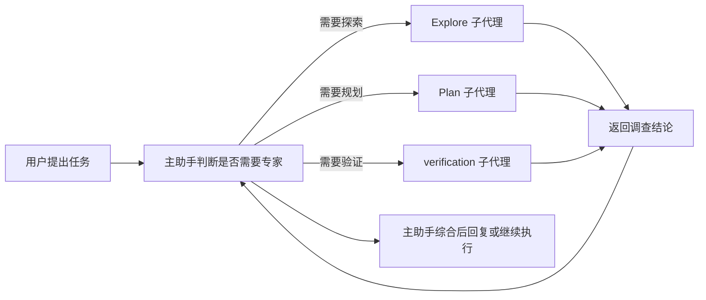

# Subagent 系统使用指南

这份文档面向第一次接触 CmbCowork 的同事。看完后应该能回答三个问题：

- Subagent 是什么，和普通聊天有什么区别。
- 它在系统里大概怎么实现，为什么能隔离任务。
- 日常工作里应该怎么让 CmbCowork 使用 Subagent。

## 一句话说明

Subagent 是“主助手临时请来的专家助手”。

当一个任务需要先查代码、先做方案、或者独立验证时，主助手可以把这部分工作交给一个专门的子代理。子代理独立完成任务后，把结论交回主助手，由主助手继续决策、修改代码或回复用户。

它不是一个长期运行的团队，也不是工作流脚本。它更像主助手临时叫来一个专家处理一个明确的小任务。

## 适合什么场景

适合使用 Subagent 的情况：

- 需要先快速了解代码结构。
- 需要找某个功能的入口和调用链。
- 需要先规划一个改造方案。
- 需要让另一个视角独立验证刚才的改动。
- 需要把一个复杂问题拆成几个互不干扰的小调查。
- 主助手正在实现功能，但还需要另一个上下文去查资料、跑验证或做审查。

不太适合使用 Subagent 的情况：

- 只是问一个简单问题。
- 只需要改一行文案。
- 任务本身没有拆分价值。
- 需要复杂多阶段编排、批量处理或结构化汇总，这种更适合 Dynamic Workflow。
- 需要多个 worker 长时间协作，这种更适合 Agent Team。

## 架构与运行机制

CmbCowork 的普通主助手本身可以调用一个 task/subagent 能力。主助手决定需要专业帮助时，会创建一个新的子代理运行环境，并把任务说明、角色约束、工具权限一起交给它。

核心链路可以理解为：



关键点：

- 子代理有独立上下文，不会把主对话的全部推理都混在一起。
- 子代理共享同一个工作区，所以能读同一份代码。
- 子代理的工具权限由角色决定，不是所有子代理都能写文件。
- 子代理返回的是中间结论，最终答复仍由主助手把关。
- 内置角色和自定义角色都走统一的 agent registry，因此普通模式和 workflow 的 `agentType` 可以共用同一套角色定义。

## 权限和隔离

不同子代理有不同权限。

| 子代理类型 | 主要用途 | 是否能改文件 | shell 权限 |
|---|---|---:|---|
| `Explore` | 代码探索、查入口、梳理链路 | 否 | 只读命令 |
| `Plan` | 设计方案、评估风险、拆步骤 | 否 | 只读命令 |
| `verification` | 跑测试、构建、验证改动 | 否 | 可执行验证命令 |
| 自定义只读角色 | 安全审查、前端审查、架构审查 | 取决于配置 | 取决于配置 |
| 自定义写入角色 | 专项实现 | 取决于配置 | 取决于配置 |

这意味着你可以放心要求：

```text
请用 Explore 子代理只读调查，不要修改任何文件。
```

系统会按角色限制它的工具，而不是只靠模型自觉。

## 内置子代理怎么用

### Explore：只读探索型专家

`Explore` 适合在正式动手前把情况摸清楚。

典型用途：

- 找功能入口。
- 找调用链。
- 找相关测试。
- 找最近改动影响范围。
- 梳理模块边界。

可复制示例：

```text
请先用 Explore 子代理调查登录流程，找出入口文件、核心函数、关键状态流转，不要修改代码。
```

```text
请用 Explore 子代理找出 workflow structured_output 的创建、调用、校验和错误处理链路，最后按文件列出来。
```

```text
我不确定这个报错从哪里来的。请用 Explore 子代理只读调查，找出最可能的 3 个来源。
```

```text
请用 Explore 子代理查看最近和 coordinator worker 相关的代码，说明主代理和 worker 的交互流程。
```

### Plan：只读规划型专家

`Plan` 适合先设计方案，不直接改代码。

典型用途：

- 评估需求复杂度。
- 比较实现方案。
- 设计迁移步骤。
- 制定测试策略。
- 判断风险和回滚方案。

可复制示例：

```text
请用 Plan 子代理设计一个低风险方案，把 workflow 的错误提示做得更清晰。先不要改代码。
```

```text
请让 Plan 子代理评估：这个功能应该放在 runtime 层、workflow 层还是 UI 层实现，并说明理由。
```

```text
请用 Plan 子代理给出三步以内的改造方案，目标是降低主进程同步卡顿风险。
```

```text
先让 Plan 子代理设计测试矩阵，包括单元测试、集成测试和手动验证用例。
```

### verification：独立验证型专家

`verification` 适合在改动后独立验收。

典型用途：

- 跑 `typecheck`、测试、构建。
- 检查是否漏测。
- 检查行为是否符合需求。
- 从审查视角找潜在回归。

可复制示例：

```text
改完后请用 verification 子代理独立验证，至少跑相关测试和 typecheck，并给出 PASS/FAIL。
```

```text
请让 verification 子代理只做复核，不要改代码。重点看是否有用户可见回归。
```

```text
请让 verification 子代理检查这次改动是否会影响普通聊天、Agent Team 和 Dynamic Workflow 三种模式。
```

```text
请用 verification 子代理验证新文档是否和现有实现一致，不要只看文案。
```

## 自定义子代理

项目可以定义自己的子代理角色。放在：

```text
.cmbcoworkagent/agents/<name>.md
```

一个自定义角色通常包含 frontmatter 和正文。

示例：前端体验审查员。

```markdown
---
description: 检查前端交互、布局、视觉状态和可用性问题
workload: read_only
---

你是前端体验审查员。请只读检查，不要修改文件。
重点关注：
- 移动端和桌面端布局是否一致。
- 错误状态、加载状态、空状态是否完整。
- 文案是否容易理解。
- 是否存在按钮文本溢出、元素重叠、交互不清晰。

最后按 P1/P2/P3 输出发现的问题。
```

示例：安全审计员。

```markdown
---
description: 检查认证、权限、输入校验和敏感信息泄露风险
workload: read_only
---

你是安全审计员。请只读检查，不要修改文件。
优先关注：
- 权限绕过。
- 路径穿越。
- 命令注入。
- 敏感信息落盘或日志泄露。
- 用户输入缺少校验。

输出必须包含证据文件和风险等级。
```

使用自定义角色时，可以直接在对话中点名：

```text
请用 security-reviewer 子代理检查这次改动有没有安全风险。
```

## 同事怎么操作

最简单的操作方式就是自然语言点名。

### 操作方式 1：让主助手自己判断

```text
这个问题比较复杂，请你需要时自行调用合适的子代理协助。
```

适合用户不熟悉角色名称时使用。

### 操作方式 2：明确指定角色

```text
请先用 Explore 子代理调查，再由你给出修复方案。
```

适合你知道要查什么时使用。

### 操作方式 3：强制只读

```text
请只用只读子代理调查问题，不要修改任何文件。
```

适合线上问题、敏感代码、改动前评估。

### 操作方式 4：要求独立验证

```text
实现完成后，请启动 verification 子代理独立验证，不要由实现者自证。
```

适合合并前检查。

## 典型业务样例

### 样例 1：定位 bug

```text
用户反馈导出报告偶尔失败。请先用 Explore 子代理调查导出链路和错误处理，再告诉我最可能原因。
```

预期过程：

1. Explore 查导出相关代码。
2. Explore 返回关键文件、调用链和疑点。
3. 主助手基于调查结果继续分析或修改。

### 样例 2：先规划再实现

```text
我要优化 workflow 运行历史页面。请先用 Plan 子代理设计方案，确认方案后再改代码。
```

预期过程：

1. Plan 输出方案、风险、测试建议。
2. 用户确认。
3. 主助手再开始实现。

### 样例 3：改动后独立验收

```text
刚才的修复完成后，请用 verification 子代理独立验证，必须说明跑了哪些命令，结果是什么。
```

预期过程：

1. verification 读取改动。
2. verification 跑相关命令。
3. verification 输出 PASS/FAIL/PARTIAL。

### 样例 4：多视角审查

```text
请用 Explore 子代理查实现链路，用 verification 子代理检查测试覆盖，然后你综合判断是否可以提交。
```

预期过程：

1. Explore 负责理解。
2. verification 负责验证。
3. 主助手综合决定。

## 常见误区

### 误区 1：把所有事情都交给一个子代理

不推荐：

```text
请让一个子代理调查、修改、验证、提交。
```

推荐：

```text
请先用 Explore 调查；你负责修改；最后用 verification 验证。
```

### 误区 2：简单任务也强行用子代理

不推荐：

```text
请用子代理帮我把按钮文案从 A 改成 B。
```

这种直接让主助手改更快。

### 误区 3：验证代理只听实现者描述

不推荐：

```text
让 verification 看一下实现者说的内容是否合理。
```

推荐：

```text
让 verification 直接读取当前工作区改动，并运行相关测试独立验证。
```

## 什么时候该升级到 Agent Team 或 Dynamic Workflow

如果你发现任务需要多个 worker 持续协作，例如“一个实现，一个验证，一个继续修复”，可以用 Agent Team。

如果你发现任务要处理几十个文件、几十个模块、很多条数据，可以用 Dynamic Workflow。

简单判断：

| 任务特点 | 推荐功能 |
|---|---|
| 请一个专家查一下 | Subagent |
| 多个 worker 异步协作 | Agent Team |
| 复杂多阶段编排、批量处理、结构化汇总 | Dynamic Workflow |
