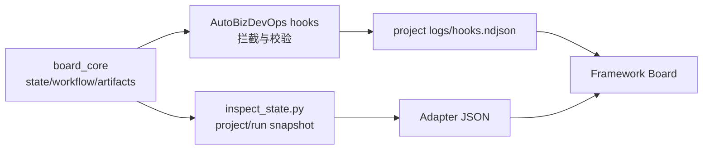

# 工程看板与 Skill Inspect 协议

## 0. 目标与边界

工程看板用于展示一个项目在某个 skill/plugin 驱动下的研发过程。框架提供通用的 `project -> run(feature)` 两级看板：

- 项目列表：展示所有已添加 project。
- 项目详情：展示该 project 下的 run(feature) 摘要。
- Run 详情：展示某个 feature 的状态、阶段、产物、hook 日志、绑定会话和代码变更。

核心目标是框架与 skill/plugin 解耦。框架不读取插件私有状态文件，不理解 checkpoint，不内置具体状态机、阶段、产物规则或 hook 机制。插件通过 adapter 把私有状态翻译为标准 JSON。

文档分为四部分：

1. **Framework Board Design**：框架侧功能与框架持久化数据。
2. **Skill Inspect Protocol**：skill/plugin adapter 必须遵守的输入输出协议。
3. **Framework ↔ Adapter Interaction**：双方交互流程和 JSON。
4. **AutoBizDevOps Adapter Appendix**：AutoBizDevOps 的适配细则。

---

# 1. Framework Board Design

本节只描述框架侧能力。这里的模型由框架创建、读写、缓存或合成，不要求 skill/plugin 输出。

## 1.1 框架侧功能点

### 项目列表

项目列表只读取框架持久化的 Project Metadata，不强制实时调用 adapter。这样列表打开速度稳定，也避免大量项目同时触发插件扫描。

项目列表展示：

- 项目 ID、名称、描述。
- 项目编号、产品/系统编号。
- 工作区路径。
- 绑定 skill/plugin。
- 创建时间、更新时间、项目状态。
- 可选的上次 feature 数量缓存。

### 新建项目

新建项目只创建框架 Project Metadata，不创建 feature，不初始化插件私有目录。Feature 的创建、初始化和状态推进仍由 skill/plugin 完成。

当前阶段 skill/adapter 注册发现可以先写死在框架内置配置中。用户无需手填 skill 相关字段。

### 项目详情

用户进入项目详情时，框架调用该项目绑定的 adapter `project` mode，懒加载项目下的 run(feature) 列表。

### Run 详情

用户进入 run 详情时，框架调用 adapter `run` mode，获取 workflow、节点、状态、产物和 hook 日志引用。

框架再补充：

- 绑定会话。
- hook 日志聚合结果。
- git diff 代码变更视图。
- UI 加载、刷新、错误状态。

### Hook 日志展示

唯一方案：

1. Skill/plugin 的 hook 执行时写标准 NDJSON 日志。
2. Adapter 在 run snapshot 中声明 `hookLogRefs`。
3. 框架读取 `hookLogRefs`，按 `slug + nodeId` 聚合到 Board ViewModel。
4. 框架不执行 hook，不参与拦截，不根据 hook 日志推断节点状态。

### 代码变更

代码变更不是插件产物，也不绑定到某个阶段。框架基于 workspace 的 git 状态独立展示。

推荐框架侧读取：

- `git status --short`
- `git diff --stat`
- 按需 `git diff -- <path>`

## 1.2 框架持久化数据

框架可以持久化：

- Project Metadata。
- Session Binding。
- 可选的项目列表缓存，例如上次 feature 数量、上次 inspect 时间。

框架不应持久化为权威状态：

- 插件 checkpoint 或私有状态。
- 当前节点。
- 节点完成状态。
- 产物存在、缺失、校验结果。
- Hook 执行结果摘要。
- 代码 diff 快照。

这些内容由 adapter、hook log 和 git diff 实时计算或短期缓存。

## 1.3 内置 Skill Registry

当前阶段 ，创建 project 时，skill registry 可以写死：

```json
{
  "skills": [
    {
      "id": "autobizdevops",
      "name": "AutoBizDevOps",
      "version": "1.1.0",
      "description": "Biz / Dev / Ops 全流程研发技能",
      "adapter": {
        "command": "python",
        "args": ["inspect_state.py"]
      },
      "supportedSchemaVersions": ["skill.inspect.v1"]
    }
  ]
}
```

项目创建时，框架从 registry 中选择 skill，并把 `skill.id`、`skill.name`、`skill.version` 和 `adapter` 快照保存到项目元数据中。后续 registry 变化不应隐式改变旧项目绑定的 adapter。

## 1.4 Project Metadata

新建项目是框架内部流程，不属于 adapter 协议。框架负责展示表单、校验输入、生成 `projectId`，并持久化 Project Metadata。Skill 相关字段由框架内置 registry 写死带出，用户无需手填。

项目创建表单必填输入：

| 字段 | 说明 |
| --- | --- |
| `projectName` | 项目名称，由用户填写 |
| `projectCode` | 项目编号，由用户填写 |
| `description` | 项目描述，由用户填写 |
| `product.code` | 产品/系统编号，由用户填写 |
| `product.name` | 产品/系统名称，由用户填写 |
| `workspace.path` | 项目工作区路径，由用户通过工作区文件夹选择器选择 |

框架生成或带出的字段：

| 字段 | 说明 |
| --- | --- |
| `projectId` | 框架内部稳定 ID，由框架生成 |
| `skill.id` | 使用的技能 ID，由内置 Skill Registry 写死带出 |
| `skill.name` | 使用的技能名称，由内置 Skill Registry 写死带出 |
| `skill.version` | 使用的技能版本，由内置 Skill Registry 写死带出 |
| `skill.adapter.command` | Adapter 命令，由内置 Skill Registry 写死带出 |
| `skill.adapter.args` | Adapter 参数，由内置 Skill Registry 写死带出 |
| `lifecycle.status` | 项目状态，创建时固定为 `active` |
| `lifecycle.createdAt` | 创建时间，由框架生成 |
| `lifecycle.updatedAt` | 更新时间，创建时等于 `createdAt` |

Project Metadata 示例：

```json
{
  "project": {
    "projectId": "uuid",
    "projectCode": "NBAS4F",
    "name": "评论能力改造",
    "description": "支持评论创建、列表刷新和权限校验",
    "systemCode": "LF39.18",
    "systemName": "WE运营管理平台",
    "workspace": "/Users/sixinjian/CmbCoworkAgent",
    "harness-adapter": {
      "id": "autobizdevops",
      "name": "AutoBizDevOps",
      "version": "1.1.0",
      "type": "plugin"
    },
    "userId": "011343534",
    "userName": "张三",
    "lifecycle": {
      "status": "active",
      "createdAt": "2026-05-11T10:00:00+08:00",
      "updatedAt": "2026-05-11T10:00:00+08:00",
      "archivedAt": null
    }
  }
}
```

`projectId` 不应依赖项目名称、产品编号或 workspace 路径生成，避免重命名和迁移导致引用失效。

创建 Project Metadata 时，框架不会调用 adapter，也不会初始化插件私有目录。Feature 创建、初始化和状态推进仍由 skill/plugin 在后续会话中完成。

## 1.5 ProjectListItem

项目列表页建议使用 Project Metadata 渲染：

```json
{
  "projectId": "uuid",
  "name": "评论能力改造",
  "description": "支持评论创建、列表刷新和权限校验",
  "projectCode": "TN5C24",
  "productCode": "LF39.18",
  "productName": "WE运营管理平台",
  "workspace": "/Users/sixinjian/CmbCoworkAgent",
  "skill": {
    "id": "autobizdevops",
    "name": "AutoBizDevOps"
  },
  "lifecycle": {
    "status": "active",
    "createdAt": "2026-05-11T10:00:00+08:00",
    "updatedAt": "2026-05-11T10:00:00+08:00"
  },
  "cachedRunSummary": {
    "featureCount": null,
    "activeFeatureCount": null,
    "lastInspectedAt": null
  }
}
```

`cachedRunSummary` 是可选缓存，用于展示上次进入项目后得到的 feature 数量。它不是权威状态；项目列表页不为了实时 feature 数量而强制调用 adapter。

## 1.6 Session Binding

会话绑定由框架维护，adapter 不需要输出。

```json
[
  {
    "projectId": "uuid",
    "threadId": "abc",
    "createdAt": "2026-05-11T10:00:00+08:00",
    "lastActiveAt": "2026-05-11T10:28:00+08:00",
    "slug": "feature-a"
  }
]
```

`projectId + slug` 用于避免不同项目下 slug 冲突。

## 1.7 GitDiffViewModel

代码变更由框架自行分析，不属于 adapter 协议。

```json
{
  "available": true,
  "summary": "3 files changed, 48 insertions(+), 12 deletions(-)",
  "files": [
    {
      "path": "src/main/java/example/Foo.java",
      "status": "modified",
      "additions": 20,
      "deletions": 5
    }
  ]
}
```

## 1.8 RunDetailViewModel

框架给前端的 Run 详情 ViewModel 是合成结果，不等同于 adapter 原始输出。

```json
{
  "project": {
    "projectId": "uuid",
    "name": "评论能力改造",
    "projectCode": "TN5C24",
    "productCode": "LF39.18"
  },
  "adapterSnapshot": {
    "schemaVersion": "skill.inspect.v1",
    "mode": "run",
    "generatedAt": "2026-05-11T10:30:00+08:00"
  },
  "run": {
    "slug": "feature-a",
    "nodes": [
      {
        "id": "dev.plan",
        "artifacts": [],
        "hooks": []
      }
    ],
    "unmatchedHooks": []
  },
  "sessions": [],
  "gitDiff": {
    "available": true,
    "summary": "",
    "files": []
  }
}
```

合成规则：

- `project` 来自框架 Project Metadata。
- `adapterSnapshot` 来自 run mode，仅表示原始快照来源。
- `run.nodes[].artifacts` 来自 adapter。
- `run.nodes[].hooks` 由框架读取 `hookLogRefs` 后按 `nodeId` 聚合。
- `sessions` 来自框架维护的会话绑定。
- `gitDiff` 来自框架对 workspace 执行 git diff 分析。

## 1.9 刷新与监听策略

| 视图 | 数据来源 | 刷新方式 |
| --- | --- | --- |
| 项目列表 | 框架 Project Metadata | 框架元数据变更时刷新 |
| 项目详情 run 列表 | `project` mode Adapter Snapshot | 点击展开 feature 列表时加载；监听 `watchRefs` 后重新调用 project mode |
| Run 详情阶段和产物 | `run` mode Adapter Snapshot | 进入 run /feature 详情时加载；监听 `watchRefs` 后重新调用 run mode |
| Hook 日志 | `run.hookLogRefs` | 框架按 offset tail NDJSON，增量聚合到 ViewModel |
| 代码变更 | git diff | 进入 run 时加载；workspace git 状态变化或手动刷新 |

`watchRefs` 只表示“这些路径变化时值得刷新”。框架不得解析 `watchRefs` 指向的插件私有文件内容，只能把变化作为重新调用 adapter 或重新读取 hook log 的触发信号。

如果 adapter 没有返回 `watchRefs`，框架可以使用可见页面轮询或手动刷新按钮。轮询频率由框架体验决定，不进入插件协议。

---

# 2. Skill Inspect Protocol

本节只描述 skill/plugin adapter 必须遵守的协议。

## 2.1 Adapter 责任

Adapter 是插件暴露给框架的只读 inspect 接口，由技能/插件维护。Adapter 可以读取插件私有文件并计算状态，但对框架输出的 JSON 必须是协议定义的稳定结构。

Adapter 必须：

- 只读 workspace，不修改任何文件。
- 把插件私有状态翻译成标准 JSON。
- 声明 hook log 路径，而不是把 hook 结果直接写入节点。
- 声明可选 `watchRefs`，供框架监听变化。

Adapter 不负责：

- 创建项目。
- 创建 feature。
- 修改插件运行过程中的私有状态。
- 执行 hook。
- 分析 git diff。

## 2.2 Adapter CLI

推荐一个 inspect 命令支持两个 mode：

```bash
python inspect_state.py --workspace /path/to/project --mode project
python inspect_state.py --workspace /path/to/feature --mode run
```

参数：

| 参数 | 必填 | 说明 |
| --- | --- | --- |
| `--workspace` | 是 | 项目工作目录 |
| `--mode` | 是 | `project` 视图或 `run`视图 |
|               |      |                            |
|               |      |                            |

执行约束：

- stdout 只输出 JSON。
- stderr 可输出调试信息，但框架默认不展示给用户。
- 框架执行层必须设置超时、输出大小限制和失败降级策略。
- Adapter 失败时，框架展示“无法读取插件状态”，不得猜测 run 状态。

## 2.3 Project Mode Snapshot

Project mode 用于回答“这个项目下有哪些 run(feature)，各自状态的缩略”。

```json
{
  "schemaVersion": "skill.inspect.v1",
  "generatedAt": "2026-05-11T10:30:00+08:00",
  "runs": [
    {
      "featureName": "feature-a",
      "featureId": "feature-a",
      "version": "1",
      "currentNodeId": "",
      "status": ""
    }
  ]
}
```

Project mode 不返回完整节点和产物。用户进入 run 详情页时，框架再调用 run mode。

## 2.4 Run Mode Snapshot

Run mode 返回某个 run 的完整看板快照。

```json
{
  "schemaVersion": "skill.inspect.v1",
  "mode": "run",
  "generatedAt": "2026-05-11T10:30:00+08:00",
  "workflow": {},
  "run": {}
}
```

## 2.5 Workflow

`workflow` 是 skill 定义的流程图。当前前端可按 `order` 做线性展示，后续可扩展为 DAG、并行节点、条件分支。

```json
{
  "workflow": {
    "id": "autobizdevops.default",
    "version": "1.0.0",
    "kind": "graph",
    "nodes": [
      {
        "id": "biz.discuss",
        "label": "需求澄清",
        "group": "Biz",
        "order": 10,
        "description": "沉淀需求讨论稿",
        "states": [
          {
            "id": "not_started",
            "label": "未开始",
            "uiKind": "pending"
          },
          {
            "id": "in_progress",
            "label": "进行中",
            "uiKind": "active"
          },
          {
            "id": "done",
            "label": "已完成",
            "uiKind": "done"
          }
        ],
        "artifactDefinitions": [
          {
            "id": "prd_discuss",
            "label": "需求讨论稿",
            "kind": "file",
            "required": true
          }
        ],
        "hookDefinitions": [
          {
            "id": "biz-discuss-validate",
            "label": "需求澄清产物校验",
            "event": "PostSkillUse",
            "required": true
          }
        ]
      }
    ],
    "transitions": [
      {
        "id": "biz-discuss-to-prd",
        "from": {
          "nodeId": "biz.discuss",
          "state": "done"
        },
        "to": {
          "nodeId": "biz.prd",
          "state": "in_progress"
        }
      }
    ]
  }
}
```

说明：

- `workflow.nodes` 是技能定义，描述所有可展示节点。
- `workflow.nodes[].artifactDefinitions` 只描述节点可能产生哪些产物，不要求包含路径。
- `workflow.nodes[].hookDefinitions` 只描述节点可能出现哪些 hook 展示记录，不代表框架要执行 hook。
- `workflow.transitions` 描述状态机关系，框架不基于它推断当前状态。
- 前端可以使用 `workflow.nodes` 展示技能全流程说明，但实际运行态以 `run.nodes` 为准。

## 2.6 Run

```json
{
  "run": {
    "featureId": "feature-a",
    "featureName": "feature-a",
    "hookLogRefs": [
      {
        "id": "default",
        "path": ".autobizdevops/logs/hooks.ndjson",
        "format": "ndjson"
      }
    ],
    "watchRefs": [
      {
        "path": ".autobizdevops/STATE.md",
        "purpose": "run-state"
      },
      {
        "path": ".autobizdevops/features/feature-a",
        "purpose": "artifacts"
      },
      {
        "path": ".autobizdevops/logs/hooks.ndjson",
        "purpose": "hook-log"
      }
    ],
    "position": {
      "currentNodeId": "dev.code",
      "currentNodeState": "not_started",
      "progressIndex": 4,
      "totalNodes": 10
    },
    "nodes": []
  }
}
```

说明：

- `hookLogRefs` 是 hook 展示日志声明。框架只读取 adapter 声明的日志路径，不硬编码插件目录。
- `watchRefs` 是可选的刷新触发路径声明。框架监听变化后重新调用 run mode 或重新读取 hook log。
- `overallStatus` 由 adapter 决定，框架不推断。
- `position` 由 adapter 决定，前端用它高亮当前节点和计算进度。
- `nodes` 是前端实际渲染的节点实例列表。

## 2.7 Run Nodes

Adapter Snapshot 中的节点按 `order` 渲染，点击节点展示 `artifacts`。Hook 展示记录由框架读取 hook log 后补充到 Board ViewModel。

```json
{
  "id": "dev.plan",
  "label": "计划生成",
  "group": "Dev",
  "order": 30,
  "status": {
    "id": "done",
    "label": "已完成",
    "uiKind": "done",
    "isCurrent": false
  },
  "artifacts": [
    {
      "id": "plan",
      "name": "执行计划",
      "path": ".autobizdevops/features/feature-a/PLAN.md",
      "exists": true,
      "updatedAt": "2026-05-11T10:15:00+08:00"
    }
  ]
}
```

说明：

- `node.status` 由 adapter 直接给出，框架不根据产物或 hook 推断。
- `artifacts` 是节点关联的插件产物，不包含代码变更。
- `path` 是 workspace 相对路径，用于前端打开文件；框架应限制路径不得逃逸 workspace。

## 2.8 状态显示约定

`status.id` 和 `status.label` 由 skill 自己决定。

为了让前端稳定选择颜色、图标和基础样式，约定 `uiKind` 使用有限枚举：

```text
pending | active | done | blocked | warning | skipped | archived | unknown | ok | error
```

框架和前端不根据 checkpoint、产物或 hook 计算 `uiKind`，只负责渲染。
代码文件 diff 不放入 `artifacts`。框架通过 git diff 独立展示代码变更。

## 2.9 Hook Log NDJSON

Hook 展示日志用于把 skill/plugin 在运行过程中的关键检查、拦截、校验结果提示给用户。

重要边界：

- 框架不关心 hook 如何注册、何时触发、是否拦截、是否阻断。
- 插件自己的 hook 执行时，应打印或写入符合协议的日志。
- 框架只读取日志并呈现 hook 执行结果。
- Hook 日志必须能关联到 `nodeId`，否则只能显示在 run 级别的“未归类事件”区域。

Adapter 应通过 `run.hookLogRefs` 声明框架可读取的 hook 日志路径。日志建议使用 NDJSON，每行一条 JSON：

```json
{"ts":"2026-05-11T10:16:00+08:00","sessionId":"thread-id","workspacePath":"/Users/sixinjian/CmbCoworkAgent","skill":"autobizdevops","featureId":"feature-a","nodeId":"dev.plan","hookId":"autodev-plan-postcheck","label":"Plan 产物自检","event":"PostSkillUse","status":"passed","decision":"pass","exitCode":0,"durationMs":830,"summary":"POST_SKILL_PASS skill=autodev-plan"}
```

推荐字段：

| 字段 | 说明 |
| --- | --- |
| `ts` | 事件时间，ISO 8601 |
| `featureId` | 对应 run(feature) |
| `nodeId` | 对应 workflow/run 节点 |
| `hookId` | 插件内 hook 标识 |
| `label` | 用户可读名称 |
| `event` | 插件自己的触发事件名，例如 `PreToolUse`、`PostSkillUse` |
| `status` | `passed`、`failed`、`blocked`、`warning`、`skipped`、`unknown` |
| `decision` | 可选，插件自己的决策结果，例如 `pass`、`block` |
| `exitCode` | 可选，hook 命令退出码 |
| `summary` | 用户可读摘要 |
| `details` | 可选，结构化详情或短文本 |

框架聚合规则：

1. Adapter 只声明 `run.hookLogRefs`，不负责输出 `run.nodes[].hooks`。
2. 框架读取 `run.hookLogRefs` 声明的 NDJSON 日志。
3. 框架按 `slug + nodeId` 把日志聚合到 Board ViewModel 的对应节点。
4. 无法匹配 `nodeId` 的日志放入 run 级别“未归类事件”区域。
5. 框架不基于 hook 日志推断节点状态，只做展示和按需 tail。

## 2.11 Adapter 性能与刷新约束

第一版采用 `inspect_state.py` 作为只读快照接口。该方式可以接受，但必须限制调用频率和单次计算成本。以下约束为 P0。

框架侧 P0 要求：

- 项目列表只读取框架 Project Metadata，不调用 adapter。

- Project mode 只在用户展开项目、手动刷新项目详情，或项目级 `watchRefs` 变化后调用。

- Run mode 只在用户进入 run 详情、手动刷新 run，或当前 run 的 `watchRefs` 变化后调用。

- Hook log 变化只触发 NDJSON 增量 tail，不触发完整 adapter 调用。

- 框架监听到 `watchRefs` 变化后，应先使相关缓存失效，再按当前可见视图决定是否重新调用 adapter。

- 文件监听事件必须 debounce，建议窗口为 300-1000ms，避免一次 skill 执行中的连续写文件触发多次刷新。

  Adapter 侧 P0 要求：

- Adapter 必须只读，不得修改 STATE、创建目录、写产物或触发 skill 流程。
- Project mode 只返回 project 下面的 run/feature 列表、轻量状态、项目级 `watchRefs`；不得深度读取所有 run 的 artifact 内容。
- Run mode 只读取当前 `feature` 对应的状态和产物；不得扫描无关 feature。
- Adapter 不得执行编译、测试、网络请求、依赖安装或其他昂贵命令。
- 大文件 artifact 只返回路径、状态、简短摘要和必要元数据，不返回全文内容。
- Adapter stdout 只输出 JSON；框架执行层必须设置超时和输出大小限制。
- Adapter 局部读取失败时，应尽量返回可降级展示的 snapshot，并给出用户可读提示；只有 workspace 不可读、参数错误、adapter 异常等情况才整体失败。

---

# 3. Framework ↔ Adapter Interaction

本节描述框架和 adapter 的交互流程，以及两边传递或合成的 JSON。

## 3.1 展开项目详情下的 feature 列表

Framework -> Adapter：

//todo 这里应该改为传/Users/sixinjian/CmbCoworkAgent/project01 + projectId，不去管具体的路径查询和解析

```bash
python inspect_state.py --workspace /Users/sixinjian/CmbCoworkAgent/project01/.autobizdevops/features/feature01 --mode project
```

Adapter -> Framework：

```json
{
  "schemaVersion": "skill.inspect.v1",
  "mode": "project",
  "generatedAt": "2026-05-11T10:30:00+08:00",
  "runs": [],
  "watchRefs": []
}
```

Framework 合成项目详情 ViewModel

## 3.2 打开 Run（feature) 详情

Framework -> Adapter：

```bash
python inspect_state.py --workspace /Users/sixinjian/CmbCoworkAgent/project01/.autobizdevops/features/feature01 --mode run
```

Adapter -> Framework：

```json
{
  "schemaVersion": "skill.inspect.v1",
  "mode": "run",
  "generatedAt": "2026-05-11T10:30:00+08:00",
  "workflow": {},
  "run": {
    "slug": "feature-a",
    "nodes": [],
    "hookLogRefs": []
  }
}
```

Framework 再读取：

- `hookLogRefs` 对应 NDJSON。
- 框架会话绑定。
- git diff。


## 3.3 Hook 更新

Skill hook -> NDJSON：

```json
{"ts":"2026-05-11T10:16:00+08:00","slug":"feature-a","nodeId":"dev.plan","hookId":"autodev-plan-postcheck","label":"Plan 产物自检","event":"PostSkillUse","status":"passed","decision":"pass","exitCode":0,"summary":"POST_SKILL_PASS skill=autodev-plan"}
```

Framework tail 该日志后，按 `slug + nodeId` 聚合到 RunDetailViewModel：

```json
{
  "run": {
    "slug": "feature-a",
    "nodes": [
      {
        "id": "dev.plan",
        "hooks": [
          {
            "hookId": "autodev-plan-postcheck",
            "label": "Plan 产物自检",
            "status": {
              "id": "passed",
              "label": "通过",
              "uiKind": "ok"
            },
            "summary": "POST_SKILL_PASS skill=autodev-plan"
          }
        ]
      }
    ]
  }
}
```

## 3.4 刷新触发

Adapter Snapshot 返回 `watchRefs`：

```json
{
  "watchRefs": [
    {
      "path": ".autobizdevops/STATE.md",
      "purpose": "run-state"
    },
    {
      "path": ".autobizdevops/logs/hooks.ndjson",
      "purpose": "hook-log"
    }
  ]
}
```

框架监听这些路径变化：

- `run-state`：重新调用 adapter。
- `artifacts`：重新调用 run mode。
- `hook-log`：按 offset 读取新增 NDJSON 行。

框架不解析 `watchRefs` 指向的插件私有文件内容。

---

# 4. AutoBizDevOps Adapter Appendix

本节只描述 AutoBizDevOps 的适配细节。这些内容不进入框架通用逻辑。

## 4.1 Adapter 位置

推荐 adapter 文件位置：

```text
AUTOBIZDEVOPS_SKILL/inspect_state.py
```

框架内置 registry 可以用插件根目录解析该脚本路径。Adapter 执行时读取 `--workspace` 指向的项目工作区，不自动修改 workspace，不自动执行 `init_workspace.py`。

```bash
python inspect_state.py --workspace /path/to/workspace  --mode project
python inspect_state.py --workspace /path/to/workspace  --mode run
```

## 4.2 AutoBizDevOps 私有实现

AutoBizDevOps 应把 .autobizdevops/作为单个 project容器。推荐目录结构：

```text
{workspace}/
    {projectId}/
    	.autobizdevops/
        PROJECT.md
        STATE.md
        features/
          {slug}/
        archive/
        logs/
          hooks.ndjson
        issues/
        review/
```

## 4.3 Project 初始化断点

框架创建 project 后，只持久化 Project Metadata，不调用 adapter，也不直接初始化 AutoBizDevOps 目录。AutoBizDevOps 的初始化仍由用户发起 skill 会话完成。

这是有意设计：

- `inspect_state.py` 必须保持只读，不能承担初始化或创建 feature 的职责。
- 框架不应直接执行 `init_workspace.py` 或创建 `.autobizdevops` 内部目录。
- 初始化、feature 创建、STATE 推进仍属于 AutoBizDevOps 的业务流程。

看板需要明确展示 project 从“已登记”到“skill 已初始化”的过渡状态。推荐状态：

| 状态 | 含义 | 展示建议 |
| --- | --- | --- |
| `registered` | 框架已创建 Project Metadata | 项目可见，但尚未读取到 skill 状态 |
| `skill_not_initialized` | adapter 未找到 {projectId}/autobizdevops/STATE.md` | 提示用户启动或绑定 AutoBizDevOps 会话完成初始化 |
| `no_runs` | project 已初始化，但没有 feature | 展示空 feature 列表 |
| `active` | 已发现 feature/run | 正常展示 run 列表 |

框架可以提供“启动/绑定 Skill 会话”入口，但该入口只负责携带 project 元数据生成会话上下文，例如 `projectId`、项目名称、项目编号、系统编号、workspace、skillId。真正的初始化仍由 AutoBizDevOps 会话执行。

初始化完成后，AutoBizDevOps 应在 project-scoped 路径下创建 `PROJECT.md`、`STATE.md` 和必要目录。Adapter 下一次 project mode 快照即可返回 `projectState.id=initialized` 或 `no_runs`。

## 4.4 Workflow 节点

推荐 AutoBizDevOps workflow 节点：

| Node ID | Label | 主要产物 |
| --- | --- | --- |
| `biz.discuss` | 需求澄清 | `PRD_DISCUSS.md` |
| `biz.prd` | PRD 生成 | `PRD.md` |
| `dev.plan` | 计划生成 | `API_CONTRACT.openapi.yaml`、`PLAN.md`、`SQL_DESIGN.md` |
| `dev.code` | 代码实现 | virtual 摘要 |
| `dev.review` | 需求实现评审 | `completion-proposal.json`、`REQUIREMENTS_EVAL.md` |
| `dev.utest` | 单元测试 | `UNIT_TEST_REPORT.md`、`test-output.log` |
| `dev.e2e` | E2E | `E2E_TEST_CASES.yaml`、`E2E_REPORT.md`、`e2e-run.log` |
| `dev.verify` | 验收汇总 | `VERIFY_REPORT.md` |
| `ops.cicd` | CI/CD | `CICD_CHECKLIST.md`、`PR_BODY.md` |
| `ops.archive` | 归档 | virtual 摘要 |

AutoBizDevOps 的 checkpoint 到节点状态映射由 adapter 自己维护。框架不需要知道 checkpoint 名称。

当前适配建议采用根入口和 hook 代码的流程口径：`verify_done -> cicd_in_progress`。如果 `autoops-cicd/SKILL.md` 中存在旧口径，以根入口和 hook 状态转移为准。

## 4.5 Feature 发现规则

AutoBizDevOps adapter 负责消化 project-scoped `.autobizdevops` 内部状态与目录之间的不一致，框架只接收稳定的 run 列表。

Project mode 的 feature 发现优先级：

1. 读取 `{projectId}/.autobizdevops/STATE.md` 中的 Feature 行，作为主索引。
2. 扫描 `{projectId}/.autobizdevops/features/*`，补充“目录存在但 STATE 无记录”的 orphan feature。
3. 扫描 `{projectId}/.autobizdevops/archive/*`，补充 archived feature。
4. 同一 feature 多来源时按优先级合并：`STATE active row > active feature dir > archive dir`。

Adapter 不应因为单个 feature 状态异常导致整个 project mode 失败。只有 workspace 不可读、adapter 代码异常或 STATE 文件完全无法解析时，才返回 adapter 调用失败。

不一致状态处理建议：

| 场景 | Adapter 输出 |
| --- | --- |
| STATE 有 feature 行，目录存在 | 正常 active run |
| STATE 有 feature 行，目录缺失 | 输出 run，`overallStatus.uiKind=warning`，summary 写“状态存在，但产物目录缺失” |
| 目录存在，STATE 无 feature 行 | 输出 run，`overallStatus.uiKind=warning`，summary 写“发现产物目录，但未登记到状态文件” |
| archive 有 feature，active 无 | 输出 archived run，`location=archived` |
| active 和 archive 同 slug 同时存在 | active 优先，summary 可提示“存在同名归档记录” |
| STATE checkpoint 未知 | 输出 run，`overallStatus.uiKind=unknown`，summary 写“未知内部状态，adapter 无法映射到流程节点” |
| `.autobizdevops/projects/{projectId}` 未初始化 | project mode 返回空 `runs`，并给项目级状态 `skill_not_initialized` |


## 4.6 Run Mode 异常展示

当用户点击异常 run 时，adapter 仍应尽量返回可展示快照：

- 目录缺失：返回 workflow 和 run 基本信息；`nodes` 可以为空，或全部标记为 `unknown` / `pending`；summary 给出修复提示。
- STATE 缺失但目录存在：adapter 可以根据产物存在情况生成 best-effort 节点状态，但必须标记 `sourceHealth.id=orphan_feature_dir`。
- archive run：返回 `location=archived`，只读展示可见产物；不表达继续推进流程的动作。
- checkpoint 未知：返回 workflow 和 run 基本信息，当前节点为 `unknown`，提示用户检查 AutoBizDevOps 状态文件。

Adapter 不应自动修复这些异常，也不应修改 STATE 或创建目录。修复动作必须由用户触发 skill/plugin 流程完成。

## 4.7 Hook 与 Inspect 共享核心逻辑

AutoBizDevOps 当前 hook 已经承担了大量状态与产物校验职责。看板 adapter 也需要向框架提供状态、阶段、产物与最近 hook 结果。如果 hook 和 inspect 各自维护一套解析与校验逻辑，后续每次新增 checkpoint、产物或校验规则都需要改两处，容易产生漂移。

推荐做法是：在 AutoBizDevOps skill 内部抽取一层只读、无副作用的共享核心逻辑，hook 与 `inspect_state.py` 都调用这层核心逻辑，但框架完全不知道这层实现。

推荐结构：

```text
AUTOBIZDEVOPS_SKILL/
  inspect_state.py
  board_core/
    state.py
    workflow.py
    artifacts.py
    hook_log.py
```

各模块职责：

| 模块 | 职责 |
| --- | --- |
| `state.py` | 读取和解析 project-scoped `STATE.md`，维护 checkpoint 常量、合法流转、Feature 行解析、状态健康度判断 |
| `workflow.py` | 维护 AutoBizDevOps checkpoint 到 board node 的映射、当前节点推导、节点状态推导 |
| `artifacts.py` | 复用各阶段 artifact-check 配置和校验函数，输出结构化 artifact 状态 |
| `hook_log.py` | 提供 hook NDJSON 写入 helper，供现有 hook 在结束时记录展示事件 |

现有 hook 中可下沉复用的内容：

| 来源 | 可复用内容 |
| --- | --- |
| `hooks/check_state_done.py` | `KNOWN_CHECKPOINTS`、`ALLOWED_NEXT`、`INITIAL_CHECKPOINTS`、STATE 表格解析、状态流转校验 |
| `hooks/check_autodev_lifecycle.py` | checkpoint 与阶段开始/结束的映射、状态变更识别、阶段 precheck/postcheck 调度口径 |
| `skills/autodev/hooks/common.py` | artifact 配置加载、feature 文件路径定位、任务状态统计等通用工具 |
| `skills/autodev/hooks/artifact_check.py` | OpenAPI、PLAN、SQL、需求评审等产物校验函数 |
| `skills/autobiz/scripts/biz_validate.py` | Biz 阶段 PRD 讨论稿、PRD 与 STATE 同步校验逻辑，可拆为只读校验函数后复用 |

约束：

- `inspect_state.py` 不直接执行 hook 脚本。hook 脚本面向拦截协议，包含 stdin 解析、退出码、stdout/stderr 约定，直接执行会把框架展示路径和拦截机制重新耦合。
- 共享核心函数必须是只读、确定性、可超时控制的；不得修改 STATE、创建目录、写产物或触发 skill 流程。
- 昂贵或环境依赖强的检查不应在 inspect 中现场执行。例如 `hooks/check_code_compile.py` 的 Maven compile 结果应通过最近 hook log 或未来显式产物展示，不应由 adapter 每次刷新时重新编译。
- hook wrapper 负责把共享核心返回的校验结果转换为原有 hook 拦截行为；inspect adapter 负责把同一批结果转换为本协议 JSON。
- 共享核心是 AutoBizDevOps 私有实现，不进入框架协议。框架仍然只消费 adapter 输出和 hook NDJSON。

推荐数据流：



这样 AutoBizDevOps 后续新增阶段、产物或校验规则时，优先修改共享核心和配置；hook 与 adapter 只保留协议转换层，避免重复维护。

## 4.8 Hook Logger 改造建议

AutoBizDevOps 当前 hook 主要通过 stdout/stderr 返回执行结果，部分调试日志写到临时目录。为了让看板稳定展示，需要增加统一 hook logger helper：

- 每个 hook 执行结束后 append 一行 NDJSON 到 `{projectId}/.autobizdevops/logs/hooks.ndjson`。
- 日志字段遵守本协议 `Hook Log NDJSON`。
- 日志行应包含 `projectId`，用于同一 workspace 多 project 时过滤和排查。
- hook 原有拦截、退出码、stdout JSON 行为可以保留。
- hook log 写入失败不应影响原 hook 业务判断，但应尽量输出 stderr 方便排查。

---

# 5. 当前后置项

以下内容先不进入当前协议：

- Artifact 打开/预览规则。
- `diagnostics`、`blockedBy` 等更复杂的诊断结构。
- 多 skill 版本迁移策略。
- 动态 skill registry / 插件发现机制。
